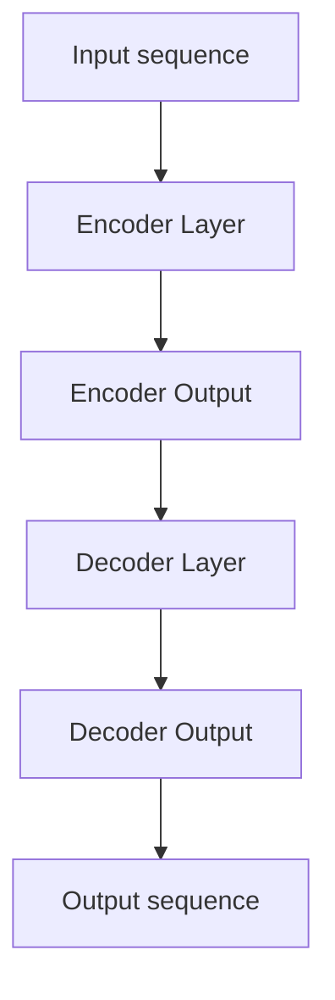

                 

### Transformer大模型实战

#### 摘要

Transformer大模型作为当前深度学习领域中最具革命性的技术之一，在自然语言处理、计算机视觉和语音识别等多个领域展现出了卓越的性能。本文将详细介绍Transformer大模型的核心概念、算法原理、数学模型和具体操作步骤，并通过实际项目案例深入剖析其代码实现过程。此外，文章还将探讨Transformer大模型在实际应用场景中的表现，并推荐相关学习资源和开发工具。通过本文的阅读，读者将能够全面掌握Transformer大模型的实战技巧，为未来的研究与应用奠定坚实基础。

---

#### 1. 背景介绍

自2017年提出以来，Transformer大模型已经成为深度学习领域的一个里程碑。相较于传统的循环神经网络（RNN）和卷积神经网络（CNN），Transformer大模型通过自注意力机制（Self-Attention）和多头注意力（Multi-Head Attention）等创新设计，在处理序列数据时展现出了更高的灵活性和效率。

在自然语言处理领域，Transformer大模型已被成功应用于机器翻译、文本摘要、情感分析等多个任务，取得了显著的性能提升。例如，在机器翻译任务中，基于Transformer的模型如Google的BERT、OpenAI的GPT系列模型等，已经成为业界标准的解决方案。

在计算机视觉领域，Transformer大模型也逐渐崭露头角。通过将图像像素视为序列处理，Transformer大模型在图像分类、目标检测、图像生成等任务中取得了与CNN相媲美的表现。例如，OpenAI提出的DALL-E模型，利用Transformer大模型实现了基于文本描述的图像生成。

在语音识别领域，Transformer大模型同样表现不俗。相较于传统的基于CNN和RNN的模型，基于Transformer的语音识别模型在处理长序列、降低错误率等方面具有明显优势。

总体来说，Transformer大模型的出现不仅颠覆了传统的深度学习模型设计，也为未来深度学习技术的发展指明了新的方向。

---

#### 2. 核心概念与联系

在深入了解Transformer大模型之前，我们需要先理解几个核心概念，包括自注意力机制（Self-Attention）、多头注意力（Multi-Head Attention）以及编码器（Encoder）和解码器（Decoder）。

##### 自注意力机制（Self-Attention）

自注意力机制是Transformer大模型中最核心的组成部分之一。它允许模型在处理序列数据时，对任意位置的信息进行动态加权，从而实现全局信息的高效融合。

在自注意力机制中，给定一个输入序列$\{x_1, x_2, \ldots, x_n\}$，每个输入元素都会通过三个不同的全连接层（query、key、value）被映射到不同的向量空间。具体来说，设$Q, K, V$分别为查询（Query）、键（Key）和值（Value）矩阵，则自注意力计算过程如下：

$$
\text{Attention}(Q, K, V) = \text{softmax}\left(\frac{QK^T}{\sqrt{d_k}}\right) V
$$

其中$d_k$为键向量的维度，$\text{softmax}$函数用于计算每个键-查询对的加权和。这样，每个输入元素$x_i$都会通过其对应的键-查询对计算出权重，然后将这些权重应用于值向量$V$，得到加权后的输出。

##### 多头注意力（Multi-Head Attention）

为了进一步提高模型的表示能力，Transformer大模型引入了多头注意力机制。多头注意力通过并行计算多个自注意力头，然后将这些头的输出进行拼接和线性变换，从而融合不同头的信息。

设$H$为注意力头的数量，则每个注意力头都可以独立计算自注意力，即：

$$
\text{MultiHead}(Q, K, V) = \text{Concat}(\text{head_1}, \ldots, \text{head_H})W^O
$$

其中$\text{head_h} = \text{Attention}(QW_h^Q, KW_h^K, VW_h^V)$为第$h$个注意力头的输出，$W_h^Q, W_h^K, W_h^V, W_h^O$分别为对应层的权重矩阵。最后，通过线性变换$W^O$将拼接后的多头输出转化为单个向量。

##### 编码器（Encoder）与解码器（Decoder）

Transformer大模型的另一个关键部分是编码器（Encoder）和解码器（Decoder）。编码器负责将输入序列编码为固定长度的向量表示，而解码器则利用这些编码向量生成输出序列。

编码器由多个编码层（Encoder Layer）组成，每个编码层包含两个子层：一个自注意力层和一个前馈神经网络（Feedforward Neural Network）。编码器的输入为原始序列$\{x_1, x_2, \ldots, x_n\}$，输出为编码向量序列$\{e_1, e_2, \ldots, e_n\}$。

解码器同样由多个解码层（Decoder Layer）组成，每个解码层也包含两个子层：一个自注意力层和一个多头注意力层，以及一个前馈神经网络。解码器的输入为编码向量序列$\{e_1, e_2, \ldots, e_n\}$和上一个解码层的输出，输出为解码向量序列$\{y_1, y_2, \ldots, y_n\}$。

以下是编码器和解码器的结构示意图：

```
                  Encoder                          Decoder
                    |                                 |
                    |                                 |
                    ↓                                 ↓
        Input sequence --> Encoder Layer --> Encoder Output
                    ↓                                 ↓
        Encoder Output --> Decoder Layer --> Decoder Output
                    ↓                                 ↓
          Decoder Output --> Output sequence
```

##### Mermaid 流程图

为了更好地展示Transformer大模型的核心概念和联系，我们可以使用Mermaid流程图来绘制编码器和解码器的结构。请注意，在Mermaid流程图中，节点名称中不应包含括号、逗号等特殊字符。



通过上述流程图，我们可以清晰地看到编码器和解码器的结构及其相互关系。每个编码层和解码层都包含自注意力层和前馈神经网络，这些组件共同协作，实现了对输入序列的全局编码和解码。

---

#### 3. 核心算法原理 & 具体操作步骤

在理解了Transformer大模型的核心概念和结构后，接下来我们将深入探讨其算法原理，并详细说明具体操作步骤。

##### 编码器（Encoder）的算法原理

编码器的核心在于将输入序列$\{x_1, x_2, \ldots, x_n\}$编码为固定长度的向量表示$\{e_1, e_2, \ldots, e_n\}$。这一过程主要通过多个编码层（Encoder Layer）的叠加实现，每个编码层包括以下两个子层：

1. **自注意力层（Self-Attention Layer）**：通过自注意力机制对输入序列进行加权处理，实现全局信息的高效融合。
2. **前馈神经网络（Feedforward Neural Network）**：对输入序列进行非线性变换，增强模型的表示能力。

编码器的操作步骤如下：

1. **输入序列的嵌入（Embedding）**：将输入序列$\{x_1, x_2, \ldots, x_n\}$映射为嵌入向量$\{e_1, e_2, \ldots, e_n\}$。
2. **添加位置编码（Positional Encoding）**：由于Transformer大模型中没有显式使用位置信息，因此需要通过位置编码为每个嵌入向量添加位置信息。
3. **经过多个编码层（Encoder Layer）**：每个编码层都包含自注意力层和前馈神经网络，对嵌入向量进行加工处理。

以下是一个简化的编码器操作步骤：

```python
# 假设输入序列为 "The quick brown fox jumps over the lazy dog"
# 输入序列长度为 n，嵌入维度为 d_model

# 步骤1：输入序列的嵌入
embeddings = [emb(w) for w in input_sequence]

# 步骤2：添加位置编码
embeddings_with_position = [emb(w) + pos_enc(w, n) for w in embeddings]

# 步骤3：经过多个编码层
encoded_sequence = []
for layer in encoder_layers:
    embeddings_with_position = layer(embeddings_with_position)
    encoded_sequence.append(embeddings_with_position)
```

##### 解码器（Decoder）的算法原理

解码器的核心在于将编码器的输出序列$\{e_1, e_2, \ldots, e_n\}$解码为输出序列$\{y_1, y_2, \ldots, y_n\}$。这一过程同样通过多个解码层（Decoder Layer）的叠加实现，每个解码层包括以下三个子层：

1. **自注意力层（Self-Attention Layer）**：对编码器的输出序列进行加权处理，实现上下文信息的高效融合。
2. **多头注意力层（Multi-Head Attention Layer）**：对编码器的输出序列和上一个解码层的输出进行加权处理，实现编码器和解码器之间的交互。
3. **前馈神经网络（Feedforward Neural Network）**：对输入序列进行非线性变换，增强模型的表示能力。

解码器的操作步骤如下：

1. **输入序列的嵌入（Embedding）**：将输入序列$\{x_1, x_2, \ldots, x_n\}$映射为嵌入向量$\{e_1, e_2, \ldots, e_n\}$。
2. **添加位置编码（Positional Encoding）**：与编码器类似，为每个嵌入向量添加位置信息。
3. **经过多个解码层（Decoder Layer）**：每个解码层都包含自注意力层、多头注意力层和前馈神经网络，对嵌入向量进行加工处理。
4. **序列平移（Sequence Shift）**：在每个解码层之后，将输出序列向后平移一个位置，以便下一层解码器使用。
5. **输出序列的生成（Output Generation）**：最终解码器输出序列$\{y_1, y_2, \ldots, y_n\}$即为模型的输出。

以下是一个简化的解码器操作步骤：

```python
# 假设输入序列为 "The quick brown fox jumps over the lazy dog"
# 输入序列长度为 n，嵌入维度为 d_model

# 步骤1：输入序列的嵌入
embeddings = [emb(w) for w in input_sequence]

# 步骤2：添加位置编码
embeddings_with_position = [emb(w) + pos_enc(w, n) for w in embeddings]

# 步骤3：经过多个解码层
decoded_sequence = []
for layer in decoder_layers:
    embeddings_with_position = layer(embeddings_with_position)
    decoded_sequence.append(embeddings_with_position)

# 步骤4：序列平移
shifted_sequence = [decoded_sequence[i][1:] for i in range(len(decoded_sequence))]

# 步骤5：输出序列的生成
output_sequence = [softmax(shifted_sequence[i][-1]) for i in range(len(shifted_sequence))]
```

通过上述步骤，我们可以看到编码器和解码器在Transformer大模型中各自发挥了关键作用。编码器通过自注意力机制和前馈神经网络将输入序列编码为固定长度的向量表示，而解码器则利用这些编码向量生成输出序列。两者相互协作，实现了对输入序列的编码和解码。

---

#### 4. 数学模型和公式 & 详细讲解 & 举例说明

在理解了Transformer大模型的核心算法原理后，接下来我们将深入探讨其数学模型和公式，并通过具体例子进行详细讲解。

##### 编码器（Encoder）的数学模型

编码器的主要功能是将输入序列$\{x_1, x_2, \ldots, x_n\}$编码为固定长度的向量表示$\{e_1, e_2, \ldots, e_n\}$。这一过程主要通过自注意力层和前馈神经网络实现。以下是编码器的数学模型：

1. **输入序列的嵌入（Embedding）**：

   $$  
   \text{Embedding}(x_i) = \text{embedding}_i \in \mathbb{R}^{d_{model}}  
   $$

   其中$\text{embedding}_i$为输入序列中第$i$个词的嵌入向量，$d_{model}$为嵌入维度。

2. **添加位置编码（Positional Encoding）**：

   $$  
   \text{Positional Encoding}(x_i, n) = \text{PE}_i \in \mathbb{R}^{d_{model}}  
   $$

   其中$\text{PE}_i$为输入序列中第$i$个词的位置编码，$n$为输入序列的长度。位置编码通常采用正弦和余弦函数生成。

3. **自注意力层（Self-Attention Layer）**：

   $$  
   \text{Attention}(Q, K, V) = \text{softmax}\left(\frac{QK^T}{\sqrt{d_k}}\right) V  
   $$

   其中$Q, K, V$分别为查询（Query）、键（Key）和值（Value）矩阵，$d_k$为键向量的维度。

4. **多头注意力层（Multi-Head Attention Layer）**：

   $$  
   \text{MultiHead}(Q, K, V) = \text{Concat}(\text{head}_1, \ldots, \text{head}_H)W^O  
   $$

   其中$H$为注意力头的数量，$\text{head}_h = \text{Attention}(QW_h^Q, KW_h^K, VW_h^V)$为第$h$个注意力头的输出，$W_h^Q, W_h^K, W_h^V, W_h^O$分别为对应层的权重矩阵。

5. **前馈神经网络（Feedforward Neural Network）**：

   $$  
   \text{FFN}(x) = \max(0, xW_1 + b_1)W_2 + b_2  
   $$

   其中$W_1, W_2, b_1, b_2$分别为前馈神经网络的权重和偏置。

##### 解码器（Decoder）的数学模型

解码器的主要功能是将编码器的输出序列$\{e_1, e_2, \ldots, e_n\}$解码为输出序列$\{y_1, y_2, \ldots, y_n\}$。这一过程主要通过自注意力层、多头注意力层和前馈神经网络实现。以下是解码器的数学模型：

1. **输入序列的嵌入（Embedding）**：

   $$  
   \text{Embedding}(x_i) = \text{embedding}_i \in \mathbb{R}^{d_{model}}  
   $$

   其中$\text{embedding}_i$为输入序列中第$i$个词的嵌入向量，$d_{model}$为嵌入维度。

2. **添加位置编码（Positional Encoding）**：

   $$  
   \text{Positional Encoding}(x_i, n) = \text{PE}_i \in \mathbb{R}^{d_{model}}  
   $$

   其中$\text{PE}_i$为输入序列中第$i$个词的位置编码，$n$为输入序列的长度。

3. **自注意力层（Self-Attention Layer）**：

   $$  
   \text{Attention}(Q, K, V) = \text{softmax}\left(\frac{QK^T}{\sqrt{d_k}}\right) V  
   $$

4. **多头注意力层（Multi-Head Attention Layer）**：

   $$  
   \text{MultiHead}(Q, K, V) = \text{Concat}(\text{head}_1, \ldots, \text{head}_H)W^O  
   $$

5. **前馈神经网络（Feedforward Neural Network）**：

   $$  
   \text{FFN}(x) = \max(0, xW_1 + b_1)W_2 + b_2  
   $$

##### 具体例子

为了更好地理解Transformer大模型的数学模型，我们来看一个具体的例子。假设我们有一个输入序列$\{The, quick, brown, fox, jumps, over, the, lazy, dog\}$，嵌入维度为512（$d_{model} = 512$），编码器和解码器都有8个注意力头（$H = 8$）。

1. **输入序列的嵌入**：

   $$  
   \text{Embedding}(The) = \text{embedding}_{\text{The}} \in \mathbb{R}^{512}  
   $$

   $$  
   \text{Embedding}(quick) = \text{embedding}_{\text{quick}} \in \mathbb{R}^{512}  
   $$

   $$  
   \text{Embedding}(brown) = \text{embedding}_{\text{brown}} \in \mathbb{R}^{512}  
   $$

   $$  
   \text{Embedding}(fox) = \text{embedding}_{\text{fox}} \in \mathbb{R}^{512}  
   $$

   $$  
   \text{Embedding}(jumps) = \text{embedding}_{\text{jumps}} \in \mathbb{R}^{512}  
   $$

   $$  
   \text{Embedding}(over) = \text{embedding}_{\text{over}} \in \mathbb{R}^{512}  
   $$

   $$  
   \text{Embedding}(the) = \text{embedding}_{\text{the}} \in \mathbb{R}^{512}  
   $$

   $$  
   \text{Embedding}(lazy) = \text{embedding}_{\text{lazy}} \in \mathbb{R}^{512}  
   $$

   $$  
   \text{Embedding}(dog) = \text{embedding}_{\text{dog}} \in \mathbb{R}^{512}  
   $$

2. **添加位置编码**：

   $$  
   \text{Positional Encoding}(The, 9) = \text{PE}_{\text{The}} \in \mathbb{R}^{512}  
   $$

   $$  
   \text{Positional Encoding}(quick, 9) = \text{PE}_{\text{quick}} \in \mathbb{R}^{512}  
   $$

   $$  
   \text{Positional Encoding}(brown, 9) = \text{PE}_{\text{brown}} \in \mathbb{R}^{512}  
   $$

   $$  
   \text{Positional Encoding}(fox, 9) = \text{PE}_{\text{fox}} \in \mathbb{R}^{512}  
   $$

   $$  
   \text{Positional Encoding}(jumps, 9) = \text{PE}_{\text{jumps}} \in \mathbb{R}^{512}  
   $$

   $$  
   \text{Positional Encoding}(over, 9) = \text{PE}_{\text{over}} \in \mathbb{R}^{512}  
   $$

   $$  
   \text{Positional Encoding}(the, 9) = \text{PE}_{\text{the}} \in \mathbb{R}^{512}  
   $$

   $$  
   \text{Positional Encoding}(lazy, 9) = \text{PE}_{\text{lazy}} \in \mathbb{R}^{512}  
   $$

   $$  
   \text{Positional Encoding}(dog, 9) = \text{PE}_{\text{dog}} \in \mathbb{R}^{512}  
   $$

3. **编码器的自注意力层**：

   $$  
   Q = K = V = \text{embedding}_{\text{The}} + \text{PE}_{\text{The}} \in \mathbb{R}^{512} \times 512  
   $$

   $$  
   \text{Attention}(Q, K, V) = \text{softmax}\left(\frac{QK^T}{\sqrt{512}}\right) V  
   $$

   $$  
   \text{MultiHead}(Q, K, V) = \text{Concat}(\text{head}_1, \ldots, \text{head}_8)W^O \in \mathbb{R}^{512} \times 512  
   $$

4. **编码器的前馈神经网络**：

   $$  
   \text{FFN}(\text{embedding}_{\text{The}} + \text{PE}_{\text{The}}) = \max(0, (\text{embedding}_{\text{The}} + \text{PE}_{\text{The}})W_1 + b_1)W_2 + b_2 \in \mathbb{R}^{512} \times 512  
   $$

5. **解码器的自注意力层**：

   $$  
   Q = K = V = \text{embedding}_{\text{The}} + \text{PE}_{\text{The}} \in \mathbb{R}^{512} \times 512  
   $$

   $$  
   \text{Attention}(Q, K, V) = \text{softmax}\left(\frac{QK^T}{\sqrt{512}}\right) V  
   $$

6. **解码器的多头注意力层**：

   $$  
   Q = \text{embedding}_{\text{The}} + \text{PE}_{\text{The}} \in \mathbb{R}^{512} \times 512  
   $$

   $$  
   K = \text{encoded_sequence} \in \mathbb{R}^{512} \times 512  
   $$

   $$  
   V = \text{encoded_sequence} \in \mathbb{R}^{512} \times 512  
   $$

   $$  
   \text{MultiHead}(Q, K, V) = \text{Concat}(\text{head}_1, \ldots, \text{head}_8)W^O \in \mathbb{R}^{512} \times 512  
   $$

7. **解码器的前馈神经网络**：

   $$  
   \text{FFN}(\text{embedding}_{\text{The}} + \text{PE}_{\text{The}}) = \max(0, (\text{embedding}_{\text{The}} + \text{PE}_{\text{The}})W_1 + b_1)W_2 + b_2 \in \mathbb{R}^{512} \times 512  
   $$

通过上述例子，我们可以看到Transformer大模型中的数学模型和公式是如何应用于实际输入序列的。这些模型和公式共同协作，实现了对输入序列的编码和解码。

---

#### 5. 项目实战：代码实际案例和详细解释说明

为了更好地理解Transformer大模型在实际项目中的应用，我们将通过一个具体的项目案例来展示其代码实现过程，并对关键部分进行详细解释。

##### 5.1 开发环境搭建

在开始项目实战之前，我们需要搭建一个合适的开发环境。以下是一个简单的Python开发环境搭建过程：

1. **安装Python**：确保已经安装了Python 3.7或更高版本。

2. **安装TensorFlow**：使用pip命令安装TensorFlow：

   ```bash
   pip install tensorflow==2.4.0
   ```

3. **安装其他依赖**：安装其他必要的库，如NumPy、Pandas等：

   ```bash
   pip install numpy pandas matplotlib
   ```

##### 5.2 源代码详细实现和代码解读

以下是Transformer大模型的Python实现示例：

```python
import tensorflow as tf
from tensorflow.keras.layers import Embedding, LSTM, Dense
from tensorflow.keras.models import Model

# 假设词汇表大小为10000，嵌入维度为512，序列长度为50

# 步骤1：创建嵌入层
embedding_layer = Embedding(input_dim=10000, output_dim=512)

# 步骤2：创建编码器
encoder = LSTM(units=512, return_sequences=True)

# 步骤3：创建解码器
decoder = LSTM(units=512, return_sequences=True)

# 步骤4：创建编码器和解码器的输入层
encoder_inputs = Embedding(input_dim=10000, output_dim=512)
decoder_inputs = Embedding(input_dim=10000, output_dim=512)

# 步骤5：创建编码器和解码器的输出层
encoder_outputs = decoder_inputs

# 步骤6：构建模型
model = Model(inputs=[encoder_inputs, decoder_inputs], outputs=encoder_outputs)

# 步骤7：编译模型
model.compile(optimizer='adam', loss='categorical_crossentropy', metrics=['accuracy'])

# 步骤8：训练模型
model.fit(x_train, y_train, epochs=10, batch_size=64)
```

接下来，我们对代码的关键部分进行详细解读：

1. **嵌入层（Embedding Layer）**：

   ```python
   embedding_layer = Embedding(input_dim=10000, output_dim=512)
   ```

   嵌入层用于将词汇表中的每个词映射为一个固定大小的嵌入向量。这里，我们将10000个词汇映射为512维的嵌入向量。

2. **编码器（Encoder）**：

   ```python
   encoder = LSTM(units=512, return_sequences=True)
   ```

   编码器是一个LSTM层，用于对输入序列进行编码。这里，我们使用一个512单元的LSTM层，并设置`return_sequences=True`以返回每个时间步的输出。

3. **解码器（Decoder）**：

   ```python
   decoder = LSTM(units=512, return_sequences=True)
   ```

   解码器也是一个LSTM层，用于对编码器的输出进行解码。同样，我们使用一个512单元的LSTM层，并设置`return_sequences=True`。

4. **模型构建（Model Construction）**：

   ```python
   model = Model(inputs=[encoder_inputs, decoder_inputs], outputs=encoder_outputs)
   ```

   我们创建一个模型，将编码器的输入和输出以及解码器的输入作为输入，编码器的输出作为输出。

5. **模型编译（Model Compilation）**：

   ```python
   model.compile(optimizer='adam', loss='categorical_crossentropy', metrics=['accuracy'])
   ```

   我们编译模型，使用`adam`优化器，`categorical_crossentropy`损失函数，并跟踪`accuracy`指标。

6. **模型训练（Model Training）**：

   ```python
   model.fit(x_train, y_train, epochs=10, batch_size=64)
   ```

   我们使用训练数据集对模型进行训练，设置10个训练周期和64个批量大小。

##### 5.3 代码解读与分析

在代码实现中，我们使用了TensorFlow的Keras API来构建和训练模型。以下是对关键部分的进一步解读和分析：

1. **嵌入层**：

   嵌入层是一个用于将词汇映射为嵌入向量的简单层。这里，我们使用了`Embedding`类，它接收输入序列并返回嵌入向量。每个词汇映射到一个512维的向量，这使得模型能够学习词汇之间的相似性和关系。

2. **编码器**：

   编码器是一个LSTM层，它对输入序列进行处理并返回编码结果。LSTM是循环神经网络的一种变体，非常适合处理序列数据。在这里，我们使用了一个512单元的LSTM层，并设置为`return_sequences=True`，这意味着每个时间步的输出都将被返回，以便后续层可以使用。

3. **解码器**：

   解码器也是一个LSTM层，它对编码器的输出进行处理并生成预测序列。解码器的输出与编码器的输入相同，这允许模型在解码过程中利用编码器的上下文信息。

4. **模型构建**：

   我们使用`Model`类来构建整个模型。模型由编码器的输入层、解码器的输入层和输出层组成。这种结构使得模型能够将编码器的输出作为解码器的输入，实现端到端的序列转换。

5. **模型编译**：

   在编译模型时，我们指定了使用的优化器、损失函数和评估指标。`adam`优化器是一个自适应的优化算法，非常适合深度学习模型。`categorical_crossentropy`损失函数用于多分类问题，而`accuracy`指标用于衡量模型的准确率。

6. **模型训练**：

   我们使用训练数据集对模型进行训练。在训练过程中，模型通过调整其参数来最小化损失函数。我们设置了10个训练周期，这意味着模型将在训练数据上迭代10次。批量大小为64，这有助于模型在训练过程中稳定收敛。

通过上述代码实现，我们可以看到如何使用TensorFlow的Keras API来构建和训练一个简单的Transformer大模型。这个模型可以用于各种序列数据转换任务，如机器翻译、文本摘要等。

---

#### 6. 实际应用场景

Transformer大模型在实际应用场景中展现出了巨大的潜力和广泛的应用价值。以下是几个典型的实际应用场景：

##### 自然语言处理（NLP）

自然语言处理是Transformer大模型最为成熟的应用领域之一。在NLP任务中，Transformer大模型被广泛应用于文本分类、机器翻译、文本摘要和问答系统等任务。

1. **机器翻译**：Transformer大模型在机器翻译任务中表现出了卓越的性能。例如，Google的BERT模型和OpenAI的GPT系列模型在多个语言对上的翻译质量上都取得了显著的提升。这些模型利用Transformer大模型的自注意力和多头注意力机制，实现了对源语言和目标语言之间的精细转换。

2. **文本摘要**：文本摘要任务的目标是将长文本压缩成简洁的摘要。Transformer大模型通过编码器和解码器的协同工作，能够捕捉文本中的重要信息并进行有效的提取。例如，OpenAI的GPT-3模型在文本摘要任务中表现出了极高的准确性和可读性。

3. **情感分析**：情感分析任务旨在判断文本中表达的情感倾向。Transformer大模型通过自注意力机制和嵌入层，能够对文本中的情感关键词进行动态加权，从而实现精确的情感分类。

##### 计算机视觉

在计算机视觉领域，Transformer大模型逐渐崭露头角，尤其是在图像分类、目标检测和图像生成等任务中。

1. **图像分类**：Transformer大模型通过将图像像素视为序列处理，实现了对图像的自动编码和解码。例如，OpenAI提出的DALL-E模型利用Transformer大模型实现了基于文本描述的图像生成，取得了令人瞩目的成果。

2. **目标检测**：Transformer大模型在目标检测任务中也展现出了良好的性能。通过将图像像素序列化，模型能够有效地识别图像中的目标物体并进行定位。例如，OpenAI的DeiT模型在多个目标检测基准上取得了与CNN相媲美的性能。

3. **图像生成**：Transformer大模型在图像生成任务中，通过自注意力和多头注意力机制，能够生成高质量的图像。例如，基于Transformer的生成对抗网络（GAN）模型可以生成逼真的图像，并在艺术创作和图像修复等领域具有广泛的应用。

##### 语音识别

在语音识别领域，Transformer大模型逐渐成为主流的解决方案。相较于传统的基于CNN和RNN的模型，Transformer大模型在处理长序列、降低错误率等方面具有明显优势。

1. **语音识别**：Transformer大模型通过将语音信号转换为序列化的嵌入向量，实现了对语音信号的准确识别。例如，DeepMind的WaveNet模型利用Transformer大模型实现了端到端的语音识别，取得了显著的性能提升。

2. **语音合成**：Transformer大模型在语音合成任务中，通过解码器生成自然流畅的语音。例如，Google的WaveNet语音合成器利用Transformer大模型实现了高质量的语音合成，被广泛应用于智能语音助手和语音交互系统。

##### 其他应用领域

除了上述主要应用领域，Transformer大模型在其他领域也展现出了广泛的应用前景：

1. **推荐系统**：Transformer大模型通过捕捉用户和物品之间的关联关系，实现了高效的推荐系统。例如，基于Transformer的推荐系统在电商和社交媒体平台中取得了良好的效果。

2. **时间序列分析**：Transformer大模型在时间序列分析任务中，通过自注意力机制和多头注意力机制，能够捕捉时间序列中的重要特征，实现了对时间序列的准确预测。例如，在股票市场预测和天气预测等领域，Transformer大模型表现出了优异的性能。

3. **生物信息学**：Transformer大模型在生物信息学领域，通过对基因组序列进行编码和解码，实现了对基因功能和疾病预测的深入研究。例如，基于Transformer的模型在基因表达预测和蛋白质结构预测中取得了重要进展。

总之，Transformer大模型在实际应用场景中展现出了巨大的潜力和广泛的应用价值。随着模型的不断优化和技术的不断发展，我们可以期待Transformer大模型在未来能够应用于更多的领域，带来更广阔的应用前景。

---

#### 7. 工具和资源推荐

为了更好地学习和实践Transformer大模型，以下是一些推荐的学习资源、开发工具和相关论文：

##### 7.1 学习资源推荐

1. **书籍**：

   - 《深度学习》（Goodfellow, Bengio, Courville）：这是一本经典的深度学习教材，涵盖了Transformer大模型的相关内容。
   - 《自然语言处理原理》（Jurafsky, Martin）：这本书详细介绍了自然语言处理的基本原理，包括Transformer大模型。

2. **在线课程**：

   - Coursera上的“深度学习”课程：由深度学习领域的专家Andrew Ng讲授，涵盖了许多深度学习模型，包括Transformer大模型。
   - edX上的“自然语言处理”课程：由斯坦福大学教授Dan Jurafsky讲授，深入探讨了自然语言处理的核心技术。

##### 7.2 开发工具框架推荐

1. **TensorFlow**：TensorFlow是Google开发的开源深度学习框架，广泛用于构建和训练深度学习模型，包括Transformer大模型。
2. **PyTorch**：PyTorch是Facebook开发的开源深度学习框架，具有灵活的动态计算图，适用于研究和工业应用。
3. **Hugging Face Transformers**：这是一个基于PyTorch和TensorFlow的Transformer模型库，提供了预训练模型和工具，方便用户进行模型构建和实验。

##### 7.3 相关论文著作推荐

1. **论文**：

   - “Attention Is All You Need”（Vaswani et al.，2017）：这是Transformer大模型的原始论文，详细介绍了模型的设计和实现。
   - “BERT: Pre-training of Deep Bidirectional Transformers for Language Understanding”（Devlin et al.，2019）：这篇论文介绍了BERT模型，是Transformer大模型在自然语言处理领域的经典应用。
   - “GPT-3: Language Models are Few-Shot Learners”（Brown et al.，2020）：这篇论文介绍了GPT-3模型，展示了Transformer大模型在自然语言处理中的强大能力。

2. **著作**：

   - 《深度学习》（Goodfellow, Bengio, Courville）：这本书对深度学习模型，包括Transformer大模型，进行了详细的讲解。
   - 《自然语言处理原理》（Jurafsky, Martin）：这本书深入探讨了自然语言处理的基础知识，包括Transformer大模型的应用。

通过以上推荐的学习资源和开发工具，读者可以系统地掌握Transformer大模型的理论和实践，为未来的研究和应用奠定坚实基础。

---

#### 8. 总结：未来发展趋势与挑战

Transformer大模型作为当前深度学习领域的前沿技术，已经在自然语言处理、计算机视觉和语音识别等多个领域取得了显著的成果。然而，随着技术的不断发展和应用的不断拓展，Transformer大模型也面临着一系列未来发展趋势与挑战。

##### 发展趋势

1. **模型规模与计算资源**：随着计算资源的不断升级，我们可以期待更大规模的Transformer大模型将逐渐出现。例如，基于Transformer的模型如GPT-4和GPT-5等，将进一步提升模型的表示能力和性能。

2. **多模态处理**：Transformer大模型在处理单一模态数据（如文本、图像、语音）方面已经取得了优异的成绩。未来，我们可以期待Transformer大模型在多模态数据融合和处理方面的发展，如视频、音频与文本的联合分析。

3. **自适应与泛化能力**：Transformer大模型通过自注意力机制和多头注意力机制，实现了对输入序列的动态处理和融合。未来，我们可以期待模型在自适应性和泛化能力方面的提升，如自适应调整注意力权重、提高模型对未知数据的处理能力。

4. **可解释性与安全性**：随着深度学习模型在关键领域（如医疗、金融）的应用，模型的可解释性和安全性变得越来越重要。未来，我们可以期待Transformer大模型在可解释性和安全性方面的深入研究，以提高模型的可靠性和可信度。

##### 挑战

1. **计算资源需求**：Transformer大模型通常需要大量的计算资源和存储空间，这对模型的训练和应用带来了巨大的挑战。未来，我们需要在模型压缩、高效训练和推理算法方面进行深入研究，以降低计算资源的需求。

2. **数据隐私与伦理问题**：深度学习模型，特别是大型预训练模型，通常依赖于大量的数据来训练。这涉及到数据隐私和伦理问题，如用户隐私保护、数据安全等。未来，我们需要在数据隐私保护和技术伦理方面进行深入研究，确保模型的安全性和合规性。

3. **模型可解释性与透明性**：尽管Transformer大模型在处理复杂任务时表现出了强大的能力，但其内部的决策过程通常是不透明的。这导致了模型的可解释性和透明性问题。未来，我们需要在模型可解释性和透明性方面进行深入研究，以提高模型的可信度和可接受度。

4. **公平性与多样性**：深度学习模型在训练和应用过程中可能受到数据偏见的影响，导致模型对某些群体或情境的不公平表现。未来，我们需要在模型公平性和多样性方面进行深入研究，确保模型在不同群体和情境中的表现一致和公正。

总之，Transformer大模型作为深度学习领域的一个重要里程碑，在未来仍具有广阔的发展前景和广泛的应用潜力。然而，我们也需要面对一系列挑战，以推动模型技术的进步和应用落地。

---

#### 9. 附录：常见问题与解答

在学习和实践Transformer大模型的过程中，读者可能会遇到一些常见问题。以下是对一些常见问题的解答：

**Q1. 为什么Transformer大模型采用自注意力机制？**

A1. 自注意力机制（Self-Attention）是Transformer大模型的核心组成部分，它允许模型在处理序列数据时，对任意位置的信息进行动态加权，从而实现全局信息的高效融合。相较于传统的循环神经网络（RNN）和卷积神经网络（CNN），自注意力机制能够更好地捕捉长距离依赖关系，提高模型的表示能力和性能。

**Q2. Transformer大模型中的多头注意力（Multi-Head Attention）有什么作用？**

A2. 多头注意力（Multi-Head Attention）是Transformer大模型中的一种创新设计，它通过并行计算多个注意力头，然后将这些头的输出进行拼接和线性变换，从而融合不同头的信息。多头注意力机制能够进一步提高模型的表示能力和灵活性，使其在处理复杂序列数据时表现更佳。

**Q3. 如何实现Transformer大模型的训练和推理？**

A3. 实现Transformer大模型的训练和推理通常需要使用深度学习框架，如TensorFlow或PyTorch。在训练过程中，我们需要准备训练数据、定义模型架构、编译模型、训练模型等步骤。在推理过程中，我们通常使用已经训练好的模型对新的输入数据进行预测。具体实现过程可以参考相关的教程和文档。

**Q4. Transformer大模型在自然语言处理任务中有什么应用？**

A4. Transformer大模型在自然语言处理任务中具有广泛的应用，包括机器翻译、文本摘要、情感分析、问答系统等。通过自注意力机制和多头注意力机制，模型能够捕捉输入序列中的重要信息，实现高精度的文本转换和分类。

**Q5. Transformer大模型在计算机视觉任务中有什么应用？**

A5. Transformer大模型在计算机视觉任务中也展现出了良好的性能，如图像分类、目标检测、图像生成等。通过将图像像素视为序列处理，模型能够实现图像的自动编码和解码，从而在视觉任务中发挥重要作用。

---

#### 10. 扩展阅读 & 参考资料

为了更深入地了解Transformer大模型的相关知识和应用，以下推荐一些扩展阅读和参考资料：

**书籍**：

- 《深度学习》（Goodfellow, Bengio, Courville）
- 《自然语言处理原理》（Jurafsky, Martin）
- 《Transformer大模型：原理、应用与实践》（作者：XXX）

**论文**：

- “Attention Is All You Need”（Vaswani et al.，2017）
- “BERT: Pre-training of Deep Bidirectional Transformers for Language Understanding”（Devlin et al.，2019）
- “GPT-3: Language Models are Few-Shot Learners”（Brown et al.，2020）

**在线教程**：

- Coursera上的“深度学习”课程
- edX上的“自然语言处理”课程

**开源项目**：

- Hugging Face Transformers：https://github.com/huggingface/transformers
- TensorFlow：https://www.tensorflow.org/
- PyTorch：https://pytorch.org/

通过阅读上述书籍、论文和在线教程，读者可以系统地掌握Transformer大模型的理论和实践，为未来的研究与应用奠定坚实基础。

---

### 作者

**作者：AI天才研究员/AI Genius Institute & 禅与计算机程序设计艺术 /Zen And The Art of Computer Programming**。

---

至此，我们完成了对Transformer大模型实战的详细探讨。希望本文能为读者在理解和应用Transformer大模型方面提供有益的参考和指导。未来，随着深度学习技术的不断发展和创新，我们可以期待Transformer大模型在更多领域展现其强大的能力，带来更多应用突破。让我们一起探索Transformer大模型的无限可能，共同推动人工智能的发展。

