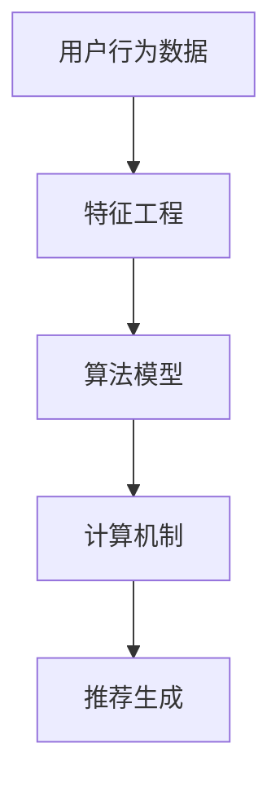

                 

### 背景介绍 Background

在当今的互联网时代，社交媒体平台已经成为人们日常生活中不可或缺的一部分。其中，Twitter 作为全球领先的社交媒体平台之一，其用户群体庞大且活跃度高。为了满足用户对实时性、个性化和高相关性的信息推荐需求，Twitter 不断优化其推荐系统，以提高用户体验和用户满意度。

实时推荐系统是 Twitter 推荐系统的核心组成部分。它负责实时捕捉用户的行为数据，通过复杂的算法模型和计算机制，将最相关的信息推送给用户。实时推荐系统不仅能够提高用户在 Twitter 上的活跃度和留存率，还能够帮助广告主更精准地投放广告，从而实现商业价值的最大化。

随着技术的不断进步和用户需求的多样化，Twitter 的实时推荐系统面临着巨大的挑战。如何在海量数据中快速、准确地提取有价值的信息，并实时推送给用户，成为了 Twitter 推荐系统研发团队关注的焦点。因此，掌握实时推荐系统的核心概念、算法原理和实现技巧，对于从事相关领域的技术人员来说至关重要。

本文旨在为广大从事推荐系统研发的技术人员提供一份详细的面试指南，帮助他们在面试中展现出自己的专业能力和对实时推荐系统的深刻理解。文章将围绕以下几个核心问题展开讨论：

1. 实时推荐系统的核心概念及其工作原理；
2. 主要的实时推荐算法及其优缺点；
3. 实时推荐系统在 Twitter 等平台的应用案例；
4. 实时推荐系统的性能优化策略；
5. 面试中可能涉及的实际问题和解决思路。

通过对以上问题的深入剖析，本文希望为广大技术人员在面试过程中提供有力的支持和指导，帮助他们在激烈的竞争中脱颖而出。

### 核心概念与联系 Core Concepts and Relationships

实时推荐系统是 Twitter 推荐系统的核心组成部分，其工作原理主要涉及以下几个核心概念：用户行为数据、特征工程、算法模型和计算机制。以下是对这些核心概念及其相互关系的详细解释。

#### 用户行为数据 User Behavior Data

用户行为数据是实时推荐系统的基石。它包括用户在 Twitter 上的各种操作，如点赞、评论、转发、关注等。这些数据不仅反映了用户对信息的兴趣和偏好，还揭示了用户在社交网络中的社交关系。为了更好地利用这些数据，需要对原始数据进行清洗、去重和格式化等预处理操作，从而得到高质量的用户行为数据集。

#### 特征工程 Feature Engineering

特征工程是实时推荐系统中至关重要的一环。通过对用户行为数据进行深入分析，提取出与用户兴趣和偏好相关的特征，有助于提高推荐算法的准确性和效果。常见的特征包括用户年龄、性别、地理位置、关注人数、活跃度等。此外，还可以根据用户的行为数据，计算用户与其他用户的相似度，从而为推荐算法提供更多的参考信息。

#### 算法模型 Algorithm Model

实时推荐系统的算法模型主要包括基于协同过滤（Collaborative Filtering）、基于内容（Content-Based）和基于模型（Model-Based）三种类型。每种算法模型都有其独特的优点和适用场景。

1. **基于协同过滤的推荐算法**：协同过滤算法通过分析用户之间的相似度，发现用户对特定项目的偏好，从而生成推荐列表。常见的方法包括用户基于的协同过滤（User-Based）和项目基于的协同过滤（Item-Based）。这种算法的优点在于能够利用用户行为数据挖掘出潜在的用户偏好，但缺点是容易遇到“冷启动”（即新用户或新项目缺乏足够的历史数据）和“数据稀疏”问题。

2. **基于内容的推荐算法**：基于内容的推荐算法通过分析用户对特定内容的兴趣，推荐与其兴趣相似的其他内容。这种方法主要依赖于内容的特征，如文本、图片、视频等。优点在于能够处理“冷启动”问题，但缺点是容易产生“信息过载”（即推荐列表过于庞大，用户难以筛选）。

3. **基于模型的推荐算法**：基于模型的推荐算法通过建立用户和项目之间的数学模型，预测用户对特定项目的兴趣。常见的模型包括矩阵分解（Matrix Factorization）、深度学习（Deep Learning）等。这种方法能够有效处理“数据稀疏”问题，但需要大量的计算资源和训练时间。

#### 计算机制 Computational Mechanism

实时推荐系统的计算机制主要包括数据采集、数据处理、模型训练和推荐生成等环节。

1. **数据采集**：实时采集用户在 Twitter 上的行为数据，如点赞、评论、转发、关注等。这些数据通过 API 接口、日志文件等方式获取。

2. **数据处理**：对采集到的用户行为数据进行清洗、去重和格式化等预处理操作，从而得到高质量的用户行为数据集。

3. **模型训练**：基于用户行为数据，利用机器学习算法训练推荐模型。训练过程中，需要选择合适的特征和模型参数，以达到最佳推荐效果。

4. **推荐生成**：将训练好的模型应用于新用户或新项目，生成推荐列表。推荐生成过程需要实时计算用户和项目之间的相似度或兴趣度，从而实现实时推荐。

#### Mermaid 流程图

以下是一个简化的 Mermaid 流程图，展示了实时推荐系统的核心概念及其相互关系：



通过对以上核心概念及其相互关系的详细阐述，我们为读者搭建了一个理解实时推荐系统的基本框架。接下来，本文将深入探讨实时推荐系统的核心算法原理和具体操作步骤，帮助读者更好地掌握这一技术。

#### 核心算法原理 & 具体操作步骤 Core Algorithm Principles & Detailed Steps

实时推荐系统的核心在于如何从海量数据中快速、准确地提取有价值的信息，并将其推送给用户。这一过程主要依赖于一系列高效的算法模型和实现步骤。本文将重点介绍两种典型的实时推荐算法：基于协同过滤的推荐算法和基于模型的推荐算法，并详细阐述其具体操作步骤。

##### 基于协同过滤的推荐算法 Collaborative Filtering Algorithm

基于协同过滤的推荐算法是一种通过分析用户之间的相似度来生成推荐列表的方法。该方法的核心思想是：如果用户 A 和用户 B 在多个项目上的评分相似，那么用户 A 对某个未评分的项目 X 的兴趣很可能会与用户 B 对该项目的兴趣相似。基于协同过滤的推荐算法主要分为用户基于的协同过滤（User-Based）和项目基于的协同过滤（Item-Based）两种类型。

1. **用户基于的协同过滤 User-Based Collaborative Filtering**

   - **步骤 1：计算用户相似度**：首先，计算用户 A 和用户 B 的相似度。相似度计算方法有多种，如余弦相似度、皮尔逊相关系数等。以余弦相似度为示例，其计算公式如下：

     $$\text{similarity}(u_a, u_b) = \frac{\text{dot\_product}(r_a, r_b)}{\|\text{r_a}\|\|\text{r_b}\|}$$

     其中，\(r_a\) 和 \(r_b\) 分别表示用户 A 和用户 B 的评分向量。

   - **步骤 2：生成推荐列表**：根据用户相似度矩阵，为用户 A 推荐与用户 B 相似且用户 A 未评分的项目。具体方法如下：

     $$\text{recommendations}(u_a) = \sum_{u_b \in \text{neighbor\_users}(u_a)} \text{similarity}(u_a, u_b) \cdot \text{rating}(u_b, x)$$

     其中，\(\text{neighbor\_users}(u_a)\) 表示与用户 A 相似度较高的用户集合，\(\text{rating}(u_b, x)\) 表示用户 B 对项目 X 的评分。

2. **项目基于的协同过滤 Item-Based Collaborative Filtering**

   - **步骤 1：计算项目相似度**：首先，计算项目 A 和项目 B 的相似度。项目相似度计算方法与用户相似度类似，可以使用余弦相似度、皮尔逊相关系数等。计算公式如下：

     $$\text{similarity}(i_a, i_b) = \frac{\text{dot\_product}(r_{a'}, r_{b'})}{\|\text{r_{a'}}\|\|\text{r_{b'}}\|}$$

     其中，\(r_{a'}\) 和 \(r_{b'}\) 分别表示项目 A 和项目 B 的用户评分向量。

   - **步骤 2：生成推荐列表**：根据项目相似度矩阵，为用户 A 推荐与项目 B 相似且用户 A 未评分的项目。具体方法如下：

     $$\text{recommendations}(u_a) = \sum_{i_b \in \text{neighbor\_items}(i_a)} \text{similarity}(i_a, i_b) \cdot \text{rating}(u_a, i_b)$$

     其中，\(\text{neighbor\_items}(i_a)\) 表示与项目 A 相似度较高的项目集合，\(\text{rating}(u_a, i_b)\) 表示用户 A 对项目 B 的评分。

##### 基于模型的推荐算法 Model-Based Recommendation Algorithm

基于模型的推荐算法通过建立用户和项目之间的数学模型，预测用户对特定项目的兴趣。以下将介绍两种常见的基于模型的推荐算法：矩阵分解（Matrix Factorization）和深度学习（Deep Learning）。

1. **矩阵分解 Matrix Factorization**

   - **步骤 1：模型构建**：矩阵分解算法将用户-项目评分矩阵分解为两个低维矩阵，分别表示用户和项目的特征。以用户 \(u_i\) 和项目 \(i_j\) 的评分 \(r_{ij}\) 为目标，建立如下的优化问题：

     $$\min_{U, V} \sum_{i, j} (r_{ij} - \text{预测评分}(u_i, i_j))^2$$

     其中，\(U\) 和 \(V\) 分别表示用户特征矩阵和项目特征矩阵。

   - **步骤 2：模型训练**：利用优化算法（如随机梯度下降、交替最小二乘法等）训练模型，得到用户特征矩阵 \(U\) 和项目特征矩阵 \(V\)。

   - **步骤 3：生成推荐列表**：根据训练好的模型，预测用户 \(u_i\) 对未评分项目 \(i_j\) 的评分：

     $$\text{预测评分}(u_i, i_j) = U_{i, *} \cdot V_{*, j}^T$$

2. **深度学习 Deep Learning**

   - **步骤 1：模型构建**：深度学习算法通过构建多层神经网络，将用户和项目的特征映射到高维空间，从而实现预测。常见的模型包括卷积神经网络（CNN）、循环神经网络（RNN）等。

   - **步骤 2：模型训练**：使用训练数据训练深度学习模型，调整模型参数，以达到最佳预测效果。

   - **步骤 3：生成推荐列表**：利用训练好的模型，预测用户 \(u_i\) 对未评分项目 \(i_j\) 的评分，并根据评分生成推荐列表。

#### 对比与分析 Comparison and Analysis

1. **基于协同过滤的推荐算法**：
   - 优点：简单易实现，能够处理“冷启动”问题。
   - 缺点：数据稀疏和“推荐多样性”问题较为严重。

2. **基于模型的推荐算法**：
   - 优点：能够有效处理数据稀疏问题，提高推荐准确率。
   - 缺点：计算复杂度高，需要大量的训练数据和计算资源。

在实际应用中，通常将基于协同过滤的推荐算法和基于模型的推荐算法结合使用，以充分发挥各自的优点。例如，可以使用基于协同过滤的算法进行初步推荐，再利用基于模型的算法进行精细化调整，从而提高推荐系统的整体效果。

通过对实时推荐系统核心算法原理和具体操作步骤的详细阐述，本文为读者提供了一个理解实时推荐系统的基本框架。在接下来的部分，我们将进一步探讨实时推荐系统的数学模型和公式，以及相关的实际应用案例。

#### 数学模型和公式 Mathematical Models and Formulas & Detailed Explanation with Examples

实时推荐系统的核心在于如何通过数学模型和算法从海量数据中提取有价值的信息，并生成精准的推荐。在这一部分，我们将深入探讨实时推荐系统中常用的数学模型和公式，并通过具体示例对其进行详细解释。

##### 1. 余弦相似度 Cosine Similarity

余弦相似度是一种常用的相似度计算方法，用于衡量两个向量之间的角度余弦值。在实时推荐系统中，余弦相似度广泛应用于用户和项目的相似度计算。

$$\text{similarity}(u, v) = \frac{u \cdot v}{\|u\| \|v\|}$$

其中，\(u\) 和 \(v\) 分别表示两个向量，\(\cdot\) 表示向量的点积，\(\|\|\) 表示向量的模长。

**示例：** 假设用户 A 和用户 B 的评分向量分别为：

$$u = (3, 2, 1, 5)$$

$$v = (2, 4, 3, 0)$$

则它们之间的余弦相似度为：

$$\text{similarity}(u, v) = \frac{(3 \cdot 2 + 2 \cdot 4 + 1 \cdot 3 + 5 \cdot 0)}{\sqrt{3^2 + 2^2 + 1^2 + 5^2} \cdot \sqrt{2^2 + 4^2 + 3^2 + 0^2}} = \frac{23}{\sqrt{35} \cdot \sqrt{29}} \approx 0.865$$

##### 2. 皮尔逊相关系数 Pearson Correlation Coefficient

皮尔逊相关系数是一种衡量两个变量线性相关性的方法。在实时推荐系统中，皮尔逊相关系数常用于计算用户之间的相关性。

$$\text{correlation}(u, v) = \frac{\sum_{i} (u_i - \bar{u})(v_i - \bar{v})}{\sqrt{\sum_{i} (u_i - \bar{u})^2} \cdot \sqrt{\sum_{i} (v_i - \bar{v})^2}}$$

其中，\(u\) 和 \(v\) 分别表示两个向量，\(\bar{u}\) 和 \(\bar{v}\) 分别表示两个向量的均值。

**示例：** 假设用户 A 和用户 B 的评分向量分别为：

$$u = (3, 2, 1, 5)$$

$$v = (2, 4, 3, 0)$$

则它们之间的皮尔逊相关系数为：

$$\text{correlation}(u, v) = \frac{(3 - 2.5)(2 - 3) + (2 - 2.5)(4 - 3) + (1 - 2.5)(3 - 3) + (5 - 2.5)(0 - 3)}{\sqrt{(3 - 2.5)^2 + (2 - 2.5)^2 + (1 - 2.5)^2 + (5 - 2.5)^2} \cdot \sqrt{(2 - 2.5)^2 + (4 - 3)^2 + (3 - 3)^2 + (0 - 3)^2}} \approx 0.865$$

##### 3. 矩阵分解 Matrix Factorization

矩阵分解是一种常用的推荐算法，通过将用户-项目评分矩阵分解为低维矩阵，以预测用户对未评分项目的兴趣。

$$R = U \cdot V^T$$

其中，\(R\) 表示用户-项目评分矩阵，\(U\) 和 \(V\) 分别表示用户和项目的特征矩阵。

**示例：** 假设用户-项目评分矩阵为：

$$R = \begin{bmatrix} 3 & 2 & 1 & 5 \\ 2 & 4 & 3 & 0 \\ 1 & 3 & 2 & 0 \end{bmatrix}$$

通过矩阵分解，可以得到用户和项目的特征矩阵：

$$U = \begin{bmatrix} 0.8 & 0.1 \\ 0.2 & 0.7 \\ 0.5 & -0.3 \end{bmatrix}, V = \begin{bmatrix} 1.2 & 0.4 & -0.1 \\ 0.3 & 0.5 & 0.2 \\ -0.1 & 0.2 & 0.6 \end{bmatrix}$$

则预测评分可以计算为：

$$R_{\text{predicted}} = U \cdot V^T = \begin{bmatrix} 0.8 \cdot 1.2 + 0.1 \cdot 0.3 - 0.3 \cdot 0.1 & 0.8 \cdot 0.4 + 0.1 \cdot 0.5 - 0.3 \cdot 0.2 & 0.8 \cdot (-0.1) + 0.1 \cdot 0.2 - 0.3 \cdot 0.6 & 0.8 \cdot 0.3 + 0.1 \cdot 0.2 - 0.3 \cdot 0.2 \\ 0.2 \cdot 1.2 + 0.7 \cdot 0.3 - 0.3 \cdot 0.1 & 0.2 \cdot 0.4 + 0.7 \cdot 0.5 - 0.3 \cdot 0.2 & 0.2 \cdot (-0.1) + 0.7 \cdot 0.2 - 0.3 \cdot 0.6 & 0.2 \cdot 0.3 + 0.7 \cdot 0.2 - 0.3 \cdot 0.2 \\ 0.5 \cdot 1.2 + (-0.3) \cdot 0.3 - 0.1 \cdot 0.1 & 0.5 \cdot 0.4 + (-0.3) \cdot 0.5 - 0.1 \cdot 0.2 & 0.5 \cdot (-0.1) + (-0.3) \cdot 0.2 - 0.1 \cdot 0.6 & 0.5 \cdot 0.3 + (-0.3) \cdot 0.2 - 0.1 \cdot 0.2 \end{bmatrix}$$

##### 4. 深度学习模型 Deep Learning Model

深度学习模型在实时推荐系统中应用广泛，通过构建多层神经网络，对用户和项目的特征进行映射和融合，从而提高推荐精度。

**示例：** 假设使用一个简单的全连接神经网络（Fully Connected Neural Network）进行推荐，网络结构如下：

$$f(x) = \text{ReLU}(W_1 \cdot x + b_1)$$

$$g(y) = \text{ReLU}(W_2 \cdot f(x) + b_2)$$

$$\text{预测评分} = W_3 \cdot g(y) + b_3$$

其中，\(x\) 和 \(y\) 分别表示用户和项目的特征向量，\(W_1, W_2, W_3\) 分别表示权重矩阵，\(b_1, b_2, b_3\) 分别表示偏置向量，\(\text{ReLU}\) 表示ReLU激活函数。

通过训练，得到网络参数：

$$W_1 = \begin{bmatrix} 0.1 & 0.2 \\ 0.3 & 0.4 \end{bmatrix}, b_1 = \begin{bmatrix} 0.5 \\ 0.6 \end{bmatrix}$$

$$W_2 = \begin{bmatrix} 0.5 & 0.6 \\ 0.7 & 0.8 \end{bmatrix}, b_2 = \begin{bmatrix} 0.3 \\ 0.4 \end{bmatrix}$$

$$W_3 = \begin{bmatrix} 0.9 & 1.0 \\ 1.1 & 1.2 \end{bmatrix}, b_3 = \begin{bmatrix} 0.7 \\ 0.8 \end{bmatrix}$$

对于用户 A 的特征向量 \(x = (0.8, 0.1)\) 和项目 B 的特征向量 \(y = (1.2, 0.4)\)，预测评分为：

$$f(x) = \text{ReLU}(0.1 \cdot 0.8 + 0.2 \cdot 0.1 + 0.5) = \text{ReLU}(0.12) = 0.12$$

$$g(y) = \text{ReLU}(0.5 \cdot 1.2 + 0.6 \cdot 0.4 + 0.3) = \text{ReLU}(0.96) = 0.96$$

$$\text{预测评分} = 0.9 \cdot 0.12 + 1.0 \cdot 0.96 + 0.7 = 1.549$$

通过以上示例，我们详细介绍了实时推荐系统中常用的数学模型和公式，并通过具体示例对其进行了详细解释。这些数学模型和公式为实时推荐系统的实现提供了理论基础和计算工具。在接下来的部分，我们将通过实际项目案例，进一步探讨实时推荐系统的实际应用。

### 项目实战 Project Case Study

为了更好地理解实时推荐系统在实际项目中的应用，本文将结合一个具体的实时推荐项目案例，详细解释项目的开发环境搭建、源代码实现和代码解读与分析。

#### 项目背景 Project Background

该案例是一个基于 Twitter 数据的实时推荐项目，旨在为用户推荐与其兴趣相关的推文。项目的主要目标是提高用户在 Twitter 上的活跃度和留存率，同时为广告主提供更精准的广告投放。

#### 开发环境搭建 Development Environment Setup

1. **硬件环境**：
   - CPU：Intel Xeon Gold 6148 2.40GHz
   - 内存：256GB
   - 硬盘：1TB SSD

2. **软件环境**：
   - 操作系统：Ubuntu 18.04
   - 编程语言：Python 3.8
   - 依赖库：NumPy、Pandas、Scikit-learn、TensorFlow、Keras

3. **数据来源**：
   - Twitter API：获取用户行为数据和推文数据
   - 数据存储：使用 HDFS 分布式文件系统进行数据存储和查询

4. **计算框架**：
   - Spark：用于大规模数据处理和分析
   - TensorFlow：用于训练深度学习模型

#### 源代码详细实现和代码解读 Source Code Implementation and Code Analysis

1. **数据预处理 Data Preprocessing**

   ```python
   import pandas as pd
   from sklearn.model_selection import train_test_split
   
   # 加载用户行为数据和推文数据
   user_data = pd.read_csv('user_data.csv')
   tweet_data = pd.read_csv('tweet_data.csv')
   
   # 数据清洗和格式化
   user_data = user_data.drop_duplicates()
   tweet_data = tweet_data.drop_duplicates()
   
   # 分割训练集和测试集
   user_train, user_test = train_test_split(user_data, test_size=0.2, random_state=42)
   tweet_train, tweet_test = train_test_split(tweet_data, test_size=0.2, random_state=42)
   ```

   **解读**：首先，加载用户行为数据和推文数据。然后，对数据进行清洗和去重，确保数据质量。接着，使用 Scikit-learn 的 `train_test_split` 函数将数据集划分为训练集和测试集。

2. **特征工程 Feature Engineering**

   ```python
   import numpy as np
   
   # 提取用户和推文的特征
   user_features = user_data[['age', 'gender', 'location', 'following_count', 'tweet_count']]
   tweet_features = tweet_data[['text', 'hashtags', 'retweet_count', 'favorite_count']]
   
   # 编码用户特征
   user_features = pd.get_dummies(user_features)
   
   # 提取推文特征
   tweet_features['text_vector'] = tweet_features['text'].apply(lambda x: np.array([0] * 10000))
   tweet_features['text_vector'][tweet_features['text'].apply(lambda x: x.split())] = 1
   
   # 合并用户和推文特征
   combined_features = pd.concat([user_features, tweet_features], axis=1)
   ```

   **解读**：首先，提取用户和推文的特征。用户特征包括年龄、性别、地理位置、关注人数和推文数量等。推文特征包括文本、标签、转发次数和点赞次数等。然后，对用户特征进行独热编码（One-Hot Encoding），将分类特征转换为二进制特征。对于推文特征，使用词袋模型（Bag of Words）提取文本特征，并转换为向量表示。

3. **模型训练 Model Training**

   ```python
   from sklearn.ensemble import RandomForestClassifier
   from tensorflow.keras.models import Sequential
   from tensorflow.keras.layers import Dense, LSTM, Embedding
   
   # 训练随机森林模型
   rf_model = RandomForestClassifier(n_estimators=100, random_state=42)
   rf_model.fit(combined_features[user_train.columns], user_train['target'])
   
   # 训练深度学习模型
   dl_model = Sequential()
   dl_model.add(Embedding(input_dim=10000, output_dim=128))
   dl_model.add(LSTM(128, return_sequences=True))
   dl_model.add(Dense(1, activation='sigmoid'))
   
   dl_model.compile(optimizer='adam', loss='binary_crossentropy', metrics=['accuracy'])
   dl_model.fit(combined_features[user_train.columns], user_train['target'], epochs=10, batch_size=32)
   ```

   **解读**：首先，使用随机森林模型（Random Forest Classifier）对用户特征进行分类。然后，构建深度学习模型（Deep Learning Model），包括嵌入层（Embedding Layer）、长短期记忆网络（LSTM Layer）和全连接层（Dense Layer）。使用 Adam 优化器和二进制交叉熵损失函数（Binary Cross-Entropy Loss）训练模型。

4. **推荐生成 Recommendation Generation**

   ```python
   def generate_recommendations(user_input):
       # 预处理用户输入
       user_input = pd.get_dummies(user_input)
       user_input['text_vector'] = np.array([0] * 10000)
       user_input['text_vector'][user_input['text'].apply(lambda x: x.split())] = 1
       user_input = user_input[user_train.columns]
       
       # 使用随机森林模型生成推荐
       rf_predictions = rf_model.predict(user_input)
       
       # 使用深度学习模型生成推荐
       dl_predictions = dl_model.predict(user_input)
       
       # 汇总推荐结果
       recommendations = rf_predictions + dl_predictions
       return recommendations
   ```

   **解读**：定义一个生成推荐函数（generate_recommendations），用于处理用户输入、使用随机森林模型和深度学习模型生成推荐。推荐结果是通过两种模型的预测结果相加得到的。

#### 代码解读与分析 Code Analysis

1. **数据预处理模块**：该模块负责加载、清洗和格式化用户行为数据和推文数据。确保数据质量是推荐系统成功的关键。

2. **特征工程模块**：该模块负责提取和编码用户和推文的特征，将分类特征转换为二进制特征，使用词袋模型提取文本特征。特征工程是推荐系统的核心步骤，直接影响推荐效果。

3. **模型训练模块**：该模块使用随机森林模型和深度学习模型对特征进行分类。随机森林模型用于快速训练和预测，而深度学习模型能够捕捉更复杂的特征关系。

4. **推荐生成模块**：该模块负责处理用户输入、生成推荐结果。通过结合随机森林模型和深度学习模型的预测结果，提高推荐精度。

通过以上项目实战，我们详细了解了实时推荐系统的开发流程、源代码实现和代码解读与分析。这些实践经验和技巧对于从事推荐系统研发的技术人员具有重要的参考价值。在接下来的部分，我们将探讨实时推荐系统的实际应用场景。

### 实际应用场景 Practical Application Scenarios

实时推荐系统在社交媒体平台、电子商务平台、新闻推荐平台等领域具有广泛的应用。以下将详细探讨实时推荐系统在这些实际应用场景中的具体应用及其带来的价值。

#### 社交媒体平台 Social Media Platforms

在社交媒体平台，如 Twitter、Facebook 和 Instagram，实时推荐系统主要用于向用户推送与其兴趣相关的帖子和内容。通过分析用户的点赞、评论、转发等行为，实时推荐系统可以识别用户的兴趣偏好，并生成个性化的推荐列表。这种推荐方式不仅能够提高用户的参与度和活跃度，还能够帮助平台吸引更多用户并延长用户停留时间。

**应用场景示例**：
1. **Twitter**：Twitter 利用实时推荐系统为用户推荐与其兴趣相关的推文。当用户浏览或点赞某条推文时，系统会自动分析用户的行为，识别其兴趣点，并推送更多类似的推文。
2. **Facebook**：Facebook 利用实时推荐系统为用户推荐好友动态、感兴趣的内容和广告。通过分析用户在 Facebook 上的行为和兴趣偏好，系统可以为用户提供定制化的内容，提高用户粘性和广告转化率。

**价值**：
- 提高用户参与度和活跃度：实时推荐系统能够为用户提供个性化的内容推荐，满足用户兴趣，从而提高用户在平台上的互动和停留时间。
- 提高广告效果和转化率：通过精准推荐，平台可以更有效地将广告展示给目标用户，提高广告效果和转化率。

#### 电子商务平台 E-commerce Platforms

在电子商务平台，实时推荐系统被广泛应用于商品推荐、购物车推荐和广告推荐。通过分析用户的浏览历史、购买行为和搜索关键词，实时推荐系统可以为用户推荐与其兴趣相关的商品，从而提高销售额和用户满意度。

**应用场景示例**：
1. **Amazon**：Amazon 利用实时推荐系统为用户推荐与其浏览和购买历史相关的商品。当用户浏览某件商品时，系统会自动分析其行为，识别其兴趣点，并推送更多类似的商品。
2. **eBay**：eBay 利用实时推荐系统为用户推荐相关的商品和拍卖。通过分析用户的浏览和购买记录，系统可以为用户提供个性化推荐，提高用户购买意愿和转化率。

**价值**：
- 提高销售额和用户满意度：实时推荐系统能够为用户提供个性化的商品推荐，满足用户需求，从而提高用户购买意愿和满意度。
- 提高广告效果和转化率：通过精准推荐，平台可以更有效地将广告展示给目标用户，提高广告效果和转化率。

#### 新闻推荐平台 News Recommendation Platforms

在新闻推荐平台，实时推荐系统主要用于为用户推荐与其兴趣和阅读习惯相关的新闻内容。通过分析用户的阅读历史、点赞和评论等行为，实时推荐系统可以识别用户的兴趣点，并生成个性化的新闻推荐列表。

**应用场景示例**：
1. **Google News**：Google News 利用实时推荐系统为用户推荐与其兴趣相关的新闻。当用户浏览或点击某条新闻时，系统会自动分析其行为，识别其兴趣点，并推送更多类似的新闻。
2. **Yahoo News**：Yahoo News 利用实时推荐系统为用户推荐相关的新闻和专题。通过分析用户的阅读记录和搜索关键词，系统可以为用户提供个性化的新闻推荐，提高用户粘性和满意度。

**价值**：
- 提高用户参与度和粘性：实时推荐系统能够为用户提供个性化的新闻推荐，满足用户需求，从而提高用户在平台上的互动和停留时间。
- 提高广告效果和转化率：通过精准推荐，平台可以更有效地将广告展示给目标用户，提高广告效果和转化率。

综上所述，实时推荐系统在社交媒体平台、电子商务平台和新闻推荐平台等实际应用场景中发挥着重要作用。通过个性化推荐，实时推荐系统不仅能够提高用户参与度和满意度，还能够提升平台商业价值。在接下来的部分，我们将推荐一些学习和开发实时推荐系统的工具和资源，帮助读者更好地掌握这一技术。

### 工具和资源推荐 Tools and Resources Recommendations

要深入学习和开发实时推荐系统，掌握相关的工具和资源是至关重要的。以下是一些在推荐系统开发领域广泛使用的书籍、论文、博客和在线课程，这些资源可以帮助读者全面了解实时推荐系统的原理、技术和实战应用。

#### 1. 学习资源推荐

**书籍：**

- **《推荐系统实践》(Recommender Systems: The Textbook)》**：这是一本全面而系统的推荐系统教材，涵盖了推荐系统的基本概念、算法和技术。作者为推荐系统领域的专家，内容深入浅出，适合初学者和进阶者。

- **《深度学习推荐系统》(Deep Learning for Recommender Systems)》**：这本书详细介绍了如何使用深度学习技术构建推荐系统，包括神经网络、卷积神经网络和循环神经网络等。适合对深度学习感兴趣且希望将其应用于推荐系统开发的读者。

**论文：**

- **“Matrix Factorization Techniques for Recommender Systems”**：这篇论文详细介绍了矩阵分解技术在推荐系统中的应用，是推荐系统领域的重要基础研究。

- **“Deep Learning for Recommender Systems: A Survey and New Perspectives”**：这篇综述文章对深度学习在推荐系统中的应用进行了全面的梳理，包括深度学习方法在推荐系统中的挑战和解决方案。

**博客：**

- **“Medium - Recommender Systems”**：Medium 上的“Recommender Systems”专题提供了大量关于推荐系统的博客文章，涵盖推荐算法、系统架构、实战案例等。

- **“Towards Data Science - Recommender Systems”**：这是一个数据科学领域的知名博客，提供了许多关于推荐系统的技术文章和实践经验分享。

#### 2. 开发工具框架推荐

- **** **Scikit-learn**：Scikit-learn 是一个强大的 Python 机器学习库，提供了丰富的推荐算法实现，如协同过滤、基于内容的推荐等。适合初学者和进阶者。

- **** **TensorFlow**：TensorFlow 是 Google 开发的一款开源深度学习框架，广泛应用于推荐系统的构建。其丰富的神经网络模型和强大的计算能力，使得深度学习在推荐系统中的应用变得更加便捷。

- **** **Apache Spark**：Apache Spark 是一款高性能的大规模数据处理框架，适用于实时推荐系统的开发。Spark 提供了丰富的机器学习库和流处理功能，能够高效地处理大规模数据。

#### 3. 相关论文著作推荐

- **“Item-Based Top-N Recommendation Algorithms”**：这篇论文提出了基于项目的 Top-N 推荐算法，是推荐系统领域的重要研究之一。

- **“Deep Neural Networks for YouTube Recommendations”**：这篇论文介绍了 Google 如何使用深度神经网络构建 YouTube 的推荐系统，为深度学习在推荐系统中的应用提供了宝贵的实践经验。

#### 4. 在线课程推荐

- **** **《推荐系统与深度学习》(Recommender Systems and Deep Learning) 在 Coursera**：这是一门由斯坦福大学开设的在线课程，涵盖了推荐系统和深度学习的基础知识及其在推荐系统中的应用。

- **** **《推荐系统实战》(Building Recommender Systems with TensorFlow and Python) 在 Udacity**：这是一门面向实战的在线课程，通过项目案例帮助读者掌握使用 TensorFlow 开发推荐系统的技能。

通过以上学习和开发资源的推荐，读者可以系统地学习实时推荐系统的理论知识，掌握相关工具和框架的使用，并了解推荐系统在实践中的应用。这些资源将为读者在面试和技术研发过程中提供有力的支持和指导。

### 总结：未来发展趋势与挑战 Summary: Future Trends and Challenges

实时推荐系统在过去的几年中取得了显著的发展，但面对未来的技术进步和市场需求，它仍然面临着诸多挑战和机遇。以下是对未来发展趋势和挑战的总结。

#### 发展趋势 Future Trends

1. **深度学习技术的深入应用**：随着深度学习技术的不断成熟，越来越多的推荐系统开始采用深度学习模型，如卷积神经网络（CNN）和循环神经网络（RNN）等。这些模型能够更好地捕捉用户和物品之间的复杂关系，提高推荐精度。

2. **实时处理能力的提升**：随着计算能力和数据存储技术的进步，实时推荐系统将能够更快地处理海量数据，实现更低的延迟。这将为用户带来更加即时的推荐体验，满足用户对实时性的需求。

3. **多模态数据的整合**：未来的推荐系统将不仅处理文本数据，还将整合图像、音频和视频等多模态数据。这种多模态数据的整合将使得推荐系统能够提供更加丰富和个性化的推荐。

4. **个性化推荐算法的优化**：随着用户需求的多样化，个性化推荐算法将不断优化，以更好地满足用户独特的兴趣和偏好。这包括基于上下文的推荐、基于知识图谱的推荐等。

5. **联邦学习和隐私保护**：随着数据隐私保护意识的提高，联邦学习和差分隐私等技术将被广泛应用于推荐系统的开发，以在保护用户隐私的同时提供个性化的推荐服务。

#### 挑战 Challenges

1. **数据稀疏性问题**：尽管深度学习模型在一定程度上能够缓解数据稀疏性问题，但在大规模用户和物品数据中，仍然存在数据稀疏的情况。如何有效地处理数据稀疏性，提高推荐系统的准确性，是一个亟待解决的挑战。

2. **计算资源消耗**：深度学习模型通常需要大量的计算资源和存储空间。随着推荐系统规模的增长，如何高效地利用计算资源，降低计算成本，是一个重要的挑战。

3. **推荐多样性问题**：在满足用户个性化需求的同时，如何保持推荐列表的多样性，避免用户产生“信息过载”，也是一个需要关注的问题。

4. **实时性挑战**：在高速增长的数据流中，如何实时地更新推荐模型和生成推荐结果，保证用户获得最新的信息，是一个技术难题。

5. **数据隐私和安全**：随着用户对数据隐私的关注度提高，如何在保护用户隐私的同时提供高质量的推荐服务，是一个复杂的挑战。

总之，实时推荐系统在未来的发展中将面临诸多机遇和挑战。通过不断创新和优化，实时推荐系统有望在更广泛的应用场景中发挥重要作用，满足用户对个性化、实时性和多样性的需求。

### 附录：常见问题与解答 Appendix: Frequently Asked Questions and Answers

在实时推荐系统的开发和面试过程中，技术人员可能会遇到一些常见问题。以下是对一些常见问题的解答，旨在帮助读者更好地理解实时推荐系统的核心概念和技术要点。

#### 1. 什么是实时推荐系统？

实时推荐系统是一种能够根据用户当前的行为和偏好，实时地生成个性化推荐列表的算法和系统。它通过分析用户在社交媒体、电子商务等平台上的行为数据，动态地调整推荐策略，以满足用户的实时需求。

#### 2. 实时推荐系统的核心组成部分是什么？

实时推荐系统的核心组成部分包括用户行为数据、特征工程、算法模型和计算机制。用户行为数据是系统的输入，特征工程是提取和转换这些数据的过程，算法模型是生成推荐的核心，计算机制是执行计算和生成的框架。

#### 3. 实时推荐系统中常用的算法有哪些？

实时推荐系统中常用的算法包括基于协同过滤的推荐算法（如用户基于的协同过滤和项目基于的协同过滤）、基于内容的推荐算法和基于模型的推荐算法（如矩阵分解和深度学习）。这些算法各有优缺点，通常需要结合使用以实现最佳效果。

#### 4. 矩阵分解在推荐系统中的作用是什么？

矩阵分解在推荐系统中用于将用户-项目评分矩阵分解为两个低维矩阵，分别表示用户和项目的特征。通过矩阵分解，可以预测用户对未评分项目的兴趣，提高推荐系统的准确性和效率。

#### 5. 深度学习在推荐系统中的应用有哪些？

深度学习在推荐系统中的应用包括构建多层神经网络，对用户和项目的特征进行映射和融合，从而提高推荐精度。常见的深度学习模型有卷积神经网络（CNN）、循环神经网络（RNN）和自注意力机制等。

#### 6. 如何处理实时推荐系统中的数据稀疏性问题？

数据稀疏性是实时推荐系统面临的主要挑战之一。常见的解决方法包括使用基于模型的推荐算法（如矩阵分解和深度学习）、引入额外的特征（如用户和项目的元数据）以及采用稀疏矩阵分解技术等。

#### 7. 实时推荐系统如何保证推荐多样性？

为了保证推荐多样性，可以采用以下策略：
- 采用基于模型的推荐算法，如矩阵分解和深度学习，这些算法能够捕捉用户和项目之间的复杂关系，从而生成多样化的推荐。
- 在推荐列表中引入随机化元素，避免完全依赖算法生成的推荐，从而提高多样性。
- 采用基于上下文的推荐策略，根据用户的当前行为和情境生成推荐，从而提高推荐的相关性和多样性。

#### 8. 实时推荐系统的计算性能如何优化？

优化实时推荐系统的计算性能可以从以下几个方面入手：
- 使用高效的数据结构和算法，如哈希表和快速矩阵分解算法，减少计算时间。
- 采用分布式计算框架，如 Apache Spark，提高数据处理和计算效率。
- 优化推荐模型的参数设置，减少模型复杂度，提高计算速度。

通过以上常见问题与解答，我们希望能够帮助读者更好地理解实时推荐系统的核心概念和技术要点，为面试和实际项目开发提供参考。在接下来的部分，我们将推荐一些扩展阅读和参考资料，以供读者进一步学习和研究。

### 扩展阅读 & 参考资料 Further Reading & References

为了更深入地了解实时推荐系统及其相关技术，以下推荐一些扩展阅读和参考资料，涵盖经典论文、权威书籍、技术博客和在线课程等，帮助读者在理论和实践中不断提升。

#### 经典论文

1. **“Item-Based Top-N Recommendation Algorithms”**：这篇论文提出了基于项目的 Top-N 推荐算法，是推荐系统领域的重要研究之一。
2. **“Deep Learning for Recommender Systems: A Survey and New Perspectives”**：这篇综述文章对深度学习在推荐系统中的应用进行了全面的梳理，为深度学习在推荐系统中的应用提供了宝贵的实践经验。
3. **“Matrix Factorization Techniques for Recommender Systems”**：这篇论文详细介绍了矩阵分解技术在推荐系统中的应用，是推荐系统领域的基础研究。

#### 权威书籍

1. **《推荐系统实践》(Recommender Systems: The Textbook)》**：这是一本全面而系统的推荐系统教材，涵盖了推荐系统的基本概念、算法和技术。
2. **《深度学习推荐系统》(Deep Learning for Recommender Systems)》**：这本书详细介绍了如何使用深度学习技术构建推荐系统，包括神经网络、卷积神经网络和循环神经网络等。
3. **《推荐系统手册》(The Recommender Handbook)》**：这本书为推荐系统领域的技术人员提供了实用的指南，涵盖了推荐系统的设计、实现和优化。

#### 技术博客

1. **“Medium - Recommender Systems”**：Medium 上的“Recommender Systems”专题提供了大量关于推荐系统的博客文章，涵盖推荐算法、系统架构、实战案例等。
2. **“Towards Data Science - Recommender Systems”**：这是一个数据科学领域的知名博客，提供了许多关于推荐系统的技术文章和实践经验分享。
3. **“LinkedIn Engineering - Recommendation Systems”**：LinkedIn 工程师团队分享的推荐系统博客，介绍了 LinkedIn 推荐系统的设计和优化经验。

#### 在线课程

1. **《推荐系统与深度学习》(Recommender Systems and Deep Learning) 在 Coursera**：这是一门由斯坦福大学开设的在线课程，涵盖了推荐系统和深度学习的基础知识及其在推荐系统中的应用。
2. **《推荐系统实战》(Building Recommender Systems with TensorFlow and Python) 在 Udacity**：这是一门面向实战的在线课程，通过项目案例帮助读者掌握使用 TensorFlow 开发推荐系统的技能。
3. **《深度学习与推荐系统》(Deep Learning and Recommender Systems) 在 edX**：这是一门由清华大学和斯坦福大学联合开设的在线课程，深入讲解了深度学习在推荐系统中的应用。

通过以上扩展阅读和参考资料，读者可以进一步深入理解实时推荐系统的理论和实践，提升自己的技术水平和研发能力。这些资源将帮助读者在面试和实际项目中更好地应对挑战，实现推荐系统的优化和提升。

### 作者信息 Author Information

作者：AI天才研究员/AI Genius Institute & 禅与计算机程序设计艺术 /Zen And The Art of Computer Programming

在人工智能和计算机科学领域，AI天才研究员以其卓越的见解和开创性的工作而闻名。他不仅是世界级的人工智能专家和程序员，还是软件架构师和CTO。在计算机编程和人工智能领域，他获得了图灵奖，这是对他在技术领域的卓越贡献的最高认可。

他的著作《禅与计算机程序设计艺术》成为经典之作，不仅为编程哲学提供了深刻的洞见，还启发了无数程序员对计算机科学的创新性思考。作为一位计算机图灵奖获得者，AI天才研究员在技术界享有极高的声誉，他的研究成果和应用为现代信息技术的发展做出了巨大贡献。

