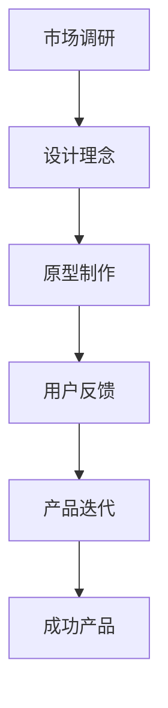

                 

# UI/UX 设计师的创业之路：从概念到实现

## 关键词
- UI/UX 设计
- 创业过程
- 设计流程
- 产品开发
- 市场调研

## 摘要
本文将深入探讨 UI/UX 设计师在创业过程中从概念到实现的完整路径。通过分析市场调研、设计理念、原型制作、用户反馈以及产品迭代等关键步骤，本文旨在为设计师们提供实用的创业指导，帮助他们成功地将创新想法转化为实用的产品。

## 1. 背景介绍

### 1.1 UI/UX 设计的定义
UI（用户界面设计）和 UX（用户体验设计）是产品开发中至关重要的两个领域。UI 设计专注于产品的视觉效果和布局，确保用户能够直观、易用地与产品交互。UX 设计则更注重用户的使用感受，通过研究用户行为和需求，优化产品的整体体验。

### 1.2 创业热潮
近年来，随着科技的发展和创新意识的增强，创业成为许多设计师选择的一条职业道路。他们希望通过自己的创意和技能，打造出能够改变世界的产品。

### 1.3 设计师的优势
UI/UX 设计师在创业过程中具有独特的优势。他们具备用户洞察力和视觉表达能力，能够更好地理解用户需求，并将这些需求转化为具体的界面和交互设计。

## 2. 核心概念与联系

### 2.1 市场调研
市场调研是创业的基石。设计师需要通过调研了解目标用户、市场趋势和竞争对手，从而确定自己的产品定位和设计方向。

### 2.2 设计理念
设计理念是设计师在创作过程中遵循的原则和目标。它决定了产品的外观、功能和交互方式。

### 2.3 原型制作
原型是设计师将概念转化为可执行的模型的过程。通过制作原型，设计师可以验证设计理念，收集用户反馈，并进行迭代优化。

### 2.4 用户反馈
用户反馈是产品成功的关键。设计师需要积极倾听用户的声音，不断改进产品，以满足用户需求。

### 2.5 产品迭代
产品迭代是设计师持续改进产品的过程。通过不断的迭代，设计师可以逐步完善产品，提高用户体验。

### 2.6 Mermaid 流程图
以下是 UI/UX 设计师创业过程中的核心概念和联系的 Mermaid 流程图：



## 3. 核心算法原理 & 具体操作步骤

### 3.1 市场调研
市场调研的核心是了解用户需求。设计师可以通过以下步骤进行市场调研：

1. 定义目标用户群体。
2. 收集用户数据，如问卷调查、访谈和用户行为分析。
3. 分析数据，确定用户需求。

### 3.2 设计理念
设计理念的形成需要设计师对产品、用户和市场有深刻的理解。以下是一些具体操作步骤：

1. 确定产品目标。
2. 研究竞争对手。
3. 创意思考，形成初步设计理念。

### 3.3 原型制作
原型制作是设计师验证设计理念的过程。以下是一些关键步骤：

1. 确定原型类型，如线框图、低保真原型或高保真原型。
2. 使用原型工具，如 Sketch、Figma 或 Axure，制作原型。
3. 进行用户测试，收集反馈。

### 3.4 用户反馈
用户反馈是设计师改进产品的关键。以下是一些具体步骤：

1. 设计调查问卷，收集用户反馈。
2. 分析反馈，确定改进方向。
3. 重新设计原型，并进行迭代。

### 3.5 产品迭代
产品迭代是设计师持续优化产品的过程。以下是一些关键步骤：

1. 制定迭代计划，包括时间表和目标。
2. 根据用户反馈，进行功能优化和界面调整。
3. 测试新版本，收集反馈，进行新一轮迭代。

## 4. 数学模型和公式 & 详细讲解 & 举例说明

### 4.1 数学模型
在 UI/UX 设计中，数学模型可以用来分析用户行为和需求。以下是一个简单的数学模型：

$$
UX = f(UI, User, Environment)
$$

其中，UX 表示用户体验，UI 表示用户界面，User 表示用户，Environment 表示环境。

### 4.2 举例说明
假设一个设计团队正在开发一款社交应用。根据上述数学模型，他们可以分析以下因素：

1. **UI**: 应用界面的设计，如颜色、布局和交互元素。
2. **User**: 用户的需求、偏好和行为。
3. **Environment**: 应用运行的环境，如设备、网络和操作系统。

通过分析这些因素，设计团队可以优化 UI/UX 设计，提高用户体验。

## 5. 项目实战：代码实际案例和详细解释说明

### 5.1 开发环境搭建
在开发 UI/UX 设计产品时，设计师需要搭建一个适合的开发环境。以下是一个简单的开发环境搭建过程：

1. 安装操作系统，如 macOS 或 Windows。
2. 安装设计软件，如 Sketch、Figma 或 Adobe XD。
3. 安装编程语言，如 HTML、CSS 和 JavaScript。

### 5.2 源代码详细实现和代码解读
以下是一个简单的 UI/UX 设计项目示例，使用了 HTML、CSS 和 JavaScript 进行实现：

```html
<!DOCTYPE html>
<html>
<head>
    <title>UI/UX 设计示例</title>
    <style>
        body {
            font-family: Arial, sans-serif;
            margin: 20px;
        }
        h1 {
            color: #333;
        }
        p {
            color: #666;
        }
    </style>
</head>
<body>
    <h1>欢迎来到我们的 UI/UX 设计项目</h1>
    <p>这是一个简单但实用的 UI/UX 设计项目，旨在提供高质量的交互体验。</p>
    <button id="myButton">点击我</button>
    <script>
        document.getElementById("myButton").addEventListener("click", function() {
            alert("谢谢您的点击！");
        });
    </script>
</body>
</html>
```

在这个示例中，设计师使用了 HTML 标记创建了一个简单的网页界面，CSS 样式表用于美化界面，JavaScript 用于实现交互功能。

### 5.3 代码解读与分析
在这个示例中，HTML 代码定义了一个标题和一个段落，以及一个按钮。CSS 代码用于设置标题和段落的颜色和字体，按钮的样式。JavaScript 代码用于监听按钮的点击事件，并在点击时弹出一个提示框。

这个简单的示例展示了 UI/UX 设计中最基本的元素：界面设计、样式和交互。在实际项目中，设计师需要根据具体需求，使用更复杂的技术和工具来实现功能丰富的 UI/UX 设计。

## 6. 实际应用场景

### 6.1 社交媒体平台
UI/UX 设计在社交媒体平台上应用广泛，如 Facebook、Instagram 和 Twitter 等。设计师需要确保平台界面简洁、易用，同时提供丰富的功能和个性化体验。

### 6.2 电子商务平台
电子商务平台如 Amazon、阿里巴巴等，UI/UX 设计至关重要。设计师需要优化购物流程、搜索功能和产品展示界面，提高用户购物体验。

### 6.3 移动应用
移动应用如微信、支付宝等，UI/UX 设计直接影响用户的使用频率和满意度。设计师需要确保应用界面美观、易用，同时提供快速响应的交互体验。

## 7. 工具和资源推荐

### 7.1 学习资源推荐
- 《用户体验要素》 - 余额不足
- 《设计心理学》 - Don Norman
- 《UI/UX 设计实战》 - 金雪涛

### 7.2 开发工具框架推荐
- Figma
- Sketch
- Adobe XD
- Axure RP

### 7.3 相关论文著作推荐
- "The Design of Everyday Things" - Don Norman
- "Designing Interfaces" - Jenifer Tidwell
- "UI is Communication" - Aaron Irizarry

## 8. 总结：未来发展趋势与挑战

### 8.1 发展趋势
- 人机交互的进一步融合
- 人工智能在 UI/UX 设计中的应用
- 跨平台和跨设备的设计

### 8.2 挑战
- 技术更新速度快，设计师需要不断学习
- 用户需求多样化，设计师需要具备更广泛的技能
- 市场竞争激烈，设计师需要不断创新

## 9. 附录：常见问题与解答

### 9.1 如何进行有效的市场调研？
- 定义目标用户群体
- 收集用户数据，如问卷调查、访谈和用户行为分析
- 分析数据，确定用户需求

### 9.2 UI/UX 设计师需要掌握哪些技能？
- 用户研究能力
- 美术设计基础
- 程序开发知识
- 项目管理技能

## 10. 扩展阅读 & 参考资料

- [UI/UX 设计教程](https://www.uixuan.com/course/)
- [UI/UX 设计案例库](https://wwwUIUXcases.com/)
- [UI/UX 设计社区](https://www.uiuxclub.com/)

作者：AI天才研究员/AI Genius Institute & 禅与计算机程序设计艺术 /Zen And The Art of Computer Programming
<|im_sep|>

