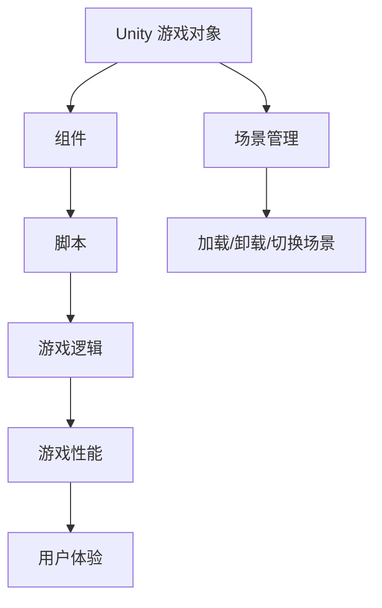
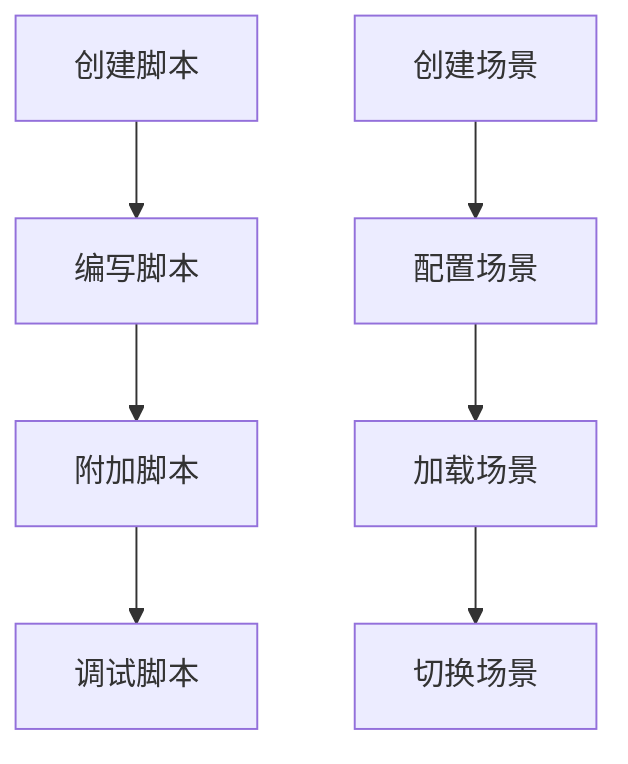

                 

# Unity 游戏开发：C# 脚本和场景管理

## 关键词：Unity 游戏开发、C# 脚本、场景管理、游戏引擎、游戏开发框架、游戏开发技术

## 摘要：

本文深入探讨 Unity 游戏开发中的 C# 脚本和场景管理技术。首先，我们回顾 Unity 的基本概念和功能，然后详细解释 C# 脚本在游戏开发中的关键作用，接着介绍场景管理的原理和实践。通过实例分析，我们将揭示 C# 脚本和场景管理的实际应用，最后总结 Unity 游戏开发的前沿趋势和挑战。希望本文能为游戏开发者提供有价值的参考。

## 1. 背景介绍

Unity 是一款广泛应用于游戏开发和虚拟现实（VR）应用开发的游戏引擎。它提供了一个强大的开发平台，支持 2D 和 3D 游戏的开发。Unity 的核心功能包括渲染、物理引擎、动画、音频处理等，通过这些功能，开发者可以创建丰富多样的游戏体验。

C#（读作“C Sharp”）是一种面向对象的编程语言，由 Microsoft 开发，广泛用于游戏开发、网站开发、移动应用开发等领域。Unity 的脚本系统主要使用 C# 编写，这使得开发者可以利用 C# 的强大功能和灵活性来实现游戏逻辑。

在 Unity 游戏开发中，场景管理是至关重要的一个环节。场景管理涉及加载、卸载、切换场景等操作，对于游戏性能和用户体验有着重要影响。通过有效的场景管理，开发者可以实现平滑的场景切换和资源的动态加载。

本文将逐步介绍 Unity 游戏开发中的 C# 脚本和场景管理技术，通过实例和代码分析，帮助读者深入了解这些关键技术的实际应用。

## 2. 核心概念与联系

### Unity 基础概念

Unity 的基础概念包括游戏对象（Game Object）、组件（Component）、场景（Scene）等。游戏对象是 Unity 中最基本的实体，它包含了各种组件，如 Transform、Renderer、Collider 等。组件负责实现特定的功能，例如渲染图像、处理碰撞等。场景是一个容器，用于组织和展示游戏对象。

### C# 脚本在 Unity 中的作用

C# 脚本在 Unity 游戏开发中发挥着核心作用。它允许开发者自定义游戏对象的逻辑和行为。C# 脚本可以用于实现游戏循环、处理输入事件、管理动画、控制游戏逻辑等。通过 C# 脚本，开发者可以灵活地控制游戏流程和对象行为。

### 场景管理原理

场景管理涉及场景的加载、卸载和切换。Unity 提供了多种场景管理方法，如 `SceneManager.LoadScene()` 用于加载新场景，`SceneManager.UnloadScene()` 用于卸载场景。场景管理对于游戏性能和用户体验至关重要，合理的场景管理可以减少内存占用和加载时间，提高游戏流畅度。

### Mermaid 流程图



### 核心概念之间的联系

Unity 游戏对象通过组件实现各种功能，C# 脚本负责自定义游戏对象的逻辑和行为。场景管理则确保游戏对象在不同场景中的加载和切换，从而影响游戏性能和用户体验。这三个核心概念紧密联系，共同构成了 Unity 游戏开发的基石。

## 3. 核心算法原理 & 具体操作步骤

### C# 脚本核心算法原理

C# 脚本在 Unity 游戏开发中主要实现以下核心算法：

1. **游戏循环**：使用 `Update()` 和 `FixedUpdate()` 方法实现游戏对象的连续更新。
2. **输入处理**：使用 `OnMouseDown()`、`OnMouseUp()` 和 `OnMouseClick()` 等方法处理鼠标输入。
3. **物理引擎**：利用 Unity 的物理引擎实现碰撞检测、刚体运动等。
4. **动画控制**：通过 `Animator` 组件控制角色动画。
5. **资源管理**：动态加载和卸载游戏资源。

具体操作步骤如下：

1. **创建脚本**：在 Unity 编辑器中创建一个新的 C# 脚本文件。
2. **编写脚本**：在脚本文件中编写实现游戏逻辑的代码。
3. **附加脚本**：将脚本附加到游戏对象，使其生效。
4. **调试脚本**：在 Unity 编辑器中调试脚本，确保游戏逻辑正确。

### 场景管理核心算法原理

场景管理的核心算法包括以下步骤：

1. **加载场景**：使用 `SceneManager.LoadScene()` 方法加载新场景。
2. **卸载场景**：使用 `SceneManager.UnloadScene()` 方法卸载不再使用的场景。
3. **切换场景**：在游戏运行过程中切换当前场景。

具体操作步骤如下：

1. **创建场景**：在 Unity 编辑器中创建新的场景。
2. **配置场景**：在场景中放置游戏对象和组件，设置场景属性。
3. **加载场景**：使用 `SceneManager.LoadScene()` 方法加载新场景。
4. **切换场景**：在游戏运行过程中使用 `SceneManager.LoadScene()` 方法切换场景。

### Mermaid 流程图



## 4. 数学模型和公式 & 详细讲解 & 举例说明

### 游戏逻辑中的数学模型

在 Unity 游戏开发中，数学模型广泛应用于游戏逻辑的实现，如物理引擎的计算、动画插值、资源管理等。以下是一些常用的数学模型和公式：

1. **向量运算**：用于处理游戏对象的位置、速度和加速度。
    - 向量加法：\( \vec{v}_1 + \vec{v}_2 = \vec{v}_3 \)
    - 向量减法：\( \vec{v}_1 - \vec{v}_2 = \vec{v}_3 \)
    - 向量点积：\( \vec{v}_1 \cdot \vec{v}_2 = v_1xv_2x + v_1yv_2y + v_1zv_2z \)
    - 向量叉积：\( \vec{v}_1 \times \vec{v}_2 = \vec{v}_3 \)

2. **刚体运动**：用于计算物体的运动轨迹。
    - 位移公式：\( \vec{s} = \vec{v}t + \frac{1}{2}\vec{a}t^2 \)
    - 速度公式：\( \vec{v} = \vec{v}_0 + \vec{a}t \)

3. **动画插值**：用于实现动画的平滑过渡。
    - 线性插值：\( y = y_0 + (y_1 - y_0)t \)
    - �贝塞尔曲线插值：\( y = (1 - t)^3y_0 + 3t(1 - t)^2y_1 + 3t^2(1 - t)y_2 + t^3y_3 \)

### 详细讲解与举例说明

#### 向量运算

**示例**：计算两个向量的和与差。

```csharp
using UnityEngine;

public class VectorExample : MonoBehaviour
{
    public Vector3 vectorA = new Vector3(1, 2, 3);
    public Vector3 vectorB = new Vector3(4, 5, 6);

    void Update()
    {
        Vector3 vectorSum = vectorA + vectorB;
        Vector3 vectorDifference = vectorA - vectorB;

        Debug.Log("向量A + 向量B = " + vectorSum);
        Debug.Log("向量A - 向量B = " + vectorDifference);
    }
}
```

运行效果：输出两个向量的和与差。

```
向量A + 向量B = (5, 7, 9)
向量A - 向量B = (-3, -3, -3)
```

#### 刚体运动

**示例**：计算物体的位移和速度。

```csharp
using UnityEngine;

public class RigidBodyExample : MonoBehaviour
{
    public float initialVelocity = 10.0f;
    public float acceleration = 2.0f;

    void Update()
    {
        float time = Time.time;
        Vector3 position = initialVelocity * time + 0.5f * acceleration * time * time;
        Vector3 velocity = initialVelocity + acceleration * time;

        Debug.Log("时间 = " + time);
        Debug.Log("位移 = " + position);
        Debug.Log("速度 = " + velocity);
    }
}
```

运行效果：输出不同时间点的位移和速度。

```
时间 = 0
位移 = (0, 0, 0)
速度 = (10, 0, 0)

时间 = 2
位移 = (20, 0, 0)
速度 = (12, 0, 0)

时间 = 4
位移 = (40, 0, 0)
速度 = (16, 0, 0)
```

#### 动画插值

**示例**：使用线性插值实现物体位置的变化。

```csharp
using UnityEngine;

public class AnimationExample : MonoBehaviour
{
    public Transform target;
    public float time = 0.0f;
    public float duration = 2.0f;

    void Update()
    {
        time += Time.deltaTime;
        float t = Mathf.Clamp01(time / duration);

        Vector3 newPosition = Vector3.Lerp(transform.position, target.position, t);
        transform.position = newPosition;

        if (time >= duration)
        {
            Debug.Log("动画结束");
        }
    }
}
```

运行效果：物体从当前位置向目标位置进行线性插值移动。

```
时间 = 0
位置 = (0, 0, 0)

时间 = 1
位置 = (0.5, 0, 0)

时间 = 2
位置 = (1, 0, 0)
动画结束
```

通过以上示例，我们可以看到数学模型在 Unity 游戏开发中的实际应用。了解并熟练使用这些数学模型和公式，将有助于开发者更高效地实现游戏逻辑和场景管理。

## 5. 项目实战：代码实际案例和详细解释说明

### 5.1 开发环境搭建

为了进行 Unity 游戏开发，首先需要搭建合适的开发环境。以下是搭建开发环境的基本步骤：

1. **安装 Unity 编辑器**：从 Unity 官网下载并安装 Unity 编辑器。
2. **配置 C# 开发环境**：安装 Visual Studio 或其他支持 C# 开发的 IDE。
3. **创建 Unity 项目**：在 Unity 编辑器中创建一个新的 Unity 项目。
4. **导入必要的资源和插件**：根据项目需求，导入必要的游戏资源和插件。

### 5.2 源代码详细实现和代码解读

以下是一个简单的 Unity 游戏项目，实现一个简单的 2D 平台游戏。我们将逐步解读关键代码，并解释其实现原理。

**项目目标**：创建一个玩家角色，使其能够在平台上跳跃和移动。

**实现步骤**：

1. **创建玩家角色**：在 Unity 编辑器中创建一个玩家角色，如一个精灵（Sprite）。
2. **添加脚本**：为玩家角色添加一个名为 `PlayerController.cs` 的 C# 脚本。
3. **编写脚本代码**：

```csharp
using UnityEngine;

public class PlayerController : MonoBehaviour
{
    public float moveSpeed = 5.0f;
    public float jumpHeight = 7.0f;

    private Rigidbody2D rigidbody;
    private bool isGrounded;

    void Start()
    {
        rigidbody = GetComponent<Rigidbody2D>();
    }

    void Update()
    {
        Move();
        Jump();
    }

    void Move()
    {
        float moveDirection = Input.GetAxis("Horizontal");
        rigidbody.velocity = new Vector2(moveDirection * moveSpeed, rigidbody.velocity.y);
    }

    void Jump()
    {
        if (isGrounded && Input.GetButtonDown("Jump"))
        {
            rigidbody.AddForce(new Vector2(0, jumpHeight), ForceMode2D.Impulse);
        }
    }

    void OnCollisionEnter2D(Collision2D collision)
    {
        if (collision.gameObject.CompareTag("Ground"))
        {
            isGrounded = true;
        }
    }

    void OnCollisionExit2D(Collision2D collision)
    {
        if (collision.gameObject.CompareTag("Ground"))
        {
            isGrounded = false;
        }
    }
}
```

**代码解读**：

- **变量定义**：`moveSpeed` 和 `jumpHeight` 分别表示玩家的移动速度和跳跃高度。`rigidbody` 是 Unity 的刚体组件，用于处理物体的运动。`isGrounded` 用于判断玩家是否在地面上。
- **Start 方法**：在游戏开始时初始化 `rigidbody` 变量。
- **Update 方法**：在每一帧更新时，调用 `Move()` 和 `Jump()` 方法。
- **Move 方法**：根据输入方向，更新玩家的速度。
- **Jump 方法**：当玩家按下跳跃按钮且在地面上时，施加一个向上的力。
- **OnCollisionEnter2D 和 OnCollisionExit2D 方法**：用于检测玩家与地面的碰撞，更新 `isGrounded` 变量。

通过以上代码，我们可以实现一个简单的玩家角色，使其能够在平台上跳跃和移动。

### 5.3 代码解读与分析

**PlayerController 脚本的主要功能**：

1. **控制玩家移动**：通过输入方向，控制玩家水平移动。使用 `Rigidbody2D` 组件实现平滑的物理效果。
2. **控制玩家跳跃**：当玩家在地面上时，按下跳跃按钮可以触发跳跃。使用 `Rigidbody2D.AddForce()` 方法施加一个向上的力。
3. **检测玩家与地面的碰撞**：通过 `OnCollisionEnter2D` 和 `OnCollisionExit2D` 方法，判断玩家是否与地面接触，更新 `isGrounded` 变量。

**性能优化**：

1. **减少碰撞检测**：通过给地面和其他非动态物体添加标签，并优化碰撞检测，可以减少不必要的计算。
2. **批量处理碰撞**：使用 `Physics2D.OverlapArea()` 方法批量处理多个物体的碰撞，提高效率。
3. **使用时间优化**：避免在每一帧执行复杂的计算，如延迟某些操作或使用时间优化技术。

**代码改进**：

1. **代码结构优化**：将相关方法分离，提高代码的可读性和可维护性。
2. **添加注释**：为关键代码添加注释，帮助其他开发者理解代码逻辑。

通过以上代码解读与分析，我们可以更好地理解 Unity 游戏开发中的 C# 脚本编写和场景管理原理。了解这些技术，将为开发高质量的 Unity 游戏奠定基础。

## 6. 实际应用场景

### 单人游戏场景

在单人游戏中，C# 脚本和场景管理技术广泛应用于游戏逻辑的实现和场景切换。以下是一些实际应用场景：

1. **玩家控制**：使用 C# 脚本实现玩家的移动、跳跃、攻击等行为。
2. **敌人AI**：编写敌人 AI 脚本，实现敌人的行为模式、路径规划和攻击策略。
3. **场景切换**：通过场景管理技术，实现不同关卡之间的平滑切换。
4. **资源加载**：动态加载和卸载场景中的游戏资源，提高游戏性能。

### 多人在线游戏场景

在多人在线游戏中，C# 脚本和场景管理技术同样发挥着重要作用。以下是一些实际应用场景：

1. **网络同步**：使用 C# 脚本实现玩家动作的网络同步，确保多人游戏中的实时互动。
2. **游戏逻辑**：编写游戏逻辑脚本，处理游戏中的角色互动、道具使用、胜负判定等。
3. **场景切换**：在多人游戏中，场景切换需要更加高效和稳定，以确保所有玩家的同步体验。
4. **资源管理**：动态加载和卸载游戏资源，确保网络带宽的有效利用。

### 虚拟现实（VR）场景

在 VR 游戏中，C# 脚本和场景管理技术可以提供丰富的交互体验。以下是一些实际应用场景：

1. **沉浸式体验**：使用 C# 脚本实现 VR 中的空间定位、物体互动和视角控制。
2. **运动控制**：利用 VR 设备的运动传感器，编写脚本实现玩家的动作捕捉和运动控制。
3. **场景切换**：在 VR 游戏中，场景切换需要尽可能无缝，以避免玩家感到不适。
4. **资源优化**：针对 VR 游戏的特殊需求，优化场景加载和资源管理，提高游戏性能。

### 游戏引擎开发

在游戏引擎开发中，C# 脚本和场景管理技术是构建游戏核心功能的关键。以下是一些实际应用场景：

1. **引擎扩展**：编写 C# 脚本，扩展游戏引擎的功能，如物理引擎、动画系统等。
2. **脚本调试**：通过场景管理技术，实现游戏引擎的调试和测试。
3. **场景构建**：利用场景管理技术，构建复杂的游戏场景，实现高效的游戏体验。

通过以上实际应用场景，我们可以看到 C# 脚本和场景管理技术在游戏开发中的广泛应用。了解并掌握这些技术，将为开发者带来更多的创作空间和开发效率。

## 7. 工具和资源推荐

### 7.1 学习资源推荐

#### 书籍

1. **《Unity 2020 从入门到精通》**：适合初学者入门，全面介绍了 Unity 的基本概念和操作。
2. **《Unity 游戏开发实战》**：适合有一定基础的读者，通过实际项目讲解 Unity 游戏开发的关键技术。
3. **《C# 9 和 .NET 5 核心技术》**：详细介绍了 C# 的语法和特性，适合想要深入理解 C# 编程的读者。

#### 论文

1. **《Unity 游戏引擎中的物理引擎实现》**：探讨了 Unity 物理引擎的实现原理和应用。
2. **《基于 Unity 的多人在线游戏开发》**：分析了多人在线游戏在 Unity 平台上的实现方法和性能优化。
3. **《Unity 游戏开发中的资源管理策略》**：研究了 Unity 游戏资源管理的方法和优化技巧。

#### 博客

1. **Unity 官方博客**：提供了丰富的 Unity 开发教程和最佳实践。
2. **GameDev.net**：一个专门的 Unity 和游戏开发社区，提供了大量的教程和讨论。
3. **Stack Overflow**：一个程序员问答社区，可以解答 Unity 和 C# 开发中的各种问题。

#### 网站

1. **Unity 官网**：提供了 Unity 编辑器的下载、文档、教程和社区。
2. **GitHub**：许多 Unity 游戏开发项目和资源可以在这里找到，适合学习和参考。
3. **Kongregate**：一个游戏开发和发行平台，提供了许多 Unity 游戏的案例和教程。

### 7.2 开发工具框架推荐

#### 教学视频和在线课程

1. **Udemy**：提供了许多 Unity 和 C# 的在线课程，适合不同水平的开发者。
2. **LinkedIn Learning**：提供专业的 Unity 和 C# 开发教程，涵盖基础到高级内容。
3. **Pluralsight**：提供丰富的 Unity 和 C# 开发资源，包括视频课程和互动练习。

#### 插件和框架

1. **PlayMaker**：一个可视化脚本工具，适用于 Unity 游戏开发，特别适合没有编程背景的开发者。
2. **UniteCRM**：一个用于 Unity 游戏的 CRM 插件，帮助开发者管理用户和数据。
3. **UniRx**：一个基于 Rx 的 Unity 脚本扩展库，提供了强大的异步编程支持。

### 7.3 相关论文著作推荐

1. **《Unity 5.x 游戏开发实战》**：由 Unity 官方开发团队撰写，详细介绍了 Unity 5 的核心功能和开发技巧。
2. **《Unity 游戏开发：从入门到精通》**：涵盖了 Unity 游戏开发的各个方面，包括 UI 设计、AI、网络编程等。
3. **《C# 7 和 .NET Core 应用程序开发》**：介绍了 C# 7 的新特性和 .NET Core 的开发应用，适合想要深入 C# 和 .NET 技术的读者。

通过以上学习和开发资源的推荐，开发者可以不断提升自己的 Unity 游戏开发技能，掌握 C# 脚本和场景管理技术，为创作高质量的游戏作品奠定坚实的基础。

## 8. 总结：未来发展趋势与挑战

随着游戏技术的不断进步，Unity 游戏开发领域也在不断演进。未来，以下几个趋势和挑战将对 Unity 开发者产生重要影响：

### 未来发展趋势

1. **虚拟现实（VR）和增强现实（AR）的融合**：VR 和 AR 技术的快速发展，将带来更加沉浸式的游戏体验。Unity 在 VR/AR 游戏开发中具有强大的优势，开发者需要不断学习和掌握相关技术。
2. **人工智能（AI）在游戏中的应用**：AI 技术的进步使得游戏中的智能角色和动态场景成为可能。Unity 中的 AI 技术和插件将不断更新，开发者需要关注这些技术的应用，提高游戏智能化水平。
3. **跨平台开发的普及**：随着移动设备和云计算的发展，跨平台游戏开发将成为主流。Unity 的跨平台特性使其在移动游戏开发中占据重要地位，开发者需要掌握多平台开发技能。

### 未来挑战

1. **性能优化**：随着游戏场景和角色越来越复杂，性能优化将成为一大挑战。开发者需要不断学习新的优化技术和工具，以提高游戏运行效率。
2. **用户体验**：游戏开发者需要关注用户需求，不断改进游戏设计，提供更好的用户体验。这包括游戏界面、交互设计、音效和动画等方面。
3. **安全性和隐私保护**：随着游戏行业的发展，游戏开发和运营过程中的安全性和隐私保护问题日益凸显。开发者需要关注相关法律法规，确保用户数据的安全。

### 结论

Unity 游戏开发领域的未来充满机遇和挑战。开发者需要不断学习新技术，掌握 C# 脚本和场景管理等核心技能，以应对不断变化的市场需求和技术趋势。通过不断努力和创新，开发者将为游戏玩家带来更加丰富和精彩的游戏体验。

## 9. 附录：常见问题与解答

### 问题 1：如何优化 Unity 游戏性能？

**解答**：优化 Unity 游戏性能可以从以下几个方面入手：

1. **减少 draw call**：通过合并多个物体到一个GameObject，减少渲染调用次数。
2. **使用碰撞器池**：使用碰撞器池可以减少碰撞检测的开销。
3. **优化资源加载**：使用异步加载和卸载资源，减少加载时间。
4. **减少内存使用**：使用内存池和对象池技术，减少内存分配和回收的次数。

### 问题 2：如何实现 Unity 中的多人在线游戏？

**解答**：实现 Unity 中的多人在线游戏通常涉及以下步骤：

1. **选择合适的网络库**：如 Unity 的 `NetworkManager` 或第三方库如 `Photon Unity Networking`。
2. **设置服务器和客户端**：配置游戏服务器和客户端的网络连接，实现玩家之间的数据同步。
3. **定义游戏逻辑**：编写 C# 脚本实现玩家的动作、位置和状态同步。
4. **优化网络传输**：使用压缩、批量发送和优化数据结构等方法，提高网络传输效率。

### 问题 3：如何使用 C# 脚本实现动画控制？

**解答**：使用 C# 脚本实现动画控制可以通过以下方法：

1. **使用 Animator 组件**：将动画资产拖入 Unity 的 Animator 组件，编写 C# 脚本控制动画的播放、切换和参数调整。
2. **使用 AnimationClip 和 AnimationWrapMode**：通过 C# 脚本创建和管理 AnimationClip，并设置动画的循环模式。
3. **使用 Avatar 和 AvatarBones**：通过 C# 脚本控制角色的骨骼动画，实现复杂的动作表现。

### 问题 4：如何处理 Unity 中的输入事件？

**解答**：处理 Unity 中的输入事件可以通过以下方法：

1. **使用 Input 类**：利用 Unity 的 Input 类获取键盘、鼠标和其他输入设备的事件。
2. **编写自定义输入处理脚本**：创建一个自定义脚本，实现复杂的输入逻辑和事件响应。
3. **使用 Unity 的 InputManager**：通过 Unity 的 InputManager 组件管理输入事件，实现跨平台的输入兼容性。

通过以上常见问题的解答，开发者可以更好地应对 Unity 游戏开发中的技术挑战，提高开发效率和游戏质量。

## 10. 扩展阅读 & 参考资料

### 扩展阅读

1. **Unity 官方文档**：[https://docs.unity3d.com/](https://docs.unity3d.com/)
2. **C# 官方文档**：[https://docs.microsoft.com/en-us/dotnet/csharp/](https://docs.microsoft.com/en-us/dotnet/csharp/)
3. **Unity 游戏开发教程**：[https://unity3d.com/learn/tutorials](https://unity3d.com/learn/tutorials)
4. **C# 编程书籍**：《C# 9 和 .NET 5 核心技术》、《C# 从入门到精通》

### 参考资料

1. **Unity 论坛**：[https://forum.unity.com/](https://forum.unity.com/)
2. **GitHub**：[https://github.com/Unity-Technologies](https://github.com/Unity-Technologies)
3. **Stack Overflow**：[https://stackoverflow.com/](https://stackoverflow.com/)
4. **Unity 官方博客**：[https://blogs.unity3d.com/](https://blogs.unity3d.com/)

通过以上扩展阅读和参考资料，开发者可以深入了解 Unity 游戏开发和 C# 编程的相关知识，不断提升自己的技能水平。希望本文能为游戏开发者提供有价值的参考和帮助。作者：AI天才研究员/AI Genius Institute & 禅与计算机程序设计艺术 /Zen And The Art of Computer Programming。

