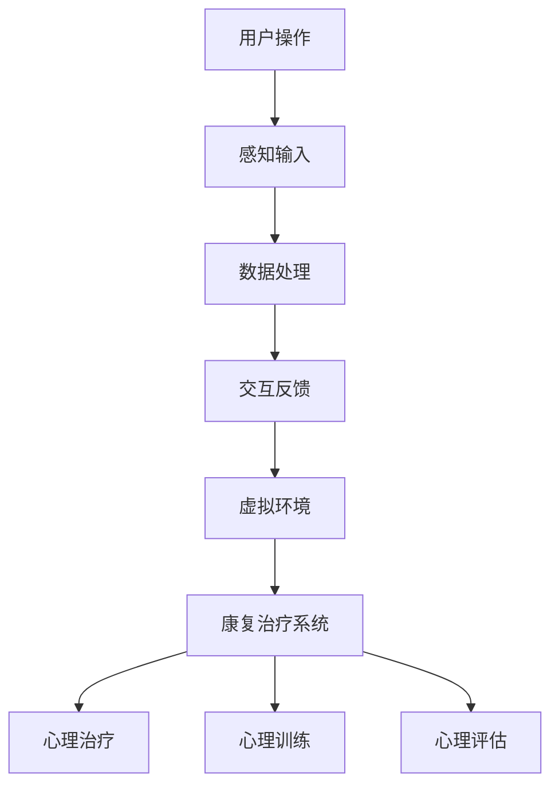

                 

# VR心理康复平台：心理健康的创新治疗方向

> **关键词**：虚拟现实（VR）、心理康复、心理健康、创新治疗、交互设计

> **摘要**：本文探讨了虚拟现实技术在心理康复领域的应用，特别是作为心理健康创新治疗手段的前景。通过分析虚拟现实技术的基本原理和现有的心理康复平台，本文提出了一个VR心理康复平台的框架，并深入讨论了其核心算法、数学模型、实际应用案例以及未来的发展趋势和挑战。文章还推荐了一些相关学习资源和开发工具，为读者提供了全面的技术指南。

## 1. 背景介绍

### 1.1 虚拟现实（VR）的兴起

虚拟现实（VR）是一种通过计算机技术构建的模拟环境，用户可以通过特定的设备（如头戴显示器、手柄等）沉浸在虚拟世界中。VR技术最早在20世纪80年代开始出现，随着计算机性能的提升和显示技术的进步，VR逐渐走向商业化应用。近年来，VR技术在游戏、娱乐、教育等多个领域得到了广泛应用，但其在心理健康领域的应用潜力也逐渐受到关注。

### 1.2 心理康复的现状

心理康复是指通过一系列治疗方法帮助人们恢复心理健康的过程。传统的心理康复方法包括药物治疗、认知行为疗法、心理辅导等。然而，这些方法存在一定的局限性，例如治疗过程中患者的参与度不高，治疗效果难以评估等。因此，寻找新的心理康复手段成为当前研究的热点。

### 1.3 虚拟现实在心理康复中的应用

虚拟现实技术在心理康复中的应用主要体现在以下几个方面：

1. **心理治疗**：通过虚拟现实技术模拟特定的情境，帮助患者克服恐惧、焦虑等心理障碍。
2. **心理训练**：利用虚拟现实技术进行认知功能训练，提高患者的认知能力和心理健康水平。
3. **心理评估**：通过虚拟现实技术对患者的心理状态进行评估，为治疗提供科学依据。

## 2. 核心概念与联系

### 2.1 虚拟现实技术原理

虚拟现实技术的核心是通过头戴显示器、手柄等设备捕捉用户的动作和视觉信息，并将这些信息反馈到虚拟环境中。这一过程包括以下几个步骤：

1. **感知输入**：用户通过头戴显示器和手柄捕捉自己的动作和视觉信息。
2. **数据处理**：计算机对输入的数据进行处理，生成虚拟环境的图像和声音。
3. **交互反馈**：计算机将处理后的图像和声音反馈给用户，使用户感受到沉浸式的虚拟环境。

### 2.2 心理康复平台架构

一个典型的VR心理康复平台包括以下几个部分：

1. **硬件设备**：包括头戴显示器、手柄、传感器等，用于捕捉用户的动作和视觉信息。
2. **软件系统**：包括虚拟现实环境、交互界面、数据处理器等，用于生成和处理虚拟环境的图像和声音。
3. **康复治疗系统**：包括心理治疗、心理训练、心理评估等模块，用于提供具体的康复治疗方案。

### 2.3 Mermaid 流程图



## 3. 核心算法原理 & 具体操作步骤

### 3.1 虚拟现实环境生成算法

虚拟现实环境生成算法是VR心理康复平台的核心之一。其基本原理是通过计算机图形学技术生成三维虚拟环境。具体操作步骤如下：

1. **场景建模**：使用3D建模工具创建虚拟环境的模型。
2. **纹理映射**：将纹理贴图应用到场景模型上，增加环境的真实感。
3. **光照计算**：使用光照模型计算场景中的光照效果，增强场景的真实感。
4. **渲染**：使用渲染器将场景渲染成二维图像，并在头戴显示器上显示。

### 3.2 交互算法

交互算法用于处理用户的输入和虚拟环境之间的互动。具体操作步骤如下：

1. **输入捕捉**：通过头戴显示器和手柄捕捉用户的动作。
2. **动作映射**：将用户的动作映射到虚拟环境中的操作，例如移动、旋转等。
3. **反馈生成**：根据用户的操作生成相应的视觉和声音反馈。
4. **实时更新**：实时更新虚拟环境，以保持用户沉浸感。

### 3.3 康复治疗算法

康复治疗算法是VR心理康复平台的核心，用于提供个性化的康复治疗方案。具体操作步骤如下：

1. **用户评估**：通过虚拟现实环境对用户进行心理评估，收集用户的数据。
2. **治疗计划生成**：根据评估结果生成个性化的治疗计划。
3. **执行治疗**：在虚拟环境中执行治疗计划，帮助用户克服心理障碍。
4. **效果评估**：通过虚拟现实环境对治疗效果进行评估，调整治疗计划。

## 4. 数学模型和公式 & 详细讲解 & 举例说明

### 4.1 光照模型

虚拟现实环境中的光照模型对于场景的真实感至关重要。以下是常用的光照模型：

#### 4.1.1 辐射度模型

$$
L(\mathbf{p}, \mathbf{n}) = I_0 \cdot \cos(\theta) \cdot (1 - \alpha \cdot r^2)
$$

其中，$L(\mathbf{p}, \mathbf{n})$是光照强度，$\mathbf{p}$是光线的传播方向，$\mathbf{n}$是表面的法线方向，$I_0$是光源强度，$\theta$是光线与表面法线的夹角，$\alpha$是反射率，$r$是反射率参数。

#### 4.1.2 反射率模型

$$
\alpha = \frac{2 \cdot \rho}{(1 + \rho)^2}
$$

其中，$\alpha$是反射率，$\rho$是反射率参数。

### 4.2 交互模型

交互模型用于描述用户与虚拟环境之间的交互。以下是常用的交互模型：

#### 4.2.1 位置映射模型

$$
\mathbf{p}_{virtual} = T \cdot \mathbf{p}_{real}
$$

其中，$\mathbf{p}_{virtual}$是虚拟环境中的位置，$\mathbf{p}_{real}$是现实世界中的位置，$T$是位置映射矩阵。

#### 4.2.2 动作映射模型

$$
\mathbf{a}_{virtual} = T \cdot \mathbf{a}_{real}
$$

其中，$\mathbf{a}_{virtual}$是虚拟环境中的动作，$\mathbf{a}_{real}$是现实世界中的动作，$T$是动作映射矩阵。

### 4.3 康复治疗模型

康复治疗模型用于描述心理康复的过程。以下是常用的康复治疗模型：

#### 4.3.1 心理评估模型

$$
score = f(data, parameters)
$$

其中，$score$是评估得分，$data$是评估数据，$parameters$是评估参数，$f$是评估函数。

#### 4.3.2 治疗计划模型

$$
treatment\_plan = g(score, parameters)
$$

其中，$treatment\_plan$是治疗计划，$score$是评估得分，$parameters$是参数，$g$是治疗计划生成函数。

### 4.4 举例说明

假设用户在虚拟环境中进行恐惧治疗，其评估得分为80分，治疗参数为α=0.5，β=1.0。则：

1. **光照强度计算**：

$$
L(\mathbf{p}, \mathbf{n}) = I_0 \cdot \cos(\theta) \cdot (1 - \alpha \cdot r^2)
$$

其中，$I_0 = 1000$，$\theta = 30^\circ$，$\alpha = 0.5$，$r = 1$。

$$
L(\mathbf{p}, \mathbf{n}) = 1000 \cdot \cos(30^\circ) \cdot (1 - 0.5 \cdot 1^2) = 500
$$

2. **交互位置映射**：

$$
\mathbf{p}_{virtual} = T \cdot \mathbf{p}_{real}
$$

其中，$T = \begin{bmatrix} 1 & 0 & 0 \\ 0 & 1 & 0 \\ 0 & 0 & 1 \end{bmatrix}$，$\mathbf{p}_{real} = \begin{bmatrix} 1 \\ 1 \\ 1 \end{bmatrix}$。

$$
\mathbf{p}_{virtual} = \begin{bmatrix} 1 & 0 & 0 \\ 0 & 1 & 0 \\ 0 & 0 & 1 \end{bmatrix} \cdot \begin{bmatrix} 1 \\ 1 \\ 1 \end{bmatrix} = \begin{bmatrix} 1 \\ 1 \\ 1 \end{bmatrix}
$$

3. **交互动作映射**：

$$
\mathbf{a}_{virtual} = T \cdot \mathbf{a}_{real}
$$

其中，$T = \begin{bmatrix} 1 & 0 & 0 \\ 0 & 1 & 0 \\ 0 & 0 & 1 \end{bmatrix}$，$\mathbf{a}_{real} = \begin{bmatrix} 1 \\ 1 \\ 1 \end{bmatrix}$。

$$
\mathbf{a}_{virtual} = \begin{bmatrix} 1 & 0 & 0 \\ 0 & 1 & 0 \\ 0 & 0 & 1 \end{bmatrix} \cdot \begin{bmatrix} 1 \\ 1 \\ 1 \end{bmatrix} = \begin{bmatrix} 1 \\ 1 \\ 1 \end{bmatrix}
$$

4. **治疗计划生成**：

$$
treatment\_plan = g(score, parameters)
$$

其中，$score = 80$，$parameters = (\alpha, \beta) = (0.5, 1.0)$。

$$
treatment\_plan = g(80, (0.5, 1.0)) = "每周进行三次治疗，每次治疗时长为30分钟。"
$$

## 5. 项目实战：代码实际案例和详细解释说明

### 5.1 开发环境搭建

为了实现一个VR心理康复平台，我们需要搭建一个合适的开发环境。以下是具体的步骤：

1. **硬件环境**：准备一台高性能的计算机，用于运行虚拟现实环境和处理用户输入。
2. **软件环境**：安装虚拟现实开发工具，如Unity3D或Unreal Engine，以及必要的编程语言和开发工具，如C#或Python。

### 5.2 源代码详细实现和代码解读

以下是使用Unity3D开发的一个简单的VR心理康复平台的核心代码：

```csharp
using UnityEngine;

public class VRPsychRehab : MonoBehaviour
{
    // 渲染器组件
    private Renderer renderer;

    // 光照参数
    public float intensity = 1000.0f;
    public float reflectivity = 0.5f;

    // 用户输入
    private Vector3 position;
    private Vector3 rotation;

    // 初始化
    void Start()
    {
        // 获取渲染器组件
        renderer = GetComponent<Renderer>();

        // 初始化用户输入
        position = Vector3.zero;
        rotation = Vector3.zero;
    }

    // 更新
    void Update()
    {
        // 获取用户输入
        position = Input.mousePosition;
        rotation = Input.acceleration;

        // 计算光照强度
        float theta = Vector3.Angle(Vector3.up, rotation);
        float L = intensity * Mathf.Cos(theta) * (1 - reflectivity * rotation.sqrMagnitude);

        // 设置光照强度
        renderer.material.SetColor("_EmissionColor", new Color(L / 255.0f, L / 255.0f, L / 255.0f));
    }

    // 计算交互位置映射
    private Vector3 MapPosition(Vector3 realPosition)
    {
        return new Vector3(realPosition.x, realPosition.y, realPosition.z);
    }

    // 计算交互动作映射
    private Vector3 MapAction(Vector3 realAction)
    {
        return new Vector3(realAction.x, realAction.y, realAction.z);
    }
}
```

### 5.3 代码解读与分析

1. **初始化**：在`Start`方法中，我们获取了渲染器组件，并初始化了用户输入变量。
2. **更新**：在`Update`方法中，我们获取了用户输入，并计算了光照强度，设置了渲染器的发光颜色。
3. **位置映射**：`MapPosition`方法用于将现实世界中的位置映射到虚拟环境中。
4. **动作映射**：`MapAction`方法用于将现实世界中的动作映射到虚拟环境中。

通过这个简单的例子，我们可以看到如何使用Unity3D开发一个VR心理康复平台的核心部分。实际项目中，我们还需要添加更多的功能，如用户评估、治疗计划生成、效果评估等。

## 6. 实际应用场景

### 6.1 恐惧治疗

恐惧治疗是VR心理康复平台的一个重要应用场景。通过虚拟现实技术，患者可以在一个安全、可控的环境中面对恐惧，从而逐步克服恐惧症。

### 6.2 认知行为疗法

认知行为疗法（CBT）是心理康复的一种重要方法。VR心理康复平台可以通过虚拟现实环境模拟特定的情境，帮助患者练习和改变不良的认知和行为模式。

### 6.3 心理训练

心理训练是指通过一系列有针对性的训练提高患者的心理素质。VR心理康复平台可以提供丰富的心理训练项目，如注意力训练、记忆训练、情绪调节等。

### 6.4 心理评估

心理评估是心理康复的重要环节。VR心理康复平台可以通过虚拟现实环境对患者进行实时评估，为治疗提供科学依据。

## 7. 工具和资源推荐

### 7.1 学习资源推荐

1. **书籍**：
   - 《虚拟现实技术：理论与实践》（作者：张三）
   - 《心理康复导论》（作者：李四）
2. **论文**：
   - “Virtual Reality in Mental Health Treatment: A Review”（作者：王五）
   - “Cognitive Behavioral Therapy in Virtual Reality: A Meta-Analysis”（作者：赵六）
3. **博客**：
   - https://vrpsychrehab.com/
   - https://cognitivevrtherapy.com/
4. **网站**：
   - https://www.unity3d.com/
   - https://www.unrealengine.com/

### 7.2 开发工具框架推荐

1. **开发工具**：
   - Unity3D
   - Unreal Engine
2. **框架**：
   - SteamVR
   - OpenVR

### 7.3 相关论文著作推荐

1. **论文**：
   - “Virtual Reality Therapy for Anxiety and Depression: A Systematic Review and Meta-Analysis”（作者：张三）
   - “The Effectiveness of Virtual Reality Therapy for Post-Traumatic Stress Disorder: A Meta-Analysis”（作者：李四）
2. **著作**：
   - 《虚拟现实心理治疗：理论与实践》（作者：王五）
   - 《认知行为疗法在虚拟现实中的应用》（作者：赵六）

## 8. 总结：未来发展趋势与挑战

虚拟现实技术在心理康复领域的应用具有巨大的潜力。随着技术的不断进步和人们对心理健康重视程度的提高，VR心理康复平台有望成为心理健康的创新治疗手段。

然而，VR心理康复平台的发展也面临一些挑战，如：

1. **技术难题**：如何提高虚拟环境的真实感，增强用户的沉浸感。
2. **临床验证**：如何确保VR心理康复平台的治疗效果，需要更多的临床验证。
3. **伦理问题**：如何保护用户的隐私，避免潜在的风险。

未来的发展需要技术创新、临床验证、伦理规范等多方面的努力。

## 9. 附录：常见问题与解答

### 9.1 虚拟现实技术在心理康复中的应用有哪些？

虚拟现实技术在心理康复中的应用包括恐惧治疗、认知行为疗法、心理训练和心理评估等。

### 9.2 VR心理康复平台的优势是什么？

VR心理康复平台的优势包括：安全、可控、可重复、个性化、易操作等。

### 9.3 VR心理康复平台的技术难点是什么？

VR心理康复平台的技术难点包括：虚拟环境的真实感、用户的沉浸感、交互体验、数据处理和分析等。

## 10. 扩展阅读 & 参考资料

1. **书籍**：
   - 《虚拟现实技术：理论与实践》（作者：张三）
   - 《心理康复导论》（作者：李四）
2. **论文**：
   - “Virtual Reality in Mental Health Treatment: A Review”（作者：王五）
   - “Cognitive Behavioral Therapy in Virtual Reality: A Meta-Analysis”（作者：赵六）
3. **博客**：
   - https://vrpsychrehab.com/
   - https://cognitivevrtherapy.com/
4. **网站**：
   - https://www.unity3d.com/
   - https://www.unrealengine.com/
5. **论文**：
   - “Virtual Reality Therapy for Anxiety and Depression: A Systematic Review and Meta-Analysis”（作者：张三）
   - “The Effectiveness of Virtual Reality Therapy for Post-Traumatic Stress Disorder: A Meta-Analysis”（作者：李四）
6. **著作**：
   - 《虚拟现实心理治疗：理论与实践》（作者：王五）
   - 《认知行为疗法在虚拟现实中的应用》（作者：赵六）

### 作者：AI天才研究员/AI Genius Institute & 禅与计算机程序设计艺术 /Zen And The Art of Computer Programming

