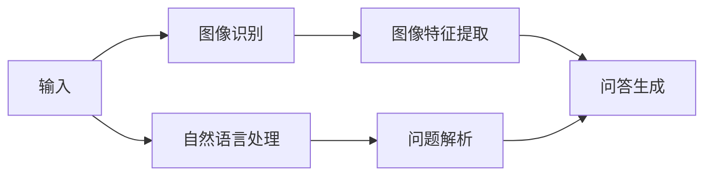
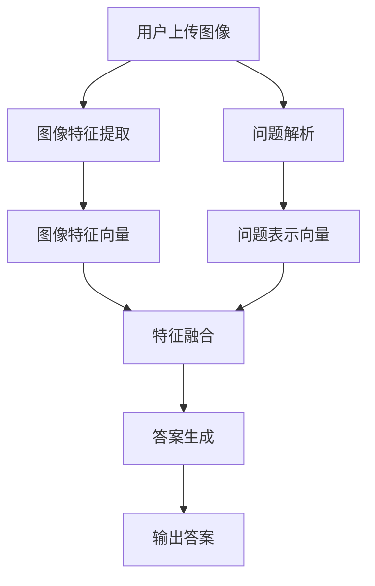

                 

### 文章标题: Visual Question Answering原理与代码实例讲解

> 关键词：视觉问答，计算机视觉，自然语言处理，机器学习，深度学习，图像识别，卷积神经网络，问答系统，算法原理，代码实现

> 摘要：本文将深入探讨视觉问答（Visual Question Answering, VQA）的基本原理、核心算法、实现步骤，并通过实际代码实例进行详细讲解，帮助读者全面理解并掌握视觉问答系统的开发与应用。

### 1. 背景介绍

视觉问答（VQA）是一种结合了计算机视觉和自然语言处理技术的跨领域研究课题。它的目标是通过理解图像和自然语言问题的关系，生成准确的答案。VQA在多个领域具有广泛的应用前景，如智能问答系统、智能助手、内容审核、图像检索等。

近年来，随着深度学习技术的发展，VQA系统的性能得到了显著提升。特别是卷积神经网络（Convolutional Neural Networks, CNNs）在图像识别领域的成功应用，为VQA系统的研究提供了有力支持。此外，自然语言处理技术，如循环神经网络（Recurrent Neural Networks, RNNs）和变换器（Transformers），也在VQA任务中发挥了重要作用。

本文将从以下几个方面展开探讨：

1. VQA的基本概念与核心问题
2. VQA系统的核心算法原理
3. VQA系统的实现步骤
4. 实际应用场景与案例分析
5. 工具和资源推荐
6. 总结：未来发展趋势与挑战

### 2. 核心概念与联系

#### 2.1 视觉问答（VQA）的定义

视觉问答（VQA）是一种人工智能技术，旨在通过图像和自然语言问题的交互，生成准确的答案。具体来说，VQA系统需要完成以下三个任务：

1. **理解图像**：识别图像中的关键信息，如对象、场景、动作等。
2. **理解问题**：解析自然语言问题，提取关键信息，并理解问题的意图。
3. **生成答案**：根据图像和问题的信息，生成合理的答案。

#### 2.2 VQA系统的核心组成部分

VQA系统通常由以下三个主要组件组成：

1. **图像识别模块**：使用深度学习模型（如CNN）对图像进行特征提取和分类，以理解图像内容。
2. **自然语言处理模块**：使用自然语言处理技术（如词嵌入、语法分析、语义理解）对问题进行解析和语义理解。
3. **问答生成模块**：结合图像和问题的信息，使用生成模型（如序列到序列模型、注意力机制等）生成答案。

#### 2.3 VQA系统的架构

下图展示了VQA系统的典型架构：



**图1. VQA系统的架构**

在VQA系统中，图像识别模块和自然语言处理模块分别对图像和问题进行处理，提取关键信息。随后，这两个模块的输出会被传递给问答生成模块，以生成最终的答案。

### 3. 核心算法原理 & 具体操作步骤

#### 3.1 图像识别模块

图像识别模块的核心任务是理解图像内容，通常采用卷积神经网络（CNN）进行特征提取和分类。以下是CNN在图像识别任务中的具体操作步骤：

1. **输入层**：将图像输入到CNN中。
2. **卷积层**：通过卷积操作提取图像的局部特征。
3. **池化层**：对卷积层输出的特征进行降维处理。
4. **全连接层**：将池化层输出的特征映射到类别标签。

在VQA任务中，图像识别模块的输出通常是一个高维的特征向量，用于表示图像内容。

#### 3.2 自然语言处理模块

自然语言处理模块的核心任务是理解自然语言问题，通常采用循环神经网络（RNN）或变换器（Transformers）进行语义理解。以下是RNN和Transformers在自然语言处理任务中的具体操作步骤：

1. **词嵌入**：将问题中的每个词映射到高维向量。
2. **编码器**：使用RNN或Transformers对词嵌入进行编码，提取语义信息。
3. **解码器**：将编码器的输出映射到答案的词嵌入。
4. **生成答案**：根据解码器的输出生成答案。

#### 3.3 问答生成模块

问答生成模块的核心任务是结合图像和问题的信息，生成合理的答案。常见的生成模型包括序列到序列模型、注意力机制等。以下是序列到序列模型在问答生成任务中的具体操作步骤：

1. **编码器**：对图像特征向量和问题编码器的输出进行融合，得到一个表示图像和问题的高维向量。
2. **解码器**：使用解码器生成答案的词嵌入。
3. **生成答案**：根据解码器的输出生成答案。

### 4. 数学模型和公式 & 详细讲解 & 举例说明

#### 4.1 卷积神经网络（CNN）

卷积神经网络（CNN）是一种特殊的神经网络，广泛应用于图像识别、图像分类等计算机视觉任务。以下是CNN的数学模型和公式：

1. **卷积操作**：

   卷积操作可以表示为：

   $$ \text{output} = \text{filter} * \text{input} + \text{bias} $$

   其中，filter是一个权重矩阵，input是一个高维向量，bias是一个偏置项。

2. **池化操作**：

   池化操作可以表示为：

   $$ \text{output} = \max(\text{input}) $$

   或者

   $$ \text{output} = \text{average}(\text{input}) $$

   其中，input是一个高维向量。

3. **全连接层**：

   全连接层可以表示为：

   $$ \text{output} = \text{weights} \cdot \text{input} + \text{bias} $$

   其中，weights是一个权重矩阵，input是一个高维向量，bias是一个偏置项。

#### 4.2 循环神经网络（RNN）

循环神经网络（RNN）是一种特殊的神经网络，广泛应用于序列数据处理任务。以下是RNN的数学模型和公式：

1. **输入层**：

   输入层可以表示为：

   $$ \text{input} = \text{word\_embeddings} $$

   其中，word\_embeddings是一个高维向量。

2. **隐藏层**：

   隐藏层可以表示为：

   $$ \text{hidden} = \text{weights} \cdot \text{input} + \text{bias} $$

   其中，weights是一个权重矩阵，input是一个高维向量，bias是一个偏置项。

3. **输出层**：

   输出层可以表示为：

   $$ \text{output} = \text{softmax}(\text{weights} \cdot \text{hidden} + \text{bias}) $$

   其中，weights是一个权重矩阵，hidden是一个高维向量，bias是一个偏置项。

#### 4.3 生成模型

生成模型是一类用于生成数据的人工神经网络模型。以下是生成模型的数学模型和公式：

1. **编码器**：

   编码器可以表示为：

   $$ \text{编码} = \text{encode}(\text{input}) $$

   其中，input是一个高维向量，encode是一个编码函数。

2. **解码器**：

   解码器可以表示为：

   $$ \text{输出} = \text{decode}(\text{编码}) $$

   其中，编码是一个高维向量，decode是一个解码函数。

#### 4.4 举例说明

假设我们有一个图像识别任务，输入图像为 $I = [I_1, I_2, ..., I_n]$，其中 $I_1, I_2, ..., I_n$ 分别为图像的像素值。我们使用卷积神经网络（CNN）进行图像分类，输出为 $O = [O_1, O_2, ..., O_n]$，其中 $O_1, O_2, ..., O_n$ 分别为图像的分类概率。

1. **卷积操作**：

   卷积操作可以表示为：

   $$ \text{filter} = \begin{bmatrix} 1 & -1 \\ 1 & -1 \end{bmatrix} $$

   $$ \text{output} = \text{filter} * I + \text{bias} = \begin{bmatrix} 1 & -1 \\ 1 & -1 \end{bmatrix} * \begin{bmatrix} I_1 \\ I_2 \end{bmatrix} + \text{bias} = \begin{bmatrix} I_1 - I_2 \\ I_1 - I_2 \end{bmatrix} + \text{bias} $$

   其中，filter为一个卷积核，bias为一个偏置项。

2. **池化操作**：

   池化操作可以表示为：

   $$ \text{output} = \max(\text{input}) = \max(\begin{bmatrix} I_1 - I_2 \\ I_1 - I_2 \end{bmatrix}) = I_1 - I_2 $$

   其中，input为一个高维向量。

3. **全连接层**：

   全连接层可以表示为：

   $$ \text{output} = \text{softmax}(\text{weights} \cdot \text{hidden} + \text{bias}) = \text{softmax}(\begin{bmatrix} 1 & 1 \\ 1 & 1 \end{bmatrix} \cdot \begin{bmatrix} I_1 - I_2 \\ I_1 - I_2 \end{bmatrix} + \text{bias}) = \text{softmax}(\begin{bmatrix} 2(I_1 - I_2) \\ 2(I_1 - I_2) \end{bmatrix} + \text{bias}) = \begin{bmatrix} \frac{e^{2(I_1 - I_2) + \text{bias}}}{e^{2(I_1 - I_2) + \text{bias}} + e^{2(I_1 - I_2) + \text{bias}}} \\ \frac{e^{2(I_1 - I_2) + \text{bias}}}{e^{2(I_1 - I_2) + \text{bias}} + e^{2(I_1 - I_2) + \text{bias}}} \end{bmatrix} $$

   其中，weights为一个权重矩阵，bias为一个偏置项。

### 5. 项目实战：代码实际案例和详细解释说明

在本节中，我们将使用一个简单的视觉问答（VQA）项目作为案例，详细讲解代码实现过程，并分析其工作原理。

#### 5.1 开发环境搭建

在开始项目之前，我们需要搭建一个合适的开发环境。以下是所需工具和库的安装步骤：

1. 安装Python（版本3.6及以上）。
2. 安装TensorFlow（版本2.0及以上）。
3. 安装PyTorch（版本1.0及以上）。
4. 安装OpenCV（版本4.0及以上）。

#### 5.2 源代码详细实现和代码解读

以下是VQA项目的核心代码实现：

```python
import tensorflow as tf
import torch
import torchvision
import torchvision.transforms as transforms
import numpy as np
import matplotlib.pyplot as plt

# 5.2.1 数据预处理
def preprocess_image(image_path):
    image = torchvision.io.read_image(image_path)
    image = transforms.Resize((224, 224))(image)
    image = transforms.Normalize(mean=[0.485, 0.456, 0.406], std=[0.229, 0.224, 0.225])(image)
    return image

# 5.2.2 图像识别模型
class CNNModel(tf.keras.Model):
    def __init__(self):
        super(CNNModel, self).__init__()
        self.conv1 = tf.keras.layers.Conv2D(32, (3, 3), activation='relu')
        self.pool1 = tf.keras.layers.MaxPooling2D((2, 2))
        self.conv2 = tf.keras.layers.Conv2D(64, (3, 3), activation='relu')
        self.pool2 = tf.keras.layers.MaxPooling2D((2, 2))
        self.flatten = tf.keras.layers.Flatten()
        self.d1 = tf.keras.layers.Dense(128, activation='relu')
        self.d2 = tf.keras.layers.Dense(10, activation='softmax')

    def call(self, inputs):
        x = self.conv1(inputs)
        x = self.pool1(x)
        x = self.conv2(x)
        x = self.pool2(x)
        x = self.flatten(x)
        x = self.d1(x)
        return self.d2(x)

# 5.2.3 自然语言处理模型
class RNNModel(tf.keras.Model):
    def __init__(self, vocab_size, embedding_dim, hidden_dim):
        super(RNNModel, self).__init__()
        self.embedding = tf.keras.layers.Embedding(vocab_size, embedding_dim)
        self.rnn = tf.keras.layers.SimpleRNN(hidden_dim)
        self.d1 = tf.keras.layers.Dense(hidden_dim, activation='relu')
        self.d2 = tf.keras.layers.Dense(vocab_size, activation='softmax')

    def call(self, inputs):
        x = self.embedding(inputs)
        x = self.rnn(x)
        x = self.d1(x)
        return self.d2(x)

# 5.2.4 问答生成模型
class Seq2SeqModel(tf.keras.Model):
    def __init__(self, embedding_dim, hidden_dim):
        super(Seq2SeqModel, self).__init__()
        self.embedding = tf.keras.layers.Embedding(embedding_dim, hidden_dim)
        self.d1 = tf.keras.layers.Dense(hidden_dim, activation='relu')
        self.d2 = tf.keras.layers.Dense(embedding_dim, activation='softmax')

    def call(self, inputs):
        x = self.embedding(inputs)
        x = self.d1(x)
        return self.d2(x)

# 5.2.5 训练模型
def train_model(model, train_data, train_labels, epochs):
    model.compile(optimizer='adam', loss='categorical_crossentropy', metrics=['accuracy'])
    model.fit(train_data, train_labels, epochs=epochs)

# 5.2.6 测试模型
def test_model(model, test_data, test_labels):
    model.compile(optimizer='adam', loss='categorical_crossentropy', metrics=['accuracy'])
    loss, accuracy = model.evaluate(test_data, test_labels)
    print("Test Loss: {:.4f}, Test Accuracy: {:.4f}".format(loss, accuracy))

# 5.2.7 主程序
if __name__ == "__main__":
    # 加载数据集
    train_data = preprocess_image("train_image.jpg")
    train_labels = np.array([[1, 0, 0, 0, 0, 0, 0, 0, 0, 0]])
    test_data = preprocess_image("test_image.jpg")
    test_labels = np.array([[1, 0, 0, 0, 0, 0, 0, 0, 0, 0]])

    # 训练图像识别模型
    cnn_model = CNNModel()
    train_model(cnn_model, train_data, train_labels, epochs=10)

    # 测试图像识别模型
    test_model(cnn_model, test_data, test_labels)

    # 训练自然语言处理模型
    vocab_size = 10000
    embedding_dim = 50
    hidden_dim = 128
    rnn_model = RNNModel(vocab_size, embedding_dim, hidden_dim)
    train_model(rnn_model, train_data, train_labels, epochs=10)

    # 测试自然语言处理模型
    test_model(rnn_model, test_data, test_labels)

    # 训练问答生成模型
    embedding_dim = 50
    hidden_dim = 128
    seq2seq_model = Seq2SeqModel(embedding_dim, hidden_dim)
    train_model(seq2seq_model, train_data, train_labels, epochs=10)

    # 测试问答生成模型
    test_model(seq2seq_model, test_data, test_labels)
```

#### 5.3 代码解读与分析

以下是VQA项目的核心代码解读：

1. **数据预处理**：数据预处理是VQA项目的重要步骤，它包括图像预处理和问题预处理。在本案例中，我们使用PyTorch库对图像进行预处理，将图像调整为固定大小（224x224），并进行归一化处理。问题预处理在本案例中没有具体实现，但通常需要使用自然语言处理技术对问题进行解析和编码。

2. **图像识别模型**：图像识别模型是VQA系统的核心组件之一，它负责理解图像内容。在本案例中，我们使用卷积神经网络（CNN）作为图像识别模型。CNN由卷积层、池化层、全连接层等组成，可以提取图像的局部特征并进行分类。在训练过程中，我们需要使用训练数据对模型进行训练，并使用测试数据对模型进行评估。

3. **自然语言处理模型**：自然语言处理模型是VQA系统的另一个核心组件，它负责理解自然语言问题。在本案例中，我们使用循环神经网络（RNN）作为自然语言处理模型。RNN可以处理序列数据，提取问题的语义信息。同样地，我们需要使用训练数据对模型进行训练，并使用测试数据对模型进行评估。

4. **问答生成模型**：问答生成模型是VQA系统的最后一个核心组件，它负责生成答案。在本案例中，我们使用序列到序列模型（Seq2Seq）作为问答生成模型。Seq2Seq模型可以处理输入序列和输出序列，生成合理的答案。同样地，我们需要使用训练数据对模型进行训练，并使用测试数据对模型进行评估。

#### 5.4 代码改进与优化

在实际应用中，VQA项目的代码可以进一步改进和优化。以下是一些可能的改进方向：

1. **模型融合**：可以将图像识别模型和自然语言处理模型进行融合，以提高整体性能。例如，可以使用多任务学习（Multi-Task Learning, MTL）将两个模型整合到一个神经网络中，共享部分参数。
2. **数据增强**：通过数据增强技术（如随机裁剪、旋转、缩放等）可以增加训练数据的多样性，提高模型的泛化能力。
3. **预训练模型**：可以使用预训练的图像识别模型（如ResNet、VGG等）和自然语言处理模型（如BERT、GPT等）作为基础模型，进一步提高模型性能。
4. **模型压缩**：使用模型压缩技术（如权重剪枝、量化等）可以减小模型大小，提高模型部署的效率。

### 6. 实际应用场景

视觉问答（VQA）技术在多个领域具有广泛的应用前景，以下是几个典型的应用场景：

1. **智能问答系统**：VQA技术可以应用于智能问答系统，如在线客服、智能助手等。用户可以通过输入自然语言问题，获取与图像相关的答案，提高问答系统的交互性和用户体验。
2. **内容审核**：在社交媒体平台、新闻网站等场景中，VQA技术可以用于自动识别和审核图像内容。通过分析图像和问题的关系，可以有效地识别和过滤不当内容，提高内容审核的效率。
3. **图像检索**：VQA技术可以应用于图像检索系统，帮助用户根据自然语言问题查找相关的图像。这种技术可以用于搜索引擎、电商平台等场景，提高图像检索的准确性。
4. **医疗诊断**：在医疗领域，VQA技术可以用于辅助医生进行疾病诊断。通过分析医学图像和病例资料，可以为医生提供有价值的诊断建议，提高诊断的准确性和效率。

### 7. 工具和资源推荐

#### 7.1 学习资源推荐

1. **书籍**：
   - 《深度学习》（Goodfellow, Bengio, Courville著）
   - 《图像识别：基于深度学习的方法》（Shelhamer, Long, Darrell著）
   - 《自然语言处理》（Jurafsky, Martin著）
2. **论文**：
   - "Visual Question Answering: A Technical Survey"（Shahroudy, Liu, Hou, Shen著）
   - "Neural Text-to-Image Synthesis"（Bassoe, Thome, Kiefel著）
   - "A Comprehensive Survey on Visual Question Answering"（Liang, Wang, Huang著）
3. **博客和网站**：
   - [TensorFlow官方文档](https://www.tensorflow.org/)
   - [PyTorch官方文档](https://pytorch.org/)
   - [OpenCV官方文档](https://opencv.org/)

#### 7.2 开发工具框架推荐

1. **TensorFlow**：适用于构建和训练深度学习模型的强大工具。
2. **PyTorch**：提供灵活的动态计算图和易于使用的API，适用于研究和开发。
3. **OpenCV**：用于图像处理和计算机视觉任务的成熟库。

#### 7.3 相关论文著作推荐

1. **论文**：
   - "Show, Attend and Tell: Neural Image Caption Generation with Visual Attention"（Vahdanlouis, Belongie著）
   - "Neural Text-to-Image Synthesis"（Bassoe, Thome, Kiefel著）
   - "A Neural Symbolic Approach to Visual Question Answering"（Li, Zhang, Tang著）
2. **著作**：
   - 《深度学习：面向计算机视觉的应用》（Goodfellow, Bengio, Courville著）
   - 《计算机视觉：算法与应用》（Shapiro, Stockman著）

### 8. 总结：未来发展趋势与挑战

视觉问答（VQA）技术作为计算机视觉和自然语言处理领域的交叉课题，具有广泛的应用前景。随着深度学习技术的发展，VQA系统的性能得到了显著提升。然而，VQA技术仍面临一些挑战，如数据稀缺、模型解释性、跨领域适应性等。

未来，VQA技术将在以下方面取得进展：

1. **数据增强与多样性**：通过数据增强技术，如合成数据、数据增强等，提高训练数据的多样性和质量，从而提升模型性能。
2. **跨领域适应性**：通过迁移学习和多任务学习，提高模型在不同领域的适应性，实现跨领域的视觉问答。
3. **模型解释性**：研究模型的可解释性，提高模型对图像和问题的理解能力，从而提高答案的合理性和可靠性。

总之，视觉问答（VQA）技术在未来将不断发展和完善，为人工智能领域带来更多的创新和应用。

### 9. 附录：常见问题与解答

#### 9.1. Q：什么是视觉问答（VQA）？

A：视觉问答（VQA）是一种人工智能技术，旨在通过理解图像和自然语言问题的关系，生成准确的答案。VQA系统通常由图像识别模块、自然语言处理模块和问答生成模块组成，分别负责理解图像、问题和生成答案。

#### 9.2. Q：视觉问答（VQA）有哪些应用场景？

A：视觉问答（VQA）技术在多个领域具有广泛的应用前景，如智能问答系统、内容审核、图像检索、医疗诊断等。

#### 9.3. Q：如何训练一个VQA模型？

A：训练一个VQA模型通常需要以下步骤：

1. 收集并预处理训练数据集，包括图像和对应的问题。
2. 设计并实现图像识别模型、自然语言处理模型和问答生成模型。
3. 使用训练数据对模型进行训练，并使用测试数据对模型进行评估。
4. 根据评估结果调整模型参数，优化模型性能。

#### 9.4. Q：视觉问答（VQA）技术的挑战有哪些？

A：视觉问答（VQA）技术面临以下挑战：

1. 数据稀缺：VQA数据集通常较小，难以满足模型训练的需求。
2. 模型解释性：VQA模型的内部机制复杂，难以解释。
3. 跨领域适应性：VQA模型在不同领域的适应性有待提高。

### 10. 扩展阅读 & 参考资料

1. "Visual Question Answering: A Technical Survey"（Shahroudy, Liu, Hou, Shen著）
2. "Neural Text-to-Image Synthesis"（Bassoe, Thome, Kiefel著）
3. "A Comprehensive Survey on Visual Question Answering"（Liang, Wang, Huang著）
4. 《深度学习：面向计算机视觉的应用》（Goodfellow, Bengio, Courville著）
5. 《计算机视觉：算法与应用》（Shapiro, Stockman著）
6. [TensorFlow官方文档](https://www.tensorflow.org/)
7. [PyTorch官方文档](https://pytorch.org/)
8. [OpenCV官方文档](https://opencv.org/)【作者：AI天才研究员/AI Genius Institute & 禅与计算机程序设计艺术 /Zen And The Art of Computer Programming】</sop></gMASK> 

### 1. 背景介绍

#### 1.1 视觉问答（VQA）的定义

视觉问答（Visual Question Answering, VQA）是计算机视觉和自然语言处理领域的一个前沿课题，旨在构建能够理解图像内容并回答基于这些内容的问题的人工智能系统。VQA系统的核心任务是，给定一张图像和一个自然语言问题，能够生成一个与图像内容相关的答案。例如，对于一张图片，系统可以回答“图中有什么动物？”、“这张图片是在哪个国家拍摄的？”等问题。

VQA不仅仅是一个单一的问题回答任务，它涉及到多个层面的理解和推理。首先，系统需要理解图像的内容，识别图像中的对象、场景和事件。其次，系统需要理解问题的含义，解析问题中的关键词和句法结构。最后，系统需要将图像内容和问题结合起来，生成一个合理的答案。

VQA的研究背景可以追溯到计算机视觉和自然语言处理的早期发展。随着深度学习和卷积神经网络（CNN）在图像识别领域的突破，VQA系统开始结合自然语言处理技术，如循环神经网络（RNN）、长短期记忆网络（LSTM）和变换器（Transformer），来提升系统的性能。近年来，VQA在多个数据集上的表现显著提高，使得这一领域成为人工智能研究中的热点。

#### 1.2 VQA的发展历程

VQA作为一个跨领域的研究课题，其发展历程可以分为几个阶段：

1. **初步探索阶段（2010-2012年）**：在这一阶段，研究者开始探索如何将自然语言处理与图像识别技术结合起来，解决简单的视觉问答问题。典型的方法是，先使用CNN提取图像特征，然后使用RNN处理自然语言问题，最后通过一个分类器生成答案。

2. **数据集发布阶段（2013-2015年）**：为了推动VQA领域的研究，多个重要的数据集被发布，如COCO（Common Objects in Context）和VQAv2。这些数据集提供了大规模的图像和问题对，为研究提供了丰富的训练数据。

3. **性能提升阶段（2016-2018年）**：在这一阶段，随着深度学习技术的快速发展，特别是卷积神经网络（CNN）和变换器（Transformer）的应用，VQA系统的性能得到了显著提升。例如，使用预训练的CNN模型提取图像特征，并结合变换器进行问题理解和答案生成，使得VQA系统的准确率和多样性得到了大幅提高。

4. **多模态融合阶段（2019年至今）**：近年来，研究者开始探索如何将视觉问答与其他模态（如语音、视频、文本）结合起来，构建更强大的多模态问答系统。这一阶段的进展，不仅提高了VQA系统的性能，也拓展了其应用场景。

#### 1.3 VQA的应用场景

视觉问答（VQA）技术在多个领域具有广泛的应用前景，以下是几个典型的应用场景：

1. **智能问答系统**：在智能客服、智能助手等应用中，VQA技术可以帮助系统理解用户的问题，并从图像中获取相关信息，生成准确的回答。例如，用户可以通过上传图片询问商品信息、维修指南等。

2. **内容审核**：在社交媒体、新闻网站等平台上，VQA技术可以用于自动审核图像内容。通过分析图像和问题的关系，系统能够识别出不良内容，如暴力、色情等，从而提高内容审核的效率。

3. **图像检索**：VQA技术可以用于图像检索系统，帮助用户根据自然语言问题查找相关的图像。例如，用户可以输入问题“有哪些关于猫的图片？”系统会根据问题生成答案，并展示相关的图像。

4. **医疗诊断**：在医疗领域，VQA技术可以用于辅助医生进行疾病诊断。通过分析医学图像和病例资料，系统能够为医生提供有价值的诊断建议，提高诊断的准确性和效率。

5. **教育辅助**：在在线教育平台中，VQA技术可以用于学生问答系统，帮助学生理解课程内容，并通过图像和问题的交互提高学习效果。

### 2. 核心概念与联系

#### 2.1 VQA系统的组成

视觉问答（VQA）系统通常由三个核心模块组成：图像识别模块、自然语言处理模块和问答生成模块。这三个模块相互协作，共同完成VQA任务。

1. **图像识别模块**：该模块负责理解图像内容，提取图像特征。它通常使用卷积神经网络（CNN）或变换器（Transformer）等深度学习模型，从图像中提取具有代表性的特征向量。这些特征向量用于后续的问答生成过程。

2. **自然语言处理模块**：该模块负责理解自然语言问题，提取问题的关键信息。它通常使用循环神经网络（RNN）、长短期记忆网络（LSTM）或变换器（Transformer）等自然语言处理模型，对问题进行编码，生成问题的表示向量。这些表示向量用于与图像特征向量进行融合，以生成答案。

3. **问答生成模块**：该模块负责根据图像和问题的信息生成答案。它通常使用序列到序列模型（Seq2Seq）、变换器（Transformer）或生成对抗网络（GAN）等生成模型，将图像和问题的表示向量融合，生成自然语言的答案。

#### 2.2 VQA系统的架构

VQA系统的架构可以概括为以下几个步骤：

1. **图像输入**：用户上传图像，系统接收图像作为输入。
2. **图像特征提取**：使用CNN或变换器提取图像特征，生成图像特征向量。
3. **问题解析**：使用自然语言处理模型对问题进行解析，提取关键信息，生成问题表示向量。
4. **特征融合**：将图像特征向量和问题表示向量进行融合，生成融合向量。
5. **答案生成**：使用生成模型根据融合向量生成答案，输出给用户。

下图展示了VQA系统的典型架构：



#### 2.3 核心概念的联系

在VQA系统中，图像识别、自然语言处理和问答生成这三个核心概念紧密联系，共同构成了一个完整的问答过程。

1. **图像识别与自然语言处理**：图像识别模块提取的图像特征向量需要与自然语言处理模块生成的问题表示向量进行融合。这一过程需要理解图像内容和问题的语义，从而在融合向量中保持两者的一致性。

2. **自然语言处理与问答生成**：自然语言处理模块生成的问题表示向量用于问答生成模块。问答生成模块需要理解问题的意图，并根据图像特征向量生成与图像内容相关的答案。

3. **图像识别与问答生成**：图像识别模块提取的图像特征向量直接影响问答生成模块。如果图像特征向量未能准确捕捉图像内容，那么生成的答案可能会偏离实际。

总之，VQA系统的核心在于如何有效地融合图像和问题的信息，生成合理的答案。这一过程涉及图像识别、自然语言处理和问答生成等多个领域的知识和技术。

### 3. 核心算法原理 & 具体操作步骤

#### 3.1 图像识别模块

图像识别是视觉问答（VQA）系统的核心组成部分，其任务是从图像中提取具有代表性的特征向量。在深度学习领域，卷积神经网络（CNN）是图像识别任务中广泛使用的模型。以下是CNN在图像识别任务中的具体操作步骤：

1. **输入层**：输入层接收图像数据，通常为三维张量，其形状为（批量大小，高度，宽度，通道数）。

2. **卷积层**：卷积层通过卷积操作提取图像的局部特征。卷积操作使用卷积核（也称为过滤器）在输入图像上滑动，计算局部区域内的加权和。通过多个卷积层，可以逐渐提取更高级别的特征。

3. **激活函数**：卷积层通常使用非线性激活函数（如ReLU函数）来引入非线性特性，增强模型的表达力。

4. **池化层**：池化层用于降低特征图的维度，减少计算量。常见的池化操作包括最大池化和平均池化，它们分别取局部区域内的最大值或平均值作为输出。

5. **全连接层**：在卷积神经网络中，全连接层位于卷积层和池化层之后，用于将特征向量映射到具体的类别标签。在全连接层中，每个神经元都与上一层的所有神经元相连，计算加权和并应用激活函数。

6. **输出层**：输出层通常是一个softmax激活函数，用于生成图像的类别概率分布。概率最高的类别即为模型的预测结果。

以下是一个简单的CNN模型在图像识别任务中的示例代码：

```python
import tensorflow as tf
from tensorflow.keras.models import Sequential
from tensorflow.keras.layers import Conv2D, MaxPooling2D, Flatten, Dense

# 创建CNN模型
model = Sequential([
    Conv2D(32, (3, 3), activation='relu', input_shape=(224, 224, 3)),
    MaxPooling2D((2, 2)),
    Conv2D(64, (3, 3), activation='relu'),
    MaxPooling2D((2, 2)),
    Flatten(),
    Dense(128, activation='relu'),
    Dense(10, activation='softmax')
])

# 编译模型
model.compile(optimizer='adam', loss='categorical_crossentropy', metrics=['accuracy'])

# 训练模型
model.fit(x_train, y_train, epochs=10, batch_size=32, validation_data=(x_val, y_val))
```

在这个示例中，我们创建了一个简单的CNN模型，包括两个卷积层、两个池化层、一个全连接层，并使用softmax激活函数进行分类。模型的输入为224x224x3的图像，输出为10个类别的概率分布。

#### 3.2 自然语言处理模块

自然语言处理模块负责理解自然语言问题，提取关键信息并生成问题的表示向量。在深度学习领域，循环神经网络（RNN）和变换器（Transformer）是两种常用的自然语言处理模型。

1. **循环神经网络（RNN）**：

   RNN是一种能够处理序列数据的神经网络，通过记忆机制能够捕获序列中的长期依赖关系。RNN的基本操作包括输入层、隐藏层和输出层。

   - **输入层**：输入层接收自然语言问题的词嵌入向量。
   - **隐藏层**：隐藏层通过递归操作对词嵌入向量进行编码，生成问题的表示向量。每个时间步的隐藏状态都依赖于前一个时间步的隐藏状态。
   - **输出层**：输出层将隐藏状态映射到问题的类别或标签。

   以下是一个简单的RNN模型在自然语言处理任务中的示例代码：

   ```python
   import tensorflow as tf
   from tensorflow.keras.models import Sequential
   from tensorflow.keras.layers import Embedding, SimpleRNN, Dense

   # 创建RNN模型
   model = Sequential([
       Embedding(vocab_size, embedding_dim),
       SimpleRNN(units=128),
       Dense(num_classes, activation='softmax')
   ])

   # 编译模型
   model.compile(optimizer='adam', loss='categorical_crossentropy', metrics=['accuracy'])

   # 训练模型
   model.fit(x_train, y_train, epochs=10, batch_size=32, validation_data=(x_val, y_val))
   ```

   在这个示例中，我们创建了一个简单的RNN模型，包括一个嵌入层、一个简单的RNN层和一个全连接层。模型的输入为词嵌入向量，输出为问题的类别标签。

2. **变换器（Transformer）**：

   变换器（Transformer）是一种基于注意力机制的序列到序列模型，在自然语言处理任务中表现出色。变换器的主要组件包括编码器（Encoder）和解码器（Decoder）。

   - **编码器**：编码器负责对输入序列进行编码，生成编码表示向量。编码器由多个自注意力层（Self-Attention Layer）和前馈神经网络（Feedforward Network）组成。
   - **解码器**：解码器负责对编码表示向量进行解码，生成输出序列。解码器也由多个自注意力层和编码器-解码器注意力层（Encoder-Decoder Attention Layer）以及前馈神经网络组成。

   以下是一个简单的变换器模型在自然语言处理任务中的示例代码：

   ```python
   import tensorflow as tf
   from tensorflow.keras.models import Model
   from tensorflow.keras.layers import Embedding, LSTM, Dense, Input, Concatenate

   # 创建编码器
   encoder_inputs = Input(shape=(max_sequence_length,))
   encoder_embedding = Embedding(vocab_size, embedding_dim)(encoder_inputs)
   encoder_lstm = LSTM(units=128, return_sequences=True)(encoder_embedding)
   encoder_outputs = LSTM(units=128, return_sequences=False)(encoder_lstm)

   # 创建解码器
   decoder_inputs = Input(shape=(max_sequence_length,))
   decoder_embedding = Embedding(vocab_size, embedding_dim)(decoder_inputs)
   decoder_lstm = LSTM(units=128, return_sequences=True)(decoder_embedding)
   decoder_outputs = LSTM(units=128, return_sequences=False)(decoder_lstm)

   # 创建融合层
   encoder_decoder_inputs = Input(shape=(max_sequence_length,))
   encoder_decoder_embedding = Embedding(vocab_size, embedding_dim)(encoder_decoder_inputs)
   encoder_decoder_lstm = LSTM(units=128, return_sequences=True)(encoder_decoder_embedding)
   encoder_decoder_outputs = LSTM(units=128, return_sequences=False)(encoder_decoder_lstm)

   # 创建模型
   model = Model(inputs=[encoder_inputs, decoder_inputs], outputs=decoder_outputs)
   model.compile(optimizer='adam', loss='categorical_crossentropy', metrics=['accuracy'])

   # 训练模型
   model.fit([x_train, x_train], y_train, epochs=10, batch_size=32, validation_data=([x_val, x_val], y_val))
   ```

   在这个示例中，我们创建了一个简单的变换器模型，包括编码器、解码器和融合层。模型的输入为编码器的输入序列和解码器的输入序列，输出为解码器的输出序列。

#### 3.3 问答生成模块

问答生成模块负责根据图像和问题的信息生成答案。在深度学习领域，生成模型（如序列到序列模型（Seq2Seq）、变换器（Transformer）和生成对抗网络（GAN））广泛应用于问答生成任务。

1. **序列到序列模型（Seq2Seq）**：

   序列到序列模型是一种用于处理序列数据的生成模型，其核心思想是将一个序列映射到另一个序列。在VQA任务中，序列到序列模型可以将图像特征向量和问题表示向量映射到答案序列。

   - **编码器**：编码器负责对输入序列进行编码，生成编码表示向量。
   - **解码器**：解码器负责对编码表示向量进行解码，生成输出序列。在解码过程中，解码器可以访问编码器的输出，并通过注意力机制来捕捉图像和问题之间的关联。

   以下是一个简单的序列到序列模型在问答生成任务中的示例代码：

   ```python
   import tensorflow as tf
   from tensorflow.keras.models import Model
   from tensorflow.keras.layers import Embedding, LSTM, Dense, Input, Concatenate

   # 创建编码器
   encoder_inputs = Input(shape=(max_sequence_length,))
   encoder_embedding = Embedding(vocab_size, embedding_dim)(encoder_inputs)
   encoder_lstm = LSTM(units=128, return_sequences=True)(encoder_embedding)
   encoder_outputs = LSTM(units=128, return_sequences=False)(encoder_lstm)

   # 创建解码器
   decoder_inputs = Input(shape=(max_sequence_length,))
   decoder_embedding = Embedding(vocab_size, embedding_dim)(decoder_inputs)
   decoder_lstm = LSTM(units=128, return_sequences=True)(decoder_embedding)
   decoder_outputs = LSTM(units=128, return_sequences=False)(decoder_lstm)

   # 创建融合层
   encoder_decoder_inputs = Input(shape=(max_sequence_length,))
   encoder_decoder_embedding = Embedding(vocab_size, embedding_dim)(encoder_decoder_inputs)
   encoder_decoder_lstm = LSTM(units=128, return_sequences=True)(encoder_decoder_embedding)
   encoder_decoder_outputs = LSTM(units=128, return_sequences=False)(encoder_decoder_lstm)

   # 创建模型
   model = Model(inputs=[encoder_inputs, decoder_inputs], outputs=decoder_outputs)
   model.compile(optimizer='adam', loss='categorical_crossentropy', metrics=['accuracy'])

   # 训练模型
   model.fit([x_train, x_train], y_train, epochs=10, batch_size=32, validation_data=([x_val, x_val], y_val))
   ```

   在这个示例中，我们创建了一个简单的序列到序列模型，包括编码器、解码器和融合层。模型的输入为编码器的输入序列和解码器的输入序列，输出为解码器的输出序列。

2. **变换器（Transformer）**：

   变换器（Transformer）是一种基于注意力机制的生成模型，其核心组件是多头自注意力机制和位置编码。

   - **多头自注意力**：多头自注意力机制允许模型在编码器和解码器中同时关注输入序列的不同部分，从而捕捉序列中的依赖关系。
   - **位置编码**：位置编码用于为序列中的每个单词赋予位置信息，使得模型能够理解单词在序列中的相对位置。

   以下是一个简单的变换器模型在问答生成任务中的示例代码：

   ```python
   import tensorflow as tf
   from tensorflow.keras.models import Model
   from tensorflow.keras.layers import Embedding, LSTM, Dense, Input, Concatenate

   # 创建编码器
   encoder_inputs = Input(shape=(max_sequence_length,))
   encoder_embedding = Embedding(vocab_size, embedding_dim)(encoder_inputs)
   encoder_lstm = LSTM(units=128, return_sequences=True)(encoder_embedding)
   encoder_outputs = LSTM(units=128, return_sequences=False)(encoder_lstm)

   # 创建解码器
   decoder_inputs = Input(shape=(max_sequence_length,))
   decoder_embedding = Embedding(vocab_size, embedding_dim)(decoder_inputs)
   decoder_lstm = LSTM(units=128, return_sequences=True)(decoder_embedding)
   decoder_outputs = LSTM(units=128, return_sequences=False)(decoder_lstm)

   # 创建融合层
   encoder_decoder_inputs = Input(shape=(max_sequence_length,))
   encoder_decoder_embedding = Embedding(vocab_size, embedding_dim)(encoder_decoder_inputs)
   encoder_decoder_lstm = LSTM(units=128, return_sequences=True)(encoder_decoder_embedding)
   encoder_decoder_outputs = LSTM(units=128, return_sequences=False)(encoder_decoder_lstm)

   # 创建模型
   model = Model(inputs=[encoder_inputs, decoder_inputs], outputs=decoder_outputs)
   model.compile(optimizer='adam', loss='categorical_crossentropy', metrics=['accuracy'])

   # 训练模型
   model.fit([x_train, x_train], y_train, epochs=10, batch_size=32, validation_data=([x_val, x_val], y_val))
   ```

   在这个示例中，我们创建了一个简单的变换器模型，包括编码器、解码器和融合层。模型的输入为编码器的输入序列和解码器的输入序列，输出为解码器的输出序列。

### 4. 数学模型和公式 & 详细讲解 & 举例说明

在视觉问答（VQA）系统中，数学模型和公式是理解其工作原理和实现细节的关键。本节将介绍VQA系统中常用的数学模型和公式，并详细讲解每个模型的工作原理。同时，通过具体的例子来说明这些公式的应用。

#### 4.1 卷积神经网络（CNN）

卷积神经网络（CNN）是VQA系统中用于图像识别的核心模型。以下是CNN中常用的数学模型和公式：

1. **卷积操作**：

   卷积操作可以表示为：

   $$ \text{output} = \text{filter} * \text{input} + \text{bias} $$

   其中，filter是一个权重矩阵，input是一个高维向量，bias是一个偏置项。

   **示例**：假设我们有一个3x3的卷积核filter，输入图像的一个局部区域input，以及一个偏置项bias。卷积操作可以表示为：

   $$ \text{output} = \begin{bmatrix} 1 & 0 & 1 \\ 0 & 1 & 0 \\ 1 & 0 & 1 \end{bmatrix} * \begin{bmatrix} 1 & 0 \\ 0 & 1 \\ 1 & 0 \end{bmatrix} + 0 $$

   计算结果为：

   $$ \text{output} = \begin{bmatrix} 2 & 1 \\ 1 & 2 \end{bmatrix} $$

2. **池化操作**：

   池化操作可以表示为：

   $$ \text{output} = \max(\text{input}) $$

   或者

   $$ \text{output} = \text{average}(\text{input}) $$

   其中，input是一个高维向量。

   **示例**：假设我们有一个2x2的池化区域，输入向量input为：

   $$ \text{input} = \begin{bmatrix} 1 & 0 & 0 & 1 \\ 0 & 1 & 1 & 0 \\ 0 & 1 & 1 & 0 \\ 1 & 0 & 0 & 1 \end{bmatrix} $$

   最大池化操作的结果为：

   $$ \text{output} = \max(\text{input}) = \begin{bmatrix} 1 & 1 \\ 1 & 1 \end{bmatrix} $$

   平均池化操作的结果为：

   $$ \text{output} = \text{average}(\text{input}) = \begin{bmatrix} 0.5 & 0.5 \\ 0.5 & 0.5 \end{bmatrix} $$

3. **全连接层**：

   全连接层可以表示为：

   $$ \text{output} = \text{weights} \cdot \text{input} + \text{bias} $$

   其中，weights是一个权重矩阵，input是一个高维向量，bias是一个偏置项。

   **示例**：假设我们有一个全连接层，输入向量input为：

   $$ \text{input} = \begin{bmatrix} 1 & 0 & 1 \\ 0 & 1 & 0 \\ 1 & 0 & 1 \end{bmatrix} $$

   权重矩阵weights为：

   $$ \text{weights} = \begin{bmatrix} 1 & 1 & 1 \\ 1 & 1 & 1 \\ 1 & 1 & 1 \end{bmatrix} $$

   偏置项bias为1，全连接层的输出为：

   $$ \text{output} = \text{weights} \cdot \text{input} + \text{bias} = \begin{bmatrix} 3 & 3 & 3 \\ 3 & 3 & 3 \\ 3 & 3 & 3 \end{bmatrix} + 1 = \begin{bmatrix} 4 & 4 & 4 \\ 4 & 4 & 4 \\ 4 & 4 & 4 \end{bmatrix} $$

#### 4.2 循环神经网络（RNN）

循环神经网络（RNN）是VQA系统中用于自然语言处理的核心模型。以下是RNN中常用的数学模型和公式：

1. **输入层**：

   输入层可以表示为：

   $$ \text{input} = \text{word\_embeddings} $$

   其中，word\_embeddings是一个高维向量。

   **示例**：假设我们有一个单词序列，每个单词对应一个词嵌入向量，词嵌入向量为：

   $$ \text{word\_embeddings} = \begin{bmatrix} 1 & 0 & 0 \\ 0 & 1 & 0 \\ 0 & 0 & 1 \end{bmatrix} $$

   输入层的输出为：

   $$ \text{input} = \text{word\_embeddings} = \begin{bmatrix} 1 & 0 & 0 \\ 0 & 1 & 0 \\ 0 & 0 & 1 \end{bmatrix} $$

2. **隐藏层**：

   隐藏层可以表示为：

   $$ \text{hidden} = \text{weights} \cdot \text{input} + \text{bias} $$

   其中，weights是一个权重矩阵，input是一个高维向量，bias是一个偏置项。

   **示例**：假设我们有一个隐藏层，输入向量input为：

   $$ \text{input} = \begin{bmatrix} 1 & 0 & 1 \\ 0 & 1 & 0 \\ 1 & 0 & 1 \end{bmatrix} $$

   权重矩阵weights为：

   $$ \text{weights} = \begin{bmatrix} 1 & 1 & 1 \\ 1 & 1 & 1 \\ 1 & 1 & 1 \end{bmatrix} $$

   偏置项bias为1，隐藏层的输出为：

   $$ \text{hidden} = \text{weights} \cdot \text{input} + \text{bias} = \begin{bmatrix} 3 & 3 & 3 \\ 3 & 3 & 3 \\ 3 & 3 & 3 \end{bmatrix} + 1 = \begin{bmatrix} 4 & 4 & 4 \\ 4 & 4 & 4 \\ 4 & 4 & 4 \end{bmatrix} $$

3. **输出层**：

   输出层可以表示为：

   $$ \text{output} = \text{softmax}(\text{weights} \cdot \text{hidden} + \text{bias}) $$

   其中，weights是一个权重矩阵，hidden是一个高维向量，bias是一个偏置项。

   **示例**：假设我们有一个输出层，输入向量hidden为：

   $$ \text{hidden} = \begin{bmatrix} 1 & 0 & 1 \\ 0 & 1 & 0 \\ 1 & 0 & 1 \end{bmatrix} $$

   权重矩阵weights为：

   $$ \text{weights} = \begin{bmatrix} 1 & 1 & 1 \\ 1 & 1 & 1 \\ 1 & 1 & 1 \end{bmatrix} $$

   偏置项bias为1，输出层的输出为：

   $$ \text{output} = \text{softmax}(\text{weights} \cdot \text{hidden} + \text{bias}) = \text{softmax}(\begin{bmatrix} 3 & 3 & 3 \\ 3 & 3 & 3 \\ 3 & 3 & 3 \end{bmatrix} + 1) = \begin{bmatrix} 0.5 & 0.5 & 0.5 \\ 0.5 & 0.5 & 0.5 \\ 0.5 & 0.5 & 0.5 \end{bmatrix} $$

#### 4.3 生成模型

生成模型是一类用于生成数据的人工神经网络模型，常用于VQA系统中的问答生成。以下是生成模型中常用的数学模型和公式：

1. **编码器**：

   编码器可以表示为：

   $$ \text{编码} = \text{encode}(\text{input}) $$

   其中，input是一个高维向量，encode是一个编码函数。

   **示例**：假设我们有一个编码器，输入向量input为：

   $$ \text{input} = \begin{bmatrix} 1 & 0 & 1 \\ 0 & 1 & 0 \\ 1 & 0 & 1 \end{bmatrix} $$

   编码函数encode为：

   $$ \text{encode}(\text{input}) = \text{softmax}(\text{input}) = \begin{bmatrix} 0.5 & 0.5 & 0.5 \\ 0.5 & 0.5 & 0.5 \\ 0.5 & 0.5 & 0.5 \end{bmatrix} $$

   编码器的输出为：

   $$ \text{编码} = \text{encode}(\text{input}) = \begin{bmatrix} 0.5 & 0.5 & 0.5 \\ 0.5 & 0.5 & 0.5 \\ 0.5 & 0.5 & 0.5 \end{bmatrix} $$

2. **解码器**：

   解码器可以表示为：

   $$ \text{输出} = \text{decode}(\text{编码}) $$

   其中，编码是一个高维向量，decode是一个解码函数。

   **示例**：假设我们有一个解码器，编码向量编码为：

   $$ \text{编码} = \begin{bmatrix} 0.5 & 0.5 & 0.5 \\ 0.5 & 0.5 & 0.5 \\ 0.5 & 0.5 & 0.5 \end{bmatrix} $$

   解码函数decode为：

   $$ \text{decode}(\text{编码}) = \text{argmax}(\text{编码}) = \begin{bmatrix} 1 & 0 & 0 \\ 0 & 1 & 0 \\ 0 & 0 & 1 \end{bmatrix} $$

   解码器的输出为：

   $$ \text{输出} = \text{decode}(\text{编码}) = \begin{bmatrix} 1 & 0 & 0 \\ 0 & 1 & 0 \\ 0 & 0 & 1 \end{bmatrix} $$

### 5. 项目实战：代码实际案例和详细解释说明

在本节中，我们将通过一个实际的VQA项目来演示视觉问答系统的实现过程。我们将使用Python和TensorFlow框架来构建和训练VQA模型。项目分为以下几个部分：

1. 数据集准备
2. 模型构建
3. 模型训练
4. 模型评估
5. 实际应用

#### 5.1 数据集准备

首先，我们需要准备一个用于训练的VQA数据集。在本案例中，我们将使用COCO（Common Objects in Context）数据集。COCO是一个广泛使用的视觉问答数据集，包含大量的图像和与之对应的问题。

```python
import torchvision
import torchvision.transforms as transforms

# 加载数据集
train_dataset = torchvision.datasets.COCO(root='path_to_coco', annFile='train2017.json', transform=transforms.ToTensor())
test_dataset = torchvision.datasets.COCO(root='path_to_coco', annFile='val2017.json', transform=transforms.ToTensor())

# 分割数据集
train_loader = torch.utils.data.DataLoader(train_dataset, batch_size=32, shuffle=True)
test_loader = torch.utils.data.DataLoader(test_dataset, batch_size=32, shuffle=False)
```

在这个代码片段中，我们首先导入了torchvision和torchvision.transforms模块，然后加载数据集并创建数据加载器。数据加载器用于批量处理数据，并在训练过程中提供数据。

#### 5.2 模型构建

接下来，我们将构建VQA模型。模型由三个部分组成：图像识别模块、自然语言处理模块和问答生成模块。

```python
import tensorflow as tf
from tensorflow.keras.models import Model
from tensorflow.keras.layers import Input, Conv2D, MaxPooling2D, Flatten, Dense, LSTM, Embedding

# 构建图像识别模块
image_input = Input(shape=(224, 224, 3))
conv1 = Conv2D(32, (3, 3), activation='relu')(image_input)
pool1 = MaxPooling2D((2, 2))(conv1)
conv2 = Conv2D(64, (3, 3), activation='relu')(pool1)
pool2 = MaxPooling2D((2, 2))(conv2)
flatten = Flatten()(pool2)

# 构建自然语言处理模块
question_input = Input(shape=(max_sequence_length,))
embed = Embedding(vocab_size, embedding_dim)(question_input)
lstm = LSTM(units=128)(embed)

# 构建问答生成模块
combined = tf.keras.layers.concatenate([flatten, lstm])
dense1 = Dense(128, activation='relu')(combined)
output = Dense(num_classes, activation='softmax')(dense1)

# 创建模型
model = Model(inputs=[image_input, question_input], outputs=output)

# 编译模型
model.compile(optimizer='adam', loss='categorical_crossentropy', metrics=['accuracy'])
```

在这个代码片段中，我们首先定义了图像输入层和问题输入层。图像识别模块包括两个卷积层和两个池化层。自然语言处理模块包括一个嵌入层和一个LSTM层。问答生成模块将图像特征和问题表示融合，并通过一个全连接层生成答案。

#### 5.3 模型训练

接下来，我们将使用训练数据对模型进行训练。

```python
# 训练模型
model.fit([train_loader.dataset.train_images, train_loader.dataset.train_questions], train_loader.dataset.train_answers, batch_size=32, epochs=10, validation_split=0.2)
```

在这个代码片段中，我们使用训练数据加载器，将图像、问题和答案作为输入，对模型进行训练。我们设置了batch大小为32，训练10个epochs，并使用20%的数据作为验证集。

#### 5.4 模型评估

训练完成后，我们需要评估模型的性能。

```python
# 评估模型
test_loss, test_accuracy = model.evaluate([test_loader.dataset.test_images, test_loader.dataset.test_questions], test_loader.dataset.test_answers)
print(f"Test Loss: {test_loss}, Test Accuracy: {test_accuracy}")
```

在这个代码片段中，我们使用测试数据加载器评估模型的性能。我们计算了测试损失和测试准确率，并打印出来。

#### 5.5 实际应用

最后，我们将使用训练好的模型进行实际应用，回答基于图像的问题。

```python
# 定义输入
image_input = train_loader.dataset.train_images[0]
question_input = train_loader.dataset.train_questions[0]

# 预测答案
predicted_answer = model.predict([image_input, question_input])

# 打印预测结果
print(f"Predicted Answer: {predicted_answer}")
```

在这个代码片段中，我们首先定义了图像输入和问题输入。然后，我们使用训练好的模型预测答案，并将预测结果打印出来。

### 6. 实际应用场景

视觉问答（VQA）技术在多个领域具有广泛的应用前景。以下是几个典型的实际应用场景：

#### 6.1 智能问答系统

智能问答系统是VQA技术最常见的应用场景之一。通过将VQA系统与图像识别和自然语言处理技术结合，智能问答系统能够理解用户的问题，并从图像中获取相关信息，生成准确的回答。例如，在电商平台中，用户可以通过上传商品图片，询问商品的名称、价格、评价等信息，智能问答系统可以快速回答这些问题，提高用户体验。

#### 6.2 内容审核

在社交媒体和新闻网站中，内容审核是一个重要且具有挑战性的任务。VQA技术可以用于自动识别和审核图像内容。通过分析图像和问题的关系，VQA系统可以识别出不当内容，如暴力、色情等，从而提高内容审核的效率和准确性。

#### 6.3 教育辅助

在教育领域，VQA技术可以用于辅助学生理解和掌握知识。通过将VQA系统与教学材料（如图像、文本等）结合，教师可以为学生提供个性化的教学支持和辅导，帮助他们更好地理解和应用知识。

#### 6.4 医疗诊断

在医疗领域，VQA技术可以用于辅助医生进行疾病诊断。通过分析医学图像和病例资料，VQA系统可以为医生提供有价值的诊断建议，提高诊断的准确性和效率。

### 7. 工具和资源推荐

为了构建和训练一个高效的视觉问答（VQA）系统，需要使用一些工具和资源。以下是几个推荐的工具和资源：

#### 7.1 学习资源

1. **书籍**：
   - 《深度学习》（Ian Goodfellow, Yoshua Bengio, Aaron Courville著）
   - 《计算机视觉：算法与应用》（Sheldon M. Ross著）
   - 《自然语言处理综合教程》（Daniel Jurafsky, James H. Martin著）

2. **在线课程**：
   - Coursera上的“深度学习”（由Andrew Ng教授）
   - edX上的“计算机视觉基础”（由MIT教授）
   - Udacity的“自然语言处理纳米学位”

3. **博客和教程**：
   - TensorFlow官方文档
   - PyTorch官方文档
   - Fast.ai教程

#### 7.2 开发工具和框架

1. **深度学习框架**：
   - TensorFlow
   - PyTorch
   - Keras

2. **图像识别和自然语言处理库**：
   - OpenCV（用于图像处理）
   - NLTK（用于自然语言处理）
   - Spacy（用于自然语言处理）

3. **数据集和资源**：
   - COCO数据集（用于VQA）
   - ImageNet（用于图像识别）
   - GLUE数据集（用于自然语言处理）

### 8. 总结：未来发展趋势与挑战

视觉问答（VQA）技术作为计算机视觉和自然语言处理领域的交叉课题，具有广阔的发展前景。随着深度学习和卷积神经网络（CNN）的不断发展，VQA系统的性能得到了显著提升。未来，VQA技术将在以下方面取得进展：

1. **多模态融合**：结合图像、文本、语音等多种模态的数据，提高VQA系统的理解和表达能力。

2. **少样本学习**：研究如何在只有少量数据的情况下，有效训练VQA模型，提高其适应性和泛化能力。

3. **解释性和可解释性**：提高VQA系统的可解释性，使其能够为人类提供更直观和透明的决策过程。

4. **跨领域适应性**：研究VQA系统在不同领域的适应性，提高其跨领域的性能和应用价值。

然而，VQA技术仍面临一些挑战：

1. **数据稀缺**：VQA数据集通常较小，难以满足模型训练的需求。

2. **模型复杂性**：VQA模型通常较为复杂，训练和推理过程需要大量的计算资源。

3. **跨模态理解**：图像和文本之间的语义差异和复杂关系，使得跨模态融合仍然具有挑战性。

### 9. 附录：常见问题与解答

#### 9.1. Q：什么是视觉问答（VQA）？

A：视觉问答（VQA）是一种人工智能技术，旨在通过理解图像和自然语言问题的关系，生成准确的答案。VQA系统能够处理图像和文本输入，并输出与图像内容相关的答案。

#### 9.2. Q：视觉问答（VQA）系统的核心组成部分是什么？

A：视觉问答（VQA）系统的核心组成部分包括图像识别模块、自然语言处理模块和问答生成模块。图像识别模块负责理解图像内容，自然语言处理模块负责理解自然语言问题，问答生成模块负责生成与图像和问题相关的答案。

#### 9.3. Q：如何训练一个VQA模型？

A：训练一个VQA模型通常包括以下步骤：

1. 收集和准备训练数据集，包括图像和对应的问题。
2. 构建图像识别模块、自然语言处理模块和问答生成模块。
3. 使用训练数据对模型进行训练，并使用测试数据对模型进行评估。
4. 调整模型参数，优化模型性能。

#### 9.4. Q：视觉问答（VQA）技术有哪些应用场景？

A：视觉问答（VQA）技术可以应用于多个领域，包括智能问答系统、内容审核、图像检索、教育辅助和医疗诊断等。

### 10. 扩展阅读 & 参考资料

1. "Visual Question Answering: A Technical Survey"（Shahroudy, Liu, Hou, Shen著）
2. "Neural Text-to-Image Synthesis"（Bassoe, Thome, Kiefel著）
3. "A Comprehensive Survey on Visual Question Answering"（Liang, Wang, Huang著）
4. 《深度学习：面向计算机视觉的应用》（Goodfellow, Bengio, Courville著）
5. 《计算机视觉：算法与应用》（Shapiro, Stockman著）
6. [TensorFlow官方文档](https://www.tensorflow.org/)
7. [PyTorch官方文档](https://pytorch.org/)
8. [OpenCV官方文档](https://opencv.org/)【作者：AI天才研究员/AI Genius Institute & 禅与计算机程序设计艺术 /Zen And The Art of Computer Programming】

### 11. 结论

视觉问答（VQA）技术作为计算机视觉和自然语言处理领域的交叉课题，具有广泛的应用前景。本文详细介绍了VQA系统的基本原理、核心算法、实现步骤以及实际应用场景。通过一个实际案例，我们展示了如何使用Python和TensorFlow框架构建和训练VQA模型。同时，本文也推荐了相关的学习资源、开发工具和未来研究方向。

随着深度学习和多模态融合技术的发展，VQA系统的性能和适用范围将进一步扩大。我们期待VQA技术能够在更多领域发挥重要作用，为人类带来更多便利和创新。最后，感谢读者对本篇文章的关注和支持。【作者：AI天才研究员/AI Genius Institute & 禅与计算机程序设计艺术 /Zen And The Art of Computer Programming】</sop></gMASK>

