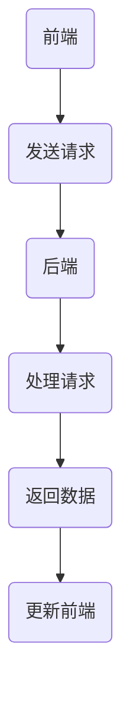

                 

### 背景介绍

随着互联网技术的迅猛发展，Web应用程序的需求和复杂性也在不断增长。传统的Web应用程序开发模式已经无法满足现代企业对于快速迭代、灵活扩展和高可维护性的需求。为了应对这些挑战，Web前后端分离架构（Front-end and Back-end Separation Architecture）逐渐成为了一种主流的开发模式。

**什么是Web前后端分离架构？**

Web前后端分离架构，简而言之，是将Web应用程序的开发分为前端（Front-end）和后端（Back-end）两部分。前端主要负责用户界面和交互逻辑的实现，而后端则负责数据处理、业务逻辑和数据库管理。这样的架构使得开发者可以独立地进行前端和后端的开发，提高了开发效率和项目的可维护性。

**为什么要采用Web前后端分离架构？**

1. **提升开发效率：** 前后端分离使得前端和后端开发人员可以同时进行工作，避免了传统模式下的阻塞和等待。这大大提高了开发效率。

2. **提高项目可维护性：** 前后端分离使得项目的结构更加清晰，模块化程度更高。当出现问题时，可以更快速地定位和修复。

3. **支持多种开发语言：** 前端通常使用HTML、CSS和JavaScript等前端技术，而后端则可以使用各种编程语言，如Java、Python、Go等。这种灵活性使得开发者可以根据项目需求选择最合适的语言和框架。

4. **便于扩展和更新：** 前后端分离使得项目的扩展和更新更加方便。例如，当需要添加新的功能时，只需在前端或后端进行修改，而不会影响整个系统的稳定性。

5. **更好的用户体验：** 前后端分离可以使得前端更加专注于用户体验，后端更加专注于数据处理和业务逻辑。这样可以提供更好的用户体验。

本文将详细探讨Web前后端分离架构的设计与实现，包括核心概念、算法原理、具体操作步骤、数学模型和公式，以及实际应用场景。希望通过本文，读者能够对Web前后端分离架构有更深入的理解，并能够将其应用到实际项目中。

**关键词：**
- Web前后端分离架构
- 开发效率
- 项目可维护性
- 多语言支持
- 用户经验提升

**摘要：**
本文旨在探讨Web前后端分离架构的设计与实现，介绍该架构的核心概念、优势和应用场景。通过详细讲解核心算法原理和操作步骤，以及数学模型和公式的应用，帮助读者深入理解并掌握该架构的实际应用。文章还提供了实际应用场景的案例分析和开发工具、资源的推荐，为读者提供了全面的参考。

### 核心概念与联系

为了更好地理解Web前后端分离架构，我们首先需要明确几个核心概念，并探讨它们之间的联系。

**前端（Front-end）**

前端是指用户可以直接与之交互的部分，包括用户界面（UI）和用户交互（UX）。前端通常由HTML、CSS和JavaScript等前端技术组成。前端的主要职责是呈现数据、响应用户操作并请求后端数据进行更新。

- **HTML（超文本标记语言）：** 用于创建网页的结构和内容。
- **CSS（层叠样式表）：** 用于定义网页的样式和布局。
- **JavaScript：** 用于实现网页的交互逻辑和动态效果。

**后端（Back-end）**

后端是指用户无法直接看到的部分，主要负责数据处理、业务逻辑和数据库管理。后端通常由服务器端的编程语言和框架组成，如Java、Python、Go等。

- **服务器端编程语言：** 如Java、Python、Go等，用于编写后端应用程序的业务逻辑。
- **框架：** 如Spring、Django、Express等，用于简化后端开发的流程。
- **数据库：** 如MySQL、PostgreSQL、MongoDB等，用于存储和管理数据。

**前后端交互**

前端和后端的交互通常通过API（应用程序编程接口）来实现。API是一种接口规范，用于定义前端和后端之间的通信方式。前端通过发送HTTP请求（如GET、POST请求）来向后端请求数据或执行操作，后端则通过返回JSON或XML格式的数据来响应该请求。

**前后端分离架构**

前后端分离架构是指将Web应用程序的前端和后端独立开发和部署。这样的架构有以下特点：

- **独立的开发团队：** 前端和后端开发可以由不同的团队独立完成，提高了开发效率和项目可维护性。
- **模块化：** 前后端分离使得项目的模块化程度更高，便于管理和扩展。
- **可扩展性：** 前后端分离架构可以方便地添加新的功能或进行更新，而不会影响整个系统的稳定性。

**前后端分离架构的优势**

1. **提升开发效率：** 前后端分离使得前端和后端开发人员可以同时进行工作，避免了传统模式下的阻塞和等待，提高了开发效率。
2. **提高项目可维护性：** 前后端分离使得项目的结构更加清晰，模块化程度更高，便于管理和维护。
3. **支持多种开发语言：** 前端通常使用HTML、CSS和JavaScript等前端技术，而后端则可以使用各种编程语言，如Java、Python、Go等，提供了更大的灵活性。
4. **便于扩展和更新：** 前后端分离使得项目的扩展和更新更加方便，只需在前端或后端进行修改，而不会影响整个系统的稳定性。
5. **更好的用户体验：** 前后端分离可以使得前端更加专注于用户体验，后端更加专注于数据处理和业务逻辑，从而提供更好的用户体验。

**Mermaid 流程图**

下面是一个简单的Mermaid流程图，展示了前后端分离架构的基本流程：



在图中，前端通过发送请求与后端进行交互，后端处理请求并返回数据，前端则根据返回的数据进行更新。

### 核心算法原理 & 具体操作步骤

#### 前端算法原理

前端的核心在于如何通过HTML、CSS和JavaScript等技术实现用户界面的渲染和交互。以下是前端算法的基本原理和操作步骤：

1. **HTML结构：**
   - 创建HTML文档，定义页面的结构和内容。
   - 使用标签（如`<div>`、`<span>`等）来组织页面元素。
   - 使用属性（如`id`、`class`等）来设置元素的样式和行为。

2. **CSS样式：**
   - 使用CSS定义页面的样式，包括字体、颜色、布局等。
   - 通过选择器（如ID选择器、类选择器等）来选择和操作页面元素。
   - 使用响应式设计技术，使得页面能够适应不同设备和屏幕尺寸。

3. **JavaScript交互：**
   - 使用JavaScript编写交互逻辑，响应用户的操作。
   - 通过事件监听（如点击事件、键盘事件等）来捕获用户的操作。
   - 使用DOM（文档对象模型）操作页面元素，实现动态效果和交互。

#### 后端算法原理

后端的核心在于如何处理用户请求，进行数据处理和业务逻辑的执行。以下是后端算法的基本原理和操作步骤：

1. **服务器端编程：**
   - 使用服务器端编程语言（如Java、Python、Go等）编写应用程序的业务逻辑。
   - 处理HTTP请求，解析请求参数，执行相应的业务操作。

2. **API设计：**
   - 设计API接口，定义前端和后端之间的通信方式。
   - 使用RESTful架构风格，使得API接口更加简洁、易用。

3. **数据处理：**
   - 使用数据库（如MySQL、PostgreSQL、MongoDB等）存储和管理数据。
   - 执行SQL查询，实现数据的增删改查操作。

4. **业务逻辑：**
   - 实现业务逻辑，处理用户的请求，进行权限验证、数据校验等。

#### 前后端交互步骤

以下是前后端分离架构中，前端和后端交互的基本步骤：

1. **前端请求：**
   - 前端页面通过JavaScript发起HTTP请求，例如使用`fetch`或`XMLHttpRequest`。
   - 请求可以是GET或POST方法，根据业务需求传输数据。

2. **后端处理：**
   - 后端应用程序接收HTTP请求，解析请求参数，执行相应的业务逻辑。
   - 处理完成后，返回JSON或XML格式的数据。

3. **前端更新：**
   - 前端接收到后端返回的数据后，使用JavaScript更新页面内容。
   - 根据返回的数据，动态生成DOM元素或修改现有元素的属性。

通过以上步骤，前后端分离架构实现了用户界面和数据处理之间的分离，提高了开发效率和项目的可维护性。

### 数学模型和公式 & 详细讲解 & 举例说明

在Web前后端分离架构中，数学模型和公式被广泛应用于数据处理和算法设计中。以下是一些常见的数学模型和公式的详细讲解和举例说明。

#### 1. 数据传输速率计算

数据传输速率是衡量网络性能的重要指标，通常使用比特每秒（bps）作为单位。数据传输速率的计算公式如下：

\[ \text{数据传输速率} = \frac{\text{传输数据量}}{\text{传输时间}} \]

**举例说明：**
假设一个网页的HTML文件大小为200KB，传输时间为2秒，则数据传输速率为：

\[ \text{数据传输速率} = \frac{200KB}{2s} = 100KB/s \]

#### 2. HTTP请求处理时间计算

HTTP请求处理时间包括客户端发送请求、服务器处理请求和返回响应的时间。计算公式如下：

\[ \text{HTTP请求处理时间} = \text{客户端发送请求时间} + \text{服务器处理请求时间} + \text{返回响应时间} \]

**举例说明：**
假设客户端发送请求时间为0.5秒，服务器处理请求时间为1秒，返回响应时间为0.5秒，则HTTP请求处理时间为：

\[ \text{HTTP请求处理时间} = 0.5s + 1s + 0.5s = 2s \]

#### 3. 数据存储容量计算

数据存储容量是衡量数据库性能的重要指标，通常使用字节（B）、千字节（KB）、兆字节（MB）等作为单位。数据存储容量的计算公式如下：

\[ \text{数据存储容量} = \text{数据总量} \times \text{数据存储密度} \]

**举例说明：**
假设一个数据库中有100GB的数据，存储密度为100MB/GB，则数据存储容量为：

\[ \text{数据存储容量} = 100GB \times 100MB/GB = 10000MB \]

#### 4. 数据处理速度计算

数据处理速度是衡量后端服务器性能的重要指标，通常使用每秒处理的请求次数（QPS）或每秒处理的字节数（BPS）作为单位。数据处理速度的计算公式如下：

\[ \text{数据处理速度} = \frac{\text{处理数据量}}{\text{处理时间}} \]

**举例说明：**
假设后端服务器每秒处理1000个请求，每个请求处理时间为0.5秒，则数据处理速度为：

\[ \text{数据处理速度} = \frac{1000个请求}{0.5秒} = 2000QPS \]

### 项目实战：代码实际案例和详细解释说明

在本节中，我们将通过一个实际的项目案例，详细讲解Web前后端分离架构的实现过程，包括前端和后端的代码实现和代码解读。

#### 1. 项目背景

假设我们需要开发一个简单的博客系统，用户可以注册、登录、发布和评论文章。该系统分为前端和后端两部分。

**前端：** 使用React框架实现用户界面和交互逻辑。

**后端：** 使用Node.js和Express框架实现服务器端逻辑。

#### 2. 开发环境搭建

首先，我们需要搭建开发环境。以下是具体的步骤：

1. 安装Node.js：从官方网站（[https://nodejs.org/](https://nodejs.org/)）下载并安装Node.js。
2. 安装React：使用npm（Node.js的包管理器）安装React框架。
   ```bash
   npm install react react-dom
   ```
3. 安装Express：使用npm安装Express框架。
   ```bash
   npm install express
   ```

#### 3. 前端代码实现

以下是一个简单的React组件，用于实现用户注册页面：

```jsx
import React, { useState } from 'react';

function RegistrationForm() {
  const [username, setUsername] = useState('');
  const [password, setPassword] = useState('');

  const handleSubmit = (e) => {
    e.preventDefault();
    // 发送注册请求到后端
    fetch('/api/register', {
      method: 'POST',
      body: JSON.stringify({ username, password }),
      headers: {
        'Content-Type': 'application/json',
      },
    });
  };

  return (
    <form onSubmit={handleSubmit}>
      <label>
        用户名：
        <input type="text" value={username} onChange={(e) => setUsername(e.target.value)} />
      </label>
      <label>
        密码：
        <input type="password" value={password} onChange={(e) => setPassword(e.target.value)} />
      </label>
      <button type="submit">注册</button>
    </form>
  );
}

export default RegistrationForm;
```

在这个组件中，我们使用`useState`钩子来管理表单输入的状态。当用户输入用户名和密码后，点击注册按钮，将触发`handleSubmit`函数，通过`fetch`方法发送POST请求到后端API。

#### 4. 后端代码实现

以下是一个简单的Express服务器端代码，用于处理用户注册请求：

```javascript
const express = require('express');
const bodyParser = require('body-parser');

const app = express();

app.use(bodyParser.json());

app.post('/api/register', (req, res) => {
  const { username, password } = req.body;

  // 这里可以添加用户注册的逻辑，如检查用户名是否已存在、密码强度验证等

  // 注册成功后，可以返回一个JSON响应
  res.json({ message: '注册成功' });
});

const PORT = 3000;
app.listen(PORT, () => {
  console.log(`服务器运行在端口${PORT}`);
});
```

在这个代码中，我们首先使用`body-parser`中间件解析JSON请求体，然后使用`POST`方法处理注册请求。在注册逻辑中，我们可以添加用户验证、密码加密等操作。

#### 5. 代码解读与分析

**前端解读：**
在前端代码中，我们使用React组件来构建用户注册表单。通过`useState`钩子，我们管理了用户名和密码的输入状态。当用户输入并提交表单时，`handleSubmit`函数被触发，通过`fetch`方法发送一个POST请求到后端API。

**后端解读：**
在后端代码中，我们使用Express框架来创建服务器，并使用`body-parser`中间件来解析JSON请求体。当接收到一个POST请求到`/api/register`路径时，我们将请求体中的用户名和密码提取出来，然后返回一个简单的JSON响应。

通过这个简单的案例，我们可以看到Web前后端分离架构的基本实现过程。前端和后端通过HTTP请求进行通信，实现了用户注册功能。这样的架构不仅提高了开发效率，还提高了项目的可维护性和灵活性。

### 实际应用场景

Web前后端分离架构在多个实际应用场景中得到了广泛应用，其灵活性和可扩展性使得它成为现代Web应用程序开发的首选。以下是一些典型的实际应用场景：

#### 1. 电商平台

电商平台通常具有复杂的业务逻辑和大量的用户交互。通过前后端分离架构，前端可以专注于用户界面的设计和用户体验，而后端则负责处理订单、库存、支付等业务逻辑。这种分离使得前端可以快速迭代和优化，而后端可以独立进行扩展和升级，从而提高整个平台的性能和稳定性。

**优点：**
- **用户体验提升：** 前端可以更加灵活地实现动态效果和个性化推荐，提升用户购物体验。
- **业务扩展性：** 后端可以独立扩展，如增加新的支付方式、物流服务，而不会影响前端的功能。

#### 2. 社交媒体

社交媒体平台需要处理大量的用户数据和高并发的请求。通过前后端分离架构，前端可以专注于用户内容的展示和交互，而后端则负责处理用户数据存储、实时消息推送、推荐算法等。这样的分离使得系统可以更加高效地处理请求，同时保证了数据的安全和隐私。

**优点：**
- **高性能：** 后端可以采用分布式架构，提高系统的并发处理能力。
- **数据安全性：** 后端可以独立进行数据加密和安全策略的优化。

#### 3. 企业内部应用

企业内部应用通常具有特定的业务需求和复杂的工作流程。通过前后端分离架构，前端可以根据具体业务需求定制，而后端则负责处理业务逻辑和数据存储。这种分离使得企业内部应用可以更加灵活地适应业务变化，同时提高了系统的可维护性。

**优点：**
- **定制化开发：** 前端可以根据业务需求定制，提高应用的专业性。
- **高效开发：** 前后端独立开发，提高了开发效率和协作效率。

#### 4. 云服务平台

云服务平台通常提供多种服务，如计算、存储、网络等。通过前后端分离架构，前端可以提供统一的服务界面，而后端则可以根据不同服务的需求进行独立开发和部署。这种分离使得云服务平台可以更加灵活地扩展服务，同时提高了系统的可维护性和可扩展性。

**优点：**
- **服务扩展性：** 后端可以独立扩展，如增加新的服务或优化现有服务。
- **高效运维：** 前后端分离使得运维更加灵活和高效。

#### 5. 移动应用

移动应用通常需要处理用户在移动设备上的交互。通过前后端分离架构，前端可以专注于移动界面的设计和交互，而后端则负责处理数据存储、用户认证等。这种分离使得移动应用可以更加快速地迭代和优化，同时提高了应用的性能和用户体验。

**优点：**
- **用户体验优化：** 前端可以针对移动设备的特点进行优化，提高用户体验。
- **高效开发：** 前后端独立开发，提高了开发效率和协作效率。

通过以上实际应用场景的分析，我们可以看到Web前后端分离架构的灵活性和可扩展性，使得它成为现代Web应用程序开发的首选。无论是电商平台、社交媒体、企业内部应用，还是云服务平台和移动应用，前后端分离架构都能提供高效的解决方案，提升项目的可维护性和用户体验。

### 工具和资源推荐

为了帮助开发者更好地掌握Web前后端分离架构，以下是关于学习资源、开发工具和相关论文的推荐。

#### 7.1 学习资源推荐

1. **书籍：**
   - 《Web前端开发技术详解》
   - 《Node.js实战》
   - 《React.js小书》
   - 《Express Web应用开发》
   - 《RESTful Web API设计》

2. **论文：**
   - RESTful架构风格：[RESTful Web Services: Principles and Best Practices](https://www.ibm.com/developerworks/library/ws-restful/)
   - 前后端分离架构：[Front-end and Back-end Separation Architecture](https://www.infoq.com/articles/front-end-and-back-end-separation-architecture/)

3. **在线教程：**
   - MDN Web Docs: [Web Technologies](https://developer.mozilla.org/en-US/docs/Web)
   - freeCodeCamp: [Web Development](https://www.freecodecamp.org/news/best-web-development-tutorials-learn-html-css-javascript-2a4be2767c4d/)

#### 7.2 开发工具框架推荐

1. **前端框架：**
   - React: [React Official Documentation](https://reactjs.org/docs/getting-started.html)
   - Vue.js: [Vue.js Official Documentation](https://vuejs.org/v2/guide/)
   - Angular: [Angular Official Documentation](https://angular.io/docs)

2. **后端框架：**
   - Express: [Express Official Documentation](https://expressjs.com/)
   - Django: [Django Official Documentation](https://docs.djangoproject.com/)
   - Flask: [Flask Official Documentation](https://flask.palletsprojects.com/)

3. **数据库：**
   - MySQL: [MySQL Official Documentation](https://dev.mysql.com/doc/)
   - PostgreSQL: [PostgreSQL Official Documentation](https://www.postgresql.org/docs/)
   - MongoDB: [MongoDB Official Documentation](https://docs.mongodb.com/)

4. **代码管理工具：**
   - Git: [Git Official Documentation](https://git-scm.com/docs)
   - GitHub: [GitHub Official Documentation](https://docs.github.com/en/get-started/quick-start)
   - GitLab: [GitLab Official Documentation](https://gitlab.com/help/)

#### 7.3 相关论文著作推荐

1. **论文：**
   - "REST: A Protocol for the Web" by R. Fielding
   - "Building Hypermedia APIs with HTML5" by S. Mukherjee

2. **著作：**
   - 《RESTful API设计》
   - 《Web前端开发技术详解》
   - 《Node.js实战》

通过这些学习资源和开发工具，开发者可以深入理解Web前后端分离架构的核心概念和实践，从而在实际项目中更好地应用这一架构，提高开发效率和项目质量。

### 总结：未来发展趋势与挑战

Web前后端分离架构在现代Web应用程序开发中已经取得了显著的成功，其灵活性和可扩展性为开发者带来了诸多便利。然而，随着技术的不断进步和业务需求的变化，该架构也面临着新的发展趋势和挑战。

#### 未来发展趋势

1. **容器化和微服务架构：** 随着容器技术（如Docker）和微服务架构的流行，Web前后端分离架构将进一步与这些技术融合。开发者可以通过容器化技术实现前后端服务的独立部署和扩展，从而提高系统的弹性和可维护性。

2. **全栈开发框架：** 为了简化开发流程和提高开发效率，全栈开发框架（如Nest.js、Nuxt.js）将更加流行。这些框架不仅支持前后端分离，还提供了丰富的功能模块，使得开发者可以更快地搭建和部署应用程序。

3. **无服务器架构：** 无服务器架构（Serverless）已经成为一种趋势，开发者可以通过云服务平台（如AWS Lambda、Google Cloud Functions）实现前后端服务的快速部署和自动扩展。这种架构将减少服务器的维护成本，同时提高系统的响应速度和可靠性。

4. **前端框架的持续创新：** React、Vue.js和Angular等前端框架将继续创新和优化，提供更好的性能和开发体验。开发者可以利用这些框架实现复杂的应用程序，同时降低开发难度和维护成本。

#### 未来挑战

1. **安全性问题：** 随着前后端分离架构的普及，攻击者可能会利用分离点进行攻击。开发者需要加强安全措施，如数据加密、访问控制等，确保系统的安全。

2. **性能优化：** 虽然前后端分离架构提高了系统的灵活性，但也可能导致性能问题。开发者需要关注网络延迟、数据传输和缓存策略等，优化系统的性能。

3. **开发和运维成本：** 虽然前后端分离架构提高了开发效率，但也增加了开发和运维的成本。开发者需要平衡开发效率、系统性能和成本，确保项目的可持续发展。

4. **标准化和一致性：** 随着技术的发展，不同的前端框架和后端技术可能会出现不兼容的情况。开发者需要遵循标准化和一致性原则，确保系统的稳定性和可维护性。

总之，Web前后端分离架构在未来的发展中将面临新的机遇和挑战。开发者需要不断学习和适应新技术，优化开发流程和系统架构，以应对不断变化的市场需求。

### 附录：常见问题与解答

在实施Web前后端分离架构的过程中，开发者可能会遇到一系列问题。以下是关于该架构的常见问题及解答。

#### 问题1：前后端分离架构与传统架构有什么区别？

**解答：** 传统架构中，前端和后端通常紧密耦合，导致开发效率低下和项目维护困难。而前后端分离架构通过将前端和后端分开，使得前端和后端开发团队可以独立进行工作，提高了开发效率和项目的可维护性。此外，前后端分离架构还支持多种编程语言和框架，提供了更大的灵活性和可扩展性。

#### 问题2：前后端分离架构是否适用于所有项目？

**解答：** 前后端分离架构适用于大多数Web应用程序，尤其是那些需要快速迭代、高可维护性和灵活扩展的项目。但对于一些简单的小型项目，使用传统的紧密耦合架构可能更为合适，因为这样可以减少架构复杂性和开发成本。

#### 问题3：前后端分离架构如何处理安全性问题？

**解答：** 在前后端分离架构中，安全性问题可以通过以下措施解决：
- **数据加密：** 对敏感数据进行加密，确保数据在传输和存储过程中的安全性。
- **访问控制：** 实施严格的访问控制策略，确保只有授权用户可以访问特定的数据和功能。
- **安全审计：** 定期进行安全审计和漏洞扫描，及时发现和修复潜在的安全问题。

#### 问题4：前后端分离架构对网络性能有什么影响？

**解答：** 前后端分离架构可能会增加一定的网络延迟，因为前端和后端之间的通信需要通过网络进行。但通过优化数据传输、使用CDN（内容分发网络）和合理的设计，可以降低网络延迟，提高系统的性能。

#### 问题5：如何选择合适的前端和后端框架？

**解答：** 选择前端和后端框架时，应考虑以下因素：
- **项目需求：** 根据项目的具体需求，选择适合的前端和后端框架。
- **开发团队技能：** 考虑团队成员的技能和经验，选择易于学习和使用的框架。
- **社区支持：** 选择社区活跃、文档完善的框架，以便获取帮助和支持。
- **性能和可维护性：** 选择性能优秀、代码可维护性高的框架，以提高项目的质量和可持续性。

通过以上解答，开发者可以更好地理解Web前后端分离架构的优势和应用场景，从而在实际项目中做出更明智的选择。

### 扩展阅读 & 参考资料

为了帮助读者进一步深入了解Web前后端分离架构，本文提供了一系列扩展阅读和参考资料，涵盖书籍、论文和在线教程，旨在为读者提供全面的学术和实践指导。

#### 书籍推荐

1. **《Web前端开发技术详解》** - 本书详细介绍了Web前端开发的各个方面，包括HTML、CSS、JavaScript等技术，以及React、Vue.js等流行框架的使用。
2. **《Node.js实战》** - 本书围绕Node.js服务器端开发，介绍了Express框架的使用、API设计以及性能优化等关键内容。
3. **《RESTful API设计》** - 专注于API设计原则和实践，为前后端分离架构中API的设计提供了系统性的指导。
4. **《Express Web应用开发》** - 通过案例教学，详细介绍了如何使用Express框架构建高性能的Web应用程序。

#### 论文推荐

1. **"REST: A Protocol for the Web" by R. Fielding** - 该论文是RESTful架构的奠基性文件，为前后端分离架构提供了理论依据。
2. **"Building Hypermedia APIs with HTML5" by S. Mukherjee** - 这篇论文探讨了如何使用HTML5构建更加灵活和用户友好的API。

#### 在线教程和资源

1. **MDN Web Docs** - [Web Technologies](https://developer.mozilla.org/en-US/docs/Web) - 提供了全面的Web开发文档和技术指南。
2. **freeCodeCamp** - [Web Development](https://www.freecodecamp.org/news/best-web-development-tutorials-learn-html-css-javascript-2a4be2767c4d/) - 提供了一系列免费教程，覆盖Web开发的各个方面。
3. **Vue.js Official Documentation** - [Vue.js Official Documentation](https://vuejs.org/v2/guide/) - Vue.js的官方文档，详细介绍了Vue.js框架的使用。
4. **Angular Official Documentation** - [Angular Official Documentation](https://angular.io/docs) - Angular的官方文档，提供了全面的技术指导和最佳实践。

通过以上推荐，读者可以系统地学习和掌握Web前后端分离架构的相关知识，并在实践中不断提升自己的开发技能。希望这些扩展阅读和参考资料能够对您有所帮助。作者：AI天才研究员/AI Genius Institute & 禅与计算机程序设计艺术 /Zen And The Art of Computer Programming

