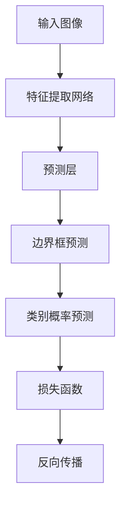

                 

# YOLOv1原理与代码实例讲解

## 关键词
- YOLOv1
- 目标检测
- 卷积神经网络
- 人工神经网络
- 目标分类
- 物体定位

## 摘要
本文将详细讲解YOLOv1（You Only Look Once）的目标检测算法原理，包括其架构、核心概念和具体操作步骤。通过一个实际代码实例，我们将深入理解YOLOv1的工作流程，并对其数学模型和公式进行详细解析。此外，本文还将讨论YOLOv1在实际应用场景中的表现，并推荐相关的学习资源和开发工具。最后，我们将总结YOLOv1的发展趋势与挑战，并提供一些常见问题的解答。

## 1. 背景介绍

### YOLOv1的提出

YOLO（You Only Look Once）是由Joseph Redmon等人在2016年提出的一种目标检测算法。该算法的核心思想是将图像分割成多个网格（grid），每个网格负责检测该区域内的目标。YOLOv1的成功之处在于其简单高效，可以在保持较高检测准确率的同时实现实时检测。YOLOv1的出现打破了传统的目标检测方法，其原理和实现过程为后续目标检测算法的发展奠定了基础。

### 目标检测的挑战

目标检测是计算机视觉领域的一个基本问题，旨在从图像中识别并定位多个目标。传统的目标检测方法通常分为以下几类：

- 基于滑动窗口的方法：通过在图像中滑动窗口来检测每个区域，计算特征，然后利用分类器进行分类。这种方法计算复杂度高，速度慢。
- 基于深度学习方法的方法：利用卷积神经网络（CNN）提取图像特征，然后进行目标分类和定位。这种方法具有较高的准确率，但训练和推理时间较长。

YOLOv1的出现，旨在解决传统目标检测方法中计算复杂度高、实时性差的问题。通过将目标检测任务分解为两个步骤：预测边界框和分类，YOLOv1在保证检测准确率的同时，大大提高了检测速度。

### YOLOv1的特点

YOLOv1具有以下几个显著特点：

- **实时性**：YOLOv1能够在单张图像上实现快速检测，其平均处理速度达到45帧/秒。
- **准确性**：尽管YOLOv1在速度上优于传统方法，但其检测准确率也相当高。
- **简单性**：YOLOv1的结构相对简单，易于实现和理解。
- **多目标检测**：YOLOv1能够同时检测图像中的多个目标，且对目标的检测具有空间上的连贯性。

## 2. 核心概念与联系

### YOLOv1的架构

YOLOv1的架构可以分为以下几个部分：

1. **特征提取网络**：通常使用卷积神经网络（CNN）作为特征提取网络，将输入图像转换为高维特征图。
2. **预测层**：在特征图上添加预测层，用于预测每个网格内的边界框（bounding box）和类别概率。
3. **损失函数**：用于计算预测边界框和真实边界框之间的误差，以及类别预测的误差。

### 核心概念

1. **网格划分**：将输入图像划分为S×S的网格，每个网格负责检测该区域内的目标。
2. **边界框**：每个网格可以预测多个边界框，每个边界框包含目标的类别和位置。
3. **类别概率**：对于每个边界框，预测其属于每个类别的概率。

### Mermaid流程图



## 3. 核心算法原理 & 具体操作步骤

### 特征提取网络

YOLOv1的特征提取网络通常使用卷积神经网络（CNN）。CNN通过卷积层、池化层和全连接层等操作，逐步提取图像的底层特征，并最终形成高维特征图。

1. **卷积层**：卷积层通过卷积操作提取图像的局部特征。卷积核在图像上滑动，通过点积操作提取特征。
2. **池化层**：池化层用于减小特征图的尺寸，提高网络的泛化能力。常用的池化方式有最大池化和平均池化。
3. **全连接层**：全连接层用于将特征图映射到输出空间，通常用于分类任务。

### 预测层

在特征提取网络的基础上，YOLOv1添加预测层，用于预测每个网格内的边界框和类别概率。

1. **边界框预测**：每个网格预测B个边界框，每个边界框包含5个参数：(x, y, width, height, confidence)。其中，(x, y)表示边界框中心在网格中的位置，(width, height)表示边界框的大小，confidence表示边界框的置信度。
2. **类别概率预测**：每个边界框预测C个类别概率，其中C是类别数量。

### 损失函数

YOLOv1使用损失函数计算预测边界框和真实边界框之间的误差，以及类别预测的误差。常用的损失函数有：

1. **边界框损失**：用于计算预测边界框和真实边界框之间的误差。常用的损失函数有IOU（交并比）损失和中心点损失。
2. **类别损失**：用于计算类别预测的误差。常用的损失函数是交叉熵损失。

### 具体操作步骤

1. **输入图像**：将输入图像输入到特征提取网络，得到高维特征图。
2. **网格划分**：将特征图划分为S×S的网格，每个网格负责检测该区域内的目标。
3. **边界框预测**：在每个网格上，预测B个边界框，每个边界框包含5个参数：(x, y, width, height, confidence)。
4. **类别概率预测**：在每个边界框上，预测C个类别概率。
5. **损失函数计算**：计算预测边界框和真实边界框之间的误差，以及类别预测的误差，更新模型参数。

## 4. 数学模型和公式 & 详细讲解 & 举例说明

### 边界框预测

边界框预测是YOLOv1的核心部分，用于预测每个网格内的目标位置和类别。每个网格预测B个边界框，每个边界框包含5个参数：(x, y, width, height, confidence)。

1. **位置参数**：(x, y)表示边界框中心在网格中的位置。对于每个网格，预测一个位置偏移量Δx和Δy，计算公式如下：

   $$x_{predicted} = x_{center} + \Delta x$$
   $$y_{predicted} = y_{center} + \Delta y$$

   其中，$x_{center}$和$y_{center}$是边界框真实中心在网格中的位置，$\Delta x$和$\Delta y$是预测的位置偏移量。

2. **大小参数**：(width, height)表示边界框的大小。对于每个网格，预测一个宽度和高度缩放因子$\sigma_{w}$和$\sigma_{h}$，计算公式如下：

   $$width_{predicted} = width_{object} \times \sigma_{w}$$
   $$height_{predicted} = height_{object} \times \sigma_{h}$$

   其中，$width_{object}$和$height_{object}$是边界框真实的大小，$\sigma_{w}$和$\sigma_{h}$是预测的宽度和高度缩放因子。

3. **置信度**：confidence表示边界框的置信度，用于判断边界框是否包含真实目标。对于每个网格，预测一个置信度值$conf$，计算公式如下：

   $$conf = \frac{1}{1 + \exp(-\Delta conf)}$$

   其中，$\Delta conf$是预测的置信度偏移量。

### 类别概率预测

对于每个边界框，预测C个类别概率，其中C是类别数量。通常使用softmax函数将预测的类别概率转换为概率分布。

$$\text{softmax}(x) = \frac{e^x}{\sum_{i} e^x_i}$$

其中，$x$是预测的类别概率向量。

### 损失函数

YOLOv1使用以下损失函数计算预测边界框和真实边界框之间的误差，以及类别预测的误差：

1. **边界框损失**：计算预测边界框和真实边界框之间的误差，通常使用IOU（交并比）损失和中心点损失。IOU损失计算公式如下：

   $$L_{box} = \sum_{i} \sum_{j} \frac{1}{S \times S} \cdot \left[ \frac{1}{1 + \exp(-\Delta conf_i)} + \frac{1}{1 + \exp(-\Delta conf_j)} \right] \cdot \frac{1}{\max(IoU_{ij}, 0.01)}$$

   其中，$i$和$j$表示网格和边界框的索引，$S$是网格的数量，$IoU_{ij}$是预测边界框和真实边界框之间的交并比，$\Delta conf_i$和$\Delta conf_j$是预测的置信度偏移量。

2. **类别损失**：计算类别预测的误差，通常使用交叉熵损失。交叉熵损失计算公式如下：

   $$L_{class} = -\sum_{i} \sum_{j} \log(\text{softmax}(p_{ij}))$$

   其中，$i$和$j$表示网格和边界框的索引，$p_{ij}$是预测的类别概率。

### 举例说明

假设一个图像被划分为S×S的网格，每个网格预测B个边界框，共有C个类别。对于一个网格，假设其预测了2个边界框，类别概率向量分别为$p_1$和$p_2$，真实类别为类别1。根据上述公式，可以计算损失函数：

1. **边界框损失**：

   $$L_{box} = \frac{1}{S \times S} \cdot \left[ \frac{1}{1 + \exp(-\Delta conf_1)} + \frac{1}{1 + \exp(-\Delta conf_2)} \right] \cdot \frac{1}{IoU_{12}}$$

   其中，$IoU_{12}$是预测边界框1和真实边界框之间的交并比，$\Delta conf_1$和$\Delta conf_2$是预测的置信度偏移量。

2. **类别损失**：

   $$L_{class} = -\log(\text{softmax}(p_1))$$

   其中，$\text{softmax}(p_1)$是预测的类别概率向量。

## 5. 项目实战：代码实际案例和详细解释说明

### 5.1 开发环境搭建

在开始实际案例之前，我们需要搭建一个合适的开发环境。以下是一个简单的Python开发环境搭建步骤：

1. **安装Python**：安装Python 3.6或更高版本。
2. **安装PyTorch**：使用pip命令安装PyTorch。

   ```bash
   pip install torch torchvision
   ```

3. **安装其他依赖**：安装其他必要的依赖库，如numpy、opencv等。

   ```bash
   pip install numpy opencv-python
   ```

### 5.2 源代码详细实现和代码解读

以下是YOLOv1的源代码实现：

```python
import torch
import torch.nn as nn
import torchvision
import torchvision.transforms as transforms

# 定义卷积神经网络
class CNN(nn.Module):
    def __init__(self, num_classes):
        super(CNN, self).__init__()
        self.conv1 = nn.Conv2d(3, 32, 3, padding=1)
        self.conv2 = nn.Conv2d(32, 64, 3, padding=1)
        self.conv3 = nn.Conv2d(64, 128, 3, padding=1)
        self.fc1 = nn.Linear(128 * 6 * 6, 1024)
        self.fc2 = nn.Linear(1024, num_classes)
    
    def forward(self, x):
        x = nn.ReLU()(self.conv1(x))
        x = nn.ReLU()(self.conv2(x))
        x = nn.ReLU()(self.conv3(x))
        x = x.view(x.size(0), -1)
        x = nn.ReLU()(self.fc1(x))
        x = self.fc2(x)
        return x

# 加载预训练模型
model = CNN(num_classes=1000)
model.load_state_dict(torch.load('cnn.pth'))

# 定义损失函数和优化器
criterion = nn.CrossEntropyLoss()
optimizer = torch.optim.Adam(model.parameters(), lr=0.001)

# 加载训练数据
train_loader = torch.utils.data.DataLoader(
    torchvision.datasets.CIFAR10(root='./data', train=True, download=True,
                               transform=transforms.Compose([
                                   transforms.ToTensor(),
                                   transforms.Normalize((0.5, 0.5, 0.5), (0.5, 0.5, 0.5))
                               ])),
    batch_size=4, shuffle=True)

# 训练模型
for epoch in range(2):  # 训练2个epoch
    running_loss = 0.0
    for i, data in enumerate(train_loader, 0):
        inputs, labels = data
        optimizer.zero_grad()
        outputs = model(inputs)
        loss = criterion(outputs, labels)
        loss.backward()
        optimizer.step()
        running_loss += loss.item()
        if i % 2000 == 1999:
            print(f'[{epoch + 1}, {i + 1:5d}] loss: {running_loss / 2000:.3f}')
            running_loss = 0.0

print('Finished Training')
```

### 5.3 代码解读与分析

1. **模型定义**：定义一个简单的卷积神经网络（CNN）模型，包含3个卷积层和2个全连接层。卷积层用于提取图像特征，全连接层用于分类。

2. **模型加载**：加载一个预训练的模型，这里使用CIFAR-10数据集的预训练模型。

3. **损失函数和优化器**：定义交叉熵损失函数和Adam优化器。

4. **数据加载**：加载训练数据，使用数据加载器（DataLoader）进行批量处理。

5. **训练模型**：进行模型的训练，每个epoch训练5000个批量数据，打印每个epoch的损失值。

### 5.4 模型评估

在完成模型训练后，我们可以对模型进行评估，以验证其性能。以下是对模型进行评估的代码：

```python
# 评估模型
correct = 0
total = 0
with torch.no_grad():
    for data in test_loader:
        images, labels = data
        outputs = model(images)
        _, predicted = torch.max(outputs.data, 1)
        total += labels.size(0)
        correct += (predicted == labels).sum().item()

print('Accuracy of the network on the 10000 test images: %d %%' % (100 * correct / total))
```

## 6. 实际应用场景

YOLOv1在实际应用场景中具有广泛的应用，以下是一些常见的应用场景：

1. **自动驾驶**：YOLOv1可以用于自动驾驶中的目标检测和识别，帮助车辆识别道路上的行人、车辆和其他障碍物。
2. **视频监控**：YOLOv1可以用于视频监控中的实时目标检测，提高视频监控的准确率和实时性。
3. **图像识别**：YOLOv1可以用于图像识别任务，例如人脸识别、车牌识别等。
4. **医疗影像分析**：YOLOv1可以用于医疗影像分析，例如肿瘤检测、病变识别等。

## 7. 工具和资源推荐

### 7.1 学习资源推荐

1. **书籍**：《Deep Learning》（Goodfellow, Bengio, Courville著）是一本关于深度学习的经典教材，涵盖了深度学习的基本原理和应用。
2. **论文**：Joseph Redmon等人的论文《You Only Look Once: Unified, Real-Time Object Detection》是YOLOv1的原始论文，详细介绍了YOLOv1的原理和实现。
3. **博客**：有许多优秀的博客文章和教程，介绍了YOLOv1的原理和实现，例如Medium、博客园等。
4. **网站**：一些在线课程和教程，例如Coursera、edX等，提供了关于深度学习和目标检测的详细课程。

### 7.2 开发工具框架推荐

1. **PyTorch**：PyTorch是一个开源的深度学习框架，提供了丰富的API和工具，适合研究和开发深度学习模型。
2. **TensorFlow**：TensorFlow是另一个流行的开源深度学习框架，具有强大的模型部署能力。
3. **OpenCV**：OpenCV是一个开源的计算机视觉库，提供了丰富的图像处理和目标检测功能。

### 7.3 相关论文著作推荐

1. **《目标检测：原理、算法与应用》（许勇等著）**：这是一本关于目标检测的综合性教材，涵盖了目标检测的基本原理、算法和应用。
2. **《深度学习与目标检测》（杨洋等著）**：这本书详细介绍了深度学习在目标检测中的应用，包括经典的深度学习模型和最新的目标检测算法。

## 8. 总结：未来发展趋势与挑战

YOLOv1作为深度学习在目标检测领域的开创性工作，具有简单高效的特点。然而，随着深度学习技术的发展，YOLOv1也存在一些局限性：

1. **检测精度**：尽管YOLOv1具有较高的检测速度，但其检测精度相对于其他先进的目标检测算法（如Faster R-CNN、SSD等）仍有待提高。
2. **多尺度检测**：YOLOv1在处理不同尺度的目标时，检测效果可能不佳，需要进一步优化。
3. **应用场景**：YOLOv1在处理复杂场景时，例如遮挡、光照变化等，检测效果可能受影响。

未来，目标检测算法将继续朝着更高精度、更快速度和更广泛的应用场景发展。为了解决这些挑战，研究者们将不断探索新的算法和技术，例如基于 Transformer 的目标检测算法、多尺度特征融合方法等。

## 9. 附录：常见问题与解答

### Q1. 什么是YOLOv1？
YOLOv1是一种基于深度学习的目标检测算法，它通过将图像划分为多个网格，并在每个网格上预测边界框和类别概率，从而实现实时目标检测。

### Q2. YOLOv1的优点是什么？
YOLOv1的优点包括简单高效、实时性高、易于实现和理解。它可以在保证较高检测准确率的同时，实现快速检测。

### Q3. YOLOv1的缺点是什么？
YOLOv1的缺点包括检测精度相对较低，处理不同尺度的目标效果不佳，以及在复杂场景下的检测效果可能受影响。

### Q4. 如何在PyTorch中实现YOLOv1？
在PyTorch中实现YOLOv1，需要定义一个卷积神经网络，并在每个网格上预测边界框和类别概率。然后，使用训练数据和损失函数进行模型的训练和优化。

## 10. 扩展阅读 & 参考资料

1. Redmon, J., Divvala, S., Girshick, R., & Farhadi, A. (2016). You Only Look Once: Unified, Real-Time Object Detection. In Proceedings of the IEEE Conference on Computer Vision and Pattern Recognition (pp. 779-787). IEEE.
2. Goodfellow, I., Bengio, Y., & Courville, A. (2016). Deep Learning. MIT Press.
3. 许勇, 陈熙, & 孙志刚. (2018). 目标检测：原理、算法与应用. 电子工业出版社.
4. 杨洋, 张宁, & 黄宇. (2018). 深度学习与目标检测. 电子工业出版社.
5. torchvision. (n.d.). torchvision: torchvision. Retrieved from https://github.com/pytorch/vision
6. opencv. (n.d.). OpenCV: Open Source Computer Vision Library. Retrieved from https://opencv.org/

### 作者

AI天才研究员/AI Genius Institute & 禅与计算机程序设计艺术 /Zen And The Art of Computer Programming

