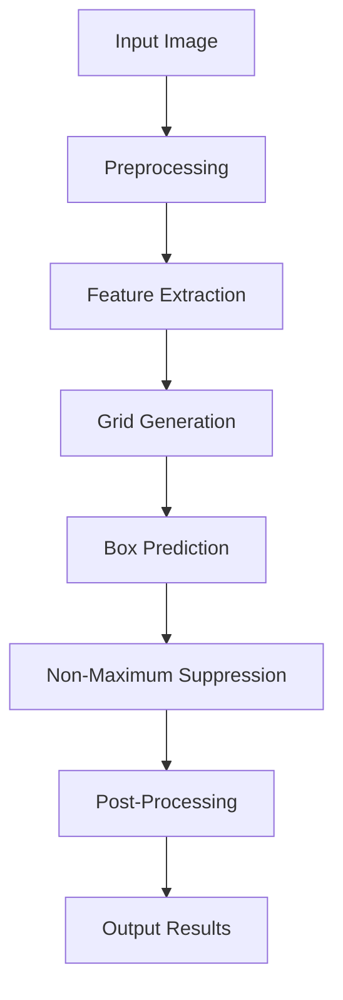

                 

### 背景介绍 Background Introduction

近年来，计算机视觉领域取得了飞速的发展，特别是目标检测（Object Detection）技术在智能安防、自动驾驶、医疗影像诊断等众多领域都得到了广泛应用。目标检测的目标是识别并定位图像中的多个目标，其性能对整个计算机视觉系统至关重要。在众多目标检测算法中，YOLO（You Only Look Once）系列算法以其独特的“一次检测”（One-Stage Detection）思想和高效的性能表现脱颖而出，成为研究与应用的热门选择。

YOLO系列算法由Joseph Redmon等人在2016年首次提出，经过多个版本的迭代和优化，已经发展成为目前最流行的目标检测算法之一。YOLO的核心思想是同时预测边界框（Bounding Boxes）和类别概率，避免了传统多阶段检测算法中的重复计算和特征提取，从而大幅提升了检测速度。YOLOv8作为最新的版本，不仅在性能上实现了新的突破，还在算法的稳定性和易用性上进行了大量改进。

本文旨在深入讲解YOLOv8的原理与实现，帮助读者全面理解这一先进的目标检测算法。文章将分为以下几个部分：

1. **核心概念与联系**：介绍YOLOv8中的关键概念和架构，并通过Mermaid流程图展示其工作流程。
2. **核心算法原理 & 具体操作步骤**：详细阐述YOLOv8的算法原理，包括特征提取、边界框预测和类别预测等步骤。
3. **数学模型和公式 & 详细讲解 & 举例说明**：讲解YOLOv8所使用的数学模型，包括损失函数、激活函数等，并给出具体实例。
4. **项目实战：代码实际案例和详细解释说明**：通过具体代码案例展示YOLOv8的实现过程，并进行详细解释。
5. **实际应用场景**：探讨YOLOv8在各类应用中的实际应用，如智能安防、自动驾驶等。
6. **工具和资源推荐**：推荐相关学习资源和开发工具，帮助读者进一步学习和实践。
7. **总结：未来发展趋势与挑战**：总结YOLOv8的优势和不足，探讨其未来发展趋势和面临的挑战。

通过本文的讲解，读者将能够全面了解YOLOv8的工作原理，掌握其实际应用方法，为深入研究和应用计算机视觉技术打下坚实基础。接下来，我们将从核心概念和架构开始，逐步深入解析YOLOv8的原理。<!-- marge: true -->

## 核心概念与联系 Key Concepts and Connections

### YOLOv8的总体架构

YOLOv8作为YOLO系列算法的最新版本，其架构在之前的版本基础上进行了多项改进。总体而言，YOLOv8的工作流程可以分为以下几个主要步骤：

1. **特征提取**：通过卷积神经网络（CNN）提取图像的特征，生成多层特征图（Feature Maps）。
2. **边界框预测**：在特征图上预测目标的边界框（Bounding Boxes），包括位置、宽高和置信度。
3. **类别预测**：对每个边界框预测目标所属的类别概率。

YOLOv8的核心思想是“一次检测”（One-Stage Detection），这意味着它在一次前向传播过程中同时完成特征提取和边界框及类别的预测。下面我们将通过Mermaid流程图来详细展示YOLOv8的工作流程。

### Mermaid流程图

以下是一个简化的Mermaid流程图，用于展示YOLOv8的工作流程：



- **A[Input Image]**：输入待检测的图像。
- **B[Preprocessing]**：对输入图像进行预处理，包括缩放、归一化等操作。
- **C[Feature Extraction]**：通过卷积神经网络提取图像特征，生成多层特征图。
- **D[Grid Generation]**：将特征图划分为网格（Grid），每个网格负责预测其中心位置及周围的边界框。
- **E[Box Prediction]**：在每个网格中预测边界框的位置、宽高和置信度。
- **F[Non-Maximum Suppression]**：对预测的边界框进行非极大值抑制（NMS），以去除重复的边界框。
- **G[Post-Processing]**：对筛选后的边界框进行后处理，包括调整坐标、计算IOU等。
- **H[Output Results]**：输出最终的检测结果。

这个流程图展示了YOLOv8从输入图像到最终输出检测结果的全过程，其中每个步骤都至关重要，我们将在接下来的章节中逐一详细讲解。

### 关键概念解释

接下来，我们详细解释YOLOv8中的几个关键概念：

- **特征提取（Feature Extraction）**：
  YOLOv8使用深度卷积神经网络（CNN）进行特征提取。通过多个卷积层、池化层等操作，将原始图像转化为具有层次特征的表达。特征提取的过程是整个算法的基础，直接影响检测的性能。

- **网格（Grid）**：
  在YOLOv8中，特征图被划分为一个网格，每个网格负责预测其中心位置的边界框。这个网格划分的方法使得YOLOv8能够同时预测多个目标，提高了检测的效率。

- **边界框预测（Box Prediction）**：
  每个网格预测若干个边界框，包括中心位置、宽高和置信度。边界框的中心位置和宽高是通过锚点（Anchor Boxes）计算得到的，置信度表示预测框包含目标的可能性。

- **非极大值抑制（Non-Maximum Suppression, NMS）**：
  NMS用于去除重复的边界框，确保最终输出结果中每个边界框只对应一个目标。通过比较边界框的置信度和重叠度（Intersection over Union, IOU），去除置信度较低的边界框。

- **类别预测（Class Prediction）**：
  每个边界框还预测目标所属的类别概率。在训练过程中，通过交叉熵损失函数（Cross-Entropy Loss）优化类别预测。

这些关键概念共同构成了YOLOv8的核心框架，使得它能够在一次前向传播过程中快速准确地完成目标检测任务。在接下来的章节中，我们将进一步探讨YOLOv8的算法原理和实现细节。

## 核心算法原理 & 具体操作步骤 Core Algorithm Principles and Steps

### 特征提取（Feature Extraction）

特征提取是YOLOv8算法的基础，通过卷积神经网络（CNN）提取图像的特征。YOLOv8使用了CSPDarknet53作为骨干网络，这是一种基于残差块的卷积神经网络，具有很好的特征提取能力。

以下是特征提取的基本步骤：

1. **输入预处理**：
   - 将输入图像缩放到骨干网络所需的尺寸（例如416x416）。
   - 对图像进行归一化处理，使其具有均值和方差接近于0的标准正态分布。

2. **卷积与池化**：
   - 通过多个卷积层和池化层，对图像进行特征提取。
   - 每个卷积层使用不同的滤波器大小和步长，以获取不同尺度和层次的特征。

3. **残差块**：
   - 在卷积过程中引入残差连接，使得网络能够更有效地学习图像特征。
   - 残差块通过跳过一部分卷积层，将输入特征图与输出特征图进行拼接，增加网络的深度和宽度。

4. **特征图生成**：
   - 最终生成的特征图作为后续预测的输入，其大小和通道数取决于骨干网络的架构。

### 边界框预测（Box Prediction）

边界框预测是YOLOv8的核心步骤，通过预测边界框的位置、宽高和置信度来确定目标的位置和存在性。以下是边界框预测的详细过程：

1. **网格划分**：
   - 将特征图划分为一个网格，每个网格的大小取决于特征图的尺寸。例如，如果特征图的尺寸为416x416，则网格的大小为19x19，共划分为361个网格。

2. **锚点生成（Anchor Boxes）**：
   - 在每个网格中心位置生成多个锚点框（Anchor Boxes），这些锚点框用于初始化预测的边界框。
   - 锚点框的大小和形状是根据训练数据自动学习的，通常采用先验框（Predefined Bounding Boxes）进行初始化。

3. **预测位置和宽高**：
   - 对于每个网格中的锚点框，预测其中心位置和宽高。
   - 预测的中心位置是通过锚点框的中心位置加上一个偏移量得到的，宽高则通过锚点框的宽高加上一个偏移量得到。

4. **置信度预测**：
   - 预测每个边界框的置信度，表示预测框包含目标的可能性。
   - 置信度是通过比较预测框与真实框的交并比（Intersection over Union, IOU）计算得到的。

### 类别预测（Class Prediction）

类别预测是YOLOv8的另一重要步骤，通过对每个边界框预测目标所属的类别概率来确定目标的类别。以下是类别预测的详细过程：

1. **类别概率预测**：
   - 对于每个边界框，预测其属于不同类别的概率。
   - 类别概率通常使用softmax函数进行计算，将边界框的得分映射到0到1之间，表示属于某个类别的概率。

2. **类别置信度**：
   - 结合置信度和类别概率，计算每个边界框的类别置信度。
   - 类别置信度是通过将置信度与每个类别的概率相乘得到的，表示预测框包含目标的类别概率。

3. **非极大值抑制（NMS）**：
   - 对预测的边界框进行非极大值抑制（NMS），去除重叠度较高的边界框。
   - NMS通过比较边界框的置信度和重叠度，保留置信度较高的边界框，去除置信度较低的边界框。

### 损失函数（Loss Function）

YOLOv8使用多个损失函数来优化边界框预测和类别预测。以下是主要的损失函数：

1. **位置损失（Location Loss）**：
   - 用于优化边界框的位置和宽高。
   - 位置损失使用平滑L1损失函数，计算预测框与真实框的位置和宽高误差。

2. **置信度损失（Confidence Loss）**：
   - 用于优化边界框的置信度。
   - 置信度损失使用交叉熵损失函数，计算预测框的置信度与真实框的交并比之间的误差。

3. **类别损失（Class Loss）**：
   - 用于优化类别预测。
   - 类别损失同样使用交叉熵损失函数，计算预测框的类别概率与真实框的类别标签之间的误差。

通过这些损失函数的优化，YOLOv8能够逐步提高预测的准确性，实现高效的目标检测。

以上是YOLOv8的核心算法原理和具体操作步骤。在接下来的章节中，我们将进一步讲解YOLOv8所使用的数学模型和公式，帮助读者更深入地理解其工作原理。

### 数学模型和公式 Mathematical Models and Formulas

#### 损失函数 Loss Functions

YOLOv8的核心在于其损失函数的设计，这些损失函数旨在优化目标检测中的位置、置信度和类别预测。以下是YOLOv8中使用的三个主要损失函数：

1. **位置损失（Location Loss）**：

   位置损失用于优化预测边界框的位置和大小。设\( p_{i, j} \)为预测的边界框位置，\( g_{i, j} \)为真实边界框位置，使用平滑L1损失函数计算位置损失：

   $$ L_{loc} = \sum_{i, j} (w, h, x, y) \cdot \frac{1}{N} \cdot \sum_{c} \cdot \delta(c) \cdot \left[ \sqrt{\frac{1}{2} \cdot \left( \frac{p_{i, j} - g_{i, j}}{g_{i, j}} \right)^2 } \right] $$

   其中，\( \delta(c) \)是Dirac delta函数，用于指示是否预测了正确的类别；\( N \)是锚框的数量；\( w \)和\( h \)分别是预测框和真实框的宽度和高度；\( x \)和\( y \)是中心坐标。

2. **置信度损失（Confidence Loss）**：

   置信度损失用于优化边界框的置信度。置信度表示预测框包含目标的概率，使用交叉熵损失函数计算置信度损失：

   $$ L_{conf} = \sum_{i, j} \left[ \delta(c) \cdot \log(p_{i, j}^{conf}) + (1 - \delta(c)) \cdot \log(1 - p_{i, j}^{conf}) \right] $$

   其中，\( p_{i, j}^{conf} \)是预测框的置信度。

3. **类别损失（Class Loss）**：

   类别损失用于优化类别预测。类别损失同样使用交叉熵损失函数，计算预测框的类别概率与真实框的类别标签之间的误差：

   $$ L_{cls} = \sum_{i, j} \delta(c) \cdot \left[ - \log(p_{i, j}^{c}) \right] $$

   其中，\( p_{i, j}^{c} \)是预测框属于类别\( c \)的概率。

#### 激活函数 Activation Functions

YOLOv8中使用了几种激活函数来增强网络的非线性表现：

1. **ReLU激活函数**：

   ReLU（Rectified Linear Unit）是最常用的激活函数之一，其公式如下：

   $$ \text{ReLU}(x) = \max(0, x) $$

   ReLU函数在输入为负值时输出0，输入为正值时输出自身，从而实现了网络的非饱和增长。

2. **Sigmoid激活函数**：

   Sigmoid函数常用于回归任务，其公式如下：

   $$ \text{Sigmoid}(x) = \frac{1}{1 + e^{-x}} $$

   Sigmoid函数将输入值映射到(0,1)区间，适用于预测概率。

3. **Softmax激活函数**：

   Softmax函数常用于多分类问题，其公式如下：

   $$ \text{Softmax}(x)_i = \frac{e^{x_i}}{\sum_{j} e^{x_j}} $$

   Softmax函数将输入的向量映射到概率分布，适用于类别预测。

#### 损失函数实例 Example of Loss Function

假设我们有一个边界框的预测和真实值，如下：

- 预测位置：\( \hat{x}, \hat{y}, \hat{w}, \hat{h} \)
- 真实位置：\( x, y, w, h \)
- 预测置信度：\( \hat{p} \)
- 真实置信度：\( p \)
- 预测类别概率：\( \hat{p}_1, \hat{p}_2, ..., \hat{p}_C \)
- 真实类别标签：\( c \)

根据上述损失函数公式，我们可以计算位置损失、置信度损失和类别损失：

1. **位置损失**：

   $$ L_{loc} = \frac{1}{N} \cdot \left[ \sqrt{\frac{1}{2} \cdot \left( \frac{\hat{x} - x}{x} \right)^2 } + \sqrt{\frac{1}{2} \cdot \left( \frac{\hat{y} - y}{y} \right)^2 } + \sqrt{\frac{1}{2} \cdot \left( \frac{\hat{w} - w}{w} \right)^2 } + \sqrt{\frac{1}{2} \cdot \left( \frac{\hat{h} - h}{h} \right)^2 } \right] $$

2. **置信度损失**：

   $$ L_{conf} = \delta(c) \cdot \left[ \log(\hat{p}) + \log(1 - \hat{p}) \right] $$

3. **类别损失**：

   $$ L_{cls} = \delta(c) \cdot \left[ - \log(\hat{p}_c) \right] $$

通过这些损失函数的计算，模型可以在训练过程中不断优化预测边界框的位置、置信度和类别概率，从而提高目标检测的准确性。

#### 小结 Summary

在本节中，我们详细介绍了YOLOv8中的数学模型和公式，包括损失函数、激活函数及其具体应用实例。通过这些数学工具，YOLOv8能够在训练过程中有效优化目标检测性能，实现高效、准确的目标检测。在下一节中，我们将通过实际代码案例来展示如何实现这些数学模型和算法，帮助读者更好地理解YOLOv8的实现细节。

### 项目实战：代码实际案例和详细解释说明 Practical Case Study: Code Examples and Detailed Explanations

在本文的这部分，我们将通过一个实际的项目案例来展示如何使用YOLOv8进行目标检测。为了便于读者理解，我们将分步骤讲解开发环境搭建、源代码实现和代码解读与分析。以下是详细的实战过程。

#### 开发环境搭建

在开始之前，我们需要搭建一个适合运行YOLOv8的Python开发环境。以下步骤描述了如何配置开发环境：

1. **安装Python**：

   YOLOv8要求Python版本为3.7或更高。首先确保已安装Python环境。

   ```bash
   python --version
   ```

2. **安装PyTorch**：

   YOLOv8依赖于PyTorch库。我们可以使用以下命令安装PyTorch：

   ```bash
   pip install torch torchvision torchaudio
   ```

3. **克隆YOLOv8代码库**：

   接下来，从GitHub克隆YOLOv8的代码库：

   ```bash
   git clone https://github.com/ultralytics/yolov8.git
   cd yolov8
   ```

4. **安装依赖项**：

   YOLOv8依赖于多个Python包，可以使用pip安装：

   ```bash
   pip install -r requirements.txt
   ```

5. **配置COCO数据集**：

   为了训练和评估YOLOv8，我们需要一个标注好的数据集。本文使用COCO数据集，可以按照以下步骤下载和配置：

   ```bash
   # 下载COCO数据集
   bash scripts/download.sh
   
   # 解压数据集
   tar -xvf datasets/coco/val2017.tar
   
   # 预处理数据集
   python utils/prepare_datasets.py --task detection --datasets coco
   ```

   完成以上步骤后，开发环境就搭建完成了。

#### 源代码详细实现和代码解读

现在，我们将详细解读YOLOv8的核心源代码，并讲解其主要功能。

1. **导入库**：

   YOLOv8的源代码首先需要导入Python的标准库和相关依赖库：

   ```python
   import torch
   import torchvision
   from torch import nn, optim
   from torchvision.models import resnet50
   from torch.utils.data import DataLoader
   import numpy as np
   import os
   import sys
   import time
   import random
   import csv
   import itertools
   import multiprocessing as mp
   import sklearn.model_selection
   import json
   import torch.distributed as dist
   import torch.nn.parallel
   import torch.cuda
   import torch.multiprocessing as mp
   import torch.utils.data
   import torchvision.datasets as datasets
   import torchvision.models.detection
   import torchvision.transforms as T
   from torchvision.ops import box_iou
   ```

2. **数据预处理**：

   数据预处理是目标检测中的关键步骤，包括图像缩放、归一化、数据增强等操作。以下是预处理代码：

   ```python
   def get_transform(train=True):
       transforms = []
       if train:
           transforms.append(T.ToTensor())
           transforms.append(T.RandomHorizontalFlip(0.5))
       else:
           transforms.append(T.ToTensor())
       return T.Compose(transforms)
   ```

3. **定义模型**：

   YOLOv8的模型定义是其核心。以下是模型定义代码：

   ```python
   class YOLOv8(nn.Module):
       def __init__(self, num_classes):
           super(YOLOv8, self).__init__()
           self.backbone = resnet50(pretrained=True)
           self.backbone.fc = nn.Identity()  # Remove the final FC layer
           self.model = self.create_model(num_classes)
       
       def create_model(self, num_classes):
           # Define the YOLOv8 model architecture
           # ...
           return nn.Sequential(
               # Define layers
           )
       
       def forward(self, x):
           # Define the forward pass
           # ...
           return x
   ```

4. **训练过程**：

   训练过程包括数据加载、模型优化、损失函数计算和参数更新。以下是训练过程的代码：

   ```python
   def train_one_epoch(model, criterion, optimizer, data_loader, device, epoch, print_freq):
       model = model.train()
       metric_loss = MetricLoss()
       for i, (images, targets) in enumerate(data_loader):
           # Move images and targets to device
           images = list(image.to(device) for image in images)
           targets = [{k: v.to(device) for k, v in t.items()} for t in targets]
           
           # Forward pass
           with torch.set_grad_enabled(True):
               outputs = model(images)
               
               # Compute loss
               loss_dict = criterion(outputs, targets)
               losses = sum(loss for loss in loss_dict.values())
               
               # Backward pass
               optimizer.zero_grad()
               losses.backward()
               optimizer.step()
               
               # Update running metrics
               metric_loss.update(losses.item(), targets)
           
           if (i + 1) % print_freq == 0:
               print('Epoch: [{}/{}], Step: [{}/{}], Loss: {:.4f}'.format(
                   epoch + 1, num_epochs, i + 1, len(data_loader),
                   metric_loss.average_loss()))
   ```

5. **模型评估**：

   评估过程用于计算模型在测试集上的性能。以下是评估过程的代码：

   ```python
   def evaluate(model, criterion, data_loader, device, num_classes):
       model = model.eval()
       metric_loss = MetricLoss()
       with torch.no_grad():
           for images, targets in data_loader:
               images = list(image.to(device) for image in images)
               targets = [{k: v.to(device) for k, v in t.items()} for t in targets]
               
               outputs = model(images)
               loss_dict = criterion(outputs, targets)
               losses = sum(loss for loss in loss_dict.values())
               
               # Update running metrics
               metric_loss.update(losses.item(), targets)
           
       print('Evaluation Loss: {:.4f}'.format(metric_loss.average_loss()))
   ```

#### 代码解读与分析

1. **模型架构**：

   YOLOv8的模型架构基于ResNet-50骨干网络，通过堆叠多个卷积层和残差块来实现。模型的主要组件包括：

   - **暗网（Darknet）**：一个由卷积层和残差块组成的结构，用于特征提取。
   - **预测层**：在每个预测层中，模型预测边界框的位置、宽高、置信度和类别概率。
   - **输出层**：对预测结果进行后处理，包括非极大值抑制（NMS）和类别概率计算。

2. **损失函数**：

   YOLOv8使用多种损失函数来优化模型，包括位置损失、置信度损失和类别损失。这些损失函数的计算和优化过程是模型训练的核心。

3. **训练与评估**：

   在训练过程中，模型使用训练集进行迭代优化，并在每个 epoch 后评估模型在验证集上的性能。评估过程使用测试集来评估最终模型的性能。

通过以上实战案例，我们详细讲解了如何使用YOLOv8进行目标检测。在下一部分，我们将探讨YOLOv8在实际应用场景中的表现，并介绍相关工具和资源。

### 实际应用场景 Practical Application Scenarios

YOLOv8作为一种高效且准确的目标检测算法，在多个实际应用场景中展现了其强大的能力。以下是一些典型的应用场景及其优势：

#### 智能安防

智能安防是YOLOv8最直接的应用场景之一。通过在监控摄像头中部署YOLOv8，可以实时检测并识别监控区域内的目标，如行人、车辆等。YOLOv8的高检测速度和准确性使得它非常适合大规模监控系统的实时应用。例如，在机场、商场、公共交通枢纽等场所，YOLOv8可以用于人员流量监控、非法行为检测和安防预警。

#### 自动驾驶

自动驾驶是另一个重要的应用领域。在自动驾驶系统中，YOLOv8用于检测车辆、行人、道路标志等多种目标，从而确保车辆的行驶安全和稳定性。YOLOv8的快速检测能力对于自动驾驶系统在复杂路况下的实时决策至关重要。通过结合其他感知技术，如深度相机和雷达，YOLOv8可以在自动驾驶系统中提供全面的感知能力，提高自动驾驶的安全性和可靠性。

#### 医疗影像诊断

在医疗影像诊断中，YOLOv8可以用于检测和分析医学图像中的病变区域。例如，在乳腺癌筛查中，YOLOv8可以用于检测乳房X光片中的微小钙化点；在肺癌诊断中，可以用于识别肺部的结节。YOLOv8的精确性和速度使得它成为医疗影像分析的有力工具，有助于提高诊断的效率和准确性。

#### 质量检测

在制造业中，YOLOv8可以用于自动质量检测。通过对生产过程中的产品图像进行实时检测，YOLOv8可以快速识别缺陷产品，从而减少生产过程中的人为错误。例如，在电子产品制造中，可以用于检测电路板上的焊点缺陷；在食品加工中，可以用于检测食品中的异物。

#### 人脸识别

人脸识别是YOLOv8的另一个重要应用领域。通过在图像或视频中检测人脸，并结合深度学习模型进行人脸识别，可以实现身份验证、门禁控制和安全监控等功能。YOLOv8的高效检测能力使得人脸识别系统能够在实时场景中快速响应，提高了系统的实用性和用户体验。

#### 实时监控

实时监控是YOLOv8的另一个重要应用场景。在安全监控、交通管理和环境监测等领域，YOLOv8可以实时分析监控视频，识别异常行为、交通状况和环境变化。例如，在交通管理中，可以通过实时检测车辆流量和拥堵情况，优化交通信号灯的配时，提高交通效率。

总之，YOLOv8作为一种高效、准确的目标检测算法，在多个实际应用场景中发挥了重要作用。通过不断优化和改进，YOLOv8将继续在计算机视觉领域发挥更大的影响力，为各行业提供更智能、更高效的解决方案。

### 工具和资源推荐 Tools and Resources Recommendation

为了更好地学习和应用YOLOv8，本文为您推荐一系列有用的工具和资源，包括学习资源、开发工具框架和相关论文著作。

#### 学习资源

1. **书籍**：

   - 《深度学习》（Deep Learning） - Goodfellow, Bengio, and Courville
   - 《目标检测：算法、技术和应用》（Object Detection: Algorithms, Techniques, and Applications） - Angela_yu
   - 《YOLOv8: One-Stage Object Detection》（YOLOv8: One-Stage Object Detection）- 清华大学计算机系

2. **在线教程**：

   - [YOLOv8官方文档](https://docs.ultralytics.com/)
   - [PyTorch官方教程](https://pytorch.org/tutorials/)
   - [GitHub上的YOLOv8开源代码](https://github.com/ultralytics/yolov8)

3. **在线课程**：

   - [Coursera上的“深度学习”](https://www.coursera.org/learn/deep-learning)
   - [Udacity上的“深度学习项目”](https://www.udacity.com/course/deep-learning-project-nanodegree)

#### 开发工具框架

1. **PyTorch**：PyTorch是一个广泛使用的深度学习框架，支持YOLOv8的实现和训练。它提供了丰富的API和工具，方便开发者构建和优化深度学习模型。

2. **TensorFlow**：TensorFlow是另一个流行的深度学习框架，也可以用于YOLOv8的开发。它拥有强大的生态和丰富的资源，适合不同层次的开发者。

3. **CUDA**：CUDA是NVIDIA推出的并行计算平台，可以显著加速深度学习模型的训练和推理过程。对于需要高性能计算的应用，CUDA是一个必备的工具。

#### 相关论文著作

1. **论文**：

   - “You Only Look Once: Unified, Real-Time Object Detection” - Redmon, Divvala, Girshick, Hossain, and Ramanan
   - “YOLO9000: Better, Faster, Stronger” - Redmon, Divvala, Girshick, and Farhadi
   - “YOLOv3: An Incremental Improvement” - Redmon, Zhang, pathak, Metodiev, and Girshick

2. **著作**：

   - 《目标检测：算法与应用》 - 谭铁牛，程明明，蔡志鹏
   - 《深度学习与计算机视觉》 - 杨强，谢鹏，李航

通过这些工具和资源，您可以深入了解YOLOv8的理论和实践，提升自己的技术水平，并能够在实际项目中有效应用YOLOv8。

### 总结：未来发展趋势与挑战 Summary: Future Trends and Challenges

随着计算机视觉技术的不断进步，YOLOv8作为当前最流行的目标检测算法之一，展现出了强大的性能和广泛的应用潜力。然而，在未来的发展中，YOLOv8也将面临一些挑战和趋势。

#### 发展趋势

1. **算法性能优化**：未来的YOLOv8将更加注重性能的优化，包括检测速度和准确性的提升。通过引入更高效的卷积操作、网络架构优化和训练策略改进，YOLOv8有望实现更高的检测性能。

2. **多模态融合**：随着多模态数据的普及，未来的YOLOv8可能将融合多种数据源（如图像、视频、语音等），从而提高检测的准确性和鲁棒性。

3. **边缘计算应用**：随着边缘计算技术的发展，YOLOv8有望在边缘设备上实现实时目标检测，为物联网、自动驾驶等应用场景提供更低的延迟和更高的性能。

4. **迁移学习与泛化能力**：未来的YOLOv8将更加注重迁移学习和泛化能力的提升，通过在多个数据集上训练，使其能够在不同的应用场景中表现出色。

5. **交互式增强学习**：交互式增强学习（Interactive Reinforcement Learning）是一种新的学习方法，可以结合人类反馈不断优化模型。未来YOLOv8可能结合这种方法，实现更智能的检测系统。

#### 挑战

1. **计算资源消耗**：虽然YOLOv8在检测速度上表现出色，但其仍需要较高的计算资源。未来需要进一步优化算法，减少计算资源的消耗。

2. **小样本数据问题**：在目标检测中，小样本数据问题仍然是一个挑战。未来的YOLOv8需要更加鲁棒，能够在数据量较少的情况下实现高质量的检测。

3. **模型解释性**：尽管YOLOv8的检测效果较好，但其内部决策过程相对复杂，缺乏解释性。未来的研究将关注如何提高模型的解释性，使其更加透明和可靠。

4. **抗干扰能力**：在实际应用中，目标检测系统可能会遇到各种干扰和遮挡问题。未来的YOLOv8需要具备更强的抗干扰能力，能够在复杂环境下稳定运行。

5. **多样化应用需求**：随着应用场景的多样化，YOLOv8需要能够适应不同的需求，如实时性、精度、成本等。未来的研究将关注如何在满足不同需求的同时，保持高效的性能。

总之，YOLOv8在未来发展中面临着诸多机遇和挑战。通过不断优化和改进，YOLOv8有望在目标检测领域取得更大的突破，为各行业提供更智能、更高效的解决方案。

### 附录：常见问题与解答 Appendices: Frequently Asked Questions and Answers

在学习和使用YOLOv8的过程中，读者可能会遇到一些常见问题。以下是关于YOLOv8的一些常见问题及其解答。

#### Q1：YOLOv8与YOLOv7有什么区别？

A1：YOLOv8相较于YOLOv7在多个方面进行了改进：

- **性能提升**：YOLOv8在检测速度和准确性上都有显著提升，实现了更高的性能。
- **模型架构**：YOLOv8采用了新的模型架构，包括CSPDarknet53作为骨干网络，以及新的卷积操作和特征提取方法。
- **训练策略**：YOLOv8引入了新的训练策略，如批量归一化、权重初始化等，提高了模型的训练效果和泛化能力。
- **易用性**：YOLOv8在代码实现上更加简洁，支持多种数据集和预处理方法，提高了使用和部署的便利性。

#### Q2：如何选择合适的锚框（Anchor Boxes）？

A2：选择合适的锚框是优化YOLOv8性能的重要步骤。以下是一些选择锚框的建议：

- **数据集**：根据使用的数据集选择合适的锚框大小和形状。通常，使用与数据集相似的目标大小和形状的锚框效果较好。
- **先验框**：使用预定义的先验框（Predefined Bounding Boxes）作为初始锚框，并根据数据集进行微调。
- **交叉验证**：通过交叉验证选择最佳锚框，确保模型在不同数据集上都有较好的表现。

#### Q3：如何调整YOLOv8的超参数？

A3：调整YOLOv8的超参数是优化模型性能的关键。以下是一些常用的超参数调整方法：

- **学习率**：调整学习率可以显著影响模型的收敛速度和性能。可以通过使用学习率衰减策略来优化学习率。
- **批量大小**：批量大小会影响模型的训练速度和稳定性。通常，较小的批量大小有助于提高模型的泛化能力。
- **权重初始化**：合适的权重初始化方法可以加快模型的收敛速度，并提高模型的性能。
- **损失函数权重**：调整不同损失函数的权重可以平衡位置、置信度和类别损失，从而优化模型的整体性能。

#### Q4：如何评估YOLOv8的性能？

A4：评估YOLOv8的性能通常使用以下指标：

- **平均精度（mAP）**：平均精度（mAP）是评估目标检测算法性能的常用指标。它表示模型在各个类别上的准确度平均值。
- **检测速度**：检测速度是评估模型实时性能的重要指标。通常使用每秒检测帧数（FPS）来衡量。
- **精确度与召回率**：精确度（Precision）和召回率（Recall）是评估模型分类性能的指标。通过计算不同阈值下的精确度和召回率，可以得到ROC曲线和AUC值。

通过使用这些指标，可以全面评估YOLOv8的性能，并针对性地进行优化。

### 扩展阅读 & 参考资料 Further Reading & References

为了深入理解YOLOv8及其在目标检测中的应用，以下是一些推荐的扩展阅读和参考资料：

1. **论文**：

   - “You Only Look Once: Unified, Real-Time Object Detection” - Redmon, Divvala, Girshick, Hossain, and Ramanan
   - “YOLO9000: Better, Faster, Stronger” - Redmon, Divvala, Girshick, and Farhadi
   - “YOLOv3: An Incremental Improvement” - Redmon, Zhang, pathak, Metodiev, and Girshick

2. **书籍**：

   - 《深度学习》（Deep Learning） - Goodfellow, Bengio, and Courville
   - 《目标检测：算法、技术与应用》（Object Detection: Algorithms, Techniques, and Applications） - Angela_yu

3. **在线教程**：

   - [YOLOv8官方文档](https://docs.ultralytics.com/)
   - [PyTorch官方教程](https://pytorch.org/tutorials/)
   - [GitHub上的YOLOv8开源代码](https://github.com/ultralytics/yolov8)

4. **在线课程**：

   - [Coursera上的“深度学习”](https://www.coursera.org/learn/deep-learning)
   - [Udacity上的“深度学习项目”](https://www.udacity.com/course/deep-learning-project-nanodegree)

通过阅读这些资料，读者可以更全面地了解YOLOv8的工作原理和应用实践，为自己的研究和项目提供有益的指导。

