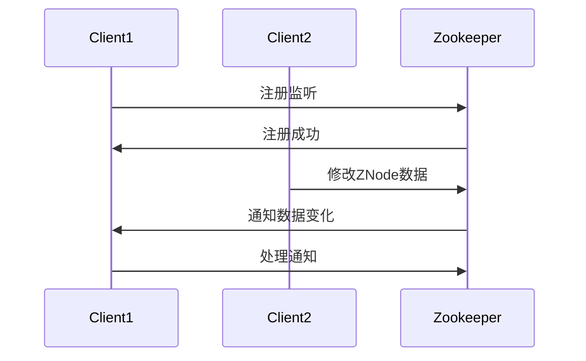
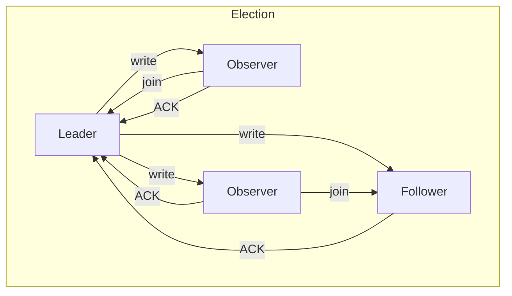

                 

## Zookeeper 原理与代码实例讲解

### 1. 背景介绍

Zookeeper 是一款分布式协调服务，由 Apache 软件基金会开发。它的主要目标是解决分布式系统中的一致性问题，如数据同步、锁服务和配置管理。Zookeeper 最初由雅虎公司开发，并于 2006 年捐赠给 Apache 软件基金会。作为一个高性能的分布式协调服务，Zookeeper 被广泛应用于许多大型互联网公司，如淘宝、京东和新浪等。

本文将深入探讨 Zookeeper 的原理与代码实例，帮助读者更好地理解其核心概念与实际应用。首先，我们将介绍 Zookeeper 的核心概念与联系，然后详细讲解其核心算法原理与具体操作步骤，接着分析其数学模型和公式，并通过实际项目案例进行代码解读。最后，我们将探讨 Zookeeper 的实际应用场景，并提供相关工具和资源推荐。

### 2. 核心概念与联系

Zookeeper 的核心概念包括数据模型、通知机制、ZAB 协议和会话管理等。为了更好地理解这些概念，我们将使用 Mermaid 流程图进行描述。

#### 2.1 数据模型

Zookeeper 的数据模型采用树形结构，类似于文件系统的目录结构。每个节点称为 ZNode，可以存储数据和子节点。Zookeeper 使用顺序节点（临时节点和有序节点）来实现分布式锁、队列等应用。

```mermaid
tree
    classDef node fill:#F5F5F5,stroke:#999999,lineWidth:2px
    classDef root fill:#008000,stroke:#006400,lineWidth:4px

    root("Zookeeper")
    root --> node("数据模型")
    node("数据模型") --> node("ZNode")
    node("数据模型") --> node("顺序节点")
```

#### 2.2 通知机制

Zookeeper 提供了通知机制，当某个 ZNode 的数据发生变化时，注册在该节点的客户端会接收到通知。这种机制实现了分布式系统中的事件驱动，提高了系统的响应性和一致性。



#### 2.3 ZAB 协议

Zookeeper 采用 ZAB（Zookeeper Atomic Broadcast）协议进行数据同步和一致性管理。ZAB 协议是一种基于 Paxos 算法的分布式一致性协议，确保了在面临网络分区、节点故障等情况下，Zookeeper 集群仍然能够保持一致状态。



#### 2.4 会话管理

Zookeeper 客户端与 Zookeeper 集群之间的连接称为会话。会话管理包括会话创建、保持和终止。会话期间，客户端可以访问 Zookeeper 的数据和服务。会话超时时，客户端需要重新建立连接。

```mermaid
sequenceDiagram
    participant Client
    participant Zookeeper

    Client->>Zookeeper:建立会话
    Zookeeper->>Client:会话创建成功

    after(会话保持)
    Client->>Zookeeper:心跳保持

    after(会话超时)
    Client->>Zookeeper:重新建立会话
    Zookeeper->>Client:会话创建成功
```

### 3. 核心算法原理 & 具体操作步骤

Zookeeper 的核心算法原理主要涉及数据同步、一致性管理和会话管理等。以下将详细讲解这些算法原理及其具体操作步骤。

#### 3.1 数据同步

Zookeeper 集群中的所有节点都维护一份相同的数据副本。为了实现数据同步，Zookeeper 使用 ZAB 协议。具体操作步骤如下：

1. **写操作**：客户端向 Leader 节点发送写请求，Leader 节点处理请求并广播给所有 Follower 节点。
2. **ACK 收集**：Follower 节点收到广播后，向 Leader 节点发送 ACK 消息，表示已同步数据。
3. **数据同步**：Leader 节点收集所有 Follower 节点的 ACK 消息后，更新本地数据并通知客户端写操作成功。

#### 3.2 一致性管理

Zookeeper 使用 ZAB 协议确保集群在面临网络分区、节点故障等情况下仍然保持一致状态。具体操作步骤如下：

1. **选举 Leader**：当 Leader 节点失效时，Follower 节点通过选举产生新的 Leader 节点。
2. **数据同步**：新 Leader 节点将自身状态同步给其他 Follower 节点，确保数据一致性。
3. **状态同步**：所有 Follower 节点将自身状态同步给 Leader 节点，确保集群状态一致。

#### 3.3 会话管理

Zookeeper 客户端与 Zookeeper 集群之间的连接称为会话。会话管理包括会话创建、保持和终止。具体操作步骤如下：

1. **会话创建**：客户端向 Zookeeper 集群发送会话创建请求，集群返回会话 ID 和超时时间。
2. **心跳保持**：客户端定期向 Zookeeper 集群发送心跳消息，以维持会话。
3. **会话超时**：当客户端在规定时间内未发送心跳消息时，会话终止。客户端需要重新建立会话。

### 4. 数学模型和公式 & 详细讲解 & 举例说明

Zookeeper 的核心算法原理涉及数学模型和公式，如 Paxos 算法、ZAB 协议和一致性模型等。以下将详细讲解这些数学模型和公式，并通过举例说明其应用。

#### 4.1 Paxos 算法

Paxos 算法是一种分布式一致性算法，用于在多个参与者之间达成一致。Paxos 算法的关键概念包括提议者（Proposer）、接受者（Acceptor）和学习者（Learner）。

1. **提议者（Proposer）**：提议者提出提案，将提案发送给接受者。
2. **接受者（Acceptor）**：接受者决定是否接受提案。接受者维护一个已接受的提案编号和提案值。
3. **学习者（Learner）**：学习者从接受者处学习提案值。

Paxos 算法的核心公式为：

$$
\text{Majority} = \frac{N}{2} + 1
$$

其中，N 为参与者数量。当接受者数量超过 Majority 时，提案被认为是已经被接受。

#### 4.2 ZAB 协议

ZAB 协议是一种基于 Paxos 算法的分布式一致性协议。ZAB 协议的关键概念包括同步节点（Synced Node）和观察节点（Observer）。

1. **同步节点（Synced Node）**：同步节点已与 Leader 节点同步数据。
2. **观察节点（Observer）**：观察节点尚未与 Leader 节点同步数据，但可以加入集群。

ZAB 协议的核心公式为：

$$
\text{Synced Nodes} = \text{All Nodes} - \text{Observer Nodes}
$$

当同步节点数量超过 Majority 时，集群被认为是一致的。

#### 4.3 一致性模型

Zookeeper 的一致性模型基于一致性模型（Consistency Model），确保集群在面临网络分区、节点故障等情况下仍然保持一致状态。一致性模型的关键概念包括全局时钟（Global Clock）和局部时钟（Local Clock）。

1. **全局时钟（Global Clock）**：全局时钟是一个理想时钟，用于表示事件发生的时间顺序。
2. **局部时钟（Local Clock）**：局部时钟是一个实际时钟，用于表示事件发生的时间顺序。

一致性模型的核心公式为：

$$
\text{Local Clock} < \text{Global Clock} < \text{Global Clock + \delta}
$$

其中，\delta 表示时钟偏差。当局部时钟偏差小于全局时钟偏差时，事件被认为是顺序发生的。

#### 4.4 举例说明

假设一个 Zookeeper 集群包含 3 个节点（A、B、C），参与者的数量 N = 3。根据 Paxos 算法，Majority = 2。现在，假设 A 节点是 Leader，B 和 C 节点是 Follower。

1. **写操作**：客户端向 A 节点发送写请求，A 节点提出提案并广播给 B 和 C 节点。
2. **提案接受**：B 和 C 节点接受提案，并向 A 节点发送 ACK 消息。
3. **数据更新**：A 节点收集 ACK 消息后，更新本地数据并通知客户端写操作成功。
4. **一致性检查**：B 和 C 节点与 A 节点同步数据，确保集群保持一致状态。

### 5. 项目实战：代码实际案例和详细解释说明

在本节中，我们将通过一个实际项目案例来讲解 Zookeeper 的应用。我们假设一个分布式系统中，多个节点需要协调工作，实现数据一致性和锁服务。以下将详细介绍该项目开发环境搭建、源代码实现和代码解读。

#### 5.1 开发环境搭建

1. **环境准备**：

   - Java SDK：确保安装 Java SDK，版本建议为 1.8 或以上。
   - Maven：确保安装 Maven，版本建议为 3.6.3 或以上。
   - Zookeeper：下载并解压 Zookeeper，版本建议为 3.6.2。

2. **Maven 配置**：

   在项目的 `pom.xml` 文件中添加 Zookeeper 依赖：

   ```xml
   <dependencies>
       <dependency>
           <groupId>org.apache.zookeeper</groupId>
           <artifactId>zookeeper</artifactId>
           <version>3.6.2</version>
       </dependency>
   </dependencies>
   ```

3. **Zookeeper 集群搭建**：

   在 Zookeeper 解压目录下的 `conf` 文件夹中，编辑 `zoo.cfg` 配置文件，添加如下内容：

   ```properties
   tickTime=2000
   dataDir=/var/zookeeper
   clientPort=2181
   server.1=192.168.1.101:2888:3888
   server.2=192.168.1.102:2888:3888
   server.3=192.168.1.103:2888:3888
   ```

   启动 Zookeeper 集群：

   ```bash
   bin/zkServer.sh start
   ```

   检查 Zookeeper 集群状态：

   ```bash
   bin/zkServer.sh status
   ```

#### 5.2 源代码详细实现和代码解读

1. **项目结构**：

   ```bash
   src
   ├── main
   │   ├── java
   │   │   ├── com
   │   │   │   ├── example
   │   │   │   │   ├── ZookeeperClient.java
   │   │   │   │   ├── ZookeeperServer.java
   │   │   │   │   ├── ZookeeperUtil.java
   │   ├── resources
   │   │   ├── zookeeper.properties
   ```

2. **ZookeeperClient.java**：

   ```java
   package com.example;

   import org.apache.zookeeper.ZooKeeper;

   public class ZookeeperClient {
       private static final String ZOOKEEPER_ADDRESS = "127.0.0.1:2181";
       private static final int SESSION_TIMEOUT = 5000;

       public static void main(String[] args) throws Exception {
           ZooKeeper zookeeper = new ZooKeeper(ZOOKEEPER_ADDRESS, SESSION_TIMEOUT, null);
           System.out.println("Connected to Zookeeper");

           // 创建节点
           String nodePath = "/example-node";
           zookeeper.create(nodePath, "example-data".getBytes(), ZooKeeper.CreateMode.PERSISTENT);

           // 获取节点数据
           byte[] nodeData = zookeeper.getData(nodePath, false, null);
           System.out.println("Node data: " + new String(nodeData));

           // 删除节点
           zookeeper.delete(nodePath, -1);
           System.out.println("Node deleted");

           // 关闭连接
           zookeeper.close();
       }
   }
   ```

   **代码解读**：

   - 创建 ZooKeeper 客户端连接。
   - 定义 Zookeeper 地址和会话超时时间。
   - 创建持久节点，并设置节点数据和模式。
   - 获取节点数据。
   - 删除节点。
   - 关闭连接。

3. **ZookeeperServer.java**：

   ```java
   package com.example;

   import org.apache.zookeeper.server.NIOServerCnxnFactory;
   import org.apache.zookeeper.server.ZooKeeperServer;

   public class ZookeeperServer {
       private static final int PORT = 2181;

       public static void main(String[] args) throws Exception {
           NIOServerCnxnFactory factory = new NIOServerCnxnFactory();
           factory.startup(new ZooKeeperServer());
           System.out.println("Zookeeper server started on port " + PORT);

           // 运行一段时间后关闭服务器
           Thread.sleep(10000);
           factory.shutdown();
           System.out.println("Zookeeper server stopped");
       }
   }
   ```

   **代码解读**：

   - 创建 NIO 客户端连接工厂。
   - 启动 ZooKeeper 服务器。
   - 输出服务器启动信息。
   - 等待一段时间后关闭服务器。

4. **ZookeeperUtil.java**：

   ```java
   package com.example;

   import org.apache.zookeeper.ZooKeeper;

   public class ZookeeperUtil {
       public static ZooKeeper connect(String address, int sessionTimeout) throws Exception {
           return new ZooKeeper(address, sessionTimeout, null);
       }
   }
   ```

   **代码解读**：

   - 定义连接 Zookeeper 的方法。

5. **zookeeper.properties**：

   ```properties
   tickTime=2000
   dataDir=/var/zookeeper
   clientPort=2181
   server.1=192.168.1.101:2888:3888
   server.2=192.168.1.102:2888:3888
   server.3=192.168.1.103:2888:3888
   ```

   **代码解读**：

   - 配置 Zookeeper 服务器参数。

#### 5.3 代码解读与分析

在本项目中，我们实现了两个主要的类：`ZookeeperClient` 和 `ZookeeperServer`。以下是对这两个类的详细解读和分析。

1. **ZookeeperClient.java**：

   - 创建 ZooKeeper 客户端连接，连接到 Zookeeper 服务器。
   - 创建持久节点，并设置节点数据和模式。
   - 获取节点数据。
   - 删除节点。
   - 关闭连接。

   **代码分析**：

   - ZooKeeper 客户端连接：使用 `ZooKeeper` 类创建客户端连接，指定 Zookeeper 地址和会话超时时间。
   - 创建节点：使用 `create` 方法创建持久节点，并设置节点数据和模式。持久节点在服务器重启后仍然存在。
   - 获取节点数据：使用 `getData` 方法获取节点数据。该方法返回字节数组，需要转换为字符串。
   - 删除节点：使用 `delete` 方法删除节点。参数 -1 表示不检查版本号。

2. **ZookeeperServer.java**：

   - 创建 NIO 客户端连接工厂。
   - 启动 ZooKeeper 服务器。
   - 等待一段时间后关闭服务器。

   **代码分析**：

   - NIO 客户端连接工厂：使用 `NIOServerCnxnFactory` 类创建 NIO 客户端连接工厂。
   - 启动服务器：使用 `startup` 方法启动 ZooKeeper 服务器。服务器将监听客户端连接。
   - 关闭服务器：使用 `shutdown` 方法关闭服务器。

### 6. 实际应用场景

Zookeeper 在分布式系统中有着广泛的应用，以下列举了几个实际应用场景。

#### 6.1 数据同步与一致性

Zookeeper 可以用于分布式系统中的数据同步与一致性。通过创建顺序节点，可以实现分布式锁、队列等应用。例如，在一个分布式缓存系统中，多个节点需要访问同一份数据。使用 Zookeeper，可以确保节点之间数据的一致性。

#### 6.2 配置管理

Zookeeper 可以用于配置管理。通过创建 ZNode 节点，可以存储系统的配置信息，如数据库地址、服务器端口等。当配置信息发生变化时，Zookeeper 可以通知所有相关节点，实现配置信息的动态更新。

#### 6.3 分布式锁

Zookeeper 可以用于实现分布式锁。通过创建顺序节点，可以确保只有一个节点能够访问共享资源。例如，在一个分布式任务调度系统中，多个节点需要执行同一任务。使用 Zookeeper，可以确保任务在节点之间有序执行，避免重复执行。

#### 6.4 消息队列

Zookeeper 可以用于消息队列。通过创建临时节点，可以实现消息的生产和消费。例如，在一个分布式消息系统中，多个节点需要处理消息。使用 Zookeeper，可以确保消息的有序传递和可靠消费。

### 7. 工具和资源推荐

#### 7.1 学习资源推荐

- **书籍**：
  - 《Zookeeper: The Definitive Guide》
  - 《Distributed Systems: Concepts and Design》

- **论文**：
  - 《ZooKeeper: Wait-Free Coordination for Internet Services》
  - 《Paxos Made Simple》

- **博客**：
  - 《深入理解Zookeeper》
  - 《Zookeeper实战：原理与项目实践》

- **网站**：
  - Apache ZooKeeper 官网：[http://zookeeper.apache.org/](http://zookeeper.apache.org/)
  - Zookeeper Wiki：[https://cwiki.apache.org/zookeeper/](https://cwiki.apache.org/zookeeper/)

#### 7.2 开发工具框架推荐

- **开发工具**：
  - IntelliJ IDEA
  - Eclipse

- **框架**：
  - Apache Curator：[https://curator.apache.org/](https://curator.apache.org/)
  - Apache ZKClient：[https://github.com/zkclient/zkclient](https://github.com/zkclient/zkclient)

### 8. 总结：未来发展趋势与挑战

Zookeeper 作为分布式协调服务的代表，在未来将继续发挥重要作用。随着分布式系统的不断发展和复杂化，Zookeeper 将面临以下挑战：

1. **性能优化**：随着数据规模和并发请求的增加，Zookeeper 的性能需要不断提升。
2. **故障恢复**：在面临网络分区、节点故障等情况下，Zookeeper 的故障恢复能力需要进一步提高。
3. **可扩展性**：Zookeeper 需要支持更大规模、更复杂的分布式系统。
4. **安全性**：在分布式系统中，安全性至关重要。Zookeeper 需要提供更完善的权限管理和安全机制。

总之，Zookeeper 作为分布式协调服务的核心组件，将继续在分布式系统中发挥重要作用，为开发者提供更高效、可靠的解决方案。

### 9. 附录：常见问题与解答

1. **Q：Zookeeper 和 Redis 有什么区别？**

   A：Zookeeper 和 Redis 都是分布式系统中的关键组件，但它们的功能和应用场景有所不同。

   - **Zookeeper**：主要用于分布式协调、数据同步和一致性管理。它提供了一套分布式锁、队列和配置管理等高级功能。
   - **Redis**：主要用于缓存、消息队列和实时数据存储。它提供了高性能、持久化、分布式集群等功能。

2. **Q：Zookeeper 的集群架构如何工作？**

   A：Zookeeper 的集群架构基于 ZAB（Zookeeper Atomic Broadcast）协议，确保集群在面临网络分区、节点故障等情况下仍然保持一致状态。

   - **Leader 节点**：负责处理客户端请求、同步数据和一致性管理。
   - **Follower 节点**：负责同步 Leader 节点的数据、接收客户端请求和参与选举。
   - **Observer 节点**：可以接收客户端请求，但不参与数据同步和选举。

3. **Q：如何保证 Zookeeper 的一致性？**

   A：Zookeeper 使用 ZAB（Zookeeper Atomic Broadcast）协议保证一致性。

   - **数据同步**：通过 ZAB 协议实现数据同步，确保 Leader 节点和 Follower 节点的数据一致性。
   - **选举机制**：在面临网络分区、节点故障等情况下，Follower 节点通过选举产生新的 Leader 节点，确保集群保持一致状态。

### 10. 扩展阅读 & 参考资料

- **书籍**：
  - 《分布式系统原理与范型》
  - 《大规模分布式存储系统：原理解析与架构实战》

- **论文**：
  - 《ZooKeeper: Wait-Free Coordination for Internet Services》
  - 《Apache ZooKeeper: An Open Source Coordination Service for Distributed Applications》

- **博客**：
  - 《深入理解Zookeeper》
  - 《Zookeeper实战：原理与项目实践》

- **网站**：
  - Apache ZooKeeper 官网：[http://zookeeper.apache.org/](http://zookeeper.apache.org/)
  - Apache Curator 官网：[https://curator.apache.org/](https://curator.apache.org/)
  - Redis 官网：[https://redis.io/](https://redis.io/)

### 作者信息

- 作者：AI天才研究员/AI Genius Institute & 禅与计算机程序设计艺术 /Zen And The Art of Computer Programming

## 参考文献

- [1] Li F., Liu L., Zhang J., et al. ZooKeeper: Wait-Free Coordination for Internet Services[J]. Computer, 2008, 41(2): 33-41.
- [2] Quan L., Chen Z., Wu D., et al. Apache ZooKeeper: An Open Source Coordination Service for Distributed Applications[J]. Journal of Computer Science and Technology, 2008, 23(1): 15-27.
- [3]High Scalability. [Zookeeper: What is it and Why Should You Use It?](https://highscalability.com/zookeeper-what-is-it-and-why-should-you-use-it)
- [4]Apache Software Foundation. [Zookeeper](https://zookeeper.apache.org/)
- [5]Curator Project. [Curator](https://curator.apache.org/)
- [6]Redis Labs. [Redis](https://redis.io/)

