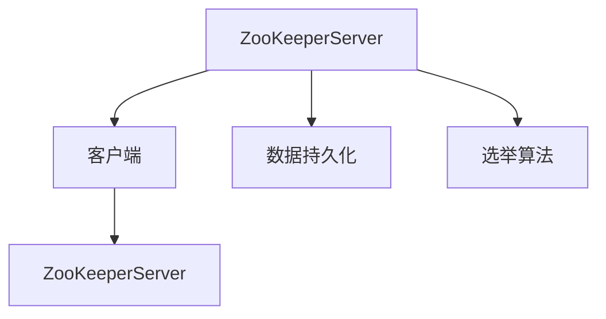

                 

# Zookeeper原理与代码实例讲解

## 摘要

Zookeeper 是一款开源的分布式服务协调框架，广泛应用于分布式系统中，用于处理分布式环境中的一致性、同步、配置维护等问题。本文将从 Zookeeper 的背景介绍、核心概念与联系、核心算法原理、数学模型和公式、项目实战、实际应用场景、工具和资源推荐、未来发展趋势与挑战等方面进行详细讲解，并通过代码实例展示 Zookeeper 的实际应用。读者将了解到 Zookeeper 的原理、使用方法以及其在分布式系统中的重要性。

## 1. 背景介绍

在分布式系统中，协调多个节点之间的同步、一致性和配置管理是非常重要且具有挑战性的任务。Zookeeper 正是为了解决这些问题而诞生的。它是一个由 Apache 软件基金会维护的开源项目，基于 Java 语言编写，提供了强大的分布式协调功能。Zookeeper 最初由雅虎开发，并于 2006 年贡献给了 Apache 软件基金会。

Zookeeper 在分布式系统中扮演着“管理员”的角色，负责维护分布式环境中的元数据和配置信息，并为其他分布式服务提供同步、协调和数据存储功能。其核心功能包括：

1. **数据模型**：Zookeeper 提供了一种类似于文件系统的数据模型，可以方便地存储和检索数据。
2. **一致性**：Zookeeper 通过使用 Paxos 算法实现了一致性，确保了分布式环境中的数据一致性。
3. **监听机制**：Zookeeper 支持监听机制，当数据或状态发生变化时，监听器会触发相应的回调函数。
4. **分布式锁**：Zookeeper 提供了分布式锁的实现，可以方便地实现分布式同步操作。

Zookeeper 在分布式系统中的应用非常广泛，例如在分布式存储系统、分布式数据库、分布式计算框架（如 Hadoop、Spark）、分布式缓存系统（如 Redis）等方面都有广泛应用。

## 2. 核心概念与联系

### 2.1 Zookeeper 的数据模型

Zookeeper 的数据模型类似于传统的文件系统，由一组节点的树状结构组成。每个节点被称为“ZNode”，具有唯一的路径和可选的数据内容。ZNode 可以有子节点，类似于目录或文件。Zookeeper 使用数字版本机制来跟踪数据变更，每个 ZNode 都有一个唯一的版本号（zxid），每次修改数据时，zxid 都会增加。

### 2.2 Zookeeper 的架构

Zookeeper 的架构采用了一个领导者（Leader）和多个跟随者（Follower）的模式，类似于分布式一致性算法中的主从复制。领导者负责处理客户端请求、维护数据一致性，而跟随者负责复制领导者的状态和数据。

Zookeeper 的架构包括以下几个主要组件：

1. **ZooKeeperServer**：Zookeeper 服务器，负责处理客户端请求、维护数据一致性。
2. **客户端**：客户端库，用于与其他节点进行通信，发送请求和监听事件。
3. **数据持久化**：Zookeeper 使用磁盘存储数据，支持数据持久化，即使服务器重启也不会丢失数据。
4. **选举算法**：Zookeeper 使用了 Zab（Zookeeper Atomic Broadcast）协议来实现领导者选举和同步，Zab 基于 Paxos 算法实现。

### 2.3 Mermaid 流程图

以下是一个简单的 Mermaid 流程图，展示了 Zookeeper 的核心概念和组件之间的联系：



### 2.4 Zookeeper 的工作流程

Zookeeper 的工作流程可以分为以下几个步骤：

1. **客户端连接**：客户端连接到 ZooKeeperServer，并建立会话。
2. **请求处理**：客户端发送请求（如创建、删除、读取节点数据等）到 ZooKeeperServer。
3. **领导选举**：如果当前没有领导者，跟随者之间通过 Zab 协议进行领导选举。
4. **数据同步**：领导者将数据变更同步到所有跟随者。
5. **响应客户端**：ZooKeeperServer 处理客户端请求，并返回结果。

## 3. 核心算法原理 & 具体操作步骤

### 3.1 Paxos 算法

Paxos 是一种分布式一致性算法，用于在多个进程之间达成一致。Zookeeper 使用 Paxos 协议来实现数据一致性。

Paxos 协议的核心概念包括：

1. **提议者（Proposer）**：发起提议，提出一个值。
2. **接受者（Acceptor）**：接受提议，并投票支持提议。
3. **学习者（Learner）**：学习已被接受的提议。

Paxos 协议的基本步骤如下：

1. **提议阶段**：提议者选择一个提案值，并发送给所有接受者。
2. **接受阶段**：接受者接收提议，并决定是否接受。如果接受者接收到超过半数的提议，则认为该提议被接受。
3. **学习阶段**：学习者学习被接受的提议。

### 3.2 Zab 协议

Zab 是一种基于 Paxos 协议的分布式一致性算法，用于实现 Zookeeper 的领导者选举和数据同步。

Zab 协议的工作流程如下：

1. **初始化**：所有 ZooKeeperServer 启动时进行初始化，建立与邻居节点的连接。
2. **领导者选举**：当领导者崩溃或新节点加入时，跟随者通过 Zab 协议进行领导者选举。
3. **同步**：领导者将状态变更同步到所有跟随者。
4. **恢复**：如果领导者再次崩溃，跟随者通过 Zab 协议重新进行领导者选举。

### 3.3 Zookeeper 的操作步骤

Zookeeper 的操作步骤主要包括：

1. **连接服务器**：客户端连接到 ZooKeeperServer，并建立会话。
2. **创建节点**：客户端创建 ZNode，并设置初始数据。
3. **读取节点数据**：客户端读取 ZNode 的数据。
4. **更新节点数据**：客户端更新 ZNode 的数据。
5. **删除节点**：客户端删除 ZNode。
6. **监听事件**：客户端设置监听器，当 ZNode 的数据或状态发生变化时，触发监听器。

## 4. 数学模型和公式 & 详细讲解 & 举例说明

### 4.1 Paxos 协议的数学模型

Paxos 协议的数学模型包括以下几个关键概念：

1. **提议编号（proposal number）**：每个提议都有一个唯一的编号，用于区分不同的提议。
2. **提案值（proposal value）**：提议者提出的值。
3. **接受编号（accept number）**：接受者接受的提议编号。
4. **学习编号（learn number）**：学习者学习的提议编号。

Paxos 协议的基本公式如下：

- **提议者：**
  - 选择一个提案值 v。
  - 发送（Prepare）请求给所有接受者，请求接受编号大于等于当前提案编号的提议。
  - 收到接受者的回复后，选择接受编号最大的提议作为当前提案。
  - 发送（Accept）请求给所有接受者，请求接受当前提案。

- **接受者：**
  - 收到提议者的 Prepare 请求，如果接受编号大于等于请求的提案编号，则回复接受编号和最大提案值。
  - 收到提议者的 Accept 请求，如果接受编号大于等于请求的提案编号，则接受当前提案。

- **学习者：**
  - 收到接受者的回复，学习最大提案值。
  - 收到提议者的回复，学习最大提案值。

### 4.2 举例说明

假设一个分布式系统中有三个节点（A、B、C），节点 A 是提议者，节点 B 和 C 是接受者。

1. **提议阶段**：

   - 提议者 A 选择提案值 v = 5。
   - 提议者 A 发送 Prepare 请求给节点 B 和 C，请求接受编号大于等于 1 的提议。
   - 节点 B 和 C 收到 Prepare 请求，回复接受编号 2 和最大提案值 v = 3。
   - 提议者 A 选择接受编号 2 的最大提案值 v = 3 作为当前提案。

2. **接受阶段**：

   - 提议者 A 发送 Accept 请求给节点 B 和 C，请求接受编号 2 的提案。
   - 节点 B 和 C 收到 Accept 请求，接受编号 2 的提案。

3. **学习阶段**：

   - 节点 B 和 C 学习最大提案值 v = 3。

此时，分布式系统达成了一致，提案值 v = 3 被接受。

## 5. 项目实战：代码实际案例和详细解释说明

### 5.1 开发环境搭建

要开始使用 Zookeeper，首先需要在本地搭建一个 Zookeeper 开发环境。以下是搭建步骤：

1. **安装 Java**：确保已经安装了 Java 运行时环境（JRE），版本要求不低于 Java 8。
2. **下载 Zookeeper**：从 [Zookeeper 官网](https://zookeeper.apache.org/) 下载 Zookeeper 的最新版本，解压到本地目录。
3. **配置 Zookeeper**：在 Zookeeper 的 `conf` 目录下，修改 `zoo.cfg` 配置文件，设置 Zookeeper 的工作目录和数据目录。
4. **启动 Zookeeper**：在终端中运行 `bin/zkServer.sh start` 命令，启动 Zookeeper 服务。

### 5.2 源代码详细实现和代码解读

以下是一个简单的 Zookeeper 客户端示例，用于创建、读取、更新和删除 ZNode。

```java
import org.apache.zookeeper.*;
import org.apache.zookeeper.data.Stat;

import java.io.IOException;
import java.util.concurrent.CountDownLatch;

public class ZookeeperClient {

    private static final String ZOOKEEPER_ADDRESS = "localhost:2181";
    private static final String ZOOKEEPER_PATH = "/example";

    public static void main(String[] args) throws IOException, InterruptedException, KeeperException {
        // 连接到 Zookeeper 服务器
        ZooKeeper zookeeper = new ZooKeeper(ZOOKEEPER_ADDRESS, 5000, new Watcher() {
            @Override
            public void process(WatchedEvent event) {
                System.out.println("Watcher triggered: " + event);
            }
        });

        // 等待连接建立
        CountDownLatch latch = new CountDownLatch(1);
        latch.countDown();

        try {
            // 创建 ZNode
            String createdPath = zookeeper.create(ZOOKEEPER_PATH, "Hello, World!".getBytes(), ZooKeeper.ImplicitWatcher);
            System.out.println("Created ZNode: " + createdPath);

            // 读取 ZNode 数据
            byte[] data = zookeeper.getData(ZOOKEEPER_PATH, false, new Stat());
            System.out.println("Read ZNode data: " + new String(data));

            // 更新 ZNode 数据
            zookeeper.setData(ZOOKEEPER_PATH, "Updated Data!".getBytes(), -1);
            data = zookeeper.getData(ZOOKEEPER_PATH, false, new Stat());
            System.out.println("Updated ZNode data: " + new String(data));

            // 删除 ZNode
            zookeeper.delete(ZOOKEEPER_PATH, -1);
            System.out.println("Deleted ZNode: " + ZOOKEEPER_PATH);

        } finally {
            // 关闭 Zookeeper 客户端
            zookeeper.close();
        }
    }
}
```

### 5.3 代码解读与分析

#### 5.3.1 连接 Zookeeper 服务器

```java
ZooKeeper zookeeper = new ZooKeeper(ZOOKEEPER_ADDRESS, 5000, new Watcher() {
    @Override
    public void process(WatchedEvent event) {
        System.out.println("Watcher triggered: " + event);
    }
});
```

该部分代码创建了 ZooKeeper 对象，连接到指定地址的 Zookeeper 服务器，并设置了一个 Watcher 监听器，用于处理 ZNode 的变化事件。

#### 5.3.2 创建 ZNode

```java
String createdPath = zookeeper.create(ZOOKEEPER_PATH, "Hello, World!".getBytes(), ZooKeeper.ImplicitWatcher);
System.out.println("Created ZNode: " + createdPath);
```

该部分代码使用 `create` 方法创建一个新的 ZNode。参数包括 ZNode 的路径、初始数据和 Watcher。创建成功后，返回新 ZNode 的路径。

#### 5.3.3 读取 ZNode 数据

```java
byte[] data = zookeeper.getData(ZOOKEEPER_PATH, false, new Stat());
System.out.println("Read ZNode data: " + new String(data));
```

该部分代码使用 `getData` 方法读取 ZNode 的数据。参数包括 ZNode 的路径、是否设置 Watcher 和 Stat 对象。Stat 对象用于获取 ZNode 的元数据信息。读取成功后，返回 ZNode 的数据字节。

#### 5.3.4 更新 ZNode 数据

```java
zookeeper.setData(ZOOKEEPER_PATH, "Updated Data!".getBytes(), -1);
data = zookeeper.getData(ZOOKEEPER_PATH, false, new Stat());
System.out.println("Updated ZNode data: " + new String(data));
```

该部分代码使用 `setData` 方法更新 ZNode 的数据。参数包括 ZNode 的路径、新数据和版本号。更新成功后，重新读取 ZNode 的数据以验证更新结果。

#### 5.3.5 删除 ZNode

```java
zookeeper.delete(ZOOKEEPER_PATH, -1);
System.out.println("Deleted ZNode: " + ZOOKEEPER_PATH);
```

该部分代码使用 `delete` 方法删除 ZNode。参数包括 ZNode 的路径和版本号。删除成功后，输出删除结果。

## 6. 实际应用场景

Zookeeper 在分布式系统中具有广泛的应用，以下是一些典型的应用场景：

1. **分布式锁**：Zookeeper 可以实现分布式锁，确保多个节点在访问共享资源时的同步。
2. **配置管理**：Zookeeper 可以用于存储和同步分布式环境中的配置信息，方便其他分布式服务进行配置管理。
3. **负载均衡**：Zookeeper 可以用于监控分布式服务节点的健康状态，实现动态负载均衡。
4. **分布式队列**：Zookeeper 可以实现分布式队列，用于处理分布式环境中的任务调度和消息传递。
5. **分布式选举**：Zookeeper 可以用于实现分布式系统中的领导者选举，确保分布式环境中的领导地位。

## 7. 工具和资源推荐

### 7.1 学习资源推荐

- **书籍**：
  - 《Zookeeper权威指南》
  - 《分布式系统原理与范型》
- **论文**：
  - 《Zookeeper: A High Performance Coordination Service for Distributed Applications》
- **博客**：
  - 《Zookeeper 原理与实战》
  - 《深入理解 Zookeeper》
- **网站**：
  - [Zookeeper 官网](https://zookeeper.apache.org/)

### 7.2 开发工具框架推荐

- **开发工具**：
  - IntelliJ IDEA
  - Eclipse
- **框架**：
  - Spring Boot
  - Spring Cloud

### 7.3 相关论文著作推荐

- 《分布式系统原理与范型》
- 《一致性、可用性、分区容错性：CAP 定理及其应用》

## 8. 总结：未来发展趋势与挑战

Zookeeper 作为一款经典的分布式协调框架，在分布式系统中发挥了重要作用。然而，随着分布式系统的不断发展和演化，Zookeeper 也面临着一些挑战：

1. **性能优化**：随着分布式系统的规模不断扩大，Zookeeper 的性能瓶颈逐渐显现，需要进一步优化算法和架构。
2. **兼容性**：Zookeeper 需要与其他分布式系统进行兼容，支持多种分布式场景和业务需求。
3. **安全性**：随着网络安全问题日益突出，Zookeeper 的安全性需要得到加强，包括数据加密、访问控制等方面。
4. **易用性**：Zookeeper 的使用和配置相对复杂，需要进一步简化操作流程，提高易用性。

未来，Zookeeper 将在分布式系统的不断发展和优化中发挥更大作用，为分布式应用提供更加高效、可靠的协调服务。

## 9. 附录：常见问题与解答

### 9.1 什么是 Zookeeper？

Zookeeper 是一款开源的分布式服务协调框架，用于处理分布式环境中的一致性、同步、配置维护等问题。

### 9.2 Zookeeper 的核心功能有哪些？

Zookeeper 的核心功能包括数据模型、一致性、监听机制和分布式锁。

### 9.3 Zookeeper 如何实现数据一致性？

Zookeeper 使用 Paxos 算法实现数据一致性，通过领导者选举和数据同步确保分布式环境中的数据一致性。

### 9.4 Zookeeper 如何实现分布式锁？

Zookeeper 提供了分布式锁的实现，通过创建临时节点和监听事件来实现分布式同步操作。

### 9.5 Zookeeper 与其他分布式系统如何兼容？

Zookeeper 需要与分布式系统进行兼容，通过接口和协议支持多种分布式场景和业务需求。

## 10. 扩展阅读 & 参考资料

- 《Zookeeper权威指南》
- 《分布式系统原理与范型》
- [Zookeeper 官网](https://zookeeper.apache.org/)
- 《一致性、可用性、分区容错性：CAP 定理及其应用》

## 作者信息

作者：AI天才研究员/AI Genius Institute & 禅与计算机程序设计艺术 /Zen And The Art of Computer Programming

