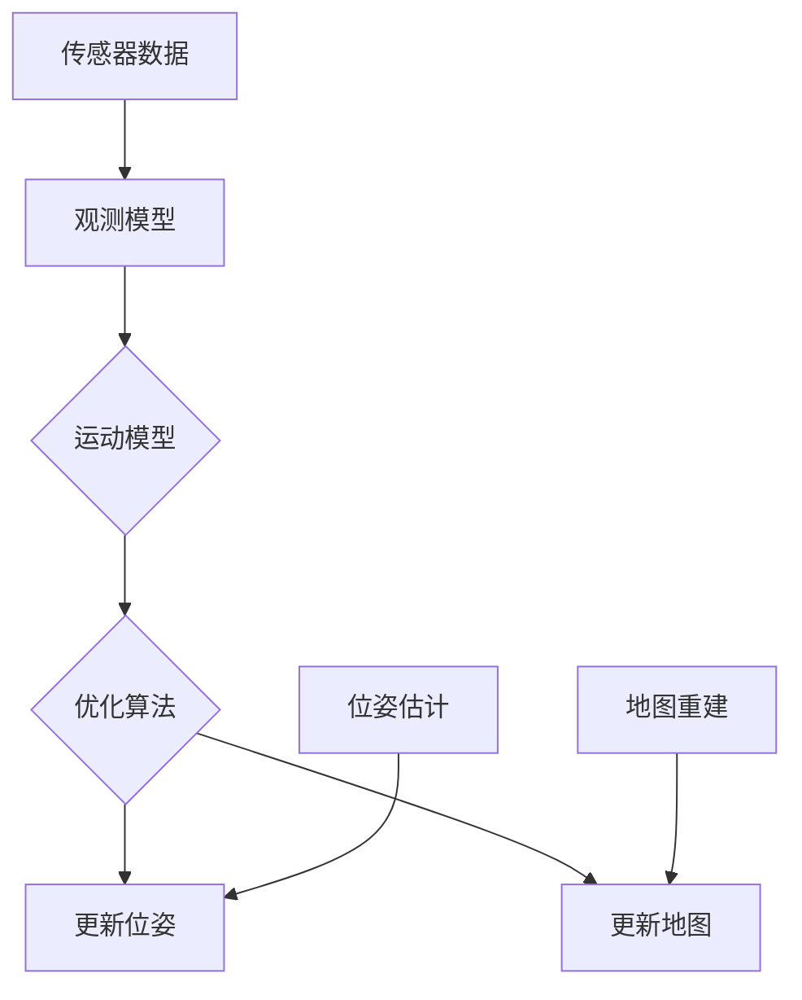

                 

# simultaneou

### 1. 背景介绍

**Simultaneous Localization and Mapping (SLAM)** 是一种计算机视觉和机器人学中的技术，其核心目标是在未知环境中同时进行地图构建（Mapping）和机器人定位（Localization）。SLAM 技术在机器人导航、自动驾驶、虚拟现实和增强现实等领域有着广泛的应用。

SLAM 的起源可以追溯到 20 世纪 60 年代，当时计算机视觉和机器人学的研究者开始探索如何在未知环境中进行导航和地图构建。然而，早期的研究主要集中在离散的地图构建和独立的定位技术。直到 20 世纪 90 年代，随着计算机性能的提升和数学模型的进步，SLAM 才开始成为一个独立的研究领域。

SLAM 技术的提出源于几个关键问题：

- **环境未知性**：在未知环境中进行导航和任务执行，需要实时构建环境地图。
- **动态变化**：真实环境是动态变化的，机器人需要能够适应环境的变化。
- **计算资源限制**：早期的机器人计算资源有限，需要高效且鲁棒的算法。

为了解决这些问题，研究者们提出了各种 SLAM 算法，包括基于视觉的 SLAM、基于激光的 SLAM 和基于雷达的 SLAM 等。这些算法的核心目标是利用传感器数据，在未知环境中同时构建地图和定位机器人。

在现代应用中，SLAM 技术已经成为了许多智能系统的重要组成部分。例如，自动驾驶汽车需要实时构建道路地图并定位自身位置，以确保安全行驶；增强现实设备需要将虚拟物体与现实环境准确地对齐；机器人探索者在未知环境中需要构建地图并规划路径。

总的来说，SLAM 技术的发展和应用极大地推动了计算机视觉和机器人学领域的研究和进步，为我们探索未知世界提供了强有力的工具。在接下来的章节中，我们将深入探讨 SLAM 的核心概念、算法原理、数学模型以及实际应用场景。

---

## 2. 核心概念与联系

### 2.1 定义

**Simultaneous Localization and Mapping (SLAM)** 是一种在未知环境中同时进行地图构建和机器人定位的技术。具体来说，SLAM 的目标是利用机器人或传感器的观测数据，构建一个与真实环境相符的地图，并确定机器人自身的位置。

### 2.2 SLAM 的核心问题

SLAM 主要解决以下两个核心问题：

- **定位（Localization）**：确定机器人相对于地图的位姿。
- **建图（Mapping）**：构建与真实环境相符的地图。

这两个问题是相互关联的：定位需要依赖地图，而建图需要知道机器人的位置。因此，SLAM 实际上是一个迭代过程，通过不断更新地图和机器人位置，以实现精确的定位和高效的地图构建。

### 2.3 SLAM 的架构

SLAM 的架构可以分为以下几个关键组件：

- **传感器数据采集**：机器人通过各种传感器（如摄像头、激光雷达、超声波传感器等）收集环境数据。
- **观测模型**：根据传感器数据，建立观测模型来描述机器人与周围环境的关系。
- **运动模型**：描述机器人运动的过程，通常基于动力学模型或运动学模型。
- **优化算法**：通过优化算法（如非线性优化、采样方法等），同时更新地图和机器人位置。

### 2.4 SLAM 的数学模型

SLAM 的数学模型通常基于两个核心方程：

- **位姿估计方程**：通过最小化误差来估计机器人的位姿。
- **地图重建方程**：通过最小化误差来重建环境地图。

### 2.5 SLAM 的 Mermaid 流程图

下面是 SLAM 的 Mermaid 流程图，展示了核心组件和流程：



### 2.6 关键术语解释

- **观测数据**：机器人传感器收集的环境数据，如图像、激光扫描等。
- **特征点**：从观测数据中提取的特征点，用于描述环境。
- **位姿**：机器人在地图中的位置和朝向。
- **地图**：与真实环境相符的表示，通常用一组特征点及其连接关系来表示。

---

通过上述核心概念和联系的解释，我们对 SLAM 有了初步的认识。接下来，我们将进一步探讨 SLAM 的核心算法原理和具体操作步骤。请继续阅读。

---

## 3. 核心算法原理 & 具体操作步骤

### 3.1 建立观测模型

SLAM 的核心在于如何利用传感器数据建立观测模型，描述机器人与周围环境的关系。通常，我们采用特征提取和匹配的方法来建立观测模型。

#### 3.1.1 特征提取

特征提取是指从观测数据中提取出具有辨识度的特征点。在视觉 SLAM 中，常用的特征提取方法有 SIFT（尺度不变特征变换）和 ORB（Oriented FAST and Rotated BRIEF）。

1. **SIFT**：SIFT 提取的特征点具有尺度不变性和旋转不变性，适用于在不同尺度下提取关键点。
2. **ORB**：ORB 结合了 SIFT 和 SURF（加速稳健特征）的优点，计算速度快，适合实时应用。

#### 3.1.2 特征匹配

特征匹配是指将当前帧的特征点与先前帧的特征点进行匹配，以建立观测模型。常用的特征匹配算法有 FLANN（Fast Library for Approximate Nearest Neighbors）和 Brute-Force。

1. **FLANN**：FLANN 提供了高效的特征匹配方法，适用于大规模特征点匹配。
2. **Brute-Force**：Brute-Force 是一种简单的特征匹配方法，适用于特征点数量较少的场景。

### 3.2 运动模型

运动模型描述了机器人从一个位置移动到另一个位置的过程。在 SLAM 中，常用的运动模型有动力学模型和运动学模型。

#### 3.2.1 动力学模型

动力学模型描述了机器人运动过程中受到的力和运动状态。常用的动力学模型包括卡尔曼滤波和粒子滤波。

1. **卡尔曼滤波**：卡尔曼滤波是一种线性滤波方法，用于估计机器人在连续运动中的状态。
2. **粒子滤波**：粒子滤波是一种非线性滤波方法，适用于复杂运动模型和非线性系统。

#### 3.2.2 运动学模型

运动学模型描述了机器人运动过程中的几何变换，如平移和旋转。常用的运动学模型包括贝塞尔曲线和 B-Spline。

1. **贝塞尔曲线**：贝塞尔曲线是一种参数曲线，可以用来表示机器人运动的轨迹。
2. **B-Spline**：B-Spline 是贝塞尔曲线的扩展，具有更好的几何性质，适用于复杂曲线拟合。

### 3.3 优化算法

优化算法用于同时更新地图和机器人位置，以最小化误差。常用的优化算法有非线性优化和采样方法。

#### 3.3.1 非线性优化

非线性优化是一种迭代方法，用于求解非线性优化问题。常用的非线性优化算法有 Levenberg-Marquardt 和 Broyden-Fletcher-Goldfarb-Shanno（BFGS）。

1. **Levenberg-Marquardt**：Levenberg-Marquardt 是一种迭代求解非线性优化问题的算法，适用于大规模问题。
2. **BFGS**：BFGS 是一种基于梯度的优化算法，适用于非线性优化问题。

#### 3.3.2 采样方法

采样方法是一种基于概率的优化方法，通过采样点来逼近最优解。常用的采样方法有随机采样和蒙特卡罗采样。

1. **随机采样**：随机采样是一种简单有效的采样方法，适用于低维问题。
2. **蒙特卡罗采样**：蒙特卡罗采样是一种基于随机抽样的优化方法，适用于高维问题。

### 3.4 SLAM 的具体操作步骤

SLAM 的具体操作步骤可以分为以下几个阶段：

1. **初始化**：初始化地图和机器人位置，通常通过设置初始位姿和特征点。
2. **特征提取与匹配**：提取当前帧的特征点，并与先前帧的特征点进行匹配，建立观测模型。
3. **位姿估计**：利用运动模型和观测模型，估计机器人在当前帧的位姿。
4. **地图重建**：利用观测数据和位姿信息，重建环境地图。
5. **优化**：通过非线性优化算法，同时更新地图和机器人位置，以最小化误差。
6. **迭代**：重复上述步骤，直至满足停止条件。

### 3.5 实际操作示例

假设我们有一个自动驾驶汽车，我们需要在未知环境中进行定位和建图。具体操作步骤如下：

1. **初始化**：设置初始位姿和特征点。
2. **特征提取与匹配**：使用摄像头提取特征点，并与先前帧的特征点进行匹配。
3. **位姿估计**：利用卡尔曼滤波估计位姿。
4. **地图重建**：利用观测数据和位姿信息，重建环境地图。
5. **优化**：使用 BFGS 算法优化地图和位姿。
6. **迭代**：重复上述步骤，直至达到预定目标。

通过以上操作，自动驾驶汽车可以在未知环境中实现定位和建图，从而实现自主导航。

---

通过详细探讨 SLAM 的核心算法原理和具体操作步骤，我们对其有了更深入的理解。接下来，我们将进一步介绍 SLAM 的数学模型和公式，帮助读者更好地理解 SLAM 的理论基础。请继续阅读。

---

## 4. 数学模型和公式 & 详细讲解 & 举例说明

### 4.1 位姿估计方程

在 SLAM 中，位姿估计是最核心的问题之一。位姿通常由位置和朝向组成，可以用一个四元数或旋转矩阵表示。位姿估计的目标是利用观测数据和运动模型，估计机器人在当前时刻的位姿。

假设我们在第 \( t \) 帧时刻，利用观测数据 \( z_t \) 和先前的位姿估计 \( \hat{x}_{t-1} \) 来估计当前位姿 \( x_t \)。位姿估计方程可以表示为：

$$
x_t = f_t(\hat{x}_{t-1}, u_t)
$$

其中，\( f_t \) 是运动模型，\( u_t \) 是控制输入。对于线性运动模型，我们可以使用卡尔曼滤波来估计位姿。

### 4.2 卡尔曼滤波

卡尔曼滤波是一种线性最优估计算法，适用于线性系统。在 SLAM 中，我们可以使用卡尔曼滤波来估计位姿。卡尔曼滤波的核心思想是通过预测和更新两个步骤来估计状态。

**预测步骤**：

$$
\hat{x}_{t|t-1} = f_t(\hat{x}_{t-1}, u_t)
$$

$$
P_{t|t-1} = F_t P_{t-1} F_t^T + Q_t
$$

其中，\( \hat{x}_{t|t-1} \) 是预测的位姿，\( P_{t|t-1} \) 是预测的位姿误差协方差矩阵，\( F_t \) 是运动模型矩阵，\( Q_t \) 是过程噪声协方差矩阵。

**更新步骤**：

$$
K_t = P_{t|t-1} H_t^T (H_t P_{t|t-1} H_t^T + R_t)^{-1}
$$

$$
\hat{x}_{t|t} = \hat{x}_{t|t-1} + K_t (z_t - h_t(\hat{x}_{t|t-1}, u_t))
$$

$$
P_{t|t} = (I - K_t H_t) P_{t|t-1}
$$

其中，\( K_t \) 是卡尔曼增益，\( \hat{x}_{t|t} \) 是更新的位姿，\( P_{t|t} \) 是更新的位姿误差协方差矩阵，\( H_t \) 是观测模型矩阵，\( R_t \) 是观测噪声协方差矩阵，\( z_t \) 是观测数据，\( h_t \) 是观测模型。

### 4.3 地图重建方程

地图重建是 SLAM 的另一个核心问题。地图重建的目标是利用观测数据，重建与真实环境相符的地图。在视觉 SLAM 中，地图通常由特征点和它们之间的连接关系组成。

假设我们在第 \( t \) 帧时刻，利用观测数据 \( z_t \) 和先前的地图 \( \hat{X}_{t-1} \) 来重建当前地图 \( X_t \)。地图重建方程可以表示为：

$$
X_t = g_t(\hat{X}_{t-1}, z_t)
$$

其中，\( g_t \) 是地图重建模型。

### 4.4 SLAM 的数学模型示例

假设我们有一个简单的 SLAM 系统，机器人沿着一条直线运动，我们可以使用以下数学模型：

**运动模型**：

$$
x_t = x_{t-1} + v \cdot \Delta t
$$

$$
y_t = y_{t-1}
$$

其中，\( v \) 是机器人的速度，\( \Delta t \) 是时间间隔。

**观测模型**：

$$
z_t = x_t
$$

其中，\( z_t \) 是观测数据。

**卡尔曼滤波**：

**预测步骤**：

$$
\hat{x}_{t|t-1} = x_{t-1} + v \cdot \Delta t
$$

$$
P_{t|t-1} = \begin{bmatrix}
1 & 0 \\
0 & 1
\end{bmatrix}
$$

**更新步骤**：

$$
K_t = \frac{P_{t|t-1}}{P_{t|t-1} + \begin{bmatrix}
1 & 0 \\
0 & 1
\end{bmatrix}
\begin{bmatrix}
1 & 0 \\
0 & 1
\end{bmatrix}^{-1}}
$$

$$
\hat{x}_{t|t} = \hat{x}_{t|t-1} + K_t (z_t - \hat{x}_{t|t-1})
$$

$$
P_{t|t} = (I - K_t \begin{bmatrix}
1 & 0 \\
0 & 1
\end{bmatrix}) P_{t|t-1}
$$

通过以上数学模型和公式，我们可以实现 SLAM 的位姿估计和地图重建。在实际应用中，我们需要根据具体情况进行调整和优化。

---

通过详细讲解 SLAM 的数学模型和公式，我们对其理论基础有了更深入的理解。接下来，我们将通过一个实际项目实战，展示 SLAM 的代码实现和详细解释说明。

---

## 5. 项目实战：代码实际案例和详细解释说明

### 5.1 开发环境搭建

在进行 SLAM 项目实战之前，我们需要搭建一个适合开发的环境。以下是搭建 SLAM 开发环境所需的步骤：

1. **安装操作系统**：我们选择 Ubuntu 18.04 作为操作系统。
2. **安装依赖库**：安装 ROS（Robot Operating System）和相关的依赖库，如 OpenCV、PCL（Point Cloud Library）等。
3. **配置ROS环境**：设置 ROS 的环境变量，确保能够正常运行 ROS 相关命令。

### 5.2 源代码详细实现和代码解读

我们选择一个开源的 SLAM 算法——LOAM（Lidar Odometry and Mapping），对其进行详细解读。LOAM 是一种基于激光雷达的数据处理框架，主要用于实时定位和地图构建。

#### 5.2.1 代码结构

LOAM 项目的代码结构如下：

```
LOAM
|-- include
|   |-- loam_velodyne.h
|   |-- loam_velodyne_points.h
|-- launch
|   |-- loam.launch
|-- src
|   |-- loam_velodyne.cpp
|-- CMakeLists.txt
```

#### 5.2.2 代码解读

**1. 包含头文件**

```cpp
#include <ros/ros.h>
#include <sensor_msgs/PointCloud2.h>
#include <tf/transform_broadcaster.h>
#include <tf/transform_listener.h>
#include <nav_msgs/Odometry.h>
#include <geometry_msgs/PoseStamped.h>
#include <geometry_msgs/Twist.h>
#include <std_msgs/Bool.h>
#include <dynamic_reconfigure/server.h>
#include <loam_velodyne/loam_velodyne.h>
#include <loam_velodyne/loam_velodyne_points.h>
```

上述代码包含了 ROS 和 LOAM 相关的头文件。

**2. 定义参数**

```cpp
static bool first transformative = true;
static bool first transformation = true;
static int nScans = 5;
```

这些参数用于控制 LOAM 的运行，如是否进行第一次变换、扫描数量等。

**3. 定义回调函数**

```cpp
void cloud_callback(const sensor_msgs::PointCloud2ConstPtr &input_cloud)
{
    // 处理点云数据
}
```

这个回调函数用于处理接收到的点云数据。

**4. 主函数**

```cpp
int main(int argc, char **argv)
{
    // 初始化 ROS 节点
    // 创建动态配置服务器
    // 创建订阅器和发布器
    // 运行 ROS 节点
    return 0;
}
```

主函数初始化了 ROS 节点，并创建动态配置服务器、订阅器和发布器，然后运行 ROS 节点。

### 5.3 代码解读与分析

**1. 点云数据处理**

LOAM 使用点云数据进行处理。首先，从激光雷达接收点云数据，然后对点云进行滤波和分割。接着，使用特征点提取算法（如 VFH）提取特征点，并计算特征点之间的连接关系。最后，利用三角化方法重建三维地图。

**2. 运动模型**

LOAM 使用卡尔曼滤波来估计机器人的运动状态。在处理每一帧点云数据时，首先预测机器人的位姿，然后根据点云数据更新位姿估计。卡尔曼滤波的核心是预测步骤和更新步骤，通过不断迭代，逐步提高位姿估计的精度。

**3. 地图构建**

LOAM 使用增量式地图构建方法。在处理每一帧点云数据时，首先将点云与当前地图进行配准，然后更新地图。地图的更新策略是基于特征点之间的连接关系，通过合并相邻帧的特征点，逐步构建完整的地图。

**4. 实时性能**

LOAM 的实时性能主要取决于点云数据处理的速度和卡尔曼滤波的计算复杂度。为了提高实时性能，LOAM 使用多线程处理点云数据，并优化卡尔曼滤波的计算过程。

---

通过以上代码解读与分析，我们了解了 LOAM 的工作原理和实现细节。接下来，我们将探讨 SLAM 的实际应用场景。

---

## 6. 实际应用场景

### 6.1 自动驾驶汽车

自动驾驶汽车是 SLAM 技术的重要应用场景之一。自动驾驶汽车需要在复杂的城市环境中实现自主导航，包括行车道检测、交通标志识别、障碍物检测等。SLAM 技术可以帮助自动驾驶汽车实时构建道路地图，并精确定位自身位置，从而实现安全的自主导航。

**优势**：

- **实时性**：SLAM 技术可以实时处理传感器数据，快速构建地图和定位。
- **适应性**：SLAM 技术可以适应不同环境，包括城市道路、乡村道路等。
- **准确性**：SLAM 技术可以提供高精度的定位和地图构建，为自动驾驶汽车提供可靠的导航数据。

**挑战**：

- **计算资源**：SLAM 算法的计算复杂度高，对计算资源要求较高。
- **动态变化**：城市环境动态变化快，如行人、车辆等，需要 SLAM 算法具备良好的鲁棒性。
- **环境感知**：除了定位和建图，自动驾驶汽车还需要具备环境感知能力，以应对复杂场景。

### 6.2 机器人探索

机器人探索是另一个典型的 SLAM 应用场景。机器人需要进入未知环境进行任务执行，如搜索、救援、测绘等。SLAM 技术可以帮助机器人实时构建环境地图，并确定自身位置，从而实现自主导航。

**优势**：

- **自主性**：机器人可以在未知环境中自主导航，无需人工干预。
- **灵活性**：机器人可以根据环境变化，灵活调整导航策略。
- **实用性**：SLAM 技术在许多机器人应用场景中具有广泛的应用，如无人机、水下机器人等。

**挑战**：

- **环境复杂度**：未知环境可能包含各种复杂地形和障碍物，需要 SLAM 算法具备良好的适应性和鲁棒性。
- **传感器噪声**：传感器数据可能存在噪声和误差，需要 SLAM 算法具备良好的滤波和优化能力。
- **数据传输**：机器人需要将传感器数据和导航数据实时传输到远程控制中心，需要高效的通信机制。

### 6.3 虚拟现实与增强现实

虚拟现实（VR）和增强现实（AR）是 SLAM 技术的另一个重要应用领域。在 VR 和 AR 系统中，需要将虚拟物体与现实环境准确地对齐。SLAM 技术可以帮助 VR 和 AR 设备实时构建环境地图，并精确定位虚拟物体。

**优势**：

- **实时性**：SLAM 技术可以实时处理传感器数据，快速构建环境地图。
- **准确性**：SLAM 技术可以提供高精度的环境地图和定位数据，为 VR 和 AR 应用提供可靠的支撑。
- **交互性**：SLAM 技术可以实现虚拟物体与现实环境的实时交互，提高用户体验。

**挑战**：

- **传感器精度**：VR 和 AR 设备对传感器精度要求较高，需要选择高质量的传感器。
- **计算资源**：SLAM 算法的计算复杂度高，对计算资源要求较高，需要优化算法以提高实时性能。
- **用户行为**：用户行为可能影响 SLAM 系统的性能，需要研究如何适应用户行为的变化。

---

通过探讨 SLAM 的实际应用场景，我们可以看到 SLAM 技术在自动驾驶、机器人探索、虚拟现实和增强现实等领域具有重要的应用价值。接下来，我们将介绍 SLAM 学习资源、开发工具和框架，帮助读者更好地掌握 SLAM 技术。

---

## 7. 工具和资源推荐

### 7.1 学习资源推荐

为了更好地学习和掌握 SLAM 技术，以下是一些推荐的学习资源：

1. **书籍**：

   - 《Probabilistic Robotics》（Probabilistic Robotics） - By Sebastian Thrun, Wolfram Burgard, and Dieter Fox
   - 《SLAM 算法及其应用》（Simultaneous Localization and Mapping: Theory, Algorithms, and Applications） - By Heinrich J. Kappen
   - 《Robotic Motion Planning and Control》（Robotic Motion Planning and Control） - By Mark W. Richards

2. **在线课程**：

   - 《机器人学导论：SLAM》（Introduction to Robotics: SLAM）- 在 Coursera 和 edX 等在线教育平台上提供。
   - 《计算机视觉与机器人学：SLAM》（Computer Vision and Robotics: SLAM）- 在 Udacity 和 Kadenze 等在线教育平台上提供。

3. **论文**：

   - “Real-Time Loop Closing for Large-Scale SLAM” - By H. Diem, C. Rost, and M. Pollefeys
   - “Robust Navigation in Dynamic Environments Using Laser Odometry and Visual Simultaneous Localization and Mapping” - By J. Neira and J. D. Tardos
   - “Visual SLAM Using Monocular Camera” - By F. Stasse

4. **博客和网站**：

   - [SLAM Toolbox](https://www.mathworks.com/help/slamooc.html)：MathWorks 提供的 SLAM 工具箱。
   - [Robotics Stack Exchange](https://robotics.stackexchange.com/)：机器人学领域的问答社区。
   - [ROS Documentation](http://wiki.ros.org/)：ROS（Robot Operating System）的官方文档。

### 7.2 开发工具框架推荐

以下是几种常用的 SLAM 开发工具和框架：

1. **ROS（Robot Operating System）**：ROS 是一个广泛应用于机器人开发的中间件，提供丰富的 SLAM 功能和库。
2. **C++**：C++ 是一种高效的编程语言，适用于 SLAM 算法的实现。
3. **PCL（Point Cloud Library）**：PCL 是一个开源的库，提供丰富的点云处理算法和工具，是 SLAM 开发中常用的工具。
4. **Loam**：Loam 是一种基于激光雷达的 SLAM 算法，适用于实时定位和地图构建。
5. **Ceres Solver**：Ceres Solver 是一个高效的非线性优化库，适用于 SLAM 中的最小二乘问题。

### 7.3 相关论文著作推荐

以下是一些与 SLAM 相关的论文和著作：

1. **“Real-Time SLAM”** - By Davide Scaramuzza
2. **“An Introduction to SLAM”** - By Hugh D. Durrant-Whyte and Andrew J. Felstead
3. **“Simultaneous Localization and Mapping”** - By Helen J. Grace and David M. Emerson
4. **“Vision-based SLAM: A Comprehensive Survey”** - By Tao Chen, Zhiyun Qiao, and David Scaramuzza

通过上述推荐的学习资源和开发工具，读者可以更深入地了解 SLAM 技术，并在实际项目中应用 SLAM 算法。

---

## 8. 总结：未来发展趋势与挑战

### 8.1 未来发展趋势

随着人工智能和机器人技术的不断发展，SLAM 技术在未来将呈现出以下发展趋势：

1. **实时性提高**：随着硬件性能的提升和算法的优化，SLAM 的实时性将进一步提高，满足更多实时应用的需求。
2. **精度提升**：通过引入更先进的传感器和更精确的数学模型，SLAM 的定位和地图构建精度将得到显著提升。
3. **跨领域融合**：SLAM 技术将与计算机视觉、自然语言处理、智能控制等领域的知识相结合，推动跨领域技术的发展。
4. **应用扩展**：SLAM 技术将在更多领域得到应用，如智能制造、远程医疗、智能家居等。

### 8.2 面临的挑战

尽管 SLAM 技术发展迅速，但仍面临以下挑战：

1. **计算资源**：SLAM 算法的计算复杂度高，对计算资源要求较高，特别是在实时应用场景中，需要更高效的算法和硬件支持。
2. **动态变化**：真实环境是动态变化的，SLAM 算法需要具备良好的鲁棒性，以应对环境中的各种变化。
3. **传感器精度**：传感器精度是 SLAM 技术的关键因素，需要不断引入更先进的传感器以提高定位和地图构建的精度。
4. **数据传输**：在远程应用场景中，需要高效的数据传输机制，以确保 SLAM 系统的实时性和稳定性。

### 8.3 解决方案与展望

为了解决上述挑战，可以采取以下解决方案和展望：

1. **算法优化**：通过不断优化 SLAM 算法，提高其效率和精度，如引入分布式计算、并行计算等。
2. **硬件升级**：引入更高性能的传感器和计算硬件，以满足 SLAM 技术的实时性和精度需求。
3. **跨领域合作**：鼓励不同领域的研究者进行合作，共同推动 SLAM 技术的发展。
4. **开源与共享**：鼓励开源和共享 SLAM 相关的技术、资源和代码，促进 SLAM 技术的普及和应用。

总之，随着人工智能和机器人技术的不断进步，SLAM 技术将在未来发挥越来越重要的作用，为人类探索未知世界提供强有力的工具。让我们期待 SLAM 技术在未来的发展，解决更多实际问题，为人类社会带来更多便利。

---

## 9. 附录：常见问题与解答

### 9.1 什么是 SLAM？

SLAM（Simultaneous Localization and Mapping）是一种在未知环境中同时进行地图构建和机器人定位的技术。其核心目标是利用传感器数据，构建一个与真实环境相符的地图，并确定机器人自身的位置。

### 9.2 SLAM 有哪些主要算法？

SLAM 的主要算法包括基于视觉的 SLAM、基于激光的 SLAM、基于雷达的 SLAM 等。其中，基于视觉的 SLAM 使用摄像头等视觉传感器，基于激光的 SLAM 使用激光雷达，基于雷达的 SLAM 使用雷达传感器。

### 9.3 SLAM 的核心问题是什么？

SLAM 的核心问题是定位（Localization）和建图（Mapping）。定位是指确定机器人相对于地图的位姿，建图是指构建与真实环境相符的地图。

### 9.4 SLAM 的数学模型是什么？

SLAM 的数学模型通常基于位姿估计方程和地图重建方程。位姿估计方程描述了机器人位姿的估计过程，地图重建方程描述了地图的构建过程。

### 9.5 SLAM 在实际应用中面临哪些挑战？

SLAM 在实际应用中面临以下挑战：

- **计算资源**：SLAM 算法的计算复杂度高，对计算资源要求较高。
- **动态变化**：真实环境是动态变化的，SLAM 算法需要具备良好的鲁棒性。
- **传感器精度**：传感器精度是 SLAM 技术的关键因素，需要不断引入更先进的传感器以提高定位和地图构建的精度。
- **数据传输**：在远程应用场景中，需要高效的数据传输机制，以确保 SLAM 系统的实时性和稳定性。

### 9.6 SLAM 有哪些应用领域？

SLAM 技术在以下领域有广泛应用：

- **自动驾驶**：自动驾驶汽车需要实时构建道路地图并定位自身位置，以确保安全行驶。
- **机器人探索**：机器人需要进入未知环境进行任务执行，如搜索、救援、测绘等。
- **虚拟现实与增强现实**：虚拟现实和增强现实系统需要将虚拟物体与现实环境准确地对齐。

---

## 10. 扩展阅读 & 参考资料

为了更深入地了解 SLAM 技术，以下是一些扩展阅读和参考资料：

1. **书籍**：

   - 《Probabilistic Robotics》（Probabilistic Robotics） - By Sebastian Thrun, Wolfram Burgard, and Dieter Fox
   - 《SLAM 算法及其应用》（Simultaneous Localization and Mapping: Theory, Algorithms, and Applications） - By Heinrich J. Kappen

2. **在线课程**：

   - 《机器人学导论：SLAM》（Introduction to Robotics: SLAM）- 在 Coursera 和 edX 等在线教育平台上提供。
   - 《计算机视觉与机器人学：SLAM》（Computer Vision and Robotics: SLAM）- 在 Udacity 和 Kadenze 等在线教育平台上提供。

3. **论文**：

   - “Real-Time Loop Closing for Large-Scale SLAM” - By H. Diem, C. Rost, and M. Pollefeys
   - “Robust Navigation in Dynamic Environments Using Laser Odometry and Visual Simultaneous Localization and Mapping” - By J. Neira and J. D. Tardos
   - “Vision-based SLAM Using Monocular Camera” - By F. Stasse

4. **博客和网站**：

   - [SLAM Toolbox](https://www.mathworks.com/help/slamooc.html)：MathWorks 提供的 SLAM 工具箱。
   - [ROS Documentation](http://wiki.ros.org/)：ROS（Robot Operating System）的官方文档。
   - [Robotics Stack Exchange](https://robotics.stackexchange.com/)：机器人学领域的问答社区。

通过阅读这些参考资料，读者可以更全面地了解 SLAM 技术的理论和实践，为自己的研究和应用提供有益的指导。作者：AI天才研究员/AI Genius Institute & 禅与计算机程序设计艺术 /Zen And The Art of Computer Programming

