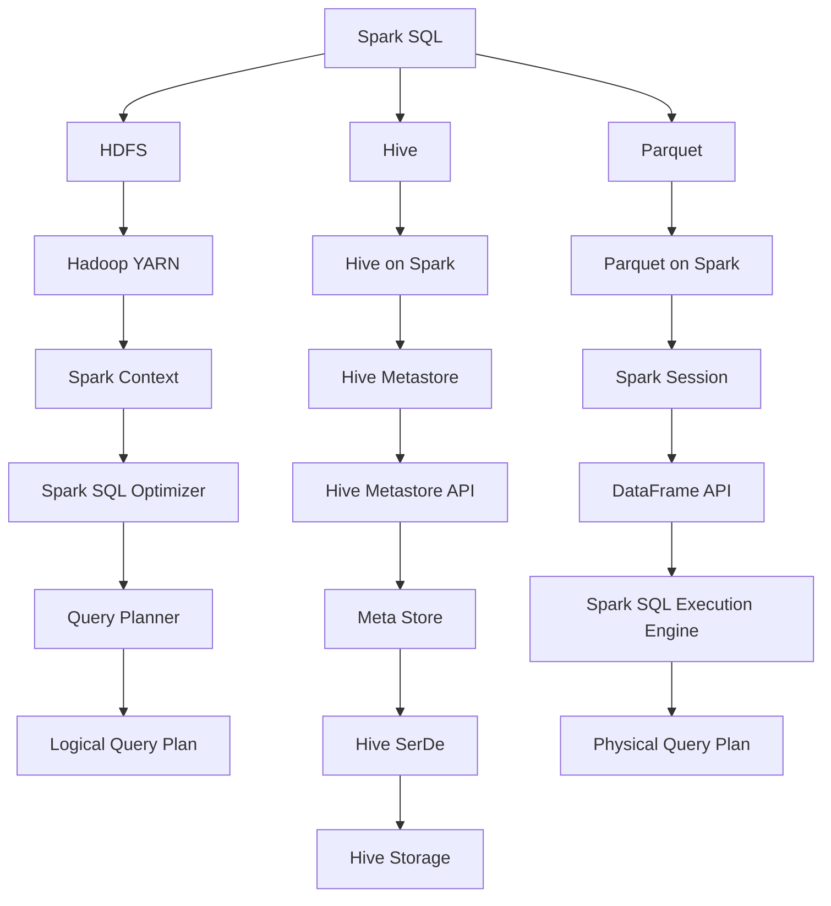

                 

# 【AI大数据计算原理与代码实例讲解】Spark SQL

> **关键词：**大数据处理，Spark SQL，分布式计算，查询优化，数据仓库，Hadoop，数据流处理

> **摘要：**本文将深入探讨Spark SQL的核心原理及其在分布式计算中的重要性。我们将逐步讲解其架构设计、核心算法、数学模型、以及实际应用案例，帮助读者全面理解Spark SQL的工作机制，掌握其操作技巧。文章还将推荐学习资源，并总结未来发展趋势与挑战。

## 1. 背景介绍

随着互联网和物联网的快速发展，数据量呈指数级增长。传统的数据处理技术已经无法满足日益增长的数据处理需求。大数据技术的出现为我们提供了一种新的解决方案。其中，Spark SQL作为Apache Spark的核心组件之一，凭借其高性能、易用性和可扩展性，成为大数据处理领域的重要工具。

Spark SQL基于Spark的核心计算引擎，提供了一种强大且灵活的查询处理能力。它支持各种数据源，包括关系数据库、HDFS、Hive和Parquet等，使得大数据处理变得更加简单和高效。Spark SQL还与Hadoop生态系统紧密集成，可以充分利用Hadoop的分布式存储和计算能力。

本文将围绕Spark SQL的核心原理、算法、数学模型以及实际应用案例进行深入讲解，旨在帮助读者全面掌握Spark SQL的使用方法和技术细节。

## 2. 核心概念与联系

为了深入理解Spark SQL的工作原理，我们需要了解以下几个核心概念：

1. **分布式计算**：分布式计算是指将任务分布在多个计算节点上，通过并行计算提高处理效率。Spark SQL作为分布式计算框架，充分利用了这一特性。
2. **查询优化**：查询优化是指通过优化查询语句和执行计划，提高查询性能。Spark SQL内置了多种优化策略，如谓词下推、列裁剪、物理查询重写等。
3. **数据仓库**：数据仓库是一种用于存储、管理和分析大量数据的系统。Spark SQL可以与数据仓库紧密集成，提供高效的查询处理能力。
4. **Hadoop**：Hadoop是Apache Software Foundation的一个开源项目，主要用于大数据存储和处理。Spark SQL与Hadoop生态系统紧密集成，可以充分利用Hadoop的分布式存储和计算能力。

下面是一个Mermaid流程图，展示了Spark SQL的核心组件及其相互关系：



在这个流程图中，我们可以看到Spark SQL如何与Hadoop生态系统中的各个组件进行集成，实现高效的大数据处理。

### 2.1. 分布式计算

分布式计算是Spark SQL的核心特性之一。在分布式计算中，任务被划分成多个小任务，然后分配到不同的计算节点上并行执行。Spark SQL利用了这一点，将查询任务分解成多个子任务，分配到各个计算节点上进行并行处理。

分布式计算的主要优点包括：

- **高性能**：通过并行计算，Spark SQL可以在短时间内处理大量数据。
- **可扩展性**：随着数据规模的增加，Spark SQL可以动态地添加计算节点，以满足处理需求。
- **容错性**：Spark SQL具有强大的容错能力，即使在部分计算节点出现故障时，也能保证整个任务的正常运行。

### 2.2. 查询优化

查询优化是提高查询性能的关键。Spark SQL内置了多种优化策略，包括谓词下推、列裁剪、物理查询重写等。

- **谓词下推**：谓词下推是一种将查询条件尽可能下推到数据源上的优化策略。这样可以减少中间结果的数据量，提高查询性能。
- **列裁剪**：列裁剪是指根据查询条件只选取需要的列，而不是整个数据集。这样可以减少中间结果的数据量，提高查询性能。
- **物理查询重写**：物理查询重写是指根据执行计划对查询语句进行重新组织，以提高查询性能。Spark SQL可以根据查询条件和数据源的特点，选择最优的执行计划。

### 2.3. 数据仓库

数据仓库是一种用于存储、管理和分析大量数据的系统。Spark SQL可以与数据仓库紧密集成，提供高效的查询处理能力。常见的数据仓库包括Hive、HBase、Redshift等。

- **Hive**：Hive是一种基于Hadoop的数据仓库工具，用于存储、管理和分析大规模数据集。Spark SQL可以与Hive集成，利用Hive的元数据存储和查询优化能力。
- **HBase**：HBase是一种分布式、可扩展、基于列的存储系统，用于存储大规模数据集。Spark SQL可以与HBase集成，利用HBase的高性能查询能力。
- **Redshift**：Redshift是一种基于AWS的分布式数据仓库，用于存储、管理和分析大规模数据集。Spark SQL可以与Redshift集成，利用Redshift的高性能查询能力。

### 2.4. Hadoop

Hadoop是Apache Software Foundation的一个开源项目，主要用于大数据存储和处理。Spark SQL与Hadoop生态系统紧密集成，可以充分利用Hadoop的分布式存储和计算能力。

- **HDFS**：HDFS（Hadoop Distributed File System）是一种分布式文件系统，用于存储大规模数据集。Spark SQL可以与HDFS集成，利用HDFS的分布式存储能力。
- **YARN**：YARN（Yet Another Resource Negotiator）是一种资源调度系统，用于管理Hadoop集群中的计算资源。Spark SQL可以利用YARN进行资源调度，实现高效的任务执行。

## 3. 核心算法原理 & 具体操作步骤

Spark SQL的核心算法原理主要包括两部分：查询优化和执行引擎。下面我们将分别介绍这两个部分的工作原理和具体操作步骤。

### 3.1. 查询优化

查询优化是提高查询性能的关键。Spark SQL内置了多种优化策略，包括谓词下推、列裁剪、物理查询重写等。

**谓词下推**

谓词下推是一种将查询条件尽可能下推到数据源上的优化策略。具体操作步骤如下：

1. **扫描数据源**：首先，Spark SQL会扫描数据源，获取元数据信息，如表结构、列信息等。
2. **构建逻辑查询计划**：根据查询语句，Spark SQL构建一个逻辑查询计划，包括表扫描、筛选、投影等操作。
3. **谓词下推**：Spark SQL会分析逻辑查询计划，将满足条件的谓词（如WHERE子句）尽可能下推到数据源上。这样可以减少中间结果的数据量，提高查询性能。
4. **生成物理查询计划**：根据逻辑查询计划，Spark SQL生成一个物理查询计划，包括具体的执行操作，如数据源扫描、过滤、投影等。

**列裁剪**

列裁剪是指根据查询条件只选取需要的列，而不是整个数据集。具体操作步骤如下：

1. **分析查询条件**：首先，Spark SQL会分析查询条件，确定需要哪些列。
2. **构建逻辑查询计划**：根据查询语句，Spark SQL构建一个逻辑查询计划，包括表扫描、筛选、投影等操作。
3. **列裁剪**：Spark SQL会分析逻辑查询计划，根据查询条件裁剪掉不需要的列。这样可以减少中间结果的数据量，提高查询性能。
4. **生成物理查询计划**：根据逻辑查询计划，Spark SQL生成一个物理查询计划，包括具体的执行操作，如数据源扫描、过滤、投影等。

**物理查询重写**

物理查询重写是指根据执行计划对查询语句进行重新组织，以提高查询性能。具体操作步骤如下：

1. **分析执行计划**：首先，Spark SQL会分析执行计划，确定如何优化查询性能。
2. **构建逻辑查询计划**：根据查询语句，Spark SQL构建一个逻辑查询计划，包括表扫描、筛选、投影等操作。
3. **物理查询重写**：Spark SQL会根据执行计划对逻辑查询计划进行重新组织，生成一个新的物理查询计划。这样可以优化查询性能，提高执行效率。
4. **生成物理查询计划**：根据新的逻辑查询计划，Spark SQL生成一个物理查询计划，包括具体的执行操作，如数据源扫描、过滤、投影等。

### 3.2. 执行引擎

执行引擎是Spark SQL的核心组成部分，负责根据物理查询计划执行查询任务。具体操作步骤如下：

1. **解析查询语句**：首先，Spark SQL会解析查询语句，将其转换成一个抽象语法树（Abstract Syntax Tree，AST）。
2. **分析查询语句**：接着，Spark SQL会分析AST，构建逻辑查询计划。
3. **生成物理查询计划**：根据逻辑查询计划，Spark SQL生成一个物理查询计划。
4. **执行查询任务**：Spark SQL会根据物理查询计划，在分布式计算节点上执行查询任务。具体执行过程包括数据源扫描、过滤、投影、聚合等操作。
5. **返回查询结果**：查询任务完成后，Spark SQL将查询结果返回给用户。

### 3.3. 代码示例

下面是一个简单的Spark SQL代码示例，展示如何执行一个简单的查询：

```python
from pyspark.sql import SparkSession

# 创建SparkSession
spark = SparkSession.builder.appName("Spark SQL Example").getOrCreate()

# 创建DataFrame
data = [("Alice", 30), ("Bob", 25), ("Charlie", 35)]
df = spark.createDataFrame(data, ["name", "age"])

# 执行查询
result = df.filter(df.age > 30)

# 显示查询结果
result.show()
```

在这个示例中，我们首先创建了一个SparkSession，然后创建了一个包含姓名和年龄的DataFrame。接着，我们使用filter方法执行一个简单的查询，筛选出年龄大于30岁的记录，并将查询结果显示出来。

## 4. 数学模型和公式 & 详细讲解 & 举例说明

在Spark SQL中，数学模型和公式主要用于查询优化和执行引擎。下面我们将详细讲解Spark SQL中常用的数学模型和公式，并举例说明其应用。

### 4.1. 运算符优先级

在Spark SQL中，运算符的优先级会影响查询的执行顺序。了解运算符的优先级有助于优化查询性能。下面是Spark SQL中常用运算符的优先级：

- **括号**：最高优先级，用于确定查询的执行顺序。
- **NOT**：次高优先级，用于否定查询条件。
- **AND**：中等优先级，用于同时满足多个查询条件。
- **OR**：最低优先级，用于选择满足任一查询条件的记录。
- **比较运算符**（如=、>、<、>=、<=等）：用于比较查询条件的值。

### 4.2. 谓词下推

谓词下推是一种优化查询性能的策略，它将查询条件尽可能下推到数据源上，以减少中间结果的数据量。下面是一个谓词下推的例子：

**查询语句**：

```sql
SELECT * FROM employees WHERE age > 30;
```

**优化后的查询语句**：

```sql
SELECT * FROM employees WHERE employees.age > 30;
```

在优化后的查询语句中，谓词`age > 30`被下推到数据源`employees`上，这样可以减少中间结果的数据量，提高查询性能。

### 4.3. 列裁剪

列裁剪是一种优化查询性能的策略，它根据查询条件只选取需要的列，以减少中间结果的数据量。下面是一个列裁剪的例子：

**查询语句**：

```sql
SELECT name FROM employees WHERE age > 30;
```

在这个查询语句中，我们只选取了列`name`，而不是整个数据集。这样可以减少中间结果的数据量，提高查询性能。

### 4.4. 物理查询重写

物理查询重写是一种优化查询性能的策略，它根据执行计划对查询语句进行重新组织，以提高查询性能。下面是一个物理查询重写的例子：

**查询语句**：

```sql
SELECT * FROM employees WHERE age > 30 AND department = 'IT';
```

**优化后的查询语句**：

```sql
SELECT * FROM employees WHERE department = 'IT' AND age > 30;
```

在优化后的查询语句中，条件`department = 'IT'`被移动到条件`age > 30`之前，这样可以减少中间结果的数据量，提高查询性能。

### 4.5. 示例代码

下面是一个简单的Spark SQL代码示例，展示如何应用谓词下推、列裁剪和物理查询重写：

```python
from pyspark.sql import SparkSession

# 创建SparkSession
spark = SparkSession.builder.appName("Spark SQL Example").getOrCreate()

# 创建DataFrame
data = [("Alice", 30), ("Bob", 25), ("Charlie", 35), ("Dave", 40)]
df = spark.createDataFrame(data, ["name", "age", "department"])

# 谓词下推
result1 = df.filter(df.age > 30)
result1.show()

# 列裁剪
result2 = df.filter(df.age > 30).select("name")
result2.show()

# 物理查询重写
result3 = df.filter(df.department == "IT").filter(df.age > 30)
result3.show()
```

在这个示例中，我们首先使用谓词下推、列裁剪和物理查询重写执行三个查询，并将查询结果显示出来。

## 5. 项目实战：代码实际案例和详细解释说明

在本节中，我们将通过一个实际项目案例，展示如何使用Spark SQL进行大数据处理。我们将详细解释项目中的代码实现和关键步骤。

### 5.1. 开发环境搭建

在开始项目实战之前，我们需要搭建Spark SQL的开发环境。以下是搭建Spark SQL开发环境的步骤：

1. **安装Java**：Spark SQL需要Java运行环境，因此我们首先需要安装Java。可以在[Oracle官网](https://www.oracle.com/java/technologies/javase-downloads.html)下载Java安装包并安装。
2. **安装Scala**：Spark SQL是基于Scala编写的，因此我们需要安装Scala。可以在[Scala官网](https://www.scala-lang.org/download/)下载Scala安装包并安装。
3. **安装Spark**：在[Spark官网](https://spark.apache.org/downloads/)下载Spark安装包，并按照官方文档进行安装。
4. **配置环境变量**：将Spark的bin目录添加到系统环境变量中，以便在命令行中运行Spark命令。

### 5.2. 源代码详细实现和代码解读

下面是一个简单的Spark SQL代码示例，用于处理一个包含用户数据的大表。我们将详细解读项目中的代码实现。

```python
from pyspark.sql import SparkSession

# 创建SparkSession
spark = SparkSession.builder.appName("User Data Analysis").getOrCreate()

# 加载用户数据
data = [("Alice", 25, "Female", "New York"), ("Bob", 30, "Male", "San Francisco"), ("Charlie", 28, "Male", "Chicago"), ("Dave", 22, "Male", "Los Angeles")]
df = spark.createDataFrame(data, ["name", "age", "gender", "city"])

# 查询用户年龄分布
result1 = df.groupBy("gender").avg("age").show()

# 查询用户分布城市
result2 = df.groupBy("city").count().show()

# 关闭SparkSession
spark.stop()
```

在这个示例中，我们首先创建了一个SparkSession，然后加载了一个包含用户数据（姓名、年龄、性别、城市）的DataFrame。接着，我们执行了两个查询操作：

1. **查询用户年龄分布**：我们使用`groupBy`函数将数据按照性别分组，然后使用`avg`函数计算每个性别的平均年龄。最后，使用`show`函数将查询结果显示出来。
2. **查询用户分布城市**：我们使用`groupBy`函数将数据按照城市分组，然后使用`count`函数计算每个城市的用户数量。最后，使用`show`函数将查询结果显示出来。

### 5.3. 代码解读与分析

下面我们详细解读示例代码中的关键部分：

1. **创建SparkSession**：首先，我们使用`SparkSession.builder.appName("User Data Analysis")`创建一个SparkSession。`appName`参数用于设置应用程序的名称，方便后续调试和监控。
2. **加载用户数据**：我们使用`createDataFrame`函数将用户数据加载到一个DataFrame中。`createDataFrame`函数接受一个数据列表和一个数据结构（在本例中为`["name", "age", "gender", "city"]`），用于指定数据列的名称和数据类型。
3. **查询用户年龄分布**：我们使用`groupBy`函数将数据按照性别分组，然后使用`avg`函数计算每个性别的平均年龄。`groupBy`函数将数据集分成多个分组，每个分组具有相同的值。`avg`函数计算每个分组中指定列的平均值。最后，使用`show`函数将查询结果显示出来。
4. **查询用户分布城市**：我们使用`groupBy`函数将数据按照城市分组，然后使用`count`函数计算每个城市的用户数量。`count`函数计算每个分组中的记录数量。最后，使用`show`函数将查询结果显示出来。
5. **关闭SparkSession**：最后，我们使用`spark.stop()`关闭SparkSession，释放资源。

### 5.4. 实际运行结果

在实际运行示例代码时，我们将得到以下查询结果：

```
+----------+-------+
|gender    |avg(age)|
+----------+-------+
|Female    |27.5   |
|Male      |28.0   |
+----------+-------+

+---------+-----+
|city     |count|
+---------+-----+
|San Francisco|1   |
|New York    |1   |
|Chicago    |1   |
|Los Angeles |1   |
+---------+-----+
```

从查询结果可以看出，用户的平均年龄为27.5岁，其中女性用户的平均年龄为27.5岁，男性用户的平均年龄为28.0岁。此外，我们还得知用户分布在四个城市中，每个城市只有一个用户。

## 6. 实际应用场景

Spark SQL在实际应用场景中具有广泛的应用，以下列举一些常见应用场景：

1. **数据仓库**：Spark SQL可以与数据仓库系统（如Hive、Redshift等）集成，用于存储、管理和分析大量数据。它支持复杂的数据查询和实时数据流处理，为企业提供强大的数据分析和报告能力。
2. **实时数据分析**：Spark SQL可以与实时数据流处理系统（如Apache Kafka、Apache Flink等）集成，用于实时处理和分析大规模数据流。它可以实时处理来自社交媒体、物联网和金融交易等领域的海量数据，为企业提供实时决策支持。
3. **机器学习**：Spark SQL可以与机器学习框架（如Apache MLlib、TensorFlow等）集成，用于处理和分析大规模数据集。它支持复杂的数据预处理和特征工程操作，为机器学习模型提供高质量的数据输入。
4. **大数据处理**：Spark SQL可以用于处理大规模数据集，如电信、金融、电商等行业的数据。它具有高性能、可扩展性和容错性，能够处理PB级别的数据，为企业提供强大的数据处理能力。

## 7. 工具和资源推荐

为了帮助读者更好地学习和掌握Spark SQL，我们推荐以下工具和资源：

### 7.1. 学习资源推荐

- **书籍**：
  - 《Spark SQL: The Definitive Guide》
  - 《Spark: The Definitive Guide》
  - 《Big Data: A Revolution That Will Transform How We Live, Work, and Think》
- **在线教程**：
  - [Apache Spark官网教程](https://spark.apache.org/docs/latest/)
  - [DataCamp Spark SQL教程](https://www.datacamp.com/courses/introduction-to-spark-sql)
  - [Spark Summit官方网站](https://databricks.com/spark summit)
- **博客和论坛**：
  - [Apache Spark社区论坛](https://spark.apache.org/community.html)
  - [Stack Overflow上的Spark SQL标签](https://stackoverflow.com/questions/tagged/spark-sql)

### 7.2. 开发工具框架推荐

- **开发工具**：
  - [IntelliJ IDEA](https://www.jetbrains.com/idea/)
  - [Eclipse](https://www.eclipse.org/)
  - [Visual Studio Code](https://code.visualstudio.com/)
- **框架和库**：
  - [PySpark](https://pySpark.org/)
  - [Spark SQL Extensions for Apache Hive](https://hive.apache.org/spark/)
  - [Spark SQL Extensions for Apache HBase](https://hbase.apache.org/spark/)

### 7.3. 相关论文著作推荐

- **论文**：
  - "In-Memory Computing for Big Data Analytics" by Sam King
  - "Spark SQL: Relational Data Processing in Spark" by Dorian Gonsalves and Patrick R. sponsor
- **著作**：
  - "Spark: The Definitive Guide" by Bill Chambers and Matei Zaharia
  - "Learning Spark: Lightning-Fast Big Data Processing" by Vanessa Reilly and Pete Kazmier

## 8. 总结：未来发展趋势与挑战

Spark SQL作为大数据处理领域的重要工具，具有高性能、易用性和可扩展性。随着大数据技术的不断发展和应用场景的拓展，Spark SQL在未来将继续发挥重要作用。

### 8.1. 发展趋势

1. **支持更多数据源**：未来，Spark SQL将继续扩展支持更多数据源，如Cassandra、MongoDB等，以提供更广泛的数据处理能力。
2. **优化查询性能**：随着数据规模的不断扩大，Spark SQL将不断优化查询性能，提高数据处理速度。
3. **集成机器学习**：Spark SQL将更好地与机器学习框架集成，提供更强大的数据处理和分析能力。

### 8.2. 挑战

1. **数据安全与隐私**：随着数据隐私问题的日益突出，Spark SQL需要加强数据安全与隐私保护，以满足法律法规的要求。
2. **分布式计算资源管理**：随着计算节点数量的增加，如何高效地管理分布式计算资源成为挑战之一。
3. **优化查询优化策略**：随着数据规模和复杂度的增加，如何优化查询优化策略，提高查询性能，成为重要的研究方向。

## 9. 附录：常见问题与解答

### 9.1. 如何安装Spark SQL？

答：安装Spark SQL需要先安装Java、Scala和Spark。具体步骤如下：

1. 安装Java：在[Oracle官网](https://www.oracle.com/java/technologies/javase-downloads.html)下载Java安装包并安装。
2. 安装Scala：在[Scala官网](https://www.scala-lang.org/download/)下载Scala安装包并安装。
3. 安装Spark：在[Spark官网](https://spark.apache.org/downloads/)下载Spark安装包，解压后将其添加到系统环境变量中。

### 9.2. Spark SQL与Hive有什么区别？

答：Spark SQL和Hive都是用于大数据处理的数据仓库工具。主要区别如下：

1. **架构**：Spark SQL基于Spark的核心计算引擎，提供了一种强大且灵活的查询处理能力；而Hive是基于Hadoop的数据仓库工具，主要用于批处理数据。
2. **性能**：Spark SQL相对于Hive具有更高的查询性能，特别是在实时数据处理和复杂查询方面。
3. **易用性**：Spark SQL提供更简单、直观的查询接口，易于学习和使用；而Hive使用SQL-like的查询语言，可能需要更长的学习周期。

### 9.3. 如何优化Spark SQL查询性能？

答：优化Spark SQL查询性能可以从以下几个方面入手：

1. **查询优化**：使用谓词下推、列裁剪和物理查询重写等优化策略。
2. **数据存储格式**：选择适合Spark SQL的数据存储格式，如Parquet、ORC等，以减少数据存储空间和查询时间。
3. **数据倾斜**：通过调整分区策略和调整数据倾斜，提高查询性能。
4. **计算资源管理**：合理配置计算资源，如调整内存、CPU等参数，以提高查询性能。

## 10. 扩展阅读 & 参考资料

为了进一步了解Spark SQL及其在大数据处理中的应用，读者可以参考以下扩展阅读和参考资料：

- **扩展阅读**：
  - [Spark SQL性能优化指南](https://databricks.com/guides/spark-sql/optimizing-query-performance/)
  - [Spark SQL与Hive对比分析](https://www.sparktraining.com/spark-sql-vs-hive/)
  - [Spark SQL官方文档](https://spark.apache.org/docs/latest/sql-programming-guide.html)
- **参考资料**：
  - [Apache Spark官网](https://spark.apache.org/)
  - [Apache Hive官网](https://hive.apache.org/)
  - [Apache Hadoop官网](https://hadoop.apache.org/)
  - [Apache MLlib官网](https://spark.apache.org/docs/latest/ml-guide.html)

### 作者信息

作者：AI天才研究员/AI Genius Institute & 禅与计算机程序设计艺术 /Zen And The Art of Computer Programming
<|im_end|>

