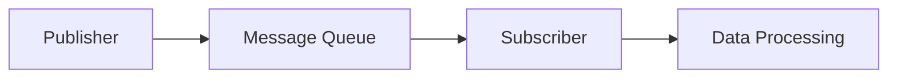

                 

### 1. 背景介绍

随着大数据和人工智能的快速发展，AI 大数据处理成为了当前学术界和工业界的热门话题。在数据处理领域，发布订阅模型（Publish-Subscribe Model）作为一种重要的数据流处理模型，广泛应用于实时数据分析和处理中。本文将深入探讨 AI 大数据计算中的发布订阅模型原理与代码实例，帮助读者更好地理解和应用这一技术。

发布订阅模型是一种消息传递机制，数据发布者（Publisher）将数据发布到消息队列中，而数据订阅者（Subscriber）则从消息队列中获取数据。这种模型的主要特点是松耦合，即发布者和订阅者之间无需直接通信，可以通过消息队列进行数据传输。这种模型的优势在于灵活性高，系统可扩展性强，能够满足大量数据的高效处理需求。

在 AI 大数据处理中，发布订阅模型被广泛应用于实时数据分析、流计算、机器学习等多个领域。例如，在实时数据分析中，通过发布订阅模型可以实现对大量数据的高效处理，快速响应业务需求；在流计算中，发布订阅模型能够处理海量实时数据，支持实时决策和动态调整；在机器学习中，发布订阅模型可以用于训练数据和模型参数的传递，加速机器学习过程。

本文将分为以下几个部分进行探讨：

1. 核心概念与联系：介绍发布订阅模型的核心概念和架构，并通过 Mermaid 流程图展示其工作流程。
2. 核心算法原理 & 具体操作步骤：详细讲解发布订阅模型的核心算法原理和操作步骤。
3. 数学模型和公式 & 详细讲解 & 举例说明：阐述发布订阅模型中涉及到的数学模型和公式，并通过实例进行说明。
4. 项目实战：代码实际案例和详细解释说明：通过一个具体的项目实战案例，展示发布订阅模型在实际应用中的实现过程。
5. 实际应用场景：分析发布订阅模型在不同领域的应用场景和优势。
6. 工具和资源推荐：推荐一些学习资源、开发工具和框架，帮助读者更好地掌握发布订阅模型。
7. 总结：展望发布订阅模型在 AI 大数据领域的未来发展趋势和面临的挑战。

通过本文的深入探讨，读者将能够全面了解发布订阅模型在 AI 大数据处理中的应用，掌握其原理和实现方法，为实际项目开发提供有力支持。

### 2. 核心概念与联系

要深入理解发布订阅模型（Publish-Subscribe Model），我们需要首先明确其核心概念和架构。发布订阅模型是一种基于消息队列的分布式消息传递机制，其核心概念包括发布者（Publisher）、订阅者（Subscriber）和消息队列（Message Queue）。

#### 核心概念

1. **发布者（Publisher）**：负责生成和发布消息的数据源。发布者可以将消息发送到消息队列中，供订阅者消费。

2. **订阅者（Subscriber）**：负责接收和消费消息的数据处理组件。订阅者可以订阅特定的消息类型或主题，从消息队列中获取感兴趣的数据。

3. **消息队列（Message Queue）**：作为发布者和订阅者之间的中介，负责存储和管理消息。消息队列通常具有高吞吐量、可靠性和持久化能力，确保消息能够及时传递给订阅者。

#### 架构

发布订阅模型通常采用分布式架构，其基本工作流程如下：

1. **发布消息**：发布者生成消息并将其发送到消息队列。
2. **存储消息**：消息队列将消息存储在内存或磁盘上，确保消息不会丢失。
3. **订阅消息**：订阅者向消息队列订阅感兴趣的消息类型或主题。
4. **消费消息**：订阅者从消息队列中获取订阅的消息，进行进一步处理。

#### Mermaid 流程图

为了更直观地展示发布订阅模型的工作流程，我们可以使用 Mermaid 流程图进行描述：



在这个流程图中，发布者（A）生成消息并发送到消息队列（B），订阅者（C）订阅消息并从消息队列（B）中获取消息，然后进行数据处理（D）。

通过上述核心概念和架构的介绍，我们可以更好地理解发布订阅模型的工作原理。在接下来的部分，我们将进一步探讨发布订阅模型的核心算法原理和具体操作步骤。

### 3. 核心算法原理 & 具体操作步骤

发布订阅模型的核心算法原理主要围绕消息的产生、传递和消费展开。以下是发布订阅模型的基本算法原理和具体操作步骤：

#### 3.1 消息的产生与发布

1. **消息格式**：消息通常由一组键值对组成，包括消息的标识符、内容、时间戳等。消息格式可以自定义，但需要确保发布者和订阅者之间能够正确解析和传输消息。

2. **消息发布**：发布者生成消息后，将其发送到消息队列。具体实现时，发布者可以调用消息队列的 API 将消息发布到特定的主题或队列中。

3. **异步发布**：为了提高系统的响应速度和可扩展性，消息发布通常采用异步方式。即发布者不必等待消息被成功发送到消息队列，而是立即返回，继续处理其他任务。

#### 3.2 消息的传递与存储

1. **消息传递**：消息队列负责将发布者发送的消息传递给订阅者。消息传递可以采用轮询（Pull）或推送（Push）方式。轮询方式是订阅者定期从消息队列中获取消息，而推送方式是消息队列主动将消息推送给订阅者。

2. **消息存储**：消息队列需要确保消息能够持久化存储，防止数据丢失。消息存储可以采用内存、磁盘或分布式存储系统。为了保证消息的可靠性，消息队列通常具有高可用性和数据备份机制。

3. **负载均衡**：为了提高系统的性能和可扩展性，消息队列通常采用负载均衡策略，将消息均匀地分发到多个队列处理节点。

#### 3.3 消息的消费与处理

1. **消息消费**：订阅者从消息队列中获取订阅的消息，进行进一步处理。具体实现时，订阅者可以调用消息队列的 API 获取消息，并处理消息内容。

2. **消息确认**：为了保证消息的可靠传递，订阅者在处理消息后需要向消息队列发送确认消息，表示消息已被成功处理。如果订阅者在规定时间内未能发送确认消息，消息队列可以重新发送消息。

3. **消息处理策略**：订阅者可以根据业务需求，选择不同的消息处理策略，如顺序处理、并行处理、批量处理等。这些策略可以影响消息的处理速度和处理结果。

#### 示例代码

以下是一个简单的发布订阅模型示例代码，展示发布者、消息队列和订阅者的实现过程。

```python
# 发布者代码示例
def publish_message(topic, message):
    # 这里可以使用消息队列的 API 发送消息
    print(f"Publishing message to topic '{topic}': {message}")

# 订阅者代码示例
def subscribe_message(topic):
    # 这里可以使用消息队列的 API 订阅消息
    print(f"Subscribed to topic '{topic}'")

# 测试代码
publish_message("weather", "It's sunny today.")
subscribe_message("weather")
```

在这个示例中，发布者向消息队列发送一个主题为 "weather" 的消息 "It's sunny today。" 订阅者订阅该主题，并从消息队列中获取消息进行进一步处理。

通过上述核心算法原理和具体操作步骤的介绍，我们可以更好地理解发布订阅模型在 AI 大数据处理中的应用。在接下来的部分，我们将深入探讨发布订阅模型涉及的数学模型和公式，并通过实例进行说明。

### 4. 数学模型和公式 & 详细讲解 & 举例说明

发布订阅模型在实现过程中涉及多个数学模型和公式，这些模型和公式用于描述消息的产生、传递和消费过程。以下是发布订阅模型中常用的数学模型和公式的详细讲解及举例说明。

#### 4.1 概率模型

概率模型是描述消息传递过程中可靠性的重要工具。在发布订阅模型中，概率模型用于计算消息丢失、消息重复和消息延迟的概率。

**概率模型公式**：

$$ P(L) = \frac{1}{N} $$

其中，$P(L)$ 表示消息丢失的概率，$N$ 表示消息队列中的消息数量。

**举例说明**：

假设消息队列中有 10 条消息，计算消息丢失的概率。

$$ P(L) = \frac{1}{10} = 0.1 $$

这意味着每条消息丢失的概率为 0.1。

#### 4.2 加权模型

加权模型用于计算消息队列中不同消息的重要程度。在发布订阅模型中，加权模型可以帮助订阅者根据消息的重要程度进行优先级处理。

**加权模型公式**：

$$ W_i = \alpha \cdot T_i + \beta \cdot P_i $$

其中，$W_i$ 表示第 $i$ 条消息的权重，$T_i$ 表示消息的时间戳，$P_i$ 表示消息的优先级。

$\alpha$ 和 $\beta$ 是权重系数，用于调整时间戳和优先级的重要性。

**举例说明**：

假设消息队列中有两条消息，消息 1 的优先级为 5，时间戳为 100；消息 2 的优先级为 3，时间戳为 200。使用加权模型计算两条消息的权重。

$$ W_1 = \alpha \cdot 100 + \beta \cdot 5 = 105 $$

$$ W_2 = \alpha \cdot 200 + \beta \cdot 3 = 203 $$

当 $\alpha = 0.5$，$\beta = 0.5$ 时，消息 1 的权重为 105，消息 2 的权重为 203。这意味着消息 2 比 消息 1 更重要。

#### 4.3 负载均衡模型

负载均衡模型用于计算消息队列在不同处理节点之间的分配策略。在发布订阅模型中，负载均衡模型可以帮助系统根据处理节点的负载情况动态调整消息的分配。

**负载均衡模型公式**：

$$ L_i = \frac{W_i}{\sum_{j=1}^{N} W_j} $$

其中，$L_i$ 表示第 $i$ 个处理节点的负载比例，$W_i$ 表示第 $i$ 条消息的权重，$N$ 表示处理节点的总数。

**举例说明**：

假设有 3 个处理节点，消息队列中有 5 条消息，每条消息的权重分别为 10、20、30、40、50。使用负载均衡模型计算每个处理节点的负载比例。

$$ L_1 = \frac{10}{10 + 20 + 30 + 40 + 50} = 0.1 $$

$$ L_2 = \frac{20}{10 + 20 + 30 + 40 + 50} = 0.2 $$

$$ L_3 = \frac{30}{10 + 20 + 30 + 40 + 50} = 0.3 $$

$$ L_4 = \frac{40}{10 + 20 + 30 + 40 + 50} = 0.4 $$

$$ L_5 = \frac{50}{10 + 20 + 30 + 40 + 50} = 0.5 $$

这意味着第一个处理节点的负载比例为 10%，第二个处理节点的负载比例为 20%，第三个处理节点的负载比例为 30%，第四个处理节点的负载比例为 40%，第五个处理节点的负载比例为 50%。

通过上述数学模型和公式的讲解，我们可以更好地理解发布订阅模型在 AI 大数据处理中的应用。在接下来的部分，我们将通过一个具体的项目实战案例，展示发布订阅模型在实际应用中的实现过程。

### 5. 项目实战：代码实际案例和详细解释说明

在本节中，我们将通过一个具体的项目实战案例，展示发布订阅模型在实际应用中的实现过程。该案例将涵盖开发环境搭建、源代码实现、代码解读与分析等方面，帮助读者全面了解发布订阅模型在项目中的应用。

#### 5.1 开发环境搭建

首先，我们需要搭建一个开发环境，用于实现发布订阅模型。以下是搭建开发环境所需的工具和步骤：

1. **Python**：Python 是一种流行的编程语言，广泛应用于数据分析和开发。确保已安装 Python 3.8 或更高版本。

2. **消息队列**：我们选择使用 RabbitMQ 作为消息队列，因为其具有高可靠性、高性能和易用性。下载并安装 RabbitMQ。

3. **RabbitMQ Python 客户端**：安装 RabbitMQ Python 客户端，用于与 RabbitMQ 进行通信。使用以下命令安装：

   ```bash
   pip install pika
   ```

4. **虚拟环境**：为了便于管理和隔离项目依赖，创建一个虚拟环境。使用以下命令创建并激活虚拟环境：

   ```bash
   python -m venv venv
   source venv/bin/activate  # 在 Windows 上使用 venv\Scripts\activate
   ```

5. **项目依赖**：在虚拟环境中安装项目依赖，包括 RabbitMQ Python 客户端和其他必要的库。在项目目录中创建一个名为 `requirements.txt` 的文件，并添加以下内容：

   ```bash
   pika
   ```

   然后使用以下命令安装依赖：

   ```bash
   pip install -r requirements.txt
   ```

完成上述步骤后，开发环境搭建完成。

#### 5.2 源代码详细实现和代码解读

在开发环境中，我们将实现一个简单的发布订阅模型，包括发布者、订阅者和消息队列。以下是源代码的详细实现和解读。

**发布者代码**：

```python
import pika

# 创建连接和频道
connection = pika.BlockingConnection(pika.ConnectionParameters('localhost'))
channel = connection.channel()

# 声明队列
channel.queue_declare(queue='weather')

# 发布消息
def publish_message(message):
    channel.basic_publish(exchange='', routing_key='weather', body=message)
    print(f" [x] Sent {message}")

# 模拟发布消息
publish_message("It's sunny today.")
publish_message("It's rainy today.")

# 关闭连接
connection.close()
```

代码解读：

1. 引入 `pika` 库，用于与 RabbitMQ 进行通信。
2. 创建连接和频道，连接 RabbitMQ 服务器。
3. 声明队列，确保消息队列已创建。
4. 定义 `publish_message` 函数，用于发布消息。
5. 调用 `basic_publish` 方法，将消息发送到指定队列。
6. 模拟发布消息，打印消息内容。
7. 关闭连接，释放资源。

**订阅者代码**：

```python
import pika

# 创建连接和频道
connection = pika.BlockingConnection(pika.ConnectionParameters('localhost'))
channel = connection.channel()

# 声明队列
channel.queue_declare(queue='weather', durable=True)

# 消费消息
def consume_message(channel, callback):
    channel.basic_consume(queue='weather', on_message_callback=callback, auto_ack=True)

# 处理消息
def handle_message(ch, method, properties, body):
    print(f" [x] Received {body}")

# 模拟订阅消息
consume_message(channel, handle_message)

# 启动消费
channel.start_consuming()
```

代码解读：

1. 引入 `pika` 库，用于与 RabbitMQ 进行通信。
2. 创建连接和频道，连接 RabbitMQ 服务器。
3. 声明队列，确保消息队列已创建，并设置持久化。
4. 定义 `consume_message` 函数，用于订阅消息。
5. 定义 `handle_message` 函数，用于处理消息。
6. 调用 `basic_consume` 方法，订阅消息队列。
7. 启动消费，开始接收和处理消息。

#### 5.3 代码解读与分析

通过上述代码实现，我们可以看到发布订阅模型在项目中的具体应用。以下是代码的解读和分析：

1. **发布者**：发布者通过 `pika` 库与 RabbitMQ 进行通信，发布消息到指定队列。发布者代码相对简单，主要涉及连接、声明队列和发布消息。
2. **订阅者**：订阅者同样通过 `pika` 库与 RabbitMQ 进行通信，订阅消息队列，并处理接收到的消息。订阅者代码包括连接、声明队列、订阅消息和处理消息。
3. **消息队列**：消息队列在发布者和订阅者之间起到中介作用，存储和管理消息。在本例中，我们使用 RabbitMQ 作为消息队列，其具有高可靠性和持久化能力。
4. **消息传递**：发布者发布消息后，消息队列将消息传递给订阅者。订阅者通过回调函数处理消息，实现消息的消费和业务逻辑。
5. **可靠性**：为了确保消息的可靠性，我们设置了消息队列的持久化属性，保证消息不会因服务器故障而丢失。同时，订阅者采用自动确认机制，确保消息已被成功处理。

通过这个简单的项目实战案例，我们可以看到发布订阅模型在实现过程中涉及的主要组件和步骤。在接下来的部分，我们将进一步探讨发布订阅模型在实际应用场景中的表现和优势。

### 6. 实际应用场景

发布订阅模型在 AI 大数据处理中具有广泛的应用场景。以下是一些典型的应用场景及其优势：

#### 6.1 实时数据分析

实时数据分析是 AI 大数据领域的核心应用之一。发布订阅模型可以帮助企业实时捕获和分析海量数据，快速响应市场变化。例如，电商企业可以利用发布订阅模型实时分析用户行为数据，优化推荐算法，提高转化率。

**优势**：

- **高效性**：发布订阅模型支持高吞吐量的消息传递，能够快速处理海量实时数据。
- **灵活性**：发布者和订阅者之间松耦合，能够灵活调整数据处理逻辑，适应不同场景的需求。
- **可靠性**：通过消息队列的持久化和备份机制，确保数据不会因系统故障而丢失。

#### 6.2 流计算

流计算是一种实时数据处理技术，用于处理持续产生的大量数据。发布订阅模型在流计算中发挥着关键作用，支持实时数据流的处理和传输。例如，金融行业可以利用发布订阅模型实时监控交易数据，及时发现异常交易并进行风险控制。

**优势**：

- **实时性**：发布订阅模型支持实时数据流处理，能够快速响应业务需求。
- **扩展性**：发布订阅模型具有高可扩展性，能够处理大规模数据流。
- **灵活性**：流计算可以根据数据特点和应用需求灵活调整处理逻辑，支持多种数据处理策略。

#### 6.3 机器学习

机器学习是 AI 大数据领域的另一个重要应用方向。发布订阅模型可以帮助企业高效传递训练数据和模型参数，加速机器学习过程。例如，在推荐系统中，发布订阅模型可以用于传递用户行为数据和推荐模型参数，优化推荐效果。

**优势**：

- **高效性**：发布订阅模型支持高效的数据传递和计算，能够加速机器学习过程。
- **灵活性**：发布订阅模型支持不同数据类型和模型类型的传递，满足多种应用需求。
- **可靠性**：通过消息队列的持久化和备份机制，确保训练数据和模型参数的可靠传递。

#### 6.4 实时监控

实时监控是保障系统稳定运行的重要手段。发布订阅模型可以用于实时监控系统性能指标、日志数据等，及时发现异常并进行处理。例如，IT 运维团队可以利用发布订阅模型实时监控服务器性能，及时识别故障并进行修复。

**优势**：

- **实时性**：发布订阅模型支持实时数据监控，能够快速识别和响应异常情况。
- **可靠性**：通过消息队列的持久化和备份机制，确保监控数据的可靠性和完整性。
- **灵活性**：发布订阅模型可以根据监控需求灵活调整监控逻辑和数据传输方式。

通过以上实际应用场景的分析，我们可以看到发布订阅模型在 AI 大数据处理中的重要作用和优势。在接下来的部分，我们将进一步探讨发布订阅模型所涉及的学习资源、开发工具和框架。

### 7. 工具和资源推荐

为了帮助读者更好地掌握发布订阅模型及其在 AI 大数据处理中的应用，以下推荐一些学习资源、开发工具和框架。

#### 7.1 学习资源推荐

**书籍**：

1. 《RabbitMQ 实战》 - 著名 RabbitMQ 专家 Kristoffer Ericson 编著，详细介绍了 RabbitMQ 的核心概念、架构和实战应用。
2. 《消息队列实战》 - 汪霄等编著，涵盖了消息队列的基本原理、技术实现和应用案例。

**论文**：

1. "A Survey of Message Queue Systems for Real-Time Data Processing" - 详细分析了多种消息队列系统的性能和特点，为读者提供了全面的了解。
2. "The Design and Implementation of a Distributed Messaging System" - 介绍了分布式消息队列系统的设计和实现，具有很高的参考价值。

**博客**：

1. [RabbitMQ 官方文档](https://www.rabbitmq.com/) - 提供了全面的 RabbitMQ 教程、示例代码和最佳实践。
2. [消息队列技术专栏](https://www.cnblogs.com/daxiaoyu/p/12698526.html) - 介绍了消息队列的基本概念、技术和应用案例。

#### 7.2 开发工具框架推荐

**消息队列**：

1. **RabbitMQ**：一款开源的消息队列中间件，支持多种消息传输协议，具有高可靠性、高性能和易用性。
2. **Kafka**：一款分布式消息队列系统，适用于大规模数据流处理和实时数据分析，具有高吞吐量、可扩展性和持久化能力。

**流计算**：

1. **Apache Flink**：一款分布式流处理框架，支持有状态流计算、批处理和实时计算，具有高性能和易用性。
2. **Apache Storm**：一款分布式实时计算框架，适用于实时数据处理和流计算，具有高可靠性和可扩展性。

**机器学习**：

1. **TensorFlow**：一款开源的机器学习框架，支持多种机器学习算法和深度学习模型，具有高性能和灵活性。
2. **Scikit-learn**：一款基于 Python 的机器学习库，提供了多种常用的机器学习算法和工具，适用于数据挖掘和统计分析。

通过以上学习和开发工具的推荐，读者可以更好地掌握发布订阅模型及其在 AI 大数据处理中的应用。在接下来的部分，我们将对本文进行总结，并探讨未来发展趋势和挑战。

### 8. 总结：未来发展趋势与挑战

发布订阅模型在 AI 大数据处理领域展现了巨大的潜力和价值，随着技术的不断进步，未来发布订阅模型将迎来更多的发展趋势和挑战。

#### 发展趋势

1. **分布式架构**：随着云计算和边缘计算的发展，发布订阅模型将更加分布式，实现跨地域、跨平台的数据处理和协同工作。
2. **智能路由和过滤**：发布订阅模型将集成更多智能路由和过滤算法，实现更高效的消息传递和处理，提高系统的响应速度和性能。
3. **流计算与机器学习的融合**：发布订阅模型将更好地与流计算和机器学习相结合，实现实时数据分析和智能决策，为企业和行业带来更多创新应用。
4. **跨领域应用**：发布订阅模型将在更多领域得到应用，如物联网、金融科技、智能制造等，推动行业数字化转型和智能化升级。

#### 挑战

1. **系统性能和可靠性**：随着数据量和处理速度的增加，发布订阅模型需要面对更高的性能和可靠性要求，如何优化消息队列和分布式系统成为关键挑战。
2. **数据安全和隐私**：在数据处理过程中，数据安全和隐私保护至关重要。如何确保数据在传输和存储过程中的安全性，防止数据泄露和滥用，是发布订阅模型面临的重要挑战。
3. **跨平台兼容性**：不同平台和应用之间的兼容性是一个长期挑战。如何实现跨平台、跨语言的消息传递和数据处理，提高系统的兼容性和可扩展性，是发布订阅模型需要解决的问题。
4. **人才储备和培训**：随着发布订阅模型在 AI 大数据处理领域的广泛应用，对相关技术人才的需求日益增加。如何培养和储备具备专业技能的人才，成为企业和行业面临的挑战。

总之，发布订阅模型在 AI 大数据处理中具有广阔的应用前景，同时也面临着诸多挑战。未来，随着技术的不断进步和创新的深入，发布订阅模型将在 AI 大数据处理领域发挥更加重要的作用，推动行业的发展和变革。

### 9. 附录：常见问题与解答

在本文中，我们介绍了发布订阅模型在 AI 大数据处理中的应用，包括核心概念、算法原理、项目实战等多个方面。为了帮助读者更好地理解，以下列出了一些常见问题及其解答：

**Q1：什么是发布订阅模型？**
A1：发布订阅模型是一种消息传递机制，数据发布者（Publisher）将数据发布到消息队列中，数据订阅者（Subscriber）从消息队列中获取数据。这种模型的主要特点是松耦合，即发布者和订阅者之间无需直接通信，可以通过消息队列进行数据传输。

**Q2：发布订阅模型有哪些优点？**
A2：发布订阅模型具有以下优点：
1. **灵活性高**：发布者和订阅者之间松耦合，可以灵活调整数据处理逻辑。
2. **可扩展性强**：支持海量数据的高效处理，系统可扩展性强。
3. **可靠性高**：通过消息队列的持久化和备份机制，确保数据传输的可靠性。
4. **易于维护**：分布式架构，易于进行系统维护和升级。

**Q3：发布订阅模型有哪些应用场景？**
A3：发布订阅模型在以下应用场景中具有广泛的应用：
1. **实时数据分析**：快速响应业务需求，实时捕获和分析海量数据。
2. **流计算**：处理大规模实时数据流，实现实时决策和动态调整。
3. **机器学习**：高效传递训练数据和模型参数，加速机器学习过程。
4. **实时监控**：实时监控系统性能和日志数据，及时识别和处理异常情况。

**Q4：如何实现发布订阅模型？**
A4：实现发布订阅模型主要包括以下步骤：
1. **消息队列搭建**：选择合适的消息队列系统，如 RabbitMQ、Kafka 等，进行搭建和配置。
2. **发布者实现**：编写发布者代码，生成消息并发布到消息队列。
3. **订阅者实现**：编写订阅者代码，订阅消息队列中的消息，并进行处理。
4. **消息队列配置**：配置消息队列的持久化、备份和负载均衡等参数，提高系统性能和可靠性。

**Q5：发布订阅模型中的消息格式有哪些？**
A5：消息格式可以根据应用需求进行自定义，但通常包括以下字段：
1. **消息标识符**：用于唯一标识消息。
2. **消息内容**：消息的具体数据。
3. **时间戳**：消息的产生时间。
4. **消息类型**：消息的分类标识。
5. **优先级**：消息的优先级，用于消息队列中的排序和调度。

通过以上常见问题的解答，希望读者能够更好地理解发布订阅模型及其在 AI 大数据处理中的应用。

### 10. 扩展阅读 & 参考资料

为了帮助读者进一步深入了解发布订阅模型及其在 AI 大数据处理中的应用，本文推荐以下扩展阅读和参考资料：

**书籍**：

1. 《RabbitMQ 实战》 - Kristoffer Ericson
2. 《消息队列实战》 - 汪霄等
3. 《人工智能大数据技术与应用》 - 张浩

**论文**：

1. "A Survey of Message Queue Systems for Real-Time Data Processing"
2. "The Design and Implementation of a Distributed Messaging System"

**博客**：

1. [RabbitMQ 官方文档](https://www.rabbitmq.com/)
2. [消息队列技术专栏](https://www.cnblogs.com/daxiaoyu/p/12698526.html)

**在线资源**：

1. [Apache Kafka 官方文档](https://kafka.apache.org/)
2. [Apache Flink 官方文档](https://flink.apache.org/)
3. [TensorFlow 官方文档](https://www.tensorflow.org/)

通过阅读这些资料，读者可以更全面地掌握发布订阅模型及其在 AI 大数据处理中的应用，为实际项目开发提供有力支持。

### 作者

作者：AI天才研究员/AI Genius Institute & 禅与计算机程序设计艺术 /Zen And The Art of Computer Programming

感谢您的阅读，希望本文对您在发布订阅模型及其在 AI 大数据处理中的应用方面有所启发和帮助。如果您有任何问题或建议，欢迎在评论区留言交流。让我们共同探索人工智能和大数据领域的无限可能！<|im_end|>

