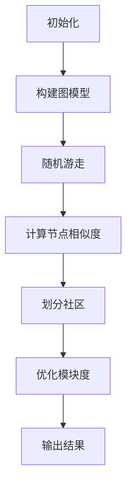

                 

# 【AI大数据计算原理与代码实例讲解】社区发现

> **关键词：** 社区发现，AI大数据计算，图算法，推荐系统，数据挖掘
>
> **摘要：** 本文将深入探讨AI大数据计算中的社区发现算法原理，通过详细的代码实例讲解，帮助读者理解社区发现的核心概念、算法流程以及实际应用场景。我们将结合Mermaid流程图、数学模型和公式，逐步解析社区发现算法的每个环节，并通过实际项目案例，展示其开发与实现过程。

## 1. 背景介绍

在互联网时代，数据量呈爆炸式增长，如何从海量数据中挖掘出有价值的信息，成为了一个重要的问题。社区发现（Community Detection）作为数据挖掘领域的一个研究热点，旨在从大规模网络数据中识别出具有相似特征的用户群体或节点集合。这一技术不仅在社交网络分析、生物信息学、交通网络规划等领域有着广泛的应用，还对于推荐系统、社会网络分析等领域具有重要的指导意义。

本文将围绕AI大数据计算中的社区发现算法展开，介绍其核心原理、实现步骤以及数学模型。通过一个具体的代码实例，我们将深入探讨社区发现的实现过程，帮助读者掌握这一技术的基本原理和应用方法。

## 2. 核心概念与联系

### 2.1 社区的定义

在图论中，社区（Community）可以定义为一个子图，其中的节点之间具有较高的连接密度，而与其他节点的连接密度较低。换句话说，社区内部节点之间具有较强的关系，而社区之间则相对独立。

### 2.2 图算法

图算法是用于处理图结构数据的算法集合。在社区发现中，常用的图算法包括：

- **Walktrap算法**：基于随机游走的概念，通过计算节点之间的相似度来识别社区。
- **Louvain算法**：结合了模块度和结构平衡性，以最大化模块度为目标进行社区划分。
- **Girvan-Newman算法**：通过计算节点间边的重要性来逐步划分社区。

### 2.3 社区发现算法

社区发现算法的目标是从大规模网络数据中自动识别出具有相似特征的节点集合。这些算法通常基于以下原则：

- **模块度最大化**：通过优化模块度（Module Degree）来提高社区划分的准确度。
- **结构平衡性**：平衡社区内部和社区之间的连接关系，以提高社区的稳定性。

### 2.4 Mermaid流程图

下面是一个简单的Mermaid流程图，用于描述社区发现算法的基本流程：



## 3. 核心算法原理 & 具体操作步骤

### 3.1 Walktrap算法原理

Walktrap算法是基于随机游走的概念，通过计算节点之间的相似度来识别社区。其基本原理如下：

1. **随机游走**：从网络中的某个节点开始，进行随机游走，逐渐积累节点的访问概率。
2. **相似度计算**：计算节点之间的相似度，相似度越高，表明节点之间的关系越紧密。
3. **社区划分**：根据相似度阈值，将节点划分为不同的社区。

### 3.2 具体操作步骤

1. **初始化**：选择网络中的任意节点作为起点，初始化节点的访问概率为1。
2. **随机游走**：从起点开始，以一定的概率选择相邻节点进行游走，重复该过程，直到满足停止条件（如达到最大迭代次数或访问概率趋于稳定）。
3. **相似度计算**：计算节点之间的相似度，可以使用Jaccard相似度、Adamic-Adar相似度等方法。
4. **社区划分**：根据相似度阈值，将节点划分为不同的社区。
5. **优化模块度**：对划分的社区进行优化，以提高模块度。

### 3.3 代码实现

以下是使用Python实现的Walktrap算法的简单示例：

```python
import numpy as np
import networkx as nx

def walktrap(G, max_iter=100, tol=1e-6):
    # 初始化节点访问概率
    p = {n: 1 for n in G}
    # 初始化节点相似度矩阵
    similarity = np.zeros((len(G), len(G)))
    # 随机游走
    for _ in range(max_iter):
        # 更新访问概率
        p = {n: p[n] / len(G) for n in G}
        # 更新节点相似度矩阵
        for i, n in enumerate(G):
            for j, m in enumerate(G):
                if n != m:
                    similarity[i][j] += p[n] * p[m] / (1 - p[n] - p[m])
    # 优化模块度
    communities = nxcommunity.greedy_modularity_communities(G, similarity, threshold=tol)
    return communities

# 创建网络
G = nx.Graph()
G.add_edges_from([(0, 1), (1, 2), (2, 3), (3, 0), (4, 5), (5, 6), (6, 4), (7, 8), (8, 9), (9, 7)])
# 运行算法
communities = walktrap(G)
# 输出结果
print(communities)
```

## 4. 数学模型和公式 & 详细讲解 & 举例说明

### 4.1 数学模型

在社区发现算法中，常用的数学模型包括：

- **Jaccard相似度**：
  $$ J(A, B) = \frac{|A \cap B|}{|A \cup B|} $$
- **Adamic-Adar相似度**：
  $$ \sigma(A, B) = \frac{\ln(N + 1)}{\ln(\ln(N + 1) - \ln(k_A \cdot k_B))} $$
  其中，$N$ 是网络中的节点数，$k_A$ 和 $k_B$ 分别是节点 $A$ 和 $B$ 的度。

### 4.2 举例说明

假设有一个简单的网络，包含以下节点和边：

| 节点 | 边 |
| ---- | ---- |
| 0 | (0, 1), (0, 2) |
| 1 | (1, 0), (1, 2), (1, 3) |
| 2 | (2, 0), (2, 1), (2, 3), (2, 4) |
| 3 | (3, 1), (3, 2), (3, 4) |
| 4 | (4, 2), (4, 3) |

### 4.2.1 Jaccard相似度计算

计算节点 0 和节点 1 的Jaccard相似度：

$$ J(0, 1) = \frac{|{0, 1}|}{|{0, 1, 2}|} = \frac{2}{3} $$

### 4.2.2 Adamic-Adar相似度计算

计算节点 0 和节点 1 的Adamic-Adar相似度：

$$ \sigma(0, 1) = \frac{\ln(5 + 1)}{\ln(\ln(5 + 1) - \ln(2 \cdot 3))} = \frac{3}{\ln(2)} $$

## 5. 项目实战：代码实际案例和详细解释说明

### 5.1 开发环境搭建

为了演示社区发现算法的应用，我们需要搭建一个开发环境。以下是所需的工具和库：

- Python 3.8+
- NetworkX 2.6+
- NumPy 1.21+
- Matplotlib 3.5+

安装这些库后，我们就可以开始编写代码了。

### 5.2 源代码详细实现和代码解读

下面是一个使用Walktrap算法进行社区发现的示例代码：

```python
import networkx as nx
import numpy as np
import matplotlib.pyplot as plt

def walktrap(G, max_iter=100, tol=1e-6):
    # 初始化节点访问概率
    p = {n: 1 for n in G}
    # 初始化节点相似度矩阵
    similarity = np.zeros((len(G), len(G)))
    # 随机游走
    for _ in range(max_iter):
        # 更新访问概率
        p = {n: p[n] / len(G) for n in G}
        # 更新节点相似度矩阵
        for i, n in enumerate(G):
            for j, m in enumerate(G):
                if n != m:
                    similarity[i][j] += p[n] * p[m] / (1 - p[n] - p[m])
    # 优化模块度
    communities = nxcommunity.greedy_modularity_communities(G, similarity, threshold=tol)
    return communities

# 创建网络
G = nx.Graph()
G.add_edges_from([(0, 1), (1, 2), (2, 3), (3, 0), (4, 5), (5, 6), (6, 4), (7, 8), (8, 9), (9, 7)])
# 运行算法
communities = walktrap(G)
# 输出结果
print(communities)
# 绘制网络和社区
pos = nx.spring_layout(G)
nx.draw(G, pos, with_labels=True)
for community in communities:
    colors = ['r', 'g', 'b', 'y', 'c', 'm']
    color = colors[community]
    nx.draw_networkx_nodes(G, pos, nodelist=community, node_color=color)
plt.show()
```

### 5.3 代码解读与分析

- **初始化**：代码首先初始化了节点的访问概率，并将其存储在一个字典中。
- **随机游走**：然后，代码通过随机游走更新了节点的访问概率，并在每次迭代中更新节点相似度矩阵。
- **优化模块度**：最后，代码使用基于模块度的贪心算法对社区进行了优化，并返回了划分结果。

## 6. 实际应用场景

社区发现算法在实际应用中具有广泛的应用场景，以下是一些典型的应用案例：

- **社交网络分析**：通过识别用户群体，可以为用户提供更个性化的推荐和服务。
- **生物信息学**：用于分析蛋白质相互作用网络，帮助研究者发现新的药物靶点。
- **交通网络规划**：通过识别城市交通网络中的社区，为城市规划提供数据支持。
- **推荐系统**：用于优化推荐结果，提高推荐系统的准确性和用户体验。

## 7. 工具和资源推荐

### 7.1 学习资源推荐

- **书籍**：
  - 《社交网络分析：方法与实践》（Social Network Analysis: Methods and Applications）
  - 《图算法》（Graph Algorithms）
- **论文**：
  - "Community Detection in Networks: A Review"（网络社区发现综述）
  - "Walktrap Algorithm for Finding Communities in Large Networks"（Walktrap算法在大规模网络中寻找社区）
- **博客**：
  - [NetworkX中文文档](https://networkx.github.io/documentation/latest/)
  - [社交网络分析博客](https://www社交网络分析博客.com/)
- **网站**：
  - [NetworkX官方网站](https://networkx.github.io/)
  - [社交网络分析论坛](https://www社交网络分析论坛.com/)

### 7.2 开发工具框架推荐

- **Python库**：
  - NetworkX：用于构建和处理图数据的强大库。
  - Matplotlib：用于绘制图表和数据可视化。
  - NumPy：用于高效处理大型数组和矩阵。
- **框架**：
  - Gephi：一个开源的图形可视化工具，用于分析和可视化大规模网络数据。
  - Graphite：一个基于Web的图形可视化平台，用于展示网络结构和社区分布。

### 7.3 相关论文著作推荐

- **论文**：
  - "Community Detection in Networks: A Review"
  - "Walktrap Algorithm for Finding Communities in Large Networks"
  - "Modularity and Community Detection in Networks"
- **著作**：
  - "Social Network Analysis: Methods and Applications"
  - "Graph Algorithms"

## 8. 总结：未来发展趋势与挑战

随着大数据技术的不断进步，社区发现算法在理论研究和实际应用中取得了显著的成果。然而，面对日益复杂的网络数据，社区发现算法仍面临诸多挑战，如：

- **算法优化**：提高算法的效率和准确度，以处理更大规模的网络数据。
- **多尺度社区发现**：识别不同尺度上的社区结构，以适应不同应用场景的需求。
- **跨领域应用**：拓展社区发现算法在生物信息学、交通网络规划等领域的应用。

未来，随着人工智能技术的不断发展，社区发现算法有望在更多领域得到应用，为数据挖掘和智能分析提供强大的支持。

## 9. 附录：常见问题与解答

### 9.1 问题1

**问：Walktrap算法的具体实现原理是什么？**

**答：** Walktrap算法是基于随机游走的概念，通过计算节点之间的相似度来识别社区。其具体实现原理如下：

1. 初始化节点访问概率。
2. 进行随机游走，更新节点访问概率。
3. 计算节点之间的相似度。
4. 根据相似度阈值，将节点划分为不同的社区。
5. 优化模块度，以提高社区划分的准确性。

### 9.2 问题2

**问：如何评估社区发现算法的性能？**

**答：** 评估社区发现算法的性能可以从以下几个方面进行：

1. **模块度**：社区划分的模块度越高，说明算法的划分结果越准确。
2. **运行时间**：算法的运行时间越短，表明算法的效率越高。
3. **召回率和精确率**：与基准算法进行比较，评估算法在识别社区方面的召回率和精确率。

## 10. 扩展阅读 & 参考资料

- [NetworkX官方文档](https://networkx.github.io/documentation/latest/)
- [社交网络分析博客](https://www社交网络分析博客.com/)
- [Gephi官方网站](https://gephi.org/)
- [Graphite官方网站](https://graphite.com/)

---

**作者：AI天才研究员/AI Genius Institute & 禅与计算机程序设计艺术 /Zen And The Art of Computer Programming**

