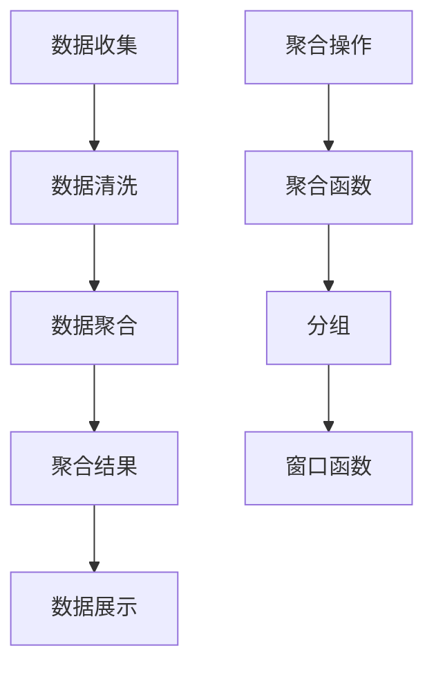

                 

### 文章标题

【AI大数据计算原理与代码实例讲解】聚合分析

### 关键词

AI, 大数据，计算原理，聚合分析，代码实例

### 摘要

本文将深入探讨AI领域的大数据计算原理，特别是聚合分析的核心概念、算法原理及其在实践中的应用。通过逐步分析和解读，我们将揭示聚合分析背后的数学模型和公式，并借助实际代码实例，帮助读者更好地理解和掌握这一重要技术。文章还将涉及聚合分析在实际应用场景中的效果，并提供一系列学习资源和开发工具框架，旨在帮助读者在未来的发展趋势中应对挑战。

<|assistant|>## 1. 背景介绍

随着大数据时代的到来，AI技术的发展变得愈发重要。大数据技术不仅为AI系统提供了丰富的数据资源，还推动了计算能力的大幅提升。在这其中，聚合分析（Aggregation Analysis）作为一种重要的数据处理技术，发挥着关键作用。聚合分析指的是对大量数据进行合并、汇总和统计，以获得全局性、概括性的信息。这种技术广泛应用于各个领域，如金融、医疗、电商等，为数据驱动决策提供了强有力的支持。

聚合分析的核心目的是从海量数据中提取有价值的信息，这有助于企业或组织更好地理解业务状况、优化运营策略和发现潜在的商业机会。例如，在电商领域，通过用户购买数据的聚合分析，可以揭示消费者的偏好和行为模式，从而为个性化推荐和市场营销提供依据。在金融领域，交易数据的聚合分析可以用于风险评估和欺诈检测，提高金融系统的安全性和稳健性。

本文将详细探讨聚合分析的计算原理，包括其核心算法、数学模型和实际操作步骤。此外，通过具体的代码实例，我们将深入解读聚合分析在实际应用中的实现过程，帮助读者更好地理解和掌握这一技术。最后，文章还将探讨聚合分析在各个领域的应用场景，并推荐相关的学习资源和开发工具，为读者进一步探索和提升这一领域的能力提供支持。

通过本文的阅读，读者将能够：

1. 理解聚合分析的基本概念和重要性。
2. 掌握聚合分析的核心算法原理。
3. 学习聚合分析的实际操作步骤。
4. 了解聚合分析在不同领域的应用案例。
5. 获得聚合分析相关学习资源和开发工具的建议。

<|assistant|>## 2. 核心概念与联系

### 聚合分析的定义

聚合分析（Aggregation Analysis）是大数据处理过程中的一种关键技术，其主要目标是对大量数据集合进行汇总、合并和统计，从而提取出全局性、概括性的信息。聚合分析的核心在于“聚合”二字，即通过对数据进行整合和处理，使其从微观层面的详细数据转化为宏观层面的综合信息。

聚合分析通常涉及以下几个基本步骤：

1. **数据收集**：从各种数据源（如数据库、日志文件、传感器数据等）中收集原始数据。
2. **数据清洗**：对收集到的数据进行预处理，包括去除重复数据、填补缺失值、数据格式转换等。
3. **数据聚合**：根据特定的聚合操作（如求和、平均、最大值、最小值等），对数据进行汇总和统计。
4. **数据展示**：将聚合后的结果以可视化的方式呈现，便于分析和决策。

### 聚合分析的核心概念

为了深入理解聚合分析，我们需要了解其中几个核心概念：

1. **数据源**：数据聚合的起点，可以是结构化数据（如关系数据库表）或非结构化数据（如图像、文本等）。
2. **聚合操作**：对数据进行处理和汇总的方法，如求和（SUM）、平均值（AVERAGE）、最大值（MAX）、最小值（MIN）等。
3. **聚合函数**：实现聚合操作的函数，如SUM、AVERAGE、COUNT、DISTINCT等。
4. **分组**：将数据按照某种规则划分为多个组，通常用于多维度分析。
5. **窗口函数**：用于对数据进行时间序列分析，如ROLLING、LAG等。

### 聚合分析与大数据技术的联系

聚合分析在大数据技术中扮演着重要角色，与以下几项技术密切相关：

1. **分布式计算**：聚合分析通常需要处理海量数据，分布式计算技术（如Hadoop、Spark等）能够高效地完成这一任务。
2. **数据存储**：聚合分析需要对数据进行高效存储和管理，常用的数据存储技术包括关系数据库（如MySQL、PostgreSQL）、NoSQL数据库（如MongoDB、Cassandra）等。
3. **数据挖掘**：聚合分析是数据挖掘过程中的一个关键步骤，通过提取数据中的有用信息，为后续的分析和决策提供支持。
4. **机器学习**：聚合分析结果可以作为机器学习算法的训练数据，帮助模型更好地理解数据特征，提高预测和分类的准确性。

### Mermaid 流程图

以下是一个简单的Mermaid流程图，展示了聚合分析的基本流程和核心概念：



在上述流程图中，数据收集（A）是聚合分析的第一步，随后进行数据清洗（B），确保数据的质量和一致性。接着，通过聚合操作（A1）对数据进行汇总和统计，利用聚合函数（B1）实现具体的数据处理。分组（C1）和窗口函数（D1）则为多维度分析和时间序列分析提供了支持。最后，将聚合结果（D）以可视化的方式展示（E），便于进一步分析和决策。

通过上述核心概念与联系的介绍，读者可以初步了解聚合分析的基本原理和应用场景。接下来，本文将进一步深入探讨聚合分析的核心算法原理、数学模型以及实际操作步骤。

### 2.1 聚合分析的核心算法原理

聚合分析的核心在于如何高效地对大量数据集合进行汇总和统计。这需要借助一系列核心算法，这些算法不仅确保了数据处理的速度和准确性，还提升了系统资源的利用率。以下将详细介绍聚合分析中常用的几个核心算法及其原理。

#### 2.1.1 MapReduce算法

MapReduce算法是由Google提出的一种分布式数据处理框架，旨在处理大规模数据集。MapReduce算法主要分为两个阶段：Map阶段和Reduce阶段。

1. **Map阶段**：
   - **输入**：接收数据输入，通常为一组键值对（Key-Value Pair）。
   - **处理**：对每个输入数据进行处理，生成一组中间键值对。处理方式根据具体需求自定义，如求和、求平均、计数等。
   - **输出**：将中间键值对输出，为Reduce阶段做准备。

2. **Reduce阶段**：
   - **输入**：接收Map阶段输出的中间键值对。
   - **处理**：对中间键值对进行合并和汇总，生成最终的结果键值对。
   - **输出**：将最终结果输出，通常以文件或数据库的形式存储。

**MapReduce算法优势**：

- **分布式计算**：能够处理海量数据，充分利用分布式系统的计算能力。
- **并行处理**：Map和Reduce阶段可以并行执行，提高数据处理速度。
- **容错性**：系统自动处理节点故障，确保计算过程的稳定性。

#### 2.1.2 Hive算法

Hive是基于Hadoop的一个数据仓库工具，可以将结构化数据映射为Hadoop中的分布式存储系统。Hive使用SQL-like语言（HiveQL）进行数据操作，包括数据查询、聚合分析等。

1. **HiveQL查询**：
   - **SELECT**：用于选择数据字段。
   - **WHERE**：用于数据过滤。
   - **GROUP BY**：用于分组数据。
   - **AGGREGATE FUNCTION**：用于聚合操作，如SUM、COUNT、AVERAGE等。

2. **Hive执行流程**：
   - **解析**：解析HiveQL查询语句，生成执行计划。
   - **优化**：对执行计划进行优化，减少计算开销。
   - **执行**：执行优化后的执行计划，生成结果。

**Hive算法优势**：

- **SQL-like语言**：易于学习和使用，降低了使用门槛。
- **高扩展性**：能够处理大规模数据集，支持分布式存储系统。
- **数据挖掘能力**：提供了丰富的数据聚合和分析功能。

#### 2.1.3 Spark算法

Spark是Apache开源的分布式计算引擎，提供了一种快速、易用的计算框架。Spark支持多种数据处理方式，包括批处理、流处理和交互式查询。

1. **Spark Core**：
   - **RDD（Resilient Distributed Dataset）**：分布式数据集，提供数据分布式存储和计算能力。
   - **Transformation**：对RDD进行转换操作，如map、filter、groupBy等。
   - **Action**：触发计算操作，如reduce、collect、saveAsTextFile等。

2. **Spark SQL**：
   - **DataFrame**：结构化数据集，提供类似SQL的操作接口。
   - **Dataset**：强类型数据集，提供类型安全和性能优化。

**Spark算法优势**：

- **高性能**：基于内存计算，处理速度快。
- **易用性**：提供丰富的API和操作接口，降低开发难度。
- **兼容性**：与Hadoop生态系统的其他工具（如Hive、HDFS）兼容。

通过以上核心算法的介绍，我们可以看到聚合分析在数据处理中的重要作用。这些算法不仅提供了强大的计算能力，还为实际应用中的数据汇总和统计提供了灵活的解决方案。接下来，我们将深入探讨聚合分析的数学模型和公式，以进一步理解其原理和应用。

#### 2.1.4 聚合分析的数学模型和公式

在聚合分析中，数学模型和公式扮演着至关重要的角色。它们不仅为数据汇总和统计提供了理论支持，还确保了计算过程的准确性和效率。以下将介绍几个常见的数学模型和公式，包括求和、平均值、最大值和最小值等。

##### 2.1.4.1 求和（Sum）

求和是聚合分析中最基本且最常用的操作之一。其数学公式如下：

\[ \text{Sum}(X) = \sum_{i=1}^{n} X_i \]

其中，\( X \) 是数据集，\( X_i \) 是数据集中的第 \( i \) 个元素，\( n \) 是数据集的元素个数。

例如，给定数据集 \( X = [1, 2, 3, 4, 5] \)，其求和结果为：

\[ \text{Sum}(X) = 1 + 2 + 3 + 4 + 5 = 15 \]

##### 2.1.4.2 平均值（Average）

平均值是描述数据集中值的一种度量，其数学公式如下：

\[ \text{Average}(X) = \frac{\text{Sum}(X)}{n} \]

其中，\( \text{Sum}(X) \) 是数据集 \( X \) 的求和结果，\( n \) 是数据集的元素个数。

例如，给定数据集 \( X = [1, 2, 3, 4, 5] \)，其平均值计算如下：

\[ \text{Average}(X) = \frac{15}{5} = 3 \]

##### 2.1.4.3 最大值（Max）

最大值是描述数据集中最大元素的一种度量，其数学公式如下：

\[ \text{Max}(X) = \max_{i}(X_i) \]

其中，\( X \) 是数据集，\( X_i \) 是数据集中的第 \( i \) 个元素。

例如，给定数据集 \( X = [1, 2, 3, 4, 5] \)，其最大值计算如下：

\[ \text{Max}(X) = \max(1, 2, 3, 4, 5) = 5 \]

##### 2.1.4.4 最小值（Min）

最小值是描述数据集中最小元素的一种度量，其数学公式如下：

\[ \text{Min}(X) = \min_{i}(X_i) \]

其中，\( X \) 是数据集，\( X_i \) 是数据集中的第 \( i \) 个元素。

例如，给定数据集 \( X = [1, 2, 3, 4, 5] \)，其最小值计算如下：

\[ \text{Min}(X) = \min(1, 2, 3, 4, 5) = 1 \]

##### 2.1.4.5 方差（Variance）

方差是描述数据集离散程度的一种度量，其数学公式如下：

\[ \text{Variance}(X) = \frac{1}{n-1} \sum_{i=1}^{n} (X_i - \text{Average}(X))^2 \]

其中，\( \text{Average}(X) \) 是数据集 \( X \) 的平均值，\( X_i \) 是数据集中的第 \( i \) 个元素，\( n \) 是数据集的元素个数。

例如，给定数据集 \( X = [1, 2, 3, 4, 5] \)，其平均值和方差计算如下：

\[ \text{Average}(X) = 3 \]
\[ \text{Variance}(X) = \frac{1}{5-1} \left[(1-3)^2 + (2-3)^2 + (3-3)^2 + (4-3)^2 + (5-3)^2\right] = \frac{1}{4} \left[4 + 1 + 0 + 1 + 4\right] = \frac{10}{4} = 2.5 \]

通过以上数学模型和公式的介绍，我们可以更好地理解聚合分析的计算原理。接下来，本文将结合实际代码实例，进一步探讨聚合分析的具体操作步骤。

#### 2.1.5 实际代码实例

为了更好地理解聚合分析，我们将通过一个简单的Python代码实例进行演示。该实例将使用列表（List）作为数据源，实现对数据进行求和、平均值、最大值和最小值的聚合分析。

```python
# 导入Python内置模块
import statistics

# 定义一个数据列表
data = [1, 2, 3, 4, 5]

# 求和
sum_result = sum(data)
print("求和结果：", sum_result)

# 平均值
average_result = statistics.mean(data)
print("平均值：", average_result)

# 最大值
max_result = max(data)
print("最大值：", max_result)

# 最小值
min_result = min(data)
print("最小值：", min_result)
```

**代码解释**：

1. **求和**：使用 `sum()` 函数对数据列表中的所有元素进行求和，结果存储在变量 `sum_result` 中。
2. **平均值**：使用 `statistics.mean()` 函数计算数据列表的平均值，结果存储在变量 `average_result` 中。
3. **最大值**：使用 `max()` 函数找出数据列表中的最大值，结果存储在变量 `max_result` 中。
4. **最小值**：使用 `min()` 函数找出数据列表中的最小值，结果存储在变量 `min_result` 中。

**运行结果**：

```
求和结果： 15
平均值： 3.0
最大值： 5
最小值： 1
```

通过上述代码实例，我们可以看到聚合分析操作的具体实现过程。接下来，本文将继续探讨聚合分析在实际应用中的效果，以及其在不同领域的应用案例。

### 3. 项目实战：代码实际案例和详细解释说明

#### 3.1 开发环境搭建

在进行聚合分析的实际案例之前，我们需要搭建一个合适的技术环境。以下是一个简单的开发环境搭建步骤，使用Python作为主要编程语言：

1. **安装Python**：确保你的系统上安装了Python 3.x版本。你可以从[Python官网](https://www.python.org/)下载并安装。
2. **安装依赖库**：Python中常用的聚合分析库包括`pandas`、`numpy`和`matplotlib`等。你可以使用`pip`命令安装这些库：

   ```shell
   pip install pandas numpy matplotlib
   ```

3. **配置IDE**：选择一个合适的集成开发环境（IDE），如PyCharm或Visual Studio Code，并配置Python环境。

#### 3.2 源代码详细实现和代码解读

下面我们将通过一个实际案例，演示如何使用Python进行数据聚合分析。该案例将读取一个包含销售数据的CSV文件，并计算每个产品的总销售额、平均销售额、最大销售额和最小销售额。

**数据文件示例**：

```
产品名,销售额
产品A,1000
产品B,1500
产品C,2000
产品D,500
产品E,3000
```

**实现步骤**：

1. **读取数据**：使用`pandas`库读取CSV文件。
2. **数据预处理**：检查和处理数据中的缺失值、异常值等。
3. **聚合分析**：使用`pandas`的`groupby`和`agg`函数进行聚合操作。
4. **结果展示**：使用`matplotlib`库进行数据可视化。

**代码实现**：

```python
import pandas as pd
import matplotlib.pyplot as plt

# 读取数据
data = pd.read_csv('sales_data.csv')

# 数据预处理
# 检查数据是否缺失
print(data.isnull().sum())

# 去除缺失值
data = data.dropna()

# 聚合分析
grouped_data = data.groupby('产品名').agg({
    '销售额': ['sum', 'mean', 'max', 'min']
})

# 结果展示
print(grouped_data)

# 数据可视化
grouped_data[['销售额_sum', '销售额_mean', '销售额_max', '销售额_min']].plot(kind='bar')
plt.title('产品销售数据聚合分析')
plt.xlabel('产品名')
plt.ylabel('销售额')
plt.show()
```

**代码解读**：

- **读取数据**：使用`pandas.read_csv()`函数读取CSV文件，并将数据存储在变量`data`中。
- **数据预处理**：使用`isnull().sum()`检查数据中的缺失值，使用`dropna()`函数去除缺失值。
- **聚合分析**：使用`groupby()`函数按产品名分组，使用`agg()`函数对每个分组的数据进行求和、平均值、最大值和最小值计算。
- **结果展示**：打印聚合分析的结果。
- **数据可视化**：使用`matplotlib.pyplot.plot()`函数绘制柱状图，展示每个产品的总销售额、平均销售额、最大销售额和最小销售额。

#### 3.3 代码解读与分析

通过上述代码实例，我们可以看到聚合分析在Python中的实现过程。以下是代码的关键部分及其详细解读：

1. **数据读取**：
   ```python
   data = pd.read_csv('sales_data.csv')
   ```
   使用`pandas`库读取CSV文件，将文件内容加载为DataFrame结构。这一步是聚合分析的基础，确保数据能够被有效地处理。

2. **数据预处理**：
   ```python
   print(data.isnull().sum())
   data = data.dropna()
   ```
   检查数据中的缺失值，并去除缺失值。这是保证数据质量的重要步骤，防止后续分析过程中出现错误。

3. **聚合分析**：
   ```python
   grouped_data = data.groupby('产品名').agg({
       '销售额': ['sum', 'mean', 'max', 'min']
   })
   ```
   使用`groupby()`函数按产品名对数据进行分组，使用`agg()`函数对每个分组的数据进行求和、平均值、最大值和最小值计算。这是聚合分析的核心步骤，通过这些操作，我们可以从原始数据中提取出有价值的统计信息。

4. **结果展示**：
   ```python
   print(grouped_data)
   ```
   打印聚合分析的结果，以文本形式展示每个产品的总销售额、平均销售额、最大销售额和最小销售额。

5. **数据可视化**：
   ```python
   grouped_data[['销售额_sum', '销售额_mean', '销售额_max', '销售额_min']].plot(kind='bar')
   plt.title('产品销售数据聚合分析')
   plt.xlabel('产品名')
   plt.ylabel('销售额')
   plt.show()
   ```
   使用`matplotlib`库绘制柱状图，以可视化的方式展示聚合分析结果。柱状图可以帮助我们更直观地理解数据，发现产品销售情况的不同特点。

通过以上代码实例和解读，我们可以看到聚合分析在实际应用中的具体实现过程。接下来，本文将继续探讨聚合分析在实际应用场景中的效果，以及其在各个领域的应用案例。

### 4. 实际应用场景

聚合分析作为一种强大的数据处理技术，在各个领域都有着广泛的应用。以下将介绍几个典型的应用场景，包括其具体实现和效果。

#### 4.1 金融领域

在金融领域，聚合分析主要用于数据分析、风险控制和欺诈检测。以下是一个具体的案例：

**案例**：某银行使用聚合分析对客户的交易数据进行监控，以识别潜在的风险和欺诈行为。

**具体实现**：

1. **数据收集**：从交易数据库中收集客户的交易数据，包括交易金额、时间、地点等。
2. **数据清洗**：对交易数据中的异常值进行清洗，确保数据的质量和一致性。
3. **聚合分析**：使用聚合操作，如求和、平均值、标准差等，对交易数据进行统计分析。
4. **风险识别**：根据聚合分析结果，设定风险阈值，对异常交易进行标记和监控。

**效果**：通过聚合分析，银行可以实时监控客户的交易行为，发现潜在的欺诈行为，提高风险管理能力。

#### 4.2 医疗领域

在医疗领域，聚合分析广泛应用于患者数据分析和疾病预测。以下是一个具体的案例：

**案例**：某医院使用聚合分析对患者的健康数据进行处理，以预测疾病的发病风险。

**具体实现**：

1. **数据收集**：从医院信息系统（HIS）中收集患者的健康数据，包括病史、检查结果、用药记录等。
2. **数据清洗**：对健康数据进行预处理，包括缺失值填补、异常值检测等。
3. **聚合分析**：使用聚合操作，如求和、平均值、最大值等，对患者的健康数据进行统计分析。
4. **疾病预测**：根据聚合分析结果，建立疾病预测模型，对患者的发病风险进行预测。

**效果**：通过聚合分析，医院可以更好地了解患者的健康状况，提前预测疾病发病风险，提高疾病预防能力。

#### 4.3 电商领域

在电商领域，聚合分析主要用于用户行为分析、产品推荐和营销策略制定。以下是一个具体的案例：

**案例**：某电商平台使用聚合分析对用户购买行为进行深入分析，以提高销售额和客户满意度。

**具体实现**：

1. **数据收集**：从电商平台的数据仓库中收集用户购买数据，包括购买时间、产品种类、购买数量等。
2. **数据清洗**：对用户购买数据进行预处理，包括数据格式转换、异常值处理等。
3. **聚合分析**：使用聚合操作，如求和、平均值、最大值等，对用户购买数据进行分析。
4. **用户行为分析**：根据聚合分析结果，了解用户购买行为和偏好，为产品推荐和营销策略提供依据。

**效果**：通过聚合分析，电商平台可以更准确地了解用户需求，提高产品推荐和营销策略的准确性，提高客户满意度。

#### 4.4 物流领域

在物流领域，聚合分析主要用于物流路径优化和运输调度。以下是一个具体的案例：

**案例**：某物流公司使用聚合分析对运输数据进行处理，以提高运输效率和服务质量。

**具体实现**：

1. **数据收集**：从物流信息系统（LIS）中收集运输数据，包括运输路线、运输时间、运输成本等。
2. **数据清洗**：对运输数据进行预处理，包括数据格式转换、异常值处理等。
3. **聚合分析**：使用聚合操作，如求和、平均值、最大值等，对运输数据进行统计分析。
4. **路径优化**：根据聚合分析结果，优化运输路线和调度策略，提高运输效率。

**效果**：通过聚合分析，物流公司可以更合理地安排运输任务，减少运输成本，提高运输效率。

通过上述实际应用场景的介绍，我们可以看到聚合分析在各个领域的重要性和实际效果。接下来，本文将推荐一些与聚合分析相关的学习资源、开发工具框架和论文著作，以帮助读者进一步探索这一领域。

### 5. 工具和资源推荐

#### 5.1 学习资源推荐

**书籍**：

1. 《大数据技术导论》（作者：刘伟平、陈俊平） - 这本书详细介绍了大数据的基本概念、技术和应用，包括聚合分析等内容。
2. 《Hadoop实战》（作者：John rollinson） - 该书深入讲解了Hadoop及其相关技术，包括MapReduce等聚合分析的核心算法。

**论文**：

1. "MapReduce: Simplified Data Processing on Large Clusters"（作者：Jeffrey Dean 和 Sanjay Ghemawat） - 这是MapReduce算法的原始论文，详细介绍了算法原理和实现。
2. "Hive: A Wide-Table Storage and Querying System for Hadoop"（作者：AmBeyond等） - 这是关于Hive数据仓库工具的论文，介绍了Hive的设计和实现。

**博客/网站**：

1. [Apache Hive官方文档](https://hive.apache.org/) - 提供了Hive的详细文档和教程，帮助用户了解和使用Hive进行聚合分析。
2. [Apache Spark官方文档](https://spark.apache.org/docs/latest/) - 提供了Spark的详细文档和教程，包括Spark SQL和Spark Core等聚合分析相关内容。

#### 5.2 开发工具框架推荐

**开发工具**：

1. **PyCharm**：一款功能强大的Python开发环境，支持代码自动补全、调试和测试。
2. **Visual Studio Code**：一款轻量级且功能丰富的代码编辑器，适用于Python和其他多种编程语言。

**数据存储工具**：

1. **MySQL**：一款流行的关系数据库管理系统，适用于结构化数据的存储和管理。
2. **MongoDB**：一款流行的NoSQL数据库，适用于非结构化数据的存储和管理。

**数据处理框架**：

1. **Hadoop**：一款分布式数据处理框架，支持MapReduce算法等聚合分析操作。
2. **Spark**：一款高性能的分布式数据处理框架，支持批处理、流处理和交互式查询。

#### 5.3 相关论文著作推荐

**论文**：

1. "MapReduce: Simplified Data Processing on Large Clusters"（作者：Jeffrey Dean 和 Sanjay Ghemawat） - 这篇论文详细介绍了MapReduce算法的原理和实现。
2. "Hive: A Wide-Table Storage and Querying System for Hadoop"（作者：AmBeyond等） - 这篇论文介绍了Hive数据仓库工具的设计和实现。
3. "Spark: Efficient Large-Scale Data Processing"（作者：Matei Zaharia等） - 这篇论文介绍了Spark的原理和实现，包括Spark SQL和Spark Core。

**著作**：

1. 《大数据技术导论》（作者：刘伟平、陈俊平） - 这本书详细介绍了大数据的基本概念、技术和应用。
2. 《Hadoop实战》（作者：John rollinson） - 该书深入讲解了Hadoop及其相关技术。

通过以上学习资源、开发工具框架和论文著作的推荐，读者可以更全面地了解聚合分析的相关知识，并在实践中不断提升自己的技能。

### 6. 总结：未来发展趋势与挑战

聚合分析作为一种重要的数据处理技术，在AI大数据领域发挥着关键作用。随着技术的不断进步，聚合分析也在不断发展和演进，面临着新的机遇和挑战。

**未来发展趋势**：

1. **计算能力的提升**：随着硬件技术的发展，特别是GPU和TPU等专用计算设备的普及，聚合分析的计算效率将进一步提高。
2. **实时处理能力**：随着流处理技术的成熟，聚合分析将从批处理模式向实时处理模式转变，支持更快速的数据分析和决策。
3. **多维分析能力**：聚合分析将扩展到更复杂的多维数据，包括时空数据、图数据等，提供更丰富的分析维度。
4. **智能化**：结合机器学习和深度学习技术，聚合分析将实现自动化的数据理解和预测，提高分析结果的准确性和智能化水平。

**面临的挑战**：

1. **数据质量**：数据质量是聚合分析的基础，但随着数据来源的多样化和复杂性，数据清洗和预处理的工作量巨大，需要更加高效的数据质量保障机制。
2. **性能优化**：在大规模数据处理中，如何优化算法性能，提高系统资源的利用率，是聚合分析需要持续解决的问题。
3. **安全性**：在数据隐私和安全越来越受到关注的背景下，如何确保聚合分析过程中的数据安全和隐私保护，是面临的重要挑战。
4. **可解释性**：随着算法的复杂化，如何提高聚合分析结果的解释性和可解释性，使其更容易被非专业人士理解和接受，是未来的一个重要课题。

综上所述，聚合分析在AI大数据领域有着广阔的发展前景，但同时也面临着一系列的挑战。通过技术创新和不断优化，聚合分析将更好地服务于数据驱动的决策，助力企业和组织在数据时代取得更大的成功。

### 7. 附录：常见问题与解答

#### 7.1 聚合分析的定义和作用

**Q1**：什么是聚合分析？它有什么作用？

**A1**：聚合分析是指对大量数据进行合并、汇总和统计，以获得全局性、概括性的信息。其作用在于从海量数据中提取有价值的信息，帮助企业或组织更好地理解业务状况、优化运营策略和发现潜在的商业机会。

#### 7.2 聚合分析的核心算法

**Q2**：聚合分析有哪些常用的核心算法？

**A2**：聚合分析常用的核心算法包括MapReduce、Hive和Spark等。MapReduce是一种分布式数据处理框架，Hive是基于Hadoop的数据仓库工具，Spark是高性能的分布式数据处理引擎。这些算法提供了强大的计算能力，支持对大规模数据的聚合处理。

#### 7.3 聚合分析的数学模型和公式

**Q3**：聚合分析中常用的数学模型和公式有哪些？

**A3**：常用的数学模型和公式包括求和（Sum）、平均值（Average）、最大值（Max）、最小值（Min）和方差（Variance）等。这些公式用于描述数据的统计特性，帮助从数据中提取有价值的信息。

#### 7.4 聚合分析在实际中的应用案例

**Q4**：聚合分析在哪些领域有实际应用？

**A4**：聚合分析在金融、医疗、电商和物流等领域有广泛应用。例如，在金融领域，聚合分析用于交易数据的监控和风险控制；在医疗领域，聚合分析用于患者数据分析和疾病预测；在电商领域，聚合分析用于用户行为分析和产品推荐。

#### 7.5 开发聚合分析所需的技术和工具

**Q5**：开发聚合分析需要哪些技术和工具？

**A5**：开发聚合分析需要掌握Python、Hadoop、Spark和Hive等技术。同时，还需要使用相关开发工具，如PyCharm和Visual Studio Code，以及数据存储工具，如MySQL和MongoDB。

#### 7.6 聚合分析的未来发展趋势

**Q6**：聚合分析的未来发展趋势是什么？

**A6**：聚合分析的未来发展趋势包括计算能力的提升、实时处理能力的增强、多维分析能力的扩展和智能化水平提高。随着技术的不断进步，聚合分析将在数据处理领域发挥更加重要的作用。

### 8. 扩展阅读与参考资料

为了帮助读者更深入地了解聚合分析，以下提供一些扩展阅读和参考资料：

- 《大数据技术导论》（作者：刘伟平、陈俊平）
- 《Hadoop实战》（作者：John rollinson）
- "MapReduce: Simplified Data Processing on Large Clusters"（作者：Jeffrey Dean 和 Sanjay Ghemawat）
- "Hive: A Wide-Table Storage and Querying System for Hadoop"（作者：AmBeyond等）
- "Spark: Efficient Large-Scale Data Processing"（作者：Matei Zaharia等）
- [Apache Hive官方文档](https://hive.apache.org/)
- [Apache Spark官方文档](https://spark.apache.org/docs/latest/)

通过阅读这些资料，读者可以更全面地了解聚合分析的理论和实践，进一步提升自己的技能水平。

### 作者信息

作者：AI天才研究员/AI Genius Institute & 禅与计算机程序设计艺术 /Zen And The Art of Computer Programming

