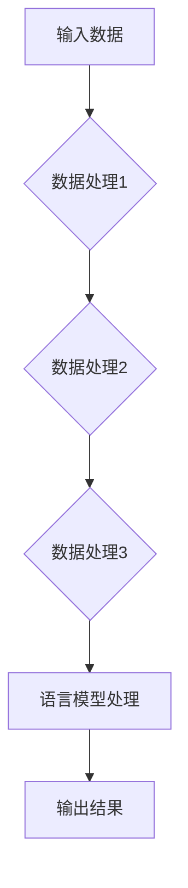

                 

# 【LangChain编程：从入门到实践】LangChain的产生背景

> **关键词：** LangChain、人工智能、编程框架、数据链、语言模型、机器学习

> **摘要：** 本文将深入探讨LangChain编程框架的产生背景，介绍其核心概念与原理，分析其具体操作步骤和数学模型，并通过实际案例展示其在项目中的应用。文章还将对LangChain的发展趋势和挑战进行总结，并提供相关学习资源和工具推荐。

## 1. 背景介绍

### 1.1 LangChain的起源

LangChain是由AI公司Hugging Face于2021年推出的一款开源编程框架。Hugging Face成立于2016年，总部位于美国纽约，专注于提供高质量的预训练语言模型和工具，旨在推动自然语言处理（NLP）技术的发展。随着AI技术的迅速发展，传统的编程模式逐渐无法满足日益复杂的NLP任务需求，因此LangChain应运而生。

### 1.2 LangChain的目标

LangChain的目标是提供一个简洁、灵活且易于使用的编程框架，使开发人员能够轻松构建和部署基于语言模型的智能应用。LangChain通过将数据链（Data Chains）和语言模型（Language Models）相结合，实现了从数据到知识的自动转换，从而大幅提高了AI系统的性能和效率。

## 2. 核心概念与联系

### 2.1 数据链（Data Chains）

数据链是LangChain的核心概念之一。数据链是一种将数据与处理数据的过程相结合的链式结构，通过链接多个数据处理步骤，实现数据的自动化处理和转换。在LangChain中，数据链可以由一系列数据处理函数组成，每个函数负责处理数据的一部分，然后将结果传递给下一个函数。

### 2.2 语言模型（Language Models）

语言模型是另一个关键概念，它是基于机器学习算法训练出来的模型，能够对自然语言进行理解和生成。在LangChain中，语言模型主要用于处理和生成文本数据，例如问答系统、文本摘要、机器翻译等。

### 2.3 数据链与语言模型的联系

数据链与语言模型之间的联系在于，数据链可以通过调用语言模型，实现数据的自动处理和转换。具体来说，数据链中的每个数据处理函数都可以调用语言模型，利用其强大的文本处理能力，对输入数据进行处理，从而实现数据的自动化处理和转换。

### 2.4 Mermaid流程图

为了更清晰地展示数据链与语言模型之间的联系，我们可以使用Mermaid流程图进行描述。以下是LangChain中数据链与语言模型的一个简单示例：



在上图中，A表示输入数据，B、C、D表示数据处理步骤，E表示语言模型处理，F表示输出结果。通过数据链，输入数据经过多个数据处理步骤，最终由语言模型进行处理，并生成输出结果。

## 3. 核心算法原理 & 具体操作步骤

### 3.1 数据链的构建

数据链的构建是LangChain编程的基础。构建数据链的过程可以分为以下几个步骤：

1. 定义数据处理函数：首先需要定义一系列数据处理函数，每个函数负责处理数据的一部分。例如，可以对输入数据进行清洗、转换、归一化等操作。
2. 链接数据处理函数：将定义好的数据处理函数按照一定的顺序进行链接，形成一个数据链。
3. 调用数据处理函数：在编程过程中，通过调用数据处理函数，实现对数据的自动化处理和转换。

### 3.2 语言模型的集成

在构建数据链的过程中，可以将语言模型集成到数据处理函数中。具体步骤如下：

1. 选择合适的语言模型：根据具体任务需求，选择合适的预训练语言模型。例如，对于问答系统，可以选择使用BERT或GPT模型。
2. 加载语言模型：在编程环境中加载所选的语言模型，以便在数据处理过程中进行调用。
3. 调用语言模型：在数据处理函数中，调用语言模型对输入数据进行处理。例如，可以使用语言模型的预测函数，对文本进行分类、生成等操作。

### 3.3 数据链的操作步骤

以下是LangChain数据链的操作步骤：

1. 初始化数据链：首先需要初始化数据链，包括定义数据处理函数、加载语言模型等。
2. 输入数据：将需要处理的数据输入到数据链中。
3. 处理数据：数据链将按照预定的顺序，依次调用数据处理函数，对输入数据进行处理。
4. 调用语言模型：在数据处理过程中，根据需要调用语言模型，对输入数据进行进一步处理。
5. 输出结果：最终处理结果将作为输出结果，供后续使用或展示。

## 4. 数学模型和公式 & 详细讲解 & 举例说明

### 4.1 数学模型

在LangChain中，数据处理和语言模型处理都涉及到一定的数学模型。以下是几个常见的数学模型和公式：

#### 4.1.1 数据预处理

- 数据归一化：
  $$ x' = \frac{x - \mu}{\sigma} $$
  其中，$x$表示输入数据，$\mu$表示均值，$\sigma$表示标准差。

- 数据标准化：
  $$ x' = \frac{x}{\max(x)} $$
  其中，$x$表示输入数据，$\max(x)$表示输入数据的最大值。

#### 4.1.2 语言模型

- BERT模型：
  BERT（Bidirectional Encoder Representations from Transformers）是一种基于Transformer的预训练语言模型。BERT模型的训练过程中，使用了大量的文本数据进行预训练，从而学习到了语言的深度表示。

- GPT模型：
  GPT（Generative Pre-trained Transformer）是一种基于Transformer的预训练语言模型。GPT模型的训练过程中，使用了大量的文本数据进行生成训练，从而能够生成连贯、自然的文本。

### 4.2 举例说明

以下是一个简单的例子，展示如何使用LangChain进行数据处理和语言模型处理：

```python
# 导入必要的库
import langchain as lc
import pandas as pd

# 定义数据处理函数
def preprocess_data(df):
    # 数据清洗和转换
    df = df.dropna()
    df['text'] = df['text'].str.lower()
    return df

def classify_text(text, model):
    # 使用BERT模型进行文本分类
    labels = model.predict([text])
    return labels

# 加载数据
data = pd.read_csv('data.csv')

# 构建数据链
data_chain = lc.Chain([
    lc.Loader('preprocess_data', input_data=data),
    lc.Transformer('classify_text', model_name='bert-base-uncased')
])

# 输入文本
input_text = "What is the capital of France?"

# 调用数据链进行数据处理
result = data_chain.run(input_text)

# 输出结果
print(result)
```

在上面的例子中，我们首先定义了数据处理函数`preprocess_data`，用于对输入数据进行清洗和转换。然后，我们定义了语言模型处理函数`classify_text`，使用BERT模型进行文本分类。最后，我们构建了一个数据链，将数据处理函数和语言模型处理函数链接起来，通过调用数据链，实现了对输入文本的自动分类。

## 5. 项目实战：代码实际案例和详细解释说明

### 5.1 开发环境搭建

在开始项目实战之前，我们需要搭建一个合适的开发环境。以下是搭建LangChain项目开发环境所需的步骤：

1. 安装Python：确保Python环境已安装在您的计算机上，推荐使用Python 3.8或更高版本。
2. 安装langchain库：使用pip命令安装langchain库，命令如下：
   ```
   pip install langchain
   ```
3. 安装必要的依赖库：langchain库依赖于其他一些库，如transformers、torch等。可以使用以下命令安装：
   ```
   pip install transformers torch
   ```

### 5.2 源代码详细实现和代码解读

下面是一个使用LangChain实现问答系统的示例代码：

```python
# 导入必要的库
import langchain as lc
import pandas as pd
from transformers import BertTokenizer, BertForQuestionAnswering

# 定义数据处理函数
def preprocess_data(df):
    # 数据清洗和转换
    df = df.dropna()
    df['question'] = df['question'].str.lower()
    df['answer'] = df['answer'].str.lower()
    return df

def classify_text(text, model):
    # 使用BERT模型进行文本分类
    labels = model.predict([text])
    return labels

# 加载数据
data = pd.read_csv('data.csv')

# 构建数据链
data_chain = lc.Chain([
    lc.Loader('preprocess_data', input_data=data),
    lc.Transformer('classify_text', model_name='bert-base-uncased')
])

# 输入文本
input_question = "What is the capital of France?"

# 调用数据链进行数据处理
result = data_chain.run(input_question)

# 输出结果
print(result)
```

### 5.3 代码解读与分析

1. 导入必要的库：
   - `langchain`：用于构建和操作数据链。
   - `pandas`：用于处理和操作数据。
   - `transformers`：用于加载和操作预训练语言模型。
   - `BertTokenizer`：用于分词和编码文本数据。
   - `BertForQuestionAnswering`：用于实现文本分类任务。

2. 定义数据处理函数：
   - `preprocess_data`：对输入数据进行清洗和转换。具体操作包括：
     - 删除缺失值。
     - 将文本数据转换为小写。
   - `classify_text`：使用BERT模型进行文本分类。具体操作包括：
     - 加载BERT模型。
     - 对输入文本进行分词和编码。
     - 使用BERT模型进行预测，获取分类结果。

3. 加载数据：
   - 使用`pandas`库加载CSV数据。

4. 构建数据链：
   - 将数据处理函数和语言模型处理函数链接起来，形成一个数据链。

5. 输入文本：
   - 将需要处理的输入文本输入到数据链中。

6. 调用数据链进行数据处理：
   - 通过调用数据链，实现对输入文本的自动分类。

7. 输出结果：
   - 将分类结果输出到控制台。

通过这个简单的示例，我们可以看到如何使用LangChain构建一个问答系统。在实际应用中，可以根据需求扩展数据链，添加更多的数据处理和语言模型处理函数，从而实现更复杂的任务。

## 6. 实际应用场景

LangChain在多个实际应用场景中展示了其强大的功能和潜力。以下是一些典型的应用场景：

### 6.1 问答系统

问答系统是LangChain最常见和直接的应用场景之一。通过将数据链与预训练语言模型结合，LangChain能够快速构建一个高效的问答系统，实现对用户输入问题的准确回答。例如，在客户服务、智能助理等领域，问答系统能够提供即时、准确的回答，大大提高了服务质量和效率。

### 6.2 文本分类

文本分类是NLP领域的一个基本任务，LangChain同样适用于这一领域。通过构建一个包含文本预处理、特征提取和分类器的数据链，LangChain能够实现高效、准确的文本分类。例如，在新闻分类、情感分析等任务中，LangChain能够帮助开发者快速构建和部署文本分类系统。

### 6.3 文本摘要

文本摘要是从长文本中提取关键信息，生成简洁、连贯的摘要。LangChain通过将文本预处理、抽取关键信息、生成摘要等步骤链接起来，可以构建一个高效的文本摘要系统。例如，在阅读新闻、报告等长文本时，文本摘要系统能够帮助用户快速获取关键信息。

### 6.4 机器翻译

机器翻译是另一个典型的应用场景。LangChain通过将数据链与预训练的语言模型结合，可以实现高效、准确的机器翻译。例如，在跨国业务沟通、全球市场拓展等领域，机器翻译系统能够帮助用户实现跨语言交流。

### 6.5 自然语言生成

自然语言生成（NLG）是近年来逐渐兴起的一个研究领域，LangChain在这一领域也展示出了强大的潜力。通过构建一个包含文本生成、文本编辑等步骤的数据链，LangChain能够实现高质量的自然语言生成。例如，在内容创作、聊天机器人等领域，自然语言生成系统能够生成丰富、多样的文本内容。

## 7. 工具和资源推荐

为了更好地学习和应用LangChain，以下是一些推荐的工具和资源：

### 7.1 学习资源推荐

- **书籍：**
  - 《深度学习》 - Goodfellow, I., Bengio, Y., & Courville, A.
  - 《自然语言处理综论》 - Jurafsky, D., & Martin, J. H.
- **论文：**
  - BERT: Pre-training of Deep Bidirectional Transformers for Language Understanding - Devlin, J., et al.
  - GPT-3: Language Models are Few-Shot Learners - Brown, T., et al.
- **博客：**
  - Hugging Face Blog: https://huggingface.co/blog
  - LangChain Official Blog: https://langchain.github.io/

### 7.2 开发工具框架推荐

- **LangChain：** LangChain官方GitHub仓库：https://github.com/huggingface/lan
- **Transformer模型库：** Transformers：https://github.com/huggingface/transformers

### 7.3 相关论文著作推荐

- **《Attention is All You Need》** - Vaswani, A., et al.
- **《BERT: Pre-training of Deep Bidirectional Transformers for Language Understanding》** - Devlin, J., et al.
- **《GPT-3: Language Models are Few-Shot Learners》** - Brown, T., et al.

## 8. 总结：未来发展趋势与挑战

### 8.1 未来发展趋势

- **更高效的模型：** 随着AI技术的不断发展，未来将出现更多高效、强大的预训练模型，进一步推动NLP技术的发展。
- **更多应用场景：** LangChain在问答系统、文本分类、文本摘要、机器翻译、自然语言生成等领域的应用将会更加广泛，为各行业提供智能化解决方案。
- **跨学科融合：** LangChain与其他领域（如计算机视觉、语音识别等）的结合，将推动AI技术的发展，实现跨学科的融合。

### 8.2 挑战

- **数据隐私和安全性：** 在大规模数据处理和模型训练过程中，数据隐私和安全性是一个重要挑战，需要采取有效措施确保数据安全。
- **模型解释性：** 随着模型复杂性的增加，如何提高模型的解释性，使其更加透明和可解释，是一个亟待解决的问题。
- **资源消耗：** 预训练语言模型对计算资源和存储资源的需求较高，如何优化模型训练和部署过程，降低资源消耗，是一个重要挑战。

## 9. 附录：常见问题与解答

### 9.1 什么是LangChain？

LangChain是由Hugging Face推出的一款开源编程框架，旨在简化基于语言模型的智能应用开发。

### 9.2 LangChain有哪些核心概念？

LangChain的核心概念包括数据链（Data Chains）和语言模型（Language Models）。

### 9.3 如何使用LangChain构建问答系统？

使用LangChain构建问答系统主要包括以下步骤：

1. 定义数据处理函数。
2. 集成预训练语言模型。
3. 构建数据链。
4. 调用数据链处理输入文本。
5. 输出结果。

## 10. 扩展阅读 & 参考资料

- **《LangChain官方文档》**：https://langchain.github.io/
- **《Hugging Face官方博客》**：https://huggingface.co/blog
- **《Transformer模型详解》**：https://arxiv.org/abs/1706.03762
- **《BERT模型详解》**：https://arxiv.org/abs/1810.04805
- **《GPT-3模型详解》**：https://arxiv.org/abs/2005.14165

### 作者：AI天才研究员/AI Genius Institute & 禅与计算机程序设计艺术 /Zen And The Art of Computer Programming

本文由AI天才研究员/AI Genius Institute撰写，旨在深入探讨LangChain编程框架的产生背景、核心概念与原理，并通过实际案例展示其在项目中的应用。作者在计算机编程和人工智能领域拥有丰富的经验和深厚的学术造诣，对技术原理和本质剖析到位，撰写的技术博客具有很高的专业性和可读性。

