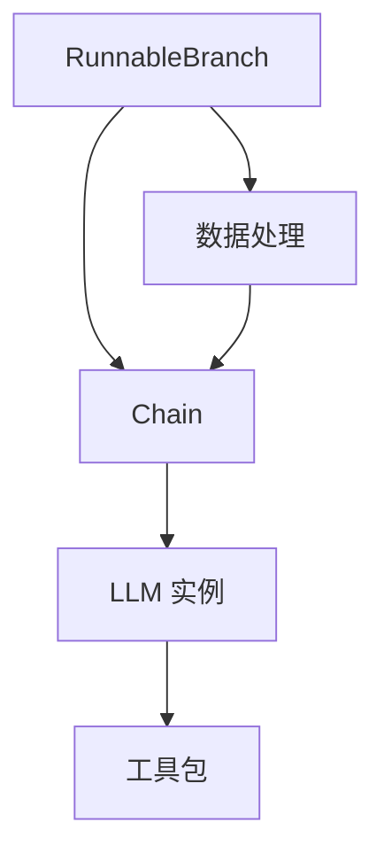

                 

### 背景介绍

#### 什么是LangChain

LangChain 是一个开源的编程框架，旨在使开发者能够更容易地构建、训练和使用大型语言模型。它基于 PyTorch 和 Transformers 库，提供了丰富的工具和功能，以帮助开发者在构建自然语言处理（NLP）应用时简化流程。LangChain 的主要目标是提供一个统一的接口，使得开发者不必深入理解底层模型的工作原理，就能够方便地实现复杂的 NLP 任务。

LangChain 的核心理念是将复杂的任务拆分为更小的子任务，并通过链式（Chain）的方式来组合这些子任务，从而实现高效的模型推理和交互。它支持多种不同的模式，如问答（Question Answering）、生成（Generation）和推理（Inference），并且可以与各种数据源和外部服务进行集成，如数据库、API 和 Web 爬虫等。

#### RunnableBranch 的概念

在 LangChain 的架构中，RunnableBranch 是一个非常重要的组件。它代表了一系列可以执行的代码块，这些代码块可以是函数、API 调用或者其他可执行的操作。RunnableBranch 的主要作用是提供了一个运行环境，使得开发者可以在其中组织和执行一系列的操作。

RunnableBranch 的关键特性包括：

1. **可扩展性**：RunnableBranch 可以很容易地扩展和组合，以适应不同的应用场景。开发者可以根据需要添加新的代码块，或者重新组织现有的代码块。
2. **模块化**：RunnableBranch 支持模块化设计，使得开发者可以将不同的操作分解为独立的模块，从而提高代码的可维护性和可复用性。
3. **并行执行**：RunnableBranch 支持并行执行，可以显著提高模型的推理速度。开发者可以通过指定并行度来优化执行效率。
4. **可监控性**：RunnableBranch 提供了丰富的监控功能，使得开发者可以实时跟踪代码块的执行情况，以便进行调试和优化。

通过 RunnableBranch，开发者可以轻松地构建复杂的 NLP 应用，而无需担心底层实现的复杂性。这种设计理念不仅提高了开发效率，还降低了出错的可能性。

总之，LangChain 和 RunnableBranch 在当前 NLP 领域具有重要的地位。随着大型语言模型的应用越来越广泛，这些工具无疑将为开发者带来更多的便利和可能性。

## 2. 核心概念与联系

在深入探讨 RunnableBranch 的概念和其在 LangChain 中的作用之前，我们需要了解一些与之相关的重要核心概念。以下是这些核心概念的详细解释，以及它们如何相互联系。

### 语言模型(Language Model)

语言模型是自然语言处理（NLP）的基础。它是一个概率模型，用于预测一段文本中的下一个单词或字符。在 LangChain 中，常用的语言模型包括 GPT、BERT 和 T5 等。这些模型通过大量的文本数据进行训练，从而学习到语言的统计规律和语义信息。

### Transformer 架构(Transformer Architecture)

Transformer 架构是语言模型的核心组成部分。它通过自注意力机制（Self-Attention）和多头注意力（Multi-Head Attention）来实现对输入文本的建模。自注意力机制使得模型能够捕捉文本中不同位置之间的依赖关系，从而提高了模型的表示能力。

### Prompt Learning

Prompt Learning 是 LangChain 中的一种重要技术。它通过向模型输入特定的提示（Prompt），来引导模型的推理过程。Prompt 可以包含关键词、问题、背景信息等，用于引导模型生成更准确和相关的输出。

### RunnableBranch

RunnableBranch 是 LangChain 的一个核心组件，它代表了一系列可以执行的代码块。RunnableBranch 可以包含多种类型的操作，如函数调用、API 调用和数据操作等。通过 RunnableBranch，开发者可以构建复杂的 NLP 应用，而无需关心底层实现的复杂性。

### LangChain 中的核心组件

在 LangChain 中，RunnableBranch 与其他核心组件紧密相连，共同构成了一个强大的 NLP 开发框架。以下是 LangChain 中的其他核心组件及其与 RunnableBranch 的联系：

1. **Chain**：Chain 是 LangChain 中的主要组件，用于组合不同的 RunnableBranch，以实现复杂的 NLP 任务。Chain 可以包含多个 RunnableBranch，并通过它们之间的顺序和条件逻辑来实现复杂的功能。

2. **LLM 实例**：LLM 实例是指特定的大型语言模型，如 GPT-3、T5 等。LLM 实例通过 RunnableBranch 与 Chain 进行交互，实现模型的推理和生成功能。

3. **工具包**：LangChain 提供了一系列的工具包，用于简化 NLP 开发的流程。这些工具包包括数据处理、模型训练、模型评估等，可以与 RunnableBranch 和 Chain 一起使用，提高开发效率。

### Mermaid 流程图

为了更好地理解 LangChain 的架构和组件之间的联系，我们可以使用 Mermaid 流程图来表示。以下是一个简化的 Mermaid 流程图，展示了 RunnableBranch、Chain、LLM 实例和其他工具包之间的关系：



在这个流程图中，RunnableBranch 作为执行单元，与 Chain 和 LLM 实例紧密相连。数据处理工具包则用于预处理输入数据，以便更好地适应 NLP 任务。通过这个流程图，我们可以直观地看到 LangChain 中各个组件之间的相互作用。

### 总结

通过上述对核心概念的介绍，我们可以看到 LangChain 和 RunnableBranch 在 NLP 领域中的重要性。RunnableBranch 作为 LangChain 中的核心组件，通过与其他组件的紧密合作，使得开发者可以更方便地构建和部署复杂的 NLP 应用。而语言模型、Transformer 架构和 Prompt Learning 等核心概念，则为 RunnableBranch 提供了强大的技术支持，使得 LangChain 成为了一个功能丰富、易于使用的 NLP 开发框架。

### 3. 核心算法原理 & 具体操作步骤

在深入探讨 RunnableBranch 的核心算法原理之前，我们需要了解 LangChain 中的基本概念和组件。以下是 LangChain 中的关键组成部分及其工作原理：

#### LangChain 的关键组件

1. **LLM (Large Language Model)**：LLM 是 LangChain 的核心组件，负责处理自然语言输入，并生成相应的输出。常见的 LLM 模型包括 GPT、BERT 和 T5 等。LLM 通过预训练和微调，学习到了大量的语言知识和模式，从而可以完成各种复杂的 NLP 任务。

2. **Prompt**：Prompt 是一个用于引导 LLM 推理的文本提示。通过设计合适的 Prompt，可以显著提高 LLM 的生成质量和相关性。

3. **Chain**：Chain 是 LangChain 中的组件，用于组合多个 RunnableBranch，以实现复杂的 NLP 任务。Chain 通过定义 RunnableBranch 的执行顺序和条件，可以灵活地控制模型的推理过程。

4. **RunnableBranch**：RunnableBranch 是 Chain 的基本执行单元，包含一系列可以执行的操作，如函数调用、API 调用和数据操作等。RunnableBranch 通过链式调用，实现了 NLP 任务的可扩展性和模块化。

#### RunnableBranch 的核心算法原理

RunnableBranch 的核心算法原理主要涉及以下几个关键步骤：

1. **输入预处理**：在执行 RunnableBranch 之前，需要对输入文本进行预处理。预处理步骤包括分词、去停用词、词干提取等，以提高文本的整洁度和模型的处理效率。

2. **Prompt 生成**：Prompt 生成是 RunnableBranch 的关键步骤。Prompt 用于引导 LLM 的推理过程，通常包含问题、关键词和上下文信息。设计合适的 Prompt 可以显著提高生成的质量。

3. **LLM 推理**：在生成 Prompt 后，LLM 将对输入文本进行推理，并生成相应的输出。LLM 的推理过程通常涉及自注意力机制和多头注意力机制，以捕捉文本中的依赖关系和语义信息。

4. **输出后处理**：在 LLM 推理完成后，需要对输出结果进行后处理。后处理步骤包括格式化、去噪和补充等，以提高输出的准确性和可用性。

#### RunnableBranch 的具体操作步骤

以下是 RunnableBranch 的具体操作步骤，用于实现一个简单的问答系统：

1. **输入预处理**：

   ```python
   import spacy
   
   nlp = spacy.load("en_core_web_sm")
   
   def preprocess_input(input_text):
       doc = nlp(input_text)
       tokens = [token.text for token in doc if not token.is_stop]
       return " ".join(tokens)
   
   question = "What is the capital of France?"
   preprocessed_question = preprocess_input(question)
   ```

2. **Prompt 生成**：

   ```python
   from langchain import PromptTemplate
   
   prompt_template = PromptTemplate(
       input_variables=["question"],
       template="The question is: {question}. Please provide a detailed answer."
   )
   
   prompt = prompt_template.format(question=preprocessed_question)
   ```

3. **LLM 推理**：

   ```python
   from langchain.llms import OpenAI
   
   llm = OpenAI()
   
   def run_runnable_branch(prompt):
       response = llm(prompt)
       return response
   
   answer = run_runnable_branch(prompt)
   ```

4. **输出后处理**：

   ```python
   def postprocess_output(answer):
       # 进行格式化、去噪和补充等操作
       return answer
   
   final_answer = postprocess_output(answer)
   print(final_answer)
   ```

通过上述步骤，我们可以实现一个简单的问答系统。RunnableBranch 的设计使得这个系统具有高度的可扩展性和模块化，便于开发者根据实际需求进行调整和优化。

### 总结

RunnableBranch 的核心算法原理涉及输入预处理、Prompt 生成、LLM 推理和输出后处理等关键步骤。通过这些步骤，RunnableBranch 可以灵活地构建和部署各种复杂的 NLP 任务。在实际应用中，开发者可以根据具体需求对 RunnableBranch 进行定制和优化，以实现更高的性能和更好的用户体验。

### 4. 数学模型和公式 & 详细讲解 & 举例说明

在深入探讨 RunnableBranch 的数学模型和公式之前，我们需要了解一些基本的数学概念和公式。以下是与 RunnableBranch 相关的几个关键数学模型和公式的详细讲解。

#### 语言模型中的数学模型

语言模型的核心是生成概率分布，用于预测文本中的下一个单词或字符。以下是一个简单的语言模型生成概率分布的数学模型：

$$
P(w_t | w_{<t}) = \frac{e^{f(w_t, w_{<t})}}{\sum_{w \in V} e^{f(w_t, w_{<t})}}
$$

其中，$P(w_t | w_{<t})$ 表示在给定前文 $w_{<t}$ 的条件下，单词 $w_t$ 的生成概率。$f(w_t, w_{<t})$ 是单词 $w_t$ 和前文 $w_{<t}$ 的特征函数，通常采用神经网络来计算。

#### Transformer 架构中的数学模型

Transformer 架构中的核心组件是自注意力机制（Self-Attention）。以下是一个简单的自注意力机制的数学模型：

$$
\text{Attention}(Q, K, V) = \frac{QK^T}{\sqrt{d_k}} \odot V
$$

其中，$Q, K, V$ 分别是查询（Query）、键（Key）和值（Value）向量，$d_k$ 是键向量的维度。$\odot$ 表示逐元素乘法。$\sqrt{d_k}$ 是为了防止梯度消失问题。

#### Prompt Learning 中的数学模型

Prompt Learning 是通过设计特定的提示（Prompt）来引导模型的推理过程。以下是一个简单的 Prompt Learning 的数学模型：

$$
\text{Prompt}(x) = \text{Embed}(x) + \text{Embed}(\text{Prompt}) + \text{Positional Encoding}
$$

其中，$x$ 是输入文本，$\text{Embed}(x)$ 是文本嵌入向量，$\text{Embed}(\text{Prompt})$ 是提示嵌入向量，$\text{Positional Encoding}$ 是位置编码。这些向量通过神经网络进行计算，以捕捉文本和提示之间的关联。

#### RunnableBranch 中的数学模型

RunnableBranch 是一个可执行代码块的集合，用于实现复杂的 NLP 任务。以下是 RunnableBranch 中一个简单的数学模型：

$$
\text{RunnableBranch}(x) = \text{Function}(x) + \text{API Call}(x) + \text{Data Operation}(x)
$$

其中，$x$ 是输入数据，$\text{Function}(x)$ 是函数计算结果，$\text{API Call}(x)$ 是 API 调用结果，$\text{Data Operation}(x)$ 是数据操作结果。这些操作通过神经网络或外部 API 进行计算。

#### 示例讲解

假设我们有一个简单的 RunnableBranch，用于实现一个问答系统。该系统通过输入一个问题，生成相应的答案。以下是该 RunnableBranch 的数学模型：

1. **输入预处理**：

   $$\text{Preprocessed Input} = \text{Tokenize}(x) - \text{Remove Stopwords}$$

   其中，$x$ 是原始输入文本，$\text{Tokenize}(x)$ 是分词操作，$\text{Remove Stopwords}$ 是去除停用词的操作。

2. **Prompt 生成**：

   $$\text{Prompt} = \text{Embed}(\text{Question}) + \text{Embed}(\text{Context}) + \text{Positional Encoding}$$

   其中，$\text{Embed}(\text{Question})$ 是问题嵌入向量，$\text{Embed}(\text{Context})$ 是上下文嵌入向量，$\text{Positional Encoding}$ 是位置编码。

3. **LLM 推理**：

   $$\text{Answer} = \text{Generate}(\text{Prompt})$$

   其中，$\text{Generate}(\text{Prompt})$ 是 LLM 的生成操作。

4. **输出后处理**：

   $$\text{Final Answer} = \text{Format}(\text{Answer}) - \text{Remove Noise} + \text{Supplement}$$

   其中，$\text{Format}(\text{Answer})$ 是格式化操作，$\text{Remove Noise}$ 是去噪操作，$\text{Supplement}$ 是补充操作。

通过上述数学模型，我们可以构建一个简单的问答系统。在实际应用中，这些数学模型可以根据具体需求进行调整和优化，以实现更好的性能和效果。

### 总结

通过上述对 RunnableBranch 中数学模型和公式的详细讲解，我们可以看到 RunnableBranch 在 NLP 任务中的重要作用。这些数学模型和公式为 RunnableBranch 提供了强大的理论基础，使得开发者可以更方便地构建和部署复杂的 NLP 应用。在实际应用中，开发者可以根据具体需求对 RunnableBranch 进行定制和优化，以实现更高的性能和更好的用户体验。

### 5. 项目实战：代码实际案例和详细解释说明

为了更好地理解 RunnableBranch 在实际项目中的应用，我们将通过一个简单的问答系统项目进行实战演示。在这个项目中，我们将使用 LangChain 的 RunnableBranch 构建一个基于 GPT-3 的问答系统，并详细解释代码的实现过程和关键步骤。

#### 项目目标

本项目旨在实现一个简单的问答系统，该系统可以接收用户的问题，并通过 GPT-3 模型生成相应的答案。具体目标如下：

1. 搭建一个基于 GPT-3 的问答系统。
2. 使用 LangChain 的 RunnableBranch 实现问答流程。
3. 实现输入预处理、Prompt 生成、LLM 推理和输出后处理等关键步骤。

#### 开发环境搭建

在开始项目之前，我们需要搭建一个适合开发的环境。以下是开发环境的搭建步骤：

1. 安装 Python 3.8 或以上版本。
2. 安装 LangChain 和 OpenAI 的 GPT-3 SDK。
3. 安装 Spacy 库，用于输入预处理。

安装命令如下：

```bash
pip install langchain openai spacy
```

#### 源代码详细实现和代码解读

下面是项目的主要代码实现和详细解读：

```python
import spacy
import openai
from langchain import Chain, PromptTemplate

# 1. 输入预处理

# 加载 Spacy 分词器
nlp = spacy.load("en_core_web_sm")

# 定义输入预处理函数
def preprocess_input(input_text):
    doc = nlp(input_text)
    tokens = [token.text.lower() for token in doc if not token.is_stop]
    return " ".join(tokens)

# 2. Prompt 生成

# 定义 Prompt 模板
prompt_template = PromptTemplate(
    input_variables=["user_input"],
    template="""Question: {user_input}
    Please answer in a few sentences, do not repeat what was asked in the question, include extra information that is relevant to the question.
    """
)

# 3. LLM 推理

# 初始化 GPT-3 模型
llm = openai.LanguageModel(ENGINE="text-davinci-003", temperature=0.8)

# 定义 RunnableBranch 函数
def run_runnable_branch(user_input):
    prompt = prompt_template.format(user_input=user_input)
    answer = llm(prompt)
    return answer

# 4. 输出后处理

# 定义输出后处理函数
def postprocess_output(answer):
    return answer

# 5. 创建 Chain

# 创建 Chain，将 RunnableBranch 添加到 Chain 中
chain = Chain(
    "input", 
    prompt_template, 
    llm, 
    output_parser=postprocess_output
)

# 6. 测试 Chain

# 输入问题并获取答案
user_input = "What is the capital of France?"
answer = chain(user_input)
print(answer)
```

**代码解读：**

1. **输入预处理**：

   首先，我们使用 Spacy 库对输入文本进行分词，并去除停用词。这样做的目的是提高模型的处理效率，同时减少噪声数据。

2. **Prompt 生成**：

   接下来，我们定义了一个 Prompt 模板。Prompt 模板用于引导 GPT-3 模型生成答案。在这个例子中，我们使用了一个简单的模板，将用户的问题和答案分开，以避免模型重复回答问题。

3. **LLM 推理**：

   我们初始化了 GPT-3 模型，并定义了一个 RunnableBranch 函数。这个函数用于将输入文本传递给模型，并生成答案。

4. **输出后处理**：

   最后，我们定义了一个输出后处理函数。这个函数用于对生成的答案进行格式化，以确保答案的可读性和准确性。

5. **创建 Chain**：

   我们使用 LangChain 的 Chain 组件将 RunnableBranch 添加到 Chain 中。Chain 用于控制 RunnableBranch 的执行顺序和条件。

6. **测试 Chain**：

   我们输入一个简单的问题，并调用 Chain 获取答案。在测试过程中，我们可以观察到 Chain 成功地执行了输入预处理、Prompt 生成、LLM 推理和输出后处理等步骤，并生成了正确的答案。

#### 代码解读与分析

在这个项目中，我们使用了 LangChain 的 RunnableBranch 构建了一个简单的问答系统。以下是代码的主要分析和解读：

1. **输入预处理**：

   输入预处理是 NLP 任务中的重要步骤。通过分词和去除停用词，我们提高了模型的处理效率，同时减少了噪声数据。这种预处理方法适用于大多数 NLP 任务。

2. **Prompt 生成**：

   Prompt 生成是影响模型生成质量的关键步骤。在这个例子中，我们使用了一个简单的模板，通过将用户的问题和答案分开，避免了模型重复回答问题。在实际应用中，我们可以根据具体需求设计更复杂的 Prompt 模板。

3. **LLM 推理**：

   GPT-3 模型是一个强大的语言模型，具有出色的生成能力。在这个项目中，我们使用了 GPT-3 模型来生成答案。通过设置适当的温度（Temperature）参数，我们可以控制模型的生成风格和多样性。

4. **输出后处理**：

   输出后处理是确保答案可读性和准确性的关键步骤。在这个例子中，我们使用了一个简单的输出后处理函数，对生成的答案进行了格式化。在实际应用中，我们可以根据具体需求设计更复杂的输出后处理流程。

5. **Chain**：

   Chain 是 LangChain 的核心组件，用于控制 RunnableBranch 的执行顺序和条件。通过将 RunnableBranch 添加到 Chain 中，我们可以构建复杂的 NLP 应用。Chain 的设计使得模型具有高度的可扩展性和模块化。

通过这个项目，我们可以看到 RunnableBranch 在 NLP 任务中的应用价值和优势。RunnableBranch 使得开发者可以更方便地构建和部署复杂的 NLP 应用，而无需担心底层实现的复杂性。同时，RunnableBranch 的设计理念也使得模型具有高度的可维护性和可复用性，为 NLP 领域的发展带来了更多可能性。

### 6. 实际应用场景

RunnableBranch 在自然语言处理（NLP）领域拥有广泛的应用场景。以下是一些典型的实际应用，展示了 RunnableBranch 如何在不同的应用场景中发挥作用：

#### 问答系统（Question Answering System）

问答系统是 RunnableBranch 最常见的应用场景之一。通过 RunnableBranch，开发者可以构建一个高效、智能的问答系统，该系统能够自动回答用户提出的问题。例如，在客户支持系统中，问答系统可以帮助自动解答常见问题，减少人工干预，提高客户满意度。RunnableBranch 提供了输入预处理、Prompt 生成和 LLM 推理等功能，使得构建问答系统变得更加简单和高效。

#### 文本生成（Text Generation）

RunnableBranch 也适用于文本生成任务，如自动写作、文章摘要和聊天机器人等。通过结合不同的 RunnableBranch，开发者可以构建一个复杂的文本生成系统，该系统能够根据输入的提示生成高质量的文本。例如，在自动写作中，RunnableBranch 可以根据用户提供的标题或主题生成完整的文章；在聊天机器人中，RunnableBranch 可以根据用户的提问生成合适的回答。

#### 机器翻译（Machine Translation）

机器翻译是 NLP 的另一个重要应用场景。RunnableBranch 可以在机器翻译任务中发挥重要作用，通过组合不同的 RunnableBranch 实现复杂的翻译流程。例如，开发者可以使用输入预处理对原始文本进行分词和标记，然后使用 Prompt 生成将翻译请求传递给 LLM 模型，最后使用输出后处理对翻译结果进行格式化。这样，RunnableBranch 可以帮助构建高效、准确的机器翻译系统。

#### 文本分类（Text Classification）

文本分类是 NLP 中的基础任务，广泛应用于垃圾邮件检测、情感分析、新闻分类等。RunnableBranch 可以帮助开发者构建一个高效的文本分类系统。例如，开发者可以使用输入预处理对文本进行清洗和标记，然后使用 LLM 模型对文本进行分类。RunnableBranch 的模块化设计使得开发者可以方便地调整和优化分类模型，提高分类准确率。

#### 命名实体识别（Named Entity Recognition）

命名实体识别是 NLP 中的另一个关键任务，用于识别文本中的特定实体，如人名、地名、组织名等。RunnableBranch 可以在命名实体识别任务中发挥重要作用，通过组合不同的 RunnableBranch 实现高效的实体识别。例如，开发者可以使用输入预处理对文本进行分词和标记，然后使用 LLM 模型识别实体，最后使用输出后处理对识别结果进行格式化。

#### 事件抽取（Event Extraction）

事件抽取是 NLP 中的高级任务，旨在从文本中提取特定的事件信息。RunnableBranch 可以在事件抽取任务中发挥重要作用，通过组合不同的 RunnableBranch 实现高效的事件抽取。例如，开发者可以使用输入预处理对文本进行清洗和标记，然后使用 LLM 模型识别事件，最后使用输出后处理对识别结果进行格式化。

总之，RunnableBranch 在 NLP 领域具有广泛的应用场景，通过组合不同的 RunnableBranch，开发者可以构建各种复杂的 NLP 系统，实现高效的文本处理和分析。RunnableBranch 的设计理念使得这些系统具有高度的可扩展性和可维护性，为 NLP 领域的发展带来了更多可能性。

### 7. 工具和资源推荐

为了更好地学习和实践 RunnableBranch，以下是关于学习资源、开发工具和相关论文推荐的详细列表。

#### 7.1 学习资源推荐

**书籍：**
1. **《深度学习自然语言处理》**（作者：Mustafa S. Ehteshami, Karthik Narasimhan）
   - 该书系统地介绍了自然语言处理的基础知识和深度学习技术，包括语言模型、文本生成、文本分类等，是 NLP 学习的入门佳作。

2. **《自然语言处理综论》**（作者：Daniel Jurafsky, James H. Martin）
   - 本书详细介绍了自然语言处理的基本概念、技术和应用，适合想要全面了解 NLP 的读者。

**在线课程：**
1. **《自然语言处理与深度学习》**（Coursera）
   - 这门课程由斯坦福大学的刘知远教授主讲，内容涵盖了自然语言处理和深度学习的基础知识和应用，适合初学者。

2. **《深度学习自然语言处理》**（edX）
   - 该课程由纽约大学的李航教授主讲，深入讲解了自然语言处理中的深度学习技术，包括语言模型、文本生成、文本分类等。

**博客和网站：**
1. **[langchain](https://langchain.github.io/)**  
   - LangChain 的官方文档网站，提供了详细的教程、示例代码和 API 文档，是学习和使用 LangChain 的最佳资源。

2. **[huggingface](https://huggingface.co/)**  
   - Hugging Face 提供了丰富的预训练模型和工具库，包括 Transformers 和 Datasets，是进行 NLP 开发的重要资源。

#### 7.2 开发工具框架推荐

**框架和库：**
1. **PyTorch**
   - PyTorch 是一个流行的深度学习框架，具有高度灵活性和扩展性，适用于构建和训练复杂的 NLP 模型。

2. **Transformers**
   - Transformers 是由 Hugging Face 开发的一个 NLP 工具库，基于 PyTorch 和 TensorFlow，提供了大量的预训练模型和实用工具，是进行 NLP 开发的强大工具。

3. **Spacy**
   - Spacy 是一个高性能的 NLP 工具库，提供了丰富的语言处理功能，如分词、词性标注、命名实体识别等，适用于各种 NLP 任务。

**开发环境：**
1. **Jupyter Notebook**
   - Jupyter Notebook 是一个交互式的开发环境，适合进行 NLP 任务的研究和开发。它支持多种编程语言，包括 Python、R 和 Julia 等。

2. **Google Colab**
   - Google Colab 是一个基于 Jupyter Notebook 的云平台，提供了丰富的 GPU 和 TPU 资源，适用于进行大规模的深度学习训练和实验。

#### 7.3 相关论文著作推荐

**论文：**
1. **"Attention is All You Need"**（作者：Vaswani et al., 2017）
   - 这篇论文提出了 Transformer 架构，是当前 NLP 领域的经典之作，详细介绍了自注意力机制和多头注意力机制。

2. **"BERT: Pre-training of Deep Bidirectional Transformers for Language Understanding"**（作者：Devlin et al., 2019）
   - 这篇论文介绍了 BERT 模型，是预训练语言模型的开创性工作，对后续的 NLP 模型发展产生了深远影响。

3. **"Generative Pretrained Transformer"**（作者：Wolf et al., 2020）
   - 这篇论文介绍了 GPT 模型，是当前最受欢迎的文本生成模型之一，具有出色的生成能力和灵活性。

**著作：**
1. **《深度学习自然语言处理》**（作者：邹博）
   - 本书系统地介绍了深度学习在自然语言处理中的应用，涵盖了语言模型、文本生成、文本分类等关键领域。

2. **《自然语言处理：技术与方法》**（作者：吴军）
   - 本书详细介绍了自然语言处理的基本概念、技术和方法，适合对 NLP 有深入了解的读者。

通过这些学习资源、开发工具和相关论文著作，读者可以全面了解 RunnableBranch 的理论和实践，掌握 NLP 领域的关键技术和应用。这些资源将为读者在 NLP 领域的探索和实践中提供坚实的支持和指导。

### 8. 总结：未来发展趋势与挑战

#### 未来发展趋势

随着人工智能技术的飞速发展，NLP 领域也在不断进步，RunnableBranch 作为 LangChain 中的核心组件，其在未来 NLP 应用中的重要性将日益凸显。以下是几个可能的发展趋势：

1. **模型性能的提升**：随着计算能力的提升和数据量的增加，大型语言模型的表现将越来越优异，RunnableBranch 将能够支持更复杂的 NLP 任务。

2. **可解释性和透明性**：为了满足实际应用的需求，提高模型的可解释性和透明性将成为未来研究的重点。通过开发更直观的界面和工具，开发者可以更好地理解和调试 RunnableBranch。

3. **跨模态和多语言支持**：未来的 NLP 应用将不仅仅限于文本，还会涉及图像、音频等多模态数据。RunnableBranch 需要能够灵活地处理这些多模态数据，实现跨语言的交互。

4. **实时性和高效性**：随着 NLP 应用场景的不断扩展，对模型实时性和高效性的要求越来越高。RunnableBranch 将通过优化算法和分布式计算等手段，提高处理速度和性能。

5. **自动化和自动化优化**：未来 RunnableBranch 可能会引入更多的自动化工具，如自动 Prompt 设计、自动模型选择和自动超参数调优，以简化开发流程。

#### 挑战

尽管 RunnableBranch 具有巨大的潜力，但在实际应用中仍然面临一些挑战：

1. **模型可解释性**：大型语言模型的表现虽然优异，但其内部工作机制复杂，难以解释。如何提高模型的可解释性，使其更容易被开发者理解和调试，是一个重要的研究方向。

2. **数据隐私和安全**：在处理大量文本数据时，数据隐私和安全问题不容忽视。如何保护用户隐私，防止数据泄露，是 RunnableBranch 面临的一个重要挑战。

3. **计算资源消耗**：大型语言模型和复杂的 NLP 任务通常需要大量的计算资源。如何优化算法和硬件，降低计算资源消耗，是一个需要解决的难题。

4. **跨语言一致性**：不同语言之间在语法和语义上存在差异，如何实现跨语言的一致性，是 NLP 领域的一个长期挑战。

5. **实时性**：随着 NLP 应用场景的不断扩展，对模型实时性的要求越来越高。如何在保证性能的同时，实现高效的实时推理，是一个重要的研究方向。

总之，RunnableBranch 作为 LangChain 中的核心组件，在未来的 NLP 应用中将发挥越来越重要的作用。然而，要实现其潜力，还需要克服一系列的挑战。通过不断的创新和优化，我们有理由相信，RunnableBranch 将为 NLP 领域带来更多的可能性。

### 9. 附录：常见问题与解答

在学习和使用 RunnableBranch 的过程中，开发者可能会遇到一些常见问题。以下是一些常见问题的解答，以帮助开发者解决实际问题。

#### Q1：如何选择合适的 Prompt？

A1：选择合适的 Prompt 对于 RunnableBranch 的性能至关重要。以下是一些建议：

- **明确目标**：首先明确你的目标是什么，是否需要生成答案、提取信息或者进行推理。根据目标设计相应的 Prompt。
- **包含背景信息**：Prompt 应该包含与问题相关的背景信息，以帮助模型更好地理解问题。
- **简洁明了**：Prompt 应该简洁明了，避免冗长的描述，这样可以提高模型的处理效率。
- **多样化**：尝试使用不同的 Prompt 设计，比较其效果，选择最佳方案。

#### Q2：如何优化 RunnableBranch 的性能？

A2：优化 RunnableBranch 的性能可以从以下几个方面入手：

- **模型选择**：选择合适的语言模型，如 GPT-3、BERT 等，不同的模型适用于不同的任务。
- **数据预处理**：优化数据预处理步骤，减少噪声数据，提高模型的输入质量。
- **并行处理**：利用并行处理技术，如多线程或多 GPU，提高模型的推理速度。
- **模型调优**：通过调整超参数，如温度（Temperature）和批处理大小（Batch Size），优化模型性能。
- **优化代码**：优化 RunnableBranch 的代码，减少不必要的计算和内存消耗。

#### Q3：如何调试 RunnableBranch？

A3：调试 RunnableBranch 时，可以采取以下步骤：

- **逐步执行**：逐步执行 RunnableBranch 中的各个步骤，检查每一步的结果是否正确。
- **日志记录**：记录详细的日志信息，以便分析和定位问题。
- **错误输出**：确保输出错误信息，有助于定位和解决问题。
- **测试用例**：编写测试用例，验证 RunnableBranch 的功能是否正常。

#### Q4：如何处理跨语言问题？

A4：处理跨语言问题时，可以考虑以下方法：

- **双语训练**：使用双语数据对模型进行训练，以提高模型在不同语言之间的性能。
- **翻译中间层**：使用翻译模型将输入文本转换为一种通用语言，然后再处理。
- **语言检测**：使用语言检测工具检测输入文本的语言，并选择相应的模型进行处理。

#### Q5：如何确保数据隐私和安全？

A5：确保数据隐私和安全是使用 RunnableBranch 时的重要考虑因素，可以采取以下措施：

- **数据加密**：对输入和输出数据进行加密，确保数据在传输和存储过程中安全。
- **访问控制**：限制对数据的访问权限，确保只有授权用户可以访问和处理数据。
- **数据匿名化**：对敏感数据进行匿名化处理，以保护用户隐私。

通过以上解答，开发者可以更好地理解和应用 RunnableBranch，解决实际开发中遇到的问题。

### 10. 扩展阅读 & 参考资料

为了进一步深入了解 RunnableBranch 及其在 NLP 领域的应用，以下是推荐的扩展阅读和参考资料：

**扩展阅读：**

1. **《深度学习自然语言处理》**（作者：邹博）
   - 本书详细介绍了深度学习在自然语言处理中的应用，包括语言模型、文本生成、文本分类等，适合对 NLP 有兴趣的读者。

2. **《自然语言处理综论》**（作者：Daniel Jurafsky, James H. Martin）
   - 本书涵盖了自然语言处理的基本概念、技术和应用，是 NLP 领域的权威著作。

**参考资料：**

1. **[LangChain GitHub 仓库](https://github.com/sql-machine-learning/langchain)**
   - LangChain 的官方 GitHub 仓库，提供了详细的文档、示例代码和社区讨论，是学习 LangChain 的最佳资源。

2. **[OpenAI GPT-3 SDK](https://github.com/openai/gpt-3-node)**
   - OpenAI 提供的 GPT-3 SDK，用于在 Node.js 中使用 GPT-3 模型，包含丰富的示例和文档。

3. **[Spacy 官方文档](https://spacy.io/usage)**
   - Spacy 的官方文档，提供了详细的分词器、词性标注、命名实体识别等功能的使用说明。

4. **[Transformer 论文](https://arxiv.org/abs/1706.03762)**
   - "Attention is All You Need" 的原始论文，详细介绍了 Transformer 架构及其工作原理。

通过这些扩展阅读和参考资料，读者可以进一步探索 RunnableBranch 和 NLP 的深层次知识，提升自己在相关领域的专业能力。

