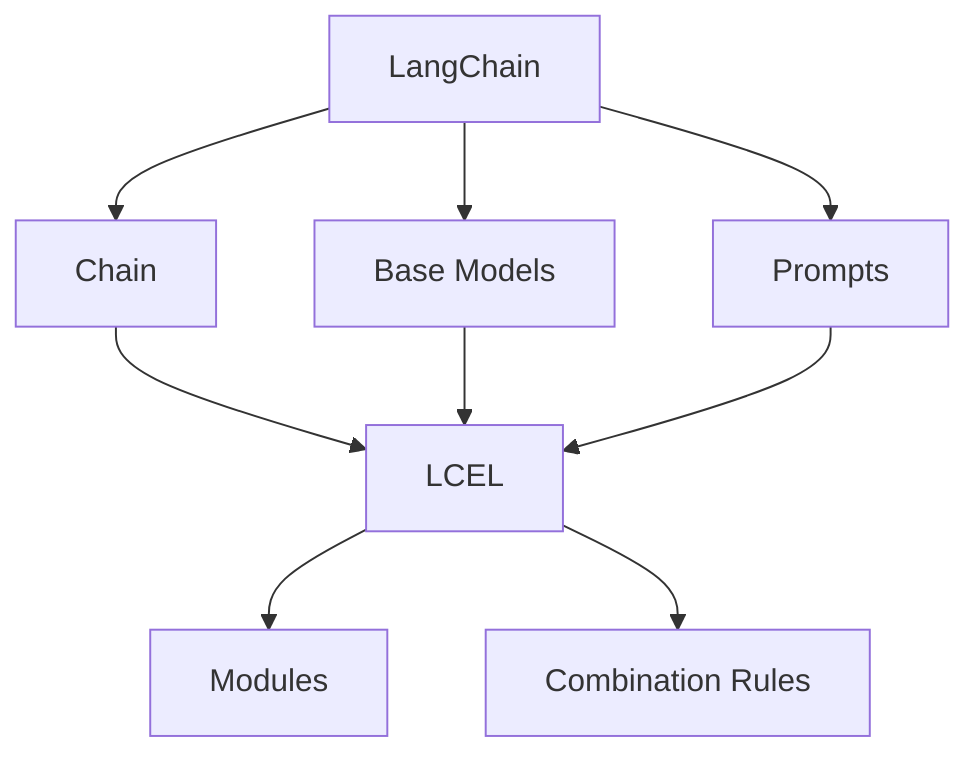

                 

### 文章标题：LangChain编程：从入门到实践 使用LCEL进行组合

**关键词**：LangChain，编程，LCEL，组合，实践，入门，技术博客

**摘要**：本文旨在为初学者和有经验的开发者提供详细的LangChain编程指南，特别是如何使用LCEL（LangChain Elements Language）进行模块化组合。文章从基础概念开始，深入剖析核心算法原理，并通过项目实战展示具体实现和代码解读，最后探讨实际应用场景及未来发展。

---

**目录：**

1. **背景介绍**
2. **核心概念与联系**
3. **核心算法原理 & 具体操作步骤**
4. **数学模型和公式 & 详细讲解 & 举例说明**
5. **项目实战：代码实际案例和详细解释说明**
   - 5.1 开发环境搭建
   - 5.2 源代码详细实现和代码解读
   - 5.3 代码解读与分析
6. **实际应用场景**
7. **工具和资源推荐**
   - 7.1 学习资源推荐
   - 7.2 开发工具框架推荐
   - 7.3 相关论文著作推荐
8. **总结：未来发展趋势与挑战**
9. **附录：常见问题与解答**
10. **扩展阅读 & 参考资料**

---

### 1. 背景介绍

随着自然语言处理（NLP）和深度学习技术的发展，生成式模型如GPT系列已经成为许多应用场景的基石。然而，传统的生成式模型如GPT在处理结构化数据或复杂任务时显得力不从心。为此，研究人员提出了诸如LLaMA（Large Language Model for Middleware Applications）和LangChain等新型框架，以桥接生成式模型与实际应用之间的鸿沟。

LangChain是一个基于Python的框架，旨在简化生成式AI模型与实际应用程序的集成。它提供了一系列工具和API，使用户能够轻松构建和组合链式任务，从而实现复杂的功能。而LCEL（LangChain Elements Language）则是LangChain的核心组件之一，它定义了一种DSL（领域特定语言），用于描述和组合不同的AI元素。

本文将首先介绍LangChain和LCEL的基础知识，然后逐步深入到具体的应用实践中。我们将从基础概念的讲解开始，逐步构建一个实际项目，并通过代码示例展示LCEL在项目中的应用。最终，我们将探讨LangChain和LCEL在实际开发中的应用场景，并展望其未来发展的趋势和挑战。

---

### 2. 核心概念与联系

为了更好地理解LangChain和LCEL，我们需要先了解几个核心概念。

#### 2.1 LangChain

LangChain是一个开源框架，它提供了一系列预定义的链式任务和API，用于构建复杂的应用程序。其设计理念是将复杂的任务分解为一系列简单的步骤，并通过组合这些步骤来构建完整的应用。LangChain的核心组件包括：

- **Chain（链）**：一个链是一个有序的任务序列，用于处理输入数据。每个任务都可以是一个函数，一个类，或者一个预定义的Chain组件。
- **Prompts（提示）**：提示是一种特殊的输入，它用于指导链如何处理输入数据。提示通常包含指令、上下文信息和预期输出。
- **Base Models（基础模型）**：LangChain支持多种基础模型，如GPT、T5等，用户可以根据需要选择合适的模型。

#### 2.2 LCEL

LCEL是LangChain的一部分，它提供了一种DSL，用于定义和组合不同的AI元素。LCEL的主要特点包括：

- **模块化**：LCEL将不同的AI元素（如模型、数据处理函数等）模块化，使用户可以轻松组合这些模块来构建复杂的任务。
- **可组合性**：LCEL支持元素之间的组合，用户可以定义复杂的组合规则，从而实现更高级的功能。
- **灵活性**：LCEL允许用户自定义元素的行为，从而适应不同的应用场景。

#### 2.3 核心概念之间的联系

LangChain和LCEL的核心概念之间有着密切的联系。具体来说，LCEL为LangChain提供了一种灵活的模块化编程方式，使得用户可以更轻松地构建和组合复杂的AI应用。例如，通过LCEL，用户可以将不同的模型、数据处理函数和提示组合在一起，形成一个完整的链式任务。

下面是一个简单的Mermaid流程图，展示了LangChain和LCEL的核心概念及其之间的联系。

在上述流程图中，LangChain（A）作为整体框架，与Chain（B）、Base Models（C）和Prompts（D）等核心组件紧密相连。而LCEL（E）则为这些组件提供了一个模块化和组合的接口，通过定义Modules（F）和Combination Rules（G），实现了元素之间的灵活组合。

---

### 3. 核心算法原理 & 具体操作步骤

#### 3.1 LangChain算法原理

LangChain的核心算法原理在于其链式任务模型。链式任务模型将复杂的任务分解为一系列简单的步骤，每个步骤都可以是一个函数、一个类或者一个预定义的Chain组件。这些步骤通过Prompts进行串联，形成一个完整的任务流。

具体来说，LangChain的链式任务模型包括以下几个关键组成部分：

- **Chain Components（链组件）**：链组件是构成链式任务的基本单元，可以是用户自定义的函数、类或者预定义的Chain组件。
- **Prompts（提示）**：提示用于指导链组件如何处理输入数据。提示通常包含指令、上下文信息和预期输出。
- **Task Seque

