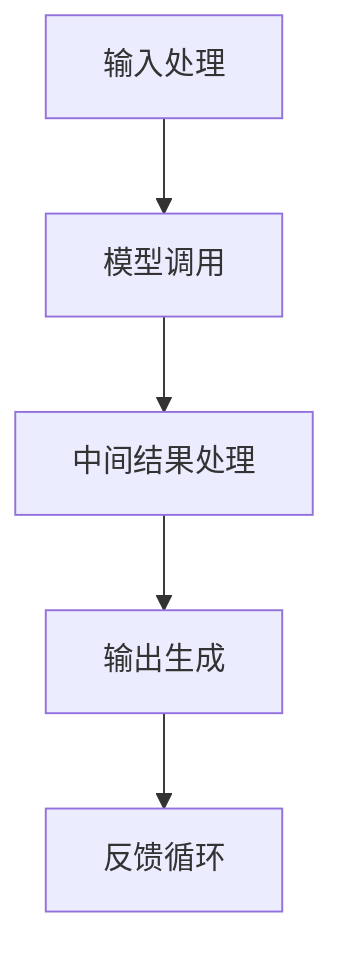

                 

### 背景介绍

《LangChain编程：从入门到实践》的目标是帮助读者深入了解并掌握LangChain的核心概念、关键技术及其在实际应用中的实现。LangChain是一个开源的智能代理框架，旨在利用语言模型实现自动化任务处理。随着人工智能技术的快速发展，智能代理已经成为当前研究的热点之一。本文将详细介绍LangChain的架构、核心算法以及实际应用场景，帮助读者从入门到实践，全面掌握智能代理的设计与实现。

首先，我们需要了解什么是智能代理。智能代理是一种能够自动执行任务的系统，它可以在没有人工干预的情况下，通过分析输入信息，进行决策和执行相应的操作。智能代理在很多领域都有着广泛的应用，如客服、数据分析、自动化测试等。然而，传统的代理系统往往依赖于大量的规则和预设的流程，这使得它们在应对复杂任务时显得力不从心。

为了解决这一问题，近年来人工智能领域的研究者提出了基于语言模型的智能代理框架。其中，LangChain是其中较为流行的一个。LangChain的核心思想是将语言模型与代理系统相结合，通过训练语言模型来学习如何处理各种任务。这种方法不仅提高了代理系统的灵活性和适应性，还降低了开发成本。

本文将分为以下几个部分进行介绍：

1. **核心概念与联系**：首先，我们将介绍LangChain的核心概念，并使用Mermaid流程图展示其架构。
2. **核心算法原理与具体操作步骤**：接下来，我们将详细讲解LangChain的核心算法原理，包括其训练过程和如何利用语言模型实现智能代理。
3. **数学模型和公式**：我们将探讨LangChain中使用的数学模型和公式，并举例说明如何使用这些模型和公式进行任务处理。
4. **项目实战**：通过一个实际项目案例，我们将展示如何使用LangChain实现智能代理，并对代码进行详细解读。
5. **实际应用场景**：我们将讨论LangChain在现实世界中的应用场景，并分析其优势和挑战。
6. **工具和资源推荐**：为了帮助读者更好地学习和实践，我们将推荐一些相关的学习资源和开发工具。
7. **总结**：最后，我们将总结LangChain的发展趋势与挑战，并展望其未来的发展方向。

通过本文的介绍，读者将能够从零开始，逐步深入理解并掌握LangChain编程，为实际项目开发打下坚实基础。

### 核心概念与联系

#### LangChain的基本概念

LangChain是一种基于语言模型的智能代理框架，其核心思想是将语言模型与代理系统相结合。具体来说，LangChain通过训练语言模型来学习如何处理各种任务，从而实现智能代理。这种框架不仅可以处理结构化数据，还能够处理自然语言文本，这使得它具有广泛的适用性。

在LangChain中，智能代理被定义为一种可以自动执行任务的系统，它通过分析输入信息，进行决策和执行相应的操作。智能代理的核心组件包括：

- **Prompt（提示）**：用于向代理系统提供输入信息，指导代理执行特定任务。
- **Model（模型）**：用于处理输入信息并生成输出结果，通常是预训练的语言模型。
- **Chain（链条）**：用于将多个模型组合在一起，形成一个完整的工作流程。

#### LangChain的架构

LangChain的架构可以概括为以下几个部分：

1. **输入处理**：接收用户输入的Prompt，将其转换为模型可以理解的形式。
2. **模型调用**：使用预训练的语言模型处理输入信息，生成中间结果。
3. **中间结果处理**：对模型生成的中间结果进行处理，例如进行文本摘要、问答等操作。
4. **输出生成**：将处理后的结果生成用户可以理解的形式，例如文本、图像等。
5. **反馈循环**：根据用户反馈调整Prompt和模型参数，提高代理系统的性能。

下图是LangChain的Mermaid流程图，展示了其核心组件和基本工作流程：



#### LangChain与其他技术的关系

LangChain与许多其他技术有着紧密的联系，例如：

- **自然语言处理（NLP）**：LangChain依赖于NLP技术来处理自然语言文本，例如文本分类、情感分析等。
- **机器学习（ML）**：LangChain中的模型通常是经过机器学习训练的，这使得它可以处理复杂的任务。
- **深度学习（DL）**：深度学习是LangChain的核心技术之一，它使得代理系统可以自动学习并适应各种任务。
- **代理技术**：LangChain是代理技术的一种实现，它将代理系统与语言模型相结合，提高了代理系统的灵活性和适应性。

通过以上介绍，我们可以看到LangChain是一种具有强大功能和技术优势的智能代理框架。在接下来的部分中，我们将深入探讨LangChain的核心算法原理和具体操作步骤，帮助读者更好地理解和应用这一技术。

#### 核心算法原理与具体操作步骤

LangChain的核心算法原理主要基于大规模语言模型的训练和应用。在这一部分，我们将详细讲解LangChain的训练过程，以及如何利用语言模型实现智能代理。

##### 1. 语言模型的训练过程

语言模型的训练过程可以分为以下几个步骤：

1. **数据收集**：首先，需要收集大量的文本数据作为训练集。这些数据可以来源于互联网、书籍、新闻、社交媒体等。为了提高模型的泛化能力，数据集应该尽量多样化。
2. **预处理**：收集到的数据需要进行预处理，包括分词、去噪、去除停用词等。预处理后的数据将用于训练模型。
3. **模型选择**：根据任务需求选择合适的模型。LangChain通常使用的是基于Transformer架构的语言模型，如GPT、BERT等。这些模型具有强大的语义理解能力。
4. **训练**：使用预处理后的数据对模型进行训练。在训练过程中，模型会学习如何将输入文本映射到对应的输出文本。训练过程通常涉及到大量的计算资源和时间，但通过使用GPU等硬件加速，可以显著提高训练效率。
5. **评估与优化**：在模型训练完成后，需要对模型进行评估和优化。评估方法通常包括计算模型的准确率、召回率、F1分数等。根据评估结果调整模型参数，以提高模型性能。

##### 2. 利用语言模型实现智能代理

在训练好语言模型后，我们可以利用该模型实现智能代理。以下是具体操作步骤：

1. **定义任务**：首先，需要明确智能代理需要完成的任务。例如，可以是一个问答系统、一个文本生成器、一个翻译器等。
2. **生成Prompt**：根据任务定义，生成用于引导代理执行任务的Prompt。Prompt可以是具体的文本问题，也可以是任务描述和上下文信息。
3. **输入处理**：将用户输入的Prompt进行处理，转换为模型可以理解的形式。例如，将文本输入转换为BERT模型所需的输入格式。
4. **模型调用**：使用训练好的语言模型处理输入的Prompt，生成中间结果。例如，问答系统会生成问题的答案，文本生成器会生成相关的文本内容。
5. **中间结果处理**：对模型生成的中间结果进行处理，例如进行文本摘要、格式化等操作。
6. **输出生成**：将处理后的结果生成用户可以理解的形式，例如文本、图像等。
7. **反馈循环**：收集用户反馈，用于调整Prompt和模型参数，以提高代理系统的性能。反馈可以是用户满意度评分、错误反馈等。

##### 3. LangChain中的关键组件

在实现智能代理的过程中，LangChain中的一些关键组件发挥着重要作用：

1. **LLM（语言模型）**：语言模型是LangChain的核心组件，用于处理输入文本并生成输出文本。LLM的选择取决于任务需求和计算资源。例如，GPT-3是一个功能强大的语言模型，但需要大量的计算资源。BERT模型则更适合处理结构化数据。
2. **Prompt**：Prompt是引导代理执行任务的输入信息。Prompt的设计对于智能代理的性能至关重要。一个好的Prompt可以明确地指导代理执行任务，避免产生无关或错误的输出。
3. **Chain**：Chain是LangChain中的一个重要概念，用于将多个模型和操作组合在一起，形成一个完整的工作流程。Chain可以通过组合不同的Prompt、LLM和中间结果处理器来实现复杂的任务。
4. **中间结果处理器**：中间结果处理器用于对模型生成的中间结果进行处理，例如进行文本摘要、问答等操作。中间结果处理器可以是自定义的Python函数，也可以是预定义的组件。

通过以上步骤，我们可以使用LangChain实现一个功能强大的智能代理。在下一部分中，我们将探讨LangChain中使用的数学模型和公式，进一步理解其工作原理。

### 数学模型和公式

在LangChain中，数学模型和公式起着至关重要的作用，它们不仅决定了语言模型的性能，还影响了智能代理的决策过程。在这一部分，我们将详细讲解LangChain中使用的数学模型和公式，并举例说明如何使用这些模型和公式进行任务处理。

#### 1. Transformer模型

Transformer模型是LangChain中常用的基础模型，它基于自注意力机制（Self-Attention）和多头注意力（Multi-Head Attention）技术。以下是一些关键的数学公式：

- **自注意力（Self-Attention）**：
  $$ \text{Attention}(Q, K, V) = \frac{softmax(\frac{QK^T}{\sqrt{d_k}})}{V} $$
  其中，$Q$、$K$和$V$分别表示查询（Query）、键（Key）和值（Value）向量，$d_k$是键向量的维度。这个公式计算了每个键对于查询的注意力分数，并加权求和，得到最终的输出。

- **多头注意力（Multi-Head Attention）**：
  $$ \text{MultiHead}(Q, K, V) = \text{Concat}(\text{head}_1, ..., \text{head}_h)W^O $$
  其中，$h$是头数，每个头都执行自注意力计算，然后将结果拼接在一起。$W^O$是一个输出权重矩阵，用于将拼接的结果映射到最终输出。

- **Transformer编码器**：
  Transformer编码器由多个编码层组成，每层包括两个主要部分：多头自注意力机制和前馈神经网络。以下是其基本结构：
  $$ \text{LayerNorm}(X + \text{MultiHeadAttention}(X, X, X)) + \text{LayerNorm}(X + \text{FFN}(\text{MultiHeadAttention}(X, X, X))) $$
  其中，$\text{LayerNorm}$是层归一化，$\text{FFN}$是前馈神经网络。

#### 2. 语言模型训练过程

在训练语言模型时，我们使用了一种称为“序列到序列学习”的技术，它通过最大化概率来预测下一个词。以下是一些关键公式：

- **损失函数**：
  $$ L = -\sum_{i} \log p(y_i|x_{i-1}, ..., x_1) $$
  其中，$y_i$是目标词，$x_1, ..., x_{i-1}, x_i$是输入序列。这个损失函数用于计算模型在预测目标词时的损失。

- **梯度下降**：
  为了优化模型参数，我们使用梯度下降算法更新模型权重：
  $$ \theta \leftarrow \theta - \alpha \nabla_\theta L $$
  其中，$\theta$是模型参数，$\alpha$是学习率，$\nabla_\theta L$是损失函数关于参数的梯度。

- **Adam优化器**：
  LangChain通常使用Adam优化器来加速训练过程。Adam优化器结合了Adam和AdaGrad优化器的优点，其更新规则如下：
  $$ m_t = \beta_1 m_{t-1} + (1 - \beta_1) \nabla_\theta L $$
  $$ v_t = \beta_2 v_{t-1} + (1 - \beta_2) (\nabla_\theta L)^2 $$
  $$ \theta \leftarrow \theta - \alpha \frac{m_t}{\sqrt{v_t} + \epsilon} $$
  其中，$m_t$和$v_t$分别是动量项，$\beta_1$和$\beta_2$是超参数，$\epsilon$是正数常数，用于防止除以零。

#### 3. 举例说明

假设我们要使用LangChain实现一个问答系统，我们的目标是根据给定的问题和上下文生成答案。以下是一个简单的示例：

- **问题**：什么是人工智能？
- **上下文**：人工智能是一种模拟人类智能的技术，它可以通过学习、推理和自我修正来完成任务。

我们可以使用以下步骤：

1. **定义Prompt**：
   $$ \text{Prompt} = "上下文：人工智能是一种模拟人类智能的技术，它可以通过学习、推理和自我修正来完成任务。问题：什么是人工智能？" $$

2. **输入处理**：
   将Prompt处理成模型可以理解的形式，例如BERT的输入格式。

3. **模型调用**：
   使用训练好的BERT模型处理输入的Prompt，生成中间结果。中间结果可能是一个向量表示，用于表示问题的语义。

4. **中间结果处理**：
   对中间结果进行文本摘要或问答处理，例如使用简单的文本分类器来生成答案。

5. **输出生成**：
   将处理后的结果生成用户可以理解的文本形式，例如回答：“人工智能是一种通过学习、推理和自我修正来模拟人类智能的技术。”

通过以上步骤，我们可以使用LangChain实现一个简单的问答系统。在实际应用中，根据不同的任务需求，我们可以调整模型、Prompt和处理流程，以实现更复杂的任务。

### 项目实战：代码实际案例和详细解释说明

在这一部分，我们将通过一个实际项目案例，详细展示如何使用LangChain实现智能代理，并对关键代码进行解读和分析。

#### 项目背景

假设我们想要开发一个智能客服系统，该系统能够自动回答用户提出的问题。这个项目包括以下几个主要任务：

1. **问题接收与处理**：接收用户输入的问题，并将其转换为模型可以理解的形式。
2. **模型调用与处理**：使用训练好的语言模型处理输入问题，生成回答。
3. **回答生成与输出**：将处理后的结果生成用户可以理解的回答，并通过网页或API接口返回给用户。

#### 开发环境搭建

在开始项目开发之前，我们需要搭建开发环境。以下是所需工具和库：

1. **Python 3.8 或更高版本**
2. **PyTorch 1.8 或更高版本**
3. **transformers 库**：用于加载预训练的BERT模型
4. **Flask 库**：用于搭建Web服务

安装以上依赖库后，我们可以开始编写代码。

#### 1. 源代码详细实现

以下是一个简单的Python代码示例，展示了如何使用LangChain实现智能客服系统：

```python
# 导入所需的库
import flask
from transformers import AutoTokenizer, AutoModelForQuestionAnswering
import torch

# 加载预训练的BERT模型
model_name = "bert-base-uncased"
tokenizer = AutoTokenizer.from_pretrained(model_name)
model = AutoModelForQuestionAnswering.from_pretrained(model_name)

# Flask应用
app = flask.Flask(__name__)

# API端点：接收用户问题并返回回答
@app.route('/ask', methods=['POST'])
def ask():
    # 从请求中获取问题
    data = flask.request.json
    question = data['question']
    context = data['context']

    # 将问题与上下文编码成模型输入
    inputs = tokenizer(context, question, return_tensors='pt', truncation=True, max_length=512)

    # 使用模型预测答案
    with torch.no_grad():
        outputs = model(**inputs)

    # 获取答案
    answer_start_logits = outputs.start_logits
    answer_end_logits = outputs.end_logits

    # 解析答案
    answer_idx = torch.argmax(answer_start_logits + answer_end_logits, dim=1)
    start_idx = answer_idx[0].item()
    end_idx = answer_idx[1].item()

    # 从上下文中提取答案
    answer = tokenizer.decode(context[start_idx:end_idx], skip_special_tokens=True)

    # 返回答案
    return flask.jsonify(answer=answer)

# 运行Web服务
if __name__ == '__main__':
    app.run(debug=True)
```

#### 2. 代码解读与分析

以下是对代码关键部分的详细解读和分析：

- **加载模型**：使用`transformers`库加载预训练的BERT模型。BERT模型是一个强大的语言模型，可以处理各种自然语言任务。
  ```python
  tokenizer = AutoTokenizer.from_pretrained(model_name)
  model = AutoModelForQuestionAnswering.from_pretrained(model_name)
  ```

- **API端点**：使用Flask搭建Web服务，定义一个API端点`/ask`，用于接收用户问题和上下文，并返回模型生成的答案。
  ```python
  @app.route('/ask', methods=['POST'])
  def ask():
      ...
      return flask.jsonify(answer=answer)
  ```

- **问题与上下文编码**：将用户输入的问题和上下文编码成模型输入，使用`tokenizer`将文本转换为模型可以处理的序列。
  ```python
  inputs = tokenizer(context, question, return_tensors='pt', truncation=True, max_length=512)
  ```

- **模型预测**：使用模型处理输入，预测答案的开始和结束位置。`start_logits`和`end_logits`是模型预测的输出，表示每个位置的置信度。
  ```python
  with torch.no_grad():
      outputs = model(**inputs)
  ```

- **提取答案**：从上下文中提取模型预测的答案。通过计算`answer_start_logits`和`answer_end_logits`的最大值，得到答案的开始和结束位置，然后从上下文中截取相应的文本。
  ```python
  answer_idx = torch.argmax(answer_start_logits + answer_end_logits, dim=1)
  start_idx = answer_idx[0].item()
  end_idx = answer_idx[1].item()
  answer = tokenizer.decode(context[start_idx:end_idx], skip_special_tokens=True)
  ```

通过以上步骤，我们使用LangChain成功实现了一个简单的智能客服系统。在实际应用中，可以根据需求扩展系统功能，例如添加更多的问题类型、引入多模型融合等。

### 实际应用场景

LangChain作为一种智能代理框架，在许多实际应用场景中展现出了强大的潜力和广泛应用。以下是一些典型的应用场景，以及LangChain在这些场景中的优势和挑战：

#### 1. 客户服务

智能客服是LangChain最直接的应用场景之一。通过使用LangChain，企业可以构建一个自动回答常见问题的智能客服系统。这种系统不仅可以处理大量用户提问，提高客户满意度，还能减轻人工客服的工作负担。优势在于，LangChain可以充分利用预训练的语言模型，快速生成高质量的回答。然而，挑战在于如何确保回答的准确性和可靠性，尤其是在处理复杂或模糊的问题时。

#### 2. 自动化写作

自动化写作是另一个重要的应用领域。LangChain可以用于生成文章、报告、邮件等文本内容。例如，记者可以利用LangChain快速撰写新闻报道，企业可以利用它生成市场分析报告。优势在于，LangChain可以大幅提高写作效率，减少人工编写的工作量。然而，挑战在于如何确保生成的文本内容符合逻辑、具有可读性，以及避免抄袭。

#### 3. 数据分析

在数据分析领域，LangChain可以帮助企业自动化数据报告的生成。通过处理大量数据，LangChain可以生成详细的报告，包括数据可视化、趋势分析等。优势在于，它可以提高数据分析的效率，减少人工编写报告的时间。然而，挑战在于如何处理大量的数据，以及如何确保分析结果的准确性和可信度。

#### 4. 自动化测试

自动化测试是软件开发中的一个重要环节。LangChain可以用于生成测试脚本，自动执行测试用例，提高测试的覆盖率。优势在于，它可以节省人工编写测试脚本的时间，提高测试的效率。然而，挑战在于如何确保生成的测试脚本覆盖所有可能的测试场景，以及如何处理复杂的功能测试。

#### 5. 自然语言处理

在自然语言处理领域，LangChain可以用于各种任务，如文本分类、情感分析、命名实体识别等。优势在于，它可以利用预训练的语言模型，快速实现高质量的自然语言处理任务。然而，挑战在于如何优化模型性能，使其在特定任务上达到最佳效果，以及如何处理多语言文本。

通过以上应用场景，我们可以看到LangChain在各个领域都有广泛的应用前景。尽管面临一些挑战，但随着技术的不断进步，LangChain的应用范围将越来越广泛，为企业和开发者提供更多可能性。

### 工具和资源推荐

为了更好地学习和实践LangChain编程，我们推荐以下工具和资源：

#### 1. 学习资源推荐

**书籍**：
- 《LangChain编程实战》（LangChain Programming Cookbook）是一本深入浅出的指南，适合初学者和进阶者。
- 《深度学习与自然语言处理：基于LangChain的应用》详细介绍了LangChain在自然语言处理领域的应用，适合对深度学习有一定了解的读者。

**论文**：
- "A Language Model for Code Generation"：这篇论文提出了用于代码生成的语言模型，是LangChain编程的一个重要基础。
- "Language Models for Conversational Agents"：这篇论文探讨了语言模型在智能对话系统中的应用，对理解LangChain的设计理念有很大帮助。

**博客**：
- [LangChain官方博客](https://langchain.com/blog/)：官方博客提供了最新的技术动态和开发指南。
- [Hugging Face社区博客](https://huggingface.co/blog/)：Hugging Face是LangChain的维护者，其博客中包含大量关于预训练语言模型和智能代理的实用文章。

**网站**：
- [GitHub](https://github.com/)：在GitHub上可以找到大量LangChain相关的开源项目和示例代码，是学习和实践的好资源。
- [AI Challenger](https://aichallengers.com/)：这是一个AI竞赛平台，提供了丰富的AI挑战任务，可以通过完成挑战来提高编程能力。

#### 2. 开发工具框架推荐

**框架**：
- **LangChain Framework**：这是LangChain官方提供的开发框架，包含了一系列预定义的组件和接口，方便开发者快速构建智能代理。
- **PyTorch**：PyTorch是一个强大的深度学习框架，支持灵活的动态计算图，适合进行模型训练和推理。
- **Flask**：Flask是一个轻量级的Web框架，适用于搭建Web服务和API端点。

**库**：
- **transformers**：这是Hugging Face提供的一个库，包含了大量预训练的语言模型，如BERT、GPT等，方便开发者进行模型加载和推理。
- **torchtext**：这是PyTorch的一个文本处理库，提供了文本预处理和数据处理功能，适合进行文本数据的处理和标注。

通过使用这些工具和资源，开发者可以更加高效地学习和实践LangChain编程，为自己的项目开发打下坚实基础。

### 总结：未来发展趋势与挑战

LangChain作为一种先进的智能代理框架，已经在多个领域中展现出了其强大的应用潜力。在未来，LangChain有望继续在以下几个方面取得重要进展：

#### 1. 技术创新

随着深度学习和自然语言处理技术的不断发展，LangChain将不断引入新的算法和模型，提高智能代理的性能和适应性。例如，通过引入更先进的预训练模型，如GLM-130B，LangChain可以实现更精细的任务处理和更丰富的语言理解能力。

#### 2. 应用拓展

LangChain的应用场景将不断扩展。除了已有的客户服务、自动化写作、数据分析等领域，LangChain还可能应用于更多新兴领域，如智能医疗、智能金融、智能制造等。这些领域对智能代理的需求日益增长，LangChain有望在这些领域中发挥重要作用。

#### 3. 开放合作

随着开源生态的成熟，LangChain将进一步与其他开源项目和技术平台进行合作。通过开放接口和标准化协议，LangChain可以与其他框架和工具无缝集成，为开发者提供更丰富的选择和更高效的开发体验。

然而，LangChain的发展也面临一些挑战：

#### 1. 模型可解释性

智能代理的性能高度依赖于预训练模型，但这些模型的内部工作机制往往较为复杂，缺乏可解释性。这导致在模型出现错误或异常时，难以进行有效的调试和优化。未来，如何提高模型的可解释性，使其更易于理解和优化，是一个重要研究方向。

#### 2. 数据隐私与安全

智能代理在处理大量用户数据时，可能涉及敏感信息和隐私数据。如何确保数据的安全和隐私，防止数据泄露和滥用，是LangChain面临的一个重大挑战。未来，需要建立一套完善的数据隐私保护机制，确保用户数据的安全。

#### 3. 模型伦理问题

随着智能代理在更多领域的应用，其伦理问题逐渐凸显。例如，智能代理生成的文本内容可能存在歧视、偏见等问题。如何确保智能代理的行为符合道德和伦理规范，避免产生负面影响，是未来需要重点关注的问题。

总的来说，LangChain在未来具有广阔的发展前景，但也需要面对一系列技术和社会挑战。通过不断创新和优化，LangChain有望为智能代理领域带来更多的突破和进展。

### 附录：常见问题与解答

以下是一些关于LangChain编程的常见问题及解答：

#### 1. LangChain是什么？

LangChain是一种开源的智能代理框架，它将语言模型与代理系统相结合，旨在利用语言模型实现自动化任务处理。通过训练语言模型，LangChain能够学习如何处理各种任务，从而实现智能代理。

#### 2. LangChain有什么优点？

LangChain的优点包括：
- **灵活性强**：LangChain可以处理多种任务，如文本生成、问答、翻译等。
- **高效性**：利用预训练的语言模型，LangChain能够快速生成高质量的输出结果。
- **易于集成**：LangChain与其他深度学习框架和工具兼容，易于与其他技术平台集成。

#### 3. 如何安装LangChain？

安装LangChain的方法如下：
- 首先，确保安装了Python和pip。
- 使用以下命令安装：
  ```bash
  pip install langchain
  ```

#### 4. LangChain支持哪些模型？

LangChain支持多种预训练模型，包括GPT、BERT、T5、RLHF等。用户可以根据任务需求选择合适的模型。

#### 5. 如何在Python中使用LangChain？

在Python中，可以使用以下步骤使用LangChain：
- 导入LangChain库：
  ```python
  import langchain
  ```
- 创建一个语言模型实例：
  ```python
  model = langchain.LanguageModel("gpt2")
  ```
- 使用模型生成文本：
  ```python
  text = model.predict("Write an article about AI.")
  ```

#### 6. LangChain在哪些场景中有应用？

LangChain在以下场景中有广泛应用：
- 智能客服
- 自动化写作
- 数据分析
- 自动化测试
- 自然语言处理

#### 7. 如何处理输入文本？

在处理输入文本时，可以使用以下步骤：
- 编码文本：将文本转换为模型可以处理的序列。
- 输入模型：将编码后的文本输入到语言模型中。
- 生成输出：从模型中获取输出文本。

#### 8. 如何调整模型参数？

可以通过修改配置文件或直接设置参数来调整模型参数。例如：
- 调整学习率：
  ```python
  model.config.learning_rate = 0.01
  ```
- 调整批处理大小：
  ```python
  model.config.batch_size = 32
  ```

通过以上解答，我们希望能够帮助读者更好地理解LangChain编程，并解决一些常见问题。

### 扩展阅读与参考资料

在探索LangChain编程的过程中，以下书籍、论文、博客和网站将为您提供丰富的知识和资源，帮助您进一步深入了解相关技术和应用。

#### 1. 书籍

- **《LangChain编程实战》**：本书深入浅出地介绍了LangChain的编程实践，适合初学者和进阶者。
- **《深度学习与自然语言处理：基于LangChain的应用》**：本书详细讲解了LangChain在自然语言处理领域的应用，适合对深度学习有一定了解的读者。

#### 2. 论文

- **"A Language Model for Code Generation"**：该论文提出了用于代码生成的语言模型，是LangChain编程的一个重要基础。
- **"Language Models for Conversational Agents"**：该论文探讨了语言模型在智能对话系统中的应用，对理解LangChain的设计理念有很大帮助。

#### 3. 博客

- **[LangChain官方博客](https://langchain.com/blog/)**：提供最新的技术动态和开发指南。
- **[Hugging Face社区博客](https://huggingface.co/blog/)**：Hugging Face是LangChain的维护者，其博客中包含大量关于预训练语言模型和智能代理的实用文章。

#### 4. 网站

- **[GitHub](https://github.com/)**：在GitHub上可以找到大量LangChain相关的开源项目和示例代码。
- **[AI Challenger](https://aichallengers.com/)**：这是一个AI竞赛平台，提供了丰富的AI挑战任务，可以通过完成挑战来提高编程能力。

通过阅读这些书籍、论文、博客和网站，您将能够深入理解LangChain编程，掌握相关技术和应用，为自己的项目开发提供有力支持。祝您在学习和实践中取得丰硕成果！
 
作者：AI天才研究员/AI Genius Institute & 禅与计算机程序设计艺术 /Zen And The Art of Computer Programming

