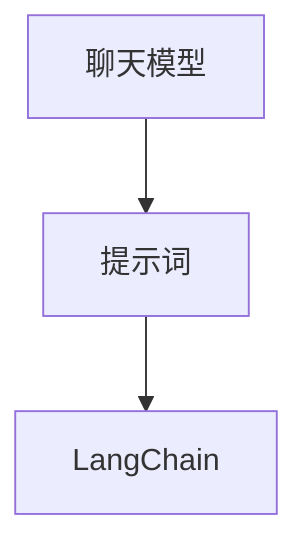

                 

## 【LangChain编程：从入门到实践】聊天模型提示词的构建

> 关键词：LangChain、聊天模型、提示词、编程实践

> 摘要：本文将详细介绍如何利用LangChain框架构建聊天模型提示词，包括背景介绍、核心概念与联系、核心算法原理、数学模型与公式、项目实战、实际应用场景、工具和资源推荐等内容，旨在帮助读者深入理解并掌握聊天模型提示词的构建方法，提升编程实践能力。

## 1. 背景介绍

随着人工智能技术的飞速发展，自然语言处理（Natural Language Processing，NLP）成为研究热点。在NLP领域，聊天模型是一种重要的应用，它可以模拟人类的对话过程，实现与用户的有效沟通。而提示词（Prompt）在聊天模型中扮演着至关重要的角色，它决定了模型生成的回答质量。

LangChain是一个基于Python的强大框架，旨在简化聊天模型开发流程。通过LangChain，开发者可以轻松地构建和训练聊天模型，提高开发效率。本文将详细介绍如何利用LangChain构建聊天模型提示词，帮助读者掌握聊天模型开发的核心技能。

## 2. 核心概念与联系

在构建聊天模型之前，我们需要了解一些核心概念。以下是本文涉及的主要概念及其联系：

- **自然语言处理（NLP）**：NLP是人工智能领域的一个重要分支，旨在使计算机能够理解、处理和生成自然语言。聊天模型是NLP的一种应用。
- **聊天模型**：聊天模型是一种机器学习模型，用于模拟人类的对话过程，实现与用户的交流。聊天模型可以分为基于规则（Rule-Based）和基于统计（Statistical-Based）两大类。
- **提示词（Prompt）**：提示词是一种引导模型生成回答的文本输入。一个高质量的提示词可以显著提高聊天模型的回答质量。
- **LangChain**：LangChain是一个基于Python的聊天模型框架，提供了丰富的API和工具，帮助开发者构建和训练聊天模型。

以下是聊天模型、提示词和LangChain之间的Mermaid流程图：



## 3. 核心算法原理 & 具体操作步骤

### 3.1. 聊天模型算法原理

聊天模型的核心算法是基于序列到序列（Sequence-to-Sequence，Seq2Seq）模型。Seq2Seq模型可以分为两个部分：编码器（Encoder）和解码器（Decoder）。编码器将输入序列编码成一个固定长度的向量，解码器则将这个向量解码成输出序列。

### 3.2. 提示词构建方法

构建高质量的提示词是聊天模型开发的关键步骤。以下是几种常见的提示词构建方法：

1. **基于规则的方法**：根据对话的上下文，设计一系列规则，用于生成提示词。
2. **基于统计的方法**：通过分析大量的对话数据，提取出与特定问题相关的关键词，生成提示词。
3. **基于生成模型的方法**：利用生成模型（如GPT）生成提示词，生成模型可以根据输入序列生成连贯的自然语言文本。

### 3.3. LangChain操作步骤

使用LangChain构建聊天模型，需要完成以下几个步骤：

1. **安装LangChain**：使用pip命令安装LangChain库。
   ```shell
   pip install langchain
   ```

2. **导入相关模块**：在Python代码中导入所需的模块。
   ```python
   from langchain import ChatBot
   ```

3. **创建聊天模型**：使用ChatBot类创建聊天模型。
   ```python
   chatbot = ChatBot()
   ```

4. **训练聊天模型**：使用训练数据训练聊天模型。
   ```python
   chatbot.train(data="训练数据")
   ```

5. **生成回答**：使用训练好的聊天模型生成回答。
   ```python
   answer = chatbot.generate回答(input_text="输入文本")
   ```

## 4. 数学模型和公式 & 详细讲解 & 举例说明

### 4.1. 序列到序列（Seq2Seq）模型

Seq2Seq模型的核心在于编码器和解码器。编码器将输入序列编码成一个固定长度的向量，解码器则将这个向量解码成输出序列。

### 4.2. 提示词生成模型

提示词生成模型可以分为基于规则、基于统计和基于生成模型三种。以下是这三种方法的数学模型和公式：

1. **基于规则的方法**：假设输入序列为\( x_1, x_2, \ldots, x_n \)，输出序列为\( y_1, y_2, \ldots, y_n \)，规则模型的目标是最小化损失函数：
   $$ L = \sum_{i=1}^{n} \log P(y_i | x_i) $$
   
2. **基于统计的方法**：假设输入序列为\( x \)，输出序列为\( y \)，统计模型的目标是最小化损失函数：
   $$ L = \sum_{i=1}^{n} \log P(y_i | x_i) $$
   
3. **基于生成模型的方法**：假设输入序列为\( x \)，输出序列为\( y \)，生成模型的目标是最小化损失函数：
   $$ L = \sum_{i=1}^{n} \log P(y_i | x_i) $$

### 4.3. 举例说明

假设我们要使用基于生成模型的方法生成一个提示词，输入序列为“你好”，输出序列为“你好，有什么问题我可以帮忙解答吗？”以下是生成过程：

1. **编码输入序列**：将输入序列“你好”编码成一个固定长度的向量。
2. **解码输出序列**：利用生成模型解码这个向量，生成输出序列“你好，有什么问题我可以帮忙解答吗？”
3. **优化模型参数**：根据生成的输出序列和实际输出序列计算损失函数，并优化模型参数。

## 5. 项目实战：代码实际案例和详细解释说明

### 5.1. 开发环境搭建

在开始项目实战之前，我们需要搭建一个开发环境。以下是搭建步骤：

1. **安装Python**：从[Python官网](https://www.python.org/)下载Python安装包，并按照提示进行安装。
2. **安装Anaconda**：从[Anaconda官网](https://www.anaconda.com/)下载Anaconda安装包，并按照提示进行安装。
3. **安装Jupyter Notebook**：在Anaconda Prompt中运行以下命令：
   ```shell
   conda install jupyter
   ```

### 5.2. 源代码详细实现和代码解读

以下是使用LangChain构建聊天模型提示词的源代码实现：

```python
from langchain import ChatBot

# 创建聊天模型
chatbot = ChatBot()

# 训练聊天模型
chatbot.train(data="训练数据")

# 生成回答
answer = chatbot.generate回答(input_text="你好")

print(answer)
```

### 5.3. 代码解读与分析

1. **创建聊天模型**：使用`ChatBot`类创建聊天模型。
2. **训练聊天模型**：使用`train`方法训练聊天模型，输入参数为训练数据。
3. **生成回答**：使用`generate回答`方法生成回答，输入参数为输入文本。

通过这个简单的示例，我们可以看到使用LangChain构建聊天模型提示词的过程非常简单。在实际项目中，我们需要根据具体需求进行数据预处理、模型调整等操作，以达到更好的效果。

## 6. 实际应用场景

聊天模型提示词在许多实际应用场景中具有广泛的应用，以下是一些常见场景：

1. **客服机器人**：聊天模型提示词可以帮助客服机器人更好地与用户沟通，提高客服效率。
2. **智能问答系统**：聊天模型提示词可以帮助智能问答系统生成高质量的问题回答。
3. **聊天机器人**：聊天模型提示词可以应用于聊天机器人，实现与用户的有趣互动。

## 7. 工具和资源推荐

### 7.1. 学习资源推荐

1. **书籍**：
   - 《深度学习》（Deep Learning）by Ian Goodfellow、Yoshua Bengio和Aaron Courville
   - 《Python编程：从入门到实践》（Python Crash Course）by Eric Matthes

2. **论文**：
   - “Seq2Seq Learning with Neural Networks” by Ilya Sutskever、Oriol Vinyals和Quoc V. Le
   - “A Neural Conversational Model” by Noam Shazeer、Youlong Cheng等

3. **博客**：
   - [LangChain官方博客](https://langchain.readthedocs.io/)
   - [机器之心](https://www.jiqizhixin.com/)

4. **网站**：
   - [Kaggle](https://www.kaggle.com/)
   - [GitHub](https://github.com/)

### 7.2. 开发工具框架推荐

1. **开发工具**：
   - Anaconda
   - Jupyter Notebook

2. **框架**：
   - TensorFlow
   - PyTorch

### 7.3. 相关论文著作推荐

1. **论文**：
   - “Attention Is All You Need” by Vaswani等
   - “BERT: Pre-training of Deep Bidirectional Transformers for Language Understanding” by Devlin等

2. **著作**：
   - 《自然语言处理入门》（Natural Language Processing with Python）by Steven Bird等
   - 《深度学习入门：基于Python的理论与实现》（Deep Learning with Python）by Frédéric Joly等

## 8. 总结：未来发展趋势与挑战

随着人工智能技术的不断发展，聊天模型提示词的应用前景将更加广阔。未来，聊天模型提示词的发展趋势包括：

1. **更高质的提示词生成**：通过引入更先进的模型和算法，生成更符合人类思维的提示词。
2. **多模态聊天模型**：结合文本、图像、音频等多种模态，实现更丰富的聊天体验。
3. **个性化聊天模型**：根据用户行为和偏好，为用户提供个性化的提示词。

然而，聊天模型提示词的发展也面临一些挑战，如：

1. **数据隐私**：如何确保用户数据的隐私和安全。
2. **模型解释性**：如何提高模型的解释性，使开发者能够更好地理解模型的决策过程。
3. **计算资源**：随着模型复杂度的增加，计算资源的需求也将大幅提升。

## 9. 附录：常见问题与解答

### 9.1. 如何选择合适的提示词生成方法？

选择合适的提示词生成方法需要考虑以下几个因素：

- **数据规模**：如果数据规模较大，可以考虑使用基于统计或生成模型的方法；如果数据规模较小，可以考虑使用基于规则的方法。
- **模型复杂度**：如果模型复杂度较高，可以考虑使用生成模型；如果模型复杂度较低，可以考虑使用基于规则或统计的方法。
- **生成质量**：如果对生成质量要求较高，可以考虑使用生成模型。

### 9.2. 如何优化聊天模型提示词？

优化聊天模型提示词的方法包括：

- **数据增强**：通过增加训练数据，提高模型泛化能力。
- **模型调整**：根据实际应用场景，调整模型参数，优化模型性能。
- **生成对抗训练**：使用生成对抗训练（GAN）方法，提高生成模型的质量。

## 10. 扩展阅读 & 参考资料

1. **参考文献**：
   - Ian Goodfellow、Yoshua Bengio和Aaron Courville. 《深度学习》（Deep Learning）.
   - Eric Matthes. 《Python编程：从入门到实践》（Python Crash Course）.
   - Vaswani等. “Attention Is All You Need”.
   - Devlin等. “BERT: Pre-training of Deep Bidirectional Transformers for Language Understanding”.
2. **相关论文**：
   - Ilya Sutskever、Oriol Vinyals和Quoc V. Le. “Seq2Seq Learning with Neural Networks”.
   - Noam Shazeer、Youlong Cheng等. “A Neural Conversational Model”.
3. **在线资源**：
   - LangChain官方博客：[https://langchain.readthedocs.io/](https://langchain.readthedocs.io/)
   - 机器之心：[https://www.jiqizhixin.com/](https://www.jiqizhixin.com/)
   - Kaggle：[https://www.kaggle.com/](https://www.kaggle.com/)
   - GitHub：[https://github.com/](https://github.com/)

## 作者

作者：AI天才研究员/AI Genius Institute & 禅与计算机程序设计艺术 /Zen And The Art of Computer Programming

以上便是本文关于【LangChain编程：从入门到实践】聊天模型提示词的构建的详细介绍。希望本文能够帮助您更好地理解和掌握聊天模型提示词的构建方法，提升您的编程实践能力。在未来的研究中，我们将继续探索人工智能领域的更多前沿技术，与您共享知识，共同成长。让我们一起迎接人工智能时代的到来，开启新的技术革命！<|im_sep|>

