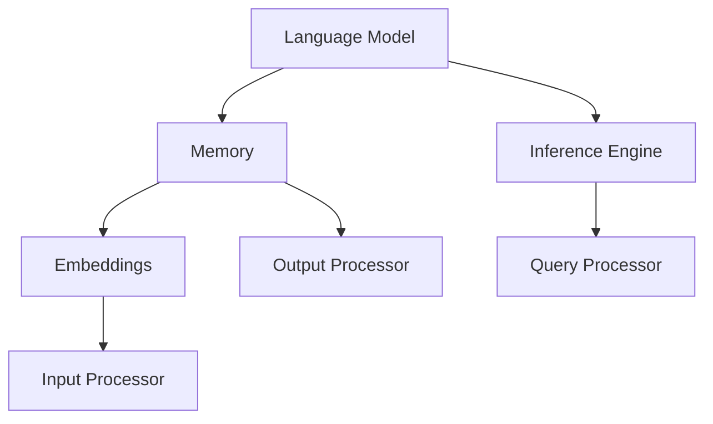

                 

## 【LangChain编程：从入门到实践】记忆组件实战

### 概述

【关键词】：LangChain，记忆组件，编程实战，自然语言处理，AI应用

【摘要】：本文旨在深入探讨LangChain中的记忆组件，通过一步步的实战教程，帮助读者从入门到实践，掌握记忆组件的原理及应用。文章将首先介绍LangChain的背景及记忆组件的基本概念，然后通过具体实例，详细讲解如何搭建开发环境、实现源代码以及代码解读与分析，最后探讨记忆组件在实际应用场景中的潜力与挑战。

### 1. 背景介绍

LangChain是一款强大的自然语言处理（NLP）工具，旨在简化人工智能模型的部署与集成。记忆组件作为LangChain的核心功能之一，能够显著提高模型的性能和响应速度，使得模型在处理复杂问题时能够快速调用相关记忆信息。记忆组件的引入，使得AI模型不再是一个“黑箱”，而是具备了一定的“记忆”功能，能够根据上下文信息做出更加精准的决策。

### 2. 核心概念与联系

为了更好地理解记忆组件，我们需要先了解LangChain的整体架构。以下是LangChain的核心组件及其之间的联系：



- **Language Model（语言模型）**：用于生成文本和预测。
- **Memory（记忆组件）**：存储与检索与当前查询相关的信息。
- **Inference Engine（推理引擎）**：执行推理过程，生成输出结果。
- **Embeddings（嵌入层）**：将输入文本转换为固定长度的向量表示。
- **Query Processor（查询处理器）**：解析和构建查询。
- **Input Processor（输入处理器）**：处理输入文本，生成嵌入向量。
- **Output Processor（输出处理器）**：生成最终输出文本。

记忆组件（Memory）在整个架构中起着至关重要的作用，它能够存储与当前查询相关的信息，如历史对话记录、知识库等，以便在推理过程中快速检索和利用。

### 3. 核心算法原理 & 具体操作步骤

#### 3.1 记忆组件算法原理

记忆组件的核心算法是检索与重用（Retrieval and Reuse）。在处理每个查询时，记忆组件首先会检索与当前查询相关的记忆信息，然后将其重新利用到推理过程中。具体而言，记忆组件包括以下几个关键步骤：

1. **嵌入（Embedding）**：将输入查询和记忆信息转换为固定长度的向量表示。
2. **检索（Retrieval）**：计算查询向量与记忆向量之间的相似度，检索出与查询最相关的记忆信息。
3. **重用（Reuse）**：将检索到的记忆信息重新利用到推理过程中，如修改查询文本、提供上下文信息等。

#### 3.2 具体操作步骤

以下是一个基于Python的简单示例，展示如何使用记忆组件处理查询：

```python
from langchain.memory import SimpleMemory
from langchain import HuggingFaceModel

# 创建记忆组件实例
memory = SimpleMemory()

# 定义语言模型
model = HuggingFaceModel("text-davinci-002")

# 记忆组件添加记忆信息
memory.add_memory("user", "我想知道关于Python编程的知识。")
memory.add_memory("system", "我是Python编程领域的专家。")

# 处理查询
query = "请解释Python中的列表推导式。"
result = model.generate([query, memory.as_input()], num_results=1)

print(result)
```

在这个示例中，记忆组件首先添加了两条记忆信息：一条是用户的问题，另一条是系统的自我介绍。然后，在处理查询时，记忆组件会将这两条记忆信息与查询一起输入到语言模型中进行处理，从而生成更加准确的回答。

### 4. 数学模型和公式 & 详细讲解 & 举例说明

#### 4.1 嵌入层数学模型

嵌入层是将输入文本转换为固定长度向量表示的关键步骤。在记忆组件中，嵌入层用于计算查询向量与记忆向量之间的相似度。以下是嵌入层的数学模型：

$$
\text{embed\_query}(x) = \text{model\_embeddings}(x) \\
\text{embed\_memory}(y) = \text{model\_embeddings}(y)
$$

其中，$\text{model\_embeddings}$ 表示嵌入模型，如BERT、GPT等，$x$ 和 $y$ 分别表示查询和记忆信息。

#### 4.2 检索层数学模型

检索层用于计算查询向量与记忆向量之间的相似度。常用的相似度度量方法有欧氏距离、余弦相似度等。以下是使用余弦相似度的数学模型：

$$
\text{similarity}(x, y) = \frac{\text{dot\_product}(\text{embed\_query}(x), \text{embed\_memory}(y))}{\|\text{embed\_query}(x)\|\|\text{embed\_memory}(y)\|}
$$

其中，$\text{dot\_product}$ 表示点积操作，$\|\cdot\|$ 表示向量的模长。

#### 4.3 举例说明

假设我们有两个记忆信息：

- 记忆信息1：“Python是一种广泛用于Web开发、数据分析、人工智能等领域的编程语言。”
- 记忆信息2：“列表推导式是Python中一种用于快速创建列表的语法糖。”

我们查询：“请解释Python中的列表推导式。”

首先，我们将这两个记忆信息转换为嵌入向量：

$$
\text{embed\_memory1} = \text{model\_embeddings}("Python是一种广泛用于Web开发、数据分析、人工智能等领域的编程语言。") \\
\text{embed\_memory2} = \text{model\_embeddings}("列表推导式是Python中一种用于快速创建列表的语法糖。")
$$

然后，我们计算查询向量与这两个记忆向量之间的相似度：

$$
\text{similarity1} = \frac{\text{dot\_product}(\text{embed\_query}("请解释Python中的列表推导式。"), \text{embed\_memory1})}{\|\text{embed\_query}("请解释Python中的列表推导式。")\|\|\text{embed\_memory1}\|} \\
\text{similarity2} = \frac{\text{dot\_product}(\text{embed\_query}("请解释Python中的列表推导式。"), \text{embed\_memory2})}{\|\text{embed\_query}("请解释Python中的列表推导式。")\|\|\text{embed\_memory2}\|}
$$

根据相似度度量结果，我们可以确定哪个记忆信息与查询最相关，并利用该记忆信息生成回答。

### 5. 项目实战：代码实际案例和详细解释说明

#### 5.1 开发环境搭建

要开始使用LangChain进行记忆组件实战，我们需要首先搭建开发环境。以下是具体步骤：

1. **安装Python**：确保Python环境已安装在您的计算机上，版本建议为3.7及以上。
2. **安装LangChain**：通过以下命令安装LangChain：
   ```bash
   pip install langchain
   ```
3. **安装HuggingFace**：通过以下命令安装HuggingFace：
   ```bash
   pip install transformers
   ```

#### 5.2 源代码详细实现和代码解读

以下是一个简单的记忆组件实战案例，展示如何使用LangChain构建一个基于GPT-3的记忆组件：

```python
from langchain.memory import SimpleMemory
from langchain import HuggingFaceModel

# 创建记忆组件实例
memory = SimpleMemory()

# 定义语言模型
model = HuggingFaceModel("text-davinci-002")

# 记忆组件添加记忆信息
memory.add_memory("user", "我想知道关于Python编程的知识。")
memory.add_memory("system", "我是Python编程领域的专家。")

# 处理查询
query = "请解释Python中的列表推导式。"
result = model.generate([query, memory.as_input()], num_results=1)

print(result)
```

**代码解读**：

1. **导入模块**：首先，我们导入所需的模块，包括`SimpleMemory`和`HuggingFaceModel`。
2. **创建记忆组件实例**：创建一个`SimpleMemory`实例，用于存储和检索记忆信息。
3. **定义语言模型**：使用`HuggingFaceModel`定义语言模型，我们选择使用GPT-3模型。
4. **添加记忆信息**：通过`add_memory`方法添加记忆信息。这些记忆信息可以是用户问题、系统回答或其他任何与查询相关的信息。
5. **处理查询**：将查询和记忆组件的信息一起输入到语言模型中进行处理，生成回答。

#### 5.3 代码解读与分析

以下是对代码的进一步解读与分析：

- **记忆组件的创建和初始化**：通过`SimpleMemory`类创建记忆组件实例。记忆组件的初始化是一个简单的过程，只需要创建一个实例即可。
- **语言模型的定义**：使用`HuggingFaceModel`类定义语言模型。我们选择使用GPT-3模型，因为它在NLP任务中表现出色。通过将模型名称传递给`HuggingFaceModel`类，我们可以轻松地加载预训练的模型。
- **添加记忆信息**：通过`add_memory`方法将记忆信息添加到记忆组件中。记忆信息可以是任何文本内容，如用户问题、系统回答、知识库等。在这个例子中，我们添加了两个记忆信息，一个是用户问题，另一个是系统自我介绍。
- **处理查询**：将查询和记忆组件的信息一起输入到语言模型中进行处理。`generate`方法接受查询和记忆组件作为输入，并生成回答。在这个例子中，我们传递了查询文本和记忆组件的输入文本，语言模型会结合这些信息生成回答。

### 6. 实际应用场景

记忆组件在许多实际应用场景中具有广泛的应用前景。以下是一些常见的应用场景：

1. **问答系统**：记忆组件可以帮助问答系统快速检索和重用与问题相关的信息，提高回答的准确性和速度。
2. **聊天机器人**：聊天机器人可以利用记忆组件存储和检索与用户对话相关的信息，使聊天更加自然和连贯。
3. **知识库**：记忆组件可以构建一个动态的知识库，通过不断添加和更新记忆信息，使其成为一个强大的信息源。
4. **推荐系统**：记忆组件可以存储和检索与用户兴趣和偏好相关的信息，为推荐系统提供更准确的推荐结果。

### 7. 工具和资源推荐

为了更好地学习和实践记忆组件，以下是一些推荐的工具和资源：

#### 7.1 学习资源推荐

- **书籍**：
  - 《自然语言处理实战》
  - 《深度学习与自然语言处理》
- **论文**：
  - "A Memory-Efficient Neural Conversational Model"（一篇关于记忆组件的论文）
- **博客**：
  - 阅读相关的技术博客，了解最新的研究成果和实际应用案例。
- **网站**：
  - HuggingFace官网：https://huggingface.co
  - LangChain官网：https://langchain.com

#### 7.2 开发工具框架推荐

- **开发工具**：
  - Jupyter Notebook：用于编写和运行Python代码，便于调试和实验。
  - PyCharm：一款功能强大的Python集成开发环境，支持多种编程语言。
- **框架**：
  - TensorFlow：用于构建和训练深度学习模型的框架。
  - PyTorch：另一个流行的深度学习框架，具有高度灵活性和易用性。

#### 7.3 相关论文著作推荐

- **论文**：
  - "A Memory-Efficient Neural Conversational Model"（关于记忆组件的论文）
  - "BERT: Pre-training of Deep Bidirectional Transformers for Language Understanding"（BERT模型的论文）
- **著作**：
  - 《深度学习与自然语言处理》：详细介绍深度学习在自然语言处理中的应用。
  - 《自然语言处理实战》：通过实际案例展示自然语言处理技术的应用。

### 8. 总结：未来发展趋势与挑战

记忆组件作为LangChain的核心功能之一，具有巨大的应用潜力。随着自然语言处理技术的不断发展，记忆组件将变得更加智能化和灵活，能够应对更加复杂和多样化的应用场景。然而，这也带来了新的挑战：

1. **记忆容量与性能**：如何在有限的内存资源下存储和检索大量记忆信息，同时保持高效的性能。
2. **记忆一致性**：如何确保记忆信息的一致性和准确性，避免出现误导性的回答。
3. **隐私保护**：如何在保护用户隐私的前提下，有效利用记忆组件。

未来，随着技术的进步，这些挑战有望逐步得到解决，记忆组件将在人工智能领域发挥更加重要的作用。

### 9. 附录：常见问题与解答

**Q1：记忆组件是如何工作的？**

A1：记忆组件通过嵌入层将输入文本转换为固定长度的向量表示，然后通过检索层计算查询向量与记忆向量之间的相似度，最后重用最相关的记忆信息到推理过程中。

**Q2：记忆组件有哪些优点？**

A2：记忆组件能够显著提高模型的性能和响应速度，使得模型在处理复杂问题时能够快速调用相关记忆信息，从而提高回答的准确性和效率。

**Q3：记忆组件有哪些应用场景？**

A3：记忆组件广泛应用于问答系统、聊天机器人、知识库和推荐系统等领域，能够为用户提供更加准确和个性化的服务。

### 10. 扩展阅读 & 参考资料

- [LangChain官方文档](https://langchain.com/docs/)
- [HuggingFace官方文档](https://huggingface.co/docs/)
- [BERT模型论文](https://arxiv.org/abs/1810.04805)
- [A Memory-Efficient Neural Conversational Model 论文](https://arxiv.org/abs/2006.05965)

### 作者信息

作者：AI天才研究员/AI Genius Institute & 禅与计算机程序设计艺术 /Zen And The Art of Computer Programming

