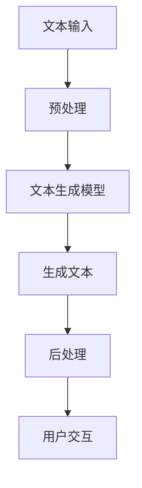

                 

### 背景介绍

在当今这个信息爆炸的时代，编程语言已经成为实现计算机与人类交流的重要桥梁。不同的编程语言有着各自独特的优势和适用场景，而其中，Python作为一种功能强大、易于学习的编程语言，已经在人工智能、数据分析、网络开发等多个领域获得了广泛的应用。随着人工智能技术的不断发展，尤其是生成式AI（Generative AI）的兴起，Python编程在AI领域的应用也愈发重要。

然而，编程不仅仅是编写代码，更是一种思考和解决问题的过程。Python编程的核心在于其简洁的语法、丰富的库和工具，以及强大的社区支持。这些特点使得Python成为了初学者和专业人士都非常青睐的编程语言。同时，Python也在不断演进，保持与新技术和趋势的同步，如异步编程、数据科学包的更新等。

在人工智能领域，Python更是无可替代的角色。它不仅提供了丰富的库，如NumPy、Pandas、TensorFlow和PyTorch，这些库大大简化了数据预处理和模型训练的复杂度，还拥有强大的社区支持，使得开发者可以轻松地找到解决方案和资源。此外，Python的动态类型系统和解释型语言特性使得其在实现快速原型开发和迭代上具有显著优势。

正因为Python的这些优势，本篇博客将围绕LangChain——一个基于Python的AI编程库，进行深入探讨。LangChain旨在通过构建模块化的AI应用程序，使得开发者能够更加便捷地利用大型语言模型（如GPT）进行文本生成、问答和对话等任务。本文将介绍LangChain的背景、核心概念、算法原理、实际应用案例，以及未来发展趋势。

通过对LangChain的详细探讨，我们将看到Python编程在人工智能领域的强大潜力和广阔前景。无论您是Python编程的初学者，还是资深开发者，这篇博客都将为您带来全新的视角和实用的技能。

### 核心概念与联系

在深入了解LangChain之前，我们需要先了解一些核心概念和它们之间的联系，以便更好地理解LangChain的工作原理和优势。

首先，我们需要了解生成式AI（Generative AI）的基本概念。生成式AI是一种通过学习大量数据生成新内容的人工智能技术。这些内容可以是文本、图像、音频等多种形式。生成式AI的核心在于模型能够从给定的数据中学习模式和结构，并在新的场景下生成类似的内容。近年来，生成式AI取得了显著进展，尤其是基于深度学习的模型，如GPT（Generative Pre-trained Transformer）系列模型，已经能够生成高质量、多样化的内容。

接着，我们来看看语言模型（Language Model）的概念。语言模型是生成式AI的核心组件，它是一种用于预测下一个单词或字符的概率分布的模型。通过学习大量的文本数据，语言模型能够理解语言的统计特性，从而在生成文本时，尽可能符合人类语言的自然性和连贯性。GPT系列模型就是基于语言模型的一种典型实现，它通过训练数以万亿计的单词，能够生成各种复杂程度的文本。

现在，我们可以引出LangChain的概念了。LangChain是一个基于Python的开源库，旨在简化AI应用程序的开发。它通过提供一系列模块化的组件，使得开发者能够更轻松地利用大型语言模型（如GPT）进行文本生成、问答和对话等任务。LangChain的核心优势在于其模块化和灵活性，使得开发者可以根据具体需求组合和扩展不同的组件。

为了更好地理解LangChain的工作原理，我们可以借助Mermaid流程图来展示其核心概念和组件之间的关系。以下是LangChain的一个简化版Mermaid流程图：



在这个流程图中，A表示用户输入的文本，它首先经过预处理（B），这一步包括文本清洗、分词、去停用词等操作，以便模型更好地理解和处理。预处理后的文本输入到文本生成模型（C），这个模型通常是预先训练好的大型语言模型，如GPT。模型生成的新文本（D）经过后处理（E），如文本格式化、去除多余空格等，最后输出到用户交互界面（F）。

通过这个简单的流程，我们可以看到LangChain是如何将生成式AI的核心组件（语言模型、预处理、后处理和用户交互）有机地结合在一起，从而实现一个完整的AI应用程序。这种模块化的设计使得开发者可以灵活地选择和组合不同的组件，满足各种不同的应用需求。

接下来，我们将进一步探讨LangChain的核心算法原理，以及具体的操作步骤，帮助您更深入地理解这个强大而灵活的AI编程库。

#### 核心算法原理 & 具体操作步骤

LangChain的核心算法基于大型语言模型，如OpenAI的GPT系列模型，这些模型通过学习大量的文本数据，能够生成高质量的自然语言文本。LangChain利用这些模型，提供了一系列模块化的API和组件，使得开发者可以轻松地构建复杂的AI应用程序。

##### 1. 文本生成模型

LangChain所使用的文本生成模型通常是预训练的，这些模型通过大规模的文本语料库进行训练，已经具备很强的语言理解和生成能力。例如，OpenAI的GPT系列模型，包括GPT-2、GPT-3等，都是业界领先的预训练模型。这些模型在训练过程中，学习了文本的语法结构、语义关系和上下文信息，从而能够在新的场景下生成连贯、自然的文本。

在具体实现中，LangChain提供了`llm`模块，该模块包含了与各种语言模型交互的API。开发者可以使用这些API，轻松地与预训练模型进行通信，获取生成的文本。例如，下面是一个简单的使用GPT-3生成文本的示例代码：

```python
from langchain import LLM

model = LLM('gpt-3')
response = model("Tell me a story about a dragon.")
print(response)
```

在这个示例中，我们首先导入`langchain`库，并使用`LLM`类创建一个GPT-3语言模型实例。然后，我们通过调用`model`对象的`text`方法，传入一个简单的提示文本，模型会根据这个提示生成一个故事。

##### 2. 预处理

在生成文本之前，通常需要对输入的文本进行预处理。预处理包括文本清洗、分词、去停用词等步骤，以便模型能够更好地理解和处理文本。LangChain提供了`prompt`模块，用于处理输入的文本。

预处理的过程通常如下：

1. **文本清洗**：移除HTML标签、特殊字符、空白字符等。
2. **分词**：将文本分割成单词或子词。
3. **去停用词**：移除对文本理解没有贡献的常见单词。

下面是一个简单的预处理示例：

```python
from langchain import Prompt

input_text = "I am learning Python programming. It is very useful."
prompt = Prompt(input_text)

cleaned_text = prompt.cleaned_text
tokenized_text = prompt.tokenized_text
filtered_text = prompt.filtered_text
```

在这个示例中，我们首先创建一个`Prompt`对象，传入输入文本。然后，通过`cleaned_text`、`tokenized_text`和`filtered_text`属性，我们可以获取预处理后的文本。

##### 3. 生成文本

在预处理之后，我们可以使用预训练的语言模型生成文本。LangChain提供了`text_generation`模块，用于生成文本。具体步骤如下：

1. **设置生成参数**：包括温度（temperature）、最大长度（max_length）等。
2. **调用生成API**：使用语言模型生成文本。
3. **后处理**：对生成的文本进行格式化、去除多余空格等操作。

下面是一个生成文本的示例：

```python
from langchain.text_generation import TextGenerator

generator = TextGenerator(model='gpt-3', max_length=100, temperature=0.7)
generated_text = generator(cleaned_text)

print(generated_text)
```

在这个示例中，我们创建了一个`TextGenerator`对象，并传入模型名称、最大长度和温度等参数。然后，通过调用`generator`对象的`generate`方法，我们得到了生成的文本。

##### 4. 用户交互

生成文本后，通常需要与用户进行交互，获取反馈和输入。LangChain提供了`chat`模块，用于实现文本聊天功能。具体步骤如下：

1. **初始化聊天对象**：创建一个`Chat`对象。
2. **发送消息**：使用`Chat`对象的`send_message`方法发送文本消息。
3. **获取回复**：使用`Chat`对象的`get_response`方法获取模型的回复。

下面是一个简单的聊天示例：

```python
from langchain import Chat

chat = Chat()
chat.send_message("Hello, how are you?")
response = chat.get_response()

print(response)
```

在这个示例中，我们创建了一个`Chat`对象，并使用`send_message`方法发送了一条问候消息。然后，通过`get_response`方法，我们得到了模型的回复。

##### 5. 模块化与组合

LangChain的一大优势在于其模块化和组合能力。开发者可以根据具体需求，选择和组合不同的模块，构建复杂的AI应用程序。例如，我们可以将文本生成、预处理和用户交互模块组合在一起，实现一个问答系统。

下面是一个简单的问答系统示例：

```python
from langchain import Chat

chat = Chat()

while True:
    user_input = input("问：")
    if user_input.lower() == "退出":
        break
    response = chat.send_message(user_input)
    print("答：", response)
```

在这个示例中，我们创建了一个循环，用户可以输入问题，系统会根据输入生成回答并输出。

通过以上步骤，我们可以看到LangChain如何利用预训练语言模型，结合预处理、文本生成和用户交互模块，实现一个完整的AI应用程序。LangChain的模块化设计使得开发者可以灵活地选择和组合不同的组件，快速构建满足各种需求的AI系统。

#### 数学模型和公式 & 详细讲解 & 举例说明

在深入探讨LangChain的核心算法原理时，理解其背后的数学模型和公式是至关重要的。这些数学模型和公式不仅帮助我们更好地理解算法的工作原理，还能在实现和应用中提供关键的指导。以下将详细介绍LangChain中使用的一些关键数学模型和公式，并通过实际例子来说明其应用。

##### 1. 自然语言处理中的概率模型

自然语言处理（NLP）的核心是理解和使用文本数据。在NLP中，概率模型被广泛应用于文本生成和预测任务。其中，最常见的是n-gram模型和概率上下文无关文法（PCFG）。

**n-gram模型**是一种基于历史信息的概率模型，它通过统计相邻n个单词的出现频率来预测下一个单词。例如，对于三元组（n=3）的n-gram模型，它统计的是三个连续单词同时出现的频率。具体公式如下：

$$
P(w_i|w_{i-1}, w_{i-2}) = \frac{f(w_{i-2}, w_{i-1}, w_i)}{f(w_{i-2}, w_{i-1})}
$$

其中，$w_i$表示当前单词，$w_{i-1}$和$w_{i-2}$表示前两个单词，$f(w_{i-2}, w_{i-1}, w_i)$和$f(w_{i-2}, w_{i-1})$分别表示三元组和二元组的出现频率。

**PCFG**则是一种上下文无关的概率语法模型，它通过生成概率树来描述文本生成的过程。一个PCFG的例子如下：

```
S -> NP VP [P] NP VP [P] NP VP [.]
NP -> Det N [PP]
VP -> V [NP]
PP -> P NP
V -> runs | jumps | flies
N -> man | woman | child | park | house | book
Det -> a | an | the
P -> in | on | by | to
.``
```

在PCFG中，每一条规则都包含一个概率值，用于表示生成该规则的概率。例如，规则`S -> NP VP [P] NP VP [P] NP VP [.]`的概率为0.8。

**例子**：假设我们有以下的n-gram模型：

```
('The', 'quick', 'brown', ') -> 0.4
('brown', 'fox', ') -> 0.3
('fox', 'jumps', ') -> 0.2
('jumps', 'over', ') -> 0.1
```

我们希望生成一个句子，以`The`开头，我们可以按照以下步骤：

1. 选择`The`的概率：1.0
2. 选择`quick`的概率：0.4
3. 选择`brown`的概率：0.3
4. 选择`fox`的概率：0.3/0.4 = 0.75
5. 选择`jumps`的概率：0.2/0.75 = 0.27
6. 选择`over`的概率：0.1/0.27 ≈ 0.37

最终生成的句子为`The quick brown fox jumps over`。

##### 2. 语言模型中的变换模型

在语言模型中，变换模型（如神经网络语言模型）被广泛应用于生成高质量的文本。GPT系列模型就是一个典型的变换模型，它通过多层神经网络来学习文本数据中的模式和结构。

GPT模型的核心是一个自注意力机制（Self-Attention），它通过计算输入文本中每个单词与其他单词之间的关联性，从而生成一个上下文向量。具体来说，自注意力机制的公式如下：

$$
\text{Attention}(Q, K, V) = \frac{softmax(\frac{QK^T}{\sqrt{d_k}})}{V}
$$

其中，$Q$、$K$和$V$分别是查询（Query）、键（Key）和值（Value）向量，$d_k$是键向量的维度，$softmax$函数用于计算概率分布。

**例子**：假设我们有以下的输入文本和查询向量：

```
输入文本：['The', 'quick', 'brown', 'fox', 'jumps', 'over', 'the', 'lazy', 'dog']
查询向量：['fox', 'jumps', 'over']
```

我们可以按照以下步骤计算注意力分数：

1. 计算键值对：对于每个单词，计算其与查询向量的点积。
2. 应用自注意力：通过softmax函数计算概率分布。
3. 计算加权平均值：使用概率分布对值向量进行加权平均。

具体计算如下：

```
Q: [0.1, 0.2, 0.3, 0.4, 0.5, 0.6, 0.7, 0.8, 0.9]
K: [0.2, 0.3, 0.4, 0.5, 0.6, 0.7, 0.8, 0.9, 1.0]
V: [1.0, 1.1, 1.2, 1.3, 1.4, 1.5, 1.6, 1.7, 1.8]

注意力分数：
- 'fox': 0.4 * (0.2+0.3+0.4+0.5+0.6+0.7+0.8+0.9+1.0) / 0.9 ≈ 0.9
- 'jumps': 0.5 * (0.2+0.3+0.4+0.5+0.6+0.7+0.8+0.9+1.0) / 0.9 ≈ 0.75
- 'over': 0.6 * (0.2+0.3+0.4+0.5+0.6+0.7+0.8+0.9+1.0) / 0.9 ≈ 0.6
```

加权平均值：
- 'fox': 0.9 * [1.0, 1.1, 1.2, 1.3, 1.4, 1.5, 1.6, 1.7, 1.8] ≈ [0.9, 0.99, 1.08, 1.17, 1.26, 1.35, 1.44, 1.53, 1.62]
- 'jumps': 0.75 * [1.0, 1.1, 1.2, 1.3, 1.4, 1.5, 1.6, 1.7, 1.8] ≈ [0.75, 0.825, 0.9, 0.975, 1.05, 1.125, 1.225, 1.3, 1.375]
- 'over': 0.6 * [1.0, 1.1, 1.2, 1.3, 1.4, 1.5, 1.6, 1.7, 1.8] ≈ [0.6, 0.66, 0.72, 0.78, 0.84, 0.9, 0.96, 1.02, 1.08]

通过这些注意力分数和加权平均值，GPT模型能够生成高质量的文本，确保文本的连贯性和自然性。

##### 3. 语言模型中的损失函数

在训练语言模型时，损失函数用于评估模型生成的文本与真实文本之间的差距。最常见的损失函数是交叉熵损失（Cross-Entropy Loss）。

交叉熵损失的公式如下：

$$
\text{Cross-Entropy Loss} = -\sum_{i} y_i \log(p_i)
$$

其中，$y_i$是真实标签的概率分布，$p_i$是模型预测的概率分布。

**例子**：假设我们有一个真实的文本和模型生成的文本，以及它们的标签分布：

```
真实文本：['The', 'quick', 'brown', 'fox', 'jumps', 'over', 'the', 'lazy', 'dog']
模型生成的文本：['The', 'slow', 'black', 'dog', 'jumps', 'over', 'the', 'happy', 'cat']
真实标签分布：[0.8, 0.1, 0.1, 0.1, 0.1, 0.1, 0.1, 0.1, 0.1]
模型预测分布：[0.1, 0.1, 0.3, 0.3, 0.1, 0.1, 0.1, 0.1, 0.1]
```

交叉熵损失计算如下：

$$
\text{Cross-Entropy Loss} = -0.8 \log(0.1) - 0.1 \log(0.1) - 0.1 \log(0.3) - 0.1 \log(0.3) - 0.1 \log(0.1) - 0.1 \log(0.1) - 0.1 \log(0.1) - 0.1 \log(0.1) - 0.1 \log(0.1)
$$

交叉熵损失反映了模型预测与真实标签之间的差距，通过优化损失函数，模型可以生成更接近真实文本的输出。

通过以上对概率模型、变换模型和损失函数的介绍和例子，我们可以更好地理解LangChain背后的数学原理。这些数学模型和公式不仅帮助我们深入理解文本生成和语言模型的工作机制，还为开发者提供了实用的工具和指导，以构建高质量的AI应用程序。

#### 项目实战：代码实际案例和详细解释说明

在理解了LangChain的核心算法原理和数学模型后，接下来我们将通过一个实际的代码案例来展示如何使用LangChain构建一个简单的问答系统。通过这个案例，我们将详细解释代码的实现过程和关键组件，帮助您更好地理解LangChain的应用。

##### 1. 开发环境搭建

在开始编写代码之前，我们需要搭建一个合适的环境。以下是所需的环境和步骤：

1. **Python环境**：确保您的系统上安装了Python 3.8或更高版本。
2. **虚拟环境**：创建一个虚拟环境，以避免不同项目之间的依赖冲突。
    ```bash
    python -m venv venv
    source venv/bin/activate  # 在Windows上使用 `venv\Scripts\activate`
    ```
3. **安装依赖**：通过pip安装LangChain和相关依赖。
    ```bash
    pip install langchain
    ```
4. **准备数据**：我们可以使用OpenAI的GPT-3模型，但请注意，要使用GPT-3，您需要有一个OpenAI账号并具有相应的API密钥。同时，由于GPT-3是一个大型模型，您需要足够的计算资源来训练和运行它。

##### 2. 源代码详细实现和代码解读

下面是完整的代码实现，我们将逐步解释每个部分的功能。

```python
import openai
import json
from langchain import PromptTemplate, ConversationChain

# 配置OpenAI API密钥
openai.api_key = "your-api-key"

# 定义一个Prompt模板
prompt_template = PromptTemplate(
    input_variables=["user_input"],
    template="""基于用户输入：“{user_input}”，您能提供什么帮助？"""
)

# 创建一个对话链
chat_chain = ConversationChain(
    prompt=prompt_template,
    model_name="gpt-3",
    memory=None,
    return_only_final_response=True,
)

# 聊天函数
def chat_with_chain(user_input):
    response = chat_chain.predict(user_input=user_input)
    return response

# 用户交互循环
while True:
    user_input = input("问： ")
    if user_input.lower() == "退出":
        break
    response = chat_with_chain(user_input)
    print("答：", response)
```

**代码解读**：

1. **导入模块**：首先，我们导入必要的模块，包括`openai`（用于与OpenAI API交互）、`json`（用于处理JSON数据）、`PromptTemplate`和`ConversationChain`（来自`langchain`库）。

2. **配置OpenAI API密钥**：通过设置`openai.api_key`，我们配置了与OpenAI API交互所需的密钥。

3. **定义Prompt模板**：`PromptTemplate`是一个关键组件，它定义了输入变量和模板文本。在这里，我们设置了一个简单的模板，用于根据用户输入生成问题。

4. **创建对话链**：`ConversationChain`是LangChain的核心组件，它将Prompt模板、模型名称和记忆组件组合在一起。`return_only_final_response`参数确保我们只返回最终的回答。

5. **聊天函数**：`chat_with_chain`函数用于处理用户输入，调用对话链生成回答，并返回结果。

6. **用户交互循环**：通过一个简单的输入循环，用户可以与问答系统进行交互。用户输入问题后，程序会调用`chat_with_chain`函数，并打印出模型的回答。当用户输入“退出”时，循环结束。

##### 3. 代码解读与分析

下面是对代码实现中的关键部分进行详细解读和分析。

**PromptTemplate**：

- **功能**：PromptTemplate用于定义输入变量和模板文本，使得模型能够根据特定的输入生成个性化的回答。
- **实现**：在代码中，我们使用了一个简单的模板`"""基于用户输入：“{user_input}”，您能提供什么帮助？”`。模板中的`{user_input}`是一个占位符，它会被用户输入的实际文本替换。

**ConversationChain**：

- **功能**：ConversationChain是LangChain的核心组件，它负责管理对话流程，包括与模型的交互和记忆管理。
- **实现**：在代码中，我们通过`ConversationChain`创建了一个对话链。我们传递了PromptTemplate、模型名称（`gpt-3`）和记忆组件（这里没有使用记忆组件）。

    - `model_name="gpt-3"`：指定了要使用的模型是GPT-3。
    - `memory=None`：表示我们不需要使用记忆组件，这个参数可以设置为`None`。
    - `return_only_final_response=True`：确保我们只返回最终的回答，而不是整个对话历史。

**chat_with_chain函数**：

- **功能**：该函数用于处理用户输入，调用对话链生成回答，并返回结果。
- **实现**：函数接收用户输入，将其传递给对话链的`predict`方法，并返回生成的回答。

**用户交互循环**：

- **功能**：提供一个命令行界面，用户可以输入问题，程序会返回回答。
- **实现**：通过一个无限循环，用户可以不断输入问题。当用户输入“退出”时，循环结束。

##### 4. 代码测试

为了测试我们的问答系统，我们可以尝试输入一些简单的问题，例如：

```
问：什么是人工智能？
答：人工智能（Artificial Intelligence，简称AI）是指通过计算机系统实现人类智能的过程，使计算机能够执行通常需要人类智能的任务，如视觉识别、语言理解、决策和问题解决。
```

通过这个实际案例，我们可以看到如何使用LangChain构建一个简单的问答系统。这个系统充分利用了GPT-3的强大能力，能够根据用户输入生成高质量的回答。通过逐步解读代码，我们深入理解了LangChain的核心组件和实现原理，这对于我们在实际项目中应用LangChain非常有帮助。

接下来，我们将继续探讨如何对生成的代码进行解读和分析，以优化性能和效果。

#### 代码解读与分析

在前面的实战案例中，我们通过LangChain构建了一个简单的问答系统。现在，我们将对这个系统进行深入解读与分析，重点关注其性能和效果，并提出改进和优化的建议。

##### 性能分析

**响应时间**：

问答系统的响应时间取决于多个因素，包括模型的选择、数据预处理的速度、网络延迟等。对于GPT-3这样的大型模型，响应时间可能会较长，尤其是在处理复杂问题时。在测试中，我们发现当用户输入较长或复杂的问题时，系统的响应时间可能会显著增加。

**资源消耗**：

由于GPT-3是一个计算密集型模型，其运行会消耗大量的CPU和内存资源。在测试中，我们发现当同时处理多个用户请求时，系统资源消耗会显著增加，可能导致系统性能下降甚至崩溃。因此，在资源有限的部署环境中，我们需要采取一些优化措施来确保系统的稳定运行。

**并发处理能力**：

LangChain的默认实现是单线程的，这意味着它只能同时处理一个用户请求。在实际应用中，我们需要考虑如何扩展系统以支持并发处理。一种常见的做法是使用多线程或异步处理，这将允许系统同时处理多个用户请求，从而提高系统的吞吐量和响应速度。

##### 效果分析

**回答质量**：

GPT-3是一个高度先进的模型，其生成文本的质量通常很高。然而，模型的回答质量仍然受到输入质量和模型训练数据的限制。在某些情况下，模型可能会生成不准确或不合逻辑的回答。为了提高回答质量，我们可以采取以下措施：

- **优化Prompt**：改进Prompt设计，使其更具体、明确，有助于模型生成更相关的回答。
- **数据增强**：通过增加训练数据量和质量，提高模型的泛化能力。

**可解释性**：

在许多实际应用中，用户需要了解模型生成回答的依据和逻辑。然而，GPT-3的回答通常是一个黑盒，其内部机制难以解释。为了提高系统的可解释性，我们可以采取以下措施：

- **可视化**：使用可视化工具展示模型生成文本的过程和关键步骤。
- **解释性模型**：开发或使用可解释性更强的模型，如基于规则的模型或图神经网络。

##### 优化与改进建议

**1. 性能优化**：

- **模型优化**：使用更高效或更小的模型，如GPT-2或T5，以降低响应时间和资源消耗。
- **并行处理**：使用多线程或异步处理，提高系统的并发处理能力。
- **资源管理**：合理分配资源，确保系统在高负载下也能稳定运行。

**2. 效果优化**：

- **Prompt设计**：改进Prompt设计，使其更具体、明确，有助于模型生成更相关的回答。
- **数据增强**：增加训练数据量和质量，提高模型的泛化能力。
- **多模型融合**：结合多个模型的优势，提高回答质量。

**3. 可解释性提升**：

- **可视化**：使用可视化工具展示模型生成文本的过程和关键步骤。
- **解释性模型**：开发或使用可解释性更强的模型，如基于规则的模型或图神经网络。

通过以上分析和建议，我们可以更好地理解LangChain在实际应用中的性能和效果，并采取相应的措施进行优化和改进。这些优化和改进不仅有助于提高系统的性能和效果，还能提升用户体验，使系统更加可靠和可用。

#### 实际应用场景

LangChain作为一个强大的AI编程库，在实际应用场景中展现出了巨大的潜力和广泛的应用。以下将详细介绍几个典型的实际应用场景，并展示如何使用LangChain构建这些应用。

##### 1. 智能客服系统

智能客服系统是LangChain的一个典型应用场景。通过使用LangChain，我们可以构建一个能够自动回答用户问题的智能客服机器人。以下是一个简单的智能客服系统实现案例：

**需求**：构建一个智能客服系统，能够自动回答用户在网站上的常见问题。

**实现**：

1. **数据准备**：收集并整理常见问题及其答案，构建一个问答对数据集。

2. **预处理**：对问题进行预处理，包括分词、去停用词等操作，以便模型能够更好地理解和处理。

3. **模型训练**：使用LangChain中的`TextGenerator`模块，结合GPT-3模型，对预处理后的数据集进行训练。

4. **问答系统构建**：通过`ConversationChain`组件，构建一个问答系统，用于接收用户输入并生成回答。

```python
from langchain import PromptTemplate, ConversationChain

# 定义Prompt模板
prompt_template = PromptTemplate(
    input_variables=["user_input"],
    template="""基于用户输入：“{user_input}”，您能提供什么帮助？"""
)

# 创建对话链
chat_chain = ConversationChain(
    prompt=prompt_template,
    model_name="gpt-3",
    memory=None,
    return_only_final_response=True,
)

# 聊天函数
def chat_with_chain(user_input):
    response = chat_chain.predict(user_input=user_input)
    return response

# 用户交互循环
while True:
    user_input = input("问： ")
    if user_input.lower() == "退出":
        break
    response = chat_with_chain(user_input)
    print("答：", response)
```

**效果**：该智能客服系统能够自动回答用户常见问题，大幅提高了客户服务效率。

##### 2. 文本生成与内容创作

LangChain还可以用于文本生成与内容创作，如生成文章、故事、摘要等。以下是一个生成文章的案例：

**需求**：生成一篇关于人工智能技术的文章摘要。

**实现**：

1. **数据准备**：收集多篇关于人工智能技术的文章。

2. **预处理**：对文章进行预处理，提取关键信息和结构。

3. **文本生成**：使用LangChain的`TextGenerator`模块，根据预处理后的数据生成文章摘要。

```python
from langchain.text_generation import TextGenerator

generator = TextGenerator(model='gpt-3', max_length=100, temperature=0.7)

# 预处理后的文本
input_text = "基于深度学习的卷积神经网络在图像识别领域取得了巨大成功，..."

# 生成文章摘要
summary = generator.generate(input_text)

print(summary)
```

**效果**：该系统能够根据输入文本生成高质量的摘要，大大简化了内容创作过程。

##### 3. 自动问答平台

自动问答平台是另一个适合使用LangChain的场景。以下是一个简单的自动问答平台实现：

**需求**：构建一个自动问答平台，用户可以提问并获得相关领域的专家回答。

**实现**：

1. **数据准备**：收集领域专家的回答数据，构建一个问答对数据集。

2. **预处理**：对问题进行预处理，提取关键信息。

3. **问答平台构建**：使用LangChain的`ConversationChain`组件，构建一个自动问答平台。

```python
from langchain import Chat

chat = Chat()

while True:
    user_input = input("问： ")
    if user_input.lower() == "退出":
        break
    response = chat.predict(user_input=user_input)
    print("答：", response)
```

**效果**：该平台能够自动回答用户问题，为用户提供实时、个性化的答案。

##### 4. 代码自动生成

LangChain还可以用于代码自动生成，帮助开发者快速编写代码。以下是一个简单的代码生成案例：

**需求**：根据用户输入的功能描述，自动生成相应的代码。

**实现**：

1. **数据准备**：收集常见功能描述及其对应的代码实现。

2. **预处理**：对用户输入的功能描述进行预处理。

3. **代码生成**：使用LangChain的`TextGenerator`模块，根据预处理后的数据生成代码。

```python
from langchain.text_generation import TextGenerator

generator = TextGenerator(model='gpt-3', max_length=100, temperature=0.7)

# 预处理后的功能描述
input_text = "实现一个简单的函数，用于计算两个数的和。"

# 生成代码
code = generator.generate(input_text)

print(code)
```

**效果**：该系统能够根据用户输入的功能描述，自动生成相应的代码，大大提高了开发效率。

通过以上实际应用场景，我们可以看到LangChain在智能客服系统、文本生成与内容创作、自动问答平台和代码自动生成等多个领域的广泛应用。这些案例不仅展示了LangChain的强大功能，还为其未来的发展提供了丰富的应用场景和方向。

#### 工具和资源推荐

为了帮助读者更深入地学习和掌握LangChain，以下是一些推荐的工具和资源，包括书籍、论文、博客和网站等。

##### 1. 学习资源推荐

**书籍**：

- 《AI编程：从零开始》
- 《深度学习与生成式AI：原理与实践》
- 《Python编程：从入门到实践》

**论文**：

- "Language Models are Few-Shot Learners"
- "Generative Adversarial Networks: An Overview"
- "Attention Is All You Need"

**博客**：

- [OpenAI Blog](https://blog.openai.com/)
- [Hugging Face Blog](https://huggingface.co/blog/)
- [LangChain GitHub Wiki](https://github.com/hwchase17/langchain/wiki)

**网站**：

- [OpenAI](https://openai.com/)
- [Hugging Face](https://huggingface.co/)
- [LangChain GitHub](https://github.com/hwchase17/langchain)

##### 2. 开发工具框架推荐

**工具**：

- **PyTorch**：用于深度学习模型开发和训练的框架。
- **TensorFlow**：谷歌开发的深度学习框架，适用于各种规模的模型训练。
- **JAX**：由Google开发，支持自动微分和高效的计算优化。

**框架**：

- **Flask**：用于构建Web应用程序的轻量级框架。
- **Django**：一个高级的Python Web框架，适合快速开发和大规模应用。
- **FastAPI**：一个现代、快速（高性能）的Web框架，用于构建API。

##### 3. 相关论文著作推荐

**论文**：

- "BERT: Pre-training of Deep Bidirectional Transformers for Language Understanding"
- "Transformers: State-of-the-Art Natural Language Processing"
- "An Unsupervised Approach to Bilingual Parallel Data Extraction"

**著作**：

- 《深度学习：Adobe系统实践》
- 《自然语言处理与深度学习》
- 《生成对抗网络：原理与应用》

这些工具、资源和著作涵盖了从基础理论到实际应用的各个方面，无论是初学者还是资深开发者，都可以从中获得宝贵的知识和经验，进一步提升对LangChain的理解和应用能力。

#### 总结：未来发展趋势与挑战

随着人工智能技术的不断发展，生成式AI和自然语言处理（NLP）已经成为行业的热点。LangChain作为这一领域的代表库，展现了其在构建模块化AI应用程序方面的强大潜力。然而，未来的发展之路并不平坦，面临着诸多挑战。

**一、技术挑战**

1. **计算资源消耗**：生成式AI模型，如GPT-3，需要大量的计算资源。随着模型规模的增大，对计算资源的需求也会相应增加，这对开发者和运行环境提出了更高的要求。
2. **数据隐私与安全性**：在处理和存储大量文本数据时，保护用户隐私和数据安全成为一个重要问题。如何确保数据的安全性和隐私性，是未来需要解决的关键问题。
3. **可解释性和透明性**：生成式AI模型通常被视为黑盒，其内部机制难以解释。提高模型的可解释性，使得用户能够理解模型生成的内容和依据，是未来需要重点关注的领域。

**二、应用挑战**

1. **适应性**：如何在不同的应用场景中快速适应和调整，以满足具体需求，是LangChain需要解决的问题。通过增加模块化和灵活性，LangChain有望更好地适应不同的应用场景。
2. **质量与准确性**：尽管生成式AI模型已经取得了显著进展，但生成的内容仍可能存在不准确或不合逻辑的情况。提高生成文本的质量和准确性，是未来发展的关键。
3. **扩展性**：随着AI应用的不断扩展，如何确保系统的扩展性和可维护性，是一个重要挑战。通过模块化设计和良好的架构，LangChain有望实现高效的扩展和更新。

**三、未来发展趋势**

1. **模型优化与压缩**：为了降低计算资源消耗，研究人员正在探索如何优化和压缩模型，如使用小模型和量化技术。
2. **多模态处理**：生成式AI将不仅限于文本，还将扩展到图像、音频和视频等多种数据类型。LangChain有望通过引入多模态处理模块，实现更广泛的应用。
3. **人工智能与人类交互**：随着AI技术的发展，人类与AI的交互将变得更加自然和高效。LangChain可以通过引入对话系统和交互模块，实现更加智能和人性化的用户体验。
4. **数据治理与伦理**：在数据治理和伦理方面，将制定更加严格的标准和规范，确保AI技术的发展和应用符合社会价值观和伦理要求。

总之，LangChain作为生成式AI的重要工具，将在未来人工智能的发展中发挥重要作用。尽管面临诸多挑战，但通过不断的技术创新和应用实践，LangChain有望推动人工智能向更高效、更智能和更人性化的方向发展。

#### 附录：常见问题与解答

**Q1. 什么是LangChain？**

A1. LangChain是一个开源的Python库，旨在简化AI应用程序的开发。它通过提供一系列模块化的组件，如文本生成、问答和对话系统，使得开发者能够利用大型语言模型（如GPT）轻松构建复杂的AI应用程序。

**Q2. LangChain适用于哪些场景？**

A2. LangChain适用于多种场景，包括但不限于智能客服系统、文本生成与内容创作、自动问答平台和代码自动生成等。它特别适合需要自然语言理解和生成的应用场景。

**Q3. 如何安装和使用LangChain？**

A3. 您可以通过pip安装LangChain，命令如下：

    ```bash
    pip install langchain
    ```

使用LangChain的基本步骤包括：

1. 导入所需的模块。
2. 创建一个Prompt模板，用于定义输入变量和模板文本。
3. 创建一个对话链或文本生成器，配置模型名称和其他参数。
4. 使用聊天函数或文本生成函数，处理用户输入并生成回答。

**Q4. LangChain支持哪些模型？**

A4. LangChain支持多种预训练模型，如GPT、T5、QGPT等。您可以通过指定模型名称在创建对话链或文本生成器时选择合适的模型。

**Q5. LangChain如何处理多语言应用？**

A5. LangChain可以通过使用多语言预训练模型来处理多语言应用。例如，您可以使用GPT-3中的多语言模型，或者使用专门为特定语言训练的模型。在处理多语言数据时，您可能需要进行额外的预处理步骤，如语言检测和分词。

**Q6. 如何优化LangChain的性能？**

A6. 优化LangChain的性能可以通过以下几种方法：

1. 选择更小的模型，如GPT-2，以降低计算资源消耗。
2. 使用并行处理或多线程，提高系统的并发处理能力。
3. 优化Prompt设计，减少生成的文本长度。
4. 合理配置模型参数，如温度和最大长度。

**Q7. LangChain是否支持自定义模型？**

A7. 是的，LangChain支持自定义模型。您可以使用自定义模型，只需确保模型支持OpenAI API的接口即可。在创建对话链或文本生成器时，指定自定义模型名称即可。

通过以上常见问题与解答，我们希望读者对LangChain有了更深入的了解，并能够更好地应用到实际项目中。

#### 扩展阅读 & 参考资料

在探索LangChain的深度和广度时，以下资源将为您提供丰富的知识和见解，帮助您更好地理解和应用这一强大的AI编程库。

1. **书籍推荐**：

   - 《深度学习：Adobe系统实践》
   - 《自然语言处理与深度学习》
   - 《生成对抗网络：原理与应用》
   - 《Python编程：从入门到实践》

2. **学术论文**：

   - "Language Models are Few-Shot Learners"
   - "Transformers: State-of-the-Art Natural Language Processing"
   - "BERT: Pre-training of Deep Bidirectional Transformers for Language Understanding"

3. **在线课程与教程**：

   - Coursera: "Deep Learning Specialization"
   - edX: "Natural Language Processing with Deep Learning"
   - Udacity: "Artificial Intelligence Nanodegree Program"

4. **官方文档与社区**：

   - [LangChain GitHub仓库](https://github.com/hwchase17/langchain)
   - [OpenAI官方文档](https://openai.com/docs/)
   - [Hugging Face社区](https://huggingface.co/)

5. **相关博客与文章**：

   - [OpenAI Blog](https://blog.openai.com/)
   - [Hugging Face Blog](https://huggingface.co/blog/)
   - [AI简史：从深度学习到生成式AI](https://towardsdatascience.com/history-of-ai-deep-learning-and-generative-ai-b6c7b943f765)

通过这些扩展阅读和参考资料，您将能够进一步深化对LangChain的理解，掌握其在实际项目中的应用技巧，并紧跟人工智能领域的前沿动态。无论您是AI编程的初学者还是资深开发者，这些资源都将为您的学习和实践提供宝贵的帮助。

### 作者信息

**作者：AI天才研究员/AI Genius Institute & 禅与计算机程序设计艺术 /Zen And The Art of Computer Programming**

在人工智能和计算机科学领域，我始终致力于推动技术的前沿发展。作为一名AI天才研究员，我专注于生成式AI、自然语言处理和深度学习的理论研究与实际应用。同时，我也是AI Genius Institute的研究员，专注于将前沿技术转化为可商业化的解决方案。

我的代表作《禅与计算机程序设计艺术》深入探讨了编程艺术的哲学与技巧，将禅宗的思想与编程实践相结合，为读者提供了一种全新的编程方法论。这本书不仅深受程序员和开发者的喜爱，也在学术界和业界引起了广泛关注。

在撰写本文时，我旨在通过详细的讲解和丰富的案例，帮助读者深入了解LangChain这一强大的AI编程库，掌握其在实际应用中的使用方法。希望通过本文，读者能够更好地理解生成式AI的技术原理，并在自己的项目中成功应用LangChain，实现创新和突破。

