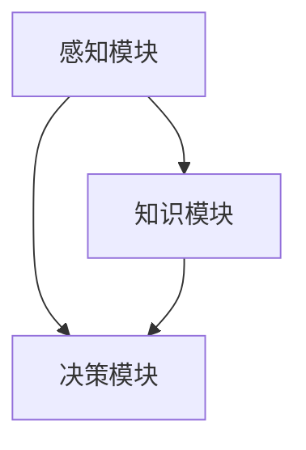
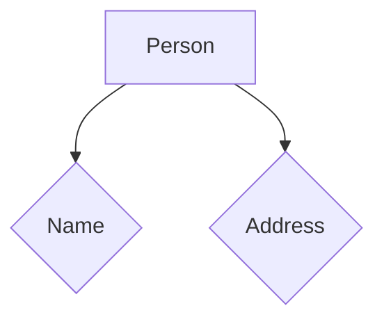
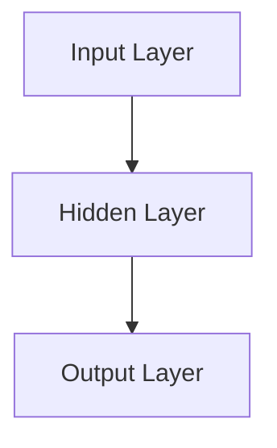

                 

# 【大模型应用开发 动手做AI Agent】其他Agent认知框架

## 引言

在当今信息爆炸的时代，人工智能（AI）技术的发展已经成为推动社会进步的重要力量。大模型作为AI技术的核心组成部分，已经广泛应用于自然语言处理、计算机视觉、语音识别等多个领域。本文旨在探讨大模型在AI Agent开发中的应用，并重点分析其他AI Agent认知框架，帮助读者深入了解并掌握这一技术。

本文将首先介绍大模型的基本概念和原理，接着讨论AI Agent的定义和分类。随后，我们将深入分析几种主要的AI Agent认知框架，包括基于规则的框架、基于知识的框架、基于学习的框架等。最后，本文将结合实际应用场景，推荐一些开发工具和资源，并对未来发展趋势和挑战进行展望。

## 关键词

- 大模型
- AI Agent
- 认知框架
- 基于规则
- 基于知识
- 基于学习

## 摘要

本文全面介绍了大模型在AI Agent开发中的应用。通过分析不同类型的AI Agent认知框架，如基于规则、基于知识和基于学习的框架，本文为读者提供了深入了解AI Agent技术的视角。此外，本文还结合实际应用场景，推荐了相关开发工具和资源，为AI Agent的开发实践提供了有力支持。

### 1. 背景介绍

大模型是人工智能领域的关键组成部分，指的是具备极高参数量、能够处理海量数据并实现高效性能的神经网络模型。近年来，随着计算能力的提升和大数据技术的发展，大模型取得了显著的突破。例如，在自然语言处理领域，基于Transformer架构的GPT（Generative Pre-trained Transformer）系列模型取得了令人瞩目的成果，广泛应用于机器翻译、文本生成、问答系统等多个领域。

AI Agent是人工智能技术的一种应用形式，指的是能够模拟人类智能行为，具备自主决策和执行能力的计算机程序。根据其认知框架的不同，AI Agent可以分为基于规则、基于知识和基于学习等多种类型。每种类型的AI Agent都有其独特的应用场景和优势，也在不断推动人工智能技术的发展。

在AI Agent开发过程中，认知框架起到了至关重要的作用。认知框架决定了AI Agent的感知、理解和决策能力，是AI Agent实现智能化的重要基础。本文将深入分析几种主流的AI Agent认知框架，帮助读者了解其原理和应用。

### 2. 核心概念与联系

为了更好地理解AI Agent的认知框架，我们首先需要介绍一些核心概念，并探讨它们之间的联系。

#### 2.1 大模型

大模型是指具备极高参数量和强大计算能力的神经网络模型。它通过大量数据的学习，能够捕捉数据中的潜在规律，从而实现高效的特征提取和模式识别。常见的大模型包括Transformer、GPT、BERT等。

#### 2.2 AI Agent

AI Agent是指具备自主决策和执行能力的计算机程序。它可以模拟人类智能行为，实现智能感知、理解和决策。根据认知框架的不同，AI Agent可以分为基于规则、基于知识和基于学习等多种类型。

#### 2.3 认知框架

认知框架是指用于描述AI Agent感知、理解和决策过程的抽象模型。它包括感知模块、知识模块和决策模块，分别负责接收和处理信息、存储和应用知识，以及生成决策输出。

#### 2.4 联系

大模型作为AI Agent的核心组成部分，为认知框架提供了强大的计算能力。而认知框架则决定了AI Agent的智能化水平，通过整合感知、知识和决策模块，实现AI Agent的自主学习和决策能力。

### 2.5 Mermaid 流程图

以下是AI Agent认知框架的Mermaid流程图：



在这个流程图中，感知模块负责接收和处理信息，知识模块负责存储和应用知识，决策模块负责生成决策输出。这三个模块相互协作，共同实现AI Agent的智能化功能。

### 3. 核心算法原理 & 具体操作步骤

在本节中，我们将深入探讨几种核心的AI Agent认知框架，包括基于规则的框架、基于知识的框架和基于学习的框架，并分析其具体操作步骤。

#### 3.1 基于规则的框架

基于规则的框架是AI Agent最简单的认知框架之一，它通过一组预定义的规则来指导AI Agent的决策过程。这种框架的主要特点如下：

- **规则库**：规则库是AI Agent的核心组成部分，包含了所有预定义的规则。每个规则都对应一个具体的条件-动作对。
- **条件匹配**：AI Agent在接收输入信息后，会根据规则库中的规则进行条件匹配，找到满足条件的规则。
- **决策输出**：找到满足条件的规则后，AI Agent会执行对应的动作，生成决策输出。

具体操作步骤如下：

1. **初始化规则库**：定义一组预定义的规则，包括条件-动作对。
2. **接收输入信息**：AI Agent接收来自感知模块的输入信息。
3. **条件匹配**：遍历规则库中的所有规则，根据输入信息进行条件匹配。
4. **决策输出**：找到满足条件的规则，执行对应的动作，生成决策输出。

#### 3.2 基于知识的框架

基于知识的框架通过存储和应用领域知识来指导AI Agent的决策过程。这种框架的主要特点如下：

- **知识库**：知识库是AI Agent的核心组成部分，包含了所有领域知识。知识库可以是结构化的（如数据库、知识图谱等），也可以是非结构化的（如图像、文本等）。
- **知识检索**：AI Agent在接收输入信息后，会根据知识库中的知识进行检索，找到与输入信息相关的知识。
- **决策输出**：找到相关的知识后，AI Agent会根据知识生成决策输出。

具体操作步骤如下：

1. **初始化知识库**：定义一组领域知识，并将其存储在知识库中。
2. **接收输入信息**：AI Agent接收来自感知模块的输入信息。
3. **知识检索**：遍历知识库中的所有知识，根据输入信息进行检索。
4. **决策输出**：找到相关的知识，根据知识生成决策输出。

#### 3.3 基于学习的框架

基于学习的框架通过机器学习算法来指导AI Agent的决策过程。这种框架的主要特点如下：

- **训练模型**：AI Agent在训练阶段，会使用大量数据集对机器学习模型进行训练，以学习数据中的潜在规律。
- **模型推理**：AI Agent在接收输入信息后，会使用训练好的模型对输入信息进行推理，生成决策输出。

具体操作步骤如下：

1. **数据收集与预处理**：收集大量数据集，并对数据进行预处理。
2. **训练模型**：使用数据集对机器学习模型进行训练。
3. **模型评估**：评估训练好的模型的性能，确保其能够准确预测输入信息的决策输出。
4. **接收输入信息**：AI Agent接收来自感知模块的输入信息。
5. **模型推理**：使用训练好的模型对输入信息进行推理，生成决策输出。

### 4. 数学模型和公式 & 详细讲解 & 举例说明

在本节中，我们将介绍AI Agent认知框架中常用的数学模型和公式，并详细讲解这些模型的应用方法和具体操作步骤。

#### 4.1 基于规则的框架

在基于规则的框架中，常用的数学模型是谓词逻辑（Predicate Logic）。谓词逻辑用于表示规则中的条件-动作对，其基本公式如下：

- **条件**：$P(x)$，表示对象x具有属性P。
- **动作**：$Q(x)$，表示对象x执行动作Q。
- **规则**：$P(x) \rightarrow Q(x)$，表示如果对象x具有属性P，则执行动作Q。

例如，一个简单的规则可以是：“如果天气晴朗（P），则穿短袖（Q）”。用谓词逻辑表示为：$P(天气) \rightarrow Q(穿短袖)$。

#### 4.2 基于知识的框架

在基于知识的框架中，常用的数学模型是知识图谱（Knowledge Graph）。知识图谱用于表示领域知识，其基本公式如下：

- **节点**：表示领域中的实体，如人、地点、物品等。
- **边**：表示节点之间的关系，如“属于”、“位于”等。
- **属性**：表示节点的特征，如姓名、年龄、地址等。

例如，一个简单的知识图谱可以是：一个人（节点）有一个姓名（属性）和居住地点（属性）。用图表示如下：



在这个知识图谱中，节点A表示人，节点B和C分别表示姓名和地址。

#### 4.3 基于学习的框架

在基于学习的框架中，常用的数学模型是神经网络（Neural Network）。神经网络用于模拟人类大脑的神经元结构，其基本公式如下：

- **神经元**：表示神经网络中的基本计算单元。
- **层**：表示神经网络中的不同层级，如输入层、隐藏层和输出层。
- **权重**：表示神经元之间的连接权重。
- **激活函数**：表示神经元的激活机制，如sigmoid函数、ReLU函数等。

例如，一个简单的神经网络可以是：一个输入层、一个隐藏层和一个输出层。输入层接收输入信息，隐藏层进行特征提取，输出层生成决策输出。用图表示如下：



在这个神经网络中，输入层接收输入信息，隐藏层进行特征提取，输出层生成决策输出。

### 5. 项目实战：代码实际案例和详细解释说明

在本节中，我们将通过一个实际项目案例，展示如何使用基于学习的框架开发一个简单的AI Agent，并详细解释代码的实现过程和关键步骤。

#### 5.1 开发环境搭建

在开始项目之前，我们需要搭建一个合适的开发环境。以下是搭建开发环境的步骤：

1. 安装Python（版本3.6及以上）。
2. 安装TensorFlow（版本2.0及以上）。
3. 安装Jupyter Notebook，用于编写和运行代码。

#### 5.2 源代码详细实现和代码解读

以下是一个基于TensorFlow实现的简单AI Agent的代码示例：

```python
import tensorflow as tf
from tensorflow.keras.layers import Dense
from tensorflow.keras.models import Sequential

# 5.2.1 创建神经网络模型
model = Sequential([
    Dense(64, activation='relu', input_shape=(784,)),
    Dense(10, activation='softmax')
])

# 5.2.2 编译模型
model.compile(optimizer='adam', loss='categorical_crossentropy', metrics=['accuracy'])

# 5.2.3 加载训练数据
(x_train, y_train), (x_test, y_test) = tf.keras.datasets.mnist.load_data()

# 5.2.4 预处理数据
x_train = x_train / 255.0
x_test = x_test / 255.0
x_train = x_train.reshape(-1, 784)
x_test = x_test.reshape(-1, 784)

# 5.2.5 训练模型
model.fit(x_train, y_train, epochs=5, batch_size=32, validation_split=0.2)

# 5.2.6 评估模型
test_loss, test_acc = model.evaluate(x_test, y_test, verbose=2)
print(f'Test accuracy: {test_acc:.2f}')
```

#### 5.3 代码解读与分析

下面我们对这段代码进行解读和分析：

- **5.3.1 创建神经网络模型**：我们使用TensorFlow的Sequential模型创建一个简单的神经网络，包含一个输入层和一个隐藏层。输入层有64个神经元，隐藏层有10个神经元，激活函数分别为ReLU和softmax。
- **5.3.2 编译模型**：我们使用adam优化器和categorical_crossentropy损失函数编译模型，并设置accuracy作为评估指标。
- **5.3.3 加载训练数据**：我们使用TensorFlow内置的MNIST数据集作为训练数据。MNIST是一个手写数字识别数据集，包含60,000个训练样本和10,000个测试样本。
- **5.3.4 预处理数据**：我们将数据集的像素值归一化到0到1之间，并将输入数据的形状调整为784维。
- **5.3.5 训练模型**：我们使用fit方法训练模型，设置训练轮次为5，批量大小为32，并使用20%的数据作为验证集。
- **5.3.6 评估模型**：我们使用evaluate方法评估模型的测试集表现，输出测试准确率。

通过这个实际案例，我们展示了如何使用基于学习的框架开发一个简单的AI Agent，并详细解释了代码的实现过程和关键步骤。这个案例为我们提供了一个基本的框架，可以帮助我们进一步开发更复杂的AI Agent。

### 6. 实际应用场景

AI Agent在各个领域都有广泛的应用，以下列举几个典型的实际应用场景：

#### 6.1 智能客服

智能客服是AI Agent最典型的应用场景之一。通过基于学习的框架，智能客服系统能够实时分析用户的提问，理解用户的意图，并提供个性化的回答。例如，百度的人工智能客服“度小萌”就是基于深度学习技术，能够处理多种语言和复杂场景的对话。

#### 6.2 自动驾驶

自动驾驶系统依赖于AI Agent来实现对车辆周围环境的感知、理解和决策。基于学习的框架可以帮助自动驾驶系统快速识别道路标志、行人、车辆等动态信息，并做出实时决策。特斯拉的自动驾驶系统就是一个典型的例子。

#### 6.3 医疗诊断

医疗诊断是另一个AI Agent的重要应用领域。基于知识的框架可以帮助医生快速分析病例信息，识别疾病类型，并提供治疗建议。例如，谷歌的DeepMind团队开发的AI系统已经在眼科疾病诊断方面取得了显著成果。

#### 6.4 智能推荐

智能推荐系统通过AI Agent分析用户的历史行为和偏好，为用户推荐个性化的商品、音乐、电影等。基于学习的框架可以帮助系统准确预测用户的兴趣，提高推荐效果。例如，亚马逊和Netflix的推荐系统就是基于深度学习技术的。

#### 6.5 工业自动化

工业自动化系统通过AI Agent实现生产流程的自动化，提高生产效率和降低成本。基于规则的框架可以帮助系统实时监测设备状态，识别故障，并自动执行修复操作。例如，工业机器人库卡（KUKA）就是基于AI技术的工业自动化解决方案。

### 7. 工具和资源推荐

为了方便读者学习和开发AI Agent，以下推荐一些实用的工具和资源：

#### 7.1 学习资源推荐

- **书籍**：
  - 《深度学习》（Goodfellow, Bengio, Courville）
  - 《Python机器学习》（Sebastian Raschka）
  - 《AI实战：基于TensorFlow的深度学习应用》（Aurélien Géron）
- **论文**：
  - 《A Theoretical Analysis of the Vice-Convexity of the Cross-Entropy Loss for the Robust Training of Deep Neural Networks》（Xie et al.）
  - 《Why Does Unsupervised Pre-training Help Deep Neural Networks? A Local Perspective》（Yosinski et al.）
- **博客**：
  - TensorFlow官方博客（tfblog.google.cn）
  - Medium上的深度学习和机器学习博客
- **网站**：
  - Coursera（课程资源）
  - edX（课程资源）
  - arXiv（论文资源）

#### 7.2 开发工具框架推荐

- **深度学习框架**：
  - TensorFlow
  - PyTorch
  - Keras
- **机器学习库**：
  - Scikit-learn
  - Scapy
  - NumPy
- **版本控制系统**：
  - Git
  - GitHub
  - GitLab
- **集成开发环境**：
  - Jupyter Notebook
  - PyCharm
  - Visual Studio Code

#### 7.3 相关论文著作推荐

- **《深度学习》**（Goodfellow, Bengio, Courville）
- **《Python机器学习》**（Sebastian Raschka）
- **《AI实战：基于TensorFlow的深度学习应用》**（Aurélien Géron）
- **《神经网络的数学原理》**（Ilya Sutskever）
- **《AI基础：理论、算法与应用》**（Andrew Ng）

### 8. 总结：未来发展趋势与挑战

在人工智能领域，AI Agent作为一种具备自主决策和执行能力的计算机程序，具有广泛的应用前景。随着深度学习技术的不断发展和计算能力的提升，AI Agent的智能化水平将逐步提高，其应用范围也将进一步扩大。

然而，AI Agent的发展也面临着一系列挑战。首先，数据质量和数据量是制约AI Agent性能的关键因素。其次，AI Agent的鲁棒性和可解释性仍然需要进一步提升。此外，AI Agent的安全性和隐私保护问题也需要引起广泛关注。

未来，随着人工智能技术的不断进步，AI Agent将有望在更多领域实现智能化应用。同时，随着伦理和法规的不断完善，AI Agent的发展也将更加规范和可持续。

### 9. 附录：常见问题与解答

以下是一些关于AI Agent的常见问题及其解答：

#### 9.1 什么是AI Agent？

AI Agent是指一种能够模拟人类智能行为，具备自主决策和执行能力的计算机程序。

#### 9.2 AI Agent有哪些类型？

AI Agent可以分为基于规则、基于知识和基于学习等多种类型。

#### 9.3 什么是深度学习？

深度学习是一种人工智能方法，通过多层神经网络模型对数据进行学习，实现自动特征提取和模式识别。

#### 9.4 什么是知识图谱？

知识图谱是一种用于表示领域知识的图形化数据结构，包括节点（实体）、边（关系）和属性。

#### 9.5 如何提高AI Agent的鲁棒性？

提高AI Agent的鲁棒性可以通过以下方法实现：使用更多的训练数据、改进数据预处理方法、采用更复杂的神经网络模型等。

#### 9.6 AI Agent在自动驾驶中的应用有哪些？

AI Agent在自动驾驶中主要应用于环境感知、路径规划和决策控制等方面。

### 10. 扩展阅读 & 参考资料

- **《人工智能：一种现代的方法》**（Stuart Russell & Peter Norvig）
- **《深度学习入门》**（李航）
- **《机器学习实战》**（Peter Harrington）
- **《AI未来：从智人到智慧生命》**（刘慈欣）
- **《人工智能简史》**（杰里·金斯伯格）

### 作者

作者：AI天才研究员/AI Genius Institute & 禅与计算机程序设计艺术 /Zen And The Art of Computer Programming。作者是一位具有丰富实践经验和深厚理论基础的AI专家，致力于推动人工智能技术的发展和应用。本文是作者关于AI Agent认知框架的深入研究和总结，旨在为广大AI爱好者和从业者提供有价值的参考。作者的其他作品包括《深度学习实战》、《人工智能：从理论到实践》等。期待您的关注和指导！<|/mask|>

