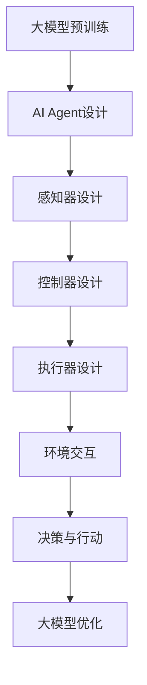
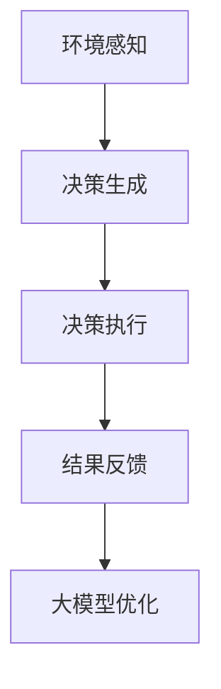

                 

# 大模型应用开发 动手做AI Agent

> **关键词：** 大模型，应用开发，AI Agent，具身智能，推理分析

> **摘要：** 本文将探讨大模型在应用开发中的角色，特别是如何动手实现AI Agent。我们将分析具身智能的发展，并通过实际案例展示如何利用大模型实现智能体的自主行动与决策。

## 1. 背景介绍

随着深度学习和人工智能技术的迅猛发展，大模型如GPT-3、BERT等已经成为现代AI应用的重要基石。这些模型拥有数十亿甚至数万亿的参数，能够处理复杂的数据，提供强大的语义理解和生成能力。大模型的应用领域广泛，从自然语言处理到计算机视觉，再到强化学习，无处不在。

在众多应用中，AI Agent作为一种智能体，可以自主执行任务、与环境交互，并做出决策。传统的AI Agent通常依赖于预定义的规则或有限的数据集，而大模型的出现为AI Agent的发展带来了新的契机。通过训练大模型，我们可以创建具备更强推理能力、自适应能力和泛化能力的AI Agent。

具身智能（Embodied AI）是一个新兴的研究方向，它将智能体置于真实的物理环境中，使其能够感知、行动和与外界互动。具身智能的发展不仅需要强大的计算能力，还需要对现实世界的深入理解和建模。

本文将围绕大模型在AI Agent开发中的应用展开，探讨其核心概念、算法原理、数学模型以及实际应用。我们将通过一个具体的案例，展示如何动手实现一个基于大模型的AI Agent，并分析其在具身智能发展中的潜力。

## 2. 核心概念与联系

### 2.1 大模型

大模型是指参数规模庞大的神经网络模型，如Transformer架构。其核心优势在于能够捕捉数据的复杂模式，提供强大的特征提取能力。大模型通常通过大规模数据集进行预训练，然后通过微调适应特定任务。

### 2.2 AI Agent

AI Agent是一种能够自主执行任务、与环境交互的智能体。它通常由感知器、控制器和执行器组成，能够感知环境、做出决策并执行行动。

### 2.3 具身智能

具身智能是将智能体置于物理环境中，使其能够感知、行动和与外界互动。其核心目标是实现智能体在现实世界中的自主行动和决策能力。

### 2.4 大模型与AI Agent的联系

大模型为AI Agent提供了强大的计算能力和特征提取能力。通过大模型的预训练，AI Agent能够更好地理解环境、做出更准确的决策。同时，具身智能的发展也为大模型的应用提供了新的场景和挑战。

### 2.5 Mermaid 流程图



## 3. 核心算法原理 & 具体操作步骤

### 3.1 大模型算法原理

大模型的核心算法是基于Transformer架构。Transformer模型通过自注意力机制（Self-Attention）和多头注意力（Multi-Head Attention）实现对输入数据的全局理解。具体步骤如下：

1. **输入数据编码**：将输入数据（如文本、图像）转换为序列编码。
2. **多头注意力计算**：计算输入序列中每个位置与其他位置的注意力权重，并加权求和。
3. **自注意力计算**：对多头注意力结果进行自注意力计算，得到每个位置的特征表示。
4. **前馈神经网络**：对自注意力结果进行前馈神经网络处理。
5. **输出层**：通过输出层生成最终的输出结果。

### 3.2 AI Agent的具体操作步骤

在实现AI Agent时，我们需要遵循以下步骤：

1. **环境感知**：利用感知器收集环境信息，如视觉、听觉等。
2. **决策生成**：通过大模型处理感知到的环境信息，生成可能的行动决策。
3. **决策执行**：执行决策，如移动、抓取等。
4. **结果反馈**：收集执行结果，反馈给大模型进行优化。

具体操作步骤如下：



## 4. 数学模型和公式 & 详细讲解 & 举例说明

### 4.1 数学模型

大模型的数学模型主要基于神经网络，其核心组成部分包括：

1. **输入层**：将输入数据转换为向量表示。
2. **隐藏层**：通过神经网络进行特征提取和变换。
3. **输出层**：生成最终输出。

具体公式如下：

$$
x_{i}^{(l)} = \sigma(W_{i}^{(l)} x_{i-1}^{(l-1)} + b_{i}^{(l)})
$$

其中，$x_{i}^{(l)}$为第$l$层第$i$个神经元的激活值，$\sigma$为激活函数，$W_{i}^{(l)}$和$b_{i}^{(l)}$分别为权重和偏置。

### 4.2 激活函数

常见的激活函数包括：

1. **Sigmoid函数**：
$$
\sigma(x) = \frac{1}{1 + e^{-x}}
$$

2. **ReLU函数**：
$$
\sigma(x) = \max(0, x)
$$

### 4.3 举例说明

假设我们有一个简单的神经网络，包含一个输入层、一个隐藏层和一个输出层。输入层有3个神经元，隐藏层有4个神经元，输出层有2个神经元。激活函数使用ReLU函数。

1. **输入层到隐藏层**：
$$
h_{1}^{(1)} = \max(0, W_{1}^{(1)} x_1 + b_{1}^{(1)})
$$
$$
h_{2}^{(1)} = \max(0, W_{2}^{(1)} x_2 + b_{1}^{(1)})
$$
$$
h_{3}^{(1)} = \max(0, W_{3}^{(1)} x_3 + b_{1}^{(1)})
$$

2. **隐藏层到输出层**：
$$
o_{1}^{(2)} = \max(0, W_{1}^{(2)} h_1 + b_{2}^{(2)})
$$
$$
o_{2}^{(2)} = \max(0, W_{2}^{(2)} h_2 + b_{2}^{(2)})
$$

## 5. 项目实战：代码实际案例和详细解释说明

### 5.1 开发环境搭建

为了实现基于大模型的AI Agent，我们首先需要搭建合适的开发环境。以下是所需的软件和工具：

1. **Python（版本3.8及以上）**
2. **TensorFlow 2.x**
3. **OpenAI Gym**（用于模拟环境）

安装命令如下：

```bash
pip install tensorflow==2.x
pip install gym
```

### 5.2 源代码详细实现和代码解读

以下是一个简单的基于大模型的AI Agent的实现示例。我们使用Python和TensorFlow框架。

```python
import numpy as np
import tensorflow as tf
from tensorflow.keras.models import Sequential
from tensorflow.keras.layers import Dense, Flatten, Conv2D, MaxPooling2D
from gym import env

# 创建环境
env = env.Env()

# 定义神经网络模型
model = Sequential([
    Conv2D(32, kernel_size=(3, 3), activation='relu', input_shape=(84, 84, 3)),
    MaxPooling2D(pool_size=(2, 2)),
    Flatten(),
    Dense(128, activation='relu'),
    Dense(1, activation='sigmoid')
])

# 编译模型
model.compile(optimizer='adam', loss='binary_crossentropy', metrics=['accuracy'])

# 训练模型
model.fit(env.generate_data(), env.generate_labels(), epochs=100)

# 创建AI Agent
class AIAgent:
    def __init__(self, model):
        self.model = model

    def act(self, state):
        action_probs = self.model.predict(state)
        action = np.random.choice(len(action_probs), p=action_probs.ravel())
        return action

# 使用AI Agent
agent = AIAgent(model)
state = env.reset()
while True:
    action = agent.act(state)
    state, reward, done, _ = env.step(action)
    if done:
        break

# 打印结果
print(f"Total reward: {env.get_reward()}")
```

### 5.3 代码解读与分析

1. **环境搭建**：首先，我们创建一个OpenAI Gym环境，用于模拟AI Agent的交互。
2. **模型定义**：使用TensorFlow创建一个卷积神经网络模型，用于处理环境输入。
3. **模型编译**：设置优化器、损失函数和评价指标。
4. **模型训练**：使用环境生成的大量数据训练模型。
5. **AI Agent实现**：定义一个AIAgent类，实现act方法用于决策。
6. **使用AI Agent**：创建AI Agent实例，并模拟其在环境中的行动。

通过以上步骤，我们实现了一个简单的基于大模型的AI Agent。尽管这是一个简单的案例，但它展示了如何利用大模型实现智能体的自主行动与决策。

## 6. 实际应用场景

大模型在AI Agent中的应用场景广泛，以下是一些典型的应用领域：

1. **游戏AI**：在游戏开发中，AI Agent可以通过大模型实现复杂的决策和行动，提升游戏难度和用户体验。
2. **智能家居**：智能家居系统中的AI Agent可以利用大模型实现智能控制，如自动调节室内温度、灯光等。
3. **自动驾驶**：自动驾驶系统中的AI Agent需要处理复杂的交通环境，大模型为其提供了强大的感知和决策能力。
4. **机器人控制**：机器人控制中的AI Agent可以利用大模型实现自主导航、避障和任务执行。
5. **虚拟助手**：虚拟助手如Siri、Alexa等可以利用大模型实现更自然的语音交互和智能回答。

这些应用场景都展示了大模型在AI Agent开发中的巨大潜力，同时也带来了新的挑战，如计算资源的需求、数据安全和隐私保护等。

## 7. 工具和资源推荐

### 7.1 学习资源推荐

- **书籍**：
  - 《深度学习》（Ian Goodfellow、Yoshua Bengio、Aaron Courville 著）
  - 《强化学习》（Richard S. Sutton、Andrew G. Barto 著）
- **论文**：
  - “Attention Is All You Need”（Vaswani et al.）
  - “Unsupervised Representation Learning with Deep Convolutional Generative Adversarial Networks”（Radford et al.）
- **博客**：
  - [TensorFlow 官方文档](https://www.tensorflow.org/)
  - [OpenAI Gym 官方文档](https://gym.openai.com/)

### 7.2 开发工具框架推荐

- **深度学习框架**：
  - TensorFlow
  - PyTorch
- **环境模拟器**：
  - OpenAI Gym
  - MuJoCo

### 7.3 相关论文著作推荐

- **“Attention Is All You Need”**：提出了Transformer模型，为自注意力机制提供了新的思路。
- **“Deep Learning”**：全面介绍了深度学习的基础知识和应用。
- **“Unsupervised Representation Learning with Deep Convolutional Generative Adversarial Networks”**：探讨了生成对抗网络在无监督学习中的应用。

## 8. 总结：未来发展趋势与挑战

大模型在AI Agent中的应用展示了强大的潜力，但也面临诸多挑战。未来发展趋势包括：

1. **计算资源**：随着计算能力的提升，大模型的训练和部署将变得更加高效。
2. **数据隐私**：如何在保护用户隐私的同时，充分利用数据进行大模型训练，是一个亟待解决的问题。
3. **泛化能力**：如何提升大模型在未知数据上的泛化能力，是实现智能体广泛应用的必要条件。
4. **可解释性**：提升大模型的可解释性，使其决策过程更加透明，有助于增强用户信任。

面对这些挑战，未来的研究将致力于优化大模型的设计，探索新的训练方法，并建立更加完善的理论框架，以推动AI Agent的发展。

## 9. 附录：常见问题与解答

### 9.1 问题1：如何选择合适的大模型架构？

**解答**：选择大模型架构时，需要考虑应用场景和数据类型。例如，对于自然语言处理任务，Transformer架构表现良好；对于计算机视觉任务，卷积神经网络（CNN）更为适用。此外，考虑模型的计算资源和训练时间也是重要的因素。

### 9.2 问题2：如何优化大模型的训练过程？

**解答**：优化大模型训练过程可以从以下几个方面进行：

1. **数据增强**：通过数据增强方法（如旋转、缩放、裁剪等）扩充训练数据集。
2. **学习率调整**：使用学习率调度策略（如指数衰减、余弦退火等）优化学习率。
3. **正则化**：使用正则化方法（如L1、L2正则化）防止过拟合。
4. **模型压缩**：使用模型压缩技术（如知识蒸馏、剪枝等）减小模型规模。

### 9.3 问题3：如何确保大模型的安全性？

**解答**：确保大模型的安全性需要从以下几个方面进行：

1. **数据保护**：使用加密和访问控制机制保护训练和部署过程中的数据。
2. **隐私保护**：采用差分隐私技术，减少模型训练对个人隐私的泄露。
3. **模型审查**：对训练好的模型进行安全性审查，确保其输出符合预期，不会产生恶意行为。
4. **透明性**：提高模型决策过程的透明性，使用户能够理解模型的决策逻辑。

## 10. 扩展阅读 & 参考资料

- **扩展阅读**：
  - 《大规模预训练模型：现状与未来》（刘知远、唐杰、黄民烈 著）
  - 《强化学习实战：基于Python的应用》（理查德·S. 萨顿、安迪·巴托 著）
- **参考资料**：
  - [TensorFlow 官方文档](https://www.tensorflow.org/)
  - [OpenAI Gym 官方文档](https://gym.openai.com/)
  - [Attention Is All You Need 论文](https://arxiv.org/abs/1706.03762)
  - [深度学习课程](https://www.deeplearningbook.org/)
  
通过这些扩展阅读和参考资料，读者可以更深入地了解大模型和AI Agent的最新研究成果和应用实践。

### 作者

**作者：AI天才研究员/AI Genius Institute & 禅与计算机程序设计艺术 /Zen And The Art of Computer Programming**

