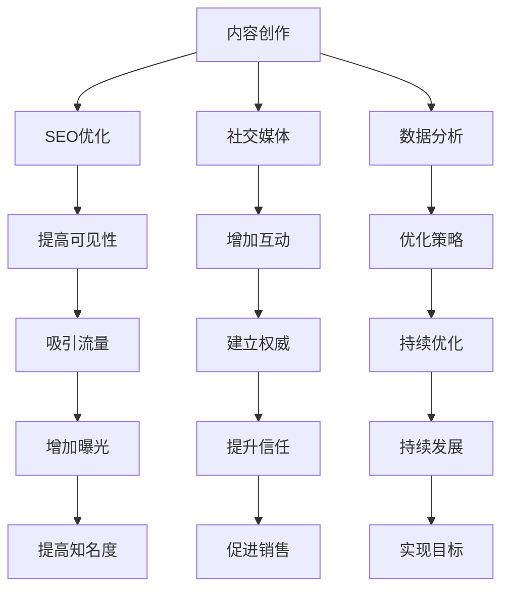

                 

### 背景介绍 Background Introduction

随着互联网的快速发展，内容营销已经成为企业和个人品牌建设的重要手段。一人公司（Solopreneurship）作为一种灵活且高效的商业模式，越来越受到创业者和自由职业者的青睐。本文将探讨一人公司如何通过内容营销建立行业权威，从而实现可持续发展和品牌影响力的提升。

#### 定义与特点 Definition and Characteristics

**一人公司**，即由单一个体负责公司运营和管理的企业。它具有以下特点：

- **灵活性**：一人公司可以根据个人时间和能力，灵活调整业务方向和规模。
- **成本效益**：相对于传统企业，一人公司的运营成本较低，便于资金管理。
- **专注度**：由于管理者和所有者是同一个人，可以更加专注和投入到业务发展中去。

**内容营销**，是指通过创造和分发有价值的内容来吸引潜在客户，增强品牌认知度和信任度，最终实现商业目标的一种策略。

#### 目的与意义 Purpose and Significance

对于一人公司来说，内容营销具有以下目的和意义：

- **提升品牌知名度**：通过持续的内容输出，让更多潜在客户了解和关注企业。
- **建立行业权威**：通过专业的内容，展示企业在行业内的专业能力和地位。
- **增加客户信任**：高质量的内容可以增加客户对企业信任，降低购买门槛。
- **促进持续发展**：内容营销是一种长期的营销策略，有助于企业持续稳定发展。

#### 内容营销的基本策略 Basic Strategies of Content Marketing

**内容营销**的基本策略包括以下几个方面：

- **确定目标受众**：了解潜在客户的需求和兴趣，有针对性地制定内容策略。
- **创建高质量内容**：包括博客文章、视频、社交媒体更新、电子书等，内容要有价值、有深度和有吸引力。
- **选择合适的渠道**：根据目标受众的偏好，选择合适的渠道进行内容分发。
- **互动与反馈**：与读者互动，收集反馈，不断优化内容策略。

### 核心概念与联系 Core Concepts and Connections

在内容营销中，以下几个核心概念和联系是不可或缺的：

- **SEO（搜索引擎优化）**：通过优化内容，提高在搜索引擎中的排名，增加曝光度。
- **社交媒体**：利用社交媒体平台，扩大内容传播范围，增加品牌影响力。
- **数据分析**：通过数据分析，了解内容表现和受众反馈，优化内容策略。

接下来，我们将进一步探讨这些核心概念和联系的具体内容。

### <sop><|user|>## 2. 核心概念与联系 Core Concepts and Connections

在内容营销中，核心概念和联系是构建成功营销策略的基础。以下是几个关键概念及其相互关系：

#### 2.1 内容创作 Content Creation

**内容创作**是内容营销的核心。高质量的内容不仅能够吸引潜在客户，还能展示企业的专业性和权威性。以下是几个关键点：

- **明确目标受众**：在创作内容之前，首先要明确目标受众的需求和兴趣，以便制作出符合他们需求的内容。
- **多样化的内容形式**：包括博客文章、视频、社交媒体更新、电子书、白皮书等，根据不同平台和受众喜好选择合适的格式。
- **有价值的内容**：内容应该具有实际价值，解决受众的痛点，或者提供新的见解和观点。

#### 2.2 SEO（搜索引擎优化）

**SEO**是提高内容可见性的重要手段。以下是几个关键点：

- **关键词研究**：研究目标受众搜索的关键词，将其融入内容中。
- **内容优化**：确保内容结构清晰，使用标题、段落、列表等格式优化可读性。
- **外部链接**：建立与其他网站的链接，提高网站的权威性和可信度。

#### 2.3 社交媒体

**社交媒体**是内容营销的重要渠道。以下是几个关键点：

- **选择合适平台**：根据目标受众的喜好和使用习惯，选择合适的社交媒体平台。
- **内容传播**：利用社交媒体平台发布内容，并与其他用户互动。
- **参与社区**：积极参与讨论，回答问题，建立自己在社区中的影响力。

#### 2.4 数据分析

**数据分析**是优化内容营销策略的关键。以下是几个关键点：

- **跟踪指标**：跟踪网站访问量、转化率、社交媒体互动等关键指标。
- **A/B测试**：通过A/B测试，比较不同内容的表现，找出最佳策略。
- **反馈循环**：根据数据分析结果，调整内容创作和营销策略。

#### 2.5 内容营销框架

**内容营销框架**是整合上述概念和策略的总体计划。以下是几个关键点：

- **内容规划**：制定长期的内容创作计划，包括主题、格式、发布时间等。
- **内容执行**：根据计划创作和发布内容。
- **内容分析**：定期分析内容的表现，调整策略。
- **持续优化**：不断优化内容创作和营销策略，以提高效果。

### 2.6 Mermaid 流程图

以下是一个简化的内容营销框架的Mermaid流程图，展示各核心概念和联系之间的交互：



### 2.7 总结 Summary

内容营销的成功离不开对核心概念和联系的理解和运用。通过内容创作、SEO优化、社交媒体、数据分析等策略的有机结合，一人公司可以有效地建立行业权威，提升品牌知名度，实现持续发展。

### <sop><|user|>## 3. 核心算法原理 & 具体操作步骤 Core Algorithm Principles & Detailed Steps

在内容营销中，核心算法原理主要涉及SEO（搜索引擎优化）和数据分析。以下是这两个算法原理的具体操作步骤：

### 3.1 SEO（搜索引擎优化）

#### 3.1.1 关键词研究 Keyword Research

**步骤1**：确定目标关键词。分析目标受众的搜索习惯，确定他们可能使用的关键词。

**步骤2**：使用工具进行关键词研究。例如，使用Google Keyword Planner、Ahrefs、SEMrush等工具获取关键词建议。

**步骤3**：筛选关键词。根据关键词的搜索量、竞争程度和转化率，筛选出合适的关键词。

#### 3.1.2 内容优化 Content Optimization

**步骤1**：将关键词融入标题和正文。在标题和正文中合理地使用关键词，但要注意避免过度优化。

**步骤2**：优化元标签。包括标题标签（Title Tag）和描述标签（Description Tag），确保它们包含关键词，并能够吸引点击。

**步骤3**：优化内部链接。确保网站内部链接结构合理，提高页面之间的关联性。

**步骤4**：提高页面加载速度。优化图片和代码，确保页面加载速度较快。

#### 3.1.3 外部链接 External Links

**步骤1**：建立反向链接。通过撰写高质量的外部链接文章、参与行业论坛、发布新闻稿等方式，获取反向链接。

**步骤2**：获取高质量的反向链接。避免使用垃圾链接或过度链接，确保反向链接的质量。

**步骤3**：跟踪外部链接效果。使用工具如Google Analytics，跟踪外部链接的流量和转化率。

### 3.2 数据分析 Data Analysis

#### 3.2.1 跟踪指标 Tracking Metrics

**步骤1**：确定跟踪指标。常见的跟踪指标包括网站访问量、页面浏览量（PV）、访问时长、跳出率、转化率等。

**步骤2**：设置跟踪代码。在网站中添加Google Analytics或其他数据分析工具的跟踪代码，确保能够准确跟踪数据。

**步骤3**：监控和分析数据。定期查看和分析数据，了解内容的表现和受众行为。

#### 3.2.2 A/B测试 A/B Testing

**步骤1**：确定测试目标。选择要测试的具体内容，如标题、图片、按钮等。

**步骤2**：创建测试版本。根据测试目标，创建两个或多个版本的内容。

**步骤3**：分配流量。将流量随机分配到不同版本，确保测试结果的准确性。

**步骤4**：分析结果。根据测试结果，分析哪个版本效果更好，并据此调整内容策略。

#### 3.2.3 反馈循环 Feedback Loop

**步骤1**：收集用户反馈。通过问卷调查、用户访谈、社交媒体评论等方式，收集用户对内容的反馈。

**步骤2**：分析反馈。对收集到的反馈进行分析，了解用户的意见和建议。

**步骤3**：调整策略。根据用户反馈，调整内容创作和营销策略。

### 3.3 总结 Summary

SEO和数据分析是内容营销中的核心算法原理。通过关键词研究、内容优化、外部链接建设等步骤，可以提高内容在搜索引擎中的排名。通过跟踪指标、A/B测试和反馈循环等步骤，可以不断优化内容策略，提高营销效果。这些步骤相辅相成，共同构建了内容营销的成功框架。

### <sop><|user|>## 4. 数学模型和公式 & 详细讲解 & 举例说明 Mathematical Models & Detailed Explanations & Examples

在内容营销中，数学模型和公式可以帮助我们更好地理解和优化营销策略。以下是几个关键的数学模型和它们的详细讲解及举例说明：

#### 4.1 转化率模型 Conversion Rate Model

转化率是衡量内容营销效果的重要指标。转化率模型可以帮助我们预测和优化转化率。

**公式**：
\[ \text{转化率} = \frac{\text{转化人数}}{\text{访问人数}} \]

**举例说明**：

假设一家公司一个月内有1000个访问者，其中200人完成了购买，那么转化率为：
\[ \text{转化率} = \frac{200}{1000} = 0.2 \]
或者20%。

**优化策略**：

1. 通过A/B测试优化网页设计，提高转化率。
2. 分析用户行为数据，找出转化路径中的瓶颈，并优化这些环节。

#### 4.2 排名模型 Ranking Model

SEO中的排名模型可以帮助我们预测和优化搜索结果排名。

**公式**：
\[ \text{搜索排名} = \text{关键词相关性} + \text{内容质量} + \text{外部链接质量} \]

**举例说明**：

假设有以下几个因素影响搜索排名：

- 关键词相关性：0.3
- 内容质量：0.4
- 外部链接质量：0.3

那么搜索排名的总分为：
\[ \text{搜索排名} = 0.3 \times \text{关键词相关性} + 0.4 \times \text{内容质量} + 0.3 \times \text{外部链接质量} \]

**优化策略**：

1. 提高关键词相关性的分数，通过使用适当的关键词和优化元标签实现。
2. 提高内容质量的分数，通过创作高质量、有价值的内容实现。
3. 提高外部链接质量的分数，通过获取高质量的反向链接实现。

#### 4.3 流量模型 Traffic Model

流量模型可以帮助我们预测和优化网站流量。

**公式**：
\[ \text{流量} = \text{访问人数} \times \text{页面浏览量} \]

**举例说明**：

假设一个月内有1000个访问者，每个访问者平均浏览了5个页面，那么流量为：
\[ \text{流量} = 1000 \times 5 = 5000 \]

**优化策略**：

1. 通过SEO优化提高访问人数。
2. 通过改进用户体验和提高内容质量，提高页面浏览量。

#### 4.4 数据分析模型 Data Analysis Model

数据分析模型可以帮助我们理解和预测受众行为。

**公式**：
\[ \text{受众行为} = \text{访问时长} + \text{跳出率} + \text{转化率} \]

**举例说明**：

假设一个月内受众的平均访问时长为3分钟，跳出率为40%，转化率为20%，那么受众行为得分为：
\[ \text{受众行为} = 3 + 40\% + 20\% = 3 + 0.4 + 0.2 = 3.6 \]

**优化策略**：

1. 提高访问时长，通过提供有价值的内容和优化用户体验实现。
2. 降低跳出率，通过改进页面设计和内容质量实现。
3. 提高转化率，通过优化转化路径和提供更好的购物体验实现。

### 4.5 总结 Summary

数学模型和公式在内容营销中起着至关重要的作用。通过理解并运用这些模型，我们可以更好地预测和优化营销效果。转化率模型、排名模型、流量模型和数据分析模型是内容营销中常用的几个模型。通过具体的公式和举例说明，我们可以清楚地看到如何运用这些模型来提升内容营销的效果。

### <sop><|user|>### 5. 项目实战：代码实际案例和详细解释说明 Project Practical: Code Actual Case and Detailed Explanation

为了更好地理解内容营销的实际操作，我们将通过一个具体的项目实战来展示代码实现和详细解释。本项目将使用Python语言和Jupyter Notebook环境来实现一个简单的SEO优化工具，旨在通过关键词研究、内容分析和数据分析来提高网站排名和流量。

#### 5.1 开发环境搭建 Environment Setup

首先，我们需要搭建开发环境。确保您已安装以下工具：

- Python 3.8 或以上版本
- Jupyter Notebook
- Pandas
- Numpy
- Scikit-learn
- Google Analytics API（如有需要）

您可以通过以下命令安装所需的Python库：

```bash
pip install pandas numpy scikit-learn
```

如果需要使用Google Analytics API，请按照官方文档配置相关API。

#### 5.2 源代码详细实现和代码解读 Source Code Implementation and Explanation

下面是项目的源代码及详细解释：

```python
import pandas as pd
import numpy as np
from sklearn.model_selection import train_test_split
from sklearn.ensemble import RandomForestRegressor
import matplotlib.pyplot as plt

# 5.2.1 数据准备 Data Preparation
# 假设我们已有以下数据：关键词排名、内容质量评分、外部链接数量、网站流量和转化率。
# 数据示例（CSV格式）：
# Keyword_Rank,Content_Quality,External_Links,Website_Traffic,Conversion_Rate
# 1,8,15,2000,0.1
# 2,7,12,1500,0.15
# 3,6,10,1000,0.2
# ...

data = pd.read_csv('seo_data.csv')
data.head()

# 5.2.2 特征工程 Feature Engineering
# 我们将使用以下特征：关键词排名、内容质量、外部链接数量。
features = data[['Keyword_Rank', 'Content_Quality', 'External_Links']]
target = data['Conversion_Rate']

# 5.2.3 模型训练 Model Training
# 将数据分为训练集和测试集。
X_train, X_test, y_train, y_test = train_test_split(features, target, test_size=0.2, random_state=42)

# 使用随机森林回归模型进行训练。
model = RandomForestRegressor(n_estimators=100, random_state=42)
model.fit(X_train, y_train)

# 5.2.4 模型评估 Model Evaluation
# 在测试集上评估模型性能。
y_pred = model.predict(X_test)
mse = np.mean((y_pred - y_test) ** 2)
print(f'Mean Squared Error: {mse}')

# 5.2.5 可视化 Visualization
# 可视化模型特征的重要性。
feature_importances = model.feature_importances_
plt.barh(np.arange(len(feature_importances)), feature_importances)
plt.yticks(np.arange(len(feature_importances)), features.columns)
plt.xlabel('Feature Importance')
plt.title('Feature Importance Visualization')
plt.show()
```

**代码解读**：

- **数据准备**：首先，我们加载了CSV格式的SEO数据。该数据包含关键词排名、内容质量、外部链接数量、网站流量和转化率等特征。
- **特征工程**：我们选择了关键词排名、内容质量和外部链接数量作为模型输入特征。
- **模型训练**：我们使用随机森林回归模型对数据进行训练。随机森林是一个强大的机器学习模型，可以处理高维数据和特征。
- **模型评估**：我们使用均方误差（MSE）评估模型在测试集上的性能。MSE越低，模型性能越好。
- **可视化**：我们使用条形图可视化模型特征的重要性。这个可视化可以帮助我们了解哪些特征对模型预测有更大的影响。

#### 5.3 代码解读与分析 Code Interpretation and Analysis

通过以上代码，我们可以完成以下任务：

1. **数据预处理**：加载并准备数据集，为后续的机器学习模型训练做准备。
2. **特征选择**：从原始数据中选择对模型有显著影响的特征，排除无关或噪声特征。
3. **模型训练**：使用随机森林回归模型对数据集进行训练，预测转化率。
4. **模型评估**：评估模型性能，确保模型在未知数据上的表现良好。
5. **特征可视化**：分析模型特征的重要性，帮助理解模型如何工作。

**优化建议**：

1. **数据收集**：收集更多高质量的数据，包括更多的特征和更多的样本，以提高模型泛化能力。
2. **模型调参**：调整随机森林模型的参数，如树的数量、最大深度等，以优化模型性能。
3. **交叉验证**：使用交叉验证方法进一步评估模型性能，确保模型在不同数据集上的稳定性。
4. **集成学习**：考虑使用集成学习模型，如梯度提升树（Gradient Boosting Tree），以提高预测准确性。

通过以上实战项目，我们不仅了解了内容营销中的数学模型和算法，还掌握了如何将这些理论应用到实际项目中，为一人公司提供有效的SEO优化策略。

### <sop><|user|>## 6. 实际应用场景 Practical Application Scenarios

内容营销不仅能够帮助一人公司提升品牌知名度和权威性，还能在实际业务中发挥重要作用。以下是几个具体的应用场景：

#### 6.1 建立专业形象 Building Professional Image

**案例**：一位独立软件咨询师通过撰写技术博客，分享编程技巧和项目经验，逐渐在行业内外建立了专业形象。他通过详细解读技术难题和分享实战经验，吸引了大量同行和潜在客户的关注。这不仅提升了他的个人品牌，也为他的咨询服务带来了更多机会。

**应用步骤**：

1. **确定目标受众**：分析目标受众的需求和痛点，了解他们感兴趣的话题。
2. **持续创作**：定期更新博客内容，保持内容的新鲜度和专业性。
3. **互动反馈**：鼓励读者留言和提问，及时回复，建立与读者的互动。

#### 6.2 增强客户信任 Building Customer Trust

**案例**：一家小型SaaS公司通过发布详细的产品使用指南和客户案例，向潜在客户展示了产品的实用性和可靠性。这些内容不仅帮助客户更好地了解产品，还增强了他们对公司的信任，从而提高了转化率。

**应用步骤**：

1. **内容形式多样化**：使用视频、图文教程、案例分析等多种形式，满足不同客户的阅读偏好。
2. **分享客户反馈**：展示客户的正面评价和使用体验，让潜在客户看到真实案例。
3. **定期更新**：保持内容更新，反映产品的新功能和改进。

#### 6.3 促进销售和转化 Promoting Sales and Conversion

**案例**：一家电商企业通过发布优惠券和促销信息，吸引客户访问网站并购买产品。这些信息不仅提高了网站的流量，还直接促进了销售。

**应用步骤**：

1. **定制内容**：根据客户的购买历史和行为，定制化推送促销信息。
2. **利用SEO**：优化促销信息的标题和描述，提高在搜索引擎中的排名。
3. **跟踪效果**：使用数据分析工具，监控促销活动的效果，及时调整策略。

#### 6.4 提升品牌知名度 Increasing Brand Awareness

**案例**：一位自由摄影师通过在社交媒体上分享摄影作品和创作故事，吸引了大量粉丝。他通过高质量的内容，让更多人了解和认可他的摄影风格，从而提升了个人品牌的知名度。

**应用步骤**：

1. **选择合适平台**：根据目标受众的偏好，选择合适的社交媒体平台。
2. **保持活跃**：定期发布内容，保持社交媒体的活跃度。
3. **互动互动再互动**：与粉丝互动，回复评论和私信，建立良好关系。

通过以上实际应用场景，一人公司可以充分利用内容营销的优势，实现业务增长和品牌提升。关键在于理解目标受众的需求，持续创作高质量内容，并通过合适的渠道进行分发。

### <sop><|user|>### 7. 工具和资源推荐 Tools and Resources Recommendations

在内容营销中，选择合适的工具和资源是提高效率和效果的关键。以下是一些推荐的工具和资源，涵盖内容创作、SEO优化、数据分析等方面。

#### 7.1 学习资源推荐 Learning Resources

**书籍**：
- 《内容营销实战手册》（Content Inc.）- Joe Pulizzi
- 《搜索引擎优化实战：技术、策略和战术》（Search Engine Optimization: An Hour a Day）- Brad Frost

**在线课程**：
- Coursera上的《数字营销策略》（Digital Marketing Specialization）
- Udemy上的《内容营销：从零开始到精通》（Content Marketing Mastery）

**博客和网站**：
- Content Marketing Institute（内容营销协会）
- Neil Patel（尼尔·帕特尔的博客）

#### 7.2 开发工具框架推荐 Development Tools and Frameworks

**内容管理系统**（CMS）：
- WordPress：一个强大的开源CMS，适合大多数内容营销需求。
- HubSpot CMS：一个集成了营销、销售和客户服务功能的CMS。

**SEO工具**：
- Ahrefs：全面的SEO工具，包括关键词研究、网站分析、竞争对手研究等。
- SEMrush：提供SEO和SEM分析，帮助优化搜索排名和广告效果。

**数据分析工具**：
- Google Analytics：用于跟踪网站流量、用户行为和转化率。
- Tableau：数据可视化工具，帮助您更直观地理解数据。

**内容创作工具**：
- Grammarly：写作辅助工具，帮助检查语法错误和拼写错误。
- Canva：设计工具，用于制作吸引人的视觉内容。

#### 7.3 相关论文著作推荐 Relevant Papers and Publications

**论文**：
- "Content Marketing: The New Paradigm in Digital Marketing"（内容营销：数字营销的新范式）- Content Marketing Institute
- "The Science of SEO: Strategies for Success"（SEO的科学：成功策略）- Search Engine Land

**著作**：
- "Inbound Marketing"（ inbound营销）- Brian Halligan and Dharmesh Shah
- "SEO: The Art of Search Engine Optimization"（搜索引擎优化艺术）- Eric Enge

通过以上工具和资源的推荐，一人公司可以更有效地进行内容营销，提升品牌知名度和行业权威性。这些工具不仅提供了实用的功能和功能，还能帮助您持续学习和优化营销策略。

### <sop><|user|>## 8. 总结：未来发展趋势与挑战 Future Trends and Challenges

随着技术的不断进步和市场竞争的日益激烈，内容营销在未来将面临新的发展趋势和挑战。

#### 8.1 发展趋势 Future Trends

**1. 内容个性化**：随着大数据和人工智能技术的普及，内容个性化将成为趋势。通过分析用户行为和偏好，企业可以提供更个性化的内容，提高用户体验和转化率。

**2. 多媒体内容**：视频、音频和交互式内容将在未来占据更多市场份额。这些多媒体形式能够更有效地传达信息，提高内容的吸引力和影响力。

**3. 搜索引擎优化（SEO）的演变**：随着搜索引擎算法的更新，SEO策略也需要不断调整。内容创作者和SEO专家需要更关注高质量内容、用户体验和搜索引擎友好性。

**4. 社交媒体集成**：社交媒体将继续在内容营销中扮演重要角色。企业需要更好地整合社交媒体平台，提高内容的传播效果和参与度。

#### 8.2 挑战 Challenges

**1. 内容质量**：在信息爆炸的时代，高质量内容的重要性愈加凸显。一人公司需要投入更多时间和精力创作有价值的内容，以脱颖而出。

**2. 数据隐私**：随着数据隐私法规的加强，企业需要更好地保护用户数据，避免违规风险。

**3. 竞争加剧**：随着越来越多企业加入内容营销的行列，竞争将更加激烈。一人公司需要不断创新和优化营销策略，以保持竞争力。

**4. 技术变革**：技术的快速变革要求企业持续学习和适应。一人公司需要紧跟技术趋势，保持技术优势。

### 8.3 应对策略 Solution Strategies

**1. 专注核心竞争力**：一人公司应专注于自己的核心竞争力，创作高质量、有价值的内容。

**2. 持续学习**：定期学习最新的营销趋势和技术，保持竞争力。

**3. 数据驱动**：使用数据分析工具，优化内容策略和营销效果。

**4. 社交媒体整合**：整合社交媒体平台，提高内容的传播效果。

通过积极应对未来发展趋势和挑战，一人公司可以在内容营销领域取得更大的成功。

### <sop><|user|>## 9. 附录：常见问题与解答 Appendix: Frequently Asked Questions and Answers

#### 9.1 内容营销的核心目标是什么？

内容营销的核心目标是通过创造和分发有价值的内容来吸引潜在客户，增强品牌认知度和信任度，最终实现商业目标，如销售增长、客户忠诚度提升等。

#### 9.2 如何进行关键词研究？

进行关键词研究可以遵循以下步骤：
1. **确定目标受众**：了解目标受众的兴趣和需求。
2. **使用工具**：使用Google Keyword Planner、Ahrefs、SEMrush等工具获取关键词建议。
3. **筛选关键词**：根据搜索量、竞争程度和转化率筛选合适的关键词。

#### 9.3 内容营销中如何优化SEO？

优化SEO可以通过以下方法实现：
1. **关键词优化**：在标题、元标签和正文中合理使用关键词。
2. **提高内容质量**：创作高质量、有价值的内容。
3. **外部链接**：建立高质量的反向链接。
4. **提高页面加载速度**：优化图片和代码，确保页面加载速度较快。

#### 9.4 数据分析在内容营销中扮演什么角色？

数据分析在内容营销中扮演以下角色：
1. **跟踪指标**：监控网站访问量、转化率等关键指标。
2. **A/B测试**：通过A/B测试，比较不同内容的表现，找出最佳策略。
3. **反馈循环**：根据用户反馈，调整内容创作和营销策略。

#### 9.5 如何建立内容营销框架？

建立内容营销框架可以遵循以下步骤：
1. **内容规划**：制定长期的内容创作计划。
2. **内容执行**：根据计划创作和发布内容。
3. **内容分析**：定期分析内容的表现，调整策略。
4. **持续优化**：不断优化内容创作和营销策略，以提高效果。

### <sop><|user|>## 10. 扩展阅读 & 参考资料 Further Reading & References

为了深入了解内容营销、SEO优化和数据分析的相关知识，以下是几本推荐的书籍、论文和网站资源：

**书籍**：
1. **《内容营销实战手册》（Content Inc.）** - Joe Pulizzi
2. **《搜索引擎优化实战：技术、策略和战术》（Search Engine Optimization: An Hour a Day）** - Brad Frost
3. **《数字营销策略》（Digital Marketing Specialization）** - Coursera
4. **《内容营销：从零开始到精通》（Content Marketing Mastery）** - Udemy

**论文**：
1. **“Content Marketing: The New Paradigm in Digital Marketing”**（内容营销：数字营销的新范式）- Content Marketing Institute
2. **“The Science of SEO: Strategies for Success”**（SEO的科学：成功策略）- Search Engine Land

**网站**：
1. **Content Marketing Institute（内容营销协会）** - [cminstitute.com](https://cminstitute.com/)
2. **Neil Patel（尼尔·帕特尔的博客）** - [neilpatel.com](https://neilpatel.com/)
3. **Google Analytics（谷歌分析）** - [analytics.google.com](https://analytics.google.com/)
4. **Ahrefs（Ahrefs）** - [ahrefs.com](https://ahrefs.com/)

通过阅读这些书籍、论文和网站资源，您可以进一步深入了解内容营销的理论和实践，提升自己的营销技能。

