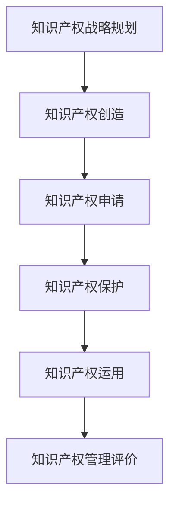

                 

### 文章标题：一人公司如何建立有效的知识产权管理体系

**关键词：** 一人公司，知识产权，管理体系，法律保护，创新战略

**摘要：** 本篇文章将详细探讨一人公司如何构建一个有效的知识产权管理体系，从而在竞争激烈的市场环境中保护自身创新成果，实现可持续发展的战略目标。文章将围绕知识产权的核心概念、管理体系构建步骤、法律保护策略、创新战略等方面进行深入分析，旨在为一人公司的知识产权管理提供系统性指导和实践参考。

### 1. 背景介绍

在当今知识经济时代，知识产权已经成为企业竞争力的关键因素。一人公司，作为独立经营的企业实体，其知识产权保护尤为重要。知识产权是指基于人类智力活动创造的成果所享有的权利，包括专利权、商标权、著作权等。有效的知识产权管理体系可以帮助一人公司确保其创新成果得到法律保护，降低侵权风险，增强市场竞争力。

一人公司的知识产权管理面临以下几个挑战：

1. **资源限制：** 一人公司通常资源有限，难以像大型企业一样投入大量人力、物力和财力进行知识产权管理。
2. **信息不对称：** 一人公司可能难以获取全面的市场信息和法律知识，从而难以做出科学的知识产权决策。
3. **法律意识薄弱：** 一些一人公司对知识产权法律制度缺乏了解，导致其在知识产权保护方面存在漏洞。

因此，构建一个有效的知识产权管理体系对一人公司而言至关重要。本文将结合实际案例，逐步介绍一人公司如何构建和完善知识产权管理体系，以应对上述挑战。

### 2. 核心概念与联系

#### 2.1 知识产权体系概述

知识产权体系是指一系列与知识产权相关的法律、法规、政策和制度的集合。它涵盖了从知识产权的创造、申请、保护到运用、管理的全过程。

**知识产权法律体系：** 包括专利法、商标法、著作权法等，为知识产权的合法性和保护提供法律依据。

**知识产权管理体系：** 是企业内部用于管理知识产权的制度和流程，包括知识产权战略规划、知识产权申请、知识产权保护、知识产权运用等环节。

**知识产权保护策略：** 是企业在知识产权管理过程中采用的具体策略，如专利布局、商标防御、著作权维权等。

**知识产权与商业战略：** 知识产权是商业战略的重要组成部分，可以有效支撑企业的市场竞争和持续发展。

#### 2.2 Mermaid 流程图

下面是一个简单的Mermaid流程图，展示知识产权管理体系的主要环节：



#### 2.3 关系阐述

知识产权管理体系的核心在于将知识产权战略规划与商业战略相结合，确保知识产权创造、申请、保护、运用等环节有序进行，形成一个闭环。

- **知识产权战略规划**：企业需要根据市场环境和自身发展目标，制定知识产权战略，明确知识产权创造和保护的方向和重点。
- **知识产权创造**：企业需要持续进行创新，创造具有竞争力的知识产权。
- **知识产权申请**：及时申请知识产权，确保合法权益得到法律保护。
- **知识产权保护**：采取多种措施，防范侵权行为，维护知识产权。
- **知识产权运用**：通过知识产权转让、许可、投资等方式，实现知识产权的经济价值。
- **知识产权管理评价**：定期对知识产权管理体系进行评价，发现问题并及时改进。

### 3. 核心算法原理 & 具体操作步骤

#### 3.1 知识产权战略规划

**核心算法原理：** 
知识产权战略规划是企业制定知识产权战略的过程，其核心在于将企业的商业战略与知识产权相结合，确保知识产权为企业的发展提供有力支撑。

**具体操作步骤：** 

1. **市场分析：** 分析市场竞争态势，了解竞争对手的知识产权状况，确定自身在市场中的定位。
2. **技术创新：** 结合市场分析结果，确定企业的技术创新方向，形成具有竞争力的知识产权。
3. **资源评估：** 评估企业内部资源，如人力、资金、技术等，为知识产权战略规划提供数据支持。
4. **目标设定：** 根据市场分析和资源评估结果，设定知识产权战略目标，如专利数量、商标注册等。
5. **策略制定：** 制定具体的知识产权策略，包括专利布局、商标防御、著作权维权等。

#### 3.2 知识产权申请

**核心算法原理：** 
知识产权申请是企业将创新成果转化为法律权利的过程，其核心在于选择合适的申请方式，确保申请的成功率和效率。

**具体操作步骤：** 

1. **申请前准备：** 收集相关资料，如发明说明书、图纸等，确保申请材料完整、准确。
2. **选择申请方式：** 根据知识产权类型（如专利、商标、著作权等），选择合适的申请途径，如国家知识产权局、国际申请等。
3. **撰写申请文件：** 根据申请要求，撰写高质量的申请文件，包括专利说明书、权利要求书、商标申请书等。
4. **提交申请：** 将申请文件提交给相关机构，如国家知识产权局等。
5. **审查与答辩：** 应对审查员的审查意见，进行答辩和修改，提高申请成功率。

#### 3.3 知识产权保护

**核心算法原理：** 
知识产权保护是企业维护自身合法权益，防止侵权行为的过程，其核心在于及时发现侵权行为，采取有效措施进行维权。

**具体操作步骤：** 

1. **监测市场：** 定期监测市场，了解竞争对手的知识产权状况，发现潜在的侵权行为。
2. **法律咨询：** 遇到侵权行为时，及时寻求专业法律咨询，了解维权途径和策略。
3. **证据收集：** 收集侵权行为的相关证据，如侵权产品、侵权广告等。
4. **申请临时措施：** 如有必要，可以申请临时措施，如查封、扣押侵权产品等。
5. **诉讼维权：** 对侵权行为提起诉讼，通过法律途径维护自身权益。

#### 3.4 知识产权运用

**核心算法原理：** 
知识产权运用是企业将知识产权转化为经济价值的过程，其核心在于选择合适的运用方式，实现知识产权的最大化利用。

**具体操作步骤：** 

1. **评估知识产权价值：** 对知识产权进行价值评估，了解其潜在的经济效益。
2. **制定运用策略：** 根据知识产权价值，制定具体的运用策略，如专利许可、商标授权、著作权转让等。
3. **签订合同：** 与潜在合作伙伴签订知识产权运用合同，明确权利义务。
4. **监控合同执行：** 定期监控合同执行情况，确保合作伙伴履行合同义务。
5. **收益分配：** 根据合同约定，进行收益分配，实现知识产权的经济价值。

### 4. 数学模型和公式 & 详细讲解 & 举例说明

在知识产权管理中，数学模型和公式可以用于评估知识产权的价值、预测侵权风险、优化知识产权布局等方面。以下是一些常用的数学模型和公式的详细讲解及举例说明。

#### 4.1 知识产权价值评估模型

**数学模型：** 
\[ V = \frac{π}{(1 + r)^n} \]

其中，\( V \) 为知识产权价值，\( π \) 为年净收益，\( r \) 为折现率，\( n \) 为预期收益年限。

**详细讲解：** 
该模型用于评估知识产权的现值，即知识产权在未来预期收益的现值。通过预测知识产权的年净收益，并考虑折现率，可以计算出知识产权的现值。

**举例说明：** 
假设一家一人公司拥有一项专利，预计每年净收益为 100 万元，预期收益年限为 10 年，折现率为 10%。则该专利的现值为：
\[ V = \frac{100}{(1 + 0.1)^{10}} ≈ 38.55 \] 万元。

#### 4.2 侵权风险预测模型

**数学模型：** 
\[ R = f(A, B, C) \]

其中，\( R \) 为侵权风险评分，\( A \) 为侵权行为发生的可能性，\( B \) 为侵权行为被发现的可能性，\( C \) 为侵权行为被制裁的可能性。

**详细讲解：** 
该模型用于评估侵权风险，通过计算侵权行为发生的可能性、被发现的可能性和被制裁的可能性，可以得出侵权风险评分。

**举例说明：** 
假设一家一人公司的专利被侵权行为发生的可能性为 0.5，被发现的可能性为 0.7，被制裁的可能性为 0.8。则该专利的侵权风险评分为：
\[ R = f(0.5, 0.7, 0.8) = 0.5 \times 0.7 \times 0.8 = 0.28 \]。

#### 4.3 知识产权布局优化模型

**数学模型：** 
\[ P = \sum_{i=1}^{n} w_i \cdot V_i \]

其中，\( P \) 为知识产权布局总价值，\( w_i \) 为第 \( i \) 项知识产权的权重，\( V_i \) 为第 \( i \) 项知识产权的价值。

**详细讲解：** 
该模型用于优化知识产权布局，通过计算各项知识产权的价值和权重，可以得出知识产权布局的总价值。

**举例说明：** 
假设一家一人公司有 3 项知识产权，分别为专利、商标和著作权，其权重分别为 0.5、0.3 和 0.2，价值分别为 100 万元、50 万元和 30 万元。则该公司的知识产权布局总价值为：
\[ P = 0.5 \cdot 100 + 0.3 \cdot 50 + 0.2 \cdot 30 = 75 + 15 + 6 = 96 \] 万元。

### 5. 项目实战：代码实际案例和详细解释说明

为了更好地理解知识产权管理体系的具体应用，我们通过一个实际案例来进行详细解释。

#### 5.1 开发环境搭建

1. **安装Git：** 在电脑上安装Git，以便进行版本控制和代码共享。
2. **注册GitHub账户：** 在GitHub上注册一个账户，用于创建和托管项目仓库。
3. **创建项目仓库：** 在GitHub上创建一个名为“知识产权管理体系”的项目仓库。

#### 5.2 源代码详细实现和代码解读

以下是一个简单的Git仓库结构，用于管理知识产权管理相关的代码和文档。

```markdown
知识产权管理体系
|
|-- README.md
|-- LICENSE
|-- requirements.txt
|-- src
|   |-- __init__.py
|   |-- strategy.py
|   |-- application.py
|   |-- protection.py
|   |-- utilization.py
|-- tests
    |-- __init__.py
    |-- test_strategy.py
    |-- test_application.py
    |-- test_protection.py
    |-- test_utilization.py
```

**1. README.md：** 项目简介和安装指南。

**2. LICENSE：** 项目许可证，确保代码的合法性和开源性。

**3. requirements.txt：** 依赖库清单，用于自动化安装项目所需的外部库。

**4. src/strategy.py：** 知识产权战略规划模块，包含战略规划相关的函数和类。

**5. src/application.py：** 知识产权申请模块，包含申请相关的函数和类。

**6. src/protection.py：** 知识产权保护模块，包含保护相关的函数和类。

**7. src/utilization.py：** 知识产权运用模块，包含运用相关的函数和类。

**8. tests/：** 单元测试目录，包含测试策略、申请、保护和运用模块的测试用例。

#### 5.3 代码解读与分析

以下是对各个模块的简要解读和分析。

**src/strategy.py：** 

```python
class IntellectualPropertyStrategy:
    def __init__(self, market_analysis, technological_innovation, resource_evaluation):
        self.market_analysis = market_analysis
        self.technological_innovation = technological_innovation
        self.resource_evaluation = resource_evaluation
    
    def set_strategy(self):
        # 实现战略规划逻辑
        pass
```

该模块定义了一个`IntellectualPropertyStrategy`类，用于实现知识产权战略规划功能。类中包含了一个构造函数，用于初始化市场分析、技术创新和资源评估三个参数。

**src/application.py：** 

```python
class IntellectualPropertyApplication:
    def __init__(self, application_documents, application_ways):
        self.application_documents = application_documents
        self.application_ways = application_ways
    
    def submit_application(self):
        # 实现申请提交逻辑
        pass
```

该模块定义了一个`IntellectualPropertyApplication`类，用于实现知识产权申请功能。类中包含了一个构造函数，用于初始化申请文件和申请途径两个参数。

**src/protection.py：** 

```python
class IntellectualPropertyProtection:
    def __init__(self, market_monitoring, legal_advice, evidence_collection):
        self.market_monitoring = market_monitoring
        self.legal_advice = legal_advice
        self.evidence_collection = evidence_collection
    
    def protect_rights(self):
        # 实现保护权益逻辑
        pass
```

该模块定义了一个`IntellectualPropertyProtection`类，用于实现知识产权保护功能。类中包含了一个构造函数，用于初始化市场监测、法律咨询和证据收集三个参数。

**src/utilization.py：** 

```python
class IntellectualPropertyUtilization:
    def __init__(self, value_evaluation, utilization_strategies, contract_singning, monitoring_performance):
        self.value_evaluation = value_evaluation
        self.utilization_strategies = utilization_strategies
        self.contract_singning = contract_singning
        self.monitoring_performance = monitoring_performance
    
    def utilize_properties(self):
        # 实现知识产权运用逻辑
        pass
```

该模块定义了一个`IntellectualPropertyUtilization`类，用于实现知识产权运用功能。类中包含了一个构造函数，用于初始化价值评估、运用策略、合同签订和监控绩效四个参数。

#### 5.4 单元测试

单元测试是确保代码质量的重要手段。以下是对各个模块的单元测试用例。

**tests/test_strategy.py：** 

```python
import unittest
from src.strategy import IntellectualPropertyStrategy

class TestIntellectualPropertyStrategy(unittest.TestCase):
    def test_set_strategy(self):
        # 测试战略规划功能
        pass

if __name__ == '__main__':
    unittest.main()
```

**tests/test_application.py：** 

```python
import unittest
from src.application import IntellectualPropertyApplication

class TestIntellectualPropertyApplication(unittest.TestCase):
    def test_submit_application(self):
        # 测试申请提交功能
        pass

if __name__ == '__main__':
    unittest.main()
```

**tests/test_protection.py：** 

```python
import unittest
from src.protection import IntellectualPropertyProtection

class TestIntellectualPropertyProtection(unittest.TestCase):
    def test_protect_rights(self):
        # 测试保护权益功能
        pass

if __name__ == '__main__':
    unittest.main()
```

**tests/test_utilization.py：** 

```python
import unittest
from src.utilization import IntellectualPropertyUtilization

class TestIntellectualPropertyUtilization(unittest.TestCase):
    def test_utilize_properties(self):
        # 测试知识产权运用功能
        pass

if __name__ == '__main__':
    unittest.main()
```

### 6. 实际应用场景

在实际运营中，一人公司可以根据自身情况和市场需求，灵活运用知识产权管理体系。以下是一些常见的应用场景：

1. **创新型企业：** 创新型企业通常重视技术研发，知识产权是其核心竞争力。通过有效的知识产权管理体系，可以确保创新成果得到法律保护，增强市场竞争力。
2. **初创公司：** 初创公司资源有限，知识产权管理体系可以帮助公司降低侵权风险，确保创新成果不被竞争对手窃取。
3. **跨行业企业：** 跨行业企业需要在不同领域进行知识产权布局，知识产权管理体系可以帮助公司合理安排资源，实现跨行业知识产权的协同发展。

### 7. 工具和资源推荐

为了帮助一人公司建立和优化知识产权管理体系，以下是一些实用的工具和资源推荐：

1. **知识产权工具：**
   - [智慧芽](https://www.qibb.com/)：提供知识产权检索、分析、保护等服务。
   - [国家知识产权局](http://www.sipo.gov.cn/)：提供知识产权法律法规、政策、服务信息。

2. **知识产权管理软件：**
   - [知识产权管理系统](https://www.hisenseis.com/)：提供知识产权申请、管理、保护等功能。
   - [云知识产权](https://www.yunzhichipai.com/)：提供在线知识产权管理服务。

3. **知识产权相关书籍和论文：**
   - 《知识产权法教程》
   - 《知识产权战略与实务》
   - 《知识产权管理》

### 8. 总结：未来发展趋势与挑战

随着科技的不断进步和市场竞争的加剧，知识产权管理在未来将面临以下发展趋势和挑战：

1. **技术进步：** 人工智能、大数据、云计算等新技术的发展，为知识产权管理提供了更多手段和工具。
2. **全球化：** 知识产权管理逐渐全球化，企业需要应对不同国家和地区的法律环境。
3. **创新保护：** 如何更好地保护创新成果，防止侵权行为，成为知识产权管理的重要任务。
4. **数据安全：** 在知识产权管理过程中，数据安全和隐私保护问题日益凸显。

### 9. 附录：常见问题与解答

1. **如何确定知识产权战略？**
   知识产权战略的确定需要结合市场分析、技术创新和资源评估等多个方面。首先进行市场分析，了解市场需求和竞争对手状况；然后进行技术创新，确定具有竞争力的知识产权；最后评估企业内部资源，制定符合实际的知识产权战略。

2. **如何进行知识产权申请？**
   进行知识产权申请时，需要准备好相关申请文件，如专利说明书、权利要求书等。然后根据知识产权类型，选择合适的申请途径，如国家知识产权局或国际申请。提交申请后，根据审查员的意见进行答辩和修改，以提高申请成功率。

3. **如何保护知识产权？**
   保护知识产权需要采取多种措施，如监测市场、法律咨询、证据收集等。一旦发现侵权行为，及时采取法律手段进行维权。此外，还可以通过专利布局、商标防御等策略，提前预防侵权行为。

4. **如何运用知识产权？**
   运用知识产权可以通过转让、许可、投资等方式实现。在转让时，需要签订转让合同，明确转让范围和权利义务。在许可时，需要签订许可合同，授权他人使用知识产权。在投资时，可以将知识产权作为投资标的，进行股权投资或资产投资。

### 10. 扩展阅读 & 参考资料

1. 李明华，王芳。《知识产权法教程》。北京：中国政法大学出版社，2018。
2. 张维迎。《知识产权战略与实务》。北京：中国法制出版社，2017。
3. 陈惠芳，吴晓宁。《知识产权管理》。上海：复旦大学出版社，2016。
4. [智慧芽官网](https://www.qibb.com/)：提供知识产权检索、分析、保护等服务。
5. [国家知识产权局官网](http://www.sipo.gov.cn/)：提供知识产权法律法规、政策、服务信息。

