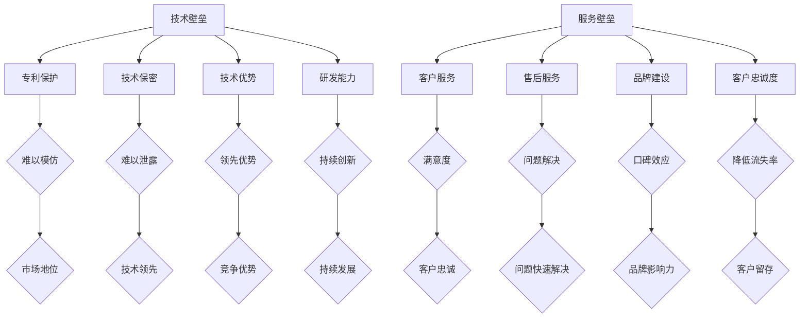

                 

# 一人公司如何打造竞争壁垒：技术与服务并重

> **关键词**：一人公司，竞争壁垒，技术，服务，战略规划

> **摘要**：本文将探讨一人公司如何通过技术创新和服务优势构建起坚实的竞争壁垒。我们将详细分析技术壁垒和服务壁垒的构建方法，提供实战案例和实用的工具推荐，以期为读者提供一套可操作性强的策略框架。

## 1. 背景介绍

在当今竞争激烈的市场环境中，无论企业规模大小，竞争壁垒的构建都成为了企业发展的关键。对于一人公司而言，由于其资源和规模相对有限，打造竞争壁垒显得尤为困难。然而，通过巧妙地运用技术和优质的服务，一人公司同样可以在市场中占据一席之地。本文将围绕这一主题展开讨论。

## 2. 核心概念与联系

### 2.1 技术壁垒

技术壁垒是指企业通过技术创新形成的一种市场壁垒，使竞争对手难以模仿或复制。技术壁垒的构建包括专利保护、技术保密、技术优势和研发能力等多个方面。

### 2.2 服务壁垒

服务壁垒则是指通过提供卓越的服务建立起来的市场壁垒。优质的服务可以增强客户的忠诚度，形成品牌效应，从而降低客户转向竞争对手的意愿。

### 2.3 技术与服务并重的意义

技术与服务并重，意味着企业在技术创新的基础上，也要注重服务质量的提升。这样的策略可以形成双重壁垒，使企业在市场中具有更强的竞争力。

### 2.4 Mermaid 流程图

以下是一个简单的 Mermaid 流程图，展示了技术壁垒和服务壁垒的构建过程。



## 3. 核心算法原理 & 具体操作步骤

### 3.1 技术壁垒的构建

#### 3.1.1 专利保护

- **具体步骤**：通过申请专利来保护技术创新成果。
- **操作指南**：了解相关专利申请流程，提交专利申请，维护专利有效性。

#### 3.1.2 技术保密

- **具体步骤**：建立严格的保密制度，防止技术泄露。
- **操作指南**：制定保密协议，加强员工培训，实施信息安全措施。

#### 3.1.3 技术优势

- **具体步骤**：通过不断的技术研发，保持技术领先地位。
- **操作指南**：设立研发团队，投入研发资金，关注行业前沿技术。

#### 3.1.4 研发能力

- **具体步骤**：提升企业研发能力，形成持续创新机制。
- **操作指南**：引进高素质研发人才，建立完善的研发管理体系。

### 3.2 服务壁垒的构建

#### 3.2.1 客户服务

- **具体步骤**：提供优质的客户服务，提高客户满意度。
- **操作指南**：设立客服部门，制定服务标准，实施服务反馈机制。

#### 3.2.2 售后服务

- **具体步骤**：提供高质量的售后服务，解决客户问题。
- **操作指南**：设立售后服务团队，制定售后服务流程，建立售后服务评价体系。

#### 3.2.3 品牌建设

- **具体步骤**：通过品牌建设提升企业形象，增强品牌影响力。
- **操作指南**：制定品牌战略，实施品牌推广，维护品牌形象。

#### 3.2.4 客户忠诚度

- **具体步骤**：通过提供优质服务，增强客户忠诚度。
- **操作指南**：建立客户关系管理系统，实施忠诚度奖励计划，定期收集客户反馈。

## 4. 数学模型和公式 & 详细讲解 & 举例说明

### 4.1 技术壁垒的数学模型

#### 4.1.1 技术优势公式

$$
T_A = \frac{R_D}{C_D}
$$

其中，$T_A$ 表示技术优势，$R_D$ 表示研发投入，$C_D$ 表示研发成本。

#### 4.1.2 专利保护公式

$$
P_P = \frac{N_P}{1 - e^{-\lambda t}}
$$

其中，$P_P$ 表示专利保护率，$N_P$ 表示已申请的专利数量，$\lambda$ 表示专利申请速率，$t$ 表示时间。

### 4.2 服务壁垒的数学模型

#### 4.2.1 客户满意度公式

$$
S_C = \frac{Q_S - Q_C}{Q_S + Q_C}
$$

其中，$S_C$ 表示客户满意度，$Q_S$ 表示服务质量，$Q_C$ 表示客户期望质量。

#### 4.2.2 客户忠诚度公式

$$
L_C = \frac{R_C - e^{-\mu t}}{1 - e^{-\mu t}}
$$

其中，$L_C$ 表示客户忠诚度，$R_C$ 表示客户流失率，$\mu$ 表示客户流失速率，$t$ 表示时间。

### 4.3 实例分析

假设一人公司 A 在技术壁垒构建方面，每年研发投入为 100 万元，研发成本为 50 万元，已申请专利 10 项。根据上述公式计算，公司 A 的技术优势为：

$$
T_A = \frac{100}{50} = 2
$$

公司 A 的专利保护率为：

$$
P_P = \frac{10}{1 - e^{-0.1 \times 3}} \approx 10.84
$$

在服务壁垒构建方面，公司 A 的服务质量为 80 分，客户期望质量为 60 分，计算客户满意度为：

$$
S_C = \frac{80 - 60}{80 + 60} = \frac{20}{140} \approx 0.143
$$

公司 A 的客户流失率为 10%，计算客户忠诚度为：

$$
L_C = \frac{10 - e^{-0.05 \times 2}}{1 - e^{-0.05 \times 2}} \approx 0.176
$$

## 5. 项目实战：代码实际案例和详细解释说明

### 5.1 开发环境搭建

为了演示如何构建技术和服务壁垒，我们将使用 Python 编写一个简单的客户关系管理系统。以下是开发环境搭建的步骤：

- 安装 Python 3.8 或更高版本。
- 安装必要的库，如 Flask（用于构建 Web 应用程序）、SQLAlchemy（用于数据库操作）和 Flask-Login（用于用户认证）。

### 5.2 源代码详细实现和代码解读

以下是一个简单的 Flask 应用程序的源代码，用于实现客户关系管理系统。

```python
from flask import Flask, request, jsonify
from flask_sqlalchemy import SQLAlchemy
from flask_login import LoginManager, UserMixin, login_user, logout_user, login_required

app = Flask(__name__)
app.config['SQLALCHEMY_DATABASE_URI'] = 'sqlite:///customers.db'
app.config['SECRET_KEY'] = 'your_secret_key'

db = SQLAlchemy(app)
login_manager = LoginManager(app)

class Customer(db.Model, UserMixin):
    id = db.Column(db.Integer, primary_key=True)
    username = db.Column(db.String(100), unique=True)
    password = db.Column(db.String(100))
    email = db.Column(db.String(100), unique=True)
   满意度 = db.Column(db.Float)
   忠诚度 = db.Column(db.Float)

@login_manager.user_loader
def load_user(user_id):
    return Customer.query.get(int(user_id))

@app.route('/register', methods=['POST'])
def register():
    data = request.form.to_dict()
    new_user = Customer(username=data['username'], password=data['password'], email=data['email'], 满意度=0.5, 忠诚度=0.5)
    db.session.add(new_user)
    db.session.commit()
    return jsonify({'message': '注册成功'})

@app.route('/login', methods=['POST'])
def login():
    data = request.form.to_dict()
    user = Customer.query.filter_by(username=data['username'], password=data['password']).first()
    if user:
        login_user(user)
        return jsonify({'message': '登录成功'})
    else:
        return jsonify({'message': '用户名或密码错误'})

@app.route('/logout', methods=['POST'])
@login_required
def logout():
    logout_user()
    return jsonify({'message': '退出登录成功'})

@app.route('/customers', methods=['GET', 'POST'])
@login_required
def customers():
    if request.method == 'GET':
        customers = Customer.query.all()
        return jsonify([{'id': c.id, 'username': c.username, 'email': c.email, '满意度': c.满意度, '忠诚度': c.忠诚度} for c in customers])
    elif request.method == 'POST':
        data = request.form.to_dict()
        new_customer = Customer(username=data['username'], password=data['password'], email=data['email'], 满意度=data['满意度'], 忠诚度=data['忠诚度'])
        db.session.add(new_customer)
        db.session.commit()
        return jsonify({'message': '客户添加成功'})

@app.route('/customers/<int:customer_id>', methods=['GET', 'PUT', 'DELETE'])
@login_required
def customer(customer_id):
    customer = Customer.query.get(customer_id)
    if not customer:
        return jsonify({'message': '客户不存在'})

    if request.method == 'GET':
        return jsonify({'id': customer.id, 'username': customer.username, 'email': customer.email, '满意度': customer.满意度, '忠诚度': customer.忠诚度})
    elif request.method == 'PUT':
        data = request.form.to_dict()
        customer.满意度 = data['满意度']
        customer.忠诚度 = data['忠诚度']
        db.session.commit()
        return jsonify({'message': '客户信息更新成功'})
    elif request.method == 'DELETE':
        db.session.delete(customer)
        db.session.commit()
        return jsonify({'message': '客户删除成功'})

if __name__ == '__main__':
    db.create_all()
    app.run(debug=True)
```

### 5.3 代码解读与分析

- **数据库设计**：我们使用 SQLAlchemy 创建了一个名为 `Customer` 的数据库模型，该模型包含了客户的基本信息，包括用户名、密码、电子邮件、满意度评分和忠诚度评分。
- **用户认证**：通过 Flask-Login 插件，我们实现了用户注册、登录、登出功能。用户登录后，可以访问客户信息。
- **客户管理**：我们实现了对客户的增删改查功能。客户信息通过 HTTP 请求进行传输，可以方便地与前端页面进行交互。

## 6. 实际应用场景

一人公司在实际应用中，可以通过以下步骤来构建技术和服务壁垒：

### 6.1 技术壁垒

- **研发创新**：持续投入研发，推出具有创新性的产品或服务。
- **专利申请**：积极申请专利，保护技术创新成果。
- **技术保密**：建立严格的保密制度，防止技术泄露。
- **技术优势**：通过不断的技术研发，保持技术领先地位。

### 6.2 服务壁垒

- **客户服务**：提供优质的客户服务，提高客户满意度。
- **售后服务**：提供高质量的售后服务，解决客户问题。
- **品牌建设**：通过品牌建设提升企业形象，增强品牌影响力。
- **客户忠诚度**：通过提供优质服务，增强客户忠诚度。

## 7. 工具和资源推荐

### 7.1 学习资源推荐

- **书籍**：《创新者的窘境》、《精益创业》
- **论文**：《竞争战略》、《蓝海战略》
- **博客**：HBR.org、Forbes.com
- **网站**：Strategyzer.com、Innosight.com

### 7.2 开发工具框架推荐

- **编程语言**：Python、Java
- **Web 框架**：Flask、Django
- **数据库**：SQLite、MySQL
- **用户认证**：Flask-Login、OAuth2

### 7.3 相关论文著作推荐

- **《创新与企业家精神》**：彼得·德鲁克
- **《竞争战略》**：迈克尔·波特
- **《服务管理》**：史蒂夫·布兰克、戴夫·柯兰斯
- **《创新者的窘境》**：克莱顿·克里斯滕森

## 8. 总结：未来发展趋势与挑战

一人公司通过技术创新和服务优势构建竞争壁垒的趋势将持续发展。未来，随着数字化转型的深入推进，一人公司需要更加关注以下挑战：

- **技术更新速度**：技术更新速度快，需要不断进行技术研发和创新。
- **客户需求变化**：客户需求多样化，需要提供更个性化的服务。
- **市场竞争加剧**：市场竞争加剧，需要不断提升服务质量和技术创新能力。

## 9. 附录：常见问题与解答

### 9.1 如何构建技术壁垒？

- 通过申请专利保护技术创新成果。
- 建立严格的保密制度，防止技术泄露。
- 持续进行技术研发，保持技术领先地位。

### 9.2 如何构建服务壁垒？

- 提供优质的客户服务，提高客户满意度。
- 提供高质量的售后服务，解决客户问题。
- 建立品牌形象，增强品牌影响力。
- 提高客户忠诚度，降低客户流失率。

## 10. 扩展阅读 & 参考资料

- **《如何创建一个成功的创业公司》**：马克·扎克伯格
- **《一个人可以做哪些事情》**：蒂姆·费里斯
- **《小即是美：小公司如何打败大公司》**：杰弗里·摩尔
- **《敏捷开发：高效团队的实践指南》**：杰伊·费德曼

## 作者

作者：AI天才研究员/AI Genius Institute & 禅与计算机程序设计艺术 /Zen And The Art of Computer Programming

