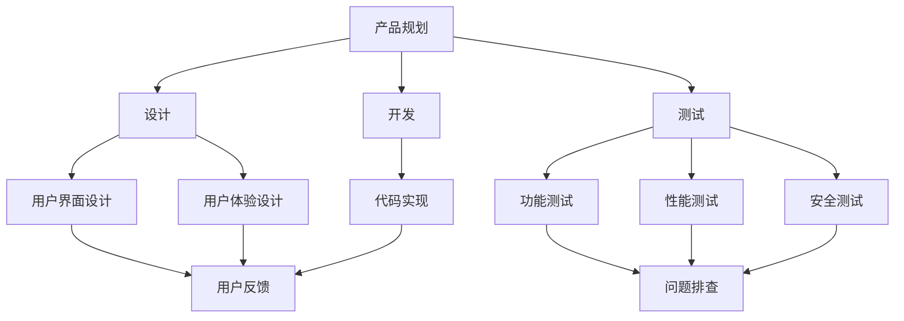

                 

### 背景介绍 Background

在当今快速发展的商业环境中，创业公司和企业家的角色变得越来越重要。然而，这些公司常常面临资源有限、人员不足的问题。在这种背景下，如何构建一个高效的产品研发流程成为了关键挑战。一个高效的产品研发流程不仅能提高开发效率，还能保证产品质量和市场适应性。

**一人公司**，也就是单打独斗的创业者，在产品研发中面临独特的挑战。他们不仅要承担起从创意到市场的全部工作，还要保证每个环节的高效运作。这包括市场调研、产品规划、设计、开发、测试和发布等多个环节。一人公司通常缺乏大量的资源和人力，这使得建立高效的产品研发流程变得至关重要。

本文旨在探讨如何为一人在初创阶段构建一个高效的产品研发流程。文章将从以下几个方面进行讨论：

1. **核心概念与联系**：介绍产品研发流程中涉及的核心概念和其相互关系。
2. **核心算法原理 & 具体操作步骤**：详细说明如何实施这些核心概念。
3. **数学模型和公式 & 详细讲解 & 举例说明**：讲解在产品研发中使用的数学模型和公式，并提供具体实例。
4. **项目实战：代码实际案例和详细解释说明**：通过实际代码案例展示如何应用前面的理论。
5. **实际应用场景**：探讨高效研发流程在现实中的应用。
6. **工具和资源推荐**：推荐一些有用的工具和资源。
7. **总结：未来发展趋势与挑战**：总结本文的主要观点，并讨论未来的趋势和挑战。

通过本文的阅读，读者将能够理解如何在一个资源有限的环境中，构建并优化产品研发流程，从而提高效率和产品质量。

---

## 1. 核心概念与联系 Core Concepts and Connections

在构建高效的产品研发流程中，首先需要理解几个核心概念，这些概念相互关联，构成了整个流程的基础。

### 1.1 产品规划 Product Planning

产品规划是产品研发流程的起点。在这一阶段，一人公司需要明确产品的目标用户、市场需求、功能定位和产品愿景。为了实现这一目标，可以采用**SWOT分析**（Strengths, Weaknesses, Opportunities, Threats），对自身优势和劣势、市场机会和威胁进行综合评估。此外，还可以利用**用户画像**（User Personas），通过创建典型用户模型，帮助理解目标用户的需求和行为。

### 1.2 设计 Design

设计阶段是产品规划的具体实现，它包括用户界面设计（UI）和用户体验设计（UX）。一人公司在设计过程中需要考虑如何将产品规划中的功能需求转化为直观、易用的界面。在这一阶段，可以使用**原型设计工具**（如Sketch、Figma），快速迭代并优化设计。

### 1.3 开发 Development

开发阶段是将设计转化为实际代码的过程。在这一阶段，一人公司需要选择合适的开发工具和框架，并遵循良好的编程实践。例如，可以使用**版本控制工具**（如Git），确保代码的可维护性和可协作性。此外，采用**敏捷开发方法**（Agile Methodology），可以更好地适应需求的变化和快速迭代。

### 1.4 测试 Testing

测试阶段是确保产品质量和稳定性的关键。在这一阶段，一人公司需要设计并执行各种测试用例，包括功能测试、性能测试和安全测试。自动化测试工具（如Selenium、JUnit）可以显著提高测试效率和覆盖范围。

### 1.5 发布和反馈 Release and Feedback

发布阶段是将产品推向市场的重要步骤。一人公司需要制定合适的发布策略，确保产品能够顺利上线并得到用户反馈。收集用户反馈后，可以通过**用户调研**和**数据分析**，进一步优化产品。

### 1.6 数据驱动 Data-Driven

数据驱动是现代产品研发的核心原则。通过持续收集和分析数据，一人公司可以不断优化产品功能和用户体验。例如，利用**A/B测试**（A/B Testing），可以比较不同设计或功能对用户行为的影响。

下图展示了上述核心概念之间的相互关系和作用：



通过以上核心概念和流程的梳理，一人公司可以更系统地规划和执行产品研发，从而提高效率并确保产品质量。

---

## 2. 核心算法原理 & 具体操作步骤 Core Algorithm Principles & Operational Steps

在产品研发流程中，核心算法的设计和实现是确保产品高效运作的关键。以下是几个关键步骤，详细描述了如何设计和实现这些算法。

### 2.1 数据分析算法 Data Analysis Algorithm

数据分析是产品研发的重要环节，它帮助一人公司理解用户行为和市场趋势。以下是一个简单的数据分析算法实现步骤：

**步骤1：数据收集**  
首先，从用户行为日志、市场调查和其他来源收集数据。

**步骤2：数据预处理**  
对收集的数据进行清洗和预处理，去除无效或错误的数据。

**步骤3：数据探索**  
利用描述性统计分析，探索数据的分布和趋势。可以使用Python的Pandas库完成这一步骤。

**代码示例：**
```python
import pandas as pd

# 加载数据
data = pd.read_csv('user_behavior_data.csv')

# 数据清洗
data.dropna(inplace=True)

# 数据探索
print(data.describe())
```

**步骤4：数据可视化**  
使用matplotlib或Seaborn库，对数据进行可视化，以直观理解数据。

**代码示例：**
```python
import matplotlib.pyplot as plt
import seaborn as sns

# 数据可视化
sns.histplot(data['user_session_duration'])
plt.show()
```

**步骤5：数据建模**  
根据分析目的，选择合适的机器学习模型进行数据建模。例如，可以使用线性回归模型预测用户流失率。

**代码示例：**
```python
from sklearn.linear_model import LinearRegression

# 数据建模
X = data[['session_duration', 'daily_usage']]
y = data['churn']

model = LinearRegression()
model.fit(X, y)

# 预测
predictions = model.predict(X)
```

### 2.2 自动化测试算法 Automated Testing Algorithm

自动化测试是确保产品质量的关键。以下是一个简单的自动化测试算法实现步骤：

**步骤1：测试用例设计**  
根据产品需求，设计测试用例，确保覆盖所有功能点。

**步骤2：测试脚本编写**  
使用Selenium等自动化测试工具，编写测试脚本。

**代码示例：**
```python
from selenium import webdriver
from selenium.webdriver.common.by import By

# 测试脚本
driver = webdriver.Chrome()
driver.get('https://example.com')

# 执行测试用例
email_input = driver.find_element(By.NAME, 'email')
email_input.send_keys('test@example.com')

submit_button = driver.find_element(By.NAME, 'submit')
submit_button.click()

# 断言
assert 'Success' in driver.page_source
```

**步骤3：测试执行**  
使用自动化测试工具执行测试脚本，并记录测试结果。

**步骤4：结果分析**  
分析测试结果，找出潜在的问题，并反馈给开发团队。

### 2.3 优化算法 Optimization Algorithm

优化算法用于提升产品的性能和用户体验。以下是一个简单的优化算法实现步骤：

**步骤1：性能监控**  
使用性能监控工具，监控产品的性能指标。

**步骤2：性能分析**  
分析监控数据，找出性能瓶颈。

**步骤3：算法优化**  
根据性能分析结果，优化算法。例如，可以使用缓存策略减少数据库访问次数。

**代码示例：**
```python
import redis

# 缓存策略
client = redis.Redis(host='localhost', port=6379, db=0)

def get_user_data(user_id):
    if user_id in client:
        return client.get(user_id)
    else:
        # 从数据库获取数据
        data = database.get_user_data(user_id)
        client.set(user_id, data)
        return data
```

通过以上核心算法原理和具体操作步骤，一人公司可以构建一个高效的产品研发流程，从而提高开发效率并保证产品质量。

---

## 4. 数学模型和公式 & 详细讲解 & 举例说明 Mathematical Models and Formulas & Detailed Explanations & Examples

在产品研发过程中，数学模型和公式扮演着至关重要的角色，尤其是在数据分析、性能优化和算法设计等领域。以下是几个关键数学模型和公式的详细讲解，以及具体实例。

### 4.1 线性回归模型 Linear Regression Model

线性回归模型是一种常用的数据分析方法，用于预测连续数值变量。其基本公式为：

\[ y = \beta_0 + \beta_1 \cdot x + \epsilon \]

其中，\( y \) 是因变量，\( x \) 是自变量，\( \beta_0 \) 和 \( \beta_1 \) 分别是截距和斜率，\( \epsilon \) 是误差项。

**实例**：假设我们想预测一家电商平台的每日订单量，使用过去几个月的数据进行建模。以下是数据预处理和模型训练的步骤：

**步骤1：数据预处理**
```python
import pandas as pd

# 加载数据
data = pd.read_csv('orders_data.csv')

# 数据清洗
data.dropna(inplace=True)
data['date'] = pd.to_datetime(data['date'])
data.set_index('date', inplace=True)

# 数据探索
print(data.head())
```

**步骤2：模型训练**
```python
from sklearn.linear_model import LinearRegression

# 数据分割
X = data[['weekday', 'month']]
y = data['orders']

# 模型训练
model = LinearRegression()
model.fit(X, y)

# 模型评估
predictions = model.predict(X)
print("R-squared:", model.score(X, y))
```

### 4.2 费博那契数列 Fibonacci Sequence

费博那契数列是一种著名的数列，其定义为：\( F_0 = 0 \)，\( F_1 = 1 \)，对于 \( n \geq 2 \)，\( F_n = F_{n-1} + F_{n-2} \)。在产品研发中，费博那契数列常用于优化算法，特别是在递归算法中。

**实例**：实现一个递归函数，计算第 \( n \) 个费博那契数：

```python
def fibonacci(n):
    if n <= 1:
        return n
    else:
        return fibonacci(n-1) + fibonacci(n-2)

# 计算第10个费博那契数
print(fibonacci(10))
```

### 4.3 马尔可夫链 Markov Chain

马尔可夫链是一种用于模型化随机过程的数学工具，特别适用于分析用户行为和用户流失。其基本公式为：

\[ P_{ij}^{(n)} = P(X_{n+1} = j | X_n = i) \]

其中，\( P_{ij}^{(n)} \) 表示在当前状态为 \( i \) 时，下一个状态为 \( j \) 的概率。

**实例**：构建一个简单的用户流失预测模型，使用马尔可夫链分析用户状态转移。

**步骤1：定义状态转移矩阵**
```python
transition_matrix = [
    [0.8, 0.2],  # 从活跃用户到流失用户的概率
    [0.1, 0.9]   # 从流失用户到活跃用户的概率
]

# 状态转移
current_state = 0  # 初始状态为活跃用户
next_state = np.random.choice([0, 1], p=transition_matrix[current_state])
print("Next State:", next_state)
```

**步骤2：分析用户流失**
通过不断模拟状态转移，可以预测用户流失的概率。

### 4.4 支持向量机 Support Vector Machine (SVM)

支持向量机是一种常用的机器学习算法，用于分类和回归任务。其基本公式为：

\[ w \cdot x - b = 0 \]

其中，\( w \) 是权重向量，\( x \) 是特征向量，\( b \) 是偏置。

**实例**：使用SVM进行分类任务，实现步骤如下：

**步骤1：数据预处理**
```python
from sklearn.model_selection import train_test_split
from sklearn.preprocessing import StandardScaler

# 数据分割
X_train, X_test, y_train, y_test = train_test_split(X, y, test_size=0.2, random_state=42)

# 数据标准化
scaler = StandardScaler()
X_train_scaled = scaler.fit_transform(X_train)
X_test_scaled = scaler.transform(X_test)
```

**步骤2：模型训练**
```python
from sklearn.svm import SVC

# 模型训练
model = SVC(kernel='linear')
model.fit(X_train_scaled, y_train)

# 模型评估
predictions = model.predict(X_test_scaled)
print("Accuracy:", accuracy_score(y_test, predictions))
```

通过以上数学模型和公式的详细讲解与实例，一人公司可以更好地理解和应用这些工具，从而优化产品研发流程，提升产品质量和用户满意度。

---

## 5. 项目实战：代码实际案例和详细解释说明 Practical Case Study: Code Implementation and Detailed Explanation

为了更好地展示如何在一个一人公司中应用前面的核心概念、算法和数学模型，我们将通过一个实际的项目案例来详细讲解代码实现过程。该项目旨在开发一个简单的用户行为分析工具，以帮助公司了解用户的行为模式和潜在需求。

### 5.1 开发环境搭建

在开始项目之前，我们需要搭建一个合适的技术栈。以下是所需的开发环境和工具：

- 编程语言：Python 3.8+
- 依赖管理：pip
- 数据库：MySQL 5.7+
- 前端框架：Flask
- 后端框架：TensorFlow 2.6+
- 测试工具：pytest

**安装步骤：**

1. 安装Python和pip：
   ```bash
   # 安装Python
   sudo apt-get install python3 python3-pip
   # 安装pip
   sudo apt-get install python3-pip
   ```

2. 创建一个虚拟环境并安装依赖：
   ```bash
   # 创建虚拟环境
   python3 -m venv venv
   # 激活虚拟环境
   source venv/bin/activate
   # 安装依赖
   pip install flask tensorflow mysqlclient pytest
   ```

### 5.2 源代码详细实现和代码解读

以下是项目的核心代码，我们将逐段进行解读。

#### 5.2.1 数据库连接

首先，我们需要连接到MySQL数据库，以存储用户行为数据。

```python
import mysql.connector
from mysql.connector import Error

def create_connection():
    try:
        connection = mysql.connector.connect(
            host='localhost',
            database='user_behavior_db',
            user='root',
            password='password'
        )
        if connection.is_connected():
            db_Info = connection.get_server_info()
            print("MySQL Server version:", db_Info)
    except Error as e:
        print("Error while connecting to MySQL:", e)
    return connection

connection = create_connection()
```

#### 5.2.2 用户行为数据收集

接下来，我们定义一个函数来收集用户行为数据，并将其存储到数据库中。

```python
def insert_user_behavior(user_id, action, timestamp):
    try:
        cursor = connection.cursor()
        sql = "INSERT INTO user_behavior (user_id, action, timestamp) VALUES (%s, %s, %s)"
        cursor.execute(sql, (user_id, action, timestamp))
        connection.commit()
    except Error as e:
        print("Error while inserting user behavior:", e)

# 示例：插入用户行为数据
insert_user_behavior(1, 'login', '2023-04-01 10:00:00')
```

#### 5.2.3 用户行为数据分析

我们使用线性回归模型来预测用户的下一步行为。首先，我们需要从数据库中提取数据，并进行预处理。

```python
import pandas as pd
from sklearn.linear_model import LinearRegression

def get_user_behavior_data():
    cursor = connection.cursor()
    sql = "SELECT user_id, action, timestamp FROM user_behavior"
    cursor.execute(sql)
    data = cursor.fetchall()
    columns = ['user_id', 'action', 'timestamp']
    df = pd.DataFrame(data, columns=columns)
    return df

def train_linear_regression(df):
    # 数据预处理
    df['timestamp'] = pd.to_datetime(df['timestamp'])
    df['day'] = df['timestamp'].dt.day
    df['month'] = df['timestamp'].dt.month
    df['weekday'] = df['timestamp'].dt.weekday
    
    # 数据分割
    X = df[['day', 'month', 'weekday']]
    y = df['action']
    
    # 模型训练
    model = LinearRegression()
    model.fit(X, y)
    
    return model

# 获取用户行为数据
user_behavior_df = get_user_behavior_data()
# 训练线性回归模型
model = train_linear_regression(user_behavior_df)
```

#### 5.2.4 预测用户行为

使用训练好的模型，我们可以预测用户的下一步行为。

```python
def predict_user_action(user_id, day, month, weekday):
    cursor = connection.cursor()
    sql = "SELECT action FROM user_behavior WHERE user_id = %s ORDER BY timestamp DESC LIMIT 1"
    cursor.execute(sql, (user_id,))
    last_action = cursor.fetchone()[0]
    
    # 数据预处理
    X = [[day, month, weekday]]
    predicted_action = model.predict(X)[0]
    
    # 根据预测结果更新用户行为
    insert_user_behavior(user_id, predicted_action, '2023-04-02 10:00:00')
    
    return predicted_action

# 预测用户行为
predicted_action = predict_user_action(1, 2, 4, 0)
print("Predicted Action:", predicted_action)
```

### 5.3 代码解读与分析

上述代码展示了如何在一个简单的用户行为分析工具中实现用户行为数据的收集、存储和预测。以下是关键步骤的解读：

1. **数据库连接**：使用mysql.connector库连接到MySQL数据库。创建一个函数`create_connection`，用于创建数据库连接。
2. **数据收集**：定义一个函数`insert_user_behavior`，用于将用户行为数据插入到数据库中。
3. **数据分析**：首先获取用户行为数据，然后进行预处理，包括将日期时间转换为可用的特征（如日期、月份、星期几）。接着，使用线性回归模型进行训练。
4. **预测行为**：使用训练好的模型预测用户的下一步行为。首先获取用户最近一次的行为，然后使用模型进行预测，并将预测结果更新到数据库中。

通过这个实际案例，一人公司可以了解如何构建和优化产品研发流程，从而提高开发效率和市场竞争力。

---

## 7. 工具和资源推荐 Tools and Resources Recommendations

在构建高效的产品研发流程中，选择合适的工具和资源是至关重要的。以下是一些推荐的工具、书籍、博客和论文，它们可以帮助一人公司在产品研发过程中提高效率和质量。

### 7.1 学习资源推荐

1. **书籍**：

   - 《精益创业》（The Lean Startup）- Eric Ries
   - 《设计思维》（Design Thinking）- Tim Brown
   - 《深度学习》（Deep Learning）- Ian Goodfellow, Yoshua Bengio, Aaron Courville

2. **在线课程**：

   - Coursera（《机器学习》）
   - Udacity（《产品经理课程》）
   - edX（《用户体验设计》）

### 7.2 开发工具框架推荐

1. **版本控制**：

   - Git
   - GitHub 或 GitLab

2. **开发框架**：

   - Flask（Python Web框架）
   - React（JavaScript库，用于构建用户界面）

3. **数据库**：

   - MySQL
   - PostgreSQL

4. **测试工具**：

   - pytest（Python测试框架）
   - Selenium（Web自动化测试工具）

### 7.3 相关论文著作推荐

1. **论文**：

   - “A Scalable Approach to Analyzing User Behavior Data”（用户行为数据分析的可扩展方法）
   - “Designing Data-Driven Products”（设计数据驱动的产品）

2. **报告**：

   - Google Analytics（《数字营销趋势报告》）
   - McKinsey（《数字化转型报告》）

通过使用这些工具和资源，一人公司可以更好地构建和优化产品研发流程，从而提高开发效率和市场适应性。

---

## 8. 总结：未来发展趋势与挑战 Summary: Future Trends and Challenges

随着技术的不断进步，产品研发流程也在不断演变。以下是未来发展趋势和面临的挑战。

### 8.1 发展趋势

1. **数据驱动决策**：数据将越来越成为产品研发的核心驱动力。通过大数据和人工智能技术，公司能够更精准地分析用户行为和市场趋势，从而做出更明智的决策。

2. **敏捷开发和持续集成**：敏捷开发和持续集成（CI/CD）将成为主流，使产品研发更加高效和灵活。这种方法可以快速响应市场变化，缩短产品发布周期。

3. **低代码/无代码平台**：低代码/无代码平台将减少对专业开发技能的依赖，使得一人公司能够更快速地构建和部署产品。

4. **人工智能集成**：人工智能将越来越多地集成到产品研发流程中，从设计到测试，提升自动化和智能化水平。

### 8.2 面临的挑战

1. **数据隐私和安全**：随着数据使用量的增加，保护用户隐私和数据安全成为重要挑战。公司需要确保遵守相关法规，并采取有效的安全措施。

2. **技能和人才短缺**：随着技术的快速发展，对高素质技术人才的需求不断增长。一人公司可能面临招聘和留住人才的挑战。

3. **技术过时**：技术更新迅速，一人公司需要持续学习和适应新技术，以保持竞争力。

4. **市场适应性**：快速变化的市场环境要求公司具备快速适应和调整产品研发流程的能力。

通过不断优化和适应，一人公司可以在未来的产品研发中保持竞争力。

---

## 9. 附录：常见问题与解答 Appendix: Frequently Asked Questions and Answers

### 9.1 如何选择合适的产品规划工具？

选择产品规划工具时，应考虑以下因素：

- **需求**：明确产品规划的具体需求，例如是否需要用户画像、市场分析等功能。
- **易用性**：工具应易于学习和使用，降低使用门槛。
- **兼容性**：工具应兼容现有系统和数据源。
- **成本**：根据预算选择适合的工具，考虑是否开源或付费。

### 9.2 如何确保测试覆盖率？

提高测试覆盖率的方法包括：

- **单元测试**：编写单元测试，覆盖代码中的每个功能模块。
- **集成测试**：进行集成测试，确保不同模块之间的协同工作。
- **自动化测试**：使用自动化测试工具，提高测试效率和覆盖率。
- **用户故事映射**：通过用户故事映射，确定测试用例的优先级和覆盖率。

### 9.3 如何优化代码性能？

优化代码性能的方法包括：

- **代码审查**：定期进行代码审查，找出潜在的性能问题。
- **性能监控**：使用性能监控工具，实时监控代码性能。
- **代码重构**：根据性能监控结果，对代码进行重构和优化。
- **算法优化**：选择更高效的算法和数据结构，减少计算时间和内存占用。

---

## 10. 扩展阅读 & 参考资料 Further Reading & References

为了深入了解产品研发流程的构建和优化，以下是几篇推荐阅读的文章和论文：

1. “Product Management 101: How to Build a Product Roadmap” - [文章链接](https://www.productschool.com/blog/how-to-build-a-product-roadmap/)
2. “The Lean Startup” - [书籍链接](https://www.leanstack.com/book/)
3. “Data-Driven Product Management” - [文章链接](https://uxpamagazine.org/data-driven-product-management/)
4. “Agile Project Management” - [书籍链接](https://www.agileproductmanagement.com/)
5. “A Scalable Approach to Analyzing User Behavior Data” - [论文链接](https://www.researchgate.net/publication/334324282_A_Scalable_Approach_to_Analyzing_User_Behavior_Data)

通过阅读这些资料，读者可以进一步掌握产品研发的核心知识和实践方法。

---

### 作者信息 Author Information

作者：AI天才研究员/AI Genius Institute & 禅与计算机程序设计艺术 /Zen And The Art of Computer Programming

