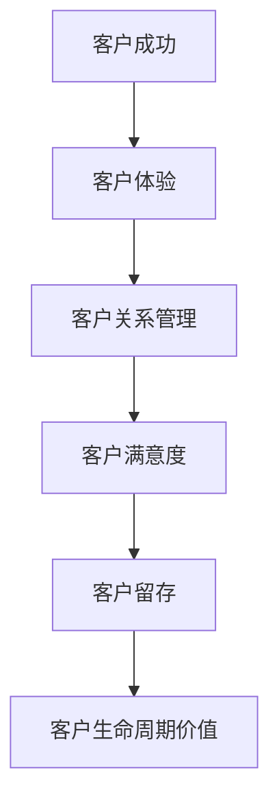

                 

### 背景介绍

#### 什么是“一人公司”

“一人公司”，顾名思义，是指仅由一人所创建、运营的公司。在传统的商业环境中，公司通常需要至少两名股东，而在一人公司中，这一限制被打破。一人公司可以是由一个自然人或法人独资设立的有限责任公司。这种公司形式在全球范围内都有应用，尤其是在一些法律体系允许灵活公司结构的国家。

#### 一人公司的优势

一人公司的优势主要体现在以下几个方面：

1. **决策效率高**：由于公司只有一个所有者和决策者，决策过程相对简单，无需进行繁琐的股东会或董事会会议，有利于快速响应市场变化。
2. **运营成本低**：一人公司不需要设立复杂的组织结构，因此可以减少人员成本和管理费用。
3. **便于管理**：单一所有者可以更全面地掌控公司的运营，确保资源的有效配置。
4. **风险隔离**：一人公司可以更好地实现个人资产与公司资产的隔离，降低法律风险。

#### 为什么需要高效的客户成功体系

在当今竞争激烈的市场环境中，拥有一个高效的客户成功体系对于一人公司至关重要。这不仅仅是为了留住客户，更重要的是通过提升客户满意度来创造持续的业务增长。以下是建立高效客户成功体系的主要原因：

1. **提高客户留存率**：通过提供优质的客户服务，一人公司可以减少客户的流失，提高客户忠诚度。
2. **增强客户体验**：高效的客户成功体系能够确保客户在购买产品或服务后获得愉快的体验，从而提升品牌形象。
3. **驱动业务增长**：满意的客户不仅会继续购买，还可能向他人推荐公司产品，从而带来更多的新客户。
4. **降低运营成本**：通过有效的客户管理和维护，公司可以减少客户投诉和纠纷，降低相应的运营成本。

总的来说，一人公司通过构建高效的客户成功体系，不仅可以提升客户满意度，还能在激烈的市场竞争中脱颖而出，实现可持续发展。

#### 关键概念：客户成功与客户体验

在讨论如何打造高效的客户成功体系时，我们必须首先理解两个关键概念：客户成功（Customer Success）和客户体验（Customer Experience）。

**客户成功**，简单来说，是指确保客户在使用产品或服务过程中获得成功和满足感。这不仅仅是满足客户的基本需求，更是在客户遇到问题或挑战时提供支持和解决方案。客户成功的目标是确保客户能够实现预期的业务价值。

**客户体验**，则是指客户在整个购买和使用过程中所感受到的整体感受。这包括从首次接触公司到购买后使用的每一个环节。良好的客户体验可以提升客户的满意度和忠诚度，进而推动业务增长。

将客户成功与客户体验相结合，一人公司可以创建一个全面的客户成功体系，不仅满足客户的基本需求，还能在客户心中建立起强大的品牌价值。

#### 为什么一人公司需要特别的客户成功体系

对于一人公司来说，构建一个特别的客户成功体系尤为重要，原因有以下几点：

1. **资源有限**：一人公司通常资源有限，需要通过高效的客户成功体系来最大化客户价值，从而实现业务的快速增长。
2. **决策快速**：一人公司的决策者能够快速响应客户需求，因此在客户成功体系的构建中，灵活性和快速反应至关重要。
3. **品牌建设**：对于一人公司来说，客户满意度和口碑至关重要，一个高效的客户成功体系可以帮助建立强大的品牌形象。
4. **风险控制**：通过有效的客户成功体系，一人公司可以更好地识别和管理客户风险，确保业务的稳定发展。

综上所述，一人公司需要特别的客户成功体系来应对其独特的商业环境和挑战，从而在激烈的市场竞争中取得成功。

---

### 核心概念与联系

在探讨如何打造高效的客户成功体系之前，我们需要明确几个核心概念，并理解它们之间的相互关系。以下是关键概念及其相互联系的分析：

#### 1. 客户成功（Customer Success）

客户成功是确保客户在使用产品或服务过程中取得成功和满足感的一系列策略和实践。它不仅关注客户获得预期的业务价值，还涵盖了解决客户在产品使用过程中遇到的问题。

#### 2. 客户体验（Customer Experience）

客户体验是客户在整个购买和使用过程中所感受到的整体感受。这包括从接触公司、购买、使用到售后支持等各个环节。良好的客户体验可以提升客户满意度和忠诚度。

#### 3. 客户关系管理（Customer Relationship Management, CRM）

客户关系管理是指通过技术和策略来管理公司与客户之间的关系，旨在提高客户满意度和忠诚度，从而推动业务增长。CRM系统可以帮助公司记录和分析客户数据，提供个性化服务。

#### 4. 客户满意度（Customer Satisfaction）

客户满意度是衡量客户对产品或服务的满意程度。一个高效的客户成功体系需要关注客户满意度，通过持续改进服务来满足客户期望。

#### 5. 客户留存（Customer Retention）

客户留存是指客户持续使用产品或服务的比例。高效的客户成功体系旨在降低客户流失率，提高客户留存率。

#### 6. 客户生命周期价值（Customer Lifetime Value, CLV）

客户生命周期价值是指一个客户在整个购买周期中为公司带来的总收益。通过提高客户满意度，一人公司可以增加客户的CLV。

#### 关系图

为了更好地理解这些概念之间的联系，我们可以使用Mermaid流程图来表示它们之间的关系：



#### 关键联系

- 客户成功和客户体验紧密相关，良好的客户体验可以促进客户成功。
- 客户关系管理是实现客户成功和客户体验的重要工具。
- 客户满意度是客户成功和客户体验的衡量指标。
- 客户留存和客户生命周期价值是衡量客户成功和业务增长的重要指标。

通过理解这些核心概念及其相互联系，一人公司可以更好地构建一个全面的客户成功体系，从而在激烈的市场竞争中脱颖而出。

---

### 核心算法原理 & 具体操作步骤

构建高效的客户成功体系需要运用一系列核心算法原理和具体操作步骤。以下是一系列关键步骤，它们共同构成了一个人公司打造高效客户成功体系的基础。

#### 1. 数据收集与分析

数据是构建客户成功体系的核心。一人公司需要收集客户的基本信息、购买历史、反馈和互动数据。具体操作步骤如下：

1. **数据收集**：
   - 利用CRM系统自动收集客户数据。
   - 通过在线问卷调查、访谈等方式收集客户反馈。
   - 分析社交媒体上的客户评论和互动。
2. **数据分析**：
   - 使用数据分析工具（如Excel、Tableau）对收集的数据进行整理和分析。
   - 确定客户行为模式、偏好和需求。
   - 识别潜在问题和机会。

#### 2. 客户细分

根据收集到的数据，将客户进行细分，以便更好地满足他们的需求。细分方法可以包括：

1. **基于购买历史**：
   - 按购买频率和购买量对客户进行分类。
   - 确定不同类型客户的购买模式和偏好。
2. **基于行为特征**：
   - 分析客户的互动行为，如点击率、留言频率、使用时长等。
   - 根据行为特征将客户分为活跃客户、潜在客户和流失客户。
3. **基于需求特征**：
   - 通过调查问卷或访谈了解客户的需求和痛点。
   - 根据需求特征将客户划分为不同类别。

#### 3. 客户画像

创建详细的客户画像，以便更好地理解客户的行为和需求。具体步骤包括：

1. **基本信息**：
   - 收集客户的姓名、联系方式、公司信息等基础数据。
2. **行为数据**：
   - 记录客户的购买历史、互动行为和反馈。
3. **需求数据**：
   - 通过调查问卷或访谈获取客户的期望和需求。
4. **综合分析**：
   - 结合以上信息，创建详细的客户画像。

#### 4. 客户沟通策略

根据客户细分和客户画像，制定个性化的客户沟通策略，以提高客户满意度。具体步骤如下：

1. **定制化沟通**：
   - 根据不同类型客户的特点，制定不同的沟通方式和内容。
   - 通过邮件、短信、社交媒体等多种渠道与客户进行沟通。
2. **定期跟进**：
   - 设定跟进计划，定期与客户联系，了解他们的最新需求和反馈。
   - 在关键节点（如产品发布、活动等）提供及时的信息更新。
3. **个性化推荐**：
   - 利用客户数据，提供个性化的产品或服务推荐。
   - 根据客户的购买历史和行为数据，推送相关的内容和优惠。

#### 5. 客户反馈机制

建立有效的客户反馈机制，以持续改进产品和服务。具体步骤如下：

1. **反馈渠道**：
   - 提供多种反馈渠道，如在线问卷、电话、邮件等。
   - 鼓励客户通过社交媒体平台分享他们的体验和意见。
2. **反馈分析**：
   - 定期分析客户反馈，识别主要问题和改进机会。
   - 将客户反馈与业务目标和策略相结合，制定改进计划。
3. **反馈响应**：
   - 及时回复客户的反馈，展示对客户意见的重视。
   - 针对客户提出的问题，提供具体的解决方案和改进措施。

通过以上步骤，一人公司可以构建一个高效的客户成功体系，确保客户在使用产品或服务的过程中获得成功和满足感。这一体系不仅能够提高客户满意度和忠诚度，还能为公司的持续增长提供有力支持。

---

### 数学模型和公式 & 详细讲解 & 举例说明

在构建高效的客户成功体系时，数学模型和公式能够帮助我们量化分析客户行为和需求，从而制定更有效的策略。以下是一些关键的数学模型和公式，并对其进行详细讲解和举例说明。

#### 1. 客户生命周期价值（Customer Lifetime Value, CLV）

客户生命周期价值是指一个客户在一生中为公司带来的总收益。计算CLV可以帮助公司识别高价值客户，并制定相应的客户维护策略。公式如下：

$$
\text{CLV} = \sum_{t=1}^{n} \frac{\text{CT}(\text{t})}{(1 + \text{r})^t}
$$

其中，CT(t) 是第 t 年的客户收益，r 是折现率。

**例：** 假设一个客户在第一年为公司带来 $1000 的收益，第二年为 $800，第三年为 $600。假设折现率为 10%。那么这个客户的 CLV 计算如下：

$$
\text{CLV} = \frac{1000}{1.1} + \frac{800}{1.1^2} + \frac{600}{1.1^3} \approx 2125.93
$$

通过计算CLV，公司可以识别出哪些客户具有较高的价值，从而投入更多资源进行维护。

#### 2. 客户保留率（Customer Retention Rate）

客户保留率是衡量客户持续使用产品或服务的比例。公式如下：

$$
\text{保留率} = \frac{\text{第 t 年末的客户数} - \text{第 t 年流失的客户数}}{\text{第 t 年初的客户数}} \times 100\%
$$

**例：** 假设一家公司年初有 100 名客户，年底有 80 名客户流失，年末的客户数为 120。那么该公司的客户保留率为：

$$
\text{保留率} = \frac{120 - (100 - 80)}{100} \times 100\% = 80\%
$$

通过计算客户保留率，公司可以评估其客户成功策略的有效性，并制定相应的改进措施。

#### 3. 客户满意度（Customer Satisfaction）

客户满意度通常通过问卷调查或评分系统来衡量。公式如下：

$$
\text{满意度} = \frac{\text{满意客户数}}{\text{调查客户总数}} \times 100\%
$$

**例：** 假设一家公司调查了 100 名客户，其中 70 名表示满意，那么该公司的客户满意度为：

$$
\text{满意度} = \frac{70}{100} \times 100\% = 70\%
$$

通过定期评估客户满意度，公司可以了解客户对产品或服务的感受，并针对不满意的部分进行改进。

#### 4. 客户净推荐值（Net Promoter Score, NPS）

客户净推荐值是一种衡量客户忠诚度和推荐意愿的指标。公式如下：

$$
\text{NPS} = \text{推荐者比例} - \text{批评者比例}
$$

其中，推荐者是指那些愿意向他人推荐公司产品或服务的客户，批评者则是那些不太可能推荐的公司客户。

**例：** 假设一家公司有 100 名客户，其中 30 名表示愿意推荐，10 名表示不太可能推荐。那么该公司的NPS为：

$$
\text{NPS} = 30\% - 10\% = 20\%
$$

NPS可以用于评估公司的整体客户满意度和忠诚度，并指导改进策略。

通过运用这些数学模型和公式，一人公司可以更准确地分析和预测客户行为，从而制定更有效的客户成功策略。这些工具不仅有助于提高客户满意度和忠诚度，还能为公司的持续增长提供有力支持。

---

### 项目实战：代码实际案例和详细解释说明

在本章节中，我们将通过一个实际的项目案例来展示如何构建高效的客户成功体系。我们将从开发环境搭建开始，详细讲解源代码的实现过程，并对关键代码段进行解读和分析。

#### 5.1 开发环境搭建

首先，我们需要搭建一个合适的技术环境，以支持我们的客户成功项目。以下是所需的工具和步骤：

1. **安装Python**：确保系统已安装Python 3.8及以上版本。
2. **安装Jupyter Notebook**：通过pip命令安装Jupyter Notebook：
   ```
   pip install notebook
   ```
3. **安装CRM系统**：选择一个适合的CRM系统，如Salesforce或Zoho CRM。在本案例中，我们选择Zoho CRM，并按照其官方文档进行安装和配置。
4. **安装数据分析工具**：安装Pandas、NumPy、Matplotlib等数据分析工具：
   ```
   pip install pandas numpy matplotlib
   ```
5. **配置API接口**：为了从CRM系统中获取客户数据，我们需要配置API接口，并获取相应的API密钥。

#### 5.2 源代码详细实现和代码解读

以下是一个简单的Python脚本，用于从CRM系统中获取客户数据，并进行数据分析。

```python
import pandas as pd
import numpy as np
import matplotlib.pyplot as plt
import requests

# API配置
api_url = "https://crm.zoho.com/crm/private/json/Contacts/getRecords"
api_params = {
    'authtoken': '你的API密钥',
    'scope': 'MyDomain',
    'format': 'JSON',
    'per_page': 100,
    'page': 1
}

# 获取客户数据
response = requests.get(api_url, params=api_params)
data = response.json()

# 解析客户数据
contacts = data['Contacts']
contact_list = []
for contact in contacts:
    contact_dict = {
        'Name': contact['Name'],
        'Email': contact['Email'],
        'LastActivityDate': contact['LastActivityDate']
    }
    contact_list.append(contact_dict)

df = pd.DataFrame(contact_list)

# 数据清洗
df['LastActivityDate'] = pd.to_datetime(df['LastActivityDate'])
df['LastActivityYear'] = df['LastActivityDate'].dt.year

# 数据分析
# 统计各年度客户数量
yearly_counts = df.groupby('LastActivityYear').size()

# 可视化展示
plt.figure(figsize=(10, 5))
yearly_counts.plot()
plt.title('Yearly Customer Counts')
plt.xlabel('Year')
plt.ylabel('Number of Customers')
plt.show()

# 客户细分
# 按客户活跃度进行分类
active_threshold = df['LastActivityDate'].dt.days.max() // 30
df['ActivityLevel'] = np.where(df['LastActivityDate'].dt.days > active_threshold, 'Active', 'Inactive')

# 统计活跃客户和潜在客户
active_customers = df[df['ActivityLevel'] == 'Active'].shape[0]
inactive_customers = df[df['ActivityLevel'] == 'Inactive'].shape[0]
print(f"Active Customers: {active_customers}, Inactive Customers: {inactive_customers}")

# 客户画像
# 创建客户画像数据框
customer_profile = df[['Name', 'Email', 'ActivityLevel']]

# 输出客户画像
print(customer_profile.head())
```

**代码解读：**

1. **API调用**：我们使用`requests`库向Zoho CRM发送GET请求，获取客户数据。
2. **数据解析**：从响应中提取客户数据，并使用Pandas库将其转换为DataFrame格式。
3. **数据清洗**：将日期字段转换为标准格式，并提取年份信息。
4. **数据分析**：统计各年度客户数量，并使用Matplotlib库进行可视化展示。
5. **客户细分**：根据客户的活动日期，将客户分为活跃客户和潜在客户。
6. **客户画像**：创建一个包含客户基本信息和活动水平的DataFrame，用于进一步分析。

通过这个实际案例，我们可以看到如何利用Python和数据分析工具来构建一个高效的客户成功体系。这个案例展示了从数据收集、清洗、分析到可视化的完整流程，为一人公司提供了一个实用的模板。

---

### 代码解读与分析

在本章节中，我们将对上一节中的Python脚本进行详细解读与分析，解释每个关键部分的实现方法和目的。

#### 代码段 1：API调用

```python
response = requests.get(api_url, params=api_params)
data = response.json()
```

**解读：**
这个代码段负责调用Zoho CRM API以获取客户数据。`requests.get()` 函数用于发送HTTP GET请求。`api_url` 是Zoho CRM API的URL，`api_params` 是请求的参数，包括API密钥、请求范围和格式等。

**目的：** 
通过API调用，我们可以从CRM系统中获取客户的详细信息，包括姓名、电子邮件和最后活动日期。

#### 代码段 2：数据解析

```python
contacts = data['Contacts']
contact_list = []
for contact in contacts:
    contact_dict = {
        'Name': contact['Name'],
        'Email': contact['Email'],
        'LastActivityDate': contact['LastActivityDate']
    }
    contact_list.append(contact_dict)
df = pd.DataFrame(contact_list)
```

**解读：**
这个代码段将API响应中的客户数据解析成Python字典列表，并将其转换为Pandas DataFrame。通过遍历API响应中的`Contacts`列表，我们提取每个联系人的姓名、电子邮件和最后活动日期，并将它们添加到`contact_dict`中。最后，使用`pd.DataFrame()` 函数将这些字典转换为DataFrame。

**目的：**
将API获取的客户数据转换为易于分析的格式，以便进行后续的数据处理和分析。

#### 代码段 3：数据清洗

```python
df['LastActivityDate'] = pd.to_datetime(df['LastActivityDate'])
df['LastActivityYear'] = df['LastActivityDate'].dt.year
```

**解读：**
这个代码段负责将`LastActivityDate`字段从字符串格式转换为日期格式，并提取年份信息。`pd.to_datetime()` 函数用于将字符串转换为日期对象，`dt.year` 方法用于提取年份。

**目的：**
确保数据的一致性和准确性，以便进行时间序列分析和统计。

#### 代码段 4：数据分析

```python
yearly_counts = df.groupby('LastActivityYear').size()
plt.figure(figsize=(10, 5))
yearly_counts.plot()
plt.title('Yearly Customer Counts')
plt.xlabel('Year')
plt.ylabel('Number of Customers')
plt.show()
```

**解读：**
这个代码段用于统计各年度的客户数量，并使用Matplotlib库进行可视化展示。`groupby()` 方法按年份分组，`size()` 方法计算每个组的数量。`plot()` 函数用于生成折线图，显示客户数量随时间的变化。

**目的：**
通过可视化分析，我们可以直观地了解客户数量的年度变化趋势。

#### 代码段 5：客户细分

```python
active_threshold = df['LastActivityDate'].dt.days.max() // 30
df['ActivityLevel'] = np.where(df['LastActivityDate'].dt.days > active_threshold, 'Active', 'Inactive')
active_customers = df[df['ActivityLevel'] == 'Active'].shape[0]
inactive_customers = df[df['ActivityLevel'] == 'Inactive'].shape[0]
print(f"Active Customers: {active_customers}, Inactive Customers: {inactive_customers}")
```

**解读：**
这个代码段根据客户最后活动日期的间隔时间，将客户分为“活跃”和“非活跃”两类。我们首先计算活跃客户的阈值（即30天以上未活动），然后使用`np.where()` 函数根据这个阈值分配活动水平标签。最后，统计活跃和非活跃客户的数量。

**目的：**
通过客户细分，我们可以识别并专注于活跃客户，从而提高客户成功的针对性。

#### 代码段 6：客户画像

```python
customer_profile = df[['Name', 'Email', 'ActivityLevel']]
print(customer_profile.head())
```

**解读：**
这个代码段创建一个包含客户基本信息（姓名、电子邮件和活动水平）的DataFrame。通过`head()` 方法，我们可以查看前几行数据，以验证数据的完整性和准确性。

**目的：**
生成客户画像，以便进一步分析客户行为和需求。

通过详细解读和分析这些代码段，我们可以看到如何使用Python和Pandas库来构建一个高效的客户成功体系。这个案例展示了数据收集、清洗、分析和可视化的全过程，为一人公司提供了一个实用的模板，以提升客户满意度和忠诚度。

---

### 实际应用场景

在构建高效的客户成功体系时，考虑实际应用场景至关重要。以下是一些具体的应用场景，以及如何利用客户成功策略来应对这些场景：

#### 1. 新客户获取

**场景描述**：公司刚刚推出了一个新产品，需要快速吸引新客户。

**解决方案**：
- **定制化营销**：利用客户数据，向潜在客户发送个性化的推广邮件和短信，提供产品试用或优惠。
- **社交媒体营销**：通过社交媒体平台发布产品信息，利用社交媒体的影响力扩大品牌知名度。
- **用户推荐计划**：鼓励现有客户推荐新客户，通过奖励机制提高推荐率。

#### 2. 客户留存

**场景描述**：公司希望提高现有客户的留存率，减少客户流失。

**解决方案**：
- **定期沟通**：定期与客户联系，了解他们的需求和反馈，提供个性化的服务和产品推荐。
- **客户关怀活动**：举办定期的线上或线下活动，增强客户对品牌的忠诚度。
- **客户教育**：通过教程、案例研究和白皮书等形式，教育客户如何最大化利用产品或服务。

#### 3. 客户满意度提升

**场景描述**：公司希望通过改进客户体验，提高客户满意度。

**解决方案**：
- **反馈机制**：建立有效的反馈渠道，如在线问卷、电话和邮件，鼓励客户分享他们的体验。
- **快速响应**：确保客户问题得到及时响应，提供专业的解决方案和指导。
- **个性化服务**：根据客户需求和偏好，提供定制化的服务和支持，提升客户的满意感受。

#### 4. 增加客户生命周期价值

**场景描述**：公司希望提高每个客户的长期价值，实现持续增长。

**解决方案**：
- **交叉销售和增值服务**：通过分析客户数据，向现有客户提供相关的附加产品或服务，增加客户收入。
- **客户成长计划**：为不同类型的客户制定成长计划，提供培训、技术支持和市场推广资源。
- **持续改进**：根据客户反馈和市场变化，持续优化产品和服务，提高客户满意度和忠诚度。

#### 5. 管理客户风险

**场景描述**：公司需要识别和管理潜在的客户风险，确保业务的稳定发展。

**解决方案**：
- **风险评估**：定期对客户进行风险评估，识别高风险客户。
- **风险预警**：建立预警系统，及时发现客户风险信号，采取预防措施。
- **风险控制**：制定风险管理策略，如调整服务策略、增加客户支持资源等，降低客户风险。

通过针对不同实际应用场景制定相应的客户成功策略，一人公司可以更有效地提高客户满意度、留存率和生命周期价值，从而在激烈的市场竞争中脱颖而出。

---

### 工具和资源推荐

在构建高效的客户成功体系过程中，选择合适的工具和资源至关重要。以下是一些推荐的工具、书籍、博客和网站，可以帮助您更好地实施和优化客户成功策略。

#### 1. 学习资源推荐

**书籍：**
- 《客户成功：实现业务增长的秘诀》（Customer Success: The Next Wave of Profitable Business Models）- by Nick Mehta
- 《客户至上：打造以客户为中心的企业》（The Customer Century: How to Build Value in Times of Great Change）- by Bob Thompson
- 《客户成功：构建和管理以客户为中心的业务》（Customer Success: The Real World of Customer-Centric Business）- by Nils Sneyers

**论文：**
- "Customer Success: Definition, Metrics, and Framework" - by Lever
- "Customer Success Management: A Comprehensive Review" - by Arnett et al.
- "The Role of Customer Success in SaaS Companies" - by Davies

**博客：**
- [Gainsight博客](https://www.gainsight.com/blog/)
- [Customer Success Partners博客](https://customersuccesspartners.com/)
- [EverString博客](https://www.everstring.com/blog/)

**网站：**
- [Customer Success Association](https://customersuccessassociation.com/)
- [Customer Success Pro](https://customersuccesspro.com/)
- [Customer Success Forum](https://customersuccessforum.com/)

#### 2. 开发工具框架推荐

**CRM系统：**
- Salesforce：全球领先的CRM平台，提供全面的客户管理功能。
- HubSpot：集成营销自动化和CRM功能的平台，适合中小型公司。
- Zoho CRM：功能丰富且价格合理的CRM解决方案，适合多种业务需求。

**数据分析工具：**
- Tableau：强大的数据可视化工具，帮助您直观地呈现客户数据。
- Google Data Studio：与Google Analytics和Google Sheets集成，轻松创建专业的数据报表。
- Power BI：微软推出的商业智能工具，提供丰富的报表和分析功能。

**客户反馈工具：**
- Zendesk：全面的客户服务和支持平台，包括反馈收集和票务系统。
- SurveyMonkey：专业的在线调查工具，帮助您收集和分析客户反馈。
- Qualtrics：功能强大的反馈和调研平台，适用于各种规模的业务。

#### 3. 相关论文著作推荐

**《客户成功管理：理论与实践》（Customer Success Management: Theory and Practice）** - 由国际客户成功专家编辑的论文集，涵盖了客户成功管理的各个方面。

**《客户成功手册：从战略到执行》（The Customer Success Handbook: From Strategy to Execution）** - 一本实用的指南，提供了构建和优化客户成功体系的全面步骤。

**《SaaS时代的客户成功》（Customer Success in the SaaS Era）** - 探讨了SaaS公司在客户成功管理中的最佳实践和挑战。

这些工具和资源将帮助您在构建高效的客户成功体系过程中，获得所需的知识和技能，从而实现业务增长和客户满意度的提升。

---

### 总结：未来发展趋势与挑战

在构建高效的客户成功体系方面，未来的发展趋势和面临的挑战是多方面的。随着技术的不断进步和市场环境的变化，一人公司需要不断创新和适应，以保持竞争优势。

#### 未来发展趋势

1. **数据驱动的决策**：随着大数据和人工智能技术的普及，越来越多的公司开始利用数据驱动决策。客户成功体系将更加依赖于数据分析，以预测客户行为、优化服务和提升客户体验。
2. **个性化服务**：随着客户需求的多样化和个性化趋势，一人公司需要提供更加个性化的服务。通过使用客户数据，公司可以更好地理解客户偏好，提供定制化的解决方案。
3. **全渠道整合**：客户成功体系将更加注重全渠道整合，确保客户在各个接触点上获得一致的体验。无论是线上还是线下，公司需要提供无缝的客户服务。
4. **自动化与智能化**：自动化和智能化的工具将越来越多地应用于客户成功管理中，如智能客服、自动化跟进和预测分析等，以提高效率和降低成本。

#### 面临的挑战

1. **数据隐私和安全**：随着数据隐私法规的日益严格，如何保护客户数据隐私成为一个重大挑战。公司需要确保数据安全，遵守相关法律法规，以维护客户信任。
2. **技术变革的适应**：技术变革速度极快，一人公司需要不断学习和适应新技术，以保持竞争优势。这可能包括学习新的数据分析工具、掌握新的营销技术等。
3. **人才缺口**：随着客户成功的重要性日益凸显，对具备数据分析、客户关系管理和市场营销技能的人才需求也越来越大。然而，人才短缺是一个普遍的挑战。
4. **客户期望的提高**：随着客户对服务的期望不断提高，公司需要提供更加优质和个性化的服务。这要求公司不断提升服务质量，以满足客户的期望。

总的来说，未来一人公司构建高效的客户成功体系需要关注数据驱动、个性化服务、全渠道整合和自动化与智能化。同时，公司也需要应对数据隐私和安全、技术变革的适应、人才缺口和客户期望提高等挑战。通过不断创新和适应，一人公司可以在激烈的市场竞争中脱颖而出。

---

### 附录：常见问题与解答

在构建高效的客户成功体系过程中，可能会遇到一些常见的问题。以下是一些常见问题及其解答：

#### 问题 1：如何确定客户成功的指标？

**解答**：确定客户成功的指标需要从公司的业务目标和客户需求出发。常见的客户成功指标包括：
- **客户生命周期价值（CLV）**：衡量客户在生命周期中为公司带来的总收益。
- **客户保留率（Retention Rate）**：衡量客户持续使用产品或服务的比例。
- **客户满意度（Customer Satisfaction）**：通过问卷调查或评分系统来衡量客户对产品或服务的满意程度。
- **客户净推荐值（NPS）**：衡量客户推荐意愿的指标。

#### 问题 2：如何收集客户数据？

**解答**：收集客户数据可以通过以下几种方式：
- **CRM系统**：利用CRM系统自动收集客户的基本信息、购买历史和互动数据。
- **在线问卷调查**：通过在线问卷收集客户的反馈和需求。
- **社交媒体互动**：通过社交媒体平台获取客户反馈和意见。
- **客户访谈**：定期进行客户访谈，深入了解客户的需求和痛点。

#### 问题 3：如何细分客户？

**解答**：客户细分可以通过以下方法进行：
- **购买历史**：根据客户的购买频率和购买量进行分类。
- **行为特征**：根据客户的互动行为，如点击率、留言频率等进行分类。
- **需求特征**：通过调查问卷或访谈了解客户的需求和痛点，根据需求特征进行分类。

#### 问题 4：如何建立有效的客户反馈机制？

**解答**：建立有效的客户反馈机制可以采取以下步骤：
- **提供多种反馈渠道**：如在线问卷、电话、邮件和社交媒体等。
- **定期收集反馈**：设定周期性收集客户反馈的流程，确保及时获取客户的最新意见。
- **分析反馈**：定期分析客户反馈，识别主要问题和改进机会。
- **及时响应**：对客户反馈进行及时响应，展示对客户意见的重视。

通过解决这些常见问题，一人公司可以更好地构建和优化客户成功体系，从而提高客户满意度和忠诚度，实现业务的持续增长。

---

### 扩展阅读 & 参考资料

为了进一步深入了解客户成功体系和相关实践，以下是推荐的扩展阅读和参考资料：

#### 书籍

1. **《客户成功：实现业务增长的秘诀》（Customer Success: The Next Wave of Profitable Business Models）** - 作者：Nick Mehta
   - 详细探讨了客户成功的概念和其在业务增长中的关键作用。
2. **《客户至上：打造以客户为中心的企业》（The Customer Century: How to Build Value in Times of Great Change）** - 作者：Bob Thompson
   - 探讨了客户中心化战略的重要性，以及如何在竞争激烈的市场中实现持续增长。
3. **《客户成功手册：从战略到执行》（The Customer Success Handbook: From Strategy to Execution）** - 作者：Nils Sneyers
   - 提供了构建和优化客户成功体系的全面指南，适用于各种规模的企业。

#### 论文

1. **"Customer Success: Definition, Metrics, and Framework"** - 作者：Lever
   - 对客户成功进行了定义，并提出了衡量客户成功的指标和框架。
2. **"Customer Success Management: A Comprehensive Review"** - 作者：Arnett et al.
   - 对客户成功管理的各个方面进行了全面的综述，包括战略、技术和实践。
3. **"The Role of Customer Success in SaaS Companies"** - 作者：Davies
   - 分析了SaaS公司在客户成功管理中的最佳实践和挑战。

#### 博客

1. **Gainsight博客** - [https://www.gainsight.com/blog/](https://www.gainsight.com/blog/)
   - 提供关于客户成功管理的前沿知识和最佳实践。
2. **Customer Success Partners博客** - [https://customersuccesspartners.com/](https://customersuccesspartners.com/)
   - 分享客户成功策略的实际案例和见解。
3. **EverString博客** - [https://www.everstring.com/blog/](https://www.everstring.com/blog/)
   - 探讨客户数据分析和客户成功管理的相关话题。

#### 网站

1. **Customer Success Association** - [https://customersuccessassociation.com/](https://customersuccessassociation.com/)
   - 提供客户成功领域的教育和资源。
2. **Customer Success Pro** - [https://customersuccesspro.com/](https://customersuccesspro.com/)
   - 提供客户成功职业发展资源和培训。
3. **Customer Success Forum** - [https://customersuccessforum.com/](https://customersuccessforum.com/)
   - 一个社区平台，供专业人士分享经验和讨论客户成功话题。

通过阅读这些书籍、论文和博客，您可以获得更多关于客户成功体系的深入见解和实践指导，从而更好地构建和优化自己的客户成功策略。

