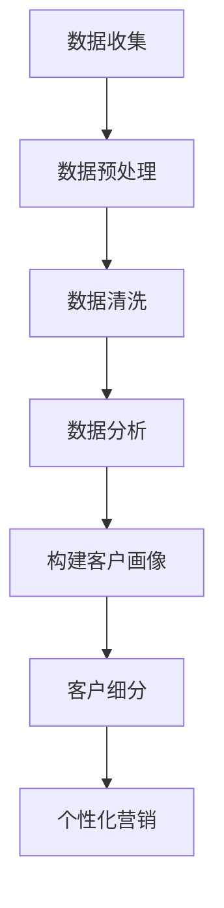

                 

# 一人公司的AI驱动客户画像：深入理解目标用户的数据分析

## 关键词：AI驱动的客户画像、数据分析、目标用户、个性化营销、机器学习算法

### 摘要：

本文将深入探讨一人公司如何利用AI技术构建客户画像，并通过数据分析来理解目标用户。我们将介绍构建客户画像的核心概念、算法原理和实施步骤，并通过实际项目案例展示如何将理论知识应用到实践中。此外，文章还将讨论客户画像的实际应用场景，并推荐相关学习资源和开发工具。

## 1. 背景介绍

在当今的商业环境中，了解客户需求和行为是关键。传统的市场调研方法可能成本高昂且难以实时响应。而AI驱动的客户画像技术则为公司提供了一个强大的工具，能够高效地分析和预测客户行为，从而实现个性化营销和精准推广。通过AI技术，公司可以自动化地收集、处理和分析大量数据，以构建全面的客户画像，进而更好地了解目标用户。

### 1.1 数据的重要性

数据是现代商业的基石。越来越多的公司意识到，拥有丰富的客户数据不仅能够帮助他们更好地了解客户，还能带来巨大的商业价值。例如，通过对客户购买历史、浏览行为和社交媒体活动等数据的分析，公司可以发现潜在的市场机会，制定更加精准的市场策略。

### 1.2 AI在商业中的应用

AI技术在商业领域有着广泛的应用。从自动化客服系统到智能推荐引擎，AI技术正在改变我们的工作方式。特别是在客户画像方面，AI可以帮助公司自动化地识别客户特征，预测客户需求，从而实现更有效的营销策略。这种技术不仅能够提高客户满意度，还能显著提升公司的业绩。

## 2. 核心概念与联系

### 2.1 客户画像

客户画像是指通过收集和分析客户数据，构建出一个全面、动态的客户视图。这个视图包括客户的个人特征、行为习惯、购买偏好等，从而帮助企业更好地了解和预测客户行为。

### 2.2 数据来源

客户画像的数据来源主要包括以下几种：

- **结构化数据**：如客户基本信息、购买记录、交易数据等。
- **半结构化数据**：如社交媒体活动、搜索引擎查询日志等。
- **非结构化数据**：如客户评论、反馈、博客等。

### 2.3 数据分析

数据分析是构建客户画像的核心环节。通过数据挖掘和机器学习算法，可以从大量数据中提取出有价值的信息。常用的数据分析方法包括聚类分析、关联规则挖掘、时间序列分析等。

### 2.4 Mermaid流程图

以下是一个简单的Mermaid流程图，展示了客户画像构建的基本流程：



## 3. 核心算法原理 & 具体操作步骤

### 3.1 数据收集

数据收集是构建客户画像的第一步。公司可以通过多种途径收集客户数据，包括在线调查、购买记录、社交媒体活动等。

### 3.2 数据预处理

在收集到数据后，需要对数据进行预处理，包括去重、去噪、格式转换等。这一步的目的是确保数据的质量和一致性。

### 3.3 数据清洗

数据清洗是数据预处理的一部分，主要是去除数据中的错误、异常和重复记录。常用的方法包括规则清洗、机器学习清洗等。

### 3.4 数据分析

数据分析是客户画像构建的核心。常用的算法包括：

- **聚类分析**：将相似的数据分为一组，从而发现潜在的客户群体。
- **关联规则挖掘**：发现数据之间的关联性，从而识别客户的购买偏好。
- **时间序列分析**：分析客户行为随时间的变化趋势，预测客户未来的行为。

### 3.5 构建客户画像

在完成数据分析后，可以根据分析结果构建客户画像。客户画像通常包括以下内容：

- **个人特征**：如年龄、性别、职业等。
- **行为特征**：如购买频率、购买金额、浏览时长等。
- **偏好特征**：如喜欢的商品类别、品牌等。

### 3.6 客户细分

根据客户画像，可以将客户分为不同的群体。客户细分有助于公司制定更加精准的营销策略，提高营销效果。

## 4. 数学模型和公式 & 详细讲解 & 举例说明

### 4.1 聚类分析

聚类分析是一种无监督学习方法，用于将数据集划分为若干个类别。常用的聚类算法包括K-means、层次聚类等。

#### 4.1.1 K-means算法

K-means算法的目标是将数据划分为K个簇，使得每个簇内的数据点之间距离尽可能近，簇与簇之间距离尽可能远。

**数学模型**：

$$
\text{目标函数} = \sum_{i=1}^{K} \sum_{x_j \in S_i} ||x_j - \mu_i||^2
$$

其中，$S_i$表示第$i$个簇，$\mu_i$表示簇中心。

**举例说明**：

假设我们有以下数据集：

| 数据点 | 特征1 | 特征2 | 特征3 |
|--------|-------|-------|-------|
| 1      | 1     | 2     | 3     |
| 2      | 2     | 4     | 5     |
| 3      | 1     | 3     | 6     |
| 4      | 2     | 5     | 7     |

使用K-means算法，我们可以将其划分为两个簇：

- 簇1：数据点1、2
- 簇2：数据点3、4

簇中心分别为：

- 簇1中心：(1.5, 3.5)
- 簇2中心：(1.5, 5.5)

### 4.2 关联规则挖掘

关联规则挖掘用于发现数据之间的关联性。常用的算法包括Apriori算法、FP-growth算法等。

#### 4.2.1 Apriori算法

Apriori算法的目标是发现数据之间的频繁项集。频繁项集是指在一组数据中，出现频率超过最小支持度的项集。

**数学模型**：

- 支持度（Support）：项集在数据集中的出现频率。
- 置信度（Confidence）：规则的前件和后件同时出现的概率。

**举例说明**：

假设我们有以下购物篮数据：

| 购物篮 | 商品1 | 商品2 | 商品3 |
|--------|-------|-------|-------|
| 1      | A     | B     |       |
| 2      | A     | C     |       |
| 3      | A     | D     |       |
| 4      | B     | C     |       |
| 5      | B     | D     |       |

使用Apriori算法，我们可以发现以下频繁项集：

- {A, B}：支持度=3，置信度=1
- {A, C}：支持度=2，置信度=2/3
- {A, D}：支持度=2，置信度=2/3

### 4.3 时间序列分析

时间序列分析用于分析数据随时间的变化趋势。常用的算法包括ARIMA、LSTM等。

#### 4.3.1 ARIMA算法

ARIMA算法是一种经典的时序分析模型，用于分析时间序列数据。

**数学模型**：

$$
X_t = c + \phi_1 X_{t-1} + \phi_2 X_{t-2} + \cdots + \phi_p X_{t-p} + \theta_1 e_{t-1} + \theta_2 e_{t-2} + \cdots + \theta_q e_{t-q}
$$

其中，$X_t$表示时间序列数据，$e_t$表示白噪声。

**举例说明**：

假设我们有以下时间序列数据：

| 时间 | 数据 |
|------|------|
| 1    | 10   |
| 2    | 12   |
| 3    | 15   |
| 4    | 18   |
| 5    | 20   |

使用ARIMA算法，我们可以将其建模为：

$$
X_t = 0.8 X_{t-1} + 0.2 X_{t-2} + e_t
$$

## 5. 项目实战：代码实际案例和详细解释说明

### 5.1 开发环境搭建

为了实现客户画像项目，我们需要搭建以下开发环境：

- Python 3.8+
- Jupyter Notebook
- pandas
- scikit-learn
- matplotlib

安装方法如下：

```bash
pip install python==3.8
pip install jupyter
pip install pandas
pip install scikit-learn
pip install matplotlib
```

### 5.2 源代码详细实现和代码解读

下面是一个简单的客户画像项目示例，包含数据收集、数据预处理、数据分析、构建客户画像和客户细分等步骤。

```python
import pandas as pd
from sklearn.cluster import KMeans
from sklearn.preprocessing import StandardScaler
import matplotlib.pyplot as plt

# 5.2.1 数据收集
data = pd.read_csv('customer_data.csv')

# 5.2.2 数据预处理
# 数据清洗和格式转换
data = data.drop_duplicates()
data = data.reset_index(drop=True)

# 5.2.3 数据分析
# 特征选择
features = data[['age', 'income', 'spending_score']]

# 特征标准化
scaler = StandardScaler()
features_scaled = scaler.fit_transform(features)

# 聚类分析
kmeans = KMeans(n_clusters=3, random_state=42)
clusters = kmeans.fit_predict(features_scaled)

# 5.2.4 构建客户画像
data['cluster'] = clusters

# 5.2.5 客户细分
# 根据簇中心进行客户细分
cluster_centers = kmeans.cluster_centers_
data['segment'] = data.apply(lambda x: 'High' if x['cluster'] == 0 else 'Medium' if x['cluster'] == 1 else 'Low', axis=1)

# 5.2.6 可视化
plt.scatter(features_scaled[:, 0], features_scaled[:, 1], c=clusters)
plt.scatter(cluster_centers[:, 0], cluster_centers[:, 1], s=300, c='red')
plt.xlabel('Feature 1')
plt.ylabel('Feature 2')
plt.title('Customer Clusters')
plt.show()
```

### 5.3 代码解读与分析

- **数据收集**：从CSV文件中读取客户数据。
- **数据预处理**：去除重复数据，重新设置索引。
- **特征选择**：选择年龄、收入和消费评分作为特征。
- **特征标准化**：将特征进行标准化处理，以便更好地进行聚类分析。
- **聚类分析**：使用K-means算法进行聚类，根据簇中心划分客户群体。
- **构建客户画像**：将聚类结果添加到原始数据中，形成客户画像。
- **客户细分**：根据簇中心进行客户细分，形成不同的客户群体。
- **可视化**：使用散点图展示聚类结果和簇中心。

## 6. 实际应用场景

客户画像技术在多个行业有着广泛的应用。以下是一些实际应用场景：

- **零售业**：通过客户画像，零售业公司可以了解客户的购买习惯和偏好，从而制定更加精准的营销策略。
- **金融业**：金融公司可以使用客户画像来识别潜在的高风险客户，从而降低信用风险。
- **医疗行业**：医疗行业可以利用客户画像来分析患者的健康状况，从而提供更加个性化的医疗服务。

## 7. 工具和资源推荐

### 7.1 学习资源推荐

- **书籍**：
  - 《机器学习实战》
  - 《深入浅出数据分析》
  - 《Python数据科学手册》

- **论文**：
  - 《K-means算法的数学原理》
  - 《关联规则挖掘：算法与应用》
  - 《时间序列分析：理论和应用》

- **博客**：
  - medium.com/@datacamp
  - towardsdatascience.com/
  - datascienceplus.com/

- **网站**：
  - kaggle.com/
  - coursera.org/
  - edX.org/

### 7.2 开发工具框架推荐

- **Python数据科学库**：
  - pandas
  - numpy
  - scikit-learn
  - matplotlib

- **机器学习框架**：
  - TensorFlow
  - PyTorch
  - scikit-learn

### 7.3 相关论文著作推荐

- **《机器学习：一种概率视角》**：提供对机器学习算法的全面理解。
- **《数据挖掘：实用工具与技术》**：介绍数据挖掘的基本概念和方法。
- **《深度学习》**：介绍深度学习算法及其在数据处理中的应用。

## 8. 总结：未来发展趋势与挑战

随着AI技术的不断发展，客户画像技术在未来将更加成熟和广泛应用。然而，也面临着一些挑战：

- **数据隐私**：如何在保护客户隐私的前提下进行数据分析和客户画像构建。
- **算法透明性**：确保客户画像算法的透明性和可解释性。
- **模型泛化能力**：如何提高客户画像模型在不同场景下的泛化能力。

## 9. 附录：常见问题与解答

### 9.1 如何选择合适的聚类算法？

选择合适的聚类算法取决于具体的应用场景和数据类型。常见的聚类算法包括K-means、层次聚类、DBSCAN等。K-means适用于数据分布较为均匀的情况，层次聚类适用于层次结构明显的数据，而DBSCAN适用于非均匀分布的数据。

### 9.2 如何评估聚类效果？

评估聚类效果的方法包括内部评估指标（如轮廓系数、Calinski-Harabasz指数）和外部评估指标（如类内平均距离、类间平均距离）。通过比较不同聚类算法的评估结果，可以选择最佳的聚类算法。

## 10. 扩展阅读 & 参考资料

- **《机器学习与数据挖掘：实用工具与技术》**：详细介绍机器学习和数据挖掘的基本概念和技术。
- **《客户关系管理：策略、工具和实践》**：探讨客户关系管理的基本策略和实践方法。
- **《大数据技术导论》**：介绍大数据的基本概念、技术和应用。

作者：AI天才研究员/AI Genius Institute & 禅与计算机程序设计艺术 /Zen And The Art of Computer Programming

以上是本文的完整内容，感谢您的阅读。希望本文能帮助您更好地理解AI驱动的客户画像技术及其在实际应用中的价值。如果您有任何问题或建议，欢迎在评论区留言。期待与您一起探讨AI领域的最新发展和应用。|>

