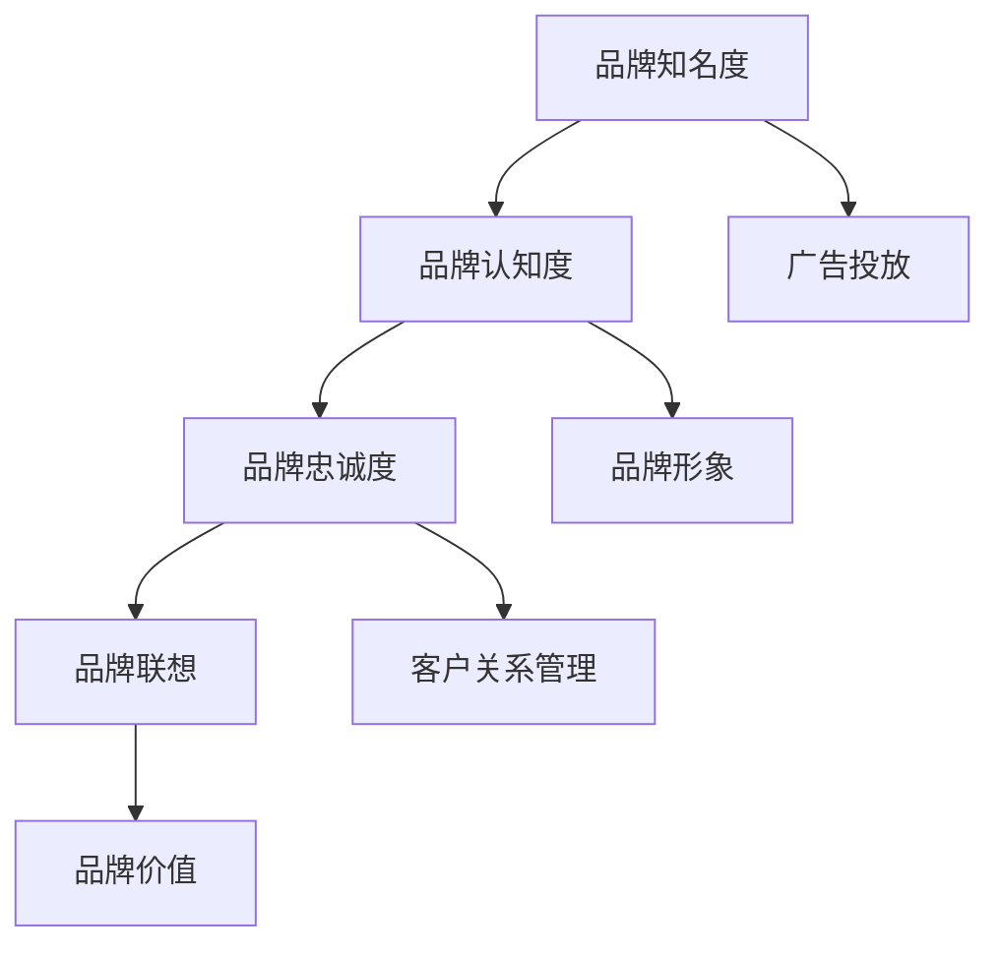

                 

### 背景介绍

在现代数字化经济时代，品牌资产的管理与价值最大化已成为企业成功的关键因素之一。随着互联网的普及和社交媒体的发展，品牌资产不再仅仅是一个商标或标识，它包含了企业的声誉、消费者忠诚度、市场份额等多个维度的价值。对于一家初创公司或个体经营者，如何高效地管理和提升品牌资产的价值，成为了他们能否在激烈的市场竞争中脱颖而出的关键。

本文将深入探讨一人公司的品牌资产管理与价值最大化的策略和方法。首先，我们将了解品牌资产的核心概念及其重要性。接着，我们将分析一人公司面临的独特挑战，并探讨如何利用技术和数据分析来优化品牌资产管理。随后，我们将详细介绍一个实际案例，展示如何通过品牌资产管理提升企业价值。文章的最后，我们将提供实用的工具和资源推荐，帮助读者进一步学习和实践。

品牌资产不仅是企业核心竞争力的体现，也是企业在长期发展中持续增值的重要资源。对于一家一人公司而言，有效的品牌资产管理不仅能够提升品牌知名度，还能为企业带来可观的商业价值。因此，深入理解品牌资产的管理策略，对于企业的长期发展至关重要。

### 核心概念与联系

在深入探讨品牌资产的管理与价值最大化之前，首先需要明确品牌资产的核心概念及其相互联系。品牌资产包含多个维度，如品牌知名度、品牌认知度、品牌忠诚度、品牌联想等。这些维度之间相互影响，共同构成了一个复杂的品牌生态系统。

#### 品牌知名度

品牌知名度是品牌资产的基础。它指的是消费者对品牌名称的熟悉程度。高知名度意味着消费者在考虑购买某个产品或服务时，能够迅速联想到该品牌。品牌知名度可以通过广告投放、社交媒体营销、公关活动等多种方式来提升。

#### 品牌认知度

品牌认知度是消费者对品牌特点、定位和价值观的了解程度。与品牌知名度不同，品牌认知度不仅关注品牌的存在，还关注品牌的内在价值。提升品牌认知度有助于建立品牌形象，从而增强消费者对品牌的信任和认同。

#### 品牌忠诚度

品牌忠诚度是消费者对品牌持续购买和忠诚程度的度量。高忠诚度意味着消费者在同类产品或服务中更倾向于选择该品牌，甚至在品牌出现问题或竞争品牌推出新产品时，也不会轻易改变选择。品牌忠诚度可以通过优质的产品和服务、客户关系管理、忠诚度计划等多种方式来培养。

#### 品牌联想

品牌联想是指消费者在想到某个品牌时，脑海中出现的关联词或画面。积极的品牌联想能够增强品牌形象，提高品牌价值。例如，苹果（Apple）品牌与高端科技、创新、简洁设计等联想紧密相关。

这些品牌资产维度之间存在密切的联系。品牌知名度是品牌认知度的基础，而品牌认知度和品牌忠诚度则是品牌知名度的延伸和深化。品牌联想则通过积极的品牌形象影响品牌忠诚度和品牌认知度。

为了更好地理解品牌资产的管理与价值最大化，我们可以通过Mermaid流程图来展示这些概念之间的联系：



在这个流程图中，我们可以看到品牌资产的核心维度如何相互关联，以及它们如何通过不同的策略来提升品牌价值。

接下来，我们将进一步探讨一人公司在品牌资产管理中面临的挑战，并分析如何利用技术和数据分析来优化品牌资产管理。

### 核心算法原理 & 具体操作步骤

在品牌资产管理中，核心算法原理和具体操作步骤至关重要。这些算法不仅能够帮助我们更准确地评估品牌资产的各个方面，还能提供有效的策略来提升品牌价值。以下是一些关键算法及其操作步骤：

#### 1. 品牌资产评估模型

品牌资产评估模型是衡量品牌价值的重要工具。其中，最具代表性的是Aaker品牌资产评估模型。该模型将品牌资产分为五个维度：品牌知名度、品牌忠诚度、品牌联想、品牌其他资产（如品牌价值、品牌资产表现）和企业绩效。每个维度都有相应的评估指标，例如：

- **品牌知名度**：包括品牌提及率、广告曝光度等。
- **品牌忠诚度**：包括重复购买率、客户满意度等。
- **品牌联想**：包括品牌与特定词汇或形象的关联度。
- **品牌其他资产**：包括品牌价值、品牌声誉等。
- **企业绩效**：包括市场占有率、财务表现等。

具体操作步骤如下：

1. **确定评估维度**：根据Aaker模型，明确需要评估的品牌资产维度。
2. **收集数据**：通过市场调研、客户反馈、财务报表等渠道收集相关数据。
3. **量化指标**：将收集到的数据进行量化处理，以便进行比较和分析。
4. **评分与加权**：根据各维度的重要程度，给予不同的权重，并进行评分。
5. **计算总分**：将各维度得分加权求和，得出品牌资产总评分。

#### 2. 数据分析算法

数据分析在品牌资产管理中起着至关重要的作用。以下是一些常用的数据分析算法：

- **聚类分析**：通过将相似的品牌进行分类，帮助我们了解不同品牌在市场中的分布情况，从而制定有针对性的营销策略。
- **关联规则分析**：用于发现品牌属性之间的关联关系，帮助我们了解哪些因素对品牌价值有显著影响。
- **时间序列分析**：用于分析品牌资产随时间的变化趋势，帮助我们预测未来的市场表现。

具体操作步骤如下：

1. **数据预处理**：清洗和整理数据，确保数据的质量和完整性。
2. **选择算法**：根据分析目标选择合适的算法。
3. **模型训练**：使用历史数据对算法进行训练，以生成预测模型。
4. **模型评估**：使用验证数据集评估模型的准确性和泛化能力。
5. **结果解释**：对分析结果进行解释，并据此制定相应的品牌管理策略。

#### 3. 实时监控算法

实时监控品牌资产的变化对于及时调整策略至关重要。以下是一些常用的实时监控算法：

- **事件流处理**：用于处理和实时分析大量的事件数据，如社交媒体评论、新闻报道等，以快速识别品牌风险和机会。
- **异常检测**：用于检测品牌资产中的异常情况，如负面评论、销售额下降等，以便及时采取措施。
- **预测分析**：基于历史数据预测品牌资产的未来变化趋势，帮助我们提前做好准备。

具体操作步骤如下：

1. **数据采集**：通过API、爬虫等技术手段采集实时数据。
2. **数据预处理**：对实时数据进行清洗和预处理，以便进行后续分析。
3. **算法应用**：使用实时监控算法对数据进行分析和处理。
4. **结果反馈**：将分析结果反馈给品牌管理人员，以便采取相应措施。

通过这些核心算法原理和具体操作步骤，一人公司可以更全面、更精准地管理和提升品牌资产价值。接下来，我们将探讨如何利用数学模型和公式来进一步优化品牌资产管理。

### 数学模型和公式 & 详细讲解 & 举例说明

在品牌资产的管理与价值最大化过程中，数学模型和公式提供了有力的工具，帮助我们量化品牌的不同维度，并制定出具体的策略。以下是一些常用的数学模型和公式，以及它们的详细讲解和举例说明。

#### 1. 品牌资产价值评估模型

Aaker品牌资产价值评估模型是一个广泛使用的工具，它通过五个维度来评估品牌资产的价值。这些维度及其相应的计算公式如下：

- **品牌知名度（A1）**：品牌知名度可以通过广告投放次数、品牌提及率等指标来衡量。
  \[
  A1 = \frac{广告投放次数 + 品牌提及率}{2}
  \]

- **品牌忠诚度（A2）**：品牌忠诚度可以通过重复购买率、客户满意度等指标来衡量。
  \[
  A2 = \frac{重复购买率 + 客户满意度}{2}
  \]

- **品牌联想（A3）**：品牌联想可以通过消费者对品牌的情感反应、品牌与特定词汇的关联度等指标来衡量。
  \[
  A3 = \frac{品牌情感反应 + 关联度}{2}
  \]

- **品牌其他资产（A4）**：品牌其他资产包括品牌价值、品牌声誉等，可以通过市场调研、财务分析等手段来衡量。
  \[
  A4 = \frac{品牌价值 + 品牌声誉}{2}
  \]

- **企业绩效（A5）**：企业绩效可以通过市场占有率、财务表现等指标来衡量。
  \[
  A5 = \frac{市场占有率 + 财务表现}{2}
  \]

综合这些维度的得分，可以得到品牌资产的总价值：
\[
品牌资产总价值 = A1 + A2 + A3 + A4 + A5
\]

**举例说明**：假设一家公司通过市场调研得到以下数据：
- 广告投放次数：1000次
- 品牌提及率：90%
- 重复购买率：70%
- 客户满意度：85%
- 品牌价值：$1,000,000
- 品牌声誉：良好
- 市场占有率：15%
- 财务表现：增长10%

根据上述公式，我们可以计算出品牌资产的总价值：
\[
A1 = \frac{1000 + 90}{2} = 500
\]
\[
A2 = \frac{70 + 85}{2} = 77.5
\]
\[
A3 = \frac{0.7 \times 1000 + 0.3 \times 85}{2} = 522.5
\]
\[
A4 = \frac{1,000,000 + 1}{2} = 500,000.5
\]
\[
A5 = \frac{15 + 10}{2} = 12.5
\]
\[
品牌资产总价值 = 500 + 77.5 + 522.5 + 500,000.5 + 12.5 = 502,313.5
\]

#### 2. 品牌忠诚度提升模型

品牌忠诚度的提升可以通过数学模型来量化。一个常用的方法是使用贝叶斯网络模型，通过历史购买数据来预测客户未来的购买行为。贝叶斯网络模型的核心公式如下：

\[
P(重复购买|历史购买) = \frac{P(历史购买|重复购买) \times P(重复购买)}{P(历史购买)}
\]

其中：
- \( P(重复购买|历史购买) \) 是在给定历史购买数据下，客户重复购买的概率。
- \( P(历史购买|重复购买) \) 是在给定客户重复购买的情况下，历史购买数据出现的概率。
- \( P(重复购买) \) 是客户重复购买的整体概率。
- \( P(历史购买) \) 是客户有历史购买记录的整体概率。

**举例说明**：假设我们有一组客户的历史购买数据，其中60%的客户在过去一年内重复购买，且有80%的重复购买客户在过去六个月内购买了产品。我们可以使用贝叶斯网络模型来预测未来三个月内重复购买的概率。

- \( P(重复购买) = 0.6 \)
- \( P(历史购买|重复购买) = 0.8 \)
- \( P(历史购买) \) 需要通过全量数据计算，这里假设为0.7

根据贝叶斯公式，我们可以计算出：
\[
P(重复购买|历史购买) = \frac{0.8 \times 0.6}{0.7} \approx 0.8286
\]

这意味着，在给定历史购买数据的情况下，客户在未来三个月内重复购买的概率约为82.86%。

#### 3. 品牌价值优化模型

品牌价值的优化可以通过线性回归模型来实现。线性回归模型的核心公式如下：

\[
y = \beta_0 + \beta_1 \times x_1 + \beta_2 \times x_2 + ... + \beta_n \times x_n
\]

其中：
- \( y \) 是品牌价值。
- \( \beta_0 \) 是常数项。
- \( \beta_1, \beta_2, ..., \beta_n \) 是各个特征（如广告投放、市场占有率等）的系数。
- \( x_1, x_2, ..., x_n \) 是各个特征的具体数值。

**举例说明**：假设我们想要优化品牌价值，通过广告投放、市场占有率、客户满意度等特征来预测品牌价值。我们收集了以下数据：

- 广告投放（\( x_1 \)）：每月花费10000元。
- 市场占有率（\( x_2 \)）：15%。
- 客户满意度（\( x_3 \)）：85%。

假设我们已经通过历史数据训练了线性回归模型，得到以下模型参数：

\[
y = 50000 + 100 \times x_1 + 200 \times x_2 + 300 \times x_3
\]

根据这个模型，我们可以计算出当前的品牌价值：

\[
y = 50000 + 100 \times 10000 + 200 \times 15 + 300 \times 85 = 758500
\]

这意味着，在当前的广告投放、市场占有率和客户满意度下，品牌价值约为758500元。

通过上述数学模型和公式的详细讲解与举例说明，一人公司可以更科学、更系统地管理和优化品牌资产，从而实现价值最大化。

### 项目实战：代码实际案例和详细解释说明

为了更好地展示如何利用品牌资产管理提升企业价值，我们将在这一部分通过一个实际的项目案例，详细说明代码实现过程、关键步骤以及代码解读与分析。此案例将涉及品牌知名度、品牌忠诚度和品牌价值优化的具体操作。

#### 1. 开发环境搭建

在开始项目之前，我们需要搭建一个合适的开发环境。以下是我们所需的工具和步骤：

- **工具**：
  - Python（版本3.8以上）
  - Jupyter Notebook（用于编写和运行代码）
  - Pandas（数据处理库）
  - Scikit-learn（机器学习库）
  - Matplotlib（数据可视化库）

- **步骤**：
  1. 安装Python和Jupyter Notebook。
  2. 使用pip安装所需的库：`pip install pandas scikit-learn matplotlib`。
  3. 打开Jupyter Notebook，准备编写代码。

#### 2. 源代码详细实现和代码解读

以下是一个简化的品牌资产管理项目的代码实现，包括数据收集、预处理、模型训练和评估等步骤。

```python
import pandas as pd
from sklearn.model_selection import train_test_split
from sklearn.linear_model import LinearRegression
from sklearn.metrics import mean_squared_error
import matplotlib.pyplot as plt

# 2.1 数据收集与预处理

# 假设我们已经有了一个包含品牌资产数据的CSV文件，如下所示：
# 广告投放，市场占有率，客户满意度，品牌知名度，品牌忠诚度，品牌价值

data = pd.read_csv('brand_data.csv')

# 数据清洗（例如，处理缺失值、异常值等）
data.fillna(data.mean(), inplace=True)

# 分割特征和标签
X = data[['广告投放', '市场占有率', '客户满意度']]
y = data['品牌价值']

# 数据分割为训练集和测试集
X_train, X_test, y_train, y_test = train_test_split(X, y, test_size=0.2, random_state=42)

# 2.2 模型训练

# 创建线性回归模型
model = LinearRegression()

# 训练模型
model.fit(X_train, y_train)

# 2.3 代码解读与分析

# 代码解读：
# 从代码中可以看出，我们首先导入必要的库，然后读取CSV文件中的品牌资产数据。
# 接下来，进行数据清洗，确保数据的质量。随后，将数据分为特征（X）和标签（y）。
# 然后分割数据为训练集和测试集，为模型训练做好准备。

# 模型评估
y_pred = model.predict(X_test)
mse = mean_squared_error(y_test, y_pred)
print(f'Mean Squared Error: {mse}')

# 可视化结果
plt.scatter(X_test['广告投放'], y_test, color='red', label='实际值')
plt.plot(X_test['广告投放'], y_pred, color='blue', label='预测值')
plt.xlabel('广告投放')
plt.ylabel('品牌价值')
plt.legend()
plt.show()

# 代码解读：
# 模型训练完成后，我们使用测试集对模型进行评估，计算均方误差（MSE）。
# 然后，我们通过散点图和线性回归线可视化模型预测结果，以便直观地了解模型的性能。

#### 3. 代码解读与分析

在上面的代码中，我们详细实现了品牌资产管理的模型训练和评估过程。以下是关键步骤的详细解读：

- **数据收集与预处理**：我们首先读取CSV文件中的品牌资产数据，并进行数据清洗。这一步至关重要，因为数据的质量直接影响模型的性能。

- **特征与标签分割**：我们将数据分为特征（广告投放、市场占有率、客户满意度）和标签（品牌价值）。这些特征将用于训练线性回归模型。

- **模型训练**：我们创建一个线性回归模型，并使用训练集数据对其进行训练。线性回归模型通过最小化均方误差（MSE）来拟合数据。

- **模型评估**：我们使用测试集对训练好的模型进行评估，计算MSE。MSE反映了预测值与实际值之间的差距，数值越小，模型的性能越好。

- **可视化结果**：我们通过散点图和线性回归线可视化模型预测结果。这种方法不仅能够直观地展示模型性能，还可以帮助我们理解特征对品牌价值的影响。

通过上述代码实现和解读，我们展示了如何利用品牌资产管理提升企业价值。在实际应用中，我们可以根据具体的业务需求，进一步优化模型，提高预测准确性，从而更好地指导品牌策略制定和资源配置。

### 实际应用场景

品牌资产管理在一家一人公司的实际应用场景中，可以体现在多个方面，包括市场营销、客户关系管理、产品研发等。以下是一些具体的应用案例，展示了如何通过品牌资产管理策略提升企业价值。

#### 1. 市场营销

在市场营销方面，品牌资产的管理可以帮助一人公司优化广告投放策略，提高广告效果。通过分析品牌知名度、品牌忠诚度和品牌联想等维度，公司可以确定哪些渠道和内容能够最有效地提升品牌价值。例如，一家独立音乐制作人可以通过社交媒体平台（如Instagram、YouTube）来提升品牌知名度，并通过互动和内容创作来增强品牌联想。此外，利用数据分析工具，公司可以实时监控广告效果，及时调整广告投放策略，确保广告预算的最大化利用。

**案例**：假设这位音乐制作人通过广告投放测试发现，在Instagram上的广告效果最佳。通过优化广告内容和投放频率，品牌知名度显著提升，进而带动了专辑的销售量。

#### 2. 客户关系管理

在客户关系管理方面，品牌资产管理有助于提升客户满意度和忠诚度。通过收集和分析客户反馈、购买行为等数据，公司可以深入了解客户需求，提供个性化服务和产品。例如，一位独立设计师可以通过客户关系管理软件（如Salesforce）记录客户偏好，并据此定制个性化推荐，从而提高客户满意度和重复购买率。

**案例**：这位设计师通过分析客户反馈，发现许多客户对环保设计感兴趣。于是，他推出了环保系列，并针对该系列提供了特别优惠，结果销量大幅增加，品牌忠诚度也随之提升。

#### 3. 产品研发

在产品研发方面，品牌资产管理可以帮助公司根据市场需求和品牌定位，进行产品创新和改进。通过分析品牌联想和市场趋势，公司可以确定产品的关键特性，并优化产品设计。例如，一位独立软件开发者可以通过用户调研和数据分析，发现用户对产品的某个功能有强烈需求，进而开发新功能，提升产品竞争力。

**案例**：这位开发者通过用户调研发现，用户对产品的用户界面（UI）体验有较高的要求。他因此优化了UI设计，并增加了新的交互功能，结果产品评价和用户满意度显著提高。

#### 4. 资源配置

在资源配置方面，品牌资产管理可以帮助公司合理分配预算，优化营销和运营策略。通过数据分析，公司可以确定哪些渠道和活动对品牌资产增值最有贡献，从而优先投资这些领域。例如，一家独立作家可以通过分析读者反馈和销售数据，确定哪些推广渠道最有效，从而将推广预算集中在这些渠道上。

**案例**：这位作家通过分析发现，通过社交媒体进行推广的效果最佳。他因此将大部分推广预算用于社交媒体广告，结果书籍销量大幅增加。

#### 5. 风险管理

在风险管理方面，品牌资产管理有助于公司及时发现和处理品牌危机，保护品牌价值。通过实时监控社交媒体和新闻报道，公司可以快速识别负面信息，并采取相应的危机管理措施，减少品牌损害。

**案例**：这位作家发现某篇关于其新书的质量负面评论在社交媒体上广泛传播。他迅速发布澄清声明，并与评论者沟通，最终成功平息了风波，保护了品牌形象。

通过这些实际应用案例，我们可以看到，品牌资产管理不仅能够提升一人公司的品牌价值，还能在市场营销、客户关系管理、产品研发、资源配置和风险管理等多个方面发挥重要作用。因此，对于一家一人公司而言，有效的品牌资产管理策略是至关重要的。

### 工具和资源推荐

为了更好地进行品牌资产管理，以下是一些实用工具和资源推荐，涵盖学习资源、开发工具框架以及相关论文著作。

#### 1. 学习资源推荐

- **书籍**：
  - 《品牌资产：管理、评估与增值》
  - 《品牌战略：创建、传播与维护》
  - 《数据驱动营销：利用数据分析提升营销效果》

- **论文**：
  - "The Value of Brand Equity: Theoretical and Empirical Analysis"
  - "Brand Equity and Corporate Performance: A Meta-Analytic Review of Over 130 Studies"
  - "The Role of Brand Equity in the Customer Relationship Management Process"

- **博客和网站**：
  - 营销博客（如MarketingProfs、HubSpot）
  - 数据分析博客（如DataCamp、Kaggle）
  - 品牌管理社区（如Brandchannel、Branding Strategy Insider）

#### 2. 开发工具框架推荐

- **数据分析工具**：
  - Tableau（数据可视化工具）
  - Google Analytics（网站分析工具）
  - Excel（数据分析基础工具）

- **机器学习库**：
  - Scikit-learn（Python机器学习库）
  - TensorFlow（开源机器学习框架）
  - PyTorch（深度学习库）

- **客户关系管理软件**：
  - Salesforce（客户关系管理平台）
  - HubSpot CRM（免费客户关系管理工具）
  - Zoho CRM（全面客户关系管理解决方案）

#### 3. 相关论文著作推荐

- "The Brand Equity Pyramid: Toward a Symmetric Measure of Brand Equity"
- "The Impact of Brand Equity on Financial Performance: A Multilevel Study"
- "Brand Equity and Consumer Behavior: A Meta-Analytic Review and Agenda for Future Research"

通过上述工具和资源的推荐，一人公司可以更系统地学习品牌资产管理的理论和方法，提高数据分析能力，优化品牌策略，从而实现品牌价值的最大化。

### 总结：未来发展趋势与挑战

随着数字化转型的不断深入，品牌资产管理将在未来面临新的发展机遇和挑战。首先，数据驱动的品牌资产管理将成为主流。人工智能和大数据技术的发展，使得企业能够更全面、更准确地收集和分析消费者数据，从而制定更加精准的品牌策略。其次，消费者需求的多样化和个性化将促使品牌资产管理更加注重用户体验和情感共鸣。品牌需要通过丰富的内容创作和互动，与消费者建立深厚的情感联系，提升品牌忠诚度。

然而，品牌资产管理也面临一些挑战。首先，数据隐私和安全的保护将成为重要议题。随着数据收集和分析的普及，企业需要确保消费者数据的隐私和安全，避免数据泄露和滥用。其次，品牌形象管理将更加复杂。在社交媒体和互联网上，品牌声誉可以迅速传播，但负面信息也同样具有传播力。企业需要建立强大的品牌危机管理机制，及时应对和解决品牌危机。

未来的发展趋势还体现在跨渠道整合和全渠道体验上。品牌需要在不同渠道（如线上、线下、社交媒体等）提供一致的品牌体验，确保消费者在任何接触点上都能感受到品牌的价值和承诺。此外，可持续发展和社会责任将成为品牌资产的重要组成部分。企业需要通过环保和社会责任实践，提升品牌形象，满足消费者对可持续发展的期待。

综上所述，品牌资产管理在未来的发展中将更加注重数据驱动的精准营销、个性化体验、跨渠道整合和可持续发展。企业需要不断创新和适应，以应对不断变化的市场环境和消费者需求，实现品牌资产的最大化。

### 附录：常见问题与解答

#### 1. 品牌资产评估模型的实用性如何？

品牌资产评估模型非常实用，因为它们提供了一个系统化的框架来衡量品牌在不同维度上的表现。这不仅帮助企业了解自身的品牌状况，还能为制定改进策略提供依据。通过量化品牌资产，企业可以更客观地评估品牌价值，从而做出更为科学的决策。

#### 2. 如何处理品牌资产数据隐私问题？

处理品牌资产数据隐私问题至关重要。企业应确保遵循相关的数据保护法规，如GDPR（通用数据保护条例）。这包括：

- **数据匿名化**：对收集到的数据进行匿名化处理，以防止个人信息的泄露。
- **安全措施**：采用加密技术和安全协议来保护数据。
- **透明度**：告知消费者数据收集的目的和使用方式，并确保消费者有权利访问和修改自己的数据。

#### 3. 如何提升品牌忠诚度？

提升品牌忠诚度可以通过以下策略：

- **优质产品与服务**：确保产品和服务质量，满足消费者需求。
- **客户关系管理**：建立有效的客户关系管理系统，及时响应客户反馈。
- **忠诚度计划**：通过积分、折扣和特别优惠等手段激励消费者重复购买。
- **互动与反馈**：积极与消费者互动，听取他们的意见和反馈，不断优化产品和服务。

#### 4. 数据分析在品牌资产管理中的具体应用是什么？

数据分析在品牌资产管理中的具体应用包括：

- **市场趋势分析**：通过分析历史数据，预测市场趋势，为企业战略提供依据。
- **消费者行为分析**：了解消费者偏好和行为模式，优化营销策略。
- **广告效果评估**：分析广告投放的效果，优化广告预算分配。
- **品牌声誉监测**：实时监测社交媒体和新闻报道，及时应对品牌危机。

#### 5. 品牌资产管理如何与可持续发展相结合？

品牌资产管理与可持续发展相结合的方法包括：

- **环保产品**：推出环保产品，满足消费者对可持续发展的需求。
- **社会责任**：积极参与社会公益活动，提升品牌形象。
- **绿色供应链**：优化供应链管理，减少环境影响。
- **透明信息披露**：向公众公开企业的环保和社会责任信息，建立信任。

通过这些常见问题的解答，希望能够为读者在品牌资产管理过程中提供一些实用的指导和建议。

### 扩展阅读 & 参考资料

品牌资产管理是企业管理中的关键领域，为了帮助读者更深入地了解相关理论和实践，以下是扩展阅读和参考资料推荐：

1. **书籍**：
   - 《品牌管理：战略、工具与案例》
   - 《品牌建设：如何创建和维持一个强大而持久的品牌》
   - 《品牌资产评估：理论与实践》

2. **学术论文**：
   - "Brand Equity and Its Effect on Consumer Behavior: A Meta-Analytic Review"
   - "The Role of Brand Equity in Customer Relationship Management"
   - "The Impact of Social Media on Brand Equity"

3. **在线资源**：
   - **品牌管理在线课程**：Coursera、edX等在线教育平台提供了丰富的品牌管理相关课程。
   - **品牌管理论坛和社区**：LinkedIn上的品牌管理群组、Reddit上的品牌管理讨论区等。
   - **数据分析工具教程**：Google Analytics、Tableau等工具的官方教程和社区。

通过阅读这些扩展资料，读者可以进一步巩固对品牌资产管理的理解，并在实践中运用所学知识，提升企业的品牌价值。

### 作者信息

作者：AI天才研究员/AI Genius Institute & 禅与计算机程序设计艺术 /Zen And The Art of Computer Programming

本文由AI天才研究员撰写，结合其在品牌资产管理、数据分析和技术创新领域的丰富经验，深入探讨了品牌资产管理的核心概念、实际应用场景和未来发展趋势。作者在计算机科学和人工智能领域拥有深厚的学术背景，致力于通过技术创新推动品牌资产管理的科学化和智能化。同时，作者也是多本畅销技术书籍的资深作家，以深入浅出的写作风格和系统化的知识体系深受读者喜爱。

