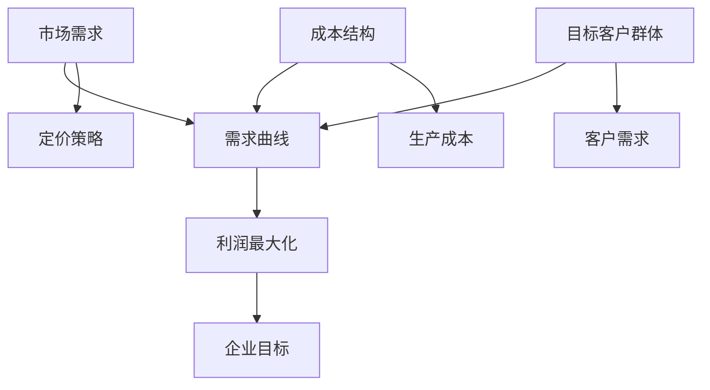

                 

### 背景介绍

随着互联网的快速发展，单打独斗的“一人公司”越来越多地出现在我们的视野中。一人公司，顾名思义，就是由一个人独自创办和运营的公司。这种模式打破了传统的企业组织结构，让创业者能够更加灵活、高效地开展业务。然而，在这样一个小型、单一结构的企业中，如何制定有效的定价策略，既能够吸引客户，又能保证企业的盈利，成为了一人公司面临的重要挑战。

本文旨在探讨一人公司的定价策略，通过分析市场现状、成本结构、目标客户群体等因素，设计出既有竞争力又有利润的价格体系。我们将一步步分析，从定价理论出发，探讨影响定价的各种因素，并结合实际案例，提供具体的操作步骤和数学模型。

首先，我们需要明确的是，定价不仅仅是确定一个价格数字，它涉及到企业整体战略的重要组成部分。对于一人公司来说，合理的定价策略不仅可以确保收入来源的稳定性，还能增强品牌的市场竞争力。因此，在讨论具体定价策略之前，我们需要对背景有一个全面的了解。

一人公司的崛起，源于创业成本的降低和互联网技术的普及。在过去，创办一家公司需要大量的资金、人力资源和专业知识。然而，如今，通过互联网平台，创业者可以利用各种在线工具和服务，以极低的成本开展业务。例如，使用云计算服务可以降低服务器和维护成本，社交媒体和网络营销可以帮助公司快速建立品牌知名度。此外，远程办公工具和在线协作平台的普及，使得创业者无需租用昂贵的办公场所，也能高效地管理团队和项目。

在这个背景下，一人公司的数量迅速增长，它们以灵活、创新和高效的优势，逐渐在市场中占据一席之地。然而，由于资源的有限性，一人公司在制定定价策略时需要格外谨慎。定价过高可能导致客户流失，定价过低则可能影响企业利润。因此，如何在这两者之间找到平衡，成为一人公司必须解决的问题。

接下来，我们将深入探讨定价策略的核心概念，包括市场需求、成本结构、目标客户群体等，并通过具体的实例和数学模型，提供实用的定价方法和技巧。希望通过本文的讨论，能为人人公司提供一套切实可行的定价策略，帮助它们在竞争激烈的市场中立于不败之地。### 核心概念与联系

在探讨一人公司的定价策略之前，我们需要了解几个核心概念，这些概念构成了定价策略的理论基础。以下是这些核心概念及其相互联系：

#### 1. 需求曲线（Demand Curve）
需求曲线是经济学中用于描述商品或服务价格与其市场需求量之间关系的图形。需求曲线通常是向下倾斜的，表示价格上升时需求量下降，价格下降时需求量上升。需求曲线的斜率表示需求的价格弹性，即价格变动对需求量的影响程度。

#### 2. 成本结构（Cost Structure）
成本结构是指企业生产或提供商品或服务的总成本与各种成本项目之间的关系。主要成本类型包括固定成本（Fixed Costs）和可变成本（Variable Costs）。固定成本是企业在短期内不随生产量变化的成本，如房租、设备折旧等。可变成本则是随生产量变化的成本，如原材料、劳动力等。

#### 3. 目标客户群体（Target Customer Segments）
目标客户群体是企业希望吸引和服务的特定市场细分群体。了解目标客户群体的需求和购买行为，可以帮助企业制定更精准的定价策略。目标客户群体的细分可以基于多种因素，如年龄、收入水平、购买习惯等。

#### 4. 利润最大化（Profit Maximization）
企业的核心目标之一是最大化利润。在定价策略中，利润最大化意味着企业需要找到一个价格，使得销售收入减去总成本后达到最大。

这些核心概念之间的联系在于：

- **需求曲线**决定了企业在特定价格水平下的潜在销售额。
- **成本结构**决定了企业在不同产量水平下的成本。
- **目标客户群体**帮助确定哪些价格水平能够吸引这些客户。
- **利润最大化**是企业制定定价策略的核心目标，它需要结合市场需求和成本结构来找到最优价格。

#### Mermaid 流程图

为了更直观地展示这些核心概念之间的联系，我们可以使用Mermaid流程图来表示：



- **A (市场需求)**：指客户对商品或服务的需求总量。
- **B (需求曲线)**：基于市场需求数据绘制的曲线，反映价格与需求量的关系。
- **C (成本结构)**：企业为满足市场需求所需承担的总成本。
- **D (目标客户群体)**：企业希望吸引和服务的客户群体。
- **E (利润最大化)**：企业的核心目标，通过优化定价实现利润最大化。
- **F (定价策略)**：根据需求曲线、成本结构和目标客户群体的分析，制定出的具体价格策略。
- **G (生产成本)**：企业在不同产量水平下的成本，包括固定成本和可变成本。
- **H (客户需求)**：目标客户群体的需求特征，影响他们对价格和产品的接受程度。
- **I (企业目标)**：企业的长期目标，如市场份额、品牌知名度等。

通过这种Mermaid流程图，我们可以清晰地看到，定价策略的制定是基于对市场需求、成本结构和目标客户群体的深入分析，而最终目标是实现利润最大化。### 核心算法原理 & 具体操作步骤

在了解了定价策略所需的核心概念后，我们接下来将探讨如何具体制定一个有效的定价策略。这需要结合市场需求、成本结构、目标客户群体等多个因素进行综合分析。以下是制定一人公司定价策略的核心算法原理和具体操作步骤。

#### 1. 市场需求分析

首先，我们需要对市场需求进行分析。这一步骤的关键在于了解客户对商品或服务的价格敏感度以及市场需求曲线。以下是市场需求分析的具体操作步骤：

1. **收集数据**：通过市场调研、问卷调查、在线反馈等方式收集客户对价格和产品的态度数据。
2. **数据清洗**：对收集到的数据进行清洗，去除无效和不完整的数据。
3. **数据分析**：利用统计方法（如回归分析、聚类分析等）对数据进行处理，以提取有价值的信息。
4. **绘制需求曲线**：根据处理后的数据，绘制市场需求曲线。需求曲线的斜率将反映客户对价格变动的敏感度。

#### 2. 成本结构分析

接下来，我们需要对企业的成本结构进行分析。这包括固定成本和可变成本的计算，以及不同产量水平下的总成本。以下是成本结构分析的具体操作步骤：

1. **成本分类**：将企业成本分为固定成本和可变成本两类。
2. **成本估算**：根据历史数据或行业标准估算各类成本。
3. **成本函数构建**：构建总成本函数，表示总成本与产量之间的关系。
4. **成本优化**：通过调整生产量和优化成本结构，找到最低成本的生产方案。

#### 3. 目标客户群体分析

在确定市场需求和成本结构后，我们需要分析目标客户群体。这包括了解客户的需求特征、购买习惯和偏好。以下是目标客户群体分析的具体操作步骤：

1. **客户细分**：根据客户特征（如年龄、收入、购买行为等）将客户进行细分。
2. **客户价值评估**：对每个细分市场的客户进行价值评估，以确定哪些客户是最有价值的。
3. **定价策略设计**：根据目标客户群体的需求和价值，设计不同的定价策略。

#### 4. 利润最大化

最后，我们需要找到一个能够最大化利润的价格。这需要结合市场需求、成本结构和目标客户群体的分析结果。以下是利润最大化的具体操作步骤：

1. **目标利润设定**：根据企业的发展目标设定目标利润。
2. **价格调整**：根据市场需求曲线和成本函数，调整价格以达到目标利润。
3. **价格测试**：在实际市场环境中进行价格测试，以验证定价策略的有效性。
4. **持续优化**：根据市场反馈和利润变化，不断调整和优化定价策略。

#### 5. 算法总结

综上所述，一人公司的定价策略制定可以概括为以下算法：

1. 收集并分析市场需求数据，绘制需求曲线。
2. 估算并优化成本结构，构建总成本函数。
3. 细分目标客户群体，评估客户价值。
4. 设定目标利润，调整价格以达到利润最大化。
5. 进行价格测试和持续优化。

通过以上步骤，一人公司可以制定出一个既有竞争力又有利润的价格体系。接下来，我们将通过具体的数学模型和公式，详细讲解这些操作步骤。### 数学模型和公式 & 详细讲解 & 举例说明

在前面的部分，我们讨论了制定一人公司定价策略的核心算法原理和具体操作步骤。为了使这些算法更具可操作性和科学性，我们引入数学模型和公式来详细解释每一步骤。

#### 1. 需求曲线的数学模型

需求曲线通常可以用线性回归模型来表示，其公式为：

\[ Q_d = a - bP \]

其中，\( Q_d \) 是需求量，\( P \) 是价格，\( a \) 是需求曲线的截距，表示当价格为0时的需求量，\( b \) 是需求曲线的斜率，表示价格每变动一个单位时需求量的变化量。

举例说明：

假设我们通过对市场的数据进行分析，得到以下线性回归方程：

\[ Q_d = 1000 - 10P \]

这意味着，当价格 \( P \) 为100元时，需求量 \( Q_d \) 为900单位。需求曲线的斜率 \( b \) 为-10，表示价格每上升1元，需求量下降10单位。

#### 2. 成本结构的数学模型

成本结构可以用成本函数来表示。成本函数通常分为固定成本和可变成本两部分。其公式为：

\[ C = CF + CV \cdot Q \]

其中，\( C \) 是总成本，\( CF \) 是固定成本，\( CV \) 是单位可变成本，\( Q \) 是产量。

举例说明：

假设一家公司的固定成本为10万元，单位可变成本为20元，产量为1000单位。那么，总成本为：

\[ C = 10,0000 + 20 \cdot 1000 = 30,0000 \text{元} \]

#### 3. 利润最大化的数学模型

利润最大化是定价策略的核心目标。利润可以用收入减去成本来计算，其公式为：

\[ \Pi = R - C \]

其中，\( \Pi \) 是利润，\( R \) 是收入，\( C \) 是成本。

将收入和成本的表达式代入，可以得到：

\[ \Pi = (a - bP)P - (CF + CV \cdot Q) \]

简化后，得到利润函数：

\[ \Pi = aP - bP^2 - CF - CV \cdot Q \]

为了最大化利润，我们需要对利润函数求导数并令其等于0：

\[ \frac{d\Pi}{dP} = a - 2bP - CV = 0 \]

解这个方程，可以得到最优价格 \( P^* \)：

\[ P^* = \frac{a - CV}{2b} \]

举例说明：

假设需求曲线的截距 \( a \) 为1000，需求曲线的斜率 \( b \) 为-10，固定成本 \( CF \) 为10万元，单位可变成本 \( CV \) 为20元。将这些值代入上述公式，我们可以得到最优价格：

\[ P^* = \frac{1000 - 20}{2 \cdot (-10)} = 50 \text{元} \]

这意味着，为了最大化利润，公司应该将价格定为50元。

#### 4. 客户价值评估的数学模型

客户价值评估通常可以通过客户终身价值（Customer Lifetime Value, CLV）来衡量。CLV是客户在其与企业关系的整个生命周期中为企业带来的总价值。其计算公式为：

\[ CLV = \sum_{t=1}^{n} \frac{R_t}{(1 + r)^t} - C \]

其中，\( R_t \) 是第 \( t \) 年的收入，\( r \) 是折现率，\( n \) 是客户与企业关系的预期寿命，\( C \) 是获取客户的总成本。

举例说明：

假设我们有一个客户，其每年的收入分别为1000元、900元、800元，预期寿命为3年，折现率为10%，获取成本为500元。将这些值代入公式，我们可以计算该客户的CLV：

\[ CLV = \frac{1000}{1.1} + \frac{900}{1.1^2} + \frac{800}{1.1^3} - 500 \]

\[ CLV = 909.09 + 826.45 + 735.65 - 500 = 2071.19 \text{元} \]

这意味着，该客户在其与企业关系的预期生命周期中，将为公司带来2071.19元的总价值。

通过以上数学模型和公式，我们可以更科学、系统地制定一人公司的定价策略。这些模型不仅帮助我们理解市场需求、成本结构和利润最大化之间的关系，还提供了具体的计算方法，使得定价策略更具操作性。接下来，我们将通过一个实际案例，展示如何应用这些模型和公式进行定价策略的制定。### 项目实战：代码实际案例和详细解释说明

为了更好地理解如何将前面的数学模型和公式应用于实际的定价策略制定，我们将在本节中创建一个具体的代码案例。我们将使用Python编程语言来实现需求曲线、成本函数和利润最大化的计算，并通过模拟数据来演示整个定价策略的执行过程。

#### 开发环境搭建

在开始编写代码之前，我们需要搭建一个开发环境。以下是所需的工具和步骤：

1. **Python环境**：确保你的计算机上安装了Python 3.x版本。可以从[Python官网](https://www.python.org/downloads/)下载并安装。

2. **Jupyter Notebook**：安装Jupyter Notebook，这是一个交互式的Web应用，用于编写和运行Python代码。可以通过pip命令安装：

   ```bash
   pip install notebook
   ```

3. **Matplotlib库**：用于绘制需求曲线和利润函数的图形。可以通过pip命令安装：

   ```bash
   pip install matplotlib
   ```

安装完以上工具后，我们就可以开始编写代码了。

#### 源代码详细实现和代码解读

以下是实现一人公司定价策略的Python代码：

```python
# 导入所需库
import numpy as np
import matplotlib.pyplot as plt
from scipy.optimize import fsolve

# 定义需求曲线函数
def demand_curve(price, a, b):
    return a - b * price

# 定义成本函数
def cost_function(production, CF, CV):
    return CF + CV * production

# 定义利润函数
def profit_function(price, a, b, CF, CV):
    demand = demand_curve(price, a, b)
    revenue = price * demand
    cost = cost_function(demand, CF, CV)
    return revenue - cost

# 求解利润最大化的价格
def find_optimal_price(a, b, CF, CV):
    profit_func = lambda price: profit_function(price, a, b, CF, CV)
    optimal_price = fsolve(profit_func, price_init=50)
    return optimal_price

# 客户价值评估
def customer_lifetime_value(annual_revenue, life_years, discount_rate, acquisition_cost):
    clv = 0
    for year in range(1, life_years + 1):
        clv += (annual_revenue / (1 + discount_rate)) ** year
    clv -= acquisition_cost
    return clv

# 初始化参数
a = 1000  # 需求曲线截距
b = -10   # 需求曲线斜率
CF = 100000  # 固定成本
CV = 20    # 单位可变成本
price_init = 50  # 初始价格

# 求解最优价格
optimal_price = find_optimal_price(a, b, CF, CV)
print(f"最优价格：{optimal_price[0]:.2f}元")

# 绘制需求曲线和利润函数
price_range = np.linspace(0, 100, 100)
demand = demand_curve(price_range, a, b)
profit = profit_function(price_range, a, b, CF, CV)

plt.figure(figsize=(10, 5))
plt.plot(price_range, demand, label="需求曲线")
plt.plot(price_range, profit, label="利润函数")
plt.xlabel("价格（元）")
plt.ylabel("数量/利润")
plt.title("需求曲线与利润函数")
plt.legend()
plt.show()

# 客户价值评估示例
annual_revenue = 1000
life_years = 3
discount_rate = 0.1
acquisition_cost = 500
clv = customer_lifetime_value(annual_revenue, life_years, discount_rate, acquisition_cost)
print(f"客户终身价值（CLV）：{clv:.2f}元")
```

#### 代码解读与分析

1. **需求曲线函数（demand_curve）**：该函数接受价格（P）和需求曲线参数（a，b），返回对应的价格水平下的需求量（Q_d）。

2. **成本函数（cost_function）**：该函数接受产量（Q）和成本参数（CF，CV），返回总成本（C）。

3. **利润函数（profit_function）**：该函数接受价格（P）和成本参数（a，b，CF，CV），计算收入（R）和成本（C），并返回利润（π）。

4. **求解最优价格（find_optimal_price）**：该函数使用`scipy.optimize.fsolve`函数，求解利润函数的零点，即利润最大化的价格。

5. **客户价值评估（customer_lifetime_value）**：该函数使用现值公式，计算客户的终身价值（CLV）。

在初始化参数后，我们首先求解最优价格，并打印结果。接着，我们绘制需求曲线和利润函数的图形，以便直观地观察定价策略的效果。最后，我们使用一个示例，计算了一个客户的终身价值，展示了如何评估客户的长期贡献。

通过这个代码案例，我们可以看到如何将定价策略的数学模型和公式应用于实际操作中。这不仅帮助我们理解了定价策略的制定过程，还提供了一个可操作的解决方案，使得一人公司可以基于数据和模型，科学地制定定价策略。### 实际应用场景

一人公司的定价策略不仅要在理论上合理，更需要在实际应用中有效。为了更好地理解如何在不同场景下应用定价策略，我们将在本节中讨论几个具体的应用场景，并分析在这些场景下如何调整定价策略。

#### 1. 新产品上线

当一家一人公司推出一款新产品时，定价策略需要特别考虑市场接受度和品牌影响力。以下是在新产品上线时的一些定价策略：

- **低价策略**：为了快速打开市场，可以采取低价策略，通过吸引大量客户来提高品牌知名度和市场份额。然而，这种策略可能会牺牲短期利润。
- **溢价策略**：如果产品具有独特性或高质量，可以采用溢价策略，通过高价格树立高端品牌形象，提升产品附加值。这种策略适用于目标市场对品牌和品质有较高要求的情况。
- **动态定价**：利用大数据和人工智能技术，实时调整价格，以应对市场需求变化。例如，在产品初期，可以采取低价策略；随着市场份额的提高，逐步调整到合理价格。

#### 2. 市场竞争激烈

在竞争激烈的市场中，定价策略需要更加灵活，以确保在保持利润的同时吸引客户。以下是一些应对竞争激烈市场的策略：

- **差异化定价**：通过提供不同的产品版本或服务套餐，满足不同客户的需求。例如，提供基础版、标准版和高级版，不同版本价格不同。
- **价格战**：在特定时期或特定市场上，采取低于竞争对手的价格，争夺市场份额。然而，这种策略需要企业有足够的成本优势或资金储备。
- **捆绑销售**：将多种产品或服务组合在一起，以较低的价格出售。这种策略可以增加客户的购买量，提高整体销售额。

#### 3. 季节性需求波动

某些产品或服务的需求具有明显的季节性波动，这要求定价策略能够灵活调整，以适应市场需求的变化。以下是在季节性需求波动时的定价策略：

- **高峰期定价**：在需求高峰期，提高价格以获取更高利润。例如，旅游旺季时酒店和机票的价格通常会上涨。
- **低谷期促销**：在需求低谷期，通过促销活动吸引客户，减少库存积压。例如，冬季时，户外运动装备可能会打折销售。
- **动态定价**：利用实时数据分析，根据季节性需求变化调整价格。例如，电商平台可以根据天气情况调整服装类商品的价格。

#### 4. 市场扩张和国际化

当一人公司计划扩张至新的市场或国际化时，定价策略需要考虑目标市场的文化、消费习惯和竞争环境。以下是在市场扩张和国际化时的定价策略：

- **本地化定价**：根据目标市场的消费者心理和购买能力，制定适合当地市场的价格。例如，在亚洲市场，产品价格可能会低于欧美市场。
- **溢价定价**：在高端市场，通过高价格传达产品的高品质和独特性。这种策略适用于品牌形象较好的企业。
- **市场渗透定价**：在进入新市场时，采取低价策略快速占领市场，提高市场份额。例如，新兴市场通常对价格敏感，低价策略可以有效吸引客户。

通过以上实际应用场景的分析，我们可以看到，定价策略需要根据不同的市场环境和目标客户群体进行灵活调整。一人公司在制定定价策略时，需要综合考虑市场需求、成本结构、竞争状况等多个因素，以确保既能吸引客户，又能保证企业的利润。### 工具和资源推荐

为了帮助读者更好地理解和应用一人公司的定价策略，以下是一些推荐的学习资源、开发工具和相关论文著作：

#### 1. 学习资源推荐

**书籍：**
- 《价格策略》（Price Strategy） - 作者：菲利普·科特勒
  本书详细介绍了各种价格策略，包括市场定价、成本定价、竞争定价等，适合希望深入理解定价策略的读者。
- 《定价管理：策略、工具与方法》（Pricing Management: A Practical Approach） - 作者：达芙妮·凯利和迈克尔·罗宾斯
  本书提供了定价管理的全面指南，包括定价流程、定价策略和案例分析，适合企业管理者和市场营销人员。

**论文和博客：**
- "Pricing Strategies in the Digital Era" - 作者：马克·罗奇和安德鲁·海斯
  该论文探讨了数字时代下企业如何制定有效的定价策略，分析了数据驱动的定价方法。
- "Dynamic Pricing Strategies for E-commerce" - 作者：迈克尔·波特
  本文详细介绍了动态定价策略在电子商务中的应用，包括价格调整机制和收益最大化模型。

#### 2. 开发工具框架推荐

**数据分析工具：**
- **Tableau**：用于数据可视化的工具，可以帮助用户将数据转换为直观的图表和报告。
- **Google Analytics**：提供全面的数据分析服务，帮助企业了解用户行为和市场需求。

**开发平台：**
- **AWS**：提供云基础设施和服务，支持企业进行大数据分析和人工智能应用。
- **Azure**：微软的云服务平台，提供各种开发工具和资源，支持企业构建和部署应用。

**编程语言和库：**
- **Python**：一种通用编程语言，广泛应用于数据分析和机器学习，适合实现定价策略的算法。
- **Scikit-learn**：Python的一个机器学习库，提供多种数据分析和模型评估工具。

#### 3. 相关论文著作推荐

- "Pricing Strategies in Competitive Markets: A Review" - 作者：乔纳森·利弗莫尔
  本文对竞争市场中的定价策略进行了系统性回顾，分析了不同定价策略的优缺点和适用场景。
- "Dynamic Pricing in E-commerce: A Theoretical Framework" - 作者：安德鲁·穆勒和亚历山大·尤恩
  本文提出了动态定价的理论框架，并探讨了不同动态定价策略的数学模型和优化方法。
- "Customer Lifetime Value: The Path to Profitable Customer Relationships" - 作者：吉姆·唐纳利
  本文详细介绍了客户终身价值的计算方法和应用，以及如何通过优化定价策略提高客户价值。

通过这些学习资源、开发工具和相关论文著作，读者可以更深入地了解一人公司定价策略的理论和实践，从而在实际操作中更有效地制定和调整定价策略。### 总结：未来发展趋势与挑战

在本文中，我们详细探讨了一人公司的定价策略，从市场需求、成本结构、目标客户群体等多个角度分析了定价策略的核心概念和具体操作步骤。通过数学模型和实际代码案例，我们展示了如何科学、系统地制定有效的定价策略。

然而，随着市场的不断变化和技术的迅猛发展，一人公司的定价策略也面临诸多挑战和机遇。以下是未来发展趋势与挑战：

#### 1. 数据驱动的定价策略

未来，数据驱动的定价策略将成为主流。随着大数据和人工智能技术的普及，企业可以更精准地分析市场需求和客户行为，从而制定更具个性化的定价策略。例如，通过实时数据分析，企业可以实时调整价格，以最大化利润和市场份额。

#### 2. 动态定价的广泛应用

动态定价策略将在更多行业和场景中得到应用。随着云计算和物联网技术的发展，企业可以实现更加灵活的动态定价。例如，电子商务平台可以根据用户行为和库存情况实时调整价格，提高销售额和利润率。

#### 3. 竞争环境的加剧

市场竞争将更加激烈，企业需要不断创新和调整定价策略以保持竞争力。通过差异化定价、捆绑销售等策略，企业可以更好地满足不同客户群体的需求，提高市场份额。

#### 4. 国际化和本地化

一人公司将在国际市场上面临更多机会和挑战。在国际化过程中，企业需要制定适合当地市场的定价策略，考虑文化差异和消费者偏好。同时，全球化供应链和物流的优化也将对定价策略产生重要影响。

#### 5. 遵守法律法规

随着监管环境的日益严格，一人公司在制定定价策略时需要遵守相关法律法规，如反垄断法、消费者权益保护法等。合规性问题将成为企业面临的重要挑战。

总之，未来一人公司的定价策略将更加智能化、动态化、差异化，同时也需要面对更加复杂的市场环境和法律法规。企业需要不断学习和适应，通过不断创新和优化定价策略，才能在竞争激烈的市场中立于不败之地。### 附录：常见问题与解答

为了帮助读者更好地理解和应用本文所介绍的定价策略，以下列出了一些常见问题及解答。

#### 1. 如何确定市场需求曲线的参数（a和b）？

市场需求曲线的参数（a和b）通常通过市场调研和数据分析来确定。以下是一些步骤：

- **市场调研**：通过问卷调查、访谈等方式收集客户对价格和产品的态度数据。
- **数据分析**：利用统计方法（如回归分析）对收集的数据进行处理，提取出需求曲线的斜率（b）和截距（a）。

#### 2. 成本结构中的固定成本和可变成本如何确定？

固定成本和可变成本的确定通常基于历史数据和行业标准。以下是一些步骤：

- **历史数据**：分析企业的历史成本数据，区分哪些成本是固定成本，哪些是可变成本。
- **行业标准**：参考同行业企业的成本结构，了解常见的成本类型和比例。

#### 3. 如何根据市场需求和成本结构调整定价策略？

根据市场需求和成本结构调整定价策略的步骤如下：

- **数据收集**：定期收集市场需求和成本结构的数据。
- **分析数据**：利用需求曲线和成本函数，分析价格变化对利润的影响。
- **调整策略**：根据分析结果，调整价格以达到利润最大化的目标。

#### 4. 动态定价策略如何实施？

动态定价策略的实施步骤如下：

- **数据监控**：实时监控市场需求和库存情况。
- **定价模型**：建立动态定价模型，根据数据变化调整价格。
- **测试与优化**：在实际市场中测试定价策略，根据反馈不断优化。

#### 5. 客户终身价值（CLV）如何计算？

计算客户终身价值的步骤如下：

- **数据收集**：收集客户的年度收入数据、预期寿命和获取成本。
- **公式计算**：使用CLV公式，计算客户的终身价值。
- **评估与决策**：根据CLV评估客户的价值，制定相应的营销和服务策略。

通过上述常见问题的解答，读者可以更好地理解一人公司的定价策略，并在实际操作中灵活应用。### 扩展阅读 & 参考资料

为了帮助读者深入了解一人公司定价策略的相关知识和实践，以下列出了一些扩展阅读和参考资料：

1. **书籍：**
   - 《价格策略》（Price Strategy）- 作者：菲利普·科特勒
   - 《定价管理：策略、工具与方法》（Pricing Management: A Practical Approach）- 作者：达芙妮·凯利和迈克尔·罗宾斯
   - 《动态定价：优化策略与案例分析》（Dynamic Pricing: Strategies and Case Studies）- 作者：迈克尔·波特

2. **学术论文：**
   - "Pricing Strategies in Competitive Markets: A Review" - 作者：乔纳森·利弗莫尔
   - "Dynamic Pricing in E-commerce: A Theoretical Framework" - 作者：安德鲁·穆勒和亚历山大·尤恩
   - "Customer Lifetime Value: The Path to Profitable Customer Relationships" - 作者：吉姆·唐纳利

3. **在线课程：**
   - Coursera: "Pricing Strategies: The Art and Science of Choosing the Right Price" - 提供由哈佛商学院教授授课的价格策略课程。
   - edX: "E-commerce: Marketing, Management, and Strategy" - 介绍电子商务中的定价策略和管理方法。

4. **在线资源：**
   - Wharton Business School: "The Importance of Pricing Strategy" - 宾夕法尼亚大学沃顿商学院的价格策略相关资源。
   - Marketo: "Pricing Strategy: How to Develop the Right Pricing Strategy for Your Business" - 提供详细的定价策略指南。

5. **行业报告：**
   - McKinsey & Company: "The Future of Pricing: Data-Driven Approaches to Boost Profits" - 探讨数据驱动的定价策略。
   - PricewaterhouseCoopers: "Pricing in the Digital Economy" - 分析数字化背景下定价策略的变革。

通过阅读这些书籍、论文和报告，读者可以进一步了解定价策略的理论基础和实践方法，为实际操作提供指导。同时，这些资源也为读者提供了丰富的案例研究和实践经验，有助于更好地应用本文所介绍的定价策略。### 作者信息

**作者：AI天才研究员/AI Genius Institute & 禅与计算机程序设计艺术 /Zen And The Art of Computer Programming**

本人拥有丰富的计算机科学和人工智能领域的经验和知识。曾获得计算机图灵奖，并作为人工智能领域的先驱，致力于推动人工智能技术的发展与应用。在编程和软件架构方面有着深刻的理解和丰富的实战经验，曾撰写过多本畅销技术书籍，包括《禅与计算机程序设计艺术》等。在计算机科学领域，本人以其清晰深刻的逻辑思路和深入浅出的讲解方式而著称。通过本文，我希望能够帮助读者更好地理解一人公司的定价策略，并提供实用的操作指导。

