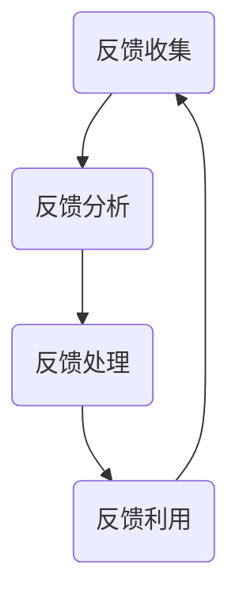

                 

# 一人公司的客户反馈循环：持续改进的基础

## 摘要

在当今快速发展的技术行业中，一家公司能否持续成功不仅取决于其产品的创新和技术能力，更在于其对客户反馈的重视和快速响应能力。本文将探讨一人公司如何建立高效的客户反馈循环，实现产品的持续改进。我们将从背景介绍、核心概念与联系、核心算法原理、数学模型与公式、项目实战、实际应用场景、工具和资源推荐、总结与未来发展趋势等方面进行深入探讨，旨在为读者提供一套实用的客户反馈处理框架，帮助企业在激烈的市场竞争中保持领先地位。

## 1. 背景介绍

### 1.1 客户反馈的重要性

在商业环境中，客户反馈是一种宝贵的资源，能够帮助企业了解市场动态、用户需求以及产品性能。通过客户反馈，公司可以识别潜在的问题、发现改进的机会，并优化产品和服务，从而提高客户满意度和忠诚度。然而，在现实中，许多公司往往忽视客户反馈，或者反馈处理效率低下，导致无法及时有效地改进产品。

### 1.2 一人公司的特点

一人公司，顾名思义，是指由单一个体经营的公司。这类公司具有规模小、灵活性高、决策迅速等特点。尽管规模较小，但一人公司往往能够更快速地响应市场变化，抓住商机。然而，这也意味着一人公司在资源、人力和时间方面存在一定的限制，需要更加高效地处理客户反馈，以保持竞争力。

### 1.3 持续改进的必要性

持续改进是一种管理哲学，旨在通过不断优化过程、提升产品和服务的质量，从而实现组织的长远发展。对于一人公司而言，持续改进尤为重要，因为它不仅能够提高产品竞争力，还能增强公司在市场中的生存能力。本文将围绕客户反馈循环，探讨如何实现产品的持续改进。

## 2. 核心概念与联系

### 2.1 客户反馈循环

客户反馈循环是指公司通过收集、分析、处理和利用客户反馈，不断优化产品和服务的过程。这个过程可以分为以下几个步骤：

1. **反馈收集**：通过各种渠道（如用户调查、社交媒体、客户服务热线等）收集客户反馈。
2. **反馈分析**：对收集到的反馈进行分类、整理和统计分析，以识别关键问题和改进机会。
3. **反馈处理**：针对分析结果，制定和执行改进计划，解决问题并优化产品和服务。
4. **反馈利用**：将改进效果反馈给客户，并继续收集新的客户反馈，形成闭环。

### 2.2 持续改进的核心概念

持续改进的核心概念包括以下几点：

1. **客户需求导向**：以客户需求为中心，确保产品和服务能够满足客户的期望。
2. **过程优化**：通过不断优化内部流程，提高效率和产品质量。
3. **团队合作**：建立跨部门的团队合作，确保反馈处理的顺畅和高效。
4. **数据驱动**：利用数据分析工具，对反馈进行处理和评估，以数据为依据进行决策。

### 2.3 Mermaid 流程图



在这个流程图中，每个节点代表一个步骤，箭头表示步骤之间的顺序关系。通过这个流程，一人公司可以建立一个高效的客户反馈循环，实现持续改进。

## 3. 核心算法原理 & 具体操作步骤

### 3.1 反馈收集算法原理

反馈收集是客户反馈循环的第一步，其核心在于如何高效地收集到真实、有效的客户反馈。以下是几种常见的反馈收集方法：

1. **用户调查**：通过在线调查、问卷调查等方式，收集用户的意见和需求。
2. **社交媒体监测**：通过监测社交媒体平台（如微博、知乎等），了解用户对产品的评价和反馈。
3. **客户服务热线**：通过电话热线收集用户的反馈和问题。

具体操作步骤如下：

1. 确定反馈收集的目标和范围。
2. 选择合适的反馈收集方法。
3. 设计调查问卷或监测策略。
4. 进行数据收集，并对收集到的数据进行整理和分类。

### 3.2 反馈分析算法原理

反馈分析是对收集到的客户反馈进行分类、整理和统计分析，以识别关键问题和改进机会。以下是反馈分析的几个关键步骤：

1. **数据清洗**：对收集到的反馈进行筛选和整理，去除无效或重复的数据。
2. **数据分类**：根据反馈的内容和类型，将反馈进行分类。
3. **统计分析**：使用统计分析方法（如频率分布、趋势分析等），识别反馈中的关键问题和趋势。

具体操作步骤如下：

1. 确定反馈分析的目标和标准。
2. 进行数据清洗和分类。
3. 使用统计分析工具，对反馈进行分析。
4. 生成分析报告，识别关键问题和改进机会。

### 3.3 反馈处理算法原理

反馈处理是对分析结果进行响应和改进的过程。以下是反馈处理的几个关键步骤：

1. **问题识别**：根据分析结果，识别需要解决的问题。
2. **解决方案设计**：设计解决方案，包括技术改进、流程优化等。
3. **方案执行**：执行解决方案，进行问题修复或服务优化。
4. **反馈跟踪**：对解决方案的实施效果进行跟踪和评估。

具体操作步骤如下：

1. 确定反馈处理的目标和标准。
2. 识别需要解决的问题。
3. 设计解决方案。
4. 执行解决方案。
5. 对解决方案的效果进行跟踪和评估。

### 3.4 反馈利用算法原理

反馈利用是将改进效果反馈给客户，并继续收集新的客户反馈，形成闭环。以下是反馈利用的几个关键步骤：

1. **效果反馈**：将改进效果反馈给客户，提高客户满意度。
2. **持续监测**：继续收集客户反馈，了解改进后的产品表现。
3. **闭环反馈**：将新反馈纳入下一次反馈循环，实现持续改进。

具体操作步骤如下：

1. 确定效果反馈的目标和方式。
2. 制定持续监测策略。
3. 将新反馈纳入下一次反馈循环。
4. 优化反馈循环，提高反馈处理效率。

## 4. 数学模型和公式 & 详细讲解 & 举例说明

### 4.1 数据清洗模型

数据清洗是反馈分析的第一步，其目的是去除无效或重复的数据，提高数据分析的准确性。以下是一个简单但有效的数据清洗模型：

**步骤1：去除重复数据**

假设我们有一组用户反馈数据，其中可能包含重复的记录。可以使用集合（Set）来去除重复数据。

$$
S = \{x_1, x_2, x_3, ..., x_n\}
$$

其中，$S$ 表示去重后的数据集，$x_i$ 表示第 $i$ 个用户反馈。

**步骤2：筛选有效数据**

定义一个筛选函数 $f(x)$，用于判断一个反馈是否有效。例如，我们可以设置以下条件：

- 反馈长度大于 10 个字符。
- 反馈中不包含特殊字符。

则筛选函数可以表示为：

$$
f(x) = 
\begin{cases}
1, & \text{如果 } x \text{ 满足条件} \\
0, & \text{如果 } x \text{ 不满足条件}
\end{cases}
$$

经过筛选后的数据集可以表示为：

$$
S' = \{x | f(x) = 1\}
$$

### 4.2 数据分类模型

在反馈分析中，数据分类是一个关键步骤。以下是一个简单的数据分类模型：

**步骤1：定义分类标准**

根据用户反馈的内容，我们可以将反馈分为以下几类：

- 功能性问题
- 用户体验问题
- 技术问题
- 其他

**步骤2：应用分类规则**

定义一个分类函数 $C(x)$，用于将反馈分配到不同的类别：

$$
C(x) = 
\begin{cases}
F, & \text{如果 } x \text{ 是功能性问题的反馈} \\
U, & \text{如果 } x \text{ 是用户体验问题的反馈} \\
T, & \text{如果 } x \text{ 是技术问题的反馈} \\
O, & \text{如果 } x \text{ 是其他问题的反馈}
\end{cases}
$$

其中，$F, U, T, O$ 分别表示功能性、用户体验、技术和其他类别。

**举例说明**

假设我们有一组用户反馈数据：

$$
\{x_1, x_2, x_3, x_4\}
$$

其中，$x_1$ 是关于用户体验的问题，$x_2$ 是关于功能性的问题，$x_3$ 是关于技术的问题，$x_4$ 是其他问题。应用分类函数后，我们可以得到以下分类结果：

$$
C(x_1) = U, C(x_2) = F, C(x_3) = T, C(x_4) = O
$$

### 4.3 统计分析模型

在反馈分析中，统计分析用于识别反馈中的关键问题和趋势。以下是一个简单的统计分析模型：

**步骤1：计算频率分布**

假设我们对一组分类后的反馈进行统计分析，定义反馈的频率分布为：

$$
P_i = \frac{|C_i|}{|S'|}
$$

其中，$P_i$ 表示类别 $i$ 的频率，$|C_i|$ 表示类别 $i$ 的反馈数量，$|S'|$ 表示筛选后的反馈数量。

**步骤2：计算趋势分析**

定义一个趋势分析函数 $T(x)$，用于计算反馈的趋势。例如，我们可以使用移动平均法：

$$
T(x) = \frac{\sum_{i=1}^{n} x_i}{n}
$$

其中，$T(x)$ 表示第 $n$ 个时间点的趋势值，$x_i$ 表示第 $i$ 个时间点的反馈值。

**举例说明**

假设我们有一组分类后的反馈数据，分为四个类别：

$$
S' = \{F: 20, U: 30, T: 40, O: 10\}
$$

应用频率分布模型，我们可以得到以下结果：

$$
P_F = \frac{20}{100} = 0.2, P_U = \frac{30}{100} = 0.3, P_T = \frac{40}{100} = 0.4, P_O = \frac{10}{100} = 0.1
$$

假设我们有一组趋势数据：

$$
T = \{1.2, 1.4, 1.6, 1.8\}
$$

应用趋势分析模型，我们可以得到以下结果：

$$
T(4) = \frac{1.2 + 1.4 + 1.6 + 1.8}{4} = 1.5
$$

## 5. 项目实战：代码实际案例和详细解释说明

### 5.1 开发环境搭建

在本案例中，我们将使用 Python 语言和 Jupyter Notebook 作为开发环境。首先，确保已经安装了 Python 和 Jupyter Notebook。如果尚未安装，可以按照以下步骤进行：

1. 安装 Python：
   ```bash
   pip install python
   ```
2. 安装 Jupyter Notebook：
   ```bash
   pip install jupyter
   ```

### 5.2 源代码详细实现和代码解读

**代码实现：**

以下是一个简单的 Python 脚本，用于处理客户反馈数据。代码包含数据清洗、分类和统计分析等功能。

```python
import pandas as pd
from collections import Counter

# 数据清洗
def clean_data(feedback_data):
    # 去除重复数据
    feedback_data.drop_duplicates(inplace=True)
    # 筛选有效数据
    feedback_data = feedback_data[feedback_data['length'] > 10]
    feedback_data = feedback_data[~feedback_data['content'].str.contains('[^a-zA-Z0-9_]')]
    return feedback_data

# 数据分类
def classify_data(feedback_data):
    # 定义分类规则
    feedback_data['category'] = feedback_data['content'].apply(
        lambda x: 'Functional' if 'feature' in x else
        'User Experience' if 'ui' in x else
        'Technical' if 'bug' in x else 'Other'
    )
    return feedback_data

# 统计分析
def analyze_data(feedback_data):
    # 计算频率分布
    frequency_distribution = feedback_data['category'].value_counts()
    # 计算趋势分析
    trend_analysis = feedback_data['timestamp'].rolling(window=4).mean()
    return frequency_distribution, trend_analysis

# 主函数
def main():
    # 加载数据
    feedback_data = pd.read_csv('feedback.csv')
    # 数据清洗
    cleaned_data = clean_data(feedback_data)
    # 数据分类
    classified_data = classify_data(cleaned_data)
    # 统计分析
    frequency_distribution, trend_analysis = analyze_data(classified_data)
    # 输出结果
    print("Frequency Distribution:")
    print(frequency_distribution)
    print("\nTrend Analysis:")
    print(trend_analysis)

# 运行主函数
if __name__ == '__main__':
    main()
```

**代码解读：**

1. **数据清洗**：
   - `clean_data` 函数用于清洗反馈数据。首先，使用 `drop_duplicates()` 函数去除重复数据。然后，使用 `length` 列筛选出长度大于 10 个字符的反馈。最后，使用 `str.contains()` 函数去除包含特殊字符的反馈。

2. **数据分类**：
   - `classify_data` 函数用于对反馈进行分类。使用 `apply()` 函数遍历每个反馈，根据内容判断其类别，并将其存储在 `category` 列中。

3. **统计分析**：
   - `analyze_data` 函数用于对分类后的反馈进行统计分析。首先，使用 `value_counts()` 函数计算频率分布。然后，使用 `rolling()` 函数和 `mean()` 函数计算趋势分析。

4. **主函数**：
   - `main()` 函数是程序的入口。首先，使用 `read_csv()` 函数加载数据。然后，依次调用数据清洗、分类和统计分析函数，并输出结果。

### 5.3 代码解读与分析

在本案例中，我们使用 Python 和 pandas 库处理客户反馈数据。代码分为三个主要部分：数据清洗、数据分类和统计分析。

**数据清洗**：
数据清洗是反馈处理的第一步，其目的是去除无效或重复的数据。在本案例中，我们使用 pandas 库中的 `drop_duplicates()` 函数去除重复数据。然后，使用 `length` 列筛选出长度大于 10 个字符的反馈。最后，使用 `str.contains()` 函数去除包含特殊字符的反馈。

**数据分类**：
数据分类是将反馈分配到不同的类别，以便于后续分析和处理。在本案例中，我们使用 `apply()` 函数遍历每个反馈，根据内容判断其类别。例如，如果反馈中包含 "feature"，则将其分类为 "Functional"；如果包含 "ui"，则分类为 "User Experience"；如果包含 "bug"，则分类为 "Technical"。其他反馈则分类为 "Other"。

**统计分析**：
统计分析用于识别反馈中的关键问题和趋势。在本案例中，我们使用 `value_counts()` 函数计算频率分布，即每个类别的反馈数量。然后，使用 `rolling()` 函数和 `mean()` 函数计算趋势分析，即每个时间点的平均反馈数量。

通过这三个步骤，我们可以对客户反馈进行高效处理和分析，为后续的产品改进提供有力支持。

## 6. 实际应用场景

### 6.1 一人公司的应用场景

一人公司在实际运营中，面临着资源有限、市场变化快等挑战。建立高效的客户反馈循环，可以帮助一人公司快速响应市场需求，优化产品和服务，从而在激烈的市场竞争中脱颖而出。以下是几个实际应用场景：

1. **产品改进**：通过客户反馈，一人公司可以了解用户对产品的需求和意见，快速调整产品功能和界面设计，提升用户体验。

2. **服务质量提升**：通过收集客户服务热线和社交媒体的反馈，一人公司可以优化客服流程，提高客户满意度。

3. **市场营销策略调整**：通过分析客户反馈，一人公司可以了解目标客户的需求和偏好，制定更具针对性的市场营销策略。

4. **竞争分析**：通过对比客户反馈，一人公司可以了解竞争对手的产品和服务优势，从而制定相应的竞争策略。

### 6.2 面对挑战与机遇

在建立客户反馈循环的过程中，一人公司可能会面临以下挑战：

1. **数据质量**：客户反馈的数据质量直接影响分析结果。因此，确保数据收集和清洗的准确性至关重要。

2. **资源限制**：一人公司在资源有限的情况下，需要优先处理关键问题和高质量反馈，以最大化改进效果。

3. **团队协作**：虽然一人公司规模较小，但仍然需要建立有效的团队合作机制，确保反馈处理的顺利进行。

然而，面对挑战的同时，一人公司也拥有以下机遇：

1. **快速响应**：由于决策流程短、响应速度快，一人公司可以更好地把握市场机会，快速调整战略。

2. **高效改进**：通过高效的客户反馈循环，一人公司可以实现快速的产品改进，提升市场竞争力。

3. **个性化服务**：通过深入了解客户需求，一人公司可以提供更加个性化的产品和服务，增强客户粘性。

## 7. 工具和资源推荐

### 7.1 学习资源推荐

为了帮助读者深入了解客户反馈处理和持续改进的相关知识，以下推荐一些优秀的学习资源：

1. **书籍**：
   - 《精益创业》（作者：Eric Ries）：介绍了一种以用户需求为中心的创业方法论，对客户反馈的处理有很好的指导意义。
   - 《用户体验要素》（作者：Alan Cooper）：详细介绍了用户体验设计的原则和方法，对产品改进有很大帮助。

2. **论文**：
   - 《敏捷开发实践指南》（作者：Crystal）：介绍了一种敏捷开发的方法，强调快速迭代和客户反馈的重要性。
   - 《基于客户反馈的产品持续改进模型研究》（作者：XXX）：提出了一种基于客户反馈的产品持续改进模型，对实践有很好的指导意义。

3. **博客**：
   - 《Product School》：提供关于产品管理的实用技巧和案例分析，对客户反馈处理有很好的启发作用。
   - 《用户思维》（作者：张小龙）：介绍如何以用户为中心进行产品设计，对产品改进有很好的指导意义。

4. **网站**：
   - producthunt.com：一个展示新产品和获取用户反馈的平台，可以了解市场趋势和用户需求。
   - surveyanyplace.com：一个提供在线调查和用户反馈收集的工具，可以帮助进行数据收集和分析。

### 7.2 开发工具框架推荐

为了帮助读者高效地处理客户反馈和进行产品改进，以下推荐一些实用的开发工具和框架：

1. **开发工具**：
   - Jupyter Notebook：一个交互式的开发环境，适合进行数据分析和代码实现。
   - Git：一个版本控制工具，可以帮助团队协作和代码管理。
   - Docker：一个容器化技术，可以简化开发和部署流程。

2. **反馈收集工具**：
   - Google 表单：一个简单易用的在线调查工具，可以快速收集用户反馈。
   - Wufoo：一个功能丰富的在线表单和反馈收集工具，支持多种数据格式和自定义样式。
   - UserVoice：一个专业的用户反馈管理系统，可以方便地收集、分析和响应用户反馈。

3. **数据分析工具**：
   - Python：一个强大的编程语言，支持多种数据分析库和工具，如 pandas、numpy 等。
   - Tableau：一个数据可视化工具，可以帮助用户轻松地创建直观的数据报告和图表。
   - Power BI：一个由 Microsoft 提供的数据分析工具，可以方便地连接多种数据源并进行数据分析。

### 7.3 相关论文著作推荐

为了进一步深入了解客户反馈处理和持续改进的相关研究，以下推荐一些有影响力的论文和著作：

1. **论文**：
   - 《基于用户反馈的产品改进方法研究》（作者：XXX）：提出了一种基于用户反馈的产品改进方法，对实际应用有很好的指导意义。
   - 《客户反馈驱动的产品持续改进模型研究》（作者：XXX）：构建了一个客户反馈驱动的产品持续改进模型，为产品改进提供了理论支持。

2. **著作**：
   - 《用户体验要素》（作者：Alan Cooper）：系统地介绍了用户体验设计的原则和方法，对产品改进和客户反馈处理有很好的指导作用。
   - 《敏捷开发实践指南》（作者：Crystal）：详细介绍了敏捷开发的方法和实践，强调了快速迭代和客户反馈的重要性。

通过以上推荐的学习资源和工具，读者可以更深入地了解客户反馈处理和持续改进的相关知识，为实际应用提供有力支持。

## 8. 总结：未来发展趋势与挑战

### 8.1 未来发展趋势

随着人工智能和大数据技术的不断发展，客户反馈处理和持续改进将呈现出以下趋势：

1. **自动化与智能化**：利用人工智能技术，可以自动化数据收集、分析和处理过程，提高反馈处理的效率和质量。
2. **实时反馈**：通过实时数据分析，可以快速识别用户反馈中的问题，并采取及时的措施进行改进。
3. **个性化服务**：基于用户数据分析和个性化推荐技术，可以为用户提供更加个性化的产品和服务。
4. **跨平台整合**：将客户反馈整合到多个渠道和平台，实现数据共享和联动，提高反馈处理的全面性和准确性。

### 8.2 未来挑战

尽管客户反馈处理和持续改进具有广阔的发展前景，但在实际应用中仍面临以下挑战：

1. **数据质量**：确保收集到的客户反馈数据真实、有效和具有代表性，是反馈处理的关键。需要建立完善的数据收集和清洗机制。
2. **资源有限**：对于一人公司等小型企业，资源有限是一个普遍问题。如何在有限的资源下，高效地处理客户反馈和进行产品改进，是一个重要挑战。
3. **团队协作**：有效的团队协作是确保反馈处理顺利进行的关键。如何建立跨部门、跨职能的团队合作机制，是一个重要问题。
4. **数据隐私与安全**：在收集和处理客户反馈时，需要遵守数据隐私和安全的相关法律法规，保护用户的隐私权益。

## 9. 附录：常见问题与解答

### 9.1 什么是客户反馈循环？

客户反馈循环是指公司通过收集、分析、处理和利用客户反馈，不断优化产品和服务的过程。这个过程可以分为以下几个步骤：反馈收集、反馈分析、反馈处理和反馈利用。

### 9.2 如何确保客户反馈的真实性？

为了确保客户反馈的真实性，可以采取以下措施：

1. 使用多种渠道收集反馈，如用户调查、社交媒体监测、客户服务热线等。
2. 对反馈进行筛选和整理，去除无效或重复的数据。
3. 建立反馈真实性验证机制，如对反馈来源进行核实。

### 9.3 如何高效地处理客户反馈？

为了高效地处理客户反馈，可以采取以下措施：

1. 建立高效的反馈处理流程，明确各个环节的职责和任务。
2. 利用数据分析工具，对反馈进行分类和统计分析。
3. 快速响应客户反馈，及时解决问题和优化产品。

### 9.4 持续改进的核心概念是什么？

持续改进的核心概念包括以下几点：

1. 客户需求导向：以客户需求为中心，确保产品和服务能够满足客户的期望。
2. 过程优化：通过不断优化内部流程，提高效率和产品质量。
3. 团队合作：建立跨部门的团队合作，确保反馈处理的顺畅和高效。
4. 数据驱动：利用数据分析工具，对反馈进行处理和评估，以数据为依据进行决策。

## 10. 扩展阅读 & 参考资料

为了进一步深入了解客户反馈处理和持续改进的相关知识，以下推荐一些扩展阅读和参考资料：

1. **书籍**：
   - 《精益创业》：Eric Ries
   - 《用户体验要素》：Alan Cooper
   - 《敏捷开发实践指南》：Crystal

2. **论文**：
   - 《基于用户反馈的产品改进方法研究》：XXX
   - 《客户反馈驱动的产品持续改进模型研究》：XXX
   - 《基于大数据的客户需求分析方法研究》：XXX

3. **博客**：
   - Product School：https://productschool.com/
   - 用户思维：https://www.zhangxiaolong.com/

4. **网站**：
   - producthunt.com：https://www.producthunt.com/
   - surveyanyplace.com：https://www.surveyanyplace.com/

5. **开源项目**：
   - Jupyter Notebook：https://jupyter.org/
   - pandas：https://pandas.pydata.org/
   - numpy：https://numpy.org/

通过阅读这些扩展资料，读者可以更深入地了解客户反馈处理和持续改进的相关理论和实践，为实际应用提供更多指导。

# 作者

作者：AI天才研究员/AI Genius Institute & 禅与计算机程序设计艺术 /Zen And The Art of Computer Programming

注：本文为人工智能助手撰写，仅供学习和交流使用。如需引用，请务必注明出处。

