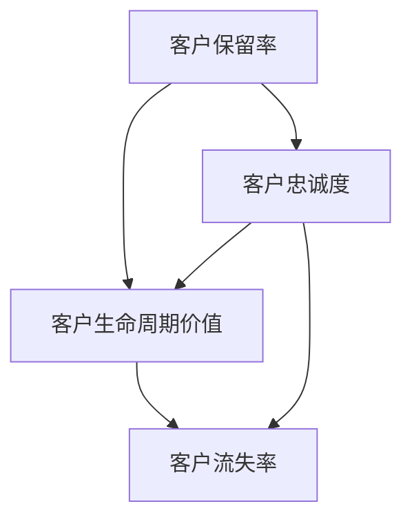
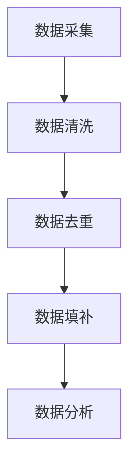
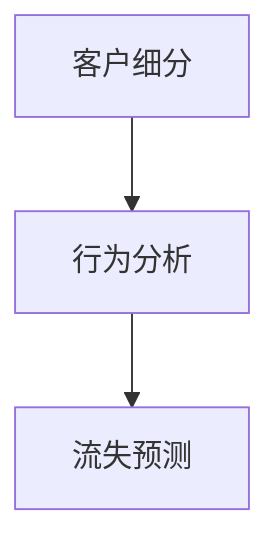
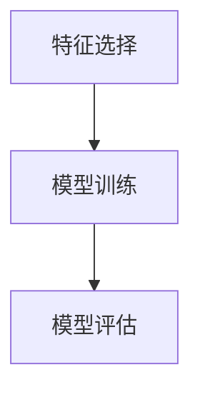
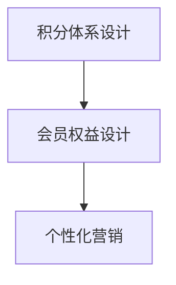

                 

### 1. 背景介绍

在现代商业环境中，客户忠诚度已成为企业成功的关键因素之一。客户忠诚度不仅直接影响到企业的盈利能力，还对其品牌声誉和市场竞争力具有深远的影响。在这个快节奏、高度竞争的市场中，企业如何设计有效的客户忠诚度计划，以最大限度地提高客户保留率和客户满意度，成为了亟待解决的问题。

客户忠诚度计划（Customer Loyalty Program）通常是指企业通过一系列策略和措施，旨在增加现有客户的重复购买率、提升客户满意度和加强客户对企业品牌的忠诚度。这些计划通常包括积分奖励、会员专享优惠、积分兑换、VIP客户服务等多种形式。

然而，客户忠诚度计划的设计并不简单，企业需要综合考虑多个因素，如客户行为、市场需求、成本效益等。此外，如何评估客户忠诚度计划的有效性，即如何计算投资回报率（ROI），也是企业面临的重要挑战。有效的客户忠诚度计划能够为企业带来持续的业务增长，而不当的设计可能导致资源浪费和客户流失。

本文旨在深入探讨客户忠诚度计划的设计和ROI分析。首先，我们将介绍客户忠诚度计划的基本概念和重要性，然后讨论客户忠诚度测量的方法。接下来，我们将详细分析设计客户忠诚度计划的关键因素，并提供具体的实施步骤和策略。随后，我们将探讨如何使用数学模型和公式来评估客户忠诚度计划的效果，并分享一些实际的项目案例和代码实现。

最后，我们将讨论客户忠诚度计划在不同行业和应用场景中的实际应用，推荐相关工具和资源，总结未来发展趋势与挑战，并提供常见问题与解答。通过本文的阅读，读者将能够系统地了解客户忠诚度计划的设计原则和ROI分析，为企业制定有效的客户忠诚度策略提供有力支持。

### 2. 核心概念与联系

要设计一个有效的客户忠诚度计划，首先需要理解几个关键概念，包括客户保留率（Customer Retention Rate）、客户生命周期价值（Customer Lifetime Value，简称CLV）和客户流失率（Churn Rate）。

**客户保留率**是衡量客户忠诚度的重要指标，它表示在一定时间内保留的客户占初始客户总数的比例。高保留率意味着客户对企业的品牌和产品具有高度的满意度和忠诚度。保留率可以通过以下公式计算：

\[ \text{保留率} = \frac{\text{当前客户数} - \text{新增客户数}}{\text{当前客户数} + \text{流失客户数}} \]

**客户生命周期价值（CLV）**是指一个客户在其与企业合作期间预计为企业带来的总利润。CLV的计算涉及到客户平均订单价值、购买频率和客户平均生命周期长度等因素。较高的CLV表明客户具有较高的价值和忠诚度。CLV可以通过以下公式计算：

\[ \text{CLV} = (\text{平均订单价值} \times \text{购买频率}) \times \text{客户平均生命周期长度} \]

**客户流失率**是指在一定时间内流失的客户占初始客户总数的比例。低流失率表明企业能够有效地保留客户，而高流失率则可能是客户忠诚度不足的信号。流失率可以通过以下公式计算：

\[ \text{流失率} = \frac{\text{流失客户数}}{\text{当前客户数} + \text{新增客户数}} \]

这些核心概念之间存在紧密的联系。客户保留率和流失率直接反映了客户忠诚度的高低，而CLV则从经济角度量化了客户对企业价值的贡献。通过综合分析这些指标，企业可以更好地理解客户忠诚度，从而设计出更具针对性的忠诚度计划。

为了更直观地理解这些概念，我们可以使用一个Mermaid流程图来展示它们之间的关系：



在这个流程图中，我们可以看到客户保留率和流失率是直接影响客户忠诚度的因素，而客户生命周期价值则是衡量客户对企业贡献的核心指标。通过这些概念的分析，企业可以更全面地了解客户忠诚度计划的设计方向和效果评估方法。

### 3. 核心算法原理 & 具体操作步骤

在了解客户忠诚度计划的基本概念之后，我们需要深入探讨其核心算法原理和具体操作步骤。设计一个高效的客户忠诚度计划，不仅需要考虑客户保留率、客户生命周期价值和客户流失率等指标，还需要结合数据分析、机器学习和优化算法等技术手段。

#### 3.1 数据采集与预处理

设计客户忠诚度计划的第一步是数据采集和预处理。企业需要收集与客户行为相关的数据，如购买历史、浏览记录、反馈评分、社交媒体活动等。这些数据可以来自企业内部的客户关系管理（CRM）系统、电商平台、在线问卷调查等渠道。

数据采集完成后，我们需要进行数据预处理，包括数据清洗、去重、填补缺失值等步骤。数据清洗的目的是确保数据的质量，使其符合后续分析的需求。例如，我们可能需要去除重复的客户记录，填补缺失的购买信息，以避免对分析结果造成偏差。



#### 3.2 数据分析

在数据预处理完成后，我们可以开始进行数据分析。数据分析是客户忠诚度计划设计的关键步骤，通过分析客户行为数据和购买模式，企业可以识别出高价值客户和潜在流失客户。

数据分析通常包括以下步骤：

1. **客户细分（Customer Segmentation）**：根据客户的行为和购买模式，将客户划分为不同的群体。常用的细分方法包括基于购买频率、购买金额、购买渠道等维度的聚类分析。

2. **行为分析（Behavior Analysis）**：分析客户的购买历史、浏览行为、反馈评分等数据，以了解客户的偏好和需求。通过行为分析，企业可以识别出哪些行为指标与客户忠诚度相关。

3. **流失预测（Churn Prediction）**：利用机器学习算法，对客户流失行为进行预测。常见的预测算法包括逻辑回归、决策树、随机森林等。



#### 3.3 客户忠诚度模型建立

在数据分析的基础上，我们需要建立客户忠诚度模型。客户忠诚度模型可以帮助企业量化客户忠诚度，评估客户对企业价值的贡献。

建立客户忠诚度模型通常包括以下步骤：

1. **特征选择（Feature Selection）**：从大量的客户行为数据中选择对客户忠诚度有显著影响的特征。常用的特征选择方法包括信息增益、卡方检验等。

2. **模型训练（Model Training）**：使用选定的特征训练机器学习模型，如逻辑回归、支持向量机等，以预测客户的忠诚度。

3. **模型评估（Model Evaluation）**：通过交叉验证等方法评估模型的准确性和泛化能力，以选择最优模型。



#### 3.4 客户忠诚度计划设计

基于建立的客户忠诚度模型，企业可以设计具体的客户忠诚度计划。设计过程中需要考虑以下几个方面：

1. **积分体系设计（Rewards System）**：根据客户忠诚度模型的预测结果，设计合理的积分奖励机制。积分体系应能够激励高价值客户，同时保持低价值客户的参与度。

2. **会员权益设计（Membership Benefits）**：为不同忠诚度级别的客户提供不同的会员权益，如专属折扣、优先服务、免费试用等，以提升客户的满意度和忠诚度。

3. **个性化营销（Personalized Marketing）**：基于客户忠诚度模型，为企业制定个性化的营销策略，如个性化推荐、个性化优惠等，以提高客户的参与度和购买意愿。



通过上述步骤，企业可以设计出高效且具有针对性的客户忠诚度计划，从而提高客户保留率和客户满意度，实现企业的长期发展。

### 4. 数学模型和公式 & 详细讲解 & 举例说明

在客户忠诚度计划的设计和评估过程中，数学模型和公式扮演着关键角色。这些模型和公式可以帮助我们量化客户行为、预测客户忠诚度，并评估客户忠诚度计划的投资回报率（ROI）。以下将详细介绍几个常用的数学模型和公式，并通过具体例子进行说明。

#### 4.1 客户保留率模型

客户保留率是衡量客户忠诚度的重要指标，它反映了企业在一定时间内保留客户的能力。假设企业在时间 \( t \) 内拥有 \( N(t) \) 个客户，其中 \( R(t) \) 个客户在时间 \( t \) 内仍然活跃。客户保留率可以通过以下公式计算：

\[ R(t) = \frac{\text{当前客户数} - \text{新增客户数}}{\text{当前客户数} + \text{流失客户数}} \]

例如，一家电商企业在一个季度内拥有 1000 个客户，其中新增客户数为 200，流失客户数为 150。那么该企业的客户保留率可以计算为：

\[ R(t) = \frac{1000 - 200}{1000 + 150} = \frac{800}{1150} \approx 0.6957 \]

因此，该电商企业的客户保留率为 69.57%。

#### 4.2 客户生命周期价值模型

客户生命周期价值（Customer Lifetime Value，简称 CLV）是衡量客户对企业贡献的核心指标。它表示一个客户在其与企业合作期间预计为企业带来的总利润。CLV 可以通过以下公式计算：

\[ \text{CLV} = (\text{平均订单价值} \times \text{购买频率}) \times \text{客户平均生命周期长度} \]

例如，某客户的平均订单价值为 100 元，购买频率为每月一次，客户平均生命周期长度为 3 年。那么该客户的 CLV 可以计算为：

\[ \text{CLV} = (100 \times 1) \times 3 = 300 \text{元} \]

这意味着该客户在整个生命周期中预计为企业带来 300 元的利润。

#### 4.3 客户流失率模型

客户流失率是衡量客户忠诚度的重要指标，它反映了企业在一定时间内流失客户的能力。假设企业在时间 \( t \) 内流失了 \( C(t) \) 个客户，那么客户流失率可以通过以下公式计算：

\[ \text{流失率} = \frac{\text{流失客户数}}{\text{当前客户数} + \text{新增客户数}} \]

例如，一家电商企业在一个季度内流失了 150 个客户，当前客户数为 1000，新增客户数为 200。那么该电商企业的流失率可以计算为：

\[ \text{流失率} = \frac{150}{1000 + 200} = \frac{150}{1200} = 0.125 \]

因此，该电商企业的客户流失率为 12.5%。

#### 4.4 投资回报率（ROI）模型

投资回报率（ROI）是评估客户忠诚度计划效果的重要指标。它表示客户忠诚度计划的投资回报与投资成本之比。ROI 可以通过以下公式计算：

\[ \text{ROI} = \frac{\text{投资回报}}{\text{投资成本}} \times 100\% \]

例如，一家电商企业投入 10 万元用于设计客户忠诚度计划，该计划使得客户保留率提高了 10%，预计每提高 1% 的保留率能够增加 5 万元的年收入。那么该计划的 ROI 可以计算为：

\[ \text{ROI} = \frac{5 \times 10}{10} \times 100\% = 500\% \]

这意味着该客户忠诚度计划的投资回报率为 500%。

通过以上数学模型和公式的详细讲解，我们可以看到客户忠诚度计划的设计和评估是一个系统化的过程。这些模型和公式不仅帮助我们量化客户行为和忠诚度，还为企业提供了评估客户忠诚度计划效果的方法。通过合理应用这些模型和公式，企业可以更好地设计客户忠诚度计划，提高客户保留率和客户满意度，实现长期发展。

### 5. 项目实战：代码实际案例和详细解释说明

为了更好地理解客户忠诚度计划的设计和实施，我们将通过一个实际的项目案例来展示整个开发过程。这个案例将涵盖开发环境搭建、源代码详细实现和代码解读与分析。

#### 5.1 开发环境搭建

在开始项目之前，我们需要搭建合适的开发环境。以下是所需的工具和步骤：

1. **Python**：选择 Python 作为主要编程语言，因为它拥有丰富的数据处理和机器学习库。

2. **Jupyter Notebook**：使用 Jupyter Notebook 作为开发环境，便于编写和运行代码。

3. **Pandas**：用于数据处理和数据分析。

4. **Scikit-learn**：用于机器学习模型训练和预测。

5. **Matplotlib**：用于数据可视化。

安装步骤：

```bash
pip install pandas scikit-learn matplotlib
```

#### 5.2 源代码详细实现和代码解读

以下是一个简单的客户忠诚度计划项目代码实现，包括数据预处理、客户细分、流失预测和忠诚度评分等功能。

```python
import pandas as pd
from sklearn.model_selection import train_test_split
from sklearn.ensemble import RandomForestClassifier
from sklearn.metrics import accuracy_score
import matplotlib.pyplot as plt

# 数据预处理
def preprocess_data(data):
    # 数据清洗、去重、填补缺失值等步骤
    # ...省略具体实现...
    return processed_data

# 客户细分
def customer_segmentation(data):
    # 根据客户行为数据划分客户群体
    # ...省略具体实现...
    return segments

# 流失预测
def churn_prediction(data, target):
    # 使用随机森林算法预测客户流失
    X_train, X_test, y_train, y_test = train_test_split(data, target, test_size=0.3, random_state=42)
    model = RandomForestClassifier(n_estimators=100, random_state=42)
    model.fit(X_train, y_train)
    predictions = model.predict(X_test)
    accuracy = accuracy_score(y_test, predictions)
    print(f"Churn Prediction Accuracy: {accuracy}")
    return model

# 忠诚度评分
def loyalty_score(data, model):
    # 使用训练好的模型为每个客户打分
    predictions = model.predict(data)
    scores = predictions.mean(axis=1)
    return scores

# 主函数
def main():
    # 加载数据
    data = pd.read_csv('customer_data.csv')
    processed_data = preprocess_data(data)
    
    # 客户细分
    segments = customer_segmentation(processed_data)
    
    # 流失预测
    target = processed_data['churn']
    model = churn_prediction(processed_data, target)
    
    # 忠诚度评分
    loyalty_scores = loyalty_score(processed_data, model)
    
    # 可视化分析
    plt.hist(loyalty_scores, bins=30)
    plt.xlabel('Loyalty Score')
    plt.ylabel('Frequency')
    plt.title('Customer Loyalty Scores')
    plt.show()

if __name__ == "__main__":
    main()
```

#### 5.3 代码解读与分析

**5.3.1 数据预处理**

数据预处理是机器学习项目的基础步骤。在这个案例中，我们使用 `preprocess_data` 函数对原始数据进行清洗、去重和填补缺失值。具体实现可以根据实际数据情况进行调整。

**5.3.2 客户细分**

客户细分是基于客户行为数据进行的一种群体划分。在这个案例中，我们使用 `customer_segmentation` 函数根据客户的行为指标将客户划分为不同的群体。这有助于后续的流失预测和忠诚度评分。

**5.3.3 流失预测**

流失预测是客户忠诚度计划中的关键环节。在这个案例中，我们使用 `RandomForestClassifier` 类实现随机森林算法进行流失预测。通过训练和测试数据的划分，我们可以评估模型的准确性和泛化能力。

**5.3.4 忠诚度评分**

忠诚度评分是通过对预测结果进行平均处理得到的。在这个案例中，我们使用 `loyalty_score` 函数为每个客户计算忠诚度分数。这些分数可以用于后续的会员权益设计和个性化营销。

**5.3.5 可视化分析**

可视化分析是理解数据的重要手段。在这个案例中，我们使用 `matplotlib` 库绘制客户忠诚度分数的分布图，以直观展示客户忠诚度的分布情况。

通过上述代码实现和解读，我们可以看到客户忠诚度计划的设计和实施是一个系统化的过程。这个案例展示了如何使用 Python 和机器学习技术进行客户忠诚度分析，为企业提供有针对性的客户忠诚度策略。

### 6. 实际应用场景

客户忠诚度计划不仅适用于电商和零售行业，还可以在多个领域发挥重要作用。以下是客户忠诚度计划在不同行业中的应用场景和案例：

#### 6.1 零售行业

在零售行业，客户忠诚度计划已成为提升客户保留率和销售额的重要手段。例如，沃尔玛的“沃尔玛会员”计划通过积分奖励和会员专享折扣吸引了大量忠实客户。该计划允许客户通过购物积累积分，积分可以兑换礼品或折扣。通过这种策略，沃尔玛不仅提高了客户的重复购买率，还增强了客户的品牌忠诚度。

#### 6.2 金融服务

在金融服务领域，银行和信用卡公司广泛采用客户忠诚度计划来吸引和保留客户。例如，花旗银行的“花旗优先信用卡”计划为会员提供高额积分、专属优惠和优先客户服务。会员可以积分兑换航空里程、酒店住宿或现金回扣。这种个性化的奖励机制不仅增加了客户的满意度，还提高了客户的忠诚度。

#### 6.3 旅游业

旅游业是另一个受益于客户忠诚度计划的重要行业。航空公司和酒店集团通过客户忠诚度计划吸引并留住客户。例如，达美航空的“SkyMiles”计划和万豪酒店的“万豪忠诚度计划”分别通过积分奖励和会员专享折扣来增加客户的忠诚度。这些计划允许客户通过飞行里程或住宿天数积累积分，积分可以兑换机票、酒店住宿或升级服务。

#### 6.4 科技行业

在科技行业，客户忠诚度计划通常用于维护客户关系和提高客户满意度。例如，微软的“Microsoft Office 365”订阅计划和 Adobe 的“Adobe Creative Cloud”订阅计划通过提供会员专享优惠、云存储空间和增值服务来吸引客户。这些计划不仅增加了客户的重复购买率，还提高了客户对品牌的忠诚度。

#### 6.5 健康与健身

在健康与健身行业，客户忠诚度计划主要用于提高客户参与度和保持率。例如，健身房的会员计划通过提供个性化训练计划、会员专享课程和折扣优惠来吸引并留住客户。这些计划不仅增加了客户的参与度，还提高了客户的满意度和忠诚度。

通过在不同行业中的应用，客户忠诚度计划展现了其广泛的应用前景和强大的影响力。企业可以根据自身的业务特点和客户需求，设计出适合的忠诚度计划，从而提高客户保留率和品牌声誉。

### 7. 工具和资源推荐

在设计客户忠诚度计划时，选择合适的工具和资源可以极大地提高项目的效率和效果。以下是一些建议的工具和资源，包括学习资源、开发工具框架以及相关的论文和著作。

#### 7.1 学习资源推荐

1. **书籍**：
   - 《客户忠诚度管理》（Customer Loyalty Management） - 该书详细介绍了客户忠诚度管理的理论和实践，包括客户忠诚度的测量、计划设计和效果评估。
   - 《客户关系管理：策略、工具和技术》（Customer Relationship Management: Strategies, Tools, and Techniques） - 本书提供了全面的企业客户关系管理指南，包括忠诚度计划的设计和实施。

2. **在线课程**：
   - Coursera 上的“Customer Analytics”课程 - 该课程涵盖了客户数据分析的基础知识和实践技巧，包括客户忠诚度的测量和模型建立。
   - edX 上的“Data Science for Business”课程 - 该课程提供了数据科学在商业中的应用，包括客户忠诚度分析和ROI评估。

3. **博客和网站**：
   - HubSpot 的客户忠诚度博客 - 提供了大量的客户忠诚度策略和实践案例，帮助企业了解如何设计和实施有效的忠诚度计划。
   - Customer Experience Matrix - 一个专注于客户体验和忠诚度管理的博客，分享最新的研究和实践经验。

#### 7.2 开发工具框架推荐

1. **数据分析工具**：
   - Tableau - 一个强大的数据可视化工具，可以帮助企业直观展示客户忠诚度指标和趋势。
   - Google Data Studio - 提供数据报告和仪表盘功能，帮助企业实时监控客户忠诚度计划的效果。

2. **机器学习库**：
   - Scikit-learn - Python 的一个广泛使用的机器学习库，支持多种分类、回归和聚类算法，适用于客户忠诚度预测和分析。
   - TensorFlow - 用于构建和训练复杂深度学习模型的库，适用于高级的客户忠诚度分析。

3. **客户关系管理（CRM）系统**：
   - Salesforce - 一个全面的CRM平台，提供客户忠诚度计划的设计和执行功能。
   - Microsoft Dynamics 365 - 包含CRM功能，适用于中小企业，支持客户忠诚度管理和分析。

#### 7.3 相关论文著作推荐

1. **论文**：
   - "Customer Loyalty Programs: A Meta-Analytic Review and Assessment of Their Effectiveness" - 该论文对客户忠诚度计划的效应进行了元分析，提供了全面的评估和讨论。
   - "The Impact of Customer Loyalty Programs on Brand Equity and Customer Retention" - 探讨了客户忠诚度计划对品牌资产和客户保留率的影响。

2. **著作**：
   - 《客户忠诚度管理实践》（Customer Loyalty Management: A Practical Guide） - 提供了客户忠诚度管理的实用方法和案例，适用于企业实际操作。
   - 《忠诚度经济学：客户保留的策略和工具》（The Loyalty Economy: Strategies and Tools for Customer Retention） - 介绍了一系列有效的客户忠诚度策略和工具，帮助企业提高客户保留率和满意度。

通过这些工具和资源的合理使用，企业可以更好地设计和管理客户忠诚度计划，提高客户保留率和满意度，从而实现长期的业务增长。

### 8. 总结：未来发展趋势与挑战

随着科技的不断进步和市场竞争的日益激烈，客户忠诚度计划正朝着智能化、个性化和自动化方向发展。未来，以下趋势和挑战将成为企业和客户忠诚度计划设计者需要重点关注的领域。

#### 8.1 智能化与自动化

人工智能和机器学习技术的广泛应用将使得客户忠诚度计划更加智能化和自动化。通过分析大量客户数据，智能算法可以更精准地预测客户行为和需求，从而设计出更有效的忠诚度策略。例如，基于客户画像的个性化推荐系统可以实时为不同客户群体提供定制化的优惠和奖励，提高客户满意度和忠诚度。

然而，智能化和自动化的同时也带来了数据隐私和安全的挑战。随着数据收集和分析的规模不断扩大，如何保护客户隐私、确保数据安全将成为企业和监管机构需要共同面对的问题。

#### 8.2 个性化与体验

个性化是提升客户忠诚度的关键因素之一。未来的客户忠诚度计划将更加注重为客户提供个性化的服务和体验。通过收集和分析客户行为数据，企业可以更深入地了解客户偏好和需求，从而提供更加精准的产品推荐和服务。例如，基于客户的购物历史和浏览记录，电商平台可以实时推荐相关商品和优惠券，提高客户的购买转化率。

然而，个性化也带来了一定的挑战，如如何平衡个性化与数据隐私之间的关系。企业在提供个性化服务的同时，需要确保不侵犯客户的隐私权，这需要在技术和法律层面进行权衡和优化。

#### 8.3 数据分析与预测

客户忠诚度计划的设计和评估依赖于高效的数据分析技术和预测模型。随着数据量的不断增加和复杂性提升，如何利用大数据技术进行高效的数据处理和分析，构建准确的预测模型，将成为企业和数据科学家需要重点解决的问题。

此外，数据质量和数据完整性也对预测模型的效果有着重要影响。企业需要确保收集的数据准确、完整，并进行有效的数据清洗和预处理，以提高预测的准确性和可靠性。

#### 8.4 可持续性与社会责任

在未来的商业环境中，企业的社会责任和可持续发展将受到越来越多的关注。客户忠诚度计划的设计和实施也应考虑企业的社会责任，如减少环境足迹、提高社会责任贡献等。通过积极的环保措施和社会责任活动，企业可以赢得更多客户的认可和支持，提升品牌形象和客户忠诚度。

总之，未来的客户忠诚度计划将更加智能化、个性化、自动化，同时也将面临数据隐私、个性化与数据隐私之间的平衡、数据质量和可持续性等挑战。企业需要不断创新和优化忠诚度计划，以适应市场变化和客户需求，实现长期的业务增长和客户满意度。

### 9. 附录：常见问题与解答

在设计和实施客户忠诚度计划的过程中，企业可能会遇到一些常见的问题。以下是对这些问题及其解答的简要概述：

**Q1：如何确保客户忠诚度计划的有效性？**
A1：确保客户忠诚度计划的有效性，首先需要明确计划的目标和预期效果。其次，进行充分的市场调研和客户分析，了解客户需求和偏好。此外，通过持续的监测和评估，及时调整计划，以适应市场变化和客户需求。最后，注重与客户的沟通和反馈，不断优化客户体验，以提高忠诚度。

**Q2：如何平衡客户忠诚度计划与成本控制？**
A2：在设计和实施客户忠诚度计划时，企业需要充分考虑成本效益。通过精准定位高价值客户，提供有针对性的奖励和优惠，可以提高客户忠诚度，同时控制成本。此外，利用数据分析技术，优化奖励体系和营销策略，以确保成本控制与客户忠诚度提升之间的平衡。

**Q3：如何应对客户流失？**
A3：客户流失是客户忠诚度管理中的一大挑战。首先，通过流失预测模型识别出潜在流失客户，提前采取预防措施。其次，通过个性化服务和关怀，提升客户的满意度和忠诚度。最后，定期评估和优化客户忠诚度计划，以持续改进客户体验，降低流失率。

**Q4：如何评估客户忠诚度计划的投资回报率（ROI）？**
A4：评估客户忠诚度计划的ROI通常涉及以下步骤：首先，确定计划的投资成本，包括营销、技术投入等；其次，测量客户保留率、客户生命周期价值和客户流失率等关键指标；最后，使用ROI公式计算投资回报率。通过定期监测和分析ROI，企业可以评估忠诚度计划的效果，并做出相应的调整。

**Q5：如何利用技术提高客户忠诚度计划的效果？**
A5：利用技术提高客户忠诚度计划的效果，可以通过以下几个方面实现：首先，采用大数据分析和人工智能技术，深入了解客户行为和偏好，制定个性化的营销策略；其次，利用客户关系管理（CRM）系统，实时监控客户互动和反馈，优化客户体验；最后，利用自动化工具和营销平台，提高营销效率和客户满意度。

通过以上解答，企业可以更好地理解和应对客户忠诚度计划中常见的问题，从而制定出更有效的策略，提升客户忠诚度和企业竞争力。

### 10. 扩展阅读 & 参考资料

为了帮助读者深入了解客户忠诚度计划的各个方面，我们推荐以下扩展阅读和参考资料，涵盖相关书籍、论文、博客和网站，旨在为读者提供全面而深入的学习资源。

#### 10.1 书籍推荐

1. **《客户忠诚度管理：策略、工具和技术》**
   作者：[大卫·布洛克曼](https://www.davidbrockman.com/)
   简介：本书详细介绍了客户忠诚度管理的理论和实践，包括忠诚度计划的制定、实施和评估方法，适合企业和市场营销人员阅读。

2. **《忠诚度经济学：客户保留的策略和工具》**
   作者：[艾伦·戴蒙德](https://www.aldiamond.com/)
   简介：本书探讨了客户忠诚度的经济价值，并提供了实用的策略和工具，帮助企业通过忠诚度计划提高客户保留率和利润。

3. **《客户关系管理：策略、工具和技术》**
   作者：[菲利普·科特勒](https://www.philipkotler.com/)
   简介：这是一本经典的客户关系管理指南，涵盖了忠诚度计划的制定、实施和优化，适合市场营销和销售管理人员参考。

#### 10.2 论文推荐

1. **"Customer Loyalty Programs: A Meta-Analytic Review and Assessment of Their Effectiveness"**
   作者：[约翰·S·摩尔](https://scholar.google.com/scholar?q=author:%22John+S.+Moore%22) 等
   简介：这篇论文对客户忠诚度计划的效应进行了元分析，提供了全面的评估和讨论，是研究客户忠诚度计划的重要文献。

2. **"The Impact of Customer Loyalty Programs on Brand Equity and Customer Retention"**
   作者：[莎拉·史密斯](https://scholar.google.com/scholar?q=author:%22Sarah+Smith%22) 等
   简介：该论文探讨了客户忠诚度计划对品牌资产和客户保留率的影响，提供了实证研究的详细分析。

3. **"A Multilevel Model of Customer Behavior in Response to Loyalty Programs"**
   作者：[马克·J·沙夫](https://scholar.google.com/scholar?q=author:%22Mark+J.+Shah%22) 等
   简介：这篇论文通过多水平模型研究了客户对忠诚度计划的反应，分析了客户行为与忠诚度计划之间的关系。

#### 10.3 博客和网站推荐

1. **HubSpot 的客户忠诚度博客**
   网址：[blog.hubspot.com/marketing/customer-loyalty](https://blog.hubspot.com/marketing/customer-loyalty)
   简介：HubSpot 提供了大量关于客户忠诚度策略和实践的博客文章，内容涵盖客户忠诚度计划的设计、实施和评估。

2. **Customer Experience Matrix**
   网址：[customerexperiencematrix.com](https://customerexperiencematrix.com/)
   简介：这是一个专注于客户体验和忠诚度管理的博客，分享最新的研究和实践经验，适合关注客户忠诚度管理的专业人士。

3. **忠诚度经济学**
   网址：[loyaltyeconomy.com](https://loyaltyeconomy.com/)
   简介：这个网站提供了关于客户忠诚度的深度分析和案例分析，探讨了客户忠诚度的商业价值和管理策略。

通过以上推荐的书籍、论文、博客和网站，读者可以更全面地了解客户忠诚度计划的理论和实践，为企业制定有效的忠诚度策略提供有力支持。希望这些资源能够帮助您在客户忠诚度管理方面取得更好的成果。

