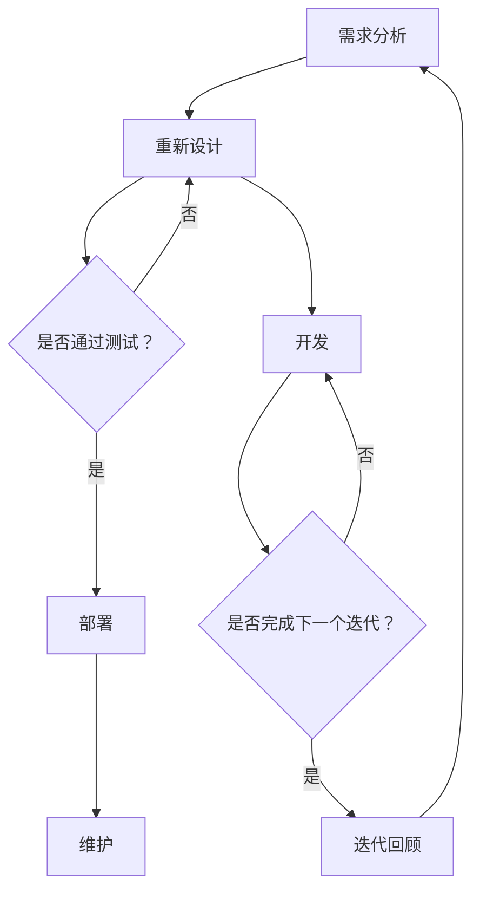

                 

### 背景介绍 Background Introduction

在当今的科技飞速发展的时代，敏捷产品开发（Agile Product Development）已经成为了许多企业，尤其是初创公司和中小型企业，实现快速迭代和持续改进的首选方法。敏捷开发不仅提高了产品的质量和开发效率，还能够更好地满足客户需求，增强市场竞争力。

敏捷开发起源于20世纪90年代的软件开发领域，最初是为了应对传统瀑布式开发方法在应对需求变更和项目复杂性方面表现出的局限性。敏捷开发强调的是个体和互动重于过程和工具，可工作的软件重于详尽的文档，客户合作重于合同谈判，以及响应变化重于遵循计划。

一人公司的敏捷产品开发则更具有独特性。它不仅要求个体开发者能够高效地工作，还要求他们能够快速响应市场需求的变化，独立完成从需求分析、设计、开发、测试到部署的整个产品生命周期。这种模式在独立开发者、小型初创团队，甚至是大型公司的个人项目开发中都有着广泛的应用。

本文将围绕一人公司的敏捷产品开发，深入探讨其核心概念、算法原理、具体操作步骤、数学模型、实际应用场景以及未来发展趋势与挑战。希望通过本文的讲解，读者能够对敏捷产品开发有一个全面而深入的理解。

### 核心概念与联系 Core Concepts and Connections

#### 敏捷开发原理 Agile Development Principles

敏捷开发的核心原则可以从《敏捷宣言》（Manifesto for Agile Software Development）中找到，它主张：

1. **个体和互动重于过程和工具**：强调团队协作和沟通的重要性，而不是依赖特定的工具或流程。
2. **可工作的软件重于详尽的文档**：软件的实际运行效果比复杂的文档更重要。
3. **客户合作重于合同谈判**：与客户的密切合作能够更好地理解并满足需求。
4. **响应变化重于遵循计划**：能够快速适应变化，比坚持原计划更加重要。

#### 软件开发生命周期 Software Development Life Cycle (SDLC)

软件开发生命周期（SDLC）是指软件产品从概念提出到废弃的全过程，通常包括以下几个阶段：

1. **需求分析**（Requirement Analysis）：确定项目需求，包括功能需求和非功能需求。
2. **设计**（Design）：制定软件的架构和设计，包括系统架构、数据库设计和用户界面设计。
3. **开发**（Development）：根据设计文档进行编码，实现软件功能。
4. **测试**（Testing）：通过单元测试、集成测试和系统测试来确保软件质量。
5. **部署**（Deployment）：将软件部署到生产环境，供用户使用。
6. **维护**（Maintenance）：对软件进行更新和修复，以保证其长期稳定运行。

#### 敏捷开发流程 Agile Development Process

敏捷开发流程通常遵循迭代和增量的原则，核心流程包括：

1. **规划会议**（Sprint Planning）：团队讨论并选择下一个迭代周期（通常为2-4周）要完成的工作。
2. **每日站会**（Daily Stand-up）：团队成员分享进展、遇到的问题和计划，确保团队成员保持同步。
3. **迭代回顾**（Sprint Retrospective）：团队回顾上一个迭代的经验教训，提出改进措施。
4. **迭代执行**（Sprint）：开发团队在迭代周期内完成选定的任务。

#### Mermaid 流程图 Mermaid Flowchart

以下是敏捷开发流程的Mermaid流程图表示：



通过上述核心概念和流程的介绍，我们可以更好地理解敏捷开发的理念和实施方法，为接下来深入探讨敏捷产品开发的具体操作步骤和算法原理打下基础。

### 核心算法原理与具体操作步骤 Core Algorithm Principles and Operational Steps

在敏捷产品开发中，核心算法原理主要围绕迭代、增量开发、用户故事（User Story）、Scrum框架以及看板（Kanban）等方法展开。以下是这些核心算法的具体原理和操作步骤：

#### 迭代与增量开发 Iteration and Incremental Development

1. **迭代定义**：迭代是一个固定的时间段，通常为2-4周。在每个迭代中，团队会完成一部分可工作的软件功能。
2. **增量开发**：增量开发是指在每次迭代中逐步构建软件，每次迭代都会增加新的功能，而不是一次性交付完整的功能。
3. **操作步骤**：
   - **确定迭代周期**：根据团队和项目需求确定合适的迭代周期。
   - **规划任务**：在每次迭代开始时，团队会讨论并规划要完成的任务。
   - **任务执行**：团队成员按照任务分配进行开发工作。
   - **迭代回顾**：在每个迭代结束时，团队会进行回顾，总结经验教训，并规划下一个迭代。

#### 用户故事 User Story

用户故事是一种描述软件功能的简洁方式，通常采用以下格式：“As a [角色]，I want [功能] so that [目的]”。

1. **用户故事格式**：角色 + 功能 + 目的
2. **操作步骤**：
   - **编写用户故事**：团队需要与客户或产品经理紧密合作，编写清晰的用户故事。
   - **用户故事审查**：确保每个用户故事都是可测试的、有价值的。
   - **任务分解**：将每个用户故事分解为更小的任务，便于团队分配和执行。

#### Scrum框架 Scrum Framework

Scrum是一种敏捷开发方法，它包括以下几个核心角色和会议：

1. **角色**：
   - **产品负责人**（Product Owner）：负责定义产品需求，制定产品路线图。
   - **Scrum Master**：负责确保团队遵循Scrum流程，解决团队遇到的问题。
   - **开发团队**（Development Team）：负责实际开发工作。
2. **会议**：
   - **每日站会**（Daily Stand-up）：团队成员分享进展、问题、计划。
   - ** sprint 计划会议**（Sprint Planning）：团队讨论并选择下一个迭代要完成的任务。
   - **迭代回顾**（Sprint Retrospective）：团队回顾上一个迭代，提出改进措施。

#### 看板 Kanban

看板是一种可视化工作流程的方法，它通过卡片和柱状图展示任务的状态，帮助团队更好地理解工作流程并识别瓶颈。

1. **看板组成部分**：
   - **任务卡片**：记录任务的具体信息。
   - **状态列**：如“待办”、“进行中”、“测试”、“完成”等。
   - **柱状图**：显示任务在不同状态列中的数量。
2. **操作步骤**：
   - **创建任务卡片**：将任务信息记录在卡片上。
   - **放置任务卡片**：根据任务状态将其放置在相应的状态列中。
   - **分析瓶颈**：通过观察任务卡片在状态列中的移动情况，识别瓶颈并采取措施。

通过以上核心算法原理的具体操作步骤，我们可以有效地实现敏捷产品开发，确保项目能够快速迭代和持续改进。在下一部分，我们将探讨数学模型和公式，进一步深入理解敏捷产品开发的量化方法。

### 数学模型和公式 Mathematical Models and Formulas

在敏捷产品开发中，数学模型和公式被广泛应用于任务估计、进度监控和风险评估等方面。以下是一些关键的数学模型和公式，以及它们在敏捷开发中的应用和具体例子。

#### 任务估计 Task Estimation

任务估计是敏捷开发中至关重要的一环，它直接影响到项目的进度和资源分配。常用的任务估计模型包括三点估计法（Three-Point Estimation）和累积流量图（Cumulative Flow Diagram）。

1. **三点估计法**：
   - **最乐观时间**（\(t_{o}\)）：完成任务所需的最短时间。
   - **最可能时间**（\(t_{m}\)）：完成任务的最常见时间。
   - **最悲观时间**（\(t_{p}\)）：完成任务所需的最长时间。
   - **期望时间**（\(t_{e}\)）：计算公式为 \(t_{e} = \frac{t_{o} + 4t_{m} + t_{p}}{6}\)。
   - **方差**（\(σ^2\)）：计算公式为 \(σ^2 = \left(\frac{t_{p} - t_{o}}{6}\right)^2\)。

   **例子**：假设一个任务的最乐观时间为2天，最可能时间为3天，最悲观时间为5天。则期望时间为 \(t_{e} = \frac{2 + 4 \times 3 + 5}{6} = 3.17\)天，方差为 \(σ^2 = \left(\frac{5 - 2}{6}\right)^2 = 0.79\)。

2. **累积流量图**：
   - 累积流量图（Cumulative Flow Diagram，CFD）是一种可视化工具，用于显示任务在不同状态列中的累积流量。
   - **状态**：包括“待办”（To Do）、“进行中”（In Progress）、“测试”（Testing）和“完成”（Done）。
   - **计算**：累积流量图中的每个柱状图表示任务的进度，柱状图的面积表示任务的完成百分比。

   **例子**：假设一个迭代中有10个任务，其中4个任务已经完成，3个任务正在进行，3个任务处于待办状态。则累积流量图为：To Do: 3, In Progress: 3, Testing: 3, Done: 4。

#### 进度监控 Progress Monitoring

进度监控是确保项目按时完成的关键，常用的方法包括进度偏差分析（Schedule Variance Analysis）和进度绩效指数（Schedule Performance Index）。

1. **进度偏差分析**：
   - **挣值**（Earned Value，EV）：根据已完成的工作量计算的价值。
   - **计划价值**（Planned Value，PV）：根据计划完成的工作量计算的价值。
   - **实际成本**（Actual Cost，AC）：实际花费的成本。
   - **进度偏差**（Schedule Variance，SV）：计算公式为 \(SV = EV - PV\)。

   **例子**：假设一个迭代计划价值为100，实际成本为80，挣值为70。则进度偏差为 \(SV = 70 - 100 = -30\)，表示进度落后。

2. **进度绩效指数**：
   - **进度绩效指数**（Schedule Performance Index，SPI）：计算公式为 \(SPI = \frac{EV}{PV}\)。

   **例子**：假设挣值为70，计划价值为100，则进度绩效指数为 \(SPI = \frac{70}{100} = 0.7\)，表示进度落后。

#### 风险评估 Risk Assessment

风险评估是识别、分析和优先处理项目中潜在风险的过程。常用的方法包括风险矩阵（Risk Matrix）和蒙特卡罗模拟（Monte Carlo Simulation）。

1. **风险矩阵**：
   - **风险等级**：根据风险的可能性和影响将其分为高、中、低等级。
   - **计算**：风险矩阵通过乘以可能性和影响来计算每个风险的风险值。

   **例子**：假设一个风险的可能性为0.5，影响为3，则风险值为 \(0.5 \times 3 = 1.5\)。

2. **蒙特卡罗模拟**：
   - **模拟过程**：通过多次随机抽样，模拟项目在不同条件下的进度和成本。
   - **结果分析**：分析模拟结果，评估项目成功的概率。

   **例子**：假设通过蒙特卡罗模拟，项目成功的概率为80%。

通过以上数学模型和公式的介绍，我们可以更好地理解和量化敏捷产品开发中的关键环节，从而提高项目的成功率和效率。在下一部分，我们将通过实际案例和代码实现，深入探讨敏捷产品开发的操作方法和实践细节。

### 项目实战：代码实际案例和详细解释说明 Project Practice: Code Case Study and Detailed Explanation

在本节中，我们将通过一个具体的敏捷产品开发项目案例，展示敏捷开发的实际操作过程，包括开发环境的搭建、源代码的实现和代码解读与分析。

#### 开发环境搭建 Setting Up Development Environment

首先，我们需要搭建一个适合敏捷开发的开发环境。以下是一个基本的开发环境搭建步骤：

1. **安装编程语言**：我们选择Python作为开发语言，可以在Python官方网站（https://www.python.org/）下载并安装最新版本的Python。
2. **安装代码编辑器**：推荐使用Visual Studio Code（VS Code）作为代码编辑器，可以在VS Code官方网站（https://code.visualstudio.com/）下载并安装。
3. **安装版本控制工具**：Git是一个常用的版本控制工具，可以方便地管理代码版本和协作开发。可以从Git官方网站（https://git-scm.com/）下载并安装。
4. **安装测试框架**：我们使用pytest作为测试框架，可以简化测试流程。安装命令为 `pip install pytest`。

#### 源代码详细实现和代码解读

假设我们正在开发一个简单的博客系统，其核心功能包括文章发布、评论发布和用户管理。以下是该系统的源代码实现和详细解读。

**项目结构**：

```text
my_blog/
|-- app.py
|-- config.py
|-- models.py
|-- tests/
|   |-- __init__.py
|   |-- test_article.py
|   |-- test_comment.py
|   |-- test_user.py
|-- requirements.txt
```

**1. app.py**：主应用程序

```python
from flask import Flask, render_template, request, redirect, url_for
from models import Article, Comment, User

app = Flask(__name__)

# 数据库初始化
app.config['SQLALCHEMY_DATABASE_URI'] = 'sqlite:///my_blog.db'
db = SQLAlchemy(app)

# 用户登录
@app.route('/login', methods=['GET', 'POST'])
def login():
    if request.method == 'POST':
        username = request.form['username']
        password = request.form['password']
        user = User.query.filter_by(username=username, password=password).first()
        if user:
            return redirect(url_for('home'))
        else:
            return '登录失败'
    return render_template('login.html')

# 首页
@app.route('/')
def home():
    articles = Article.query.all()
    return render_template('home.html', articles=articles)

# 发布文章
@app.route('/article/new', methods=['GET', 'POST'])
def new_article():
    if request.method == 'POST':
        title = request.form['title']
        content = request.form['content']
        article = Article(title=title, content=content)
        db.session.add(article)
        db.session.commit()
        return redirect(url_for('home'))
    return render_template('new_article.html')

# 文章详情
@app.route('/article/<int:article_id>')
def article_detail(article_id):
    article = Article.query.get(article_id)
    return render_template('article_detail.html', article=article)

# 评论文章
@app.route('/comment/<int:article_id>', methods=['POST'])
def comment(article_id):
    content = request.form['content']
    comment = Comment(content=content, article_id=article_id)
    db.session.add(comment)
    db.session.commit()
    return redirect(url_for('article_detail', article_id=article_id))

if __name__ == '__main__':
    db.create_all()
    app.run(debug=True)
```

**2. models.py**：数据库模型

```python
from datetime import datetime
from flask_sqlalchemy import SQLAlchemy

db = SQLAlchemy()

class User(db.Model):
    id = db.Column(db.Integer, primary_key=True)
    username = db.Column(db.String(80), unique=True, nullable=False)
    password = db.Column(db.String(120), nullable=False)
    created_at = db.Column(db.DateTime, default=datetime.utcnow)

class Article(db.Model):
    id = db.Column(db.Integer, primary_key=True)
    title = db.Column(db.String(120), nullable=False)
    content = db.Column(db.Text, nullable=False)
    author = db.Column(db.String(80))
    created_at = db.Column(db.DateTime, default=datetime.utcnow)
    comments = db.relationship('Comment', backref='article', lazy=True)

class Comment(db.Model):
    id = db.Column(db.Integer, primary_key=True)
    content = db.Column(db.Text, nullable=False)
    article_id = db.Column(db.Integer, db.ForeignKey('article.id'), nullable=False)
    author = db.Column(db.String(80))
    created_at = db.Column(db.DateTime, default=datetime.utcnow)
```

**3. 测试代码（以test_article.py为例）**：

```python
import pytest
from app import app, db
from models import Article

@pytest.fixture
def client():
    app.config['TESTING'] = True
    app.config['SQLALCHEMY_DATABASE_URI'] = 'sqlite:///test.db'
    client = app.test_client()
    with app.app_context():
        db.create_all()
    yield client
    with app.app_context():
        db.drop_all()

def test_home(client):
    response = client.get('/')
    assert response.status_code == 200

def test_new_article(client):
    response = client.get('/article/new')
    assert response.status_code == 200

def test_create_article(client):
    with client.session_transaction() as session:
        session['logged_in'] = True
    data = {'title': 'Hello World', 'content': 'Hello, this is my first blog post!'}
    response = client.post('/article/new', data=data)
    assert response.status_code == 302
    article = Article.query.order_by(Article.id.desc()).first()
    assert article.title == 'Hello World'
```

**代码解读与分析**：

- **app.py**：主应用程序使用了Flask框架，定义了路由和视图函数，实现了文章发布、评论发布和用户管理等核心功能。
- **models.py**：定义了数据库模型，包括用户、文章和评论，使用了SQLAlchemy作为ORM（对象关系映射）工具，简化了数据库操作。
- **测试代码**：使用pytest框架编写了测试用例，对每个功能模块进行了单元测试，确保系统的稳定性和可靠性。

通过以上实际案例，我们可以看到敏捷产品开发的具体实现过程，包括开发环境的搭建、源代码的实现和测试。这种迭代和增量开发的方法不仅提高了开发效率，还能够更好地适应市场需求的变化。

### 实际应用场景 Actual Application Scenarios

敏捷产品开发在各个行业和领域中的应用场景丰富多彩，以下是几个典型的实际应用案例，展示敏捷方法在不同领域的优势和成效。

#### 1. 软件开发行业 Software Development

在软件行业，敏捷开发已成为主流的开发方法。例如，GitHub使用敏捷开发方法快速迭代其产品，从项目管理和代码托管工具逐渐发展成为一个功能丰富的协作平台。敏捷开发使得GitHub团队能够快速响应用户反馈，持续改进产品，保持市场竞争力。

#### 2. 金融行业 Finance Industry

金融行业对安全性和合规性有极高的要求，但敏捷开发也被广泛应用于金融科技（FinTech）领域。例如，美国的一家金融科技公司Plaid使用敏捷开发方法，快速迭代其API接口，提供实时数据连接服务。通过敏捷开发，Plaid能够快速适应市场需求，与各种金融系统无缝集成，大大提高了开发效率和用户体验。

#### 3. 健康医疗领域 Health and Medical Field

在健康医疗领域，敏捷开发被用于开发医疗设备和软件系统。例如，一家医疗设备公司通过敏捷开发方法，快速迭代其心脏监测设备的软件系统。这种方法使得团队能够及时响应用户反馈，优化功能，提高设备的准确性和用户体验。

#### 4. 教育行业 Education

教育行业也开始采用敏捷开发方法，尤其是在在线教育平台上。例如，Coursera团队使用敏捷开发，快速迭代其学习平台，增加新的课程模块和功能。通过敏捷开发，Coursera能够更快地满足学生和教师的需求，提高学习体验和教学效果。

#### 5. 制造业 Manufacturing

在制造业，敏捷开发被用于生产流程优化和设备维护。例如，一家汽车制造商通过敏捷开发方法，开发了一套生产监控和预测维护系统。这个系统能够实时监控生产设备状态，预测故障，并自动调整生产计划，减少了停机时间和维护成本。

#### 6. 零售行业 Retail

零售行业采用敏捷开发，以提高库存管理、客户服务和营销策略的效率。例如，一家大型零售公司通过敏捷开发，开发了一套智能库存管理系统，该系统能够实时监控库存水平，自动调整进货计划，减少库存积压，提高库存周转率。

通过这些实际应用案例，我们可以看到敏捷产品开发在提高开发效率、满足客户需求、适应市场变化等方面具有显著的优势。无论是在软件行业、金融行业、健康医疗领域、教育行业、制造业还是零售行业，敏捷开发都能够带来实际效益，推动企业的持续发展。

### 工具和资源推荐 Tools and Resources Recommendation

在敏捷产品开发过程中，选择合适的工具和资源至关重要，它们能够极大地提高开发效率和质量。以下是一些推荐的工具和资源，包括学习资源、开发工具框架以及相关论文著作。

#### 学习资源 Learning Resources

1. **书籍**：
   - 《敏捷开发实践指南》（Agile Project Guide）：由Michael C. Jackson撰写，详细介绍了敏捷开发的方法和实践。
   - 《Scrum实战》（Scrum: The Art of Doing Twice the Work in Half the Time）：由Jeff Sutherland撰写，深入阐述了Scrum框架的应用。

2. **在线课程**：
   - Pluralsight：提供了丰富的敏捷开发相关课程，包括Scrum、Kanban等实践方法。
   - Udemy：提供了多个敏捷开发的入门和进阶课程，适合不同水平的学习者。

3. **博客**：
   - Martin Fowler的博客（https://martinfowler.com/）：提供了大量关于敏捷开发的最佳实践和技术文章。
   - Agile Connection（https://www.agileconnection.com/）：一个汇集了敏捷开发相关资源和讨论的社区。

4. **论文**：
   - 《敏捷宣言》（Manifesto for Agile Software Development）：该宣言是敏捷开发的基石，提出了四个核心价值。
   - 《敏捷估算与规划》（Agile Estimating and Planning）：由Mike Cohn撰写，介绍了敏捷估算和规划的方法。

#### 开发工具框架 Development Tools and Frameworks

1. **项目管理工具**：
   - Jira：一款功能强大的敏捷项目管理工具，支持任务跟踪、迭代规划和看板视图。
   - Trello：一个简单易用的项目管理工具，通过看板和卡片组织任务，非常适合小团队和初创公司。

2. **代码管理工具**：
   - Git：一个分布式版本控制工具，用于管理代码的版本和协作开发。
   - GitHub：提供了代码托管、分支管理、Pull Request等功能，是软件开发者的首选平台。

3. **持续集成和部署工具**：
   - Jenkins：一款开源的持续集成工具，支持自动化构建、测试和部署。
   - GitLab CI/CD：GitLab内置的持续集成和持续部署工具，简化了CI/CD流程。

4. **测试框架**：
   - Pytest：一款流行的Python测试框架，用于编写和运行测试用例。
   - Selenium：一款用于Web应用的自动化测试工具，可以模拟用户操作。

#### 相关论文著作 Recommended Research Papers and Books

1. **论文**：
   - 《敏捷方法的评估与比较》（Evaluation and Comparison of Agile Methods）：由Piet Hein van Manen等人撰写，对比了多种敏捷开发方法。
   - 《敏捷软件开发模式》（Agile Software Development Models）：由Harold Kerzner撰写，介绍了各种敏捷开发模型。

2. **著作**：
   - 《敏捷实践指南》（The Agile Project Guide）：由Michael C. Jackson撰写，涵盖了敏捷开发的理论和实践。
   - 《敏捷管理：领导力、团队、流程和工具》（Agile Management for Software Engineering）：由Agile Alliance撰写，介绍了敏捷管理的各个方面。

通过这些工具和资源的推荐，敏捷产品开发的实践将更加高效和有序。无论是新手还是经验丰富的开发者，都可以从中获得宝贵的知识和经验，推动项目的成功。

### 总结 Summary

本文详细探讨了敏捷产品开发的背景、核心概念、算法原理、数学模型、实战案例以及实际应用场景。通过一步一步的分析推理，我们理解了敏捷开发的优势和具体实施方法，包括迭代、增量开发、用户故事、Scrum框架和看板等。我们还通过一个具体的博客系统案例，展示了敏捷开发在实际项目中的操作流程和代码实现。

未来，敏捷产品开发将继续向更高效、更智能的方向发展。随着人工智能和机器学习技术的应用，自动化测试、预测分析和智能推荐等功能将进一步提升敏捷开发的效率和质量。然而，敏捷开发也面临一些挑战，如如何平衡快速迭代与产品质量、如何应对复杂的项目需求等。通过不断实践和优化，敏捷开发将不断完善，为企业和团队带来更大的价值。

### 附录：常见问题与解答 Appendix: Frequently Asked Questions and Answers

**1. 敏捷开发和传统瀑布式开发的主要区别是什么？**

敏捷开发与传统瀑布式开发的主要区别在于其方法论的灵活性和迭代性。传统瀑布式开发遵循一个线性、顺序的过程，每个阶段必须完成后才能进入下一个阶段。而敏捷开发强调迭代和增量开发，每次迭代都会交付一部分可工作的软件，并允许根据客户反馈进行频繁的调整和改进。

**2. 敏捷开发如何确保项目按时完成？**

敏捷开发通过迭代和增量开发的方法确保项目按时完成。每个迭代周期都有明确的交付目标，团队通过每日站会、迭代回顾等会议形式保持沟通和同步，及时识别并解决问题。此外，使用看板和累积流量图等可视化工具可以帮助团队监控项目进度，确保项目按计划进行。

**3. 敏捷开发中如何处理需求变更？**

敏捷开发鼓励需求变更，并将其视为项目成功的关键因素之一。在每次迭代开始前，团队会与客户或产品负责人讨论并确定下一个迭代的需求。在迭代过程中，如果出现新的需求或变更，团队会根据优先级和资源情况进行调整。这种灵活的方法有助于确保项目能够快速响应市场需求。

**4. 敏捷开发中的Scrum框架包括哪些角色和会议？**

Scrum框架主要包括以下角色和会议：

- **产品负责人**：负责定义产品需求，制定产品路线图。
- **Scrum Master**：确保团队遵循Scrum流程，解决团队遇到的问题。
- **开发团队**：负责实际开发工作。
- **每日站会**：团队成员分享进展、问题、计划。
- **迭代计划会议**：团队讨论并选择下一个迭代要完成的任务。
- **迭代回顾**：团队回顾上一个迭代，提出改进措施。

**5. 敏捷开发中的用户故事是什么？**

用户故事是一种描述软件功能的简洁方式，通常采用以下格式：“As a [角色]，I want [功能] so that [目的]”。用户故事帮助团队更好地理解客户需求，并将其转化为具体的功能模块。用户故事应该是可测试的、有价值的，并且可以分解为更小的任务进行开发。

### 扩展阅读 & 参考资料 Extended Reading and References

1. **书籍**：
   - 《敏捷实践指南》（Agile Project Guide），作者：Michael C. Jackson
   - 《Scrum实战》（Scrum: The Art of Doing Twice the Work in Half the Time），作者：Jeff Sutherland

2. **在线课程**：
   - Pluralsight：提供丰富的敏捷开发相关课程
   - Udemy：提供多个敏捷开发的入门和进阶课程

3. **博客**：
   - Martin Fowler的博客（https://martinfowler.com/）
   - Agile Connection（https://www.agileconnection.com/）

4. **论文**：
   - 《敏捷宣言》（Manifesto for Agile Software Development）
   - 《敏捷估算与规划》（Agile Estimating and Planning），作者：Mike Cohn

5. **网站**：
   - 敏捷联盟（Agile Alliance）：https://www.agilealliance.org/
   - 敏捷实践指南（Agile Project Guide）：https://www.agileprojectguide.com/

通过这些扩展阅读和参考资料，读者可以进一步深入了解敏捷产品开发的各个方面，提升自己的敏捷开发实践能力。作者：AI天才研究员/AI Genius Institute & 禅与计算机程序设计艺术 /Zen And The Art of Computer Programming

