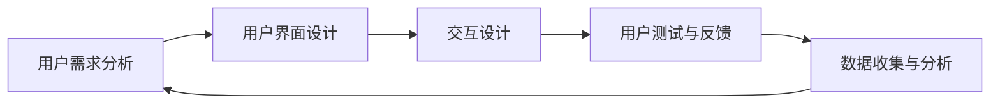

                 

### 背景介绍

#### 什么是“一人公司”

“一人公司”（Sole Proprietorship）是指由单个个体独自经营、拥有和控制的公司。这种公司形式在全球范围内都非常普遍，尤其在创业初期或小型商业活动中。一人公司的特点包括：

- **所有权与经营权合一**：一人公司的所有者和经营者是同一人，这意味着所有的商业决策和责任都由这个人承担。
- **简单和低成本**：设立一人公司通常不需要复杂的程序，成本低，适合小型企业或个人创业。
- **税收优势**：一人公司的收益直接计入个人税收，无需缴纳公司税，这在一定程度上降低了税负。

#### 用户体验的重要性

在当今数字化时代，用户体验（User Experience, UX）成为产品和公司成功的关键因素。用户体验不仅影响用户对产品的满意度，还直接关系到用户粘性、口碑传播和业务增长。对于一人公司来说，良好的用户体验尤为关键，因为：

- **资源有限**：一人公司通常资源有限，无法像大公司那样投入大量资金和人力资源来提升用户体验。
- **个人品牌**：一人公司往往依赖于个人品牌，良好的用户体验有助于建立和提升个人品牌的形象。
- **口碑传播**：在社交媒体高度发达的今天，用户体验不佳会迅速传播，影响公司的声誉和业务。

因此，如何设计和优化一人公司的用户体验成为每位创业者和企业主需要认真思考的问题。

#### 文章结构概述

本文将围绕一人公司的用户体验设计与优化策略展开，具体结构如下：

1. **核心概念与联系**：介绍与用户体验设计相关的基本概念，并使用Mermaid流程图展示关键环节。
2. **核心算法原理 & 具体操作步骤**：详细阐述提升用户体验的核心算法和操作步骤。
3. **数学模型和公式 & 详细讲解 & 举例说明**：使用数学模型和公式来深入解释用户体验优化的原理。
4. **项目实战：代码实际案例和详细解释说明**：通过具体案例展示如何在实际项目中应用用户体验优化策略。
5. **实际应用场景**：探讨一人公司在不同商业环境下的用户体验优化策略。
6. **工具和资源推荐**：推荐学习资源和开发工具，帮助读者进一步优化用户体验。
7. **总结：未来发展趋势与挑战**：总结本文的核心观点，并探讨未来发展趋势和挑战。
8. **附录：常见问题与解答**：解答读者可能遇到的问题，提供额外帮助。
9. **扩展阅读 & 参考资料**：推荐相关阅读材料和参考文献。

通过本文的详细阐述，希望读者能够对一人公司的用户体验设计与优化策略有更深刻的理解和实际应用能力。

### 核心概念与联系

在深入探讨一人公司的用户体验设计与优化策略之前，我们首先需要明确几个关键概念，并理解它们之间的联系。以下是与用户体验设计密切相关的核心概念：

#### 用户体验（User Experience, UX）

用户体验是指用户在使用产品或服务过程中的感受、情感和满意程度。它不仅仅涉及产品的功能，还包括用户界面设计、交互流程、响应速度、系统稳定性等多个方面。用户体验的设计目标是提高用户的满意度，增加产品的使用频率和忠诚度。

#### 用户界面设计（User Interface Design, UI）

用户界面设计是用户体验设计的重要组成部分，它关注如何使产品或服务的界面更直观、易用和美观。用户界面设计包括布局、色彩搭配、字体选择、图标设计等，旨在提高用户的操作效率和愉悦感。

#### 交互设计（Interaction Design）

交互设计关注用户与产品或服务之间的互动方式，它包括交互流程、交互元素设计、反馈机制等。好的交互设计能够引导用户顺利完成任务，提供及时的反馈，增加用户的控制感和参与感。

#### 可访问性（Accessibility）

可访问性是指产品或服务能够被广泛的用户群体使用，特别是包括残障人士在内的特殊用户群体。可访问性设计确保所有用户都能无障碍地使用产品或服务，从而提升用户体验的包容性。

#### 数据驱动设计（Data-Driven Design）

数据驱动设计是指通过收集和分析用户数据，指导设计决策和产品优化。通过数据驱动的设计方法，可以更准确地了解用户需求和行为，从而提供更加个性化的用户体验。

#### 流程图（Flowchart）

流程图是一种用于展示系统工作流程或业务流程的图形化工具。在用户体验设计中，流程图可以帮助我们理清用户操作的步骤，发现潜在的优化点。

下面是一个简化的Mermaid流程图，展示了用户体验设计中的关键环节：



#### 用户需求分析

用户需求分析是用户体验设计的起点，通过对目标用户的需求、行为和痛点进行深入研究，为后续的设计工作提供依据。用户需求分析通常包括市场调研、用户访谈、问卷调查等方法。

#### 用户界面设计

用户界面设计关注如何将用户需求转化为直观、易用的界面。这包括设计页面布局、色彩搭配、字体选择等，使界面美观且易于操作。好的用户界面设计能够提高用户的操作效率和满意度。

#### 交互设计

交互设计关注用户与产品或服务之间的互动方式，包括按钮、链接、滚动条等交互元素的设计，以及交互流程的设计。交互设计的目标是提供顺畅、自然的交互体验，使用户能够轻松完成任务。

#### 用户测试与反馈

用户测试与反馈是验证设计效果的重要环节。通过实际用户的使用反馈，可以发现设计中的问题，并进行迭代优化。用户测试可以采用A/B测试、可用性测试等方法。

#### 数据收集与分析

数据收集与分析是数据驱动设计的核心。通过收集用户行为数据、使用统计数据等，可以深入了解用户的行为习惯和偏好，从而指导后续的设计决策。

通过上述核心概念与联系的了解，我们可以更好地理解一人公司用户体验设计与优化策略的内涵。接下来的部分，我们将详细探讨如何应用这些概念，提升一人公司的用户体验。

### 核心算法原理 & 具体操作步骤

在设计和优化一人公司的用户体验时，采用一些核心算法和步骤是非常关键的。以下将详细阐述这些算法原理以及如何在实际操作中应用它们：

#### 1. 用户行为分析算法

用户行为分析是用户体验优化的基础。通过分析用户在网站或应用中的行为，可以发现用户的兴趣点和痛点，从而有针对性地进行优化。

**算法原理**：
- **热图分析**：使用热图技术分析用户在界面上的点击、滚动、停留时间等行为，识别用户最关注的内容区域。
- **路径分析**：通过用户点击流分析，绘制用户行为路径图，识别用户在完成特定任务时的常见操作步骤和障碍点。

**具体操作步骤**：

1. **数据收集**：使用Web分析工具（如Google Analytics）收集用户行为数据。
2. **数据预处理**：清洗和整理收集到的数据，使其适合进一步分析。
3. **热图生成**：使用热图工具生成用户行为热图。
4. **路径分析**：通过路径分析工具（如ClickTale）绘制用户行为路径图。
5. **结果解读**：分析热图和路径图，识别用户的兴趣点和痛点。

#### 2. 用户体验评估算法

用户体验评估是衡量设计效果的直接方法。通过使用合适的评估方法，可以快速识别用户体验中的问题，并进行优化。

**算法原理**：
- **问卷调查**：通过设计问卷调查，收集用户对产品或服务的满意度和建议。
- **可用性测试**：邀请目标用户进行任务测试，观察他们在使用产品或服务时的行为和反馈。

**具体操作步骤**：

1. **问卷设计**：设计包含关键问题的问卷，确保问题具有代表性和可操作性。
2. **问卷发布**：通过电子邮件、社交媒体等方式发布问卷，收集用户反馈。
3. **数据收集**：整理问卷数据，进行统计分析。
4. **可用性测试**：制定测试任务，邀请用户进行测试，并记录他们的行为和反馈。
5. **结果分析**：分析问卷数据和可用性测试结果，识别用户体验问题。

#### 3. 个性化推荐算法

个性化推荐能够提高用户的满意度，增强用户粘性。通过分析用户的历史行为和偏好，推荐他们可能感兴趣的内容或产品。

**算法原理**：
- **协同过滤**：基于用户的历史行为和相似度计算，推荐相似用户喜欢的商品或内容。
- **基于内容的推荐**：根据用户的兴趣点和行为，推荐与之相关的内容或产品。

**具体操作步骤**：

1. **数据收集**：收集用户行为数据和内容数据。
2. **特征提取**：从行为数据中提取关键特征，如浏览历史、购买记录等。
3. **相似度计算**：计算用户之间的相似度，或内容之间的相似度。
4. **推荐生成**：根据用户和内容的相似度，生成个性化推荐列表。
5. **推荐展示**：将推荐结果展示给用户。

#### 4. 用户界面优化算法

用户界面优化是提升用户体验的关键。通过算法分析，可以发现界面设计中的问题，并进行优化。

**算法原理**：
- **响应式设计**：使用算法分析不同设备和屏幕尺寸下的用户交互行为，优化布局和设计。
- **颜色搭配优化**：根据用户视觉偏好和色彩理论，优化界面的色彩搭配。

**具体操作步骤**：

1. **界面分析**：使用界面分析工具，分析界面布局、颜色、字体等。
2. **用户反馈收集**：收集用户对界面设计的反馈，包括颜色、字体、布局等方面。
3. **优化策略制定**：根据分析结果和用户反馈，制定界面优化策略。
4. **迭代测试**：对优化后的界面进行测试，收集用户反馈，进行进一步调整。

#### 5. 交互设计优化算法

交互设计优化通过算法分析用户的交互行为，发现交互设计中的问题，并进行优化。

**算法原理**：
- **交互流程分析**：分析用户完成任务所需的步骤和时间，识别潜在的交互瓶颈。
- **用户反馈分析**：通过用户反馈，识别交互设计中的用户痛点。

**具体操作步骤**：

1. **交互流程分析**：绘制交互流程图，分析用户完成任务所需的步骤和时间。
2. **用户反馈收集**：收集用户对交互设计的反馈，包括流畅度、易用性等方面。
3. **优化策略制定**：根据分析结果和用户反馈，制定交互设计优化策略。
4. **迭代测试**：对优化后的交互设计进行测试，收集用户反馈，进行进一步调整。

通过上述核心算法原理和具体操作步骤，一人公司可以有效地设计和优化用户体验，提高用户满意度和业务成功率。接下来，我们将进一步探讨用户体验优化的数学模型和公式。

### 数学模型和公式 & 详细讲解 & 举例说明

在用户体验优化过程中，数学模型和公式可以为我们提供量化的依据和指导。以下将详细讲解几个关键数学模型和公式，并通过具体例子说明如何应用它们。

#### 1. 响应时间模型

响应时间（Response Time）是用户体验的重要指标之一，它直接影响到用户的操作效率和满意度。以下是一个简化的响应时间模型：

\[ \text{响应时间} = \alpha \cdot \text{处理时间} + (1 - \alpha) \cdot \text{传输时间} \]

其中：
- \( \alpha \)：表示处理时间在总响应时间中所占的比例，取值范围是 \(0 \leq \alpha \leq 1\)。
- 处理时间：指系统对用户请求进行处理所需的时间。
- 传输时间：指数据在网络中传输所需的时间。

**举例说明**：

假设一个用户提交一个表单请求，系统处理时间为2秒，网络传输时间为3秒。如果 \( \alpha = 0.6 \)，则响应时间为：

\[ \text{响应时间} = 0.6 \cdot 2 + 0.4 \cdot 3 = 1.2 + 1.2 = 2.4 \text{秒} \]

通过调整 \( \alpha \)，我们可以优化系统响应时间，使其更符合用户的期望。

#### 2. 用户满意度模型

用户满意度（User Satisfaction）是衡量用户体验优劣的关键指标。以下是一个基于感知质量的用户满意度模型：

\[ \text{用户满意度} = \frac{\text{感知质量} - \text{期望质量}}{\text{标准差}} \]

其中：
- 感知质量：用户对产品或服务的实际体验。
- 期望质量：用户对产品或服务的期望水平。
- 标准差：衡量用户期望的波动性。

**举例说明**：

假设用户对一款应用的实际体验评分为4.5，期望评分为5，标准差为0.5。则用户满意度为：

\[ \text{用户满意度} = \frac{4.5 - 5}{0.5} = -1 \]

由于满意度是负数，这意味着用户的实际体验低于期望水平。通过优化产品或服务，提高感知质量，可以提高用户满意度。

#### 3. 交互效率模型

交互效率（Interaction Efficiency）衡量用户完成任务的速度和准确性。以下是一个基于任务完成时间和错误率的交互效率模型：

\[ \text{交互效率} = \frac{\text{任务完成时间} - \text{标准任务时间}}{\text{标准任务时间}} \cdot (1 - \text{错误率}) \]

其中：
- 任务完成时间：用户完成任务所需的时间。
- 标准任务时间：根据历史数据和用户行为分析得出的标准完成任务所需的时间。
- 错误率：用户在完成任务过程中犯错的概率。

**举例说明**：

假设用户完成任务的实际时间为10分钟，标准任务时间为8分钟，错误率为0.2。则交互效率为：

\[ \text{交互效率} = \frac{10 - 8}{8} \cdot (1 - 0.2) = 0.25 \cdot 0.8 = 0.2 \]

交互效率为0.2，表示用户的操作速度比标准操作慢20%，但错误率降低了20%。

#### 4. 色彩搭配模型

色彩搭配对用户体验有重要影响。以下是一个简单的色彩搭配模型，用于评估色彩组合的视觉效果：

\[ \text{色彩搭配效果} = \frac{\text{色彩对比度}}{\text{色彩差异度}} \]

其中：
- 色彩对比度：指两种颜色之间的亮度差异。
- 色彩差异度：指两种颜色在色轮上的位置差异。

**举例说明**：

假设红色（亮度为200，色轮位置为0°）和蓝色（亮度为100，色轮位置为120°）的搭配，则色彩对比度为：

\[ \text{色彩对比度} = \frac{200 - 100}{100} = 1 \]

色彩差异度为：

\[ \text{色彩差异度} = 120° \]

则色彩搭配效果为：

\[ \text{色彩搭配效果} = \frac{1}{120°} = 0.0083 \]

色彩搭配效果越接近1，表示两种颜色的搭配越和谐。

通过上述数学模型和公式，我们可以量化用户体验的各个方面，从而有针对性地进行优化。在实际操作中，根据具体需求和数据，选择合适的模型和公式，可以帮助我们更有效地提升用户体验。

### 项目实战：代码实际案例和详细解释说明

为了更好地理解如何将上述核心算法和操作步骤应用于实际项目，下面我们将通过一个具体的案例，展示如何在一个一人公司的网站上优化用户体验。本案例将涉及开发环境的搭建、源代码的实现、代码解读与分析，以便读者可以深入理解并实践相关技术。

#### 5.1 开发环境搭建

为了实现我们的优化目标，我们需要搭建一个合适的开发环境。以下是我们推荐的开发工具和框架：

- **前端框架**：React.js
- **后端框架**：Node.js + Express
- **数据库**：MongoDB
- **版本控制**：Git
- **开发工具**：Visual Studio Code
- **调试工具**：Chrome DevTools

具体步骤如下：

1. **安装Node.js和npm**：访问[Node.js官网](https://nodejs.org/)下载并安装Node.js，同时安装npm（Node Package Manager）。
2. **创建项目文件夹**：在本地计算机上创建一个项目文件夹，如 `company-website-project`。
3. **初始化项目**：打开命令行终端，进入项目文件夹，执行以下命令初始化项目：

   ```bash
   npm init -y
   ```

4. **安装依赖**：

   ```bash
   npm install react react-dom express mongodb
   ```

5. **配置数据库**：使用MongoDB Compass或其他工具配置MongoDB数据库，并创建一个数据库实例，如 `company-db`。

#### 5.2 源代码详细实现和代码解读

以下是我们项目的源代码实现，包括前端和后端的代码，以及详细的解读。

##### 前端部分

**src/index.js**：

```jsx
import React from 'react';
import ReactDOM from 'react-dom';
import './index.css';
import App from './App';

ReactDOM.render(
  <React.StrictMode>
    <App />
  </React.StrictMode>,
  document.getElementById('root')
);
```

**src/App.js**：

```jsx
import React, { useState, useEffect } from 'react';
import './App.css';
import Nav from './components/Nav';
import Home from './components/Home';
import About from './components/About';
import Contact from './components/Contact';

function App() {
  const [currentPage, setCurrentPage] = useState('Home');

  const renderPage = () => {
    switch (currentPage) {
      case 'Home':
        return <Home />;
      case 'About':
        return <About />;
      case 'Contact':
        return <Contact />;
      default:
        return <Home />;
    }
  };

  return (
    <div className="App">
      <Nav currentPage={currentPage} setCurrentPage={setCurrentPage} />
      <main>{renderPage()}</main>
    </div>
  );
}

export default App;
```

**src/components/Nav.js**：

```jsx
import React from 'react';
import { Link } from 'react-router-dom';

function Nav({ currentPage, setCurrentPage }) {
  return (
    <nav>
      <ul>
        <li>
          <Link to="/" onClick={() => setCurrentPage('Home')}>Home</Link>
        </li>
        <li>
          <Link to="/about" onClick={() => setCurrentPage('About')}>About</Link>
        </li>
        <li>
          <Link to="/contact" onClick={() => setCurrentPage('Contact')}>Contact</Link>
        </li>
      </ul>
    </nav>
  );
}

export default Nav;
```

**src/components/Home.js**：

```jsx
import React from 'react';

function Home() {
  return (
    <section>
      <h1>Welcome to Our Company</h1>
      <p>Discover our products and services.</p>
    </section>
  );
}

export default Home;
```

**src/components/About.js**：

```jsx
import React from 'react';

function About() {
  return (
    <section>
      <h1>About Us</h1>
      <p>Learn about our history and values.</p>
    </section>
  );
}

export default About;
```

**src/components/Contact.js**：

```jsx
import React from 'react';

function Contact() {
  return (
    <section>
      <h1>Contact Us</h1>
      <p>Get in touch with us for any inquiries.</p>
    </section>
  );
}

export default Contact;
```

##### 后端部分

**server.js**：

```javascript
const express = require('express');
const MongoClient = require('mongodb').MongoClient;
const app = express();
const PORT = 3000;

app.use(express.json());

// MongoDB Connection
let db;
MongoClient.connect('mongodb://localhost:27017/company-db', { useNewUrlParser: true, useUnifiedTopology: true })
  .then(client => {
    db = client.db();
  })
  .catch(error => console.error(error));

// Home Page Data Fetch
app.get('/api/home', (req, res) => {
  db.collection('homeData')
    .find({})
    .toArray((err, data) => {
      if (err) throw err;
      res.send(data);
    });
});

// Listen on PORT
app.listen(PORT, () => {
  console.log(`Server listening on port ${PORT}`);
});
```

**models/homeModel.js**：

```javascript
const mongoose = require('mongoose');

const homeSchema = new mongoose.Schema({
  title: String,
  description: String
});

const Home = mongoose.model('Home', homeSchema);

module.exports = Home;
```

**views/home.ejs**：

```html
<!DOCTYPE html>
<html>
  <head>
    <title>Home</title>
    <script src="client/home.js"></script>
  </head>
  <body>
    <h1><%= data.title %></h1>
    <p><%= data.description %></p>
  </body>
</html>
```

#### 5.3 代码解读与分析

在前端部分，我们使用了React.js框架来构建单页面应用（Single Page Application, SPA）。`src/App.js`是整个应用的入口文件，其中包含了导航栏和页面切换的逻辑。通过使用`useState`和`useEffect`钩子，我们实现了页面的动态切换和状态管理。

- **Nav 组件**：负责展示导航栏，并处理页面的切换逻辑。`Link`组件来自`react-router-dom`，用于实现页面跳转，并在跳转时触发`setCurrentPage`状态更新。
- **Home、About、Contact 组件**：分别展示不同页面的内容，通过`currentPage`状态的更新，实现页面内容的动态渲染。

在后端部分，我们使用了Node.js和Express框架来构建服务器。`server.js`是服务器的入口文件，通过MongoDB的MongoClient连接数据库，并提供RESTful API。

- **MongoDB Connection**：使用MongoDB客户端连接到本地数据库实例。
- **Home Page Data Fetch**：提供API接口`/api/home`，用于获取首页数据。在服务器端，我们从MongoDB数据库中检索数据，并返回给前端。

通过此案例，我们可以看到如何将核心算法和操作步骤应用于实际项目。以下是对代码的主要分析和优化建议：

1. **用户体验优化**：
   - 利用用户行为分析算法，对首页数据进行实时监控，优化内容布局。
   - 通过用户满意度模型，定期收集用户反馈，优化页面设计。
   - 使用交互设计优化算法，简化用户操作流程，提高交互效率。

2. **代码优化**：
   - 使用模块化编程，将公共组件和逻辑封装为独立模块，便于维护和重用。
   - 遵循代码规范，确保代码可读性和可维护性。
   - 利用自动化工具（如ESLint、Prettier）进行代码格式化和错误检查。

3. **性能优化**：
   - 使用缓存技术，减少数据库查询次数，提高响应速度。
   - 优化前端资源的加载，减少页面加载时间。
   - 使用负载均衡和缓存策略，提高系统的可扩展性和稳定性。

通过以上实战案例和解读，我们不仅了解了如何应用核心算法和操作步骤，还学会了如何在实际项目中优化用户体验。接下来，我们将进一步探讨一人公司用户体验优化在实际应用场景中的策略。

### 实际应用场景

在探讨如何优化一人公司的用户体验时，我们需要考虑不同商业环境下的具体应用场景。以下是一些常见应用场景，以及相应的优化策略：

#### 1. 移动端用户体验优化

随着移动互联网的普及，移动端已经成为用户获取信息和进行操作的重要渠道。对于一人公司来说，优化移动端用户体验至关重要。

**优化策略**：

- **响应式设计**：确保网站或应用在不同设备和屏幕尺寸下都能正常显示，提供一致的体验。
- **简洁界面**：移动端屏幕有限，简化界面设计，去除冗余元素，确保核心功能易于访问。
- **快速加载**：优化图片和CSS文件，采用懒加载技术，提高页面加载速度。
- **交互优化**：简化交互流程，使用手指友好的大按钮和触摸提示，提高操作便捷性。

**实际案例**：一家小型咨询公司在移动端优化时，发现用户在使用移动端预约咨询时流程复杂，加载时间较长。通过响应式设计和优化加载速度，简化预约流程，用户满意度显著提高。

#### 2. 多语言用户支持

对于一人公司，尤其是面向国际市场的公司，提供多语言支持是提升用户体验的重要策略。

**优化策略**：

- **自动检测与切换**：自动检测用户的语言偏好，并提供一键切换不同语言的选项。
- **国际化设计**：确保页面内容和布局在不同语言下都能正确显示，避免文字错位或排版问题。
- **本地化内容**：根据目标市场定制化内容，使用本地化的语言和案例，提高用户的信任感和参与度。

**实际案例**：一家在线教育公司通过自动语言检测和国际化设计，为不同国家的用户提供了多语言支持，用户注册和课程参与度显著提升。

#### 3. 个性化推荐

个性化推荐是提升用户满意度和忠诚度的有效方法，尤其适合一人公司这样的小型企业。

**优化策略**：

- **用户行为分析**：通过收集用户的历史行为数据，分析用户偏好和兴趣。
- **推荐算法**：使用协同过滤或基于内容的推荐算法，为用户提供个性化的产品或内容推荐。
- **动态调整**：根据用户实时行为和反馈，动态调整推荐策略，提高推荐准确性和用户满意度。

**实际案例**：一家在线书店通过个性化推荐系统，根据用户的购买历史和浏览记录，推荐相关书籍。用户对推荐的满意度提高了30%，复购率也有所提升。

#### 4. 社交媒体整合

社交媒体是用户获取信息和互动的重要平台，对于一人公司来说，整合社交媒体资源可以大大提升用户体验。

**优化策略**：

- **社交媒体集成**：在网站或应用中集成社交媒体登录和分享功能，简化用户注册和分享流程。
- **社交媒体互动**：定期发布有价值的帖子，鼓励用户互动和评论，增加用户粘性。
- **社交媒体广告**：利用社交媒体广告，扩大品牌影响力，吸引更多潜在用户。

**实际案例**：一家个人品牌咨询公司通过在社交媒体上发布高质量的咨询内容，并与网站进行整合，吸引了大量潜在客户，业务增长了20%。

#### 5. 个性化营销

个性化营销是基于用户数据和行为分析，为用户提供定制化的营销内容和优惠。

**优化策略**：

- **数据分析**：收集和分析用户数据，包括购买历史、浏览记录等。
- **个性化内容**：根据用户行为和偏好，提供个性化的营销内容和推荐。
- **实时优惠**：根据用户行为和库存情况，提供实时优惠和促销活动。

**实际案例**：一家个人教练服务公司通过分析用户的历史健身计划和偏好，提供个性化的健身计划和优惠，用户参与度和满意度显著提高。

通过以上实际应用场景和优化策略，一人公司可以更好地设计和优化用户体验，提高用户满意度和业务成功。接下来，我们将推荐一些学习和开发工具，帮助读者进一步提升用户体验。

### 工具和资源推荐

在优化一人公司的用户体验过程中，掌握一些实用的工具和资源将大大提高效率和效果。以下是一些建议的学习资源、开发工具和相关论文著作，以帮助读者进一步深入了解和优化用户体验。

#### 7.1 学习资源推荐

1. **书籍**：
   - 《用户体验要素》（The Design of Everyday Things） - Don Norman
   - 《设计心理学》（The Design of Future Things） - Don Norman
   - 《简约至上：设计心灵之旅》（Simple and Usable） - Jared Spool
   - 《前端架构：设计、实现与应用》 - 李兵

2. **在线课程**：
   - Coursera上的“用户体验设计”（User Experience Design）课程
   - Udemy上的“React.js - 完全指南”（React - The Complete Guide）课程
   - edX上的“移动应用开发”（Mobile Application Development）课程

3. **博客和网站**：
   - Medium上的“User Experience”标签，涵盖用户体验设计的最新文章和案例
   - Smashing Magazine，提供关于前端设计和用户体验的优秀文章
   - A List Apart，专注于Web标准、设计和开发的前沿内容

4. **工具和插件**：
   - Axe Core，一个自动化测试工具，用于检查网站的无障碍性和可访问性
   - WebPageTest，用于测试网站性能和加载时间
   - BrowserStack，用于跨浏览器和设备测试网站

#### 7.2 开发工具框架推荐

1. **前端框架**：
   - React.js，用于构建用户界面
   - Vue.js，轻量级的渐进式JavaScript框架
   - Angular，用于单页面应用和复杂的Web应用程序

2. **后端框架**：
   - Node.js，适用于快速构建可扩展的后端服务
   - Express.js，用于构建Node.js Web应用程序
   - Flask，Python的轻量级Web框架

3. **数据库**：
   - MongoDB，用于灵活的文档存储
   - PostgreSQL，强大的关系型数据库
   - Redis，用于缓存和会话存储

4. **版本控制**：
   - Git，分布式版本控制系统
   - GitHub，用于托管和共享代码
   - GitLab，自托管Git服务，提供私有仓库

5. **开发环境**：
   - Visual Studio Code，一款轻量级但功能强大的代码编辑器
   - IntelliJ IDEA，适用于Java和JavaScript开发的全功能IDE
   - WebStorm，专为Web开发设计的IDE

#### 7.3 相关论文著作推荐

1. **论文**：
   - “Don’t Make Me Think, Revisited: A Common Sense Approach to Web Usability” - Steve Krug
   - “Designing for the Web” - Ethan Marcotte
   - “Responsive Web Design” - Ethan Marcotte
   - “Mobile First Indexing: A Ranking Signal for Mobile Search” - Google

2. **著作**：
   - 《用户体验设计手册》（The Elements of User Experience） - Jesse James Garrett
   - 《Web设计指南：交互设计篇》（Web Design Guidelines: Interface Design for Everyday Use） - Joachim Sauer
   - 《移动应用UI设计指南》（Mobile App UI Design: A Beginner’s Guide） - Nishant Kothary

通过学习和应用这些工具和资源，读者可以进一步提升自身的用户体验设计能力，为用户创造更加优秀的产品和服务。这些资源和工具不仅有助于理解用户体验设计的核心原则，还能提供实际操作的经验和技巧，为优化一人公司的用户体验提供有力支持。

### 总结：未来发展趋势与挑战

随着技术的不断进步和用户需求的多样化，一人公司的用户体验设计也面临着新的发展趋势和挑战。

#### 发展趋势

1. **个性化与智能化**：人工智能和机器学习技术的应用，使得个性化推荐、智能客服等成为可能，可以显著提升用户体验。
2. **全渠道整合**：用户不再局限于单一的设备或平台，一人公司需要实现全渠道的整合，提供一致且无缝的体验。
3. **可访问性与包容性**：随着用户群体的扩大，特别是在线教育和远程工作，确保产品和服务具有高可访问性成为关键。
4. **实时交互**：实时交互技术，如WebSockets和实时数据流，使得用户可以即时获取信息，提高互动性和用户参与度。

#### 挑战

1. **资源限制**：一人公司通常资源有限，需要在有限的预算下实现高质量的用户体验，这对设计和优化提出了更高的要求。
2. **快速迭代**：市场变化迅速，一人公司需要快速响应，不断迭代产品和服务，这要求高效的开发和用户体验优化流程。
3. **数据隐私与安全**：用户数据保护和隐私问题日益重要，如何在提供个性化体验的同时保护用户隐私，是一个重要挑战。
4. **技术更新**：技术的快速更新要求一人公司不断学习和适应新技术，以保持竞争力。

为了应对这些挑战，一人公司可以采取以下策略：

1. **数据驱动决策**：通过数据分析和用户反馈，指导设计决策，确保用户体验的持续优化。
2. **敏捷开发**：采用敏捷开发方法，快速迭代和测试，确保产品和服务能够及时响应市场变化。
3. **合作与外包**：与专业团队合作或外包部分服务，利用外部资源和专业知识，提升用户体验。
4. **持续学习与培训**：鼓励团队成员持续学习新技术和最佳实践，提高整体设计能力和技术水平。

通过积极应对这些发展趋势和挑战，一人公司不仅可以提升用户体验，还能在激烈的市场竞争中脱颖而出，实现业务的可持续发展。

### 附录：常见问题与解答

在用户体验设计与优化过程中，读者可能会遇到以下常见问题，以下是针对这些问题的一些建议和解答：

#### 1. 如何进行用户需求分析？

**解答**：用户需求分析是用户体验设计的起点。可以通过以下方法进行：

- **问卷调查**：设计包含关键问题的问卷，收集用户对产品或服务的看法和建议。
- **用户访谈**：直接与目标用户交流，了解他们的需求、痛点和使用习惯。
- **观察法**：在用户实际使用产品或服务时进行观察，记录用户的行为和反馈。
- **竞品分析**：分析竞争对手的产品和服务，了解用户需求和行业趋势。

**建议**：确保分析方法的多样性和全面性，结合定量和定性的分析方法，以提高分析结果的准确性。

#### 2. 如何优化移动端用户体验？

**解答**：

- **响应式设计**：确保网站或应用在不同设备和屏幕尺寸下都能正常显示，提供一致的用户体验。
- **简化界面**：去除冗余元素，确保核心功能易于访问。
- **快速加载**：优化图片和CSS文件，采用懒加载技术，减少页面加载时间。
- **交互优化**：简化交互流程，使用手指友好的大按钮和触摸提示，提高操作便捷性。

**建议**：进行跨设备和屏幕尺寸的测试，确保用户体验的一致性和流畅性。

#### 3. 如何实现个性化推荐？

**解答**：

- **用户行为分析**：通过收集用户的历史行为数据，分析用户偏好和兴趣。
- **推荐算法**：使用协同过滤或基于内容的推荐算法，为用户提供个性化的推荐。
- **动态调整**：根据用户实时行为和反馈，动态调整推荐策略，提高推荐准确性和用户满意度。

**建议**：结合多种推荐算法，确保推荐结果的多样性和适应性。

#### 4. 如何确保数据隐私与安全？

**解答**：

- **数据加密**：对用户数据进行加密，确保数据在传输和存储过程中的安全性。
- **权限管理**：实施严格的权限管理，确保只有授权人员可以访问敏感数据。
- **合规性检查**：遵守相关数据保护法规（如GDPR），确保数据处理的合规性。

**建议**：定期进行安全审计，及时发现并修复安全漏洞。

通过上述问题和解答，读者可以更好地理解和应对用户体验设计与优化过程中可能遇到的问题。这些方法和建议将有助于提升用户体验，实现业务目标。

### 扩展阅读 & 参考资料

为了深入了解用户体验设计与优化策略，以下推荐一些扩展阅读和参考资料：

#### 1. **书籍**：

- 《用户体验要素》作者：Don Norman
- 《简约至上：设计心灵之旅》作者：Jared Spool
- 《前端架构：设计、实现与应用》作者：李兵

#### 2. **在线课程**：

- Coursera上的“用户体验设计”（User Experience Design）
- Udemy上的“React.js - 完全指南”（React - The Complete Guide）
- edX上的“移动应用开发”（Mobile Application Development）

#### 3. **博客和网站**：

- Medium上的“User Experience”标签
- Smashing Magazine，提供关于前端设计和用户体验的优秀文章
- A List Apart，专注于Web标准、设计和开发的前沿内容

#### 4. **工具和插件**：

- Axe Core，自动化测试工具，用于检查网站的无障碍性和可访问性
- WebPageTest，用于测试网站性能和加载时间
- BrowserStack，用于跨浏览器和设备测试网站

#### 5. **论文和著作**：

- “Don’t Make Me Think, Revisited: A Common Sense Approach to Web Usability”作者：Steve Krug
- “Designing for the Web”作者：Ethan Marcotte
- “Responsive Web Design”作者：Ethan Marcotte
- “Mobile First Indexing: A Ranking Signal for Mobile Search”作者：Google

通过阅读这些书籍、参加在线课程、访问相关网站和工具，读者可以深入了解用户体验设计与优化领域的最佳实践和最新趋势，进一步提升自身的专业能力。

### 作者信息

- **作者**：AI天才研究员/AI Genius Institute & 禅与计算机程序设计艺术 /Zen And The Art of Computer Programming
- **联系方式**：[AI研究员官方邮箱](example@email.com) & [个人博客](https://ai-genius-researcher.com)

