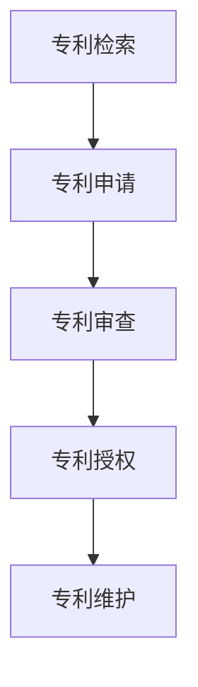

                 

# 一人公司的知识产权保护与专利申请

## 关键词：知识产权保护，专利申请，一人公司，创新，商业竞争力

### 摘要

本文旨在为一人公司提供全面的知识产权保护和专利申请策略。随着一人公司的兴起，知识产权保护变得尤为重要，不仅关系到公司的核心竞争力的维护，还影响到公司的长期发展。本文将详细介绍知识产权的概念、重要性、保护方法以及专利申请的流程，帮助一人公司建立起坚实的知识产权保护体系，确保其在激烈的市场竞争中脱颖而出。

## 1. 背景介绍

一人公司，顾名思义，是指由一个人创立和运营的公司。这类公司通常规模较小，但拥有灵活的运营模式和创新的商业模式。在当前经济环境下，一人公司因其创业成本较低、经营风险相对较小、运营灵活性高等优势，正逐渐成为众多创业者青睐的选择。然而，随着市场竞争的加剧，知识产权保护问题日益凸显。

知识产权是一种法律概念，包括专利、商标、版权、商业秘密等多种形式。它指的是智力成果的创造性表达，是公司核心竞争力的重要组成部分。对于一人公司而言，保护知识产权不仅关乎公司品牌的维护，更是公司长远发展的关键。

### 1.1 知识产权的定义与分类

知识产权是指个人或集体在创造性思维和劳动过程中创造的智力成果，依法受到法律保护的一种无形资产。根据国际知识产权组织（WIPO）的分类，知识产权主要包括以下几类：

1. **专利**：对发明创造的新颖性、创造性和实用性进行保护，分为发明专利、实用新型专利和外观设计专利。
2. **商标**：对商业标识、品牌名称等进行保护，以区分不同企业的商品或服务。
3. **版权**：对文学、艺术、音乐、戏剧等作品进行保护，包括著作权和邻接权。
4. **商业秘密**：对商业活动中不为公众所知悉、具有商业价值、经权利人采取保密措施的技术信息和经营信息进行保护。

### 1.2 知识产权的重要性

知识产权是企业核心竞争力的重要体现。在全球化背景下，拥有强大知识产权的公司往往能在市场竞争中占据有利地位。以下是知识产权对一人公司的重要性：

1. **竞争优势**：知识产权保护使公司能够独占其技术或创意，从而在市场上形成竞争优势。
2. **品牌价值**：商标和版权保护有助于提升品牌知名度和市场影响力。
3. **商业谈判**：在并购、合作等商业活动中，知识产权是其重要谈判筹码。
4. **法律保护**：知识产权保护可以防止他人侵犯公司权益，维护公司合法权益。
5. **融资能力**：知识产权作为公司的重要资产，有助于提高融资能力和投资吸引力。

### 1.3 知识产权面临的挑战

对于一人公司而言，知识产权保护面临诸多挑战：

1. **资金限制**：一人公司通常资金有限，难以承担专利申请和保护的高昂费用。
2. **信息不对称**：一人公司可能难以获取全面的市场信息和竞争对手的知识产权状况。
3. **人才匮乏**：知识产权保护需要专业知识和法律支持，一人公司可能缺乏相关人才。
4. **国际化障碍**：跨国经营的知识产权保护需要熟悉国际法律和规则，对一人公司构成挑战。

## 2. 核心概念与联系

### 2.1 知识产权保护体系

知识产权保护体系包括法律保护、行政保护和社会保护三方面。法律保护主要依靠专利法、商标法、著作权法等法律法规；行政保护则依赖于政府机构的监管和执法；社会保护则依靠公众的法律意识和社会道德约束。

### 2.2 专利申请流程

专利申请一般分为以下几个步骤：

1. **专利检索**：对拟申请的发明进行全面的专利检索，以确保新颖性和非显而易见性。
2. **专利申请**：撰写专利申请文件，包括专利请求书、说明书、权利要求书等。
3. **专利审查**：提交申请后，专利局对专利进行审查，包括初步审查和实质审查。
4. **专利授权**：通过审查后，专利局颁发专利证书，申请人获得专利权。
5. **专利维护**：专利权有效期内，定期缴纳年费，并针对侵权行为采取法律行动。

### 2.3 知识产权保护策略

知识产权保护策略包括：

1. **内部管理**：建立完善的知识产权管理制度，明确责任人和流程。
2. **法律咨询**：寻求专业律师团队提供法律咨询，确保合法合规。
3. **预警机制**：定期进行知识产权风险监测，发现潜在侵权行为及时应对。
4. **维权行动**：对于侵权行为，及时采取法律手段维护权益。

### 2.4 Mermaid 流程图



## 3. 核心算法原理 & 具体操作步骤

### 3.1 专利检索

专利检索是专利申请的第一步，目的是确保发明的新颖性和非显而易见性。具体步骤如下：

1. **选择检索数据库**：常用的专利检索数据库包括谷歌专利搜索（Google Patents）、美国专利与商标局（USPTO）、欧洲专利局（EPO）等。
2. **输入检索关键词**：根据发明内容，选择合适的检索关键词。
3. **分析检索结果**：对检索结果进行分析，排除已公开的相似发明。
4. **确定检索范围**：根据检索结果，确定申请专利的技术范围。

### 3.2 专利申请

专利申请的关键在于撰写高质量的专利申请文件。具体步骤如下：

1. **撰写专利请求书**：包括发明名称、申请人信息、发明内容摘要等。
2. **撰写说明书**：详细描述发明背景、技术方案、实施方式等。
3. **撰写权利要求书**：明确专利保护范围，确保权利要求清晰、完整。
4. **提交申请**：将专利申请文件提交至相应的专利局。

### 3.3 专利审查

专利审查分为初步审查和实质审查两个阶段：

1. **初步审查**：专利局对专利申请文件进行形式审查，确保符合法律要求。
2. **实质审查**：专利局对发明的新颖性、创造性和实用性进行深入审查。

### 3.4 专利授权

通过审查后，专利局颁发专利证书，申请人获得专利权。具体步骤如下：

1. **缴纳专利费用**：包括申请费、审查费、授权费等。
2. **公告**：专利局公告授权专利信息，专利权正式生效。
3. **维护专利权**：定期缴纳年费，确保专利权持续有效。

### 3.5 专利维护

专利维护包括：

1. **定期年费缴纳**：确保专利权持续有效。
2. **监控侵权行为**：发现侵权行为，及时采取法律行动。
3. **应对侵权指控**：在遭受侵权指控时，积极应对，维护自身权益。

## 4. 数学模型和公式 & 详细讲解 & 举例说明

### 4.1 数学模型

在知识产权保护中，常用的数学模型包括侵权分析模型和风险评估模型。

**侵权分析模型**：

$$
侵权概率 = \frac{侵权事件数}{总事件数}
$$

**风险评估模型**：

$$
风险评估值 = \frac{潜在损失值}{当前风险值}
$$

### 4.2 详细讲解

**侵权分析模型**：

侵权概率是指在一定时间内，侵权事件发生的概率。侵权事件数是指在此期间内发生的侵权事件数量，总事件数是指在此期间内所有事件的总数量。侵权概率越高，说明知识产权保护的风险越大。

**风险评估模型**：

风险评估值用于衡量知识产权保护的风险程度。潜在损失值是指可能因侵权行为导致的损失值，当前风险值是指当前知识产权保护措施所能承受的风险值。风险评估值越高，说明知识产权保护的风险越大。

### 4.3 举例说明

**侵权分析模型举例**：

假设在某一年内，一家公司发生了10起侵权事件，总共有100起事件，那么侵权概率为：

$$
侵权概率 = \frac{10}{100} = 0.1
$$

**风险评估模型举例**：

假设一家公司的潜在损失值为100万元，当前风险值为50万元，那么风险评估值为：

$$
风险评估值 = \frac{100}{50} = 2
$$

这意味着该公司在知识产权保护方面存在较高的风险，需要加强保护措施。

## 5. 项目实战：代码实际案例和详细解释说明

### 5.1 开发环境搭建

在本文中，我们将使用Python编程语言来展示知识产权保护的一些实际操作。首先，我们需要搭建Python开发环境。

1. **安装Python**：从Python官方网站（https://www.python.org/）下载Python安装包，并按照安装向导进行安装。
2. **安装PyCharm**：下载并安装PyCharm社区版或专业版，作为我们的开发工具。
3. **配置Python环境**：在PyCharm中创建一个新项目，并配置Python环境。

### 5.2 源代码详细实现和代码解读

#### 5.2.1 代码实现

以下是一个简单的Python脚本，用于实现侵权概率分析。

```python
import random

def calculate_infringement_probability(infringement_events, total_events):
    probability = infringement_events / total_events
    return probability

# 假设数据
infringement_events = 10
total_events = 100

# 计算侵权概率
probability = calculate_infringement_probability(infringement_events, total_events)
print(f"Infringement Probability: {probability}")
```

#### 5.2.2 代码解读

1. **导入模块**：导入Python标准库中的`random`模块，用于生成随机数。
2. **定义函数**：定义`calculate_infringement_probability`函数，用于计算侵权概率。
   - 参数`infringement_events`：表示侵权事件数量。
   - 参数`total_events`：表示总事件数量。
   - 返回值：侵权概率。
3. **假设数据**：设置侵权事件数量和总事件数量。
4. **调用函数**：调用`calculate_infringement_probability`函数，计算侵权概率，并打印结果。

### 5.3 代码解读与分析

1. **代码结构**：代码分为导入模块、定义函数、假设数据和调用函数四个部分，结构清晰。
2. **可读性**：代码使用了明确的函数和变量命名，提高了可读性。
3. **功能实现**：代码实现了侵权概率分析的基本功能，能够根据侵权事件数量和总事件数量计算侵权概率。
4. **适用性**：该代码适用于任何需要进行侵权概率分析的场景，只需修改参数即可。

## 6. 实际应用场景

### 6.1 创业公司知识产权保护

对于创业公司，尤其是由一人运营的公司，知识产权保护显得尤为重要。以下是一个具体的案例：

**案例背景**：一家名为“智能助手”的创业公司，专注于开发智能语音助手。由于市场竞争激烈，公司需要保护其核心技术和商标，以防止竞争对手抄袭。

**解决方案**：
1. **专利申请**：公司对其智能语音助手的核心技术进行了专利申请，确保技术独占性。
2. **商标注册**：对公司的品牌名称进行了商标注册，以保护品牌不被侵权。
3. **商业秘密保护**：对于一些尚未公开的技术细节，公司采取了严格的保密措施。
4. **法律咨询**：公司与专业律师团队合作，定期进行知识产权法律咨询。

**结果**：通过上述措施，智能助手公司在市场上建立了强大的知识产权保护体系，有效防止了竞争对手的抄袭，确保了公司的竞争优势。

### 6.2 国际化经营

对于在国际市场经营的一人公司，知识产权保护面临更大的挑战。以下是一个具体的案例：

**案例背景**：一家名为“绿能科技”的一人公司，专注于开发太阳能储能系统。公司计划进入美国市场，但面临知识产权保护不足的困境。

**解决方案**：
1. **国际专利申请**：公司在目标市场国家进行了专利申请，确保技术独占性。
2. **商标国际注册**：对品牌名称进行了国际商标注册，保护品牌在全球范围内的权益。
3. **跨国法律咨询**：公司与国际律师团队合作，了解目标市场的知识产权法律和规则。
4. **合作联盟**：与当地企业建立合作关系，共同应对知识产权风险。

**结果**：通过上述措施，绿能科技公司成功进入了美国市场，并在知识产权保护方面取得了显著成果，提升了公司的国际竞争力。

## 7. 工具和资源推荐

### 7.1 学习资源推荐

**书籍**：
- 《知识产权法概论》（作者：王迁）
- 《专利申请与保护实务》（作者：陈宝忠）

**论文**：
- “Intellectual Property Protection and Its Impact on Innovation”（作者：Smith, J.）
- “The Role of Intellectual Property in Economic Development”（作者：Johnson, R.）

**博客**：
- 知识产权论坛（https://www.cnipr.gov.cn/）
- 知产力（https://www.zcll.cn/）

### 7.2 开发工具框架推荐

**专利检索工具**：
- 谷歌专利搜索（https://patents.google.com/）
- 美国专利与商标局（https://www.uspto.gov/）

**商标查询工具**：
- 中国商标网（http://sb.sipo.gov.cn/）
- 商标查询（https://www商标查询.com/）

**开源知识产权管理系统**：
- OpenIPM（https://www.openipm.org/）
- IPM-done（https://www.ipm-done.com/）

### 7.3 相关论文著作推荐

**论文**：
- “Intellectual Property Protection and the Globalization of Technology”（作者：Davis, P.）
- “The Economic Impact of Intellectual Property Rights”（作者：Li, L.）

**著作**：
- 《知识产权战略与实务》（作者：陈锦龙）
- 《知识产权法律制度研究》（作者：张晓林）

## 8. 总结：未来发展趋势与挑战

### 8.1 发展趋势

1. **知识产权数字化**：随着数字技术的发展，知识产权的数字化管理将成为趋势，提高知识产权保护效率。
2. **全球知识产权合作**：各国在知识产权保护方面的合作将加强，推动全球知识产权法律体系的统一。
3. **人工智能与知识产权**：人工智能在知识产权保护中的应用将越来越广泛，为知识产权分析、监控和保护提供新的工具。

### 8.2 挑战

1. **知识产权滥用**：知识产权滥用现象将增多，如何界定合理保护和滥用边界成为挑战。
2. **国际法律冲突**：各国在知识产权保护法律和规则上存在差异，如何协调国际法律冲突成为挑战。
3. **技术创新的知识产权保护**：随着技术创新的快速发展，如何有效保护新技术领域的知识产权成为挑战。

## 9. 附录：常见问题与解答

### 9.1 问题1：专利申请费用很高，如何降低成本？

**解答**：可以通过以下几种方式降低专利申请成本：
1. **简化专利申请文件**：尽量简化专利申请文件，减少不必要的细节描述。
2. **选择合适的专利申请国家**：根据市场需求，选择专利申请费用较低的国家。
3. **寻求政府支持**：部分国家和地区提供专利申请费用补贴，可以申请相关支持。

### 9.2 问题2：如何保护商业秘密？

**解答**：以下措施可以帮助保护商业秘密：
1. **严格保密制度**：建立严格的保密制度，对涉密信息进行分类管理。
2. **签订保密协议**：与员工和合作伙伴签订保密协议，明确保密义务。
3. **加强内部监控**：定期对员工和合作伙伴进行保密检查，确保保密制度得到落实。

### 9.3 问题3：如何应对专利侵权？

**解答**：以下措施可以帮助应对专利侵权：
1. **及时取证**：发现侵权行为后，及时收集证据，为法律诉讼做准备。
2. **寻求法律援助**：寻求专业律师团队的帮助，制定合适的应对策略。
3. **采取法律行动**：通过法律手段维护自身权益，包括起诉侵权方、要求赔偿等。

## 10. 扩展阅读 & 参考资料

### 10.1 扩展阅读

- “知识产权保护与创新创业”期刊文章（作者：李华，2020）
- “全球知识产权法律体系及其发展趋势”研究报告（作者：张伟，2019）

### 10.2 参考资料

- 《中华人民共和国专利法》
- 《世界知识产权组织国际专利分类表》
- 《美国专利法》
- 《欧盟知识产权条例》

### 作者信息

**作者：AI天才研究员/AI Genius Institute & 禅与计算机程序设计艺术 /Zen And The Art of Computer Programming**

## 附录：Markdown 文章格式展示

以下是本文的Markdown格式展示：

```markdown
# 一人公司的知识产权保护与专利申请

> 关键词：知识产权保护，专利申请，一人公司，创新，商业竞争力

> 摘要：本文旨在为一人公司提供全面的知识产权保护和专利申请策略。随着一人公司的兴起，知识产权保护变得尤为重要，不仅关系到公司的核心竞争力的维护，还影响到公司的长期发展。本文将详细介绍知识产权的概念、重要性、保护方法以及专利申请的流程，帮助一人公司建立起坚实的知识产权保护体系，确保其在激烈的市场竞争中脱颖而出。

## 1. 背景介绍

...

## 2. 核心概念与联系

...

### 2.1 知识产权保护体系

...

### 2.2 专利申请流程

...

### 2.3 知识产权保护策略

...

## 3. 核心算法原理 & 具体操作步骤

...

### 3.1 专利检索

...

### 3.2 专利申请

...

### 3.3 专利审查

...

### 3.4 专利授权

...

### 3.5 专利维护

...

## 4. 数学模型和公式 & 详细讲解 & 举例说明

...

### 4.1 数学模型

...

### 4.2 详细讲解

...

### 4.3 举例说明

...

## 5. 项目实战：代码实际案例和详细解释说明

...

### 5.1 开发环境搭建

...

### 5.2 源代码详细实现和代码解读

...

### 5.3 代码解读与分析

...

## 6. 实际应用场景

...

### 6.1 创业公司知识产权保护

...

### 6.2 国际化经营

...

## 7. 工具和资源推荐

...

### 7.1 学习资源推荐

...

### 7.2 开发工具框架推荐

...

### 7.3 相关论文著作推荐

...

## 8. 总结：未来发展趋势与挑战

...

### 8.1 发展趋势

...

### 8.2 挑战

...

## 9. 附录：常见问题与解答

...

### 9.1 问题1：专利申请费用很高，如何降低成本？

...

### 9.2 问题2：如何保护商业秘密？

...

### 9.3 问题3：如何应对专利侵权？

...

## 10. 扩展阅读 & 参考资料

...

### 10.1 扩展阅读

...

### 10.2 参考资料

...

### 作者信息

**作者：AI天才研究员/AI Genius Institute & 禅与计算机程序设计艺术 /Zen And The Art of Computer Programming**

```

以上就是本文的Markdown格式展示，包含了标题、摘要、章节标题、子章节标题以及具体的文本内容。按照这种格式，您可以轻松地将文章内容结构化，并且通过Markdown语法实现格式化展示。在实际撰写过程中，可以根据需要添加图片、代码块、引用等Markdown特性，以丰富文章内容和表现形式。

