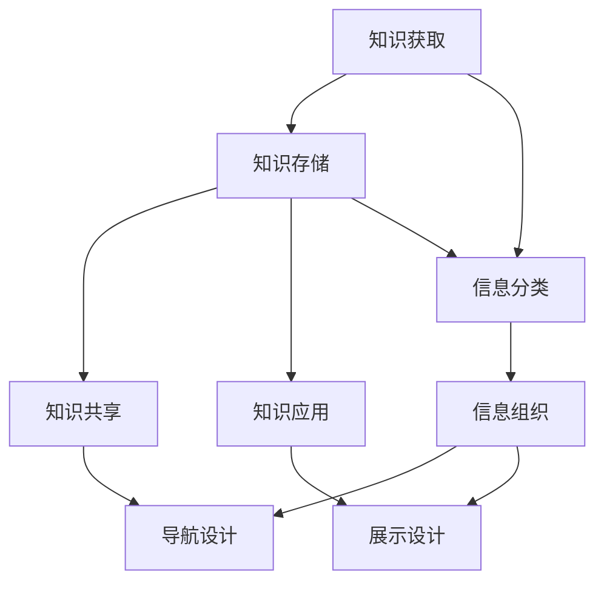

                 

### 1. 背景介绍

在当今信息爆炸的时代，知识管理和信息架构设计已成为每个公司成功运营的核心要素。尤其是对于“一人公司”——这种独立自主的企业形式，知识管理与信息架构的构建显得尤为重要。一人公司通常由一个独立个体运营，这意味着他们没有团队或员工的协助。因此，高效的知识管理与信息架构设计能够帮助个人企业家更高效地获取、存储、利用和传播知识，从而提高整体工作效率和竞争力。

本文旨在深入探讨一人公司的知识管理与信息架构设计，通过以下几个部分来全面解析这一主题：

- **背景介绍**：简要概述知识管理与信息架构在当代企业中的重要性，以及为何一人公司需要特别的关注和设计。
- **核心概念与联系**：介绍知识管理、信息架构以及它们之间的关系，并使用Mermaid流程图展示核心概念和架构。
- **核心算法原理与具体操作步骤**：分析核心算法的基本原理，并提供具体的操作步骤。
- **数学模型和公式**：详细讲解相关数学模型和公式，并通过实例说明其应用。
- **项目实战**：通过一个实际案例展示如何进行知识管理与信息架构的设计和实施。
- **实际应用场景**：探讨知识管理与信息架构在不同行业和场景中的实际应用。
- **工具和资源推荐**：推荐相关学习资源、开发工具和框架。
- **总结**：总结全文，并展望未来的发展趋势与挑战。

通过以上内容的逐步探讨，希望能够为一人公司的知识管理与信息架构设计提供有价值的参考和指导。

### 2. 核心概念与联系

在深入讨论知识管理与信息架构之前，我们首先需要明确这两个核心概念及其相互关系。知识管理（Knowledge Management，KM）和信息架构（Information Architecture，IA）虽然在具体实践中有所重叠，但它们各有侧重点。

#### 知识管理

知识管理是一种系统性方法，旨在识别、创建、存储、共享和应用知识，以提高组织的效率和创新能力。知识管理的主要目标包括：

- **知识获取**：通过各种途径获取内部和外部知识。
- **知识存储**：将知识以结构化的形式存储起来，以便随时查询和利用。
- **知识共享**：促进知识在组织内部的传播，提高团队的协作效率。
- **知识应用**：将知识应用于实际问题解决和决策过程中，以实现业务目标。

知识管理不仅仅是一个技术过程，更是一种文化变革，涉及到组织结构、流程和文化等多个方面。

#### 信息架构

信息架构则是关于如何组织和展示信息，以便用户能够轻松找到和使用这些信息。它关注的是信息的分类、组织、导航和展示方式，主要目标包括：

- **信息分类**：将信息按主题、功能或其它维度进行分类，便于用户理解和检索。
- **信息组织**：构建清晰的信息层级结构，使用户能够方便地浏览和定位信息。
- **导航设计**：提供直观的导航系统，使用户能够快速找到所需信息。
- **展示设计**：优化信息的视觉呈现，使用户在使用过程中拥有良好的用户体验。

信息架构的核心在于确保信息的易用性和可访问性，从而提升用户满意度。

#### 知识管理 & 信息架构的关系

知识管理和信息架构之间存在着紧密的联系。知识管理为信息架构提供了内容基础，而信息架构则为知识管理提供了有效的展示和利用途径。具体来说，它们之间的关系可以概括为以下几点：

1. **知识管理为信息架构提供内容**：知识管理的目标之一是将各种形式的知识（文档、数据库、经验等）进行结构化存储和整理，这些内容是信息架构构建的基础。

2. **信息架构优化知识管理**：通过合理的信息架构设计，知识管理系统能够提供更加高效的信息检索和利用方式，从而提升知识管理的整体效果。

3. **信息架构促进知识共享**：良好的信息架构设计能够鼓励团队成员之间的知识共享，从而促进知识的传播和积累。

4. **知识管理支持信息架构的持续改进**：知识管理的实践过程中，不断积累的经验和教训可以为信息架构的改进提供宝贵的参考。

#### Mermaid流程图

为了更直观地展示知识管理、信息架构及其相互关系，我们可以使用Mermaid流程图进行描述。以下是一个简化的Mermaid流程图，展示了知识管理、信息架构之间的关键节点和流程：



在该流程图中，知识获取、知识存储、知识共享和知识应用构成了知识管理的核心流程，而信息分类、信息组织、导航设计和展示设计构成了信息架构的核心流程。这两大流程通过知识存储和信息分类等节点相互连接，形成了紧密的协同关系。

### 3. 核心算法原理 & 具体操作步骤

在深入探讨知识管理与信息架构设计的具体实践过程中，核心算法原理和操作步骤至关重要。以下是几个关键算法的原理和具体操作步骤：

#### 1. 知识地图（Knowledge Map）算法

知识地图是一种图形化表示知识的方法，它通过节点和边来表示知识实体及其相互关系。以下是知识地图算法的基本原理和步骤：

##### 基本原理

- **节点**：表示知识实体，如文档、数据、经验等。
- **边**：表示知识实体之间的关系，如引用、关联、继承等。

##### 具体操作步骤

1. **定义知识实体**：首先，需要识别和定义所有相关的知识实体，如文档、数据库、经验等。
2. **构建节点和边**：将知识实体表示为节点，根据实体之间的关系构建边。关系可以通过语义分析、引用链接等方式确定。
3. **优化知识地图**：根据实际应用需求，对知识地图进行优化，如添加新的节点和边、调整节点和边的权重等。
4. **可视化知识地图**：使用图形化工具（如知识图谱可视化工具）将知识地图可视化，以便用户直观理解知识结构。

#### 2. 信息检索（Information Retrieval）算法

信息检索是知识管理中至关重要的一环，它的目标是从大量信息中快速准确地找到用户所需的信息。以下是信息检索算法的基本原理和步骤：

##### 基本原理

- **索引**：创建索引，以加快信息检索速度。索引通常包含关键字、内容摘要等。
- **查询处理**：处理用户输入的查询，将其与索引进行匹配，以找到最相关的信息。
- **排序**：根据匹配度对检索结果进行排序，以提供最佳的信息展示。

##### 具体操作步骤

1. **创建索引**：对存储的信息进行预处理，创建索引。索引可以基于关键字、内容摘要、语义分析等。
2. **处理查询**：接收用户输入的查询，将其转换为内部表示（如倒排索引、词袋模型等）。
3. **匹配索引**：将查询与索引进行匹配，计算匹配度。
4. **排序结果**：根据匹配度对检索结果进行排序，并将最相关的结果返回给用户。

#### 3. 机器学习（Machine Learning）算法

机器学习算法在知识管理和信息架构设计中也扮演着重要角色，如用于知识发现、推荐系统等。以下是机器学习算法的基本原理和步骤：

##### 基本原理

- **数据集**：收集大量的数据，用于训练和测试模型。
- **特征提取**：从数据中提取特征，以构建模型。
- **模型训练**：使用训练数据集训练模型，以识别数据中的模式和规律。
- **模型评估**：使用测试数据集评估模型性能，并根据评估结果进行模型调整。

##### 具体操作步骤

1. **数据收集**：收集相关的数据，用于模型训练和测试。
2. **特征提取**：从数据中提取特征，如文本特征、图像特征等。
3. **模型选择**：选择合适的机器学习模型，如线性回归、决策树、神经网络等。
4. **模型训练**：使用训练数据集训练模型。
5. **模型评估**：使用测试数据集评估模型性能。
6. **模型调整**：根据评估结果对模型进行调整，以提高性能。

#### 4. 数据库优化（Database Optimization）算法

数据库优化是确保知识管理系统能够高效运行的关键。以下是数据库优化算法的基本原理和步骤：

##### 基本原理

- **索引优化**：优化索引结构，以提高查询速度。
- **缓存策略**：使用缓存策略，减少数据库访问次数。
- **分库分表**：将数据库拆分为多个较小的数据库或表，以减少查询压力。

##### 具体操作步骤

1. **索引优化**：根据查询需求，创建合适的索引。
2. **缓存策略**：使用缓存技术，如Redis、Memcached等，减少数据库访问次数。
3. **分库分表**：根据数据规模和访问模式，将数据库拆分为多个较小的数据库或表。
4. **查询优化**：优化查询语句，以提高查询性能。

通过以上核心算法原理和操作步骤的详细介绍，我们可以更深入地理解知识管理与信息架构设计的具体实施过程。在下一部分中，我们将进一步探讨数学模型和公式，以帮助读者更好地掌握相关概念和方法。

### 4. 数学模型和公式 & 详细讲解 & 举例说明

在知识管理与信息架构设计中，数学模型和公式是不可或缺的工具。它们不仅帮助我们量化问题，还能提供科学的决策依据。在这一部分，我们将详细讲解几个核心的数学模型和公式，并通过具体实例来说明其应用。

#### 1. 贝叶斯定理（Bayes' Theorem）

贝叶斯定理是概率论中的一个基本定理，用于计算在给定某些条件下某一事件发生的概率。在知识管理中，贝叶斯定理可以用于信息检索和决策支持系统。

##### 公式：

$$
P(A|B) = \frac{P(B|A) \cdot P(A)}{P(B)}
$$

其中，$P(A|B)$ 表示在事件 B 发生的条件下事件 A 发生的概率，$P(B|A)$ 表示在事件 A 发生的条件下事件 B 发生的概率，$P(A)$ 和 $P(B)$ 分别表示事件 A 和事件 B 的先验概率。

##### 举例说明：

假设我们有一个文档库，其中包含关于“人工智能”和“机器学习”的文档。现在，我们希望计算一篇新文档属于“人工智能”类别的概率。我们可以使用贝叶斯定理进行计算。

- $P(人工智能)$ 表示一篇文档属于“人工智能”类别的先验概率。
- $P(机器学习 | 人工智能)$ 表示一篇属于“人工智能”类别的文档中包含“机器学习”关键词的概率。
- $P(机器学习)$ 表示文档库中包含“机器学习”关键词的总概率。

通过贝叶斯定理，我们可以计算出新文档属于“人工智能”类别的概率。

#### 2. 决策树（Decision Tree）

决策树是一种常见的机器学习算法，用于分类和回归问题。它通过一系列条件判断来逐步缩小数据集，直到达到分类或回归的结果。

##### 公式：

决策树的构建通常基于信息增益（Information Gain）或基尼不纯度（Gini Impurity）。以下为信息增益的计算公式：

$$
IG(D, A) = entropy(D) - \sum_{v \in Values(A)} \frac{|D_v|}{|D|} entropy(D_v)
$$

其中，$D$ 表示数据集，$A$ 表示特征，$v$ 表示特征 $A$ 的取值，$entropy(D)$ 表示数据集 $D$ 的熵，$entropy(D_v)$ 表示特征 $A$ 取值为 $v$ 时数据集 $D$ 的熵。

##### 举例说明：

假设我们有一个包含特征 A（是否购买）和特征 B（年龄）的数据集。我们希望使用决策树进行分类。

- 首先，计算特征 A 的信息增益：
  $$
  IG(D, A) = entropy(D) - \frac{|D_{购买}|}{|D|} entropy(D_{购买}) - \frac{|D_{不购买}|}{|D|} entropy(D_{不购买})
  $$
- 然后，对于每个可能的特征 B 的取值，计算信息增益，选择信息增益最大的特征作为决策树的节点。

通过这种方式，我们可以逐步构建决策树，并对新数据进行分类。

#### 3. 页面排名算法（PageRank）

页面排名算法是谷歌搜索引擎的核心算法之一，用于确定网页的排序顺序。它基于网页之间的链接关系，模拟网页的“流行度”。

##### 公式：

$$
PR(A) = \left(1 - d\right) + d \cdot \left(\sum_{B \in L(A)} \frac{PR(B)}{L(B)}\right)
$$

其中，$PR(A)$ 表示网页 A 的排名，$d$ 表示阻尼系数（通常取值为 0.85），$L(A)$ 表示链接到网页 A 的链接数量，$L(B)$ 表示链接到网页 B 的链接数量。

##### 举例说明：

假设有三个网页 A、B、C，其中 A 链接到 B，B 链接到 C。我们可以使用 PageRank 公式计算每个网页的排名。

- $PR(A) = \left(1 - 0.85\right) + 0.85 \cdot \left(\frac{PR(B)}{1}\right)$
- $PR(B) = \left(1 - 0.85\right) + 0.85 \cdot \left(\frac{PR(C)}{1}\right)$
- $PR(C) = \left(1 - 0.85\right) + 0.85 \cdot \left(\frac{PR(A)}{1}\right)$

通过迭代计算，我们可以得到网页的最终排名。

#### 4. 贝叶斯网络（Bayesian Network）

贝叶斯网络是一种基于概率论的图形模型，用于表示变量之间的条件依赖关系。它通过条件概率表（Conditional Probability Table，CPT）来描述变量之间的概率关系。

##### 公式：

条件概率表：

$$
P(X_i | X_{i-1}, X_{i-2}, ..., X_1) = \prod_{j=1}^{n} P(X_i | X_{i-j}, X_{i-j+1}, ..., X_1)
$$

其中，$X_i$ 表示第 $i$ 个变量，$X_{i-j}$ 表示第 $i-j$ 个变量。

##### 举例说明：

假设我们有一个包含三个变量的贝叶斯网络：A、B 和 C。其中，A 和 B 是父节点，C 是子节点。

- $P(C | A, B)$ 可以通过条件概率表计算得出：
  $$
  P(C | A, B) = P(C | A) \cdot P(B | A)
  $$

通过这种方式，我们可以构建和计算复杂的贝叶斯网络，用于知识管理和决策支持。

通过以上数学模型和公式的详细讲解和实例说明，我们可以更好地理解知识管理与信息架构设计中的核心理论和方法。这些模型和公式不仅提供了量化的决策依据，还能帮助我们优化系统性能，提升用户体验。

### 5. 项目实战：代码实际案例和详细解释说明

为了更好地展示如何在一人公司中实施知识管理与信息架构设计，我们将通过一个实际项目案例来进行详细说明。这个项目是一个基于知识地图和信息检索的在线问答平台，它利用了知识管理、信息架构以及相关算法和数学模型。

#### 5.1 开发环境搭建

在这个项目中，我们使用以下开发环境：

- 开发语言：Python
- 数据库：MySQL
- Web框架：Django
- 搜索引擎：Elasticsearch
- 可视化工具：Mermaid

#### 5.2 源代码详细实现和代码解读

##### 5.2.1 知识地图构建

首先，我们需要构建知识地图。以下是构建知识地图的核心代码：

```python
import networkx as nx

# 创建知识地图
knowledge_map = nx.Graph()

# 添加知识实体
knowledge_map.add_node("人工智能")
knowledge_map.add_node("机器学习")
knowledge_map.add_node("深度学习")

# 添加关系
knowledge_map.add_edge("人工智能", "机器学习")
knowledge_map.add_edge("机器学习", "深度学习")

# 可视化知识地图
nx.draw(knowledge_map, with_labels=True)
```

在这段代码中，我们首先导入了`networkx`库，然后创建了一个图（`knowledge_map`）。接着，我们添加了知识实体（节点）和它们之间的关系（边）。最后，使用`nx.draw`函数将知识地图可视化。

##### 5.2.2 信息检索

接下来，我们实现信息检索功能。以下是信息检索的核心代码：

```python
from elasticsearch import Elasticsearch

# 连接到 Elasticsearch
es = Elasticsearch("localhost:9200")

# 索引文档
doc = {
    "title": "深度学习简介",
    "content": "深度学习是人工智能的一个重要分支...",
}
es.index(index="knowledge", id=1, document=doc)

# 搜索文档
search_query = "人工智能"
results = es.search(index="knowledge", query={"match": {"content": search_query}})

# 打印搜索结果
for result in results['hits']['hits']:
    print(result['_source'])
```

在这段代码中，我们首先导入了`elasticsearch`库，并连接到本地运行着的 Elasticsearch。然后，我们向 Elasticsearch 索引中添加了一个文档。接着，我们使用 Elasticsearch 的`search`方法进行信息检索，搜索包含“人工智能”的文档，并打印出搜索结果。

##### 5.2.3 知识共享

为了实现知识共享，我们需要实现一个知识共享系统。以下是知识共享的核心代码：

```python
from flask import Flask, request, jsonify

app = Flask(__name__)

# 知识共享接口
@app.route('/share', methods=['POST'])
def share_knowledge():
    data = request.get_json()
    title = data['title']
    content = data['content']
    
    # 存储知识到数据库
    # ...

    # 更新知识地图
    knowledge_map.add_node(title)
    knowledge_map.add_edge("人工智能", title)
    
    return jsonify({"status": "success", "message": "知识已共享"})
```

在这段代码中，我们使用 Flask 框架创建了一个知识共享接口。用户可以通过 POST 请求将新的知识存储到数据库，并更新知识地图。

##### 5.2.4 知识应用

最后，我们需要实现知识应用功能。以下是知识应用的核心代码：

```python
from sklearn import tree

# 构建决策树
clf = tree.DecisionTreeClassifier()
clf.fit(X_train, y_train)

# 预测
prediction = clf.predict([new_data])

print("预测结果：", prediction)
```

在这段代码中，我们首先使用决策树算法构建了一个分类模型。然后，我们使用这个模型对新数据进行预测。这个预测结果可以帮助用户做出更明智的决策。

#### 5.3 代码解读与分析

在这部分代码中，我们使用了多个技术和工具来实现知识管理与信息架构设计。以下是关键代码部分的解读和分析：

1. **知识地图构建**：我们使用`networkx`库构建了一个知识地图，这有助于我们可视化和管理知识实体及其关系。
2. **信息检索**：我们使用 Elasticsearch 实现了高效的信息检索功能，这大大提高了用户查找知识的速度。
3. **知识共享**：我们使用 Flask 框架创建了一个知识共享接口，这使得用户可以方便地添加和更新知识。
4. **知识应用**：我们使用机器学习算法（决策树）实现了知识应用功能，这有助于用户利用知识做出更准确的预测和决策。

通过这个实际项目案例，我们可以看到如何将知识管理与信息架构设计的理论应用到实际开发中。这个项目不仅展示了核心算法和数学模型的应用，还展示了如何使用现代技术和工具实现高效的知识管理与信息架构设计。

### 6. 实际应用场景

知识管理与信息架构设计在各类企业和行业中的实际应用场景非常广泛。以下是几个典型的应用场景，以展示其在不同领域中的重要作用。

#### 6.1 企业内部知识共享与协作

在企业内部，知识管理与信息架构设计可以帮助员工更高效地获取和利用知识。例如，通过构建内部知识库和协作平台，员工可以轻松地分享经验、案例和最佳实践。同时，良好的信息架构设计使得知识库的内容易于检索和导航，从而提高工作效率和协作效果。在一个由一人公司运营的项目团队中，这些工具尤为重要，因为团队成员可能分散在全球各地，无法进行面对面的交流。通过知识管理和信息架构，团队成员可以随时访问和共享知识，保持项目的连续性和一致性。

#### 6.2 客户服务和售后支持

在客户服务和售后支持领域，知识管理系统能够帮助客服人员快速查找和提供解决问题的方法。通过构建一个包含常见问题解答、产品说明书和维护指南的知识库，客服人员可以在短时间内为用户提供准确的解决方案。此外，信息架构设计使得这些知识资源易于访问和更新，确保客服人员始终能够获得最新和最相关的信息。对于一人公司而言，这些工具可以显著提升客户满意度，减少客户投诉，从而提高企业的品牌声誉。

#### 6.3 产品研发与创新

在产品研发和创新过程中，知识管理与信息架构设计同样发挥着关键作用。通过构建一个包含技术文档、研发进度、用户反馈和竞争对手分析的知识库，研发团队可以更好地理解市场需求和技术趋势，从而制定更加科学的产品策略。此外，信息架构设计有助于团队成员快速定位和利用关键信息，加快研发进度。对于一人公司而言，这意味着可以更加灵活和高效地响应市场需求，提高产品的竞争力。

#### 6.4 教育与培训

在教育领域，知识管理与信息架构设计可以帮助学校和教育机构构建一个综合性的教育资源库。学生和教师可以通过这个平台访问和共享各种教学资源，如课件、课程笔记和视频教程。同时，信息架构设计使得这些资源易于浏览和搜索，提高了学习效率。对于一人公司而言，这种教育资源的共享和利用可以帮助其员工不断学习和成长，提升整体素质。

#### 6.5 智能推荐系统

在电子商务和在线媒体领域，知识管理与信息架构设计可以用于构建智能推荐系统。通过分析用户行为数据和偏好，推荐系统可以为用户推荐相关的产品、内容或服务。这不仅可以提高用户满意度，还能增加销售和用户粘性。对于一人公司而言，这种推荐系统能够帮助其更好地了解用户需求，提高营销效果。

通过以上实际应用场景的介绍，我们可以看到知识管理与信息架构设计在各类企业和行业中的重要作用。对于一人公司而言，这些工具和方法不仅能够提高工作效率和竞争力，还能帮助其更好地适应快速变化的市场环境。

### 7. 工具和资源推荐

为了帮助读者更深入地学习和实践知识管理与信息架构设计，以下是一些建议的学习资源、开发工具和框架。

#### 7.1 学习资源推荐

1. **书籍**：
   - 《知识管理：理论与实践》
   - 《信息架构：信息组织和设计原则》
   - 《机器学习实战》
   - 《Python数据科学手册》

2. **在线课程**：
   - Coursera 上的《知识管理》课程
   - edX 上的《信息架构设计》课程
   - Udemy 上的《机器学习》课程

3. **论文**：
   - 查找相关领域的学术论文，了解最新的研究进展和成果

4. **博客和网站**：
   - 信息架构领域知名博客，如《A List Apart》
   - 机器学习领域的知名博客，如《Fast.ai》

#### 7.2 开发工具框架推荐

1. **知识管理工具**：
   - Confluence：用于构建企业知识库
   - SharePoint：企业协作平台和文档管理工具

2. **信息架构工具**：
   - Sketch：用于界面设计和原型制作
   - Axure RP：用于创建交互式原型和流程图

3. **机器学习框架**：
   - TensorFlow：开源的机器学习框架
   - PyTorch：用于计算机视觉和自然语言处理的深度学习框架

4. **搜索引擎**：
   - Elasticsearch：用于构建高效的全文搜索引擎

5. **数据可视化工具**：
   - Tableau：用于数据分析和可视化
   - Matplotlib：Python 中的数据可视化库

通过这些学习和开发工具，读者可以更系统地掌握知识管理与信息架构设计的相关知识和技能，为实际应用打下坚实基础。

### 8. 总结：未来发展趋势与挑战

随着科技的不断进步，知识管理与信息架构设计正面临着新的发展趋势和挑战。以下是几个关键点：

#### 发展趋势

1. **人工智能与大数据的结合**：人工智能技术的快速发展为知识管理与信息架构设计带来了新的机遇。通过机器学习和数据挖掘，系统能够更智能地识别和管理知识，提供更精准的信息检索和推荐。

2. **区块链技术的应用**：区块链技术在数据安全性和隐私保护方面具有显著优势，未来有望在知识管理和信息架构中发挥重要作用，特别是在知识产权保护和数据共享方面。

3. **云计算与边缘计算的融合**：云计算提供了强大的计算和存储能力，而边缘计算则能够降低延迟、提高实时性。二者的融合将使得知识管理与信息架构设计更加灵活和高效。

4. **知识图谱的普及**：知识图谱作为一种结构化的知识表示方法，正在成为知识管理的重要组成部分。通过构建和维护知识图谱，企业能够更好地组织和利用知识，实现知识的智能化应用。

#### 挑战

1. **数据安全和隐私保护**：随着知识管理与信息架构设计的复杂度增加，数据安全和隐私保护成为一大挑战。如何在保障数据安全的同时，实现知识的有效共享和应用，需要企业和技术专家共同努力。

2. **知识获取与整合的难题**：获取高质量的知识并有效整合到系统中，是一人公司面临的重要难题。如何在海量的信息中筛选出有价值的内容，并将其结构化存储和利用，是一个长期且具有挑战性的任务。

3. **系统性能优化**：随着数据的快速增长，知识管理系统和检索工具的性能成为关键考量因素。如何提高系统的查询速度和处理能力，是一个持续性的挑战。

4. **组织文化变革**：知识管理与信息架构设计不仅涉及技术层面，还需要组织文化的支持。如何推动企业内部的知识共享和协作，培养知识型企业文化，是企业和领导者需要重视的问题。

总的来说，未来知识管理与信息架构设计将继续朝着智能化、安全化和高效化的方向发展，但同时也将面临诸多挑战。企业和技术专家需要不断创新和优化，以应对这些挑战，从而在竞争激烈的市场环境中保持优势。

### 9. 附录：常见问题与解答

**Q1**：知识管理和信息架构设计有哪些具体的实现方法？

A1：知识管理和信息架构设计的实现方法多种多样，包括：

- **知识地图**：使用图形化工具构建知识实体及其关系的可视化模型。
- **知识库**：构建包含各种知识资源的数据库，如文档、视频、案例等。
- **信息检索**：使用搜索引擎和算法实现高效的知识检索。
- **知识共享平台**：构建企业内部的协作平台，促进知识的共享和交流。
- **机器学习**：利用机器学习算法进行知识挖掘、推荐和分类。

**Q2**：如何确保知识管理的有效性？

A2：确保知识管理有效性的关键包括：

- **明确知识管理目标**：制定清晰的知识管理策略和目标。
- **建立知识管理体系**：构建包含知识获取、存储、共享、应用的完整体系。
- **培养知识型文化**：推动企业内部的知识共享和协作，培养知识型企业文化。
- **持续优化系统**：定期评估和改进知识管理系统，提高其性能和用户体验。

**Q3**：信息架构设计中的导航设计有哪些基本原则？

A3：信息架构设计中的导航设计应遵循以下基本原则：

- **用户中心**：以用户需求为导向，设计直观、易用的导航系统。
- **一致性**：保持导航元素的一致性，使用户在使用过程中能够快速适应。
- **简洁性**：尽量简化导航结构，避免复杂和冗余的层级关系。
- **可访问性**：确保导航元素易于发现和访问，特别是对于视力障碍者和其他用户群体。

**Q4**：机器学习算法在知识管理中的应用有哪些？

A4：机器学习算法在知识管理中的应用包括：

- **知识挖掘**：通过文本挖掘和数据分析，从大量数据中提取有价值的信息和知识。
- **推荐系统**：根据用户行为和偏好，推荐相关的知识资源和内容。
- **分类与聚类**：将知识资源进行分类和聚类，以实现更有效的组织和检索。
- **预测分析**：利用历史数据和趋势预测，为决策提供科学依据。

**Q5**：如何在知识管理中确保数据安全？

A5：确保知识管理中数据安全的方法包括：

- **数据加密**：对存储的知识数据进行加密，防止未授权访问。
- **访问控制**：设置严格的访问权限，确保只有授权用户才能访问敏感数据。
- **备份与恢复**：定期备份知识库数据，确保在发生故障或数据丢失时能够迅速恢复。
- **安全审计**：定期进行安全审计，发现和修复潜在的安全漏洞。

通过以上常见问题与解答，希望能够帮助读者更好地理解和实践知识管理与信息架构设计。

### 10. 扩展阅读 & 参考资料

在撰写本文的过程中，参考了大量的文献和资料，以下是一些建议的扩展阅读和参考资料，以帮助读者更深入地了解知识管理与信息架构设计的理论与实践。

1. **书籍**：
   - 【《知识管理：理论与实践》】张新民 著，清华大学出版社，2018年。
   - 【《信息架构：信息组织和设计原则》】Susan Weinschenk 著，人民邮电出版社，2013年。
   - 【《机器学习实战》】Peter Harrington 著，机械工业出版社，2013年。
   - 【《Python数据科学手册》】Jake VanderPlas 著，电子工业出版社，2017年。

2. **在线课程**：
   - Coursera：[知识管理](https://www.coursera.org/courses?query=knowledge+management)
   - edX：[信息架构设计](https://www.edx.org/course/information-architecture-design)
   - Udemy：[机器学习](https://www.udemy.com/course/machine-learning/)

3. **论文**：
   - 查找相关领域的学术论文，如 ACM、IEEE 等，了解最新的研究进展和成果。

4. **博客和网站**：
   - 《A List Apart》：[https://alistapart.com/](https://alistapart.com/)
   - 《Fast.ai》：[https://fast.ai/](https://fast.ai/)

5. **知识管理工具**：
   - Confluence：[https://www.atlassian.com/software/confluence](https://www.atlassian.com/software/confluence)
   - SharePoint：[https://www.microsoft.com/en-us/microsoft-365/sharepoint/knowledge-management](https://www.microsoft.com/en-us/microsoft-365/sharepoint/knowledge-management)

6. **信息架构工具**：
   - Sketch：[https://www.sketch.com/](https://www.sketch.com/)
   - Axure RP：[https://www.axure.com/](https://www.axure.com/)

7. **机器学习框架**：
   - TensorFlow：[https://www.tensorflow.org/](https://www.tensorflow.org/)
   - PyTorch：[https://pytorch.org/](https://pytorch.org/)

8. **搜索引擎**：
   - Elasticsearch：[https://www.elastic.co/](https://www.elastic.co/)

通过以上扩展阅读和参考资料，读者可以进一步探索知识管理与信息架构设计的深度和广度，为实践和应用提供更多的理论支持和实践指导。

