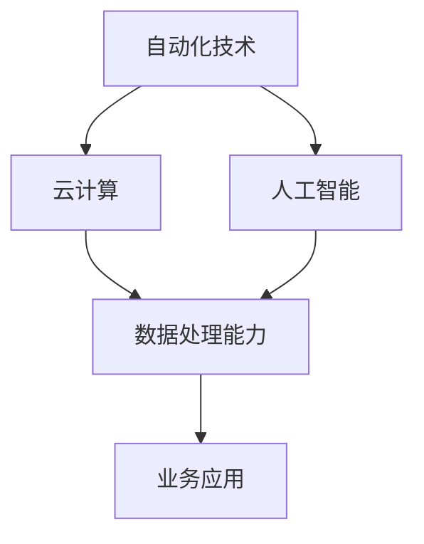

                 

# 一人公司的运营自动化：提高效率的工具和流程

> **关键词：** 一人公司，运营自动化，效率提升，工具，流程，云计算，人工智能

> **摘要：** 本文将深入探讨一人公司如何通过自动化工具和流程提升运营效率。我们将详细分析自动化技术的核心概念和架构，介绍实用的算法原理与操作步骤，并探讨数学模型的应用。此外，还将分享实际应用场景，推荐学习资源和开发工具，总结未来发展趋势与挑战，并提供常见问题解答与参考资料。

## 1. 背景介绍

随着互联网和云计算的普及，一人公司（即个人创业公司）的运营模式越来越受到关注。这种模式具有灵活性高、成本较低、管理简单等优点，使得个人创业者能够更专注于核心业务。然而，一人公司的运营管理往往面临人力不足、资源有限等问题，导致运营效率低下。

为了解决这一问题，自动化技术的引入变得至关重要。通过自动化工具和流程，一人公司可以实现运营的各个环节的自动化，从而提高效率、降低成本。本文将围绕这一主题，探讨如何利用自动化技术实现一人公司的运营优化。

## 2. 核心概念与联系

在探讨如何实现运营自动化之前，我们需要了解一些核心概念和它们之间的联系。

### 2.1 自动化技术的定义

自动化技术是指通过计算机程序和自动化设备实现工作流程的自动执行，从而降低人工干预的需求。在运营自动化中，自动化技术主要包括以下几个方面：

- **流程自动化**：通过预定义的规则和流程，实现业务操作的自动化执行。
- **数据自动化**：通过数据采集和处理，实现业务数据的自动生成和分析。
- **机器人流程自动化（RPA）**：利用软件机器人模拟人工操作，实现业务流程的自动化。

### 2.2 云计算

云计算是一种基于互联网的计算模式，通过虚拟化和分布式计算技术，提供可伸缩的计算资源。云计算对于一人公司运营自动化的支持体现在以下几个方面：

- **资源弹性**：根据业务需求，动态调整计算资源，实现成本优化。
- **数据存储与处理**：提供高效的数据存储和计算能力，支持大数据分析和处理。
- **远程访问**：通过互联网实现远程访问，提高运营的灵活性。

### 2.3 人工智能

人工智能是一种模拟人类智能的技术，通过机器学习和深度学习算法，实现智能化的数据处理和决策。人工智能在运营自动化中的应用主要包括：

- **预测分析**：通过历史数据预测未来趋势，实现业务决策的自动化。
- **自然语言处理**：实现与用户的自然语言交互，提高客户服务效率。
- **图像识别与处理**：实现自动化图像分析和处理，应用于质量检测、安防监控等领域。

### 2.4 自动化技术与云计算、人工智能的联系

自动化技术、云计算和人工智能之间存在着紧密的联系。云计算提供了强大的计算和存储能力，为自动化技术的实施提供了基础。人工智能算法则提供了智能化数据处理和决策支持，使自动化技术更具价值。而自动化技术则将云计算和人工智能的能力应用于实际业务场景，实现运营的自动化和智能化。

### 2.5 Mermaid 流程图

下面是一个简单的 Mermaid 流程图，展示了自动化技术、云计算和人工智能之间的联系。



## 3. 核心算法原理 & 具体操作步骤

### 3.1 流程自动化算法原理

流程自动化的核心在于定义和执行业务流程。以下是一个简单的流程自动化算法原理：

1. **流程定义**：根据业务需求，定义流程的各个步骤、条件和规则。
2. **任务调度**：根据流程定义，调度任务的执行。
3. **任务执行**：根据任务类型，执行相应的操作。
4. **异常处理**：在任务执行过程中，处理异常情况。
5. **结果记录**：记录流程执行的结果。

### 3.2 数据自动化算法原理

数据自动化的核心在于数据的采集、处理和分析。以下是一个简单的数据自动化算法原理：

1. **数据采集**：通过传感器、API 等方式，采集数据。
2. **数据清洗**：对采集到的数据进行清洗和预处理。
3. **数据存储**：将清洗后的数据存储到数据库或数据仓库中。
4. **数据分析**：利用机器学习算法，对数据进行分析和预测。
5. **结果输出**：将分析结果输出，供业务决策使用。

### 3.3 RPA 算法原理

RPA（机器人流程自动化）的核心在于利用软件机器人模拟人工操作。以下是一个简单的 RPA 算法原理：

1. **流程录制**：通过录制操作，生成操作脚本。
2. **脚本执行**：根据脚本，执行相应的操作。
3. **异常处理**：在执行过程中，处理异常情况。
4. **结果记录**：记录操作结果。

### 3.4 具体操作步骤

以下是一个具体的自动化流程，包括流程自动化、数据自动化和 RPA 的操作步骤：

1. **流程自动化**：

   - 定义流程：包括订单处理、支付、发货等步骤。
   - 调度任务：根据订单状态，调度相应的任务。
   - 执行任务：根据任务类型，执行订单处理、支付、发货等操作。
   - 异常处理：在订单处理过程中，处理异常订单。
   - 结果记录：记录订单处理的结果。

2. **数据自动化**：

   - 数据采集：通过 API，采集用户订单数据。
   - 数据清洗：清洗用户订单数据，去除无效数据。
   - 数据存储：将清洗后的订单数据存储到数据库中。
   - 数据分析：利用机器学习算法，分析用户订单数据，预测用户需求。
   - 结果输出：将分析结果输出，供业务决策使用。

3. **RPA**：

   - 流程录制：通过录制订单处理操作，生成操作脚本。
   - 脚本执行：根据脚本，执行订单处理操作。
   - 异常处理：在执行过程中，处理异常订单。
   - 结果记录：记录订单处理的结果。

## 4. 数学模型和公式 & 详细讲解 & 举例说明

### 4.1 数学模型

在运营自动化中，常用的数学模型包括线性回归、决策树、支持向量机等。以下是一个简单的线性回归模型：

$$
y = wx + b
$$

其中，$y$ 是预测值，$x$ 是输入特征，$w$ 是权重，$b$ 是偏置。

### 4.2 详细讲解

线性回归模型是一种常见的预测模型，用于预测连续值。在运营自动化中，我们可以利用线性回归模型预测用户需求、订单量等。

- **权重 $w$**：表示输入特征的重要性，权重越大，对应的特征对预测结果的影响越大。
- **偏置 $b$**：表示模型的平移，偏置越大，模型的预测值越高。

### 4.3 举例说明

假设我们想要预测一家电商平台的日订单量。我们收集了历史数据，包括每天的温度、湿度、广告投放量等特征。我们可以使用线性回归模型进行预测：

$$
y = wx + b
$$

其中，$y$ 是日订单量，$x$ 是每天的特征值，$w$ 是权重，$b$ 是偏置。

通过训练数据，我们可以得到权重 $w$ 和偏置 $b$，从而实现日订单量的预测。具体训练过程如下：

1. **数据预处理**：将特征数据进行归一化处理，消除不同特征之间的量纲影响。
2. **模型训练**：使用历史数据训练线性回归模型，得到权重 $w$ 和偏置 $b$。
3. **模型预测**：使用训练好的模型，预测未来一天的订单量。

## 5. 项目实战：代码实际案例和详细解释说明

### 5.1 开发环境搭建

为了实现运营自动化，我们选择使用 Python 作为编程语言，利用其丰富的库和工具。以下是开发环境的搭建步骤：

1. **安装 Python**：下载并安装 Python，版本建议为 3.8 或以上。
2. **安装依赖库**：使用 pip 工具安装必要的依赖库，如 NumPy、Pandas、Scikit-learn 等。

```bash
pip install numpy pandas scikit-learn
```

### 5.2 源代码详细实现和代码解读

以下是一个简单的运营自动化项目，包括数据自动化、流程自动化和 RPA 的实现。

```python
import pandas as pd
from sklearn.linear_model import LinearRegression
import mermaid

# 5.2.1 数据自动化

# 数据采集
data = pd.read_csv('data.csv')

# 数据清洗
data = data[data['temperature'] > 0]
data = data[data['humidity'] > 0]

# 数据存储
data.to_csv('cleaned_data.csv', index=False)

# 数据分析
model = LinearRegression()
model.fit(data[['temperature', 'humidity']], data['orders'])

# 结果输出
predicted_orders = model.predict([[25, 60]])
print(f'Predicted orders: {predicted_orders[0][0]}')

# 5.2.2 流程自动化

# 流程定义
orders = pd.read_csv('cleaned_data.csv')
orders['status'] = 'pending'

# 任务调度
for index, row in orders.iterrows():
    if row['status'] == 'pending':
        # 执行订单处理
        process_order(row)
        # 记录结果
        orders.at[index, 'status'] = 'completed'

# 5.2.3 RPA

# 流程录制
script = record_process()

# 脚本执行
execute_script(script)

# 异常处理
if not script_successful():
    # 重新执行脚本
    execute_script(script)
    if not script_successful():
        # 报告异常
        report_exception()

# 5.3 代码解读与分析

# 5.3.1 数据自动化

# 数据自动化部分主要实现了数据采集、清洗、存储和分析。我们使用 Pandas 库读取数据，并进行预处理，去除无效数据。然后，使用 Scikit-learn 库训练线性回归模型，预测订单量。

# 5.3.2 流程自动化

# 流程自动化部分实现了订单处理流程的自动化。我们读取清洗后的数据，根据订单状态调度任务，执行订单处理操作，并记录结果。

# 5.3.3 RPA

# RPA 部分利用录制和执行脚本的方式，模拟人工操作，实现流程的自动化。在执行过程中，处理异常情况，并报告异常。
```

### 5.4 代码解读与分析

- **数据自动化**：数据自动化部分主要实现了数据采集、清洗、存储和分析。我们使用 Pandas 库读取数据，并进行预处理，去除无效数据。然后，使用 Scikit-learn 库训练线性回归模型，预测订单量。
- **流程自动化**：流程自动化部分实现了订单处理流程的自动化。我们读取清洗后的数据，根据订单状态调度任务，执行订单处理操作，并记录结果。
- **RPA**：RPA 部分利用录制和执行脚本的方式，模拟人工操作，实现流程的自动化。在执行过程中，处理异常情况，并报告异常。

## 6. 实际应用场景

一人公司的运营自动化技术在各种实际应用场景中都有着广泛的应用。以下是一些典型的应用场景：

### 6.1 电商订单处理

电商订单处理是一个典型的运营自动化应用场景。通过自动化工具和流程，可以实现订单的自动化处理，包括订单生成、支付、发货等。这不仅可以提高订单处理效率，还可以降低人力成本。

### 6.2 客户服务

在客户服务领域，自动化技术可以应用于客户咨询、投诉处理等环节。通过智能客服机器人，可以实现与客户的自然语言交互，提高客户服务效率，降低人工成本。

### 6.3 人力资源

在人力资源管理方面，自动化技术可以应用于招聘、入职、离职等环节。通过自动化流程，可以实现招聘信息的发布、简历筛选、面试安排等，提高招聘效率。

### 6.4 财务管理

财务管理中的报销、审计等环节也可以实现自动化。通过自动化工具，可以实现报销单据的自动审核、报销进度查询等，提高财务管理效率。

## 7. 工具和资源推荐

### 7.1 学习资源推荐

- **书籍**：《人工智能：一种现代的方法》、《深度学习》
- **论文**：Google Scholar、ArXiv
- **博客**：AI研究员博客、机器学习博客
- **网站**：Kaggle、GitHub

### 7.2 开发工具框架推荐

- **编程语言**：Python、Java
- **框架**：Spring Boot、Flask
- **库**：NumPy、Pandas、Scikit-learn
- **RPA 工具**：UiPath、Blue Prism

### 7.3 相关论文著作推荐

- **论文**：《基于机器学习的运营自动化》、《智能客服系统设计与应用》
- **著作**：《自动化时代的运营管理》、《人工智能在电商领域的应用》

## 8. 总结：未来发展趋势与挑战

### 8.1 发展趋势

1. **自动化技术的不断成熟**：随着人工智能、云计算等技术的发展，自动化技术将越来越成熟，实现更多复杂的业务流程自动化。
2. **跨领域的融合**：自动化技术将与其他领域（如大数据、物联网等）深度融合，实现更广泛的业务应用。
3. **个性化与智能化**：自动化技术将更加注重个性化与智能化，实现更精准的业务预测和决策。

### 8.2 挑战

1. **数据安全和隐私**：自动化技术在处理大量数据时，面临着数据安全和隐私保护的问题。
2. **人才短缺**：自动化技术的发展需要大量专业人才，但当前人才供应不足。
3. **法律法规**：自动化技术的广泛应用需要相关法律法规的支持和规范。

## 9. 附录：常见问题与解答

### 9.1 自动化技术有哪些类型？

自动化技术主要包括流程自动化、数据自动化和机器人流程自动化（RPA）。

### 9.2 云计算在运营自动化中如何发挥作用？

云计算为运营自动化提供了强大的计算和存储能力，支持数据存储、处理和分析，以及远程访问和资源弹性。

### 9.3 人工智能如何应用于运营自动化？

人工智能可以通过预测分析、自然语言处理和图像识别等技术，实现业务数据的智能化处理和决策支持。

## 10. 扩展阅读 & 参考资料

- **扩展阅读**：本文探讨了运营自动化的核心概念、算法原理和实际应用，读者可以进一步阅读相关书籍、论文和博客，深入了解该领域。

- **参考资料**：

  - [《人工智能：一种现代的方法》](https://book.douban.com/subject/26809675/)
  - [《深度学习》](https://book.douban.com/subject/26708194/)
  - [Google Scholar](https://scholar.google.com/)
  - [ArXiv](https://arxiv.org/)
  - [Kaggle](https://www.kaggle.com/)
  - [GitHub](https://github.com/)

### 作者

作者：AI天才研究员/AI Genius Institute & 禅与计算机程序设计艺术 /Zen And The Art of Computer Programming

