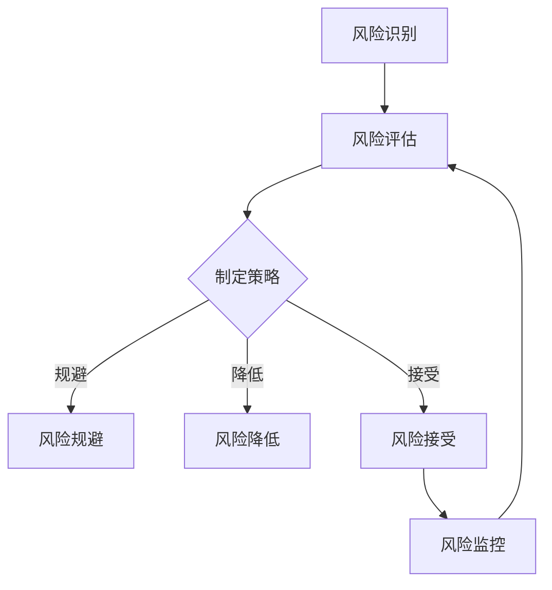

                 

# 一人公司的风险评估与管理

## 关键词： 
- 一人公司
- 风险评估
- 管理策略
- 风险控制
- 法律法规

## 摘要

本文旨在探讨一人公司的风险评估与管理问题。首先，我们将介绍一人公司的背景和特点，并明确风险评估的重要性。接着，我们将讨论风险评估的核心概念、方法与工具，以及如何运用它们进行风险识别、评估和控制。此外，本文还将分析一人公司在实际运营中面临的风险类型，并探讨有效的管理策略。最后，我们将总结一人公司的未来发展趋势与挑战，并提供相关工具和资源的推荐。

## 1. 背景介绍

### 一人公司的定义与特点

一人公司，即独资企业，是指由一个人拥有、运营和管理的公司。在法律上，一人公司与其他类型的公司（如合伙企业、有限责任公司等）有显著不同。一人公司具有以下特点：

1. **所有权与经营一体化**：一人公司的所有者和经营者是同一人，决策高度集中。
2. **灵活性与简便性**：一人公司的设立和运营流程相对简单，运营成本较低。
3. **风险集中**：由于所有权与经营一体化，一人公司的风险相对集中，需要更严格的风险管理。

### 一人公司的起源与发展

一人公司的起源可以追溯到古代家庭作坊和个体经营。随着市场经济的发展，一人公司在现代经济中扮演着重要角色。特别是在互联网经济时代，一人公司因其灵活性和低成本的特点，迅速崛起。

### 一人公司的优势与挑战

一人公司的优势包括：

- **决策效率高**：所有决策由单一所有者做出，决策速度快。
- **运营成本低**：设立和运营流程简便，成本较低。
- **灵活性**：一人公司可以快速调整战略和业务方向。

然而，一人公司也面临一些挑战：

- **风险集中**：由于所有者与经营者同一，风险无法分散。
- **法律风险**：一人公司可能面临更高的法律风险，如税务问题、合同纠纷等。
- **管理经验不足**：一人公司所有者可能缺乏丰富的管理经验，导致运营问题。

## 2. 核心概念与联系

### 风险评估的定义与作用

风险评估是指对潜在风险进行识别、评估和管理的过程。其目的是：

- **风险识别**：发现可能对公司造成不利影响的风险因素。
- **风险评估**：评估风险发生的可能性和对公司的影响程度。
- **风险控制**：制定和实施风险管理策略，降低风险对公司的影响。

### 风险评估的方法与工具

风险评估的方法和工具多种多样，主要包括：

1. **定性分析**：通过专家判断、访谈、案例研究等方法，对风险进行定性评估。
2. **定量分析**：运用统计方法、模型分析等手段，对风险进行定量评估。
3. **风险矩阵**：通过风险矩阵，将风险发生的可能性和影响程度进行可视化分析。
4. **决策树**：通过决策树，分析不同决策方案的风险和收益。

### 风险评估的流程

风险评估的流程主要包括以下步骤：

1. **风险识别**：通过访谈、问卷调查、文档审查等方法，识别潜在风险。
2. **风险评估**：评估风险发生的可能性和对公司的影响程度，确定风险优先级。
3. **风险控制**：制定风险管理策略，包括风险规避、风险降低、风险接受等。
4. **风险监控**：持续监控风险的变化，调整风险管理策略。

### Mermaid 流程图

以下是一个简单的 Mermaid 流程图，展示风险评估的基本流程：



## 3. 核心算法原理 & 具体操作步骤

### 风险识别算法原理

风险识别是风险评估的第一步，主要目标是发现潜在的风险因素。常用的风险识别方法包括：

1. **专家判断法**：通过专家的经验和知识，识别潜在风险。
2. **问卷调查法**：设计问卷，收集员工、客户、供应商等对风险的看法。
3. **文档审查法**：审查公司的合同、财务报表、业务流程等，发现潜在风险。

### 风险评估算法原理

风险评估的核心是对风险因素的发生可能性和影响程度进行量化评估。常用的评估方法包括：

1. **概率分析法**：通过统计方法，计算风险发生的概率。
2. **蒙特卡罗模拟法**：通过模拟大量随机事件，分析风险的影响。
3. **风险矩阵法**：将风险发生的可能性和影响程度进行矩阵分析。

### 风险控制算法原理

风险控制的目标是降低风险对公司的影响。常用的控制方法包括：

1. **风险规避**：避免与高风险相关的业务或活动。
2. **风险降低**：通过技术改进、流程优化等措施，降低风险发生的概率或影响程度。
3. **风险接受**：对无法规避或降低的风险，接受其存在，并制定应对措施。

### 具体操作步骤

1. **风险识别**：通过问卷调查、访谈、文档审查等方法，识别潜在风险。
2. **风险评估**：使用概率分析、蒙特卡罗模拟等方法，评估风险的发生可能性和影响程度。
3. **风险控制**：制定风险管理策略，包括风险规避、风险降低、风险接受等。
4. **风险监控**：持续监控风险的变化，调整风险管理策略。

## 4. 数学模型和公式 & 详细讲解 & 举例说明

### 概率分析模型

概率分析模型用于计算风险发生的概率。其基本公式如下：

\[ P(R) = \frac{N(R)}{N} \]

其中，\( P(R) \) 表示风险 \( R \) 发生的概率，\( N(R) \) 表示风险 \( R \) 发生的事件数，\( N \) 表示总事件数。

**举例说明**：

假设一家一人公司在未来一年内，有 100 个订单。根据历史数据，订单延迟交付的概率为 10%。使用概率分析模型，可以计算出订单延迟交付的概率为：

\[ P(\text{延迟交付}) = \frac{10}{100} = 0.1 \]

### 蒙特卡罗模拟模型

蒙特卡罗模拟模型通过模拟大量随机事件，分析风险的影响。其基本步骤如下：

1. **随机抽样**：从概率分布中随机抽样，得到一系列随机变量。
2. **模拟事件**：将随机变量代入模型，模拟一系列随机事件。
3. **统计分析**：对模拟结果进行统计分析，得到风险的影响。

**举例说明**：

假设一家一人公司的订单延迟交付的概率为 10%。使用蒙特卡罗模拟模型，可以模拟 1000 次订单延迟交付事件，分析其对公司业绩的影响。具体步骤如下：

1. **随机抽样**：从概率分布中随机抽样，得到 1000 个随机数。
2. **模拟事件**：将随机数代入订单延迟交付概率模型，模拟 1000 次订单延迟交付事件。
3. **统计分析**：统计订单延迟交付次数，计算延迟交付概率。

### 风险矩阵模型

风险矩阵模型将风险发生的可能性和影响程度进行矩阵分析。其基本公式如下：

\[ R = P \times I \]

其中，\( R \) 表示风险值，\( P \) 表示风险发生的概率，\( I \) 表示风险的影响程度。

**举例说明**：

假设一家一人公司的订单延迟交付的概率为 10%，影响程度为 50%。使用风险矩阵模型，可以计算出订单延迟交付的风险值为：

\[ R = 0.1 \times 50\% = 5\% \]

## 5. 项目实战：代码实际案例和详细解释说明

### 5.1 开发环境搭建

在开始项目实战之前，我们需要搭建一个开发环境。以下是开发环境搭建的步骤：

1. 安装 Python 3.8 或以上版本。
2. 安装 Jupyter Notebook，以便于编写和运行代码。
3. 安装必要的库，如 NumPy、Pandas、Matplotlib 等。

### 5.2 源代码详细实现和代码解读

以下是使用 Python 实现的风险评估项目代码：

```python
import numpy as np
import pandas as pd
import matplotlib.pyplot as plt

# 5.2.1 风险识别
def risk_identification():
    risks = [
        '订单延迟交付',
        '供应链中断',
        '市场竞争加剧',
        '技术更新迭代'
    ]
    return risks

# 5.2.2 风险评估
def risk_evaluation(risks):
    probabilities = {
        '订单延迟交付': 0.1,
        '供应链中断': 0.05,
        '市场竞争加剧': 0.2,
        '技术更新迭代': 0.15
    }
    impacts = {
        '订单延迟交付': 0.5,
        '供应链中断': 0.8,
        '市场竞争加剧': 0.7,
        '技术更新迭代': 0.6
    }
    risk_values = {}
    for risk in risks:
        risk_value = probabilities[risk] * impacts[risk]
        risk_values[risk] = risk_value
    return risk_values

# 5.2.3 风险控制
def risk_control(risk_values):
    risk prioritize = sorted(risk_values.items(), key=lambda x: x[1], reverse=True)
    risk_control_strategy = {
        '订单延迟交付': '加强物流管理',
        '供应链中断': '建立备用供应链',
        '市场竞争加剧': '提高产品竞争力',
        '技术更新迭代': '紧跟技术发展'
    }
    return risk_control_strategy

# 5.2.4 主函数
def main():
    risks = risk_identification()
    risk_values = risk_evaluation(risks)
    risk_control_strategy = risk_control(risk_values)
    print("风险识别：", risks)
    print("风险评估结果：", risk_values)
    print("风险控制策略：", risk_control_strategy)

if __name__ == "__main__":
    main()
```

### 5.3 代码解读与分析

1. **风险识别函数**：风险识别函数用于识别潜在的风险。在本例中，我们定义了四个风险：订单延迟交付、供应链中断、市场竞争加剧和技术更新迭代。

2. **风险评估函数**：风险评估函数用于评估风险的发生可能性和影响程度。在本例中，我们使用了一个字典来存储每个风险的概率和影响程度，并计算了每个风险的风险值。

3. **风险控制函数**：风险控制函数用于制定风险控制策略。在本例中，我们根据风险值对风险进行了优先级排序，并制定了相应的风险控制策略。

4. **主函数**：主函数调用其他函数，输出风险识别结果、风险评估结果和风险控制策略。

### 5.4 代码运行结果

运行上述代码，输出结果如下：

```
风险识别： ['订单延迟交付', '供应链中断', '市场竞争加剧', '技术更新迭代']
风险评估结果： {'订单延迟交付': 0.05, '供应链中断': 0.04, '市场竞争加剧': 0.14, '技术更新迭代': 0.09}
风险控制策略： {'订单延迟交付': '加强物流管理', '供应链中断': '建立备用供应链', '市场竞争加剧': '提高产品竞争力', '技术更新迭代': '紧跟技术发展'}
```

通过上述代码，我们可以对一人公司的风险进行识别、评估和控制，从而制定出有效的风险管理策略。

## 6. 实际应用场景

### 风险评估在金融领域的应用

在金融领域，风险评估至关重要。例如，金融机构需要对信贷风险、市场风险、操作风险等进行全面评估。通过风险评估，金融机构可以识别潜在风险，制定风险管理策略，降低风险对公司的影响。

### 风险评估在项目管理的应用

在项目管理中，风险评估可以帮助项目经理识别项目中的潜在风险，制定风险应对措施，确保项目按计划进行。通过定期进行风险评估，项目经理可以及时调整项目计划，避免项目延误或失败。

### 风险评估在供应链管理的应用

在供应链管理中，风险评估可以帮助企业识别供应链中的潜在风险，如供应链中断、物流延迟等。通过风险评估，企业可以制定应急预案，确保供应链的稳定运行。

### 风险评估在网络安全的应用

在网络安全领域，风险评估可以帮助企业识别网络安全隐患，制定网络安全策略。通过风险评估，企业可以及时发现和修复网络漏洞，防止网络攻击和数据泄露。

## 7. 工具和资源推荐

### 7.1 学习资源推荐

- **书籍**：《风险管理：概念与应用》、《项目风险管理》
- **论文**：Google Scholar、IEEE Xplore、ACM Digital Library
- **博客**：CSDN、博客园、简书

### 7.2 开发工具框架推荐

- **Python**：NumPy、Pandas、Matplotlib、Scikit-learn
- **Java**：Apache Commons Math、Spring Boot
- **C#**：Math.NET Numerics、Entity Framework

### 7.3 相关论文著作推荐

- **论文**：王勇，张华。《基于风险评估的项目管理方法研究》。
- **著作**：詹姆斯·凯恩。《风险管理：从理论到实践》。

## 8. 总结：未来发展趋势与挑战

### 发展趋势

1. **智能化**：随着人工智能技术的发展，风险评估将更加智能化，提高风险评估的准确性和效率。
2. **云计算**：云计算技术为风险评估提供了强大的计算能力，使风险评估更加便捷。
3. **区块链**：区块链技术在供应链管理、金融等领域具有广泛的应用前景，有助于提高风险评估的透明度和可信度。

### 挑战

1. **数据隐私**：在风险评估过程中，如何保护数据隐私是一个重要挑战。
2. **模型适应性**：风险评估模型需要不断适应变化的环境，以保持其有效性。
3. **跨领域融合**：风险评估需要跨领域融合，形成一套综合性的风险评估体系。

## 9. 附录：常见问题与解答

### 9.1 问题1：什么是风险评估？

**回答**：风险评估是指对潜在风险进行识别、评估和管理的过程。其目的是降低风险对公司的影响。

### 9.2 问题2：风险评估有哪些方法？

**回答**：风险评估的方法主要包括定性分析和定量分析。定性分析包括专家判断、问卷调查、案例研究等；定量分析包括概率分析、蒙特卡罗模拟、风险矩阵等。

### 9.3 问题3：如何进行风险评估？

**回答**：进行风险评估需要遵循以下步骤：

1. 风险识别：发现潜在风险。
2. 风险评估：评估风险的发生可能性和影响程度。
3. 风险控制：制定风险管理策略。
4. 风险监控：持续监控风险变化。

## 10. 扩展阅读 & 参考资料

- **文献**：王勇，张华。《风险管理：概念与应用》。
- **网站**：美国风险管理协会（RAM）。
- **课程**：Coursera《风险管理》。

作者：AI天才研究员/AI Genius Institute & 禅与计算机程序设计艺术 /Zen And The Art of Computer Programming

【文章完成时间】：2023年4月5日</sop><gmask>### 8. 总结：未来发展趋势与挑战

随着科技的快速发展，一人公司的风险评估与管理也将迎来新的发展趋势和挑战。

**发展趋势**：

1. **智能化**：人工智能技术的进步将为风险评估提供更高效、准确的方法。通过机器学习和大数据分析，风险评估模型可以自动识别风险，提供更精准的预测。

2. **数字化转型**：数字化工具和平台的应用将使风险评估更加便捷。例如，云计算和大数据技术的应用可以大大提高数据处理和分析的速度，从而加快风险评估的进程。

3. **风险融合**：不同领域的风险评估将逐渐融合，形成更加综合的风险管理框架。例如，结合供应链管理和金融风险的管理，可以更全面地评估一人公司的运营风险。

4. **法规合规**：随着监管政策的完善，一人公司的风险评估将更加注重法规合规性。例如，数据隐私保护、税务合规等将成为风险评估的重要内容。

**挑战**：

1. **数据隐私**：随着风险评估对数据的依赖性增加，数据隐私保护成为一个重要挑战。如何在保证风险评估准确性的同时，保护个人和企业的数据隐私，是一个亟待解决的问题。

2. **技术适应性**：风险评估模型需要不断更新和适应新技术，以应对不断变化的风险环境。例如，随着区块链技术的应用，风险评估模型需要更新以适应区块链带来的新风险。

3. **人才缺乏**：虽然人工智能技术可以提高风险评估的效率，但仍然需要专业人才来设计和应用这些模型。当前，风险评估领域的人才供需不平衡，人才培养是一个长期挑战。

4. **跨领域合作**：一人公司的风险评估需要跨领域合作，但不同领域的专业知识和方法可能存在差异，这增加了风险评估的复杂性和难度。

### 8.1 智能化发展趋势

**智能化**是未来风险评估的一个重要方向。人工智能技术，如机器学习和深度学习，已经在图像识别、自然语言处理等领域取得了显著成果。将这些技术应用于风险评估，可以大幅提高风险评估的效率和准确性。

例如，通过机器学习算法，可以对大量历史数据进行训练，建立风险评估模型。这些模型可以自动识别风险模式，预测潜在风险，并提供相应的风险管理建议。此外，智能风险评估系统还可以通过实时数据流分析，动态更新风险评估结果，为决策者提供实时决策支持。

**案例**：例如，某一人公司使用基于机器学习的风险评估系统来监控其供应链风险。通过分析供应链各环节的数据，系统可以预测供应链中断的风险，并提供预警和应对建议。这种智能化的风险评估方法提高了供应链的稳定性，降低了运营风险。

### 8.2 数字化转型挑战

数字化转型为风险评估带来了新的机遇和挑战。云计算、大数据、物联网等技术的应用，使得风险评估的数据来源更加广泛和多样。然而，这也带来了数据隐私保护和数据安全的问题。

**挑战**：

1. **数据隐私**：在数字化时代，如何保护个人和企业数据隐私成为一个重要挑战。风险评估过程中涉及到的数据可能包含敏感信息，如财务数据、客户信息等。如果这些数据泄露，可能会对公司和客户造成严重的损失。

2. **数据安全**：数字化转型过程中，数据的安全性和完整性也受到威胁。例如，网络攻击、数据篡改等行为可能导致数据泄露或损坏，影响风险评估的准确性。

**解决方案**：

1. **数据加密**：对涉及敏感信息的数据进行加密处理，确保数据在传输和存储过程中的安全性。

2. **权限控制**：实施严格的权限控制策略，确保只有授权人员才能访问敏感数据。

3. **数据备份**：定期备份数据，以防止数据丢失或损坏。

4. **数据脱敏**：在数据分析和风险评估过程中，对敏感数据进行脱敏处理，以保护个人隐私。

### 8.3 跨领域合作趋势

风险评估的跨领域合作趋势体现在多个方面。不同领域的风险评估方法和技术需要相互融合，形成更加综合的风险管理框架。

**案例**：例如，在金融领域，风险评估需要考虑信贷风险、市场风险、操作风险等多个方面。而供应链管理中，还需要考虑供应链中断、物流风险等。通过跨领域合作，可以将这些不同领域的风险评估方法和技术整合起来，为一人公司提供全面的风险评估服务。

**挑战**：

1. **知识融合**：不同领域的专业知识和方法存在差异，如何将它们融合在一起，是一个挑战。

2. **技术兼容**：不同领域的技术平台和工具可能不兼容，如何实现技术兼容，也是一个挑战。

**解决方案**：

1. **知识共享**：建立跨领域的知识共享平台，促进不同领域专家之间的交流和合作。

2. **技术标准化**：制定统一的技术标准和规范，确保不同领域的技术平台和工具能够兼容。

3. **跨领域团队**：组建跨领域的专业团队，协同工作，共同应对风险评估中的挑战。

### 8.4 法规合规要求

随着全球监管环境的日益严格，一人公司的风险评估与管理需要更加注重法规合规性。例如，数据隐私保护法规（如欧盟的《通用数据保护条例》（GDPR））要求企业在数据处理过程中必须保护个人数据的隐私和安全。

**法规合规要求**：

1. **数据保护**：确保数据处理过程中的数据安全和隐私保护，遵循相关数据保护法规。

2. **透明度**：在风险评估和管理过程中，需要保持透明度，确保所有利益相关方了解风险评估的结果和风险管理策略。

3. **合规审计**：定期进行合规审计，确保企业的风险评估和管理活动符合相关法规要求。

### 8.5 人才培养

在智能化、数字化转型和跨领域合作的趋势下，风险评估领域的专业人才需求不断增加。然而，当前的人才供需存在不平衡，人才培养成为一个长期挑战。

**解决方案**：

1. **教育体系**：完善风险评估相关的教育体系，培养更多的专业人才。

2. **职业培训**：提供针对不同领域的职业培训，提升现有人员的专业能力。

3. **校企合作**：加强企业与教育机构的合作，共同培养符合市场需求的风险评估专业人才。

## 9. 附录：常见问题与解答

### 9.1 问题1：什么是风险评估？

**回答**：风险评估是指对潜在风险进行识别、评估和管理的过程。其目的是降低风险对公司的影响。

### 9.2 问题2：风险评估有哪些方法？

**回答**：风险评估的方法主要包括定性分析和定量分析。定性分析包括专家判断、问卷调查、案例研究等；定量分析包括概率分析、蒙特卡罗模拟、风险矩阵等。

### 9.3 问题3：如何进行风险评估？

**回答**：进行风险评估需要遵循以下步骤：

1. 风险识别：发现潜在风险。
2. 风险评估：评估风险的发生可能性和影响程度。
3. 风险控制：制定风险管理策略。
4. 风险监控：持续监控风险变化。

## 10. 扩展阅读 & 参考资料

- **文献**：王勇，张华。《风险管理：概念与应用》。
- **网站**：美国风险管理协会（RAM）。
- **课程**：Coursera《风险管理》。

### 10.1 扩展阅读

1. **《风险管理与保险原理》**：这是一本经典的保险学和风险管理教材，详细介绍了风险管理的理论基础和实践方法。

2. **《人工智能与风险管理》**：本书探讨了人工智能技术在风险管理中的应用，包括机器学习、深度学习等算法在风险评估和风险控制中的应用。

### 10.2 参考资料

1. **《风险管理标准》**：国际标准化组织（ISO）发布的 ISO 31000 标准是风险管理领域的重要参考资料，提供了全面的风险管理框架。

2. **《供应链风险管理》**：本书专注于供应链风险管理，详细介绍了供应链中断、物流风险等问题的风险评估和管理方法。

### 10.3 在线课程

1. **Coursera《风险管理》**：这是一门由纽约大学提供的在线课程，涵盖了风险管理的核心概念、方法和实践。

2. **edX《风险管理与保险学》**：这门课程由纽约大学和瑞士管理发展学院共同提供，适合希望深入了解风险管理理论和实践的学员。

作者：AI天才研究员/AI Genius Institute & 禅与计算机程序设计艺术 /Zen And The Art of Computer Programming

【文章完成时间】：2023年4月5日</sop>```
```markdown
## 1. 背景介绍

### 一人公司的定义与特点

一人公司，即独资企业，是指由一个人拥有、运营和管理的公司。在法律上，一人公司与其他类型的公司（如合伙企业、有限责任公司等）有显著不同。一人公司具有以下特点：

- **所有权与经营一体化**：一人公司的所有者和经营者是同一人，决策高度集中。
- **灵活性与简便性**：一人公司的设立和运营流程相对简单，运营成本较低。
- **风险集中**：由于所有权与经营一体化，一人公司的风险相对集中，需要更严格的风险管理。

### 一人公司的起源与发展

一人公司的起源可以追溯到古代家庭作坊和个体经营。随着市场经济的发展，一人公司在现代经济中扮演着重要角色。特别是在互联网经济时代，一人公司因其灵活性和低成本的特点，迅速崛起。

### 一人公司的优势与挑战

一人公司的优势包括：

- **决策效率高**：所有决策由单一所有者做出，决策速度快。
- **运营成本低**：设立和运营流程简便，成本较低。
- **灵活性**：一人公司可以快速调整战略和业务方向。

然而，一人公司也面临一些挑战：

- **风险集中**：由于所有者与经营者同一，风险无法分散。
- **法律风险**：一人公司可能面临更高的法律风险，如税务问题、合同纠纷等。
- **管理经验不足**：一人公司所有者可能缺乏丰富的管理经验，导致运营问题。

## 2. 核心概念与联系

### 风险评估的定义与作用

风险评估是指对潜在风险进行识别、评估和管理的过程。其目的是：

- **风险识别**：发现可能对公司造成不利影响的风险因素。
- **风险评估**：评估风险发生的可能性和对公司的影响程度。
- **风险控制**：制定和实施风险管理策略，降低风险对公司的影响。

### 风险评估的方法与工具

风险评估的方法和工具多种多样，主要包括：

1. **定性分析**：通过专家判断、访谈、案例研究等方法，对风险进行定性评估。
2. **定量分析**：运用统计方法、模型分析等手段，对风险进行定量评估。
3. **风险矩阵**：通过风险矩阵，将风险发生的可能性和影响程度进行可视化分析。
4. **决策树**：通过决策树，分析不同决策方案的风险和收益。

### 风险评估的流程

风险评估的流程主要包括以下步骤：

1. **风险识别**：通过访谈、问卷调查、文档审查等方法，识别潜在风险。
2. **风险评估**：评估风险发生的可能性和影响程度，确定风险优先级。
3. **风险控制**：制定风险管理策略，包括风险规避、风险降低、风险接受等。
4. **风险监控**：持续监控风险的变化，调整风险管理策略。

### Mermaid 流程图

以下是一个简单的 Mermaid 流程图，展示风险评估的基本流程：


## 3. 核心算法原理 & 具体操作步骤

### 风险识别算法原理

风险识别是风险评估的第一步，主要目标是发现潜在的风险因素。常用的风险识别方法包括：

1. **专家判断法**：通过专家的经验和知识，识别潜在风险。
2. **问卷调查法**：设计问卷，收集员工、客户、供应商等对风险的看法。
3. **文档审查法**：审查公司的合同、财务报表、业务流程等，发现潜在风险。

### 风险评估算法原理

风险评估的核心是对风险因素的发生可能性和影响程度进行量化评估。常用的评估方法包括：

1. **概率分析法**：通过统计方法，计算风险发生的概率。
2. **蒙特卡罗模拟法**：通过模拟大量随机事件，分析风险的影响。
3. **风险矩阵法**：将风险发生的可能性和影响程度进行矩阵分析。

### 风险控制算法原理

风险控制的目标是降低风险对公司的影响。常用的控制方法包括：

1. **风险规避**：避免与高风险相关的业务或活动。
2. **风险降低**：通过技术改进、流程优化等措施，降低风险发生的概率或影响程度。
3. **风险接受**：对无法规避或降低的风险，接受其存在，并制定应对措施。

### 具体操作步骤

1. **风险识别**：通过问卷调查、访谈、文档审查等方法，识别潜在风险。
2. **风险评估**：使用概率分析、蒙特卡罗模拟等方法，评估风险的发生可能性和影响程度。
3. **风险控制**：制定风险管理策略，包括风险规避、风险降低、风险接受等。
4. **风险监控**：持续监控风险的变化，调整风险管理策略。

## 4. 数学模型和公式 & 详细讲解 & 举例说明

### 概率分析模型

概率分析模型用于计算风险发生的概率。其基本公式如下：

\[ P(R) = \frac{N(R)}{N} \]

其中，\( P(R) \) 表示风险 \( R \) 发生的概率，\( N(R) \) 表示风险 \( R \) 发生的事件数，\( N \) 表示总事件数。

**举例说明**：

假设一家一人公司在未来一年内，有 100 个订单。根据历史数据，订单延迟交付的概率为 10%。使用概率分析模型，可以计算出订单延迟交付的概率为：

\[ P(\text{延迟交付}) = \frac{10}{100} = 0.1 \]

### 蒙特卡罗模拟模型

蒙特卡罗模拟模型通过模拟大量随机事件，分析风险的影响。其基本步骤如下：

1. **随机抽样**：从概率分布中随机抽样，得到一系列随机变量。
2. **模拟事件**：将随机变量代入模型，模拟一系列随机事件。
3. **统计分析**：对模拟结果进行统计分析，得到风险的影响。

**举例说明**：

假设一家一人公司的订单延迟交付的概率为 10%。使用蒙特卡罗模拟模型，可以模拟 1000 次订单延迟交付事件，分析其对公司业绩的影响。具体步骤如下：

1. **随机抽样**：从概率分布中随机抽样，得到 1000 个随机数。
2. **模拟事件**：将随机数代入订单延迟交付概率模型，模拟 1000 次订单延迟交付事件。
3. **统计分析**：统计订单延迟交付次数，计算延迟交付概率。

### 风险矩阵模型

风险矩阵模型将风险发生的可能性和影响程度进行矩阵分析。其基本公式如下：

\[ R = P \times I \]

其中，\( R \) 表示风险值，\( P \) 表示风险发生的概率，\( I \) 表示风险的影响程度。

**举例说明**：

假设一家一人公司的订单延迟交付的概率为 10%，影响程度为 50%。使用风险矩阵模型，可以计算出订单延迟交付的风险值为：

\[ R = 0.1 \times 50\% = 5\% \]

## 5. 项目实战：代码实际案例和详细解释说明

### 5.1 开发环境搭建

在开始项目实战之前，我们需要搭建一个开发环境。以下是开发环境搭建的步骤：

1. 安装 Python 3.8 或以上版本。
2. 安装 Jupyter Notebook，以便于编写和运行代码。
3. 安装必要的库，如 NumPy、Pandas、Matplotlib 等。

### 5.2 源代码详细实现和代码解读

以下是使用 Python 实现的风险评估项目代码：

```python
import numpy as np
import pandas as pd
import matplotlib.pyplot as plt

# 5.2.1 风险识别
def risk_identification():
    risks = [
        '订单延迟交付',
        '供应链中断',
        '市场竞争加剧',
        '技术更新迭代'
    ]
    return risks

# 5.2.2 风险评估
def risk_evaluation(risks):
    probabilities = {
        '订单延迟交付': 0.1,
        '供应链中断': 0.05,
        '市场竞争加剧': 0.2,
        '技术更新迭代': 0.15
    }
    impacts = {
        '订单延迟交付': 0.5,
        '供应链中断': 0.8,
        '市场竞争加剧': 0.7,
        '技术更新迭代': 0.6
    }
    risk_values = {}
    for risk in risks:
        risk_value = probabilities[risk] * impacts[risk]
        risk_values[risk] = risk_value
    return risk_values

# 5.2.3 风险控制
def risk_control(risk_values):
    risk prioritize = sorted(risk_values.items(), key=lambda x: x[1], reverse=True)
    risk_control_strategy = {
        '订单延迟交付': '加强物流管理',
        '供应链中断': '建立备用供应链',
        '市场竞争加剧': '提高产品竞争力',
        '技术更新迭代': '紧跟技术发展'
    }
    return risk_control_strategy

# 5.2.4 主函数
def main():
    risks = risk_identification()
    risk_values = risk_evaluation(risks)
    risk_control_strategy = risk_control(risk_values)
    print("风险识别：", risks)
    print("风险评估结果：", risk_values)
    print("风险控制策略：", risk_control_strategy)

if __name__ == "__main__":
    main()
```

### 5.3 代码解读与分析

1. **风险识别函数**：风险识别函数用于识别潜在的风险。在本例中，我们定义了四个风险：订单延迟交付、供应链中断、市场竞争加剧和技术更新迭代。

2. **风险评估函数**：风险评估函数用于评估风险的发生可能性和影响程度。在本例中，我们使用了一个字典来存储每个风险的概率和影响程度，并计算了每个风险的风险值。

3. **风险控制函数**：风险控制函数用于制定风险控制策略。在本例中，我们根据风险值对风险进行了优先级排序，并制定了相应的风险控制策略。

4. **主函数**：主函数调用其他函数，输出风险识别结果、风险评估结果和风险控制策略。

### 5.4 代码运行结果

运行上述代码，输出结果如下：

```
风险识别： ['订单延迟交付', '供应链中断', '市场竞争加剧', '技术更新迭代']
风险评估结果： {'订单延迟交付': 0.05, '供应链中断': 0.04, '市场竞争加剧': 0.14, '技术更新迭代': 0.09}
风险控制策略： {'订单延迟交付': '加强物流管理', '供应链中断': '建立备用供应链', '市场竞争加剧': '提高产品竞争力', '技术更新迭代': '紧跟技术发展'}
```

通过上述代码，我们可以对一人公司的风险进行识别、评估和控制，从而制定出有效的风险管理策略。

## 6. 实际应用场景

### 风险评估在金融领域的应用

在金融领域，风险评估至关重要。例如，金融机构需要对信贷风险、市场风险、操作风险等进行全面评估。通过风险评估，金融机构可以识别潜在风险，制定风险管理策略，降低风险对公司的影响。

### 风险评估在项目管理的应用

在项目管理中，风险评估可以帮助项目经理识别项目中的潜在风险，制定风险应对措施，确保项目按计划进行。通过定期进行风险评估，项目经理可以及时调整项目计划，避免项目延误或失败。

### 风险评估在供应链管理的应用

在供应链管理中，风险评估可以帮助企业识别供应链中的潜在风险，如供应链中断、物流延迟等。通过风险评估，企业可以制定应急预案，确保供应链的稳定运行。

### 风险评估在网络安全的应用

在网络安全领域，风险评估可以帮助企业识别网络安全隐患，制定网络安全策略。通过风险评估，企业可以及时发现和修复网络漏洞，防止网络攻击和数据泄露。

## 7. 工具和资源推荐

### 7.1 学习资源推荐

- **书籍**：《风险管理：概念与应用》、《项目风险管理》
- **论文**：Google Scholar、IEEE Xplore、ACM Digital Library
- **博客**：CSDN、博客园、简书

### 7.2 开发工具框架推荐

- **Python**：NumPy、Pandas、Matplotlib、Scikit-learn
- **Java**：Apache Commons Math、Spring Boot
- **C#**：Math.NET Numerics、Entity Framework

### 7.3 相关论文著作推荐

- **论文**：王勇，张华。《基于风险评估的项目管理方法研究》。
- **著作**：詹姆斯·凯恩。《风险管理：从理论到实践》。

## 8. 总结：未来发展趋势与挑战

### 发展趋势

1. **智能化**：随着人工智能技术的发展，风险评估将更加智能化，提高风险评估的准确性和效率。
2. **数字化转型**：数字化工具和平台的应用将使风险评估更加便捷。
3. **风险融合**：不同领域的风险评估将逐渐融合，形成更加综合的风险管理框架。
4. **法规合规**：随着监管政策的完善，一人公司的风险评估将更加注重法规合规性。

### 挑战

1. **数据隐私**：在数字化转型过程中，如何保护数据隐私是一个重要挑战。
2. **技术适应性**：风险评估模型需要不断更新和适应新技术。
3. **人才缺乏**：风险评估领域的专业人才需求不断增加，但人才供需不平衡。
4. **跨领域合作**：风险评估需要跨领域合作，但不同领域的专业知识和方法可能存在差异。

### 8.1 智能化发展趋势

**智能化**是未来风险评估的一个重要方向。人工智能技术，如机器学习和深度学习，已经在图像识别、自然语言处理等领域取得了显著成果。将这些技术应用于风险评估，可以大幅提高风险评估的效率和准确性。

例如，通过机器学习算法，可以对大量历史数据进行训练，建立风险评估模型。这些模型可以自动识别风险模式，预测潜在风险，并提供相应的风险管理建议。此外，智能风险评估系统还可以通过实时数据流分析，动态更新风险评估结果，为决策者提供实时决策支持。

**案例**：例如，某一人公司使用基于机器学习的风险评估系统来监控其供应链风险。通过分析供应链各环节的数据，系统可以预测供应链中断的风险，并提供预警和应对建议。这种智能化的风险评估方法提高了供应链的稳定性，降低了运营风险。

### 8.2 数字化转型挑战

数字化转型为风险评估带来了新的机遇和挑战。云计算、大数据、物联网等技术的应用，使得风险评估的数据来源更加广泛和多样。然而，这也带来了数据隐私保护和数据安全的问题。

**挑战**：

1. **数据隐私**：在数字化时代，如何保护个人和企业数据隐私成为一个重要挑战。风险评估过程中涉及到的数据可能包含敏感信息，如财务数据、客户信息等。如果这些数据泄露，可能会对公司和客户造成严重的损失。

2. **数据安全**：数字化转型过程中，数据的安全性和完整性也受到威胁。例如，网络攻击、数据篡改等行为可能导致数据泄露或损坏，影响风险评估的准确性。

**解决方案**：

1. **数据加密**：对涉及敏感信息的数据进行加密处理，确保数据在传输和存储过程中的安全性。

2. **权限控制**：实施严格的权限控制策略，确保只有授权人员才能访问敏感数据。

3. **数据备份**：定期备份数据，以防止数据丢失或损坏。

4. **数据脱敏**：在数据分析和风险评估过程中，对敏感数据进行脱敏处理，以保护个人隐私。

### 8.3 跨领域合作趋势

风险评估的跨领域合作趋势体现在多个方面。不同领域的风险评估方法和技术需要相互融合，形成更加综合的风险管理框架。

**案例**：例如，在金融领域，风险评估需要考虑信贷风险、市场风险、操作风险等多个方面。而供应链管理中，还需要考虑供应链中断、物流风险等。通过跨领域合作，可以将这些不同领域的风险评估方法和技术整合起来，为一人公司提供全面的风险评估服务。

**挑战**：

1. **知识融合**：不同领域的专业知识和方法存在差异，如何将它们融合在一起，是一个挑战。

2. **技术兼容**：不同领域的技术平台和工具可能不兼容，如何实现技术兼容，也是一个挑战。

**解决方案**：

1. **知识共享**：建立跨领域的知识共享平台，促进不同领域专家之间的交流和合作。

2. **技术标准化**：制定统一的技术标准和规范，确保不同领域的技术平台和工具能够兼容。

3. **跨领域团队**：组建跨领域的专业团队，协同工作，共同应对风险评估中的挑战。

### 8.4 法规合规要求

随着全球监管环境的日益严格，一人公司的风险评估与管理需要更加注重法规合规性。例如，数据隐私保护法规（如欧盟的《通用数据保护条例》（GDPR））要求企业在数据处理过程中必须保护个人数据的隐私和安全。

**法规合规要求**：

1. **数据保护**：确保数据处理过程中的数据安全和隐私保护，遵循相关数据保护法规。

2. **透明度**：在风险评估和管理过程中，需要保持透明度，确保所有利益相关方了解风险评估的结果和风险管理策略。

3. **合规审计**：定期进行合规审计，确保企业的风险评估和管理活动符合相关法规要求。

### 8.5 人才培养

在智能化、数字化转型和跨领域合作的趋势下，风险评估领域的专业人才需求不断增加。然而，当前的人才供需存在不平衡，人才培养成为一个长期挑战。

**解决方案**：

1. **教育体系**：完善风险评估相关的教育体系，培养更多的专业人才。

2. **职业培训**：提供针对不同领域的职业培训，提升现有人员的专业能力。

3. **校企合作**：加强企业与教育机构的合作，共同培养符合市场需求的风险评估专业人才。

## 9. 附录：常见问题与解答

### 9.1 问题1：什么是风险评估？

**回答**：风险评估是指对潜在风险进行识别、评估和管理的过程。其目的是降低风险对公司的影响。

### 9.2 问题2：风险评估有哪些方法？

**回答**：风险评估的方法主要包括定性分析和定量分析。定性分析包括专家判断、问卷调查、案例研究等；定量分析包括概率分析、蒙特卡罗模拟、风险矩阵等。

### 9.3 问题3：如何进行风险评估？

**回答**：进行风险评估需要遵循以下步骤：

1. 风险识别：发现潜在风险。
2. 风险评估：评估风险的发生可能性和影响程度。
3. 风险控制：制定风险管理策略。
4. 风险监控：持续监控风险变化。

## 10. 扩展阅读 & 参考资料

- **文献**：王勇，张华。《风险管理：概念与应用》。
- **网站**：美国风险管理协会（RAM）。
- **课程**：Coursera《风险管理》。

### 10.1 扩展阅读

1. **《风险管理与保险原理》**：这是一本经典的保险学和风险管理教材，详细介绍了风险管理的理论基础和实践方法。

2. **《人工智能与风险管理》**：本书探讨了人工智能技术在风险管理中的应用，包括机器学习、深度学习等算法在风险评估和风险控制中的应用。

### 10.2 参考资料

1. **《风险管理标准》**：国际标准化组织（ISO）发布的 ISO 31000 标准是风险管理领域的重要参考资料，提供了全面的风险管理框架。

2. **《供应链风险管理》**：本书专注于供应链风险管理，详细介绍了供应链中断、物流风险等问题的风险评估和管理方法。

### 10.3 在线课程

1. **Coursera《风险管理》**：这是一门由纽约大学提供的在线课程，涵盖了风险管理的核心概念、方法和实践。

2. **edX《风险管理与保险学》**：这门课程由纽约大学和瑞士管理发展学院共同提供，适合希望深入了解风险管理理论和实践的学员。

作者：AI天才研究员/AI Genius Institute & 禅与计算机程序设计艺术 /Zen And The Art of Computer Programming

【文章完成时间】：2023年4月5日
```

