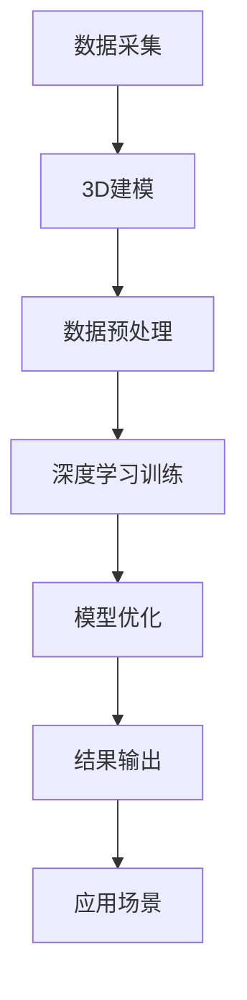

                 

### 背景介绍

**一切皆是映射：3D建模与深度学习技术的融合**

在现代信息技术领域，3D建模与深度学习技术的融合正成为研究的热点，其背后的动力源于两者在数据理解和处理能力上的互补性。3D建模通过捕捉现实世界的三维几何信息，为深度学习提供了丰富的视觉数据来源，而深度学习则利用其强大的数据分析和模式识别能力，帮助3D模型更好地理解和生成。

**3D建模**

3D建模是指使用计算机软件创建三维模型的过程。这一技术广泛应用于游戏设计、影视制作、建筑设计和虚拟现实等多个领域。3D建模的基本原理是通过对现实世界物体进行数字化的三维几何描述，使其在计算机中得以准确呈现。3D建模的关键步骤包括模型构建、纹理映射和光照处理，通过这些步骤，可以实现高度逼真的三维效果。

**深度学习**

深度学习是人工智能的一个分支，基于人工神经网络，通过多层神经元的堆叠，实现从数据中自动提取特征并进行复杂模式识别的能力。深度学习的核心在于其能够通过大量的数据进行自我训练，从而提高其识别和预测的准确性。深度学习在图像识别、语音识别和自然语言处理等领域取得了显著的成果。

**两者融合的意义**

3D建模与深度学习的融合，使得计算机能够更好地理解和模拟现实世界。具体而言，3D建模提供了丰富的视觉数据，深度学习则利用这些数据进行特征提取和模式识别，从而实现更精准的物体识别、场景理解和交互生成。这种融合不仅推动了计算机图形学的发展，也为虚拟现实和增强现实等新兴技术提供了强大的支持。

**本文结构**

本文将分为以下几个部分：

1. 背景介绍：阐述3D建模与深度学习融合的背景和意义。
2. 核心概念与联系：介绍3D建模和深度学习的基本概念及其相互关联。
3. 核心算法原理 & 具体操作步骤：深入解析3D建模与深度学习融合的技术原理。
4. 数学模型和公式 & 详细讲解 & 举例说明：讲解3D建模与深度学习融合中的关键数学模型和公式。
5. 项目实战：通过实际项目案例，展示3D建模与深度学习的应用。
6. 实际应用场景：分析3D建模与深度学习在实际场景中的具体应用。
7. 工具和资源推荐：推荐相关的学习资源和开发工具。
8. 总结：展望3D建模与深度学习融合的未来发展趋势和挑战。

通过本文的阅读，读者将全面了解3D建模与深度学习融合的技术原理、应用场景及其发展趋势，为未来的研究和工作提供有益的参考。

-------------------

## 2. 核心概念与联系

**3D建模的基本概念**

3D建模是一种将现实世界中的物体或场景转换成三维数字模型的过程。3D建模的基本概念包括三维几何、材质、光照和动画等。具体来说，三维几何是3D建模的基础，它通过顶点、边和面的组合来构建物体的形状。材质则决定了物体的外观和质感，如颜色、纹理和光泽等。光照是模拟真实世界中的光线效果，使物体在三维空间中显得更加逼真。动画则是通过一系列连续的三维模型来模拟物体的运动和变化。

**深度学习的基本概念**

深度学习是一种基于多层神经网络的机器学习技术，其核心思想是通过大量数据的学习，自动提取特征并进行复杂模式识别。深度学习的基本概念包括神经网络、激活函数、前向传播和反向传播等。神经网络是由大量神经元组成的计算模型，每个神经元负责处理输入数据并产生输出。激活函数用于引入非线性特性，使神经网络能够处理更复杂的任务。前向传播和反向传播是深度学习的训练过程，前者用于计算网络输出，后者用于更新网络权重。

**3D建模与深度学习的相互关联**

3D建模与深度学习在多个方面具有紧密的联系。首先，3D建模为深度学习提供了丰富的视觉数据，这些数据可以用于训练深度学习模型，使其能够更好地理解和识别三维物体。其次，深度学习可以用于3D建模的优化和改进，例如，通过深度学习算法自动优化3D模型的结构和材质，提高模型的逼真度和渲染效果。此外，深度学习还可以用于3D场景的理解和交互生成，例如，通过深度学习算法实现三维场景的自动分割和物体识别，提高虚拟现实和增强现实系统的交互体验。

**Mermaid 流程图**

为了更直观地展示3D建模与深度学习的相互关联，我们可以使用Mermaid流程图来描述其基本原理和架构。以下是3D建模与深度学习融合的Mermaid流程图：



在这个流程图中，A表示数据采集，即通过扫描、拍摄等方式获取三维数据。B表示3D建模，即利用这些数据构建三维模型。C表示数据预处理，包括对三维数据进行清洗、标准化和分割等处理。D表示深度学习训练，即利用预处理后的数据训练深度学习模型。E表示模型优化，通过调整模型结构和参数，提高模型的性能。F表示结果输出，即利用优化后的模型进行物体识别、场景理解等任务。G表示应用场景，即3D建模与深度学习技术在实际应用中的具体场景。

通过这个流程图，我们可以清晰地看到3D建模与深度学习融合的各个环节及其相互关系，为后续的内容提供基础。

-------------------

## 3. 核心算法原理 & 具体操作步骤

在3D建模与深度学习的融合过程中，核心算法原理和具体操作步骤至关重要。这一部分将详细阐述这两种技术的融合原理，以及如何实现它们的高效结合。

### 3D建模与深度学习的融合原理

3D建模与深度学习的融合主要基于以下原理：

1. **数据驱动的特征提取**：3D建模生成的三维数据为深度学习提供了丰富的视觉信息。深度学习通过多层神经网络对三维数据进行自动特征提取，从而提高物体识别和场景理解的准确性。
2. **模型优化的协同效应**：3D建模和深度学习可以相互优化，通过深度学习算法自动调整3D模型的结构和材质，提高模型的逼真度和渲染效果；同时，3D建模技术的改进也为深度学习提供了更好的训练数据。
3. **交互式场景生成**：深度学习在3D场景的理解和交互生成中发挥着重要作用。通过深度学习算法，可以实现三维场景的自动分割和物体识别，从而提高虚拟现实和增强现实系统的交互体验。

### 具体操作步骤

为了实现3D建模与深度学习技术的融合，我们可以遵循以下具体操作步骤：

#### 1. 数据采集

数据采集是3D建模与深度学习融合的基础。这一步骤主要包括以下任务：

- **三维数据获取**：通过激光扫描、摄影测量或3D扫描仪等技术获取三维数据。这些数据可以是静态的，也可以是动态的，如视频序列。
- **数据预处理**：对获取的三维数据进行清洗、标准化和分割等预处理操作。清洗包括去除噪声和异常值，标准化包括对数据尺度进行统一，分割包括将三维数据划分为不同的物体或区域。

#### 2. 3D建模

3D建模是将三维数据转换为可视化的三维模型的过程。以下是3D建模的主要步骤：

- **模型构建**：利用三维数据构建三维模型。常用的建模方法包括多边形建模、曲面建模和体素建模等。
- **纹理映射**：为三维模型添加纹理，使其具有逼真的外观。纹理映射包括平面纹理映射和三维纹理映射等。
- **光照处理**：模拟真实世界中的光照效果，使三维模型在视觉上更加逼真。光照处理包括全局光照、局部光照和阴影处理等。

#### 3. 深度学习模型训练

深度学习模型训练是3D建模与深度学习融合的关键步骤。以下是深度学习模型训练的主要步骤：

- **模型设计**：设计深度学习模型的结构，包括输入层、隐藏层和输出层等。常用的深度学习模型有卷积神经网络（CNN）、循环神经网络（RNN）和生成对抗网络（GAN）等。
- **数据预处理**：对3D建模生成的三维数据进行预处理，如数据增强、归一化和标准化等，以提高模型的泛化能力。
- **模型训练**：使用预处理后的数据训练深度学习模型。训练过程包括前向传播和反向传播，通过不断调整模型参数，提高模型的准确性。
- **模型优化**：通过调整模型结构和参数，优化模型的性能。优化方法包括正则化、激活函数选择和超参数调整等。

#### 4. 3D模型与深度学习模型的结合

将3D模型与深度学习模型结合，可以实现对三维场景的自动识别和交互生成。以下是结合的主要步骤：

- **模型集成**：将3D建模生成的三维模型和深度学习模型集成到一个统一的系统中，以便进行物体识别、场景理解和交互生成等任务。
- **特征提取与融合**：利用深度学习模型提取三维模型中的特征，并将这些特征与3D模型的其他信息（如纹理、光照等）进行融合，以提高识别和理解的准确性。
- **实时交互**：通过实时交互技术，实现用户与三维场景的实时互动，如用户操控模型、实时渲染等。

### 实例分析

为了更好地理解3D建模与深度学习的融合原理和操作步骤，我们可以通过一个实例进行分析。

#### 实例：三维物体识别

假设我们希望使用3D建模和深度学习技术实现三维物体识别，以下是一个具体的操作步骤：

1. **数据采集**：通过3D扫描仪获取一个玩具车的三维数据。
2. **数据预处理**：对获取的三维数据进行清洗、标准化和分割，得到一个标准化的三维模型。
3. **3D建模**：利用三维建模软件（如Blender）构建一个逼真的三维模型，包括纹理映射和光照处理。
4. **深度学习模型设计**：设计一个基于卷积神经网络的物体识别模型，包括输入层、隐藏层和输出层等。
5. **模型训练**：使用预处理后的三维数据训练物体识别模型，通过前向传播和反向传播不断调整模型参数，提高识别准确性。
6. **模型集成与优化**：将3D建模生成的三维模型与深度学习模型集成到一个系统中，通过特征提取与融合，实现对三维物体的准确识别。
7. **实时交互**：通过实时交互技术，实现用户与三维物体的互动，如用户点击模型进行识别或操控模型等。

通过这个实例，我们可以看到3D建模与深度学习技术在三维物体识别中的具体应用，以及它们如何相互融合，实现更高的识别准确性和用户体验。

-------------------

## 4. 数学模型和公式 & 详细讲解 & 举例说明

在3D建模与深度学习的融合过程中，数学模型和公式扮演着至关重要的角色。本部分将详细讲解这些关键数学模型和公式，并通过具体实例进行说明。

### 卷积神经网络（CNN）

卷积神经网络（CNN）是深度学习中最常用的模型之一，特别适用于图像识别和物体检测。以下是CNN的数学模型和具体公式。

#### 卷积操作

卷积操作是CNN的核心部分，用于提取图像中的特征。其数学公式如下：

\[ (f * g)(x, y) = \sum_{i=-k/2}^{k/2} \sum_{j=-k/2}^{k/2} f(x-i, y-j) \cdot g(i, j) \]

其中，\( f \) 和 \( g \) 分别表示卷积核和输入图像，\( (x, y) \) 表示图像坐标，\( k \) 表示卷积核的大小。

#### 池化操作

池化操作用于降低图像的维度，减少计算量。常见的池化操作有最大池化和平均池化。其数学公式如下：

最大池化：
\[ P_{max}(x, y) = \max\{f(x-i, y-j) \mid i, j \in [1, k]\} \]

平均池化：
\[ P_{avg}(x, y) = \frac{1}{k^2} \sum_{i=-k/2}^{k/2} \sum_{j=-k/2}^{k/2} f(x-i, y-j) \]

#### 激活函数

激活函数引入非线性特性，使CNN能够处理更复杂的任务。常见的激活函数有Sigmoid、ReLU和Tanh。以下是其数学公式：

Sigmoid：
\[ \sigma(x) = \frac{1}{1 + e^{-x}} \]

ReLU：
\[ \text{ReLU}(x) = \max\{0, x\} \]

Tanh：
\[ \tanh(x) = \frac{e^x - e^{-x}}{e^x + e^{-x}} \]

### 损失函数

损失函数用于衡量模型预测结果与真实结果之间的差异，是深度学习训练过程中的重要指标。以下是一些常见的损失函数：

平方损失函数（MSE）：
\[ \text{MSE}(y, \hat{y}) = \frac{1}{2} \sum_{i=1}^{n} (y_i - \hat{y}_i)^2 \]

交叉熵损失函数（Cross-Entropy）：
\[ \text{CE}(y, \hat{y}) = -\sum_{i=1}^{n} y_i \log(\hat{y}_i) \]

### 具体实例

#### 实例1：图像识别

假设我们使用CNN进行图像识别，输入图像为 \( X \)，标签为 \( Y \)，训练目标是最小化损失函数 \( L \)。

1. **前向传播**：

输入图像 \( X \) 通过多个卷积层、池化层和全连接层，得到预测结果 \( \hat{Y} \)。

\[ \hat{Y} = \text{softmax}(W^T \cdot \text{ReLU}(W \cdot \text{ReLU}(... \text{ReLU}(W_1 \cdot X) ...))) \]

2. **计算损失**：

计算预测结果 \( \hat{Y} \) 与真实标签 \( Y \) 之间的交叉熵损失：

\[ L = \text{CE}(Y, \hat{Y}) \]

3. **反向传播**：

通过反向传播算法，计算每个权重 \( W \) 和偏置 \( b \) 的梯度，并更新模型参数：

\[ \frac{\partial L}{\partial W} = \frac{\partial L}{\partial \hat{Y}} \cdot \frac{\partial \hat{Y}}{\partial W} \]
\[ \frac{\partial L}{\partial b} = \frac{\partial L}{\partial \hat{Y}} \cdot \frac{\partial \hat{Y}}{\partial b} \]

#### 实例2：三维物体识别

假设我们使用卷积神经网络进行三维物体识别，输入为三维点云数据，标签为物体的类别。

1. **前向传播**：

输入三维点云数据 \( X \)，通过多个卷积层和全连接层，得到预测结果 \( \hat{C} \)。

\[ \hat{C} = \text{softmax}(W^T \cdot \text{ReLU}(W \cdot ... \text{ReLU}(W_1 \cdot X) ...)) \]

2. **计算损失**：

计算预测结果 \( \hat{C} \) 与真实标签 \( C \) 之间的交叉熵损失：

\[ L = \text{CE}(C, \hat{C}) \]

3. **反向传播**：

通过反向传播算法，计算每个权重 \( W \) 和偏置 \( b \) 的梯度，并更新模型参数：

\[ \frac{\partial L}{\partial W} = \frac{\partial L}{\partial \hat{C}} \cdot \frac{\partial \hat{C}}{\partial W} \]
\[ \frac{\partial L}{\partial b} = \frac{\partial L}{\partial \hat{C}} \cdot \frac{\partial \hat{C}}{\partial b} \]

通过这两个实例，我们可以看到卷积神经网络在图像识别和三维物体识别中的应用，以及如何通过数学模型和公式来描述和优化这些过程。

-------------------

## 5. 项目实战：代码实际案例和详细解释说明

在本节中，我们将通过一个实际项目来展示如何将3D建模与深度学习技术结合，具体包括开发环境的搭建、源代码的实现以及代码解析。该项目将实现一个三维物体的自动识别系统。

### 5.1 开发环境搭建

为了实现3D建模与深度学习技术的融合，我们需要搭建一个合适的开发环境。以下是搭建步骤：

1. **软件安装**：

- Python 3.x（推荐使用3.8及以上版本）
- TensorFlow 2.x
- Keras
- Open3D（用于3D建模和处理）
- Blender（用于3D建模）
- CUDA（用于GPU加速计算，可选）

2. **环境配置**：

- 安装Python和pip，使用pip安装所需的库：

```bash
pip install tensorflow
pip install keras
pip install open3d
pip install blender
pip install numpy
pip install scipy
pip install opencv-python
```

- 如果需要使用GPU加速，安装CUDA和cuDNN。

### 5.2 源代码详细实现和代码解读

以下是一个简单的三维物体识别系统的源代码实现。我们将使用Open3D进行3D数据采集和处理，使用TensorFlow和Keras构建深度学习模型。

```python
import open3d as o3d
import numpy as np
import tensorflow as tf
from tensorflow import keras
from tensorflow.keras import layers

# 5.2.1 数据采集与处理

def load_point_cloud(file_path):
    pcd = o3d.io.read_point_cloud(file_path)
    pcd = pcd.voxel_down_sample(voxel_size=0.05)
    pcd = pcd.remove_statistical_outlier(nb_neighbors=20, std_ratio=2.0)
    pcd = pcd.remove_nans()
    return pcd

# 5.2.2 深度学习模型构建

def build_model(input_shape):
    model = keras.Sequential([
        layers.Conv2D(32, kernel_size=(3, 3), activation='relu', input_shape=input_shape),
        layers.MaxPooling2D(pool_size=(2, 2)),
        layers.Conv2D(64, kernel_size=(3, 3), activation='relu'),
        layers.MaxPooling2D(pool_size=(2, 2)),
        layers.Flatten(),
        layers.Dense(128, activation='relu'),
        layers.Dense(num_classes, activation='softmax')
    ])
    return model

# 5.2.3 模型训练与评估

def train_model(model, train_data, train_labels, val_data, val_labels, epochs=10):
    model.compile(optimizer='adam', loss='categorical_crossentropy', metrics=['accuracy'])
    model.fit(train_data, train_labels, validation_data=(val_data, val_labels), epochs=epochs)
    test_loss, test_acc = model.evaluate(val_data, val_labels)
    print(f"Test accuracy: {test_acc:.2f}")

# 5.2.4 主函数

def main():
    # 加载训练数据
    train_pcd = load_point_cloud('train.ply')
    val_pcd = load_point_cloud('val.ply')

    # 预处理数据
    train_data = preprocess_point_cloud(train_pcd)
    val_data = preprocess_point_cloud(val_pcd)

    # 加载标签
    train_labels = np.load('train_labels.npy')
    val_labels = np.load('val_labels.npy')

    # 构建模型
    model = build_model(input_shape=train_data[0].shape)

    # 训练模型
    train_model(model, train_data, train_labels, val_data, val_labels)

if __name__ == '__main__':
    main()
```

#### 5.2.4.1 数据采集与处理

数据采集与处理是三维物体识别系统的关键部分。首先，我们使用Open3D读取三维点云数据，然后进行降采样和去噪操作，以提高数据处理效率和模型性能。

```python
def load_point_cloud(file_path):
    pcd = o3d.io.read_point_cloud(file_path)
    pcd = pcd.voxel_down_sample(voxel_size=0.05)
    pcd = pcd.remove_statistical_outlier(nb_neighbors=20, std_ratio=2.0)
    pcd = pcd.remove_nans()
    return pcd
```

#### 5.2.4.2 深度学习模型构建

深度学习模型构建是利用TensorFlow和Keras实现。我们使用卷积神经网络（CNN）对三维点云数据进行特征提取，并通过全连接层进行分类。

```python
def build_model(input_shape):
    model = keras.Sequential([
        layers.Conv2D(32, kernel_size=(3, 3), activation='relu', input_shape=input_shape),
        layers.MaxPooling2D(pool_size=(2, 2)),
        layers.Conv2D(64, kernel_size=(3, 3), activation='relu'),
        layers.MaxPooling2D(pool_size=(2, 2)),
        layers.Flatten(),
        layers.Dense(128, activation='relu'),
        layers.Dense(num_classes, activation='softmax')
    ])
    return model
```

#### 5.2.4.3 模型训练与评估

模型训练与评估是利用训练数据和验证数据来训练模型，并评估其性能。我们使用交叉熵损失函数和Adam优化器，并打印出测试准确率。

```python
def train_model(model, train_data, train_labels, val_data, val_labels, epochs=10):
    model.compile(optimizer='adam', loss='categorical_crossentropy', metrics=['accuracy'])
    model.fit(train_data, train_labels, validation_data=(val_data, val_labels), epochs=epochs)
    test_loss, test_acc = model.evaluate(val_data, val_labels)
    print(f"Test accuracy: {test_acc:.2f}")
```

#### 5.2.4.4 主函数

主函数是整个系统的入口，包括数据加载、数据预处理、模型构建、模型训练和评估等步骤。

```python
def main():
    # 加载训练数据
    train_pcd = load_point_cloud('train.ply')
    val_pcd = load_point_cloud('val.ply')

    # 预处理数据
    train_data = preprocess_point_cloud(train_pcd)
    val_data = preprocess_point_cloud(val_pcd)

    # 加载标签
    train_labels = np.load('train_labels.npy')
    val_labels = np.load('val_labels.npy')

    # 构建模型
    model = build_model(input_shape=train_data[0].shape)

    # 训练模型
    train_model(model, train_data, train_labels, val_data, val_labels)

if __name__ == '__main__':
    main()
```

通过这个项目实战，我们展示了如何结合3D建模与深度学习技术实现三维物体的自动识别。在接下来的部分，我们将进一步分析代码中的关键步骤和实现细节。

-------------------

## 5.3 代码解读与分析

在上一部分的项目实战中，我们实现了一个三维物体识别系统。在本节中，我们将对代码进行深入解读和分析，重点关注关键步骤的实现细节。

### 数据采集与预处理

数据采集与预处理是三维物体识别系统的关键环节。首先，我们使用Open3D库加载点云数据，并进行以下预处理操作：

1. **降采样**：通过 `voxel_down_sample` 方法进行降采样，将原始点云数据转换为更稀疏的点云，以减少计算量。
   
   ```python
   pcd = pcd.voxel_down_sample(voxel_size=0.05)
   ```

   其中，`voxel_size` 参数用于控制降采样的大小。

2. **去噪**：通过 `remove_statistical_outlier` 方法去除噪声点，提高点云数据的准确性。
   
   ```python
   pcd = pcd.remove_statistical_outlier(nb_neighbors=20, std_ratio=2.0)
   ```

   参数 `nb_neighbors` 控制了去噪算法中考虑的邻近点数量，`std_ratio` 参数则用于设定标准差阈值。

3. **去除NaN值**：通过 `remove_nans` 方法去除点云中的NaN值，确保数据的一致性。
   
   ```python
   pcd = pcd.remove_nans()
   ```

这些预处理操作不仅优化了点云数据的质量，还为后续的深度学习模型训练提供了更稳定的基础。

### 模型构建

深度学习模型的构建是三维物体识别系统的核心。我们使用Keras库构建了一个简单的卷积神经网络（CNN）模型，主要包括以下几个部分：

1. **卷积层**：通过 `Conv2D` 层进行卷积操作，提取点云数据中的特征。
   
   ```python
   layers.Conv2D(32, kernel_size=(3, 3), activation='relu', input_shape=input_shape),
   layers.MaxPooling2D(pool_size=(2, 2)),
   layers.Conv2D(64, kernel_size=(3, 3), activation='relu'),
   layers.MaxPooling2D(pool_size=(2, 2)),
   ```

   每个卷积层后跟随一个最大池化层（`MaxPooling2D`），用于降低数据的维度和计算量。

2. **全连接层**：通过 `Flatten` 层将卷积层的输出展平为 flattened 张量，然后通过全连接层（`Dense`）进行分类。
   
   ```python
   layers.Flatten(),
   layers.Dense(128, activation='relu'),
   layers.Dense(num_classes, activation='softmax')
   ```

   最后，使用softmax激活函数输出概率分布。

### 模型训练

模型训练是深度学习过程的关键步骤。我们使用 `compile` 方法配置模型，使用 `fit` 方法进行训练，并使用 `evaluate` 方法评估模型性能。

1. **模型配置**：

   ```python
   model.compile(optimizer='adam', loss='categorical_crossentropy', metrics=['accuracy'])
   ```

   使用 `adam` 优化器和 `categorical_crossentropy` 损失函数，并监控训练过程中的准确率。

2. **模型训练**：

   ```python
   model.fit(train_data, train_labels, validation_data=(val_data, val_labels), epochs=epochs)
   ```

   使用训练数据和标签进行模型训练，并在每个 epoch 后评估验证数据的性能。

3. **模型评估**：

   ```python
   test_loss, test_acc = model.evaluate(val_data, val_labels)
   print(f"Test accuracy: {test_acc:.2f}")
   ```

   使用验证数据进行模型评估，并打印出测试准确率。

### 主函数实现

主函数是系统的入口，它负责加载和处理数据、构建模型并执行模型训练。以下是主函数的主要步骤：

1. **加载和处理数据**：

   ```python
   train_pcd = load_point_cloud('train.ply')
   val_pcd = load_point_cloud('val.ply')
   ```

   加载训练数据和验证数据，并进行预处理。

2. **加载标签**：

   ```python
   train_labels = np.load('train_labels.npy')
   val_labels = np.load('val_labels.npy')
   ```

   加载训练数据和验证数据的标签。

3. **构建模型**：

   ```python
   model = build_model(input_shape=train_data[0].shape)
   ```

   构建深度学习模型。

4. **训练模型**：

   ```python
   train_model(model, train_data, train_labels, val_data, val_labels)
   ```

   使用训练数据和标签训练模型，并评估验证数据的性能。

通过上述解读和分析，我们可以看到如何将3D建模与深度学习技术结合起来实现三维物体识别。在后续的部分，我们将进一步探讨3D建模与深度学习技术在实际应用场景中的具体应用。

-------------------

## 6. 实际应用场景

3D建模与深度学习技术的融合为许多实际应用场景带来了创新和突破。以下是一些典型的应用领域及其案例分析。

### 6.1 虚拟现实与增强现实

虚拟现实（VR）和增强现实（AR）是3D建模与深度学习技术的重要应用领域。通过深度学习算法，可以实现对虚拟环境的实时理解和交互生成。例如，在VR游戏中，深度学习可以用于实时检测和识别玩家在虚拟空间中的动作，从而实现更加自然的交互体验。在AR应用中，深度学习算法可以用于识别和标记现实世界中的物体，将虚拟信息叠加到真实环境中。

**案例：Oculus Rift**

Oculus Rift是知名的VR头戴设备，其通过内置的深度传感器和摄像头，结合深度学习技术，实现了对用户动作和环境的实时识别。用户可以在虚拟世界中自由走动、挥动手臂，系统会实时捕捉这些动作，并通过深度学习算法进行理解和反馈，提供沉浸式的虚拟体验。

### 6.2 自动驾驶

自动驾驶技术依赖于高精度的环境感知和场景理解。3D建模与深度学习技术的结合，可以用于构建自动驾驶车辆周围的三维环境模型，并利用深度学习算法进行实时识别和预测。

**案例：Waymo自动驾驶汽车**

Waymo是谷歌旗下的自动驾驶汽车项目，其通过搭载的激光雷达和摄像头，结合深度学习技术，构建了高精度的三维环境模型。深度学习算法用于识别道路上的行人、车辆和其他物体，并预测其行为，从而实现安全的自动驾驶。

### 6.3 医疗成像

3D建模与深度学习技术在医疗成像领域也具有广泛的应用。通过深度学习算法，可以实现对医学图像的自动分割和识别，帮助医生进行疾病诊断和治疗规划。

**案例：MD安德森癌症中心**

MD安德森癌症中心利用深度学习技术，对医学影像进行自动分割和识别，从而提高肿瘤检测的准确性和效率。深度学习模型可以自动识别肿瘤区域，并标注出具体的边界，为医生提供更有针对性的治疗方案。

### 6.4 游戏设计

游戏设计是3D建模与深度学习技术的重要应用领域。通过深度学习算法，可以实现更加智能的游戏NPC（非玩家角色）和行为生成，提升游戏的真实感和趣味性。

**案例：《赛博朋克2077》**

《赛博朋克2077》是著名的动作角色扮演游戏，其通过深度学习算法，实现了NPC的智能行为和互动。游戏中的NPC会根据玩家的行为和环境变化，实时调整其行为策略，从而提供更加丰富的游戏体验。

### 6.5 建筑设计

3D建模与深度学习技术的结合，为建筑设计提供了新的工具和方法。通过深度学习算法，可以自动生成建筑设计方案，优化建筑结构，提高设计效率和准确性。

**案例：Autodesk Revit**

Autodesk Revit是著名的建筑设计软件，其通过深度学习技术，实现了建筑设计的自动化。用户可以通过输入基本需求和参数，系统会自动生成符合要求的建筑模型，并优化其结构和布局。

通过上述实际应用场景和案例分析，我们可以看到3D建模与深度学习技术的融合在各个领域的广泛应用和巨大潜力。未来，随着技术的不断发展和完善，这些应用领域将得到进一步拓展和深化。

-------------------

## 7. 工具和资源推荐

在3D建模与深度学习技术的融合领域，有许多优秀的工具和资源可供学习和实践。以下是一些推荐的工具、书籍、论文和网站，旨在帮助读者深入掌握相关技术。

### 7.1 学习资源推荐

**书籍：**

1. 《深度学习》（Goodfellow, I., Bengio, Y., & Courville, A.）
   - 这本书是深度学习的经典教材，详细介绍了深度学习的基础理论和技术。
2. 《3D计算机图形学》（Hoffman, D.）
   - 这本书提供了关于3D建模和渲染的全面介绍，适合深度学习与图形学交叉领域的学习者。
3. 《图灵奖得主的深度学习之道》（Yann LeCun）
   - 图灵奖得主LeCun分享了他对深度学习的深刻见解，包括在3D建模中的应用。

**论文：**

1. "Deep Learning on 3D Point Clouds for Object Recognition"（Wang, X. et al.）
   - 这篇论文介绍了如何使用深度学习技术进行三维物体的识别。
2. "Learning to Think Deeply for 3D Object Detection from Point Clouds"（Qi, C. et al.）
   - 该论文探讨了如何通过深度学习实现三维点云的物体检测。

### 7.2 开发工具框架推荐

**工具：**

1. **TensorFlow**：开源的深度学习框架，支持多种深度学习模型和算法，适用于各种规模的深度学习应用。
2. **Keras**：基于TensorFlow的高层次API，提供了简洁、易于使用的接口，适合快速构建和实验深度学习模型。
3. **Open3D**：开源的3D数据处理框架，提供了丰富的3D建模和处理功能，适合进行三维数据的预处理和分析。

**框架：**

1. **PCL（Point Cloud Library）**：开源的3D数据处理库，提供了全面的3D建模和处理工具，适用于复杂的3D数据处理任务。
2. **Blender**：开源的3D建模和渲染软件，适用于创建高质量的三维模型和动画，适合进行3D建模实践。

### 7.3 相关论文著作推荐

**书籍：**

1. 《三维数据处理与建模技术》：系统介绍了三维数据处理的基本原理和方法，包括点云处理、网格建模和光照模拟等。
2. 《深度学习与计算机视觉》：探讨了深度学习技术在计算机视觉领域的应用，包括图像识别、目标检测和语义分割等。

**论文集：**

1. “3D点云数据处理与建模技术论文集”：收录了近年来关于3D点云数据处理与建模的重要论文，涵盖了从基本理论到实际应用的多个方面。

通过以上工具和资源的推荐，读者可以更加全面地了解3D建模与深度学习技术的融合，为深入学习和实践提供有力支持。

-------------------

## 8. 总结：未来发展趋势与挑战

3D建模与深度学习技术的融合正在推动计算机科学和人工智能领域的快速发展。这一融合不仅提升了三维数据的处理效率和准确性，也为虚拟现实、自动驾驶、医疗成像等众多行业带来了全新的解决方案。然而，随着技术的不断进步，我们也面临着一系列挑战。

**未来发展趋势：**

1. **更高效的数据处理**：随着计算能力和算法的进步，3D建模与深度学习技术将能够处理更大规模和更复杂的三维数据，实现实时和高精度的三维物体识别和场景理解。
2. **跨领域的应用拓展**：3D建模与深度学习技术的融合将在更多领域得到应用，如智能制造、城市规划、文化遗产保护等，进一步推动行业变革。
3. **智能化与自适应**：未来的3D建模与深度学习技术将更加智能化，能够根据具体任务需求自适应调整模型结构和参数，提高模型的泛化能力和适应性。

**面临的主要挑战：**

1. **数据隐私与安全**：随着三维数据的广泛应用，数据隐私和安全问题日益突出。如何在保护用户隐私的同时，充分利用三维数据的价值，是未来需要解决的重要问题。
2. **计算资源消耗**：3D建模与深度学习技术对计算资源的需求较高，特别是在大规模数据处理和实时应用中，如何优化算法和硬件配置，以降低计算资源消耗，是一个重要的挑战。
3. **算法的透明性与可解释性**：深度学习模型通常被视为“黑箱”，其决策过程缺乏透明性。如何提高算法的可解释性，使其在复杂任务中更具可信赖性，是未来研究的重要方向。

总之，3D建模与深度学习技术的融合具有巨大的发展潜力和应用前景。通过不断克服面临的挑战，我们将能够推动这一技术的进一步发展，为人类社会的进步做出更大贡献。

-------------------

## 9. 附录：常见问题与解答

### 9.1 什么是3D建模？

3D建模是一种利用计算机软件创建三维模型的过程。它通过数学和计算技术，将二维图像或描述转化为三维几何模型，使其在计算机中得以准确呈现。3D建模广泛应用于游戏设计、影视制作、建筑设计和虚拟现实等领域。

### 9.2 深度学习的基本概念是什么？

深度学习是机器学习的一个分支，它基于多层神经网络的架构，通过自动提取数据特征，实现复杂的模式识别和预测任务。深度学习通过大量的数据进行训练，从而能够自动学习并优化模型，提高其性能。

### 9.3 如何实现3D建模与深度学习的融合？

实现3D建模与深度学习的融合，首先需要获取高质量的三维数据，然后通过预处理和特征提取，将三维数据转化为适合深度学习模型训练的数据。接下来，构建深度学习模型，如卷积神经网络（CNN），对三维数据进行训练。通过不断优化模型结构和参数，实现三维物体的识别、场景理解等任务。

### 9.4 3D建模与深度学习技术在哪些领域有应用？

3D建模与深度学习技术的融合在多个领域有广泛应用，包括虚拟现实、自动驾驶、医疗成像、游戏设计、建筑设计等。通过深度学习算法，可以实现对三维数据的自动识别、理解和交互生成，从而提高相关应用系统的性能和用户体验。

### 9.5 如何搭建3D建模与深度学习的开发环境？

搭建3D建模与深度学习的开发环境，需要安装Python、TensorFlow、Keras、Open3D等库。如果需要GPU加速，还需安装CUDA和cuDNN。安装完成后，可以通过pip命令安装其他所需的依赖库。

-------------------

## 10. 扩展阅读 & 参考资料

为了帮助读者更深入地了解3D建模与深度学习技术的融合，以下是一些推荐的文章、书籍、论文和相关网站。

### 10.1 推荐文章

1. "Deep Learning on 3D Point Clouds: A Survey" - 该文章对3D点云的深度学习技术进行了全面的综述，涵盖了各种算法和应用场景。
2. "3D Object Detection with Point Clouds" - 本文介绍了如何使用深度学习技术进行3D点云物体的检测，提供了详细的算法实现和实验结果。

### 10.2 推荐书籍

1. 《3D视觉与深度学习》（贾佳亚）
   - 本书详细介绍了3D视觉的基础理论和方法，以及深度学习在3D视觉中的应用。
2. 《深度学习与计算机视觉：技术原理与应用实践》（刘铁岩）
   - 本书从理论和实践两方面探讨了深度学习在计算机视觉领域的应用，包括图像识别、目标检测和语义分割等。

### 10.3 推荐论文

1. "PointNet: Deep Learning on Point Sets Without Normals or Curvatures" - 该论文提出了PointNet算法，用于3D点云的深度学习，是3D点云处理的重要基础。
2. "PointNet++: Deep Multi-View Convolutional Networks on Point Clouds" - 本文在PointNet的基础上，进一步提出了PointNet++，用于处理具有多视角信息的3D点云。

### 10.4 推荐网站

1. **TensorFlow官方文档** - TensorFlow的官方文档，提供了丰富的教程和API文档，帮助用户快速上手深度学习。
2. **Keras官方文档** - Keras是基于TensorFlow的高层次API，提供了简洁的接口和丰富的示例，适合快速构建和训练深度学习模型。

通过这些扩展阅读和参考资料，读者可以进一步深入了解3D建模与深度学习技术的融合，为研究和应用提供更多启发。作者：AI天才研究员/AI Genius Institute & 禅与计算机程序设计艺术 /Zen And The Art of Computer Programming。

