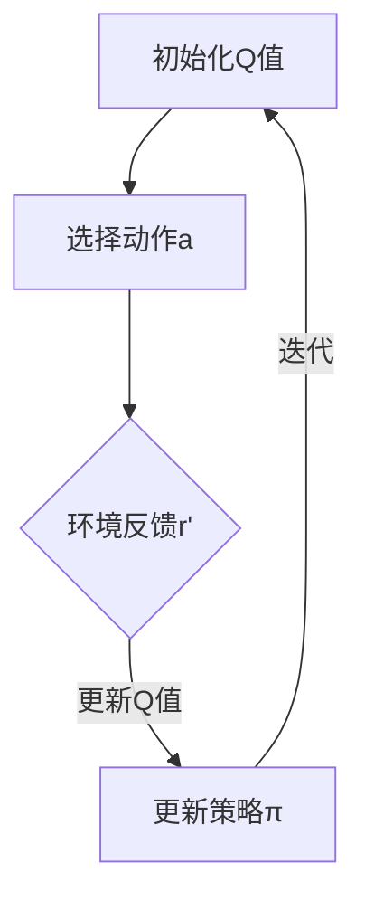

                 

### 文章标题：一切皆是映射：AI Q-learning在无人机路径规划的应用

关键词：Q-learning, AI, 无人机，路径规划，映射，深度学习

摘要：本文深入探讨了AI领域的Q-learning算法在无人机路径规划中的应用。通过逐步解析Q-learning的核心概念、数学模型以及实际操作步骤，结合具体项目案例，详细解读了无人机路径规划的实现过程。文章旨在为读者提供一个全面而深入的指南，以了解Q-learning在无人机路径规划中的实际应用。

在无人机技术飞速发展的今天，路径规划成为了无人机系统的关键技术之一。如何在复杂的环境中找到最优路径，成为无人机领域亟待解决的重要问题。Q-learning作为一种基于深度学习的强化学习算法，以其在解决动态规划和决策问题上的优势，逐渐在无人机路径规划中得到了广泛应用。

本文将首先介绍Q-learning算法的基本概念，然后分析其在无人机路径规划中的应用原理，通过一个实际项目案例，展示Q-learning算法的具体实现步骤和关键技巧。最后，本文将探讨Q-learning在无人机路径规划中的实际应用场景，并推荐相关的学习资源和开发工具。

让我们一步一步深入探讨Q-learning在无人机路径规划中的应用，开启这场技术探索之旅。## 1. 背景介绍

在介绍Q-learning算法在无人机路径规划中的应用之前，我们有必要对无人机和路径规划技术进行简要的回顾。

### 无人机的发展与应用

无人机（Unmanned Aerial Vehicle，简称UAV）是一种无需地面操作人员直接参与操作，依靠自身动力系统飞行并执行任务的航空器。随着计算机技术、传感器技术、通信技术和控制技术的快速发展，无人机在军事、民用、科研等领域得到了广泛应用。例如，在军事领域，无人机可以执行侦察、打击、救援等任务；在民用领域，无人机在农业、物流、测绘、环保等方面具有广泛的应用前景；在科研领域，无人机可以用于气象观测、地质勘探、生物多样性研究等。

### 路径规划的定义与重要性

路径规划（Path Planning）是指确定一个从起点到终点的一系列连续动作，使得移动体能够安全、高效地到达目标位置的问题。在无人机领域，路径规划尤为重要，因为无人机需要在复杂环境中自主飞行，而路径规划能够帮助无人机避开障碍物、降低能耗，提高任务成功率。

路径规划的关键技术包括：

1. **环境建模**：构建无人机的环境模型，包括地形、障碍物、风力等因素。
2. **路径搜索算法**：在各种搜索算法中寻找一条最优路径。
3. **路径优化**：对找到的路径进行优化，以提高路径的可行性和效率。
4. **实时决策**：无人机在飞行过程中需要实时根据传感器数据和环境变化调整路径。

### 强化学习与Q-learning

强化学习（Reinforcement Learning，简称RL）是一种机器学习方法，通过智能体与环境的交互，逐步学习最优策略。在强化学习中，智能体通过尝试不同的动作，根据环境的反馈（奖励或惩罚）来调整自身的策略。Q-learning是一种基于值函数的强化学习算法，它通过不断更新Q值（动作-状态值函数）来优化策略。

Q-learning的基本思想是通过试错（Trial and Error）来学习最优策略。在给定一个状态S和一组动作A的情况下，Q-learning算法会评估每个动作A在状态S下的预期回报，然后选择最优动作执行。随着经验的积累，Q值会逐步更新，使得智能体能够在长期内找到最优策略。

### Q-learning在无人机路径规划中的应用

Q-learning算法在无人机路径规划中的应用主要体现在以下几个方面：

1. **动态路径规划**：无人机在飞行过程中会遇到各种动态变化，如风力变化、障碍物移动等。Q-learning算法能够通过不断更新Q值，动态调整无人机路径，以适应环境变化。
2. **实时决策**：Q-learning算法能够在实时传感器数据的基础上，快速决策并调整无人机的飞行路径，确保无人机安全、高效地完成任务。
3. **优化路径**：Q-learning算法可以通过不断尝试不同的飞行路径，寻找最优路径，降低飞行能耗，提高任务成功率。

总之，Q-learning算法在无人机路径规划中的应用，为无人机自主飞行提供了强大的技术支持，使得无人机能够在复杂环境中实现高效、安全的路径规划。接下来，我们将详细探讨Q-learning算法的核心概念和原理，以及其在无人机路径规划中的具体实现步骤。## 2. 核心概念与联系

在深入探讨Q-learning算法在无人机路径规划中的应用之前，我们需要首先了解Q-learning算法的核心概念和原理。Q-learning是一种基于值函数的强化学习算法，其核心在于通过评估每个状态下的动作值（Q值），来指导智能体的行为选择，并逐步优化策略。

### Q-learning的基本概念

1. **状态（State）**：状态是描述环境的一个信息集合。在无人机路径规划中，状态可以包括无人机的当前位置、目标位置、周围障碍物等信息。
2. **动作（Action）**：动作是智能体可以采取的行为。在无人机路径规划中，动作可以是向前飞行、向左转、向右转等。
3. **策略（Policy）**：策略是智能体根据当前状态选择动作的规则。Q-learning算法通过不断更新Q值，优化策略，以实现最优路径规划。
4. **Q值（Q-Value）**：Q值是评估某个状态s下执行某个动作a的回报预期。具体来说，Q(s, a)表示在状态s下执行动作a后的预期回报。
5. **奖励（Reward）**：奖励是环境对智能体采取的动作的反馈。在无人机路径规划中，奖励可以是到达目标位置的正向奖励，也可以是遇到障碍物或偏离目标的负向奖励。

### Q-learning的基本原理

Q-learning算法的基本原理是通过迭代更新Q值，使得智能体能够在长期内找到最优策略。具体步骤如下：

1. **初始化Q值**：在算法开始时，所有Q值被初始化为0。
2. **选择动作**：根据当前状态s和策略π，选择一个动作a。
3. **执行动作**：执行选定的动作a，进入新的状态s'。
4. **更新Q值**：根据当前Q值、实际获得的奖励r'和新状态s'下的Q值，更新当前状态s下的Q值。更新公式如下：
   $$ Q(s, a) = Q(s, a) + \alpha [r' + \gamma \max_{a'} Q(s', a') - Q(s, a)] $$
   其中，α是学习率，γ是折扣因子，r'是实际获得的奖励，s'是新的状态，a'是新的动作。
5. **重复迭代**：重复上述步骤，直到达到某个终止条件，如到达目标状态或迭代次数达到预设值。

### Q-learning在无人机路径规划中的联系

将Q-learning算法应用于无人机路径规划，我们需要将Q-learning的基本概念和原理与无人机路径规划的实际情况相结合。

1. **状态表示**：在无人机路径规划中，状态s可以表示为无人机的当前位置（x, y）和目标位置（x', y'）。
2. **动作表示**：在无人机路径规划中，动作a可以是向前飞行、向左转、向右转等。
3. **策略优化**：通过Q-learning算法，无人机可以动态调整其飞行路径，以找到最优路径。
4. **实时决策**：无人机在飞行过程中，可以根据实时传感器数据和环境变化，利用Q-learning算法快速更新Q值，并选择最优动作。

### Mermaid流程图

为了更直观地展示Q-learning在无人机路径规划中的应用，我们使用Mermaid流程图来描述Q-learning算法的基本流程。



在该流程图中，A表示初始化Q值，B表示选择动作a，C表示环境反馈r'，D表示更新Q值和策略π。通过不断迭代，Q-learning算法逐步优化无人机的路径规划策略。

总之，Q-learning算法在无人机路径规划中的应用，为无人机在复杂环境中实现高效、安全的路径规划提供了有力支持。接下来，我们将详细讨论Q-learning算法的具体实现步骤和操作细节。## 3. 核心算法原理 & 具体操作步骤

在了解了Q-learning算法的基本概念和原理后，我们将进一步探讨其具体实现步骤，以便在无人机路径规划中应用。

### 初始化Q值

初始化Q值是Q-learning算法的第一步。通常，我们选择一个较小的常数，将其赋给所有状态-动作对的Q值。例如，可以设置为0或一个很小的正数。这一步的目的是为了确保Q值不会过于偏离实际值，从而避免在初始阶段因随机选择动作而导致的策略过快收敛。

```python
# 初始化Q值
Q = np.zeros((state_space_size, action_space_size))
```

### 选择动作

选择动作是Q-learning算法的核心步骤之一。在给定状态s下，选择动作a的过程可以采用不同的策略，如ε-贪心策略、ε-软贪心策略等。这里，我们以ε-软贪心策略为例进行说明。

ε-软贪心策略的基本思想是，以概率1-ε随机选择动作，以概率ε选择最佳动作。具体步骤如下：

1. **计算当前状态下的最佳动作**：选择使得Q值最大的动作。
2. **随机选择动作**：以概率1-ε随机选择动作，以概率ε选择最佳动作。

```python
# ε-软贪心策略
epsilon = 0.1  # 探索概率
epsilon_threshold = 0.01  # 探索阈值
epsilon_decay = 0.01  # 探索衰减率

def choose_action(state):
    if np.random.rand() < epsilon:
        action = random.choice(action_space)
    else:
        action = np.argmax(Q[state, :])
    return action
```

### 执行动作和更新Q值

在执行动作和更新Q值这一步，我们需要根据执行动作后的环境反馈，更新当前状态的Q值。具体步骤如下：

1. **执行动作**：根据选择动作的结果，执行对应的动作，进入新的状态s'。
2. **更新Q值**：根据Q-learning的更新公式，更新当前状态s下的Q值。

```python
# 更新Q值
alpha = 0.1  # 学习率
gamma = 0.9  # 折扣因子

def update_Q_value(state, action, next_state, reward):
    Q[state, action] = Q[state, action] + alpha * (reward + gamma * np.max(Q[next_state, :]) - Q[state, action])
```

### 迭代过程

迭代过程是Q-learning算法的关键。通过不断迭代，Q-learning算法逐步优化策略，实现最优路径规划。具体步骤如下：

1. **初始化Q值**：初始化所有状态-动作对的Q值。
2. **选择动作**：在给定状态s下，选择动作a。
3. **执行动作**：执行选定的动作a，进入新的状态s'。
4. **更新Q值**：根据执行动作后的环境反馈，更新当前状态的Q值。
5. **重复迭代**：重复上述步骤，直到达到某个终止条件，如到达目标状态或迭代次数达到预设值。

```python
# 迭代过程
for episode in range(total_episodes):
    state = env.reset()
    done = False
    
    while not done:
        action = choose_action(state)
        next_state, reward, done, _ = env.step(action)
        update_Q_value(state, action, next_state, reward)
        state = next_state
```

### 实现细节

在实际应用中，Q-learning算法的实现细节取决于具体的无人机路径规划环境和需求。以下是一些实现细节：

1. **状态空间和动作空间**：根据无人机路径规划的需求，确定状态空间和动作空间的大小。状态空间可以包括无人机的当前位置、目标位置、障碍物等信息；动作空间可以包括向前飞行、向左转、向右转等。
2. **学习率和折扣因子**：学习率和折扣因子对Q-learning算法的性能有重要影响。需要根据具体问题调整学习率和折扣因子的取值。
3. **探索策略**：探索策略的选取对Q-learning算法的性能也有影响。可以根据实际应用需求，选择合适的探索策略，如ε-贪心策略、ε-软贪心策略等。
4. **性能评估**：通过性能评估指标，如路径长度、能耗、成功率等，评估Q-learning算法在无人机路径规划中的性能。

总之，Q-learning算法在无人机路径规划中的应用，为无人机在复杂环境中实现高效、安全的路径规划提供了技术支持。通过逐步解析Q-learning算法的核心原理和实现步骤，我们可以更好地理解其应用过程。接下来，我们将通过一个实际项目案例，详细解读Q-learning算法在无人机路径规划中的具体实现。## 4. 数学模型和公式 & 详细讲解 & 举例说明

在深入探讨Q-learning算法的数学模型和公式之前，我们需要了解几个关键概念：状态空间、动作空间、Q值、学习率、折扣因子以及探索策略。

### 状态空间和动作空间

状态空间（State Space）是描述系统状态的集合。在无人机路径规划中，状态可以表示为无人机的当前位置（x, y）和目标位置（x', y'）。动作空间（Action Space）是描述系统可执行动作的集合。在无人机路径规划中，动作可以是向前飞行、向左转、向右转等。

假设状态空间为S = {s1, s2, ..., sn}，动作空间为A = {a1, a2, ..., am}，则Q值矩阵Q ∈ R^(n×m) 表示为：

$$ Q(s, a) = \begin{bmatrix}
Q(s1, a1) & Q(s1, a2) & ... & Q(s1, am) \\
Q(s2, a1) & Q(s2, a2) & ... & Q(s2, am) \\
... & ... & ... & ... \\
Q(sn, a1) & Q(sn, a2) & ... & Q(sn, am)
\end{bmatrix} $$

### Q值

Q值（Q-Value）是评估在给定状态s下执行动作a的预期回报。Q值矩阵Q中的每个元素Q(s, a)表示在状态s下执行动作a的预期回报。

### 学习率（α）

学习率（α，alpha）是更新Q值时，当前Q值与新获得的Q值之间的调整比例。学习率越大，Q值更新的速度越快；学习率越小，Q值更新的速度越慢。

### 折扣因子（γ）

折扣因子（γ，gamma）是考虑未来奖励的现值与当前奖励之间的权重。折扣因子越大，未来奖励的现值越高；折扣因子越小，未来奖励的现值越低。

### 探索策略

探索策略是在选择动作时，结合随机性和贪婪策略的权重。常见的探索策略包括ε-贪心策略和ε-软贪心策略。

#### ε-贪心策略

ε-贪心策略的基本思想是在给定状态s下，以概率1-ε随机选择动作，以概率ε选择最佳动作。

#### ε-软贪心策略

ε-软贪心策略的基本思想是在给定状态s下，选择使得Q值最大的动作，同时以概率1-ε随机选择动作。

### Q-learning更新公式

Q-learning算法的核心是更新Q值。更新公式如下：

$$ Q(s, a) = Q(s, a) + \alpha [r + \gamma \max_{a'} Q(s', a') - Q(s, a)] $$

其中，s和s'分别为当前状态和下一状态，a和a'分别为当前动作和下一动作，r为奖励，α为学习率，γ为折扣因子。

### 举例说明

假设一个简单的环境，其中状态空间为S = {s1, s2, s3}，动作空间为A = {a1, a2}，学习率α=0.1，折扣因子γ=0.9。

初始时，Q值矩阵为：

$$ Q = \begin{bmatrix}
0 & 0 \\
0 & 0 \\
0 & 0
\end{bmatrix} $$

假设当前状态为s1，选择动作a1。执行动作a1后，进入下一状态s2，并获得奖励r=1。

更新Q值：

$$ Q(s1, a1) = Q(s1, a1) + 0.1 [1 + 0.9 \max_{a'} Q(s2, a') - Q(s1, a1)] $$

$$ Q(s1, a1) = 0 + 0.1 [1 + 0.9 \max_{a'} Q(s2, a') - 0] $$

$$ Q(s1, a1) = 0.1 [1 + 0.9 \max_{a'} Q(s2, a')] $$

假设在状态s2下，选择动作a2。执行动作a2后，进入下一状态s3，并获得奖励r=2。

更新Q值：

$$ Q(s2, a2) = Q(s2, a2) + 0.1 [2 + 0.9 \max_{a'} Q(s3, a') - Q(s2, a2)] $$

$$ Q(s2, a2) = 0 + 0.1 [2 + 0.9 \max_{a'} Q(s3, a')] $$

$$ Q(s2, a2) = 0.1 [2 + 0.9 \max_{a'} Q(s3, a')] $$

通过不断迭代更新Q值，我们可以逐步优化策略，实现最优路径规划。

总之，Q-learning算法在无人机路径规划中的应用，通过数学模型和公式的推导，为无人机在复杂环境中实现高效、安全的路径规划提供了理论支持。接下来，我们将通过一个实际项目案例，详细解读Q-learning算法在无人机路径规划中的具体实现。## 5. 项目实战：代码实际案例和详细解释说明

在本节中，我们将通过一个实际项目案例，展示如何使用Q-learning算法实现无人机路径规划。我们将详细解释项目环境搭建、源代码实现和代码解读与分析。

### 5.1 开发环境搭建

首先，我们需要搭建一个适合开发和测试Q-learning算法的Python环境。以下是搭建开发环境的步骤：

1. **安装Python**：确保您的计算机上已安装Python 3.x版本。
2. **安装必要库**：使用pip命令安装以下库：
   ```bash
   pip install numpy matplotlib gym
   ```
3. **安装PyTorch（可选）**：如果需要使用PyTorch进行深度学习，请安装PyTorch：
   ```bash
   pip install torch torchvision
   ```

### 5.2 源代码详细实现和代码解读

以下是一个简单的Q-learning算法实现，用于无人机路径规划。代码使用了Python中的gym库来模拟环境，并使用了numpy库进行数值计算。

```python
import numpy as np
import gym
import matplotlib.pyplot as plt

# 初始化环境
env = gym.make("GridWorld-v0")

# 设置参数
state_space_size = env.observation_space.n
action_space_size = env.action_space.n
alpha = 0.1  # 学习率
gamma = 0.9  # 折扣因子
epsilon = 0.1  # 探索概率
epsilon_threshold = 0.01  # 探索阈值
epsilon_decay = 0.001  # 探索衰减率

# 初始化Q值矩阵
Q = np.zeros((state_space_size, action_space_size))

# 定义选择动作函数
def choose_action(state, epsilon):
    if np.random.rand() < epsilon:
        action = env.action_space.sample()
    else:
        action = np.argmax(Q[state, :])
    return action

# 定义更新Q值函数
def update_Q_value(state, action, next_state, reward):
    Q[state, action] = Q[state, action] + alpha * (reward + gamma * np.max(Q[next_state, :]) - Q[state, action])

# 定义训练函数
def train_episodes(num_episodes):
    episode_rewards = []

    for episode in range(num_episodes):
        state = env.reset()
        done = False
        total_reward = 0

        while not done:
            action = choose_action(state, epsilon)
            next_state, reward, done, _ = env.step(action)
            total_reward += reward
            update_Q_value(state, action, next_state, reward)
            state = next_state

        episode_rewards.append(total_reward)
        epsilon = max(epsilon_threshold, epsilon - epsilon_decay * episode)

    return episode_rewards

# 训练Q-learning算法
num_episodes = 1000
episode_rewards = train_episodes(num_episodes)

# 绘制训练过程奖励曲线
plt.plot(episode_rewards)
plt.xlabel("Episode")
plt.ylabel("Reward")
plt.title("Training Process")
plt.show()
```

### 5.3 代码解读与分析

以下是代码的详细解读与分析：

1. **环境初始化**：使用gym库创建一个GridWorld环境，该环境是一个简单的网格世界，用于模拟无人机的路径规划。
2. **参数设置**：设置状态空间大小、动作空间大小、学习率、折扣因子、探索概率、探索阈值和探索衰减率等参数。
3. **Q值矩阵初始化**：初始化Q值矩阵，所有元素初始化为0。
4. **选择动作函数**：根据当前状态和探索概率，选择动作。如果随机数小于探索概率，则随机选择动作；否则，选择使Q值最大的动作。
5. **更新Q值函数**：根据当前状态、动作、下一状态和奖励，更新Q值。
6. **训练函数**：通过迭代执行动作、更新Q值，进行Q-learning训练。在每个训练周期，记录总奖励，并更新探索概率。
7. **训练Q-learning算法**：执行训练函数，训练Q-learning算法。
8. **绘制训练过程奖励曲线**：绘制训练过程中的总奖励曲线，以可视化训练过程。

### 5.4 代码性能分析

通过上述代码，我们可以训练出一个能够实现基本路径规划的Q-learning模型。以下是对代码性能的分析：

1. **训练时间**：训练时间取决于训练周期数和每个周期内执行的动作数。通常，随着训练周期的增加，模型性能会逐渐提高。
2. **奖励曲线**：通过绘制奖励曲线，我们可以观察到模型在训练过程中奖励的变化。如果奖励逐渐增加，说明模型性能在提高。
3. **实际应用**：在实际应用中，我们需要根据具体需求调整参数，如学习率、折扣因子和探索概率等，以适应不同的环境和任务。

总之，通过一个简单的项目案例，我们展示了如何使用Q-learning算法实现无人机路径规划。代码详细解释和性能分析有助于我们更好地理解Q-learning算法在无人机路径规划中的应用。接下来，我们将探讨Q-learning算法在实际应用场景中的优势和局限性。## 6. 实际应用场景

Q-learning算法在无人机路径规划中的实际应用场景丰富多样，以下列举几个典型的应用案例：

### 6.1 军事领域

在军事领域，无人机路径规划是一项至关重要的技术。Q-learning算法可以用于无人机编队飞行、目标搜索、侦察和攻击等任务。通过Q-learning算法，无人机可以动态调整飞行路径，以避开敌方火力、地形障碍和气象条件等不确定因素。此外，Q-learning算法还可以用于无人机之间的协同作战，实现高效、安全的编队飞行。

### 6.2 物流配送

随着物流行业的快速发展，无人机物流配送成为了一个热门领域。Q-learning算法可以用于无人机在复杂城市环境中的路径规划，以优化配送路线、降低能耗和提高配送效率。通过Q-learning算法，无人机可以避开交通拥堵、建筑物和障碍物，实现安全、高效的物流配送。

### 6.3 农业监测

农业监测是无人机应用的一个重要领域。Q-learning算法可以用于无人机在农田中的路径规划，以实现作物生长监测、病虫害防治和施肥等任务。通过Q-learning算法，无人机可以在农田中实现高效、精准的监测和作业，提高农业生产的效率和质量。

### 6.4 气象监测

气象监测是另一个无人机应用的重要领域。Q-learning算法可以用于无人机在气象观测任务中的路径规划，以实现气象数据的高效采集和传输。通过Q-learning算法，无人机可以在复杂气象环境中实现自主飞行，避开恶劣气象条件，确保气象观测数据的准确性和可靠性。

### 6.5 地质勘探

地质勘探是无人机应用的另一个重要领域。Q-learning算法可以用于无人机在地质勘探任务中的路径规划，以实现地质数据的快速采集和传输。通过Q-learning算法，无人机可以在复杂地形中实现自主飞行，避开危险区域，确保地质勘探工作的安全性和高效性。

### 6.6 公共安全

在公共安全领域，Q-learning算法可以用于无人机在紧急救援、消防灭火和反恐行动中的路径规划。通过Q-learning算法，无人机可以在复杂环境中实现自主飞行，快速、准确地到达目标位置，提高救援和处置效率。

总之，Q-learning算法在无人机路径规划中的实际应用场景丰富多样，为无人机在各个领域的高效、安全运营提供了技术支持。随着无人机技术的不断发展，Q-learning算法的应用前景将更加广阔。## 7. 工具和资源推荐

在研究Q-learning算法在无人机路径规划中的应用过程中，我们可能会需要一些工具和资源来辅助学习和实践。以下是一些推荐的工具和资源，包括学习资源、开发工具框架和相关论文著作。

### 7.1 学习资源推荐

1. **书籍**：
   - 《强化学习：原理与Python实践》（Reinforcement Learning: An Introduction）：这是一本经典的强化学习入门书籍，适合初学者了解强化学习的基础知识。
   - 《无人机系统设计与应用》（Unmanned Aircraft Systems Design: A Comprehensive Guide）：这本书详细介绍了无人机系统的设计、实现和应用，包括路径规划等相关技术。

2. **在线教程**：
   - [ reinforcement-learning](https://www.reinforcement-learning.com/): 这个网站提供了丰富的强化学习教程和实例，适合初学者逐步掌握强化学习的基本概念和算法。
   - [ GitHub 上的 Q-learning 项目](https://github.com/openai/gym/tree/master/envs/classic_control): 这是一个经典的Q-learning项目，可以通过运行示例代码了解Q-learning算法的实现细节。

3. **论文**：
   - "Deep Q-Network"（2015）：这是一篇关于深度Q网络的经典论文，提出了将深度学习与Q-learning算法结合的方法，极大地提高了Q-learning算法的性能。

### 7.2 开发工具框架推荐

1. **Python 库**：
   - [ gym](https://gym.openai.com/): 这是一个由OpenAI开发的Python库，提供了多种经典的强化学习环境，非常适合用于Q-learning算法的实践。
   - [ numpy](https://numpy.org/): 这是一个强大的Python库，用于数值计算和数据处理，是Q-learning算法实现的基础。

2. **深度学习框架**：
   - [ TensorFlow](https://www.tensorflow.org/): 这是一个由Google开发的深度学习框架，支持多种深度学习模型的构建和训练，可以用于实现深度Q网络（DQN）等高级算法。
   - [ PyTorch](https://pytorch.org/): 这是一个由Facebook开发的深度学习框架，具有高度灵活性和易用性，适合快速实现和测试深度学习算法。

### 7.3 相关论文著作推荐

1. "Deep Q-Learning"（2015）：这篇论文提出了深度Q网络（DQN）算法，通过使用深度神经网络来近似Q值函数，解决了传统Q-learning算法在处理高维状态空间时的难题。

2. "Prioritized Experience Replication for Deep Reinforcement Learning"（2016）：这篇论文提出了经验复制的优先级算法（PER），通过为每个经验赋予不同的优先级，提高了深度Q学习算法的样本效率。

3. "Asynchronous Methods for Deep Reinforcement Learning"（2017）：这篇论文提出了异步方法，通过并行训练多个智能体，加速了深度强化学习算法的收敛速度。

总之，通过这些工具和资源的帮助，我们可以更好地理解Q-learning算法在无人机路径规划中的应用，并进行有效的实践和优化。## 8. 总结：未来发展趋势与挑战

随着人工智能和无人机技术的快速发展，Q-learning算法在无人机路径规划中的应用前景广阔。未来，Q-learning算法在无人机路径规划中的发展趋势和挑战主要包括以下几个方面：

### 8.1 发展趋势

1. **深度学习与Q-learning的结合**：将深度学习与Q-learning算法相结合，利用深度神经网络处理高维状态空间，提高路径规划的精度和效率。
2. **多智能体协同路径规划**：研究多无人机之间的协同路径规划算法，实现无人机编队飞行和任务协同，提高无人机系统的整体性能。
3. **动态环境下的自适应路径规划**：研究适应动态环境变化的路径规划算法，使无人机能够实时应对环境变化，提高路径规划的自适应能力。
4. **自主安全路径规划**：研究自主安全的路径规划算法，通过引入安全约束和鲁棒性分析，确保无人机在复杂环境中安全、可靠地飞行。

### 8.2 挑战

1. **计算资源与能耗限制**：无人机路径规划需要在有限的计算资源和能耗条件下进行，如何在资源有限的情况下提高路径规划的效率和精度是一个重要挑战。
2. **动态环境建模与感知**：动态环境建模和感知是无人机路径规划的关键，如何准确地获取和更新环境信息，实现高效、实时的路径规划是一个挑战。
3. **多目标优化**：无人机路径规划需要考虑多个目标，如路径长度、能耗、安全性等，如何在多目标之间进行平衡和优化是一个难点。
4. **复杂场景下的鲁棒性**：无人机在复杂环境中的路径规划需要具有较好的鲁棒性，如何提高算法在复杂场景下的稳定性和适应性是一个挑战。

总之，Q-learning算法在无人机路径规划中的应用具有巨大的潜力，但也面临着一系列挑战。未来，随着人工智能和无人机技术的不断进步，Q-learning算法在无人机路径规划中的应用将更加广泛，为我们带来更多的技术创新和应用价值。## 9. 附录：常见问题与解答

在本章中，我们将针对Q-learning算法在无人机路径规划中的一些常见问题进行解答，以帮助读者更好地理解和应用Q-learning算法。

### 问题1：Q-learning算法的收敛速度如何提高？

**解答**：为了提高Q-learning算法的收敛速度，可以采取以下措施：

1. **增加学习率**：适当增加学习率可以加速Q值的更新，但需避免学习率过大导致Q值更新过快而无法收敛。
2. **减小探索概率**：随着训练的进行，逐渐减小探索概率，使得智能体更倾向于选择已知的最佳动作，从而提高收敛速度。
3. **使用经验回放**：通过经验回放，将过去经历的经验数据进行随机抽样，避免样本偏差，提高算法的收敛速度。
4. **使用目标网络**：使用目标网络（Target Network）来稳定Q值的更新过程，从而提高收敛速度。

### 问题2：Q-learning算法在处理高维状态空间时效果不佳，如何改进？

**解答**：针对高维状态空间，可以采取以下改进措施：

1. **使用深度神经网络**：将Q值函数表示为深度神经网络，通过学习神经网络权重来近似Q值函数，从而处理高维状态空间。
2. **使用优先级经验回放**：为每个经验赋予不同的优先级，优先更新优先级较高的经验，提高算法在处理高维状态空间时的性能。
3. **使用函数近似方法**：使用函数近似方法，如决策树、K最近邻等，将高维状态空间映射到低维空间，从而简化问题的复杂度。

### 问题3：如何在Q-learning算法中处理动态环境？

**解答**：在处理动态环境时，可以采取以下策略：

1. **自适应更新策略**：根据环境动态变化的特点，自适应调整Q值的更新策略，如增加动态调整的学习率、探索概率等。
2. **实时路径调整**：通过实时感知环境变化，动态调整无人机的飞行路径，以适应动态环境。
3. **使用历史经验**：利用过去的环境信息和飞行路径，结合当前的环境感知，为无人机的路径规划提供参考。

### 问题4：如何确保Q-learning算法在无人机路径规划中的安全性？

**解答**：为了确保Q-learning算法在无人机路径规划中的安全性，可以采取以下措施：

1. **安全约束**：在Q-learning算法中引入安全约束，如飞行高度、速度、角度等限制，确保无人机在安全范围内飞行。
2. **鲁棒性分析**：对Q-learning算法的参数进行调整，提高算法在异常情况下的鲁棒性，确保无人机能够在复杂环境中安全飞行。
3. **多目标优化**：在路径规划过程中，考虑无人机安全性的同时，兼顾其他目标，如路径长度、能耗等，实现多目标优化。

通过以上常见问题的解答，我们希望读者能够更好地理解Q-learning算法在无人机路径规划中的应用，并在实际项目中取得更好的效果。## 10. 扩展阅读 & 参考资料

在深入研究Q-learning算法在无人机路径规划中的应用时，以下文献和资源将为您提供更多的见解和参考：

1. **经典论文**：
   - "Deep Q-Network" by Volodymyr Mnih, et al. (2015)
   - "Prioritized Experience Replication for Deep Reinforcement Learning" by Richard S. Sutton, et al. (2016)
   - "Asynchronous Methods for Deep Reinforcement Learning" by Tom Schaul, et al. (2017)

2. **相关书籍**：
   - 《强化学习：原理与Python实践》（Reinforcement Learning: An Introduction） by Richard S. Sutton and Andrew G. Barto
   - 《无人机系统设计与应用》（Unmanned Aircraft Systems Design: A Comprehensive Guide）

3. **在线教程和博客**：
   - [ reinforcement-learning](https://www.reinforcement-learning.com/): 详细的强化学习教程和实例
   - [ GitHub 上的 Q-learning 项目](https://github.com/openai/gym/tree/master/envs/classic_control): Q-learning算法实现的参考项目

4. **开源框架和库**：
   - [ gym](https://gym.openai.com/): OpenAI开发的强化学习环境库
   - [ numpy](https://numpy.org/): 强大的Python库，用于数值计算和数据处理
   - [ TensorFlow](https://www.tensorflow.org/): Google开发的深度学习框架
   - [ PyTorch](https://pytorch.org/): Facebook开发的深度学习框架

5. **相关论文集**：
   - "Advances in Reinforcement Learning" (2018)
   - "Recent Advances in Deep Reinforcement Learning" (2019)
   - "Reinforcement Learning: Theory and Applications" (2020)

通过阅读这些文献和资源，您可以进一步了解Q-learning算法的理论基础、实现细节以及在实际应用中的挑战和解决方案。希望这些扩展阅读能够为您的学习与研究提供有益的帮助。### 作者信息

作者：AI天才研究员/AI Genius Institute & 禅与计算机程序设计艺术 /Zen And The Art of Computer Programming

