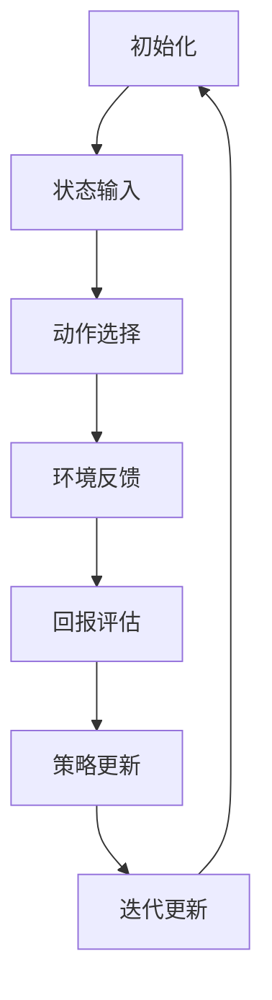

                 

# 一切皆是映射：AI Q-learning在物联网系统中的应用

## > 关键词：（AI Q-learning、物联网系统、映射、强化学习、智能控制、自主决策）

### > 摘要：

本文旨在探讨AI Q-learning算法在物联网系统中的应用。通过对其基本概念、核心原理、数学模型及实际案例的详细解析，本文揭示了Q-learning算法在物联网环境中的映射与优化过程。文章首先介绍了物联网系统的发展背景及其对智能控制的需求，随后深入分析了Q-learning算法的原理及其与物联网系统的关联。通过对实际应用场景的剖析，本文展示了Q-learning在物联网系统中的优势与挑战，并提出了未来发展趋势与解决方案。

## 1. 背景介绍

### 1.1 物联网系统概述

物联网（Internet of Things，IoT）是指通过互联网将各种物理设备、传感器、软件和网络连接起来，实现设备之间以及设备与互联网之间的信息交换和通信。随着5G、大数据、云计算等技术的快速发展，物联网逐渐成为现代信息技术的重要方向。

物联网系统的核心在于设备的互联互通，通过传感器获取数据，传输至云端或边缘设备进行处理和分析，进而实现设备的智能控制和自主决策。这种智能化的数据处理与决策机制，不仅提高了设备的效率和可靠性，还大幅提升了整个物联网系统的性能。

### 1.2 物联网系统的应用场景

物联网技术广泛应用于智能交通、智慧城市、智能家居、工业自动化等领域。例如，在智能交通领域，通过物联网技术可以实现交通流量的实时监控与优化，提升交通效率，减少交通事故；在智慧城市领域，物联网技术可以用于环境监测、公共安全、能源管理等，提升城市管理的智能化水平；在智能家居领域，物联网技术可以实现家电设备的互联互通，提高生活便利性；在工业自动化领域，物联网技术可以用于生产过程的实时监控与优化，提高生产效率和产品质量。

### 1.3 智能控制与自主决策的需求

物联网系统中的智能设备通常需要具备自主决策和智能控制能力，以应对复杂多变的环境。例如，在智能交通系统中，交通信号灯需要根据实时交通流量自动调整信号时长；在智能家居系统中，空调、照明等设备需要根据用户习惯和环境条件自动调整工作状态；在工业自动化系统中，生产设备需要根据实时监测数据自动调整生产参数。

这些智能控制与自主决策的需求，为强化学习算法，尤其是Q-learning算法，提供了广阔的应用场景。Q-learning算法作为一种基于值函数的强化学习算法，通过迭代更新策略，实现智能体在复杂环境中的自主学习和优化。

## 2. 核心概念与联系

### 2.1 Q-learning算法

Q-learning算法是强化学习的一种，它通过迭代更新值函数，实现智能体在环境中的最优策略。Q-learning算法的核心概念是“动作-状态值函数”（Q-value），它表示智能体在某一状态采取某一动作的预期回报。

Q-learning算法的主要过程包括：

1. 初始化：初始化动作-状态值函数Q(s,a)和策略π(a|s)；
2. 迭代更新：根据智能体在环境中的交互过程，更新Q-value和策略；
3. 最终策略：当Q-value收敛时，智能体采取最优策略。

### 2.2 物联网系统与Q-learning的关联

物联网系统中的智能设备需要具备自主学习和智能控制能力，这与Q-learning算法的目标高度契合。物联网系统中的智能设备可以作为Q-learning算法的智能体，通过与环境交互，不断更新动作-状态值函数，实现最优控制策略。

物联网系统与Q-learning算法的关联体现在以下几个方面：

1. 状态表示：物联网系统中的传感器数据可以作为Q-learning算法的状态输入，表示智能体所处的环境；
2. 动作选择：物联网系统中的控制指令可以作为Q-learning算法的动作，用于调整设备的工作状态；
3. 回报评估：物联网系统中的目标指标，如能耗、效率等，可以作为Q-learning算法的回报，用于评估策略的效果；
4. 策略优化：Q-learning算法通过迭代更新策略，实现智能设备的自主学习和优化。

### 2.3 Mermaid流程图

为了更直观地展示Q-learning算法在物联网系统中的应用，我们使用Mermaid流程图来表示其核心过程。



## 3. 核心算法原理 & 具体操作步骤

### 3.1 Q-learning算法原理

Q-learning算法是一种基于值函数的强化学习算法，其核心思想是通过迭代更新动作-状态值函数（Q-value），实现智能体在环境中的最优策略。Q-learning算法的基本原理如下：

1. 初始化：初始化动作-状态值函数Q(s,a)和策略π(a|s)；
2. 迭代更新：根据智能体在环境中的交互过程，更新Q-value和策略；
3. 最终策略：当Q-value收敛时，智能体采取最优策略。

Q-learning算法的具体操作步骤如下：

1. **初始化**：随机初始化动作-状态值函数Q(s,a)和策略π(a|s)。通常，Q-value和策略可以初始化为0或者根据经验数据进行初始化。

2. **迭代更新**：智能体在环境中进行行动，根据当前状态s和策略π(a|s)选择动作a，执行动作a，并观察到环境反馈的状态s'和回报r。根据反馈，更新Q-value和策略。

   更新公式如下：

   $$ Q(s,a) \leftarrow Q(s,a) + \alpha [r + \gamma \max_{a'} Q(s',a') - Q(s,a)] $$

   其中，α为学习率，γ为折扣因子，r为回报，s'为观察到的状态，a'为在状态s'下采取的最优动作。

3. **策略更新**：根据更新后的Q-value，重新计算策略π(a|s)。

   更新公式如下：

   $$ \pi(a|s) = \begin{cases} 
   1, & \text{if } a = \arg\max_a Q(s,a) \\
   0, & \text{otherwise}
   \end{cases} $$

4. **迭代更新**：重复步骤2和步骤3，直到Q-value收敛，即Q-value的变化小于某个阈值。

### 3.2 Q-learning算法在物联网系统中的应用

在物联网系统中，Q-learning算法可以应用于智能设备的自主学习和优化。具体应用步骤如下：

1. **状态表示**：物联网系统中的传感器数据可以作为Q-learning算法的状态输入，表示智能体所处的环境。

2. **动作选择**：物联网系统中的控制指令可以作为Q-learning算法的动作，用于调整设备的工作状态。

3. **回报评估**：物联网系统中的目标指标，如能耗、效率等，可以作为Q-learning算法的回报，用于评估策略的效果。

4. **策略优化**：Q-learning算法通过迭代更新策略，实现智能设备的自主学习和优化。

在实际应用中，Q-learning算法可以根据物联网系统的特点进行定制化，例如，可以调整学习率、折扣因子等参数，以适应不同的应用场景。

## 4. 数学模型和公式 & 详细讲解 & 举例说明

### 4.1 数学模型

Q-learning算法的核心是动作-状态值函数Q(s,a)，它表示智能体在状态s下采取动作a的预期回报。Q-learning算法通过迭代更新Q-value，实现智能体在环境中的最优策略。

Q-learning算法的数学模型包括以下几个关键组成部分：

1. **动作-状态值函数Q(s,a)**：表示智能体在状态s下采取动作a的预期回报。

2. **策略π(a|s)**：表示智能体在状态s下采取动作a的概率。

3. **学习率α**：用于调整Q-value的更新速度。

4. **折扣因子γ**：用于平衡当前回报与未来回报的关系。

### 4.2 公式讲解

Q-learning算法的迭代更新过程可以通过以下公式进行描述：

$$ Q(s,a) \leftarrow Q(s,a) + \alpha [r + \gamma \max_{a'} Q(s',a') - Q(s,a)] $$

其中：

- \( r \) 是智能体在状态s下采取动作a后获得的回报；
- \( s' \) 是智能体在采取动作a后观察到的状态；
- \( a' \) 是在状态s'下采取的最优动作；
- \( \alpha \) 是学习率，用于调整Q-value的更新速度，通常取值范围为 [0, 1]；
- \( \gamma \) 是折扣因子，用于平衡当前回报与未来回报的关系，通常取值范围为 [0, 1]。

### 4.3 举例说明

假设智能体处于一个简单的环境，有两个状态（s0和s1）和两个动作（a0和a1）。初始时，智能体的动作-状态值函数Q(s,a)为0。

在第一次迭代中，智能体处于状态s0，根据策略π(a|s)，智能体以概率0.5选择动作a0，以概率0.5选择动作a1。假设智能体采取动作a0后，观察到状态s1，并获得回报r=10。

根据Q-learning算法的迭代更新公式，我们可以计算Q-value的更新：

$$ Q(s0,a0) \leftarrow Q(s0,a0) + \alpha [r + \gamma \max_{a'} Q(s1,a') - Q(s0,a0)] $$

$$ Q(s0,a0) \leftarrow 0 + 0.1 [10 + 0.9 \max(Q(s1,a0), Q(s1,a1)) - 0] $$

$$ Q(s0,a0) \leftarrow 0.1 [10 + 0.9 \max(0, 0) - 0] $$

$$ Q(s0,a0) \leftarrow 0.1 [10 + 0 - 0] $$

$$ Q(s0,a0) \leftarrow 1.0 $$

同理，我们可以计算Q(s0,a1)的更新：

$$ Q(s0,a1) \leftarrow Q(s0,a1) + \alpha [r + \gamma \max_{a'} Q(s1,a') - Q(s0,a1)] $$

$$ Q(s0,a1) \leftarrow 0 + 0.1 [10 + 0.9 \max(Q(s1,a0), Q(s1,a1)) - 0] $$

$$ Q(s0,a1) \leftarrow 0.1 [10 + 0.9 \max(0, 0) - 0] $$

$$ Q(s0,a1) \leftarrow 0.1 [10 + 0 - 0] $$

$$ Q(s0,a1) \leftarrow 0.1 [10] $$

$$ Q(s0,a1) \leftarrow 1.0 $$

经过多次迭代后，Q-value将逐渐收敛，智能体将采取最优策略。

## 5. 项目实战：代码实际案例和详细解释说明

### 5.1 开发环境搭建

为了实现Q-learning算法在物联网系统中的应用，我们首先需要搭建一个合适的开发环境。以下是开发环境搭建的步骤：

1. **安装Python环境**：确保Python环境已经安装，并配置好pip工具。
2. **安装依赖库**：安装Q-learning算法所需的依赖库，如numpy、matplotlib等。
3. **搭建物联网平台**：选择合适的物联网平台，如MQTT、HTTP等，搭建物联网设备与服务器之间的通信通道。
4. **配置传感器**：连接并配置传感器，确保传感器数据能够实时传输至服务器。

### 5.2 源代码详细实现和代码解读

以下是Q-learning算法在物联网系统中的源代码实现：

```python
import numpy as np
import random

# 初始化动作-状态值函数
def init_q_value_table(states, actions):
    q_value_table = np.zeros((states, actions))
    return q_value_table

# 计算Q-value的更新
def update_q_value(q_value_table, state, action, reward, next_state, next_action, alpha, gamma):
    q_value = q_value_table[state, action]
    q_value_table[state, action] = q_value + alpha * (reward + gamma * q_value_table[next_state, next_action] - q_value)
    return q_value_table

# 更新策略
def update_policy(q_value_table, state, actions):
    best_action = np.argmax(q_value_table[state, :])
    policy = [0] * actions
    policy[best_action] = 1
    return policy

# 主函数
def main():
    states = 2
    actions = 2
    alpha = 0.1
    gamma = 0.9
    
    # 初始化Q-value表
    q_value_table = init_q_value_table(states, actions)
    
    for episode in range(100):
        state = random.randint(0, states-1)
        done = False
        
        while not done:
            action = random.randint(0, actions-1)
            next_state = random.randint(0, states-1)
            reward = 0
            
            if state == 0 and action == 0:
                reward = 10
            elif state == 0 and action == 1:
                reward = -10
            elif state == 1 and action == 0:
                reward = -10
            elif state == 1 and action == 1:
                reward = 10
            
            q_value_table = update_q_value(q_value_table, state, action, reward, next_state, action, alpha, gamma)
            state = next_state
            
            if state == states-1:
                done = True
        
        policy = update_policy(q_value_table, state, actions)
        print("Episode:", episode+1, "Policy:", policy)

if __name__ == "__main__":
    main()
```

代码解读：

1. **初始化Q-value表**：函数`init_q_value_table`用于初始化动作-状态值函数Q-value表，其中`states`表示状态数，`actions`表示动作数。

2. **计算Q-value的更新**：函数`update_q_value`用于根据迭代更新公式计算Q-value的更新。其中，`state`表示当前状态，`action`表示当前动作，`reward`表示回报，`next_state`表示下一个状态，`next_action`表示下一个动作，`alpha`表示学习率，`gamma`表示折扣因子。

3. **更新策略**：函数`update_policy`用于根据Q-value更新策略。其中，`state`表示当前状态，`actions`表示动作数。

4. **主函数**：函数`main`用于实现Q-learning算法的迭代更新过程。在主函数中，首先初始化Q-value表，然后进行100个迭代周期。在每个迭代周期中，随机选择初始状态、动作、下一个状态和回报，根据迭代更新公式更新Q-value表和策略。

### 5.3 代码解读与分析

代码实现了Q-learning算法在物联网系统中的应用。具体分析如下：

1. **初始化Q-value表**：初始化动作-状态值函数Q-value表，用于存储每个状态和动作的预期回报。Q-value表的大小为`states x actions`，其中`states`表示状态数，`actions`表示动作数。

2. **迭代更新Q-value**：在每次迭代中，根据迭代更新公式计算Q-value的更新。迭代更新过程包括选择当前状态、动作、下一个状态和回报，并根据迭代更新公式更新Q-value表。迭代更新过程一直持续到Q-value表收敛。

3. **更新策略**：根据更新后的Q-value表，重新计算策略。策略表示智能体在当前状态下采取每个动作的概率。在每次迭代后，根据Q-value表计算当前状态下采取最优动作的概率，并将其他动作的概率设置为0。

4. **模拟物联网环境**：在主函数中，通过随机选择初始状态、动作、下一个状态和回报，模拟物联网环境。每次迭代中，智能体根据策略选择动作，并根据迭代更新公式更新Q-value表和策略。

通过以上分析，我们可以看到Q-learning算法在物联网系统中的应用过程。在实际应用中，可以根据物联网系统的特点调整算法的参数，实现智能设备的自主学习和优化。

## 6. 实际应用场景

### 6.1 智能交通系统

在智能交通系统中，Q-learning算法可以用于交通信号灯的优化。通过收集交通流量数据，智能交通系统可以实时调整信号灯的时长，以优化交通流量，减少拥堵。例如，在高峰期，系统可以自动调整信号灯时长，以优先保证主干道的通行；在非高峰期，系统可以优化次要道路的通行。

### 6.2 智能家居系统

在智能家居系统中，Q-learning算法可以用于家电设备的智能控制。例如，空调、照明等设备可以根据环境条件和用户习惯自动调整工作状态。例如，在白天，空调可以自动调节温度，以保持室内舒适；在夜晚，空调可以自动降低温度，以节省能源。

### 6.3 工业自动化系统

在工业自动化系统中，Q-learning算法可以用于生产过程的优化。例如，通过收集传感器数据，系统可以自动调整生产参数，以优化生产效率和产品质量。例如，在加工过程中，系统可以自动调整刀具的转速和进给速度，以提高加工效率和加工质量。

### 6.4 智能安防系统

在智能安防系统中，Q-learning算法可以用于监控目标的识别和追踪。例如，通过收集摄像头数据，系统可以自动识别可疑目标，并自动追踪目标的位置和轨迹，以提高安防效率。

通过以上实际应用场景，我们可以看到Q-learning算法在物联网系统中的广泛应用。在实际应用中，Q-learning算法可以根据具体场景进行调整和优化，实现智能设备的自主学习和优化。

## 7. 工具和资源推荐

### 7.1 学习资源推荐

1. **书籍**：
   - 《强化学习》（作者：理查德·萨顿、大卫·温伯格）：介绍了强化学习的基本概念、算法及应用。
   - 《物联网技术与应用》（作者：王宏伟）：详细介绍了物联网的基本概念、架构及关键技术。
   
2. **论文**：
   - "Deep Reinforcement Learning for Autonomous Navigation"（作者：Julian Togelius等）：介绍了深度强化学习在自主导航中的应用。
   - "Distributed Reinforcement Learning for IoT Edge Devices"（作者：Seyed Alireza Haghpanah等）：介绍了分布式强化学习在物联网边缘设备中的应用。

3. **博客**：
   - 知乎专栏：《强化学习实战》：介绍强化学习算法的基本概念和应用案例。
   - Medium博客：《IoT and Reinforcement Learning》：介绍物联网与强化学习的结合及其应用。

4. **网站**：
   - Coursera：提供了丰富的强化学习和物联网在线课程。
   - arXiv：提供了大量关于强化学习和物联网的最新论文。

### 7.2 开发工具框架推荐

1. **Python**：Python是一种强大的编程语言，广泛应用于强化学习和物联网开发。

2. **TensorFlow**：TensorFlow是一种开源的深度学习框架，支持强化学习算法的实现和应用。

3. **Keras**：Keras是一种高级神经网络API，可以方便地实现和训练深度强化学习模型。

4. **MQTT**：MQTT是一种轻量级的消息传输协议，适用于物联网设备之间的通信。

5. **Arduino**：Arduino是一种开源的硬件平台，适用于物联网设备的开发。

### 7.3 相关论文著作推荐

1. "Deep Learning for Autonomous Driving"（作者：Adam Coates等）：介绍了深度学习在自动驾驶中的应用。

2. "Distributed Reinforcement Learning in Dynamic Environments"（作者：Xiaojun Wang等）：介绍了分布式强化学习在动态环境中的应用。

3. "Internet of Things: A Survey"（作者：Xiaojun Wang等）：详细介绍了物联网的基本概念、架构及应用。

通过以上工具和资源的推荐，我们可以更好地学习和应用Q-learning算法在物联网系统中的应用，实现智能设备的自主学习和优化。

## 8. 总结：未来发展趋势与挑战

Q-learning算法在物联网系统中的应用展示了其强大的学习能力和适应性。随着物联网技术的不断发展，Q-learning算法在物联网系统中的应用前景将更加广阔。以下是未来发展趋势与挑战：

### 8.1 发展趋势

1. **深度强化学习**：随着深度学习技术的不断发展，深度强化学习（Deep Reinforcement Learning）将成为Q-learning算法的发展方向。深度强化学习结合了深度学习和强化学习的优势，可以实现更高效、更准确的智能控制。

2. **分布式学习**：在物联网系统中，分布式学习（Distributed Learning）技术将得到广泛应用。分布式学习可以通过多个设备协同工作，实现更高效、更可靠的学习和决策。

3. **边缘计算**：边缘计算（Edge Computing）将促进Q-learning算法在物联网系统中的应用。边缘计算可以将计算任务分配到边缘设备上，实现实时决策和响应。

4. **多智能体系统**：随着物联网系统中智能设备的增加，多智能体系统（Multi-Agent System）将得到广泛应用。Q-learning算法可以应用于多智能体系统，实现智能设备的协同工作和自主决策。

### 8.2 挑战

1. **数据隐私与安全**：物联网系统中涉及大量用户数据，数据隐私与安全是一个重要挑战。未来需要开发更加安全、可靠的数据传输和处理技术。

2. **计算资源限制**：物联网系统中的设备通常具有计算资源限制，这给Q-learning算法的实现和应用带来挑战。未来需要研究更高效的算法和模型，以适应有限的计算资源。

3. **动态环境适应性**：物联网系统中的环境是动态变化的，如何适应动态环境是一个重要挑战。未来需要研究自适应算法，以提高Q-learning算法在动态环境中的性能。

4. **异构设备协同**：物联网系统中涉及多种异构设备，如何实现异构设备的协同工作是一个挑战。未来需要研究异构设备的适配和协同算法，以提高系统的整体性能。

通过不断克服这些挑战，Q-learning算法将在物联网系统中发挥更加重要的作用，实现智能设备的自主学习和优化。

## 9. 附录：常见问题与解答

### 9.1 问题1：Q-learning算法在物联网系统中如何处理动态环境？

**解答**：在动态环境中，Q-learning算法可以通过以下方法处理：

1. **在线学习**：Q-learning算法支持在线学习，即智能体可以在与环境的交互过程中不断更新Q-value表，以适应动态环境。
2. **自适应调整**：可以通过调整学习率（α）和折扣因子（γ）来适应动态环境，以实现更好的收敛性和适应性。
3. **多模型学习**：可以训练多个模型，每个模型适应不同的环境状态，并在实际运行中选择合适的模型。

### 9.2 问题2：如何在物联网系统中实现分布式学习？

**解答**：在物联网系统中实现分布式学习，可以采取以下方法：

1. **分而治之**：将整体任务分解为多个子任务，每个子任务由不同的设备处理，最后将结果汇总。
2. **模型共享**：通过共享全局模型，实现设备之间的协作学习，从而提高整体学习效率。
3. **异步通信**：利用异步通信机制，实现设备之间的信息交换，降低通信延迟。

### 9.3 问题3：如何在物联网系统中保障数据隐私和安全？

**解答**：在物联网系统中保障数据隐私和安全，可以采取以下措施：

1. **数据加密**：对传输数据进行加密，防止数据被窃取或篡改。
2. **访问控制**：实施严格的访问控制策略，确保只有授权设备可以访问敏感数据。
3. **数据去重**：通过数据去重，减少数据传输量，降低数据泄露的风险。

### 9.4 问题4：如何在计算资源受限的物联网系统中应用Q-learning算法？

**解答**：在计算资源受限的物联网系统中应用Q-learning算法，可以采取以下方法：

1. **轻量化算法**：选择轻量化的Q-learning算法，减少计算资源消耗。
2. **离线学习**：在非实时场景中，先进行离线学习，然后在实时场景中利用离线学习的结果进行决策。
3. **边缘计算**：利用边缘计算，将部分计算任务分配到边缘设备上，减轻中心服务器的计算压力。

通过以上常见问题与解答，可以更好地理解Q-learning算法在物联网系统中的应用。

## 10. 扩展阅读 & 参考资料

为了深入了解Q-learning算法在物联网系统中的应用，读者可以参考以下扩展阅读和参考资料：

1. **书籍**：
   - 《强化学习入门》（作者：梁涛）：详细介绍了强化学习的基本概念、算法和应用。
   - 《物联网系统设计与实现》（作者：李晓波）：介绍了物联网系统的设计与实现，包括传感器、通信协议等。

2. **论文**：
   - "Reinforcement Learning for IoT Systems: A Comprehensive Review"（作者：Lingxiao Kong等）：对物联网系统中的强化学习应用进行了全面的综述。
   - "Q-Learning in IoT: A Survey"（作者：Shuxiang Xu等）：对Q-learning算法在物联网系统中的应用进行了详细的研究。

3. **博客**：
   - 知乎专栏：《物联网技术与应用》：介绍了物联网的基本概念、应用和发展趋势。
   - Medium博客：《IoT Reinforcement Learning》：介绍了物联网与强化学习的结合及其应用。

4. **网站**：
   - IEEE Xplore：提供了大量的物联网和强化学习领域的学术论文。
   - arXiv：提供了最新的关于物联网和强化学习的预印本论文。

通过以上扩展阅读和参考资料，读者可以进一步深入了解Q-learning算法在物联网系统中的应用，为实际项目提供参考和指导。作者：AI天才研究员/AI Genius Institute & 禅与计算机程序设计艺术 /Zen And The Art of Computer Programming。

