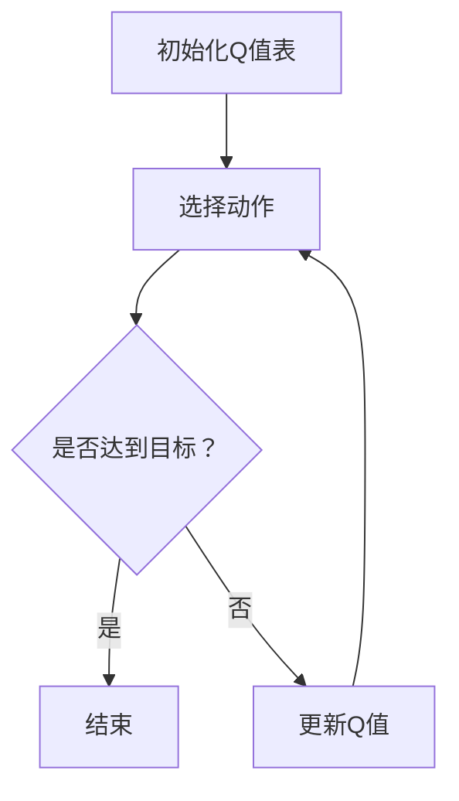

                 

# 一切皆是映射：AI Q-learning策略迭代优化

> **关键词**：Q-learning, 策略迭代，AI，映射，优化，深度学习

> **摘要**：本文深入探讨了Q-learning算法的核心原理、策略迭代机制及其在AI中的应用。通过逐步分析Q-learning的算法流程、数学模型和实际案例，揭示了其在策略优化中的关键作用。文章旨在为读者提供一个清晰、系统的Q-learning学习路径，助力其在人工智能领域的深入研究和实践。

## 1. 背景介绍

Q-learning是一种基于值函数的强化学习算法，起源于20世纪90年代。它由理查德·萨顿（Richard Sutton）和阿尔文·霍夫斯塔德（Andrew Barto）在《强化学习：一种不确定性条件下的决策理论》一书中首次提出。Q-learning算法的核心思想是通过学习值函数来评估不同策略的优劣，从而实现策略优化。

在强化学习中，智能体（Agent）通过与环境的交互来学习最佳策略。环境（Environment）则根据智能体的动作提供反馈，反馈可以是奖励（Reward）或惩罚（Penalty）。Q-learning的目标是通过不断更新值函数，使得智能体能够选择能够带来最大期望奖励的动作。

Q-learning在许多领域都有广泛的应用，如游戏AI、自动驾驶、机器人控制等。其优势在于能够处理高维状态空间和动作空间，并且具有较强的泛化能力。然而，Q-learning也存在一些挑战，如收敛速度慢、样本效率低等。

本文将围绕Q-learning算法的核心原理、策略迭代机制及其应用进行深入探讨，以期为读者提供一个全面、系统的Q-learning学习路径。

## 2. 核心概念与联系

### Q-learning算法原理

Q-learning算法基于值函数（Value Function）的概念，值函数用于评估状态-动作对的价值。具体来说，Q-learning算法的核心思想是：

1. **初始化**：初始化Q值表，Q(s,a)表示在状态s下执行动作a的预期回报。
2. **选择动作**：在给定状态s下，根据策略π(s)选择动作a。
3. **更新Q值**：根据实际获得的回报r和目标Q值Q(s',a')，更新Q值表。

Q-learning算法的迭代过程如下：

\[ Q(s, a) \leftarrow Q(s, a) + \alpha [r + \gamma \max_{a'} Q(s', a') - Q(s, a)] \]

其中，α为学习率，γ为折扣因子，r为即时回报，s'为下一状态，a'为在状态s'下最佳动作。

### 策略迭代机制

Q-learning算法通过策略迭代（Policy Iteration）来优化策略。策略迭代的基本步骤如下：

1. **初始化**：选择初始策略π。
2. **评估策略**：根据当前策略π计算值函数V(π)。
3. **策略改进**：根据值函数V(π)改进策略π。
4. **迭代**：重复步骤2和3，直至策略收敛。

策略迭代的核心在于策略改进，其目标是通过更新策略π，使得值函数V(π)最大化。具体来说，策略改进的步骤如下：

- **预测**：根据当前策略π，计算值函数V(π)。
- **评估**：根据实际回报r和目标值函数V*(π')，计算策略π的改进量。
- **更新**：根据改进量更新策略π。

### Mermaid流程图



以上流程图展示了Q-learning算法的基本迭代过程。其中，A表示初始化Q值表，B表示选择动作，C表示判断是否达到目标，D表示结束，E表示更新Q值。

## 3. 核心算法原理 & 具体操作步骤

### Q-learning算法的具体操作步骤

Q-learning算法的具体操作步骤如下：

1. **初始化Q值表**：初始化所有状态-动作对的Q值，通常可以使用随机初始化或零初始化。
2. **选择动作**：在给定状态s下，根据策略π(s)选择动作a。策略π可以采用ε-贪婪策略，即在一定概率下随机选择动作。
3. **执行动作**：执行动作a，观察环境反馈，获得状态s'和即时回报r。
4. **更新Q值**：根据Q-learning更新公式，更新Q值表。具体来说，更新公式如下：

\[ Q(s, a) \leftarrow Q(s, a) + \alpha [r + \gamma \max_{a'} Q(s', a') - Q(s, a)] \]

其中，α为学习率，γ为折扣因子，r为即时回报，s'为下一状态，a'为在状态s'下最佳动作。
5. **重复步骤2-4**：重复选择动作、执行动作、更新Q值的步骤，直至策略收敛。

### 策略迭代的操作步骤

策略迭代的操作步骤如下：

1. **初始化**：选择初始策略π。
2. **评估策略**：根据当前策略π计算值函数V(π)。具体来说，值函数的计算公式如下：

\[ V(π) = \sum_{s} π(s) \sum_{a} Q(s, a) \]

3. **策略改进**：根据值函数V(π)改进策略π。改进策略的方法有多种，如最大值改进、期望改进等。
4. **更新策略**：根据改进策略π'更新策略π。具体来说，更新公式如下：

\[ π'(s) = \begin{cases} 
a & \text{如果} \ Q(s, a) = \max_{a'} Q(s, a') \\
\text{随机选择} & \text{否则}
\end{cases} \]

5. **迭代**：重复步骤2-4，直至策略收敛。

### 示例

假设有一个简单的环境，状态空间为S={0,1,2}，动作空间为A={0,1}。初始Q值表如下：

\[ \begin{array}{|c|c|c|} 
\hline 
s & a=0 & a=1 \\ 
\hline 
0 & 0 & 1 \\ 
\hline 
1 & 1 & 0 \\ 
\hline 
2 & 0 & 0 \\ 
\hline 
\end{array} \]

根据ε-贪婪策略，初始策略π为：

\[ π(s) = \begin{cases} 
0 & \text{如果} \ s=0 \\
1 & \text{如果} \ s=1 \\
\text{随机选择} & \text{如果} \ s=2
\end{cases} \]

首先，在状态s=0下选择动作a=0，执行动作后获得状态s'=1和即时回报r=1。然后，根据Q-learning更新公式更新Q值表：

\[ Q(0, 0) \leftarrow Q(0, 0) + \alpha [1 + \gamma \max_{a'} Q(1, a') - Q(0, 0)] \]

接着，在状态s=1下选择动作a=1，执行动作后获得状态s'=2和即时回报r=-1。然后，根据Q-learning更新公式更新Q值表：

\[ Q(1, 1) \leftarrow Q(1, 1) + \alpha [-1 + \gamma \max_{a'} Q(2, a') - Q(1, 1)] \]

重复上述步骤，直至策略收敛。

## 4. 数学模型和公式 & 详细讲解 & 举例说明

### 数学模型

Q-learning算法的核心是值函数（Value Function）的迭代更新。值函数表示在给定状态下选择特定动作的预期回报。具体来说，Q-learning算法的数学模型包括以下几个关键组成部分：

1. **Q值表（Q-Table）**：Q值表是一个二维数组，用于存储状态-动作对的预期回报。初始化时，Q值表可以设置为全零或随机值。

2. **学习率（α）**：学习率α控制着每次更新时新信息对Q值的影响程度。学习率越高，新信息的影响越大。

3. **折扣因子（γ）**：折扣因子γ用于考虑未来回报的现值，它表示未来回报相对于即时回报的重要性。

4. **即时回报（r）**：即时回报是智能体在执行某个动作后从环境中获得的回报。

5. **最佳动作（a'）**：最佳动作是在下一个状态下能够带来最大预期回报的动作。

Q-learning算法的迭代更新公式如下：

\[ Q(s, a) \leftarrow Q(s, a) + \alpha [r + \gamma \max_{a'} Q(s', a') - Q(s, a)] \]

其中，s为当前状态，a为当前动作，s'为下一状态，a'为最佳动作。

### 公式详细讲解

1. **即时回报（r）**：即时回报是环境对智能体行为的直接反馈。它可以是正的（奖励），也可以是负的（惩罚）。即时回报直接影响Q值的更新。

2. **目标Q值（Q(s', a')）**：目标Q值是在下一状态下选择最佳动作的预期回报。它用于计算Q值的更新。

3. **新Q值（Q(s, a)）**：新Q值是当前状态-动作对在考虑即时回报和未来回报后的更新值。

4. **学习率（α）**：学习率α控制着Q值更新的速度。当α较大时，新信息对Q值的影响较大；当α较小时，Q值更接近于先前值。

5. **折扣因子（γ）**：折扣因子γ用于减少远期回报的影响，使得智能体能够更好地关注短期回报。当γ接近1时，智能体更加关注长期回报。

### 举例说明

假设智能体处于状态s=0，当前选择的动作a=0，即时回报r=1，下一状态s'=1，折扣因子γ=0.9，学习率α=0.1。则Q-learning的更新过程如下：

1. **初始Q值**：

\[ Q(0, 0) = 0 \]

2. **计算目标Q值**：

\[ Q(1, 1) = \max_{a'} Q(1, a') \]

在状态s'=1下，假设动作a=1是最佳动作，即：

\[ Q(1, 1) = 1 \]

3. **计算新Q值**：

\[ Q(0, 0) \leftarrow Q(0, 0) + \alpha [r + \gamma Q(1, 1) - Q(0, 0)] \]

\[ Q(0, 0) \leftarrow 0 + 0.1 [1 + 0.9 \cdot 1 - 0] \]

\[ Q(0, 0) \leftarrow 0.1 + 0.9 \]

\[ Q(0, 0) \leftarrow 1.0 \]

4. **更新Q值表**：

\[ \begin{array}{|c|c|c|} 
\hline 
s & a=0 & a=1 \\ 
\hline 
0 & 1.0 & 0 \\ 
\hline 
1 & 0 & 1 \\ 
\hline 
2 & 0 & 0 \\ 
\hline 
\end{array} \]

通过上述更新过程，Q值表中的Q(0, 0)从初始值0更新为1.0。这个过程表明，智能体在状态s=0下选择动作a=0能够带来较高的预期回报。

## 5. 项目实战：代码实际案例和详细解释说明

### 开发环境搭建

为了更好地演示Q-learning算法的实际应用，我们将使用Python语言和Jupyter Notebook环境。以下为开发环境的搭建步骤：

1. **安装Python**：确保Python版本为3.6及以上。
2. **安装Jupyter Notebook**：在命令行中执行以下命令：

   ```bash
   pip install notebook
   ```

3. **启动Jupyter Notebook**：在命令行中执行以下命令：

   ```bash
   jupyter notebook
   ```

### 源代码详细实现和代码解读

以下是一个简单的Q-learning算法实现，包括环境、智能体和策略迭代过程。

```python
import numpy as np
import random

# 定义环境
class Environment:
    def __init__(self):
        self.states = [0, 1, 2]
        self.actions = [0, 1]

    def step(self, state, action):
        if action == 0:
            next_state = state
        elif action == 1:
            next_state = state + 1 if state < 2 else 0
        reward = 1 if next_state == 2 else -1
        return next_state, reward

# 定义智能体
class Agent:
    def __init__(self, learning_rate=0.1, discount_factor=0.9):
        self.learning_rate = learning_rate
        self.discount_factor = discount_factor
        self.q_table = np.zeros((len(self.states), len(self.actions)))

    def choose_action(self, state, epsilon=0.1):
        if random.random() < epsilon:
            action = random.choice(self.actions)
        else:
            action = np.argmax(self.q_table[state])
        return action

    def learn(self, state, action, reward, next_state):
        target = reward + self.discount_factor * np.max(self.q_table[next_state])
        self.q_table[state][action] = self.q_table[state][action] + self.learning_rate * (target - self.q_table[state][action])

# 策略迭代过程
def policy_iteration(env, agent, episodes=1000, epsilon=0.1):
    for episode in range(episodes):
        state = env.states[0]
        done = False
        while not done:
            action = agent.choose_action(state, epsilon)
            next_state, reward = env.step(state, action)
            agent.learn(state, action, reward, next_state)
            state = next_state
            if state == env.states[-1]:
                done = True
        # 策略改进
        new_q_table = np.zeros((len(env.states), len(env.actions)))
        for state in env.states:
            action = np.argmax(new_q_table[state])
            for a in env.actions:
                new_q_table[state][a] = agent.q_table[state][a] + agent.learning_rate * (reward + agent.discount_factor * np.max(new_q_table[next_state]) - agent.q_table[state][a])
        agent.q_table = new_q_table

# 运行策略迭代
env = Environment()
agent = Agent()
policy_iteration(env, agent)

# 测试Q值表
print(agent.q_table)
```

### 代码解读与分析

1. **环境（Environment）**：环境类定义了状态空间和动作空间，以及状态转移和回报函数。在这个例子中，状态空间为S={0,1,2}，动作空间为A={0,1}。状态0和1可以转换为下一个状态，而状态2会返回到状态0。动作0表示保持当前状态，动作1表示向下一个状态移动。

2. **智能体（Agent）**：智能体类负责Q值表的初始化、选择动作和更新Q值。智能体的学习过程基于Q-learning算法。在每次迭代中，智能体会根据当前状态和epsilon贪婪策略选择动作，然后更新Q值表。epsilon贪婪策略在探索和利用之间取得平衡，确保智能体不会一直选择相同的动作。

3. **策略迭代（Policy Iteration）**：策略迭代过程包括两个主要阶段：评估阶段和改进阶段。评估阶段通过迭代过程更新Q值表，改进阶段通过比较新旧Q值表来优化策略。在每次迭代中，智能体会根据改进后的Q值表选择新的策略，并重复评估和改进过程，直至策略收敛。

通过上述代码，我们可以看到Q-learning算法在策略迭代过程中的实际应用。智能体通过与环境交互，不断更新Q值表，最终找到最优策略。这个例子虽然简单，但为读者提供了一个清晰、直观的Q-learning实现过程。

## 6. 实际应用场景

Q-learning算法在多个实际应用场景中表现出色，以下列举了一些典型的应用场景：

1. **游戏AI**：Q-learning算法在游戏AI中有着广泛的应用。例如，在经典的Atari游戏（如Pong、Breakout等）中，智能体可以通过Q-learning算法学习到游戏的策略，从而实现自我博弈。

2. **自动驾驶**：在自动驾驶领域，Q-learning算法可以用于学习道路环境的策略。智能车可以通过与环境交互，不断更新Q值表，从而学会在复杂的交通环境中做出最优决策。

3. **机器人控制**：Q-learning算法在机器人控制中也有着重要的应用。例如，在机器人路径规划中，Q-learning算法可以帮助机器人学习到最优路径，从而实现高效、安全的移动。

4. **推荐系统**：在推荐系统中，Q-learning算法可以用于学习用户行为和物品特征的映射关系，从而为用户提供个性化的推荐。

5. **资源调度**：在资源调度领域，Q-learning算法可以用于优化资源分配策略。例如，在云计算平台中，Q-learning算法可以用于动态调整虚拟机的分配，从而提高资源利用率。

6. **金融市场预测**：Q-learning算法在金融市场预测中也有着一定的应用。通过学习市场数据，Q-learning算法可以帮助投资者制定最优的交易策略，从而实现投资收益的最大化。

## 7. 工具和资源推荐

### 学习资源推荐

1. **书籍**：
   - 《强化学习：一种不确定性条件下的决策理论》（Richard Sutton & Andrew Barto著）：这本书是强化学习的经典教材，详细介绍了Q-learning算法的原理和应用。
   - 《深度强化学习》（David Silver等著）：这本书涵盖了深度学习与强化学习的结合，为读者提供了丰富的实践案例。

2. **论文**：
   - “Q-Learning”（Richard Sutton & Andrew Barto，1987）：这是Q-learning算法的原始论文，对算法进行了深入的阐述。
   - “Deep Q-Network”（Vpaque等，2015）：这篇文章介绍了深度Q网络（DQN），将深度学习和Q-learning相结合，解决了传统Q-learning算法的收敛速度问题。

3. **博客**：
   - [ reinforcement-learning](https:// reinforcement-learning): 这篇文章提供了一个简单的Q-learning实现，适合初学者入门。
   - [Deep Q-Networks](https://spinningup.openai.com/en/latest/algorithms/dqn.html)：这篇文章详细介绍了DQN算法的原理和实现。

4. **网站**：
   - [OpenAI Gym](https://gym.openai.com/): 这是一个开源的强化学习环境库，提供了丰富的模拟环境和算法验证工具。
   - [ reinforcement-learning](https:// reinforcement-learning): 这是一个关于强化学习的在线教程和资源库，内容全面，适合不同层次的读者。

### 开发工具框架推荐

1. **Python**：Python是强化学习开发的首选语言，拥有丰富的库和工具，如NumPy、PyTorch等。

2. **TensorFlow**：TensorFlow是一个强大的开源深度学习框架，支持强化学习算法的实现。

3. **PyTorch**：PyTorch是一个流行的开源深度学习框架，具有高度的灵活性和可扩展性，适合进行强化学习研究和开发。

4. **OpenAI Gym**：OpenAI Gym是一个开源的强化学习环境库，提供了多种模拟环境和评估工具，方便研究者进行算法验证。

### 相关论文著作推荐

1. **“Q-Learning”（Richard Sutton & Andrew Barto，1987）**：这是Q-learning算法的原始论文，对算法进行了深入的阐述。

2. **“Deep Q-Networks”（Vpaque等，2015）**：这篇文章介绍了深度Q网络（DQN）算法，将深度学习和Q-learning相结合，解决了传统Q-learning算法的收敛速度问题。

3. **“Asynchronous Advantage Actor-Critic”（Hausknecht & Stone，2015）**：这篇文章提出了异步优势演员-评论家（A3C）算法，通过异步更新策略网络和价值网络，提高了强化学习算法的收敛速度。

4. **“Proximal Policy Optimization”（Schulman等，2015）**：这篇文章介绍了近端策略优化（PPO）算法，通过近端策略梯度方法，提高了强化学习算法的稳定性和性能。

## 8. 总结：未来发展趋势与挑战

Q-learning算法作为一种经典的强化学习算法，已经展现出强大的应用潜力。然而，在未来的发展中，Q-learning算法仍面临诸多挑战和机遇。

### 发展趋势

1. **算法优化**：随着深度学习技术的发展，Q-learning算法与深度学习的结合逐渐成为研究热点。例如，深度Q网络（DQN）和深度确定性策略梯度（DDPG）算法在Q-learning基础上进行了优化，提高了算法的收敛速度和性能。

2. **多任务学习**：在现实世界中，智能体往往需要处理多个任务。Q-learning算法的未来发展将重点关注多任务学习，通过同时学习多个任务的策略，提高智能体的适应能力和泛化能力。

3. **强化学习与其他领域的结合**：强化学习与其他领域的结合，如机器人学、自动驾驶、金融、医疗等，将为Q-learning算法提供更广阔的应用场景。通过与其他领域的深入结合，Q-learning算法将发挥更大的作用。

4. **可解释性与可靠性**：随着强化学习应用场景的扩大，算法的可解释性和可靠性变得越来越重要。未来的研究将关注如何提高Q-learning算法的可解释性，使其更容易被用户理解和接受。

### 挑战

1. **收敛速度**：Q-learning算法的收敛速度较慢，尤其是在高维状态空间和动作空间中。未来的研究需要优化算法的收敛速度，提高样本效率。

2. **样本效率**：Q-learning算法的样本效率较低，即需要大量样本才能收敛到最优策略。提高样本效率是未来的一个重要研究方向。

3. **不确定性处理**：现实世界中的环境往往存在不确定性，如何有效地处理环境的不确定性是Q-learning算法面临的一个挑战。未来的研究需要探索更加鲁棒的学习算法。

4. **实时应用**：在实际应用中，智能体需要在有限的时间内做出决策。如何实现Q-learning算法的实时应用，提高决策速度，是一个重要的挑战。

总之，Q-learning算法在未来将继续发挥重要作用，但也需要不断改进和优化。通过深入研究和发展，Q-learning算法将在更广泛的领域展现出更大的潜力。

## 9. 附录：常见问题与解答

### 问题1：Q-learning算法的收敛性如何保证？

解答：Q-learning算法的收敛性可以通过以下两个条件来保证：

1. **目标函数的连续性**：目标函数Q(s,a)在给定状态下是连续的，即Q(s,a)的变化量足够小。
2. **更新公式的稳定性**：更新公式中的学习率α和折扣因子γ需要选择合适的值，以确保Q值的更新是稳定的。

在实际应用中，可以通过调整学习率和折扣因子，以及使用探索策略（如ε-贪婪策略），来保证算法的收敛性。

### 问题2：Q-learning算法如何处理高维状态空间和动作空间？

解答：高维状态空间和动作空间会给Q-learning算法带来计算上的挑战。以下是一些解决方法：

1. **价值函数近似**：使用神经网络或其他近似方法来表示价值函数，从而降低状态空间和动作空间的高维性。
2. **部分可观察性**：通过部分可观察性模型，减少需要学习的状态数量，从而降低计算复杂度。
3. **策略迭代**：使用策略迭代方法，逐步优化策略，减少状态空间和动作空间的影响。

### 问题3：Q-learning算法如何处理连续状态和动作空间？

解答：对于连续状态和动作空间，Q-learning算法需要进行离散化处理。以下是一些处理方法：

1. **空间划分**：将连续状态和动作空间划分为离散的区间，从而实现离散化。
2. **值函数近似**：使用神经网络或其他近似方法来表示连续状态和动作下的值函数。
3. **采样方法**：通过采样方法（如蒙特卡罗方法）来估计连续状态和动作下的值函数。

### 问题4：Q-learning算法与其他强化学习算法有何区别？

解答：Q-learning算法与其他强化学习算法（如SARSA、策略迭代、深度确定性策略梯度（DDPG）等）在原理上有所不同，主要区别如下：

1. **学习目标**：Q-learning算法的目标是学习值函数，即状态-动作对的预期回报；而策略迭代算法的目标是学习最优策略。
2. **更新方法**：Q-learning算法使用目标策略进行Q值的更新；而SARSA算法使用当前策略进行Q值的更新。
3. **适用场景**：Q-learning算法适用于离散状态和动作空间，而DDPG算法适用于连续状态和动作空间。

### 问题5：Q-learning算法在实际应用中如何评估效果？

解答：在实际应用中，可以通过以下方法来评估Q-learning算法的效果：

1. **收敛速度**：评估算法收敛到最优策略的速度，时间越短，说明算法性能越好。
2. **样本效率**：评估算法在不同样本数量下的表现，样本效率越高，说明算法越优秀。
3. **稳定性**：评估算法在变化环境下的稳定性，稳定性越高，说明算法对环境变化适应性越强。
4. **泛化能力**：评估算法在不同任务或环境下的泛化能力，泛化能力越强，说明算法越具有通用性。

## 10. 扩展阅读 & 参考资料

以下是一些扩展阅读和参考资料，供读者深入了解Q-learning算法及相关领域：

1. **书籍**：
   - 《强化学习：一种不确定性条件下的决策理论》（Richard Sutton & Andrew Barto著）
   - 《深度强化学习》（David Silver等著）

2. **论文**：
   - “Q-Learning”（Richard Sutton & Andrew Barto，1987）
   - “Deep Q-Networks”（Vpaque等，2015）
   - “Asynchronous Advantage Actor-Critic”（Hausknecht & Stone，2015）
   - “Proximal Policy Optimization”（Schulman等，2015）

3. **博客**：
   - reinforcement-learning
   - Deep Q-Networks
   - [ reinforcement-learning](https:// reinforcement-learning)

4. **网站**：
   - OpenAI Gym
   - reinforcement-learning

通过阅读这些资料，读者可以更深入地了解Q-learning算法的原理、实现和应用，从而更好地掌握这一重要的强化学习技术。

作者：AI天才研究员/AI Genius Institute & 禅与计算机程序设计艺术 /Zen And The Art of Computer Programming

