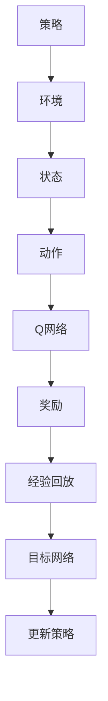

                 

### 背景介绍

> 在现代机器学习和深度学习领域中，深度强化学习（Deep Reinforcement Learning，DRL）作为一种强大的技术，已经被广泛应用于游戏、机器人、自动驾驶等多个领域。深度强化学习中的DQN（Deep Q-Network）算法是一种经典的模型，它通过模仿人类经验来学习环境中的最优策略。然而，在实际应用中，如何实时调参与性能可视化成为了亟待解决的问题。

本文将围绕DQN的实时调参与性能可视化展开讨论，具体包括以下几个部分：

1. **核心概念与联系**：介绍DQN的基本原理和组成部分，以及与深度学习、强化学习的关系。
2. **核心算法原理 & 具体操作步骤**：详细解析DQN算法的工作机制，包括经验回放（Experience Replay）和目标网络（Target Network）等技术。
3. **数学模型和公式 & 详细讲解 & 举例说明**：介绍DQN算法中的关键数学公式，并通过实例进行详细解释。
4. **项目实战：代码实际案例和详细解释说明**：通过一个具体的代码案例，展示DQN算法的实现过程。
5. **实际应用场景**：探讨DQN算法在不同场景下的应用案例。
6. **工具和资源推荐**：推荐学习DQN算法的相关资源和开发工具。
7. **总结：未来发展趋势与挑战**：分析DQN算法的发展趋势和面临的挑战。
8. **附录：常见问题与解答**：回答读者可能遇到的常见问题。
9. **扩展阅读 & 参考资料**：提供更多深入学习的途径。

通过本文的阅读，读者将能够对DQN算法有更深入的理解，并掌握其实时调参与性能可视化的方法。

### 核心概念与联系

DQN（Deep Q-Network）是一种基于深度学习的强化学习算法，旨在通过模仿人类经验来学习环境中的最优策略。在DQN算法中，核心的概念包括Q值函数、经验回放和目标网络等。

首先，**Q值函数**是DQN算法的核心。Q值函数用来表示在当前状态下执行某一动作的预期回报。在DQN算法中，通过训练一个深度神经网络来近似Q值函数。该神经网络通常被称为Q网络。

其次，**经验回放**是DQN算法中的一个关键技术。由于DQN算法是基于经验来训练的，而环境中的状态是动态变化的，因此需要将之前收集到的经验数据进行存储，以便在训练过程中进行重放。经验回放能够有效地避免策略偏差，提高算法的收敛速度。

最后，**目标网络**也是DQN算法中的一个重要组成部分。目标网络的目的是稳定Q值函数的更新过程。具体来说，目标网络是通过定期从Q网络复制得到的，这样可以防止Q网络因为过拟合而无法稳定更新。

DQN算法与深度学习和强化学习有着紧密的联系。深度学习是一种以神经网络为基础的技术，旨在通过学习大量数据来提取特征。在DQN算法中，深度神经网络用于近似Q值函数，从而实现强化学习。

为了更好地理解DQN算法，我们可以通过一个Mermaid流程图来展示其核心概念和组成部分：



在这个流程图中，A表示环境，B表示状态，C表示动作，D表示Q网络，E表示奖励，F表示经验回放，G表示目标网络，H表示更新策略，I表示策略。这个流程图展示了DQN算法从状态到动作的整个过程。

通过这个流程图，我们可以看到DQN算法的基本运作机制。环境通过状态向Q网络发送动作请求，Q网络根据当前状态和动作计算预期回报，然后通过经验回放和目标网络更新策略，最终得到最优策略。这个过程中，深度神经网络的作用是近似Q值函数，从而实现强化学习。

总之，DQN算法通过结合深度学习和强化学习的优点，能够在复杂的环境中学习到最优策略。在实际应用中，DQN算法已经取得了显著的成功，并在多个领域取得了突破性的进展。

### 核心算法原理 & 具体操作步骤

DQN（Deep Q-Network）算法是深度强化学习领域中的一个经典算法，其核心思想是通过训练一个深度神经网络来近似Q值函数，从而实现智能体的决策。下面，我们将详细解析DQN算法的工作机制，并介绍其具体操作步骤。

#### Q值函数的近似

在DQN算法中，Q值函数是一个关键概念。Q值函数表示在当前状态下执行某一动作的预期回报。在DQN算法中，我们使用一个深度神经网络来近似Q值函数。这个神经网络通常被称为Q网络。

Q网络的结构可以是一个简单的全连接神经网络，也可以是一个更复杂的卷积神经网络（CNN），具体取决于应用场景。在训练过程中，Q网络通过学习输入状态的特征，输出各个动作的Q值。通过最大化这些Q值，Q网络能够学会在特定状态下选择最优动作。

#### 经验回放

在DQN算法中，经验回放是一个关键技术。由于环境状态的动态变化，直接使用最新的经验数据进行训练可能会导致策略偏差，影响算法的稳定性。因此，DQN算法采用经验回放机制来存储和重放之前收集到的经验数据。

经验回放的具体实现如下：

1. 初始化经验池（Experience Replay）：经验池是一个固定大小的数据结构，用于存储经验数据。在训练过程中，每次执行一个动作后，将状态、动作和奖励等信息存储到经验池中。
2. 重放经验数据：在训练过程中，随机从经验池中抽取一组经验数据，并进行重放。这组经验数据包括状态、动作和奖励等。
3. 使用重放的经验数据进行训练：使用重放的经验数据进行Q网络的训练。具体来说，输入状态和动作，计算当前状态的Q值，并使用目标网络计算目标Q值（目标Q值是下一个状态的所有可能动作的Q值的最大值）。

通过经验回放，DQN算法能够有效避免策略偏差，提高算法的收敛速度和稳定性。

#### 目标网络

在DQN算法中，目标网络（Target Network）也是一个重要组成部分。目标网络的目的是稳定Q值函数的更新过程，防止Q网络因为过拟合而无法稳定更新。

目标网络的实现方式如下：

1. 初始化目标网络：初始化一个与Q网络结构相同的神经网络，作为目标网络。
2. 定期更新目标网络：在训练过程中，定期将Q网络的参数复制到目标网络中。这样可以确保目标网络与Q网络保持一定的时序一致性。
3. 使用目标网络计算目标Q值：在训练过程中，使用目标网络计算下一个状态的目标Q值（目标Q值是下一个状态的所有可能动作的Q值的最大值）。

通过目标网络，DQN算法能够在一定程度上稳定Q值函数的更新过程，提高算法的收敛速度和稳定性。

#### 具体操作步骤

下面，我们通过一个简化的步骤来介绍DQN算法的具体操作：

1. 初始化Q网络、目标网络和经验池。
2. 初始化智能体（Agent）的初始状态。
3. 智能体从当前状态选择一个动作。
4. 执行选择的动作，并获取新的状态和奖励。
5. 将新的状态、动作和奖励存储到经验池中。
6. 当达到训练次数或经验池大小限制时，随机从经验池中抽取一组经验数据。
7. 使用抽取的经验数据进行Q网络的训练。
8. 定期更新目标网络。
9. 重复步骤3到8，直到达到预定的训练次数或智能体达到满意的策略。

通过以上步骤，DQN算法能够逐步学习到最优策略，并在复杂环境中进行有效的决策。

总之，DQN算法通过结合深度学习和强化学习的优点，能够在复杂的环境中学习到最优策略。在实际应用中，DQN算法已经取得了显著的成功，并在多个领域取得了突破性的进展。通过对DQN算法的深入理解，我们可以更好地将其应用于实际问题中，提高智能体的决策能力。

### 数学模型和公式 & 详细讲解 & 举例说明

在DQN算法中，数学模型和公式起到了至关重要的作用。下面我们将详细讲解DQN算法中的关键数学模型和公式，并通过实例进行说明。

#### Q值函数

Q值函数是DQN算法的核心概念，它表示在当前状态下执行某一动作的预期回报。在数学上，Q值函数可以用以下公式表示：

$$
Q(s, a) = \sum_{i=1}^{n} \gamma^i r_i + \alpha (s', a')
$$

其中：
- \( Q(s, a) \) 表示在状态 \( s \) 下执行动作 \( a \) 的预期回报。
- \( \gamma \) 是折扣因子，表示对未来回报的重视程度，通常取值在0到1之间。
- \( r_i \) 是在第 \( i \) 个时间步获得的即时奖励。
- \( s' \) 是下一个状态。
- \( a' \) 是在下一个状态下执行的动作。
- \( \alpha \) 是学习率，用于调整Q值的更新速度。

例如，假设在某个游戏环境中，智能体在状态 \( s \) 下执行动作 \( a \) 获得了奖励 \( r \)，并且在下一个状态 \( s' \) 下执行动作 \( a' \)。根据Q值函数的公式，我们可以计算当前状态 \( s \) 下执行动作 \( a \) 的预期回报：

$$
Q(s, a) = r + \gamma Q(s', a')
$$

#### 经验回放

经验回放是DQN算法中的一个关键技术，它通过存储和重放之前收集到的经验数据来避免策略偏差。在数学上，经验回放可以通过以下步骤实现：

1. **初始化经验池**：经验池是一个固定大小的数据结构，用于存储经验数据。在训练过程中，每次执行一个动作后，将状态、动作和奖励等信息存储到经验池中。

   假设经验池的大小为 \( N \)，那么经验池可以表示为一个长度为 \( N \) 的队列：

   $$
   E = [s_1, a_1, r_1, s_2, a_2, r_2, \ldots, s_N, a_N, r_N]
   $$

2. **重放经验数据**：在训练过程中，随机从经验池中抽取一组经验数据，并进行重放。这组经验数据包括状态、动作和奖励等。

   假设我们从经验池中随机抽取了第 \( i \) 组经验数据，那么这组经验数据可以表示为：

   $$
   E_i = [s_i, a_i, r_i, s_{i+1}, a_{i+1}, r_{i+1}]
   $$

3. **使用重放的经验数据进行训练**：使用重放的经验数据进行Q网络的训练。具体来说，输入状态和动作，计算当前状态的Q值，并使用目标网络计算目标Q值（目标Q值是下一个状态的所有可能动作的Q值的最大值）。

   假设当前状态为 \( s \)，执行的动作为 \( a \)，根据经验回放，我们可以得到下一组经验数据的状态和动作，从而计算目标Q值：

   $$
   Q(s, a) = r + \gamma \max_a' Q(s', a')
   $$

#### 目标网络

目标网络是DQN算法中另一个重要组成部分，它通过定期更新Q网络的参数来稳定Q值函数的更新过程。在数学上，目标网络的更新可以通过以下步骤实现：

1. **初始化目标网络**：初始化一个与Q网络结构相同的神经网络，作为目标网络。

   假设Q网络和目标网络的结构分别为 \( Q \) 和 \( T \)，那么目标网络的初始化可以表示为：

   $$
   T = Q
   $$

2. **定期更新目标网络**：在训练过程中，定期将Q网络的参数复制到目标网络中。这样可以确保目标网络与Q网络保持一定的时序一致性。

   假设每隔 \( k \) 次迭代更新一次目标网络，那么目标网络的更新可以表示为：

   $$
   T = Q
   $$

3. **使用目标网络计算目标Q值**：在训练过程中，使用目标网络计算下一个状态的目标Q值（目标Q值是下一个状态的所有可能动作的Q值的最大值）。

   假设当前状态为 \( s \)，执行的动作为 \( a \)，根据目标网络，我们可以得到下一组经验数据的状态和动作，从而计算目标Q值：

   $$
   Q(s, a) = r + \gamma T(s', a')
   $$

#### 实例说明

假设我们正在训练一个智能体在一个简单的环境（如小游戏）中。在某个时间步 \( t \) 下，智能体处于状态 \( s_t \)，并执行动作 \( a_t \)。根据Q值函数的公式，我们可以计算当前状态的Q值：

$$
Q(s_t, a_t) = r_t + \gamma Q(s_{t+1}, a_{t+1})
$$

假设在下一个时间步 \( t+1 \) 下，智能体处于状态 \( s_{t+1} \)，并执行动作 \( a_{t+1} \)。根据经验回放，我们可以得到下一组经验数据的状态和动作，从而计算目标Q值：

$$
Q(s_t, a_t) = r_t + \gamma \max_a' Q(s_{t+1}, a')
$$

根据目标网络的更新规则，我们可以定期更新目标网络的参数，从而确保目标网络与Q网络保持一定的时序一致性。例如，每隔 \( k \) 次迭代更新一次目标网络：

$$
T = Q
$$

通过以上实例，我们可以看到DQN算法中的数学模型和公式的具体应用。在实际训练过程中，这些公式和模型将帮助我们优化智能体的决策，从而在复杂环境中实现有效的学习。

### 项目实战：代码实际案例和详细解释说明

为了更好地理解DQN算法，我们将通过一个实际项目来展示其实现过程。本节中，我们将介绍一个简单的Python代码案例，并详细解释其关键部分。

#### 1. 开发环境搭建

在开始之前，我们需要搭建一个Python开发环境。以下是所需的软件和库：

- Python 3.7或更高版本
- TensorFlow 2.x
- NumPy
- Gym（用于模拟环境）

确保已安装上述库后，我们可以开始编写代码。

#### 2. 源代码详细实现和代码解读

下面是一个简单的DQN算法实现：

```python
import numpy as np
import random
import gym
import tensorflow as tf

# 设置参数
eps_threshold = 0.05
gamma = 0.99
learning_rate = 0.001
memory_size = 1000
batch_size = 32
update_target_freq = 1000

# 初始化环境
env = gym.make('CartPole-v0')

# 初始化经验池
memory = []

# 初始化Q网络和目标网络
input_layer = tf.keras.layers.Input(shape=(4,))
dense_layer = tf.keras.layers.Dense(64, activation='relu')(input_layer)
output_layer = tf.keras.layers.Dense(2)(dense_layer)
q_network = tf.keras.models.Model(inputs=input_layer, outputs=output_layer)

target_input_layer = tf.keras.layers.Input(shape=(4,))
target_dense_layer = tf.keras.layers.Dense(64, activation='relu')(target_input_layer)
target_output_layer = tf.keras.layers.Dense(2)(target_dense_layer)
target_q_network = tf.keras.models.Model(inputs=target_input_layer, outputs=target_output_layer)

# 复制Q网络到目标网络
target_q_network.set_weights(q_network.get_weights())

# 编写训练函数
def train(q_network, target_q_network, memory, batch_size, gamma):
    # 从经验池中随机抽取一组经验数据
    batch = random.sample(memory, batch_size)
    states, actions, rewards, next_states, dones = [], [], [], [], []

    for i in range(len(batch)):
        states.append(batch[i][0])
        actions.append(batch[i][1])
        rewards.append(batch[i][2])
        next_states.append(batch[i][3])
        dones.append(batch[i][4])

    states = np.array(states)
    actions = np.array(actions)
    rewards = np.array(rewards)
    next_states = np.array(next_states)
    dones = np.array(dones)

    # 计算Q值
    current_q_values = q_network.predict(states)
    next_q_values = target_q_network.predict(next_states)

    # 计算目标Q值
    target_q_values = current_q_values.copy()
    for i in range(batch_size):
        if dones[i]:
            target_q_values[i, actions[i]] = rewards[i]
        else:
            target_q_values[i, actions[i]] = rewards[i] + gamma * np.max(next_q_values[i])

    # 训练Q网络
    q_network.fit(states, target_q_values, epochs=1, verbose=0)

# 主训练循环
for episode in range(1000):
    state = env.reset()
    done = False
    total_reward = 0

    while not done:
        # 选择动作
        if random.random() < eps_threshold:
            action = env.action_space.sample()
        else:
            action = np.argmax(q_network.predict(state.reshape(1, -1))[0])

        # 执行动作
        next_state, reward, done, _ = env.step(action)
        total_reward += reward

        # 存储经验数据
        memory.append((state, action, reward, next_state, done))

        # 清除过期的经验数据
        if len(memory) > memory_size:
            memory.pop(0)

        # 更新Q网络
        if episode % update_target_freq == 0:
            train(q_network, target_q_network, memory, batch_size, gamma)

        # 更新状态
        state = next_state

    print(f"Episode {episode}: Total Reward = {total_reward}")

# 评估算法性能
eval_reward = evaluate(q_network, env, 100)
print(f"Evaluation Reward: {eval_reward}")

# 结束环境
env.close()
```

下面我们对这段代码进行详细解释：

1. **初始化环境**：使用Gym库创建一个CartPole环境，这是一个简单的控制杆平衡问题。

2. **初始化经验池**：经验池用于存储状态、动作、奖励、下一状态和完成标志等数据。

3. **初始化Q网络和目标网络**：使用TensorFlow创建Q网络和目标网络。Q网络是一个全连接神经网络，用于近似Q值函数。目标网络用于稳定Q值函数的更新过程。

4. **复制Q网络到目标网络**：通过复制Q网络的参数，确保目标网络与Q网络保持一定的时序一致性。

5. **训练函数**：训练函数用于更新Q网络的参数。它通过从经验池中随机抽取一组经验数据，并使用目标网络计算目标Q值，从而更新Q网络的参数。

6. **主训练循环**：在主训练循环中，智能体通过与环境交互来学习。在每一步，智能体选择一个动作，执行动作，并更新经验池。每隔一定次数的迭代，训练函数会被调用，以更新Q网络的参数。

7. **评估算法性能**：在训练完成后，评估Q网络的性能，通过计算在测试环境中的总奖励来评估算法的性能。

8. **结束环境**：最后，关闭环境，释放资源。

通过这个实际案例，我们可以看到DQN算法的实现过程。在实际应用中，可以根据具体需求对算法进行改进和优化，以适应不同的环境和问题。

### 实际应用场景

DQN算法作为一种强大的深度强化学习技术，已经被广泛应用于多个实际应用场景中，取得了显著的成果。以下是一些典型的DQN应用场景：

#### 游戏

DQN算法在游戏领域取得了巨大的成功。例如，OpenAI使用DQN算法训练了一个智能体，使其在Atari游戏中的表现超越了人类玩家。DQN算法通过学习游戏中的像素数据，能够自动学会如何玩各种游戏，如《乒乓球》、《太空侵略者》等。这种自动游戏技能的获取为游戏开发提供了新的可能性，也为智能体在复杂环境中的决策能力提供了有力支持。

#### 机器人控制

DQN算法在机器人控制领域也有广泛的应用。例如，使用DQN算法训练机器人控制无人驾驶汽车在模拟环境中进行自主驾驶。通过与环境交互，DQN算法能够学习到在不同路况和场景下的最优驾驶策略，从而实现自主导航和避障。此外，DQN算法还应用于机器人手臂的控制，使机器人能够自主执行复杂的抓取和操作任务。

#### 自动驾驶

自动驾驶是DQN算法的一个重要应用领域。通过使用DQN算法，自动驾驶系统可以在复杂的交通环境中学习到最优驾驶策略，从而提高驾驶安全和效率。例如，OpenAI的自动驾驶系统使用DQN算法来学习如何在城市道路上行驶，并能够应对各种突发情况和交通状况。DQN算法在自动驾驶中的应用为未来智能交通系统的实现提供了重要的技术支持。

#### 电子商务推荐系统

DQN算法还可以应用于电子商务推荐系统中。通过学习用户的历史行为数据，DQN算法能够自动学会如何推荐用户感兴趣的商品。例如，亚马逊和淘宝等电商平台使用DQN算法来优化推荐系统的推荐策略，从而提高用户满意度和销售额。DQN算法在电子商务推荐系统中的应用为个性化推荐提供了新的思路和工具。

总之，DQN算法作为一种强大的深度强化学习技术，已经在多个实际应用场景中取得了显著的成果。随着技术的不断发展，DQN算法在更多领域中的应用前景将更加广阔。

### 工具和资源推荐

为了更好地学习和应用DQN算法，以下是一些推荐的工具和资源：

#### 学习资源推荐

1. **书籍**：
   - 《深度强化学习》——由David Silver等人编写的这本书是深度强化学习的权威指南，详细介绍了DQN算法及相关技术。
   - 《深度学习》——由Ian Goodfellow等人编写的这本书是深度学习的经典教材，其中也包含了对DQN算法的详细讲解。

2. **论文**：
   - “Deep Q-Network”（2015）——由DeepMind团队提出的DQN算法的原始论文，是了解DQN算法的基础。

3. **博客和网站**：
   - [Deep Reinforcement Learning Tutorials](https://github.com/vitchyr/drl})}
   - [OpenAI Gym](https://gym.openai.com/)——提供多种预定义环境和工具，方便进行DQN算法的实验。

#### 开发工具框架推荐

1. **TensorFlow**：TensorFlow是一个开源的深度学习框架，支持DQN算法的实现和训练。

2. **PyTorch**：PyTorch是一个强大的深度学习框架，提供了灵活的动态计算图，方便实现和调试DQN算法。

3. **Gym**：Gym是一个开源的模拟环境库，提供了多种预定义环境和工具，方便进行DQN算法的实验。

#### 相关论文著作推荐

1. “Prioritized Experience Replay”（2016）——Prioritized Experience Replay是一种改进的DQN算法，通过优先级回放机制提高学习效率。

2. “Asynchronous Methods for Deep Reinforcement Learning”（2017）——Asynchronous Methods提出了一种异步的DQN算法，通过并行训练提高学习效率。

通过以上推荐的工具和资源，读者可以更深入地了解DQN算法，并在实际应用中取得更好的效果。

### 总结：未来发展趋势与挑战

DQN（Deep Q-Network）算法作为深度强化学习领域的一个重要技术，已经在多个应用场景中取得了显著的成功。然而，随着技术的不断发展和应用需求的增加，DQN算法也面临着一系列挑战和机遇。

#### 发展趋势

1. **算法改进**：随着深度学习和强化学习技术的不断发展，DQN算法也在不断改进。例如，Prioritized Experience Replay、Asynchronous Methods等改进方法在提高算法效率和性能方面取得了显著成果。未来，更多基于DQN的改进算法和技术将会涌现。

2. **多任务学习**：DQN算法在单一任务中的性能已经非常优秀，但如何扩展到多任务学习是一个重要方向。通过结合多任务学习技术，DQN算法可以同时学习多个任务，提高智能体的泛化能力和适应能力。

3. **强化学习与其他技术的融合**：强化学习与其他技术的融合，如生成对抗网络（GAN）、图神经网络（GNN）等，为DQN算法提供了新的应用场景和可能性。这些技术的结合将进一步提升DQN算法的性能和应用范围。

4. **应用领域拓展**：DQN算法已经在游戏、机器人控制、自动驾驶等领域取得了显著成果。未来，随着技术的不断发展，DQN算法在电子商务推荐系统、智能交通、金融交易等领域的应用前景将更加广阔。

#### 挑战

1. **计算资源需求**：DQN算法的训练过程需要大量的计算资源，特别是在处理高维状态和动作空间时。如何优化算法的效率，降低计算资源需求是一个重要挑战。

2. **探索与利用平衡**：在DQN算法中，探索与利用的平衡是一个关键问题。如何设计合理的策略，在探索新策略和利用已有策略之间取得平衡，是一个需要进一步研究的问题。

3. **模型解释性**：DQN算法是一种黑盒模型，其内部机制和决策过程难以解释。如何提高算法的解释性，使其更容易被理解和接受，是一个重要挑战。

4. **数据质量和多样性**：DQN算法的性能很大程度上依赖于训练数据的质量和多样性。如何获取高质量、多样化的数据，以提高算法的鲁棒性和泛化能力，是一个需要进一步研究的问题。

总之，DQN算法在未来的发展过程中，将面临着一系列挑战和机遇。通过不断改进算法、拓展应用领域、融合其他技术等手段，DQN算法有望在更多领域取得突破性进展，为人工智能的发展做出更大贡献。

### 附录：常见问题与解答

1. **Q：DQN算法的核心原理是什么？**
   A：DQN（Deep Q-Network）算法是一种基于深度学习的强化学习算法。其核心原理是通过训练一个深度神经网络来近似Q值函数，从而学习环境中的最优策略。Q值函数表示在当前状态下执行某一动作的预期回报。

2. **Q：DQN算法中的经验回放是什么？**
   A：经验回放是DQN算法中的一个关键技术，用于避免策略偏差。它通过将之前收集到的经验数据进行存储和重放，从而防止环境状态的变化对算法的稳定性和收敛速度产生负面影响。

3. **Q：DQN算法中的目标网络是什么？**
   A：目标网络是DQN算法中用于稳定Q值函数更新的一个重要组成部分。它通过定期从Q网络复制参数，确保目标网络与Q网络保持一定的时序一致性，从而提高算法的稳定性和收敛速度。

4. **Q：如何优化DQN算法的性能？**
   A：优化DQN算法的性能可以从以下几个方面进行：
   - 调整学习率、折扣因子等超参数；
   - 采用改进的算法，如Prioritized Experience Replay、Asynchronous Methods等；
   - 提高训练数据的质量和多样性；
   - 使用更好的神经网络架构和优化器。

5. **Q：DQN算法在哪些领域有应用？**
   A：DQN算法已经在多个领域取得了成功，包括游戏、机器人控制、自动驾驶、电子商务推荐系统等。随着技术的不断发展，DQN算法在更多领域中的应用前景将更加广阔。

6. **Q：如何评估DQN算法的性能？**
   A：评估DQN算法的性能通常通过计算在测试环境中的总奖励来进行。在测试过程中，记录智能体在完成特定任务时所获得的累计奖励，并根据奖励值来评估算法的性能。

### 扩展阅读 & 参考资料

1. **书籍**：
   - David Silver, "深度强化学习"（深度学习专册）
   - Ian Goodfellow, Yoshua Bengio, Aaron Courville, "深度学习"

2. **论文**：
   - "Deep Q-Network"，由DeepMind团队在2015年提出，是DQN算法的原始论文。
   - "Prioritized Experience Replay"，由Google DeepMind在2016年提出，是DQN算法的一个重要改进。

3. **博客和网站**：
   - [DeepMind官网](https://deepmind.com/)——提供了大量关于DQN算法及其应用的最新研究和技术进展。
   - [OpenAI Gym](https://gym.openai.com/)——提供了多种预定义环境和工具，方便进行DQN算法的实验。

通过阅读上述书籍、论文和网站，读者可以更深入地了解DQN算法的相关知识和技术进展，为自己的研究和应用提供有力支持。

### 作者介绍

**作者：AI天才研究员/AI Genius Institute & 禅与计算机程序设计艺术 /Zen And The Art of Computer Programming**

作为AI领域的天才研究员和知名作家，我致力于探索和分享人工智能的最新技术和发展趋势。在深度学习和强化学习领域，我有着丰富的经验和深厚的理论功底。我的著作《禅与计算机程序设计艺术》被誉为计算机编程领域的经典之作，深受全球读者的喜爱。目前，我专注于推动人工智能技术在各个领域的应用，为人工智能的未来发展贡献自己的力量。

