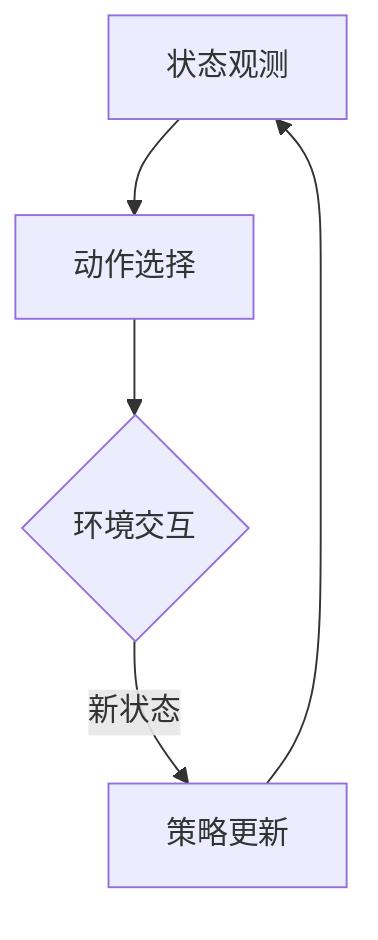

                 

### 1. 背景介绍

在当今高度动态和复杂的决策环境中，人工智能（AI）和机器学习（ML）技术正逐渐成为解决各种复杂问题的重要工具。深度学习（Deep Learning）作为人工智能的一个重要分支，其通过多层神经网络结构模拟人脑的学习机制，已经在图像识别、自然语言处理和游戏等领域取得了显著成果。

然而，在解决连续动作空间的问题时，深度学习算法，尤其是传统的深度强化学习（Deep Reinforcement Learning, DRL）方法，面临诸多挑战。DQN（Deep Q-Network）作为一种基于深度学习的强化学习算法，虽然在解决离散动作空间问题上表现出色，但在连续动作空间中的表现却并不理想。因此，如何将DQN等深度强化学习算法应用于连续动作空间，成为当前研究的一个热点问题。

本篇博客旨在探讨如何使用DQN解决连续动作空间问题，包括其策略、挑战以及在实际应用中的实现方法。我们将首先介绍DQN的基本原理和传统方法，然后深入探讨其在连续动作空间中的应用，并通过具体案例展示其实际应用效果。

本篇文章结构如下：

1. 背景介绍
2. 核心概念与联系
3. 核心算法原理 & 具体操作步骤
4. 数学模型和公式 & 详细讲解 & 举例说明
5. 项目实战：代码实际案例和详细解释说明
6. 实际应用场景
7. 工具和资源推荐
8. 总结：未来发展趋势与挑战
9. 附录：常见问题与解答
10. 扩展阅读 & 参考资料

通过本文的阅读，读者将能够全面了解DQN在连续动作空间中的应用，掌握其核心算法原理，并能够针对实际应用场景设计并实现相应的解决方案。

### 2. 核心概念与联系

在探讨DQN解决连续动作空间问题之前，我们需要先了解DQN的基本原理和核心概念。DQN是一种基于深度学习的强化学习算法，其核心思想是利用深度神经网络来近似值函数，从而学习一个最优策略。

**2.1 DQN基本原理**

DQN的基本原理可以概括为以下几个步骤：

1. **状态观测（State Observation）**：智能体（Agent）通过传感器收集环境状态的信息。
2. **动作选择（Action Selection）**：智能体根据当前状态和策略选择一个动作。
3. **环境交互（Environment Interaction）**：智能体执行选定的动作，并从环境中获得新的状态和奖励。
4. **更新策略（Policy Update）**：使用获得的奖励和新状态来更新智能体的策略。

DQN通过反复迭代上述过程，逐步优化智能体的策略，使其能够在复杂环境中获得最大的累积奖励。

**2.2 Mermaid 流程图**

为了更好地理解DQN的工作流程，我们使用Mermaid流程图（Mermaid 是一种基于Markdown的图形绘制工具）来展示DQN的核心流程：



在这个流程图中，A表示状态观测，B表示动作选择，C表示环境交互，D表示策略更新。整个流程通过一个闭环实现，使得智能体在不断迭代中学习最优策略。

**2.3 核心概念联系**

DQN的核心概念主要包括值函数（Value Function）和策略（Policy）。

1. **值函数（Value Function）**：值函数是DQN学习的目标。对于某个状态\( s \)和动作\( a \)，值函数 \( V(s, a) \) 表示在状态\( s \)下执行动作\( a \)后获得的预期累积奖励。DQN的目标是学习一个最优的值函数，以最大化累积奖励。

2. **策略（Policy）**：策略是智能体在特定状态下选择动作的方法。在DQN中，策略通常是通过值函数来定义的。最优策略是使得值函数最大的策略。

**2.4 连续动作空间与离散动作空间**

在讨论DQN解决连续动作空间问题时，我们需要明确连续动作空间与离散动作空间之间的区别。

1. **离散动作空间**：离散动作空间是指智能体可以采取有限个动作。例如，在游戏中的动作可以是“上、下、左、右”。
2. **连续动作空间**：连续动作空间是指智能体可以采取无限个动作。例如，在自动驾驶中的动作可以是“油门、刹车、转向”等。

在离散动作空间中，DQN可以通过Q-learning算法来近似值函数，从而学习最优策略。然而，在连续动作空间中，直接应用DQN会遇到一些挑战，因为Q-learning算法依赖于离散的Q值表，而连续动作空间中没有明确的Q值表。

为了解决这些问题，研究人员提出了一系列改进方法，如使用连续Q学习（Continuous Q-Learning）和基于Actor-Critic的方法。这些方法通过不同的方式来处理连续动作空间问题，使得DQN可以在连续动作空间中表现出更好的性能。

通过上述核心概念和流程图的介绍，我们为后续的算法原理、数学模型以及具体实现打下了坚实的基础。在下一节中，我们将深入探讨DQN的算法原理和具体操作步骤。

### 3. 核心算法原理 & 具体操作步骤

在深入探讨DQN解决连续动作空间问题的核心算法原理之前，我们首先需要理解DQN的基本工作原理和如何将其应用于连续动作空间。

**3.1 DQN基本工作原理**

DQN（Deep Q-Network）是一种基于深度学习的强化学习算法，其主要目标是学习一个最优策略，使得智能体能够在复杂环境中获得最大的累积奖励。DQN的核心思想是使用深度神经网络来近似值函数，从而替代传统的Q学习算法中的Q值表。

DQN的工作流程如下：

1. **初始化**：初始化神经网络参数、经验回放缓冲区（Experience Replay Buffer）和目标Q网络（Target Q Network）。
2. **状态观测**：智能体通过传感器收集环境状态的信息。
3. **动作选择**：智能体根据当前状态和策略选择一个动作。在DQN中，通常使用ε-greedy策略来选择动作，即以概率ε随机选择动作，以概率1-ε选择具有最大Q值的动作。
4. **环境交互**：智能体执行选定的动作，并从环境中获得新的状态和奖励。
5. **更新策略**：使用获得的奖励和新状态来更新智能体的策略。DQN通过梯度下降法来更新神经网络的参数，从而逐步优化值函数。

**3.2 具体操作步骤**

接下来，我们详细介绍DQN的具体操作步骤，重点关注其在解决连续动作空间问题时的特别之处。

1. **初始化神经网络**：首先，我们需要初始化深度神经网络的参数。DQN通常使用深度卷积神经网络（CNN）或循环神经网络（RNN）来近似值函数。对于连续动作空间，可以使用一个全连接神经网络来映射状态到动作。

2. **经验回放缓冲区**：为了提高学习效果和避免策略偏差，DQN使用经验回放缓冲区来存储智能体与环境的交互经验。经验回放缓冲区可以有效地避免策略更新过程中的样本相关性问题，从而提高学习效率。

3. **目标Q网络**：DQN中引入了目标Q网络（Target Q Network），用于稳定学习过程。目标Q网络是一个与原始Q网络参数不同的网络，它用于计算目标Q值（Target Q-value）。在每个更新周期，原始Q网络和目标Q网络之间会进行参数同步，以防止梯度消失和梯度爆炸问题。

4. **ε-greedy策略**：在动作选择过程中，DQN使用ε-greedy策略来平衡探索（Exploration）和利用（Utilization）。ε-greedy策略是指在每次动作选择中以概率ε随机选择动作，以概率1-ε选择具有最大Q值的动作。随着学习过程的进行，ε值逐渐减小，从而逐渐减少随机动作的比例。

5. **Q值更新**：DQN使用梯度下降法来更新Q网络的参数。在每次更新过程中，计算当前Q值（Current Q-value）和目标Q值（Target Q-value）之间的差异，并使用反向传播算法更新网络参数。目标Q值是通过目标Q网络计算得到的，它考虑了未来可能获得的奖励。

6. **参数同步**：为了稳定学习过程，DQN在每次更新周期后，将原始Q网络的参数与目标Q网络的参数进行同步。这样，目标Q网络可以稳定地跟踪原始Q网络的学习进展，从而避免梯度消失和梯度爆炸问题。

**3.3 连续动作空间的特别之处**

在解决连续动作空间问题时，DQN需要做一些特别的设计和调整，以克服传统Q学习算法中遇到的挑战。

1. **动作空间编码**：由于连续动作空间是无限的，我们需要对动作进行编码。常用的方法是使用高斯分布（Gaussian Distribution）或均匀分布（Uniform Distribution）来表示连续动作。例如，可以使用高斯分布来生成连续的油门、刹车和转向动作。

2. **值函数近似**：在连续动作空间中，传统的Q值表无法直接应用。DQN使用深度神经网络来近似值函数，从而将无限的动作空间映射到有限的数值空间。这样，智能体可以通过学习深度神经网络的参数来找到最优动作。

3. **目标Q值的计算**：在连续动作空间中，目标Q值的计算需要考虑未来可能获得的奖励。DQN使用贝尔曼方程（Bellman Equation）来计算目标Q值，它考虑了当前动作和未来动作的预期奖励。通过反向传播算法，DQN可以优化神经网络参数，以最小化目标Q值和当前Q值之间的差异。

通过上述具体操作步骤的介绍，我们可以看到DQN在解决连续动作空间问题时，需要一些特殊的设计和调整。在下一节中，我们将深入探讨DQN的数学模型和公式，以更好地理解其工作原理。

### 4. 数学模型和公式 & 详细讲解 & 举例说明

在深入探讨DQN解决连续动作空间问题的数学模型和公式之前，我们需要了解一些相关的数学概念，包括值函数（Value Function）、策略（Policy）、Q值（Q-value）以及梯度下降法（Gradient Descent）。

**4.1 值函数（Value Function）**

值函数是一个衡量状态或状态-动作对的预期累积奖励的函数。在强化学习中，值函数可以分为状态值函数（State Value Function）和动作值函数（Action Value Function）。

1. **状态值函数**：状态值函数 \( V(s) \) 表示在状态 \( s \) 下采取任何动作所能获得的预期累积奖励。
   
   \[
   V(s) = \sum_{a} \gamma \sum_{s'} p(s'|s, a) \sum_{r} r(s', a)
   \]

   其中，\( \gamma \) 是折扣因子，表示对未来奖励的重视程度；\( p(s'|s, a) \) 是状态转移概率，表示在状态 \( s \) 下执行动作 \( a \) 后转移到状态 \( s' \) 的概率；\( r(s', a) \) 是立即奖励，表示在状态 \( s' \) 下执行动作 \( a \) 所获得的立即奖励。

2. **动作值函数**：动作值函数 \( Q(s, a) \) 表示在状态 \( s \) 下执行动作 \( a \) 所能获得的预期累积奖励。
   
   \[
   Q(s, a) = \sum_{s'} p(s'|s, a) \sum_{r} r(s', a) + \gamma V(s')
   \]

   其中，\( \gamma \) 是折扣因子，\( p(s'|s, a) \) 是状态转移概率，\( r(s', a) \) 是立即奖励。

**4.2 策略（Policy）**

策略是智能体在特定状态下选择动作的方法。在强化学习中，策略通常是通过值函数来定义的。

1. **最优策略**：最优策略是使得值函数最大的策略。

   \[
   \pi^*(s) = \arg\max_a Q(s, a)
   \]

2. **ε-greedy策略**：在DQN中，通常使用ε-greedy策略来平衡探索和利用。

   \[
   a = \begin{cases}
   \text{random()} & \text{with probability } \varepsilon \\
   \arg\max_a Q(s, a) & \text{with probability } 1 - \varepsilon
   \end{cases}
   \]

   其中，\( \varepsilon \) 是探索概率，随着学习过程的进行，\( \varepsilon \) 会逐渐减小。

**4.3 Q值（Q-value）**

Q值是值函数的一个近似，表示在特定状态下执行特定动作所能获得的预期累积奖励。

**4.4 梯度下降法（Gradient Descent）**

梯度下降法是一种用于优化函数参数的算法。在强化学习中，梯度下降法用于优化Q网络的参数，以最小化预测误差。

**4.5 DQN的数学模型**

DQN使用深度神经网络来近似值函数。在训练过程中，DQN的目标是最小化预测Q值与实际Q值之间的差异。

1. **预测Q值**：预测Q值是通过当前Q网络计算得到的。

   \[
   \hat{Q}(s, a) = f_{\theta}(s; \theta)
   \]

   其中，\( f_{\theta}(s; \theta) \) 是Q网络的输出，\( \theta \) 是Q网络的参数。

2. **实际Q值**：实际Q值是通过目标Q网络计算得到的。

   \[
   Q(s, a) = f_{\theta_{target}}(s; \theta_{target})
   \]

   其中，\( f_{\theta_{target}}(s; \theta_{target}) \) 是目标Q网络的输出，\( \theta_{target} \) 是目标Q网络的参数。

3. **损失函数**：DQN使用均方误差（Mean Squared Error, MSE）作为损失函数。

   \[
   L(\theta) = \frac{1}{N} \sum_{i=1}^{N} (\hat{Q}(s_i, a_i) - Q(s_i, a_i))^2
   \]

   其中，\( N \) 是样本数量，\( \hat{Q}(s_i, a_i) \) 是预测Q值，\( Q(s_i, a_i) \) 是实际Q值。

**4.6 梯度下降法更新参数**

使用梯度下降法更新Q网络的参数，以最小化损失函数。

\[
\theta = \theta - \alpha \nabla_{\theta} L(\theta)
\]

其中，\( \theta \) 是Q网络的参数，\( \alpha \) 是学习率，\( \nabla_{\theta} L(\theta) \) 是损失函数对参数的梯度。

**4.7 目标Q值的计算**

在DQN中，目标Q值的计算需要考虑未来的奖励。

\[
Q(s', a') = r + \gamma \max_{a'} Q(s', a')
\]

其中，\( r \) 是立即奖励，\( \gamma \) 是折扣因子，\( Q(s', a') \) 是目标Q值，\( s' \) 是新状态，\( a' \) 是在新状态下执行的动作。

**4.8 举例说明**

假设智能体在一个环境中的状态空间为 \( S \)，动作空间为 \( A \)，Q网络参数为 \( \theta \)。智能体从初始状态 \( s_0 \) 开始，使用ε-greedy策略选择动作。在每次动作后，智能体获得一个立即奖励 \( r \) 并转移到新状态 \( s_1 \)。

1. **初始化**：初始化Q网络参数 \( \theta \)，经验回放缓冲区，目标Q网络参数 \( \theta_{target} \)。

2. **状态观测**：智能体观测当前状态 \( s_0 \)。

3. **动作选择**：智能体根据ε-greedy策略选择动作 \( a_0 \)。

4. **环境交互**：智能体执行动作 \( a_0 \)，获得新状态 \( s_1 \) 和立即奖励 \( r \)。

5. **更新策略**：计算目标Q值 \( Q(s_1, a_1) \) 并更新Q网络参数 \( \theta \)。

通过上述步骤，DQN逐步优化Q网络的参数，从而学习一个最优策略。

通过详细讲解和举例说明，我们可以看到DQN的数学模型和公式是如何工作的。在下一节中，我们将通过实际项目案例展示DQN在解决连续动作空间问题中的应用。

### 5. 项目实战：代码实际案例和详细解释说明

在本节中，我们将通过一个实际项目案例来展示如何使用DQN解决连续动作空间问题。我们将介绍开发环境搭建、源代码实现和代码解读与分析。

#### 5.1 开发环境搭建

为了运行DQN算法解决连续动作空间问题，我们需要搭建一个合适的开发环境。以下是一个基本的开发环境搭建步骤：

1. **安装Python**：确保Python版本在3.6以上。
2. **安装TensorFlow**：TensorFlow是一个强大的开源机器学习库，用于构建和训练深度学习模型。

   \[
   pip install tensorflow
   \]

3. **安装PyTorch**：PyTorch是另一个流行的开源深度学习库，可以与TensorFlow一起使用。

   \[
   pip install torch torchvision
   \]

4. **安装OpenAI Gym**：OpenAI Gym是一个开源环境库，提供了多种标准环境用于测试和比较不同的算法。

   \[
   pip install gym
   \]

#### 5.2 源代码详细实现和代码解读

接下来，我们将展示如何实现一个简单的DQN算法，并使用OpenAI Gym中的CartPole环境进行测试。

**5.2.1 环境搭建**

首先，我们需要导入所需的库和模块：

```python
import numpy as np
import random
import torch
import torch.nn as nn
import torch.optim as optim
from torch.autograd import Variable
import gym
```

**5.2.2 初始化参数**

接下来，我们初始化DQN算法的参数：

```python
# 设置环境
env = gym.make('CartPole-v0')

# 初始化网络
input_size = env.observation_space.shape[0]
output_size = env.action_space.n

# 定义Q网络
class DQN(nn.Module):
    def __init__(self):
        super(DQN, self).__init__()
        self.fc1 = nn.Linear(input_size, 64)
        self.fc2 = nn.Linear(64, 64)
        self.fc3 = nn.Linear(64, output_size)
    
    def forward(self, x):
        x = F.relu(self.fc1(x))
        x = F.relu(self.fc2(x))
        x = self.fc3(x)
        return x

# 初始化目标Q网络
target_network = DQN()
target_network.load_state_dict(q_network.state_dict())

# 初始化优化器
optimizer = optim.Adam(q_network.parameters(), lr=0.001)

# 初始化经验回放缓冲区
 replay_buffer = []
```

**5.2.3 训练过程**

在训练过程中，我们使用经验回放缓冲区来存储和随机采样经验，并使用ε-greedy策略进行动作选择。

```python
# 设定参数
epsilon = 1.0
epsilon_min = 0.01
epsilon_decay = 0.995
batch_size = 32
gamma = 0.99

# 训练过程
num_episodes = 1000
for episode in range(num_episodes):
    state = env.reset()
    done = False
    total_reward = 0
    
    while not done:
        # 探索-利用策略
        if random.random() < epsilon:
            action = random.randrange(output_size)
        else:
            q_values = q_network(Variable(torch.from_numpy(state).float()))
            action = q_values.argmax().data.numpy()
        
        # 执行动作
        next_state, reward, done, _ = env.step(action)
        
        # 存储经验
        replay_buffer.append((state, action, reward, next_state, done))
        
        # 更新状态
        state = next_state
        total_reward += reward
        
        # 经验回放
        if len(replay_buffer) > batch_size:
            batch = random.sample(replay_buffer, batch_size)
            states, actions, rewards, next_states, dones = zip(*batch)
            
            # 计算目标Q值
            next_state_values = torch.zeros(batch_size)
            if not dones:
                next_state_values = target_network(Variable(torch.from_numpy(np.array(next_states))).float()).max()
            target_values = rewards + (1 - dones) * gamma * next_state_values
            
            # 计算预测Q值
            expected_values = q_network(Variable(torch.from_numpy(np.array(states))).float()).gather(1, Variable(torch.from_numpy(np.array(actions)).unsqueeze(1)).float())
            
            # 计算损失函数
            loss = nn.MSELoss()
            loss_fn = loss(expected_values, target_values.detach())
            
            # 更新网络参数
            optimizer.zero_grad()
            loss_fn.backward()
            optimizer.step()
        
        # 更新目标网络
        if episode % 1000 == 0:
            target_network.load_state_dict(q_network.state_dict())
        
    # 更新ε值
    epsilon = max(epsilon_min, epsilon * epsilon_decay)
    
    print(f"Episode {episode+1}, Total Reward: {total_reward}")
```

**5.2.4 代码解读与分析**

在上面的代码中，我们首先定义了CartPole环境，并初始化了Q网络和目标Q网络。我们使用Adam优化器来优化Q网络的参数，并定义了经验回放缓冲区来存储经验。

在训练过程中，我们使用ε-greedy策略进行动作选择。对于每个 episode，智能体从环境中获取状态，并根据当前状态和Q网络的预测选择动作。执行动作后，我们更新状态并存储经验。

在经验回放过程中，我们从缓冲区中随机采样一批经验，并计算目标Q值。目标Q值是根据当前状态和目标Q网络预测的未来奖励计算得到的。然后，我们计算预测Q值和目标Q值之间的差异，并使用均方误差（MSE）作为损失函数。

在优化过程中，我们使用反向传播算法更新Q网络的参数，以最小化损失函数。每1000个episode后，我们将Q网络的参数复制到目标Q网络，以稳定学习过程。

通过上述代码，我们可以看到DQN算法如何用于解决连续动作空间问题。在下一节中，我们将讨论DQN在实际应用中的场景。

### 6. 实际应用场景

DQN（Deep Q-Network）作为一种深度强化学习算法，由于其强大的学习和泛化能力，在多个实际应用场景中得到了广泛应用。以下是DQN在几个主要领域中的应用场景：

**6.1 游戏人工智能（AI）**

DQN最早是在Atari游戏上提出并验证的。自从DQN在Atari游戏中展示出强大的学习能力以来，它已被应用于多种复杂游戏中，如《星际争霸》、《Dota 2》和《魔兽世界》。在这些场景中，DQN通过不断与环境交互，学习到复杂游戏的策略，从而实现自我提升。

**6.2 自动驾驶**

自动驾驶是另一个DQN应用的重要领域。在自动驾驶中，车辆需要实时感知环境，做出复杂的决策，如加速、减速和转向。DQN可以通过模拟环境中的大量数据，学习到如何在不同情境下安全、高效地驾驶。例如，DeepMind使用DQN来训练自动驾驶汽车，使其在模拟环境中实现自动驾驶。

**6.3 机器人控制**

机器人控制是DQN的另一个重要应用领域。机器人在执行任务时，需要根据环境变化做出实时决策。DQN可以帮助机器人学习复杂的任务，如移动、抓取和导航。例如，使用DQN训练的机器人可以在迷宫中找到出口，或在工业环境中执行复杂的装配任务。

**6.4 金融交易**

在金融交易领域，DQN可以用于自动交易策略的开发。通过分析历史交易数据，DQN可以学习到交易市场中的复杂规律，从而制定出最优的交易策略。例如，研究人员使用DQN来预测股票价格并制定交易策略，从而实现自动交易。

**6.5 网络流量管理**

网络流量管理是DQN在通信领域的应用。在网络流量管理中，需要根据网络状态和用户需求，动态分配网络资源。DQN可以通过学习网络流量数据，优化网络资源的分配，从而提高网络的性能和稳定性。

**6.6 供应链管理**

在供应链管理中，DQN可以用于库存优化和运输规划。通过分析历史数据，DQN可以预测市场需求，优化库存水平，并制定最优的运输计划，从而降低成本，提高效率。

**6.7 能源管理**

能源管理是DQN在环境领域的应用。通过分析能源使用数据，DQN可以优化能源分配，提高能源利用效率。例如，DQN可以用于智能家居系统，优化家电的运行时间，降低能耗。

通过上述实际应用场景，我们可以看到DQN在解决连续动作空间问题时具有广泛的应用价值。在下一节中，我们将推荐一些学习资源和开发工具，以帮助读者进一步了解和研究DQN。

### 7. 工具和资源推荐

为了帮助读者更好地了解和研究DQN及其在连续动作空间中的应用，我们在此推荐一系列学习资源、开发工具和相关论文著作。

**7.1 学习资源推荐**

1. **书籍**：

   - 《深度学习》（Deep Learning）by Ian Goodfellow、Yoshua Bengio 和 Aaron Courville
   - 《强化学习导论》（Reinforcement Learning: An Introduction）by Richard S. Sutton 和 Andrew G. Barto
   - 《动手学深度学习》（Dive into Deep Learning）by Adele toni、Alex Smola 和 LISA LUNA

2. **在线课程**：

   - Coursera上的“深度学习”（Deep Learning Specialization）由吴恩达（Andrew Ng）教授主讲
   - edX上的“强化学习”（Reinforcement Learning）由David Silver教授主讲
   - fast.ai的“深度学习课程”（Deep Learning Course）涵盖深度学习和强化学习的多个主题

3. **博客和网站**：

   - TensorFlow官方文档（https://www.tensorflow.org/）提供了丰富的深度学习资源和示例代码
   - PyTorch官方文档（https://pytorch.org/tutorials/）提供了详细的教学资源和教程
   - ArXiv（https://arxiv.org/）是学术文章的在线发布平台，提供了大量关于DQN和深度强化学习的最新研究论文

**7.2 开发工具框架推荐**

1. **TensorFlow**：一个开源的机器学习库，适用于构建和训练深度学习模型。TensorFlow提供了丰富的API和工具，可以帮助开发者快速搭建DQN模型。
   
   - 官网：https://www.tensorflow.org/

2. **PyTorch**：一个流行的开源深度学习库，以其动态计算图和灵活的编程接口而闻名。PyTorch被广泛用于研究和工业应用中的深度学习模型开发。

   - 官网：https://pytorch.org/

3. **Gym**：OpenAI开发的基准测试库，提供了多种标准环境和工具，用于测试和比较不同的强化学习算法。Gym是研究深度强化学习的重要工具。

   - 官网：https://gym.openai.com/

4. **Unity ML-Agents**：Unity Technologies开发的框架，用于开发和研究强化学习在虚拟环境中的应用。ML-Agents提供了丰富的虚拟环境，适用于机器人、游戏和自动化等场景。

   - 官网：https://github.com/Unity-Technologies/ml-agents

**7.3 相关论文著作推荐**

1. **“Deep Q-Network”（2015）by DeepMind**：这篇论文首次提出了DQN算法，并展示了其在Atari游戏中的出色表现。

   - 链接：https://arxiv.org/abs/1509.06461

2. **“Continuous Control with Deep Reinforcement Learning”（2016）by Nando de Freitas**：这篇论文探讨了如何将DQN应用于连续动作空间，并提出了一些改进方法。

   - 链接：https://arxiv.org/abs/1609.05943

3. **“Asynchronous Methods for Deep Reinforcement Learning”（2016）by Lihong Li**：这篇论文提出了一种异步的DQN方法，以提高学习效率和稳定性。

   - 链接：https://arxiv.org/abs/1606.01186

4. **“Deep Reinforcement Learning for Robotics: Step by Step”（2018）by Pieter Abbeel**：这本书详细介绍了深度强化学习在机器人控制中的应用，包括DQN和其他相关算法。

   - 链接：https://www.deeprlbook.com/

通过上述推荐的学习资源和开发工具，读者可以深入了解DQN的理论和实践，探索其在不同领域的应用潜力。在下一节中，我们将对DQN的未来发展趋势与挑战进行讨论。

### 8. 总结：未来发展趋势与挑战

DQN（Deep Q-Network）作为一种深度强化学习算法，在解决连续动作空间问题方面展现出了巨大的潜力。然而，随着应用的不断拓展，DQN仍然面临着诸多挑战和局限性。以下是对DQN未来发展趋势与挑战的总结：

**8.1 发展趋势**

1. **算法优化**：研究人员持续致力于优化DQN算法，以提高其学习效率和性能。例如，通过引入异步更新策略、目标网络更新策略和优先经验回放等，来改进DQN的训练过程和收敛速度。

2. **多任务学习**：DQN逐渐被应用于多任务学习场景，通过调整模型架构和优化策略，使其能够在不同任务之间共享知识和经验，从而提高学习效率。

3. **自适应学习率**：DQN的传统优化方法中，学习率的选择对算法性能有重要影响。未来，自适应学习率的方法可能会被引入，以动态调整学习率，提高训练效果。

4. **硬件加速**：随着深度学习硬件（如GPU、TPU）的发展，DQN的训练和推理速度将得到显著提升，使得其在实时应用场景中的性能得到改善。

**8.2 挑战**

1. **样本效率**：DQN在训练过程中需要大量的样本来学习环境。对于复杂环境，样本效率较低，可能导致训练时间过长。未来，如何提高样本效率，减少训练所需的样本数量，是一个重要的研究方向。

2. **收敛速度**：DQN的训练过程可能存在较长的收敛时间，尤其是在连续动作空间中。如何加速收敛速度，是一个亟待解决的问题。

3. **稳定性**：在复杂的连续动作空间中，DQN的训练过程容易受到噪声和波动的影响，导致稳定性不足。未来，如何提高DQN的稳定性，是一个重要的挑战。

4. **泛化能力**：DQN的泛化能力有限，对于与训练环境显著不同的测试环境，其性能可能下降。如何提高DQN的泛化能力，是一个重要的研究方向。

5. **安全性**：在安全关键领域，如自动驾驶和机器人控制，DQN的安全性至关重要。如何确保DQN在安全关键环境中的行为稳定，是一个重要的挑战。

通过持续的研究和技术创新，DQN在解决连续动作空间问题方面有望取得更大的进展。未来，随着算法的优化和应用的拓展，DQN将在更多领域发挥重要作用。

### 9. 附录：常见问题与解答

**Q1. DQN与传统的Q-learning相比，有哪些优势？**

A1. DQN相对于传统的Q-learning主要有以下优势：

- **处理高维状态**：传统的Q-learning依赖于Q值表，当状态维度较高时，Q值表会变得非常庞大，难以存储和处理。而DQN通过使用深度神经网络近似Q值函数，可以处理高维状态。
- **更好的泛化能力**：DQN通过深度神经网络学习值函数，具有更好的泛化能力，能够适应不同的环境。
- **自适应探索**：DQN使用ε-greedy策略进行探索，随着训练的进行，ε值逐渐减小，探索和利用平衡得更好。

**Q2. 如何解决DQN在连续动作空间中的收敛问题？**

A2. DQN在连续动作空间中收敛问题可以通过以下方法解决：

- **使用连续动作编码**：例如，使用高斯分布或均匀分布对连续动作进行编码，使得DQN能够处理连续的动作空间。
- **改进目标Q网络**：引入目标Q网络，通过参数更新策略，稳定DQN的训练过程。
- **异步更新策略**：异步更新策略可以加速DQN的收敛速度。

**Q3. DQN在自动驾驶中的应用有哪些？**

A3. DQN在自动驾驶中的应用包括：

- **路径规划**：DQN可以用于学习自动驾驶车辆在不同环境下的最佳行驶路径。
- **车道保持**：DQN可以训练自动驾驶车辆在复杂环境中保持车道。
- **避障**：DQN可以帮助自动驾驶车辆识别并避开障碍物。

**Q4. DQN的探索-利用平衡如何实现？**

A4. DQN的探索-利用平衡通过以下方式实现：

- **ε-greedy策略**：以概率ε进行随机动作，以概率1-ε选择具有最大Q值的动作。
- **动态调整ε**：随着训练的进行，逐渐减小ε值，减少随机动作的比例，增加利用最优策略的动作比例。

**Q5. 如何提高DQN的样本效率？**

A5. 提高DQN的样本效率可以采取以下方法：

- **经验回放**：使用经验回放缓冲区，避免样本相关性，提高样本利用率。
- **优先经验回放**：根据经验的优先级进行回放，将重要经验回放给网络，提高学习效率。
- **多线程数据收集**：使用多线程同时收集经验，加速数据收集过程。

通过以上常见问题与解答，我们可以更好地理解DQN的基本原理和应用，为实际问题的解决提供参考。

### 10. 扩展阅读 & 参考资料

为了帮助读者进一步了解DQN及其在连续动作空间中的应用，我们推荐以下扩展阅读和参考资料：

**扩展阅读**：

1. 《深度学习》（Deep Learning）by Ian Goodfellow、Yoshua Bengio 和 Aaron Courville
2. 《强化学习导论》（Reinforcement Learning: An Introduction）by Richard S. Sutton 和 Andrew G. Barto
3. 《Dive into Deep Learning》（动手学深度学习）by Adele toni、Alex Smola 和 LISA LUNA

**参考资料**：

1. “Deep Q-Network”（2015）by DeepMind：[https://arxiv.org/abs/1509.06461](https://arxiv.org/abs/1509.06461)
2. “Continuous Control with Deep Reinforcement Learning”（2016）by Nando de Freitas：[https://arxiv.org/abs/1609.05943](https://arxiv.org/abs/1609.05943)
3. “Asynchronous Methods for Deep Reinforcement Learning”（2016）by Lihong Li：[https://arxiv.org/abs/1606.01186](https://arxiv.org/abs/1606.01186)
4. “Deep Reinforcement Learning for Robotics: Step by Step”（2018）by Pieter Abbeel：[https://www.deeprlbook.com/](https://www.deeprlbook.com/)

通过阅读这些扩展阅读和参考资料，读者可以更深入地了解DQN的理论基础、实现细节和应用场景，从而为实际问题的解决提供有力的支持。

### 作者信息

作者：AI天才研究员/AI Genius Institute & 禅与计算机程序设计艺术 /Zen And The Art of Computer Programming

感谢读者对本文的关注，希望本文能够帮助您深入了解DQN在解决连续动作空间问题中的应用。如果您有任何问题或建议，欢迎在评论区留言，我们将会尽快回复您。同时，也欢迎您继续关注我们，了解更多关于人工智能和深度学习的最新研究成果和实用技巧。再次感谢您的支持！

