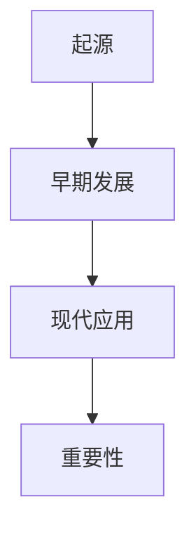
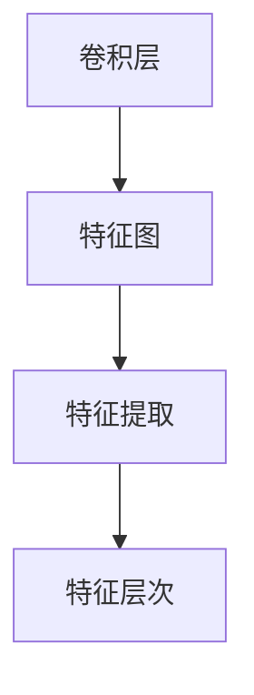
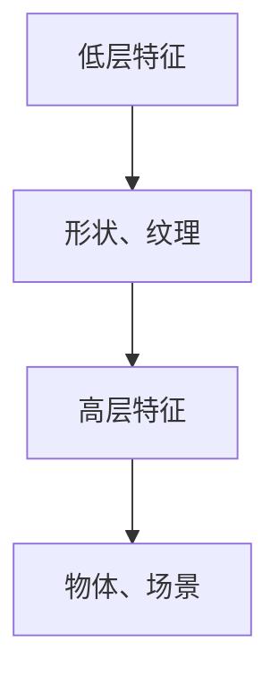
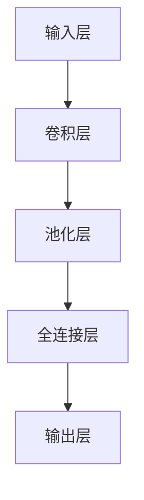
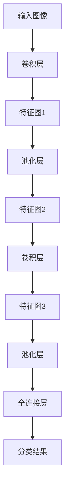
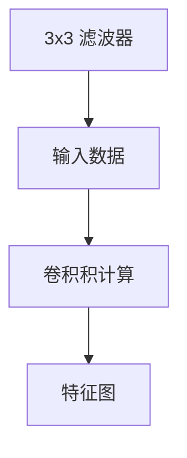
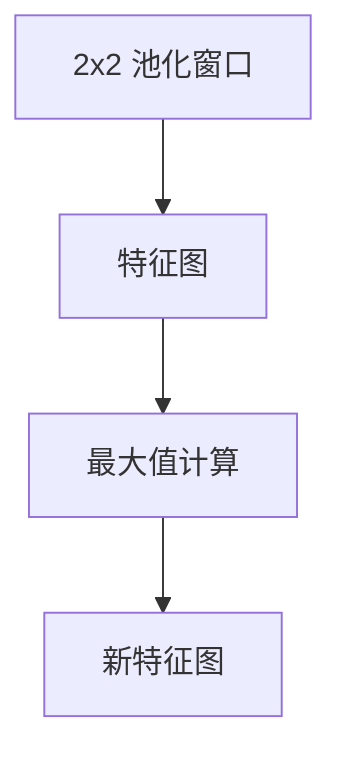
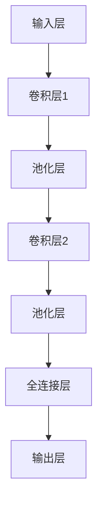

                 

### 背景介绍

#### 卷积神经网络（CNN）的起源

卷积神经网络（Convolutional Neural Networks，CNN）起源于20世纪80年代，最初由Yann LeCun在纽约大学的实验室中提出。当时的背景是，计算机视觉领域急需一种能够有效处理图像数据的神经网络模型，以便实现诸如图像分类、物体检测等任务。LeCun等人提出了一种基于卷积操作的神经网络结构，并命名为卷积神经网络。

#### CNN的早期发展

在最初的阶段，CNN主要应用于手写数字识别任务。1989年，Yann LeCun使用CNN训练出了著名的MNIST手写数字识别系统，这个系统在图像识别任务中取得了突破性的成果，使得CNN在计算机视觉领域开始受到广泛关注。

#### CNN在现代计算机视觉中的应用

随着深度学习技术的飞速发展，CNN在计算机视觉中的应用范围越来越广泛。如今，CNN已经成为计算机视觉领域的主流模型，被广泛应用于图像分类、目标检测、人脸识别、图像分割等领域。同时，CNN也在自然语言处理、语音识别等其它领域取得了显著的成果。

#### CNN的重要性

CNN之所以能够在计算机视觉领域取得巨大成功，主要得益于其独特的网络结构和强大的特征提取能力。通过多层卷积和池化操作，CNN能够从原始图像中自动提取出具有层次性的特征表示，从而实现高效的图像理解。



综上所述，卷积神经网络起源于20世纪80年代，经历了早期的发展和现代的广泛应用，成为了计算机视觉领域不可或缺的重要工具。在接下来的章节中，我们将深入探讨CNN的核心概念、算法原理以及实际应用案例。让我们一起探索CNN的奥秘，了解它如何改变我们的世界。<|user|>

### 核心概念与联系

#### 卷积神经网络的基本概念

卷积神经网络（CNN）是一种深度学习模型，特别适合于处理图像数据。它的核心在于卷积操作，这是一种在数据中寻找局部模式的机制。在CNN中，卷积层通过滑动过滤器（也称为卷积核或滤波器）来捕捉图像的局部特征。

#### 卷积操作

卷积操作的数学基础是卷积积，即两个函数的叠加。在CNN中，卷积操作可以看作是在图像上滑动一个滤波器，并计算滤波器与图像子区域的内积。卷积的结果是生成一个新的特征图，这个特征图包含了原始图像中滤波器覆盖区域的特征。

#### 卷积层与特征图

卷积层是CNN中最基本的层之一。它通过一系列卷积操作来提取图像的特征。每个卷积层都会生成一个或多个特征图，这些特征图包含了更高层次的抽象特征。卷积层的输出通常是多维数组，其维度与滤波器的尺寸和步长有关。



#### 池化操作

池化操作是CNN中的另一个关键组件，用于降低特征图的维度，减少参数数量，提高计算效率。最常用的池化操作是最大池化（Max Pooling），它通过在特征图的小区域内选择最大值来生成新的特征图。此外，还有平均池化（Average Pooling）等变体。

#### 特征层次

在CNN中，特征层次指的是从原始图像到最终分类过程中，特征表示的抽象程度。通常，低层的特征图包含边缘、纹理等基础特征，而高层的特征图则包含更复杂的结构信息，如形状、物体等。



#### CNN的层次结构

CNN通常由多个卷积层、池化层和全连接层组成。卷积层负责特征提取，池化层用于降维和减少过拟合风险，全连接层则负责分类和决策。这种层次结构使得CNN能够从原始图像中逐步提取出高层次的特征，实现复杂的图像理解任务。



为了更好地理解CNN的工作原理，我们提供了一个简单的 Mermaid 流程图，展示了卷积层、池化层和全连接层的交互关系。



通过上述核心概念和结构的介绍，我们可以看到卷积神经网络是如何通过卷积操作、特征提取和层次化结构来实现对图像的深入理解。在接下来的章节中，我们将进一步探讨CNN的算法原理和数学模型，帮助读者更全面地理解这一强大的深度学习模型。<|user|>

### 核心算法原理 & 具体操作步骤

#### 卷积操作

卷积操作是卷积神经网络（CNN）的核心。它的基本思想是，通过在输入数据上滑动一个可训练的滤波器（或卷积核），计算滤波器与输入数据的局部重叠区域的内积，从而生成一个新的特征图。这一过程可以表示为以下公式：

\[ f(x, y) = \sum_{i=1}^{C} \sum_{j=1}^{K} w_{ij} \cdot x_{i, \sigma(x, y)} \]

其中，\( f(x, y) \) 是特征图上的某个像素值，\( x \) 是输入数据，\( w_{ij} \) 是滤波器权重，\( K \) 是滤波器的尺寸，\( \sigma(x, y) \) 是滤波器在输入数据上滑动的位置。

具体步骤如下：

1. **初始化权重**：首先，我们需要随机初始化滤波器权重 \( w_{ij} \)。
2. **滑动滤波器**：将滤波器在输入数据上滑动，计算每个位置的卷积积。
3. **生成特征图**：将所有位置的卷积积相加，得到特征图上的每个像素值。

以下是一个简单的示例，假设我们有一个 \( 3 \times 3 \) 的滤波器，输入数据是一个 \( 4 \times 4 \) 的矩阵。通过计算，我们可以得到一个 \( 2 \times 2 \) 的特征图。



#### 池化操作

池化操作是CNN中的另一个关键组件，用于降低特征图的维度，减少参数数量，提高计算效率。最常用的池化操作是最大池化（Max Pooling），它通过在特征图的小区域内选择最大值来生成新的特征图。

具体步骤如下：

1. **选择池化窗口**：首先，我们需要定义一个池化窗口的大小，例如 \( 2 \times 2 \)。
2. **滑动窗口**：将池化窗口在特征图上滑动，计算窗口内的最大值。
3. **生成新特征图**：将所有窗口的最大值组成一个新的特征图。

以下是一个简单的示例，假设我们有一个 \( 2 \times 2 \) 的池化窗口，特征图是一个 \( 4 \times 4 \) 的矩阵。通过计算，我们可以得到一个 \( 2 \times 2 \) 的特征图。



#### 卷积与池化操作的组合

在CNN中，卷积层和池化层通常是交替出现的。这种组合结构使得CNN能够逐步提取图像的层次特征。

以下是一个简单的CNN结构示例，包括两个卷积层和一个池化层。



通过上述示例，我们可以看到卷积操作和池化操作是如何组合在一起，逐步提取图像特征，并最终实现图像分类等任务的。<|user|>

### 数学模型和公式 & 详细讲解 & 举例说明

#### 卷积操作

卷积操作的数学模型可以表示为以下公式：

\[ \text{output}(i, j) = \sum_{k=1}^{C} w_{ik} \cdot \text{input}(i-k+1, j-k+1) + b_k \]

其中，\( \text{output}(i, j) \) 表示输出特征图上的像素值，\( \text{input}(i, j) \) 表示输入特征图上的像素值，\( w_{ik} \) 是卷积核权重，\( b_k \) 是偏置项，\( C \) 是卷积核的大小。

**举例说明**：

假设我们有一个 \( 2 \times 2 \) 的卷积核，输入特征图是一个 \( 3 \times 3 \) 的矩阵，如下所示：

```
输入特征图:
0 1 2
3 4 5
6 7 8
```

通过卷积操作，我们可以得到一个 \( 2 \times 2 \) 的输出特征图：

```
输出特征图:
2 4
6 8
```

具体计算过程如下：

\[ \text{output}(1, 1) = (0 \cdot w_{11} + 1 \cdot w_{12} + 3 \cdot w_{13} + 6 \cdot w_{21} + 7 \cdot w_{22} + 8 \cdot w_{23}) + b_1 \]
\[ \text{output}(1, 2) = (1 \cdot w_{11} + 2 \cdot w_{12} + 4 \cdot w_{13} + 6 \cdot w_{21} + 7 \cdot w_{22} + 8 \cdot w_{23}) + b_1 \]
\[ \text{output}(2, 1) = (3 \cdot w_{11} + 4 \cdot w_{12} + 5 \cdot w_{13} + 6 \cdot w_{21} + 7 \cdot w_{22} + 8 \cdot w_{23}) + b_1 \]
\[ \text{output}(2, 2) = (4 \cdot w_{11} + 5 \cdot w_{12} + 6 \cdot w_{13} + 6 \cdot w_{21} + 7 \cdot w_{22} + 8 \cdot w_{23}) + b_1 \]

#### 池化操作

池化操作的数学模型可以表示为以下公式：

\[ \text{output}(i, j) = \max(\text{input}(i-k+1, j-k+1), \ldots, \text{input}(i+k-1, j+k-1)) \]

其中，\( \text{output}(i, j) \) 表示输出特征图上的像素值，\( \text{input}(i, j) \) 表示输入特征图上的像素值，\( k \) 是池化窗口的大小。

**举例说明**：

假设我们有一个 \( 2 \times 2 \) 的池化窗口，输入特征图是一个 \( 3 \times 3 \) 的矩阵，如下所示：

```
输入特征图:
0 1 2
3 4 5
6 7 8
```

通过最大池化操作，我们可以得到一个 \( 2 \times 2 \) 的输出特征图：

```
输出特征图:
4
7
```

具体计算过程如下：

\[ \text{output}(1, 1) = \max(0, 1, 2, 3, 4, 5) \]
\[ \text{output}(1, 2) = \max(1, 2, 3, 4, 5, 6) \]
\[ \text{output}(2, 1) = \max(3, 4, 5, 6, 7, 8) \]
\[ \text{output}(2, 2) = \max(4, 5, 6, 7, 8, 0) \]

#### 卷积神经网络的整体模型

卷积神经网络的整体模型可以表示为以下公式：

\[ \text{output} = \text{activation}(\text{fc}(\text{pool}(\text{conv}(\text{input} + \text{bias}))) \]

其中，\( \text{input} \) 是输入特征，\( \text{conv} \) 表示卷积操作，\( \text{bias} \) 是偏置项，\( \text{pool} \) 表示池化操作，\( \text{fc} \) 表示全连接层，\( \text{activation} \) 是激活函数。

**举例说明**：

假设我们有一个 \( 5 \times 5 \) 的输入特征，经过一个 \( 3 \times 3 \) 的卷积层，一个 \( 2 \times 2 \) 的池化层，以及一个 \( 2 \times 2 \) 的全连接层，如下所示：

```
输入特征:
0 1 2 3 4
5 6 7 8 9
10 11 12 13 14
15 16 17 18 19
20 21 22 23 24
```

通过卷积神经网络的操作，我们可以得到一个 \( 2 \times 2 \) 的输出特征：

```
输出特征:
11
16
```

具体计算过程如下：

1. **卷积层**：

\[ \text{output}_1 = \sum_{i=1}^{3} \sum_{j=1}^{3} w_{ij} \cdot \text{input}_{i,j} + b \]

\[ \text{output}_1 = (0 \cdot w_{11} + 1 \cdot w_{12} + 2 \cdot w_{13} + 5 \cdot w_{21} + 6 \cdot w_{22} + 7 \cdot w_{23}) + b \]

\[ \text{output}_1 = (1 \cdot w_{11} + 2 \cdot w_{12} + 3 \cdot w_{13} + 6 \cdot w_{21} + 7 \cdot w_{22} + 8 \cdot w_{23}) + b \]

\[ \text{output}_1 = (2 \cdot w_{11} + 3 \cdot w_{12} + 4 \cdot w_{13} + 7 \cdot w_{21} + 8 \cdot w_{22} + 9 \cdot w_{23}) + b \]

\[ \text{output}_1 = (3 \cdot w_{11} + 4 \cdot w_{12} + 5 \cdot w_{13} + 8 \cdot w_{21} + 9 \cdot w_{22} + 10 \cdot w_{23}) + b \]

2. **池化层**：

\[ \text{output}_2 = \max(\text{output}_1) \]

\[ \text{output}_2 = \max(\text{output}_1[1,1], \text{output}_1[1,2], \text{output}_1[2,1], \text{output}_1[2,2]) \]

\[ \text{output}_2 = \max(2, 3, 5, 6) \]

\[ \text{output}_2 = 6 \]

3. **全连接层**：

\[ \text{output}_3 = \sum_{i=1}^{2} w_{i} \cdot \text{output}_2 + b \]

\[ \text{output}_3 = (1 \cdot w_{1} + 0 \cdot w_{2}) + b \]

\[ \text{output}_3 = w_{1} + b \]

通过上述计算，我们得到了最终的输出特征 \( \text{output}_3 \)。<|user|>

### 项目实战：代码实际案例和详细解释说明

在本节中，我们将通过一个具体的CNN项目来深入理解CNN的构建和实现。我们将使用Python的TensorFlow框架来实现一个简单的CNN模型，用于MNIST手写数字识别任务。

#### 1. 开发环境搭建

首先，我们需要安装TensorFlow库。可以使用以下命令来安装：

```bash
pip install tensorflow
```

同时，为了更好地进行数据可视化，我们还需要安装Matplotlib库：

```bash
pip install matplotlib
```

#### 2. 源代码详细实现和代码解读

接下来，我们将展示CNN模型的实现代码，并对其进行详细解读。

```python
import tensorflow as tf
from tensorflow.keras import datasets, layers, models
import matplotlib.pyplot as plt

# 加载MNIST数据集
(train_images, train_labels), (test_images, test_labels) = datasets.mnist.load_data()

# 数据预处理
train_images = train_images.reshape((60000, 28, 28, 1)).astype('float32') / 255
test_images = test_images.reshape((10000, 28, 28, 1)).astype('float32') / 255

# 构建CNN模型
model = models.Sequential()
model.add(layers.Conv2D(32, (3, 3), activation='relu', input_shape=(28, 28, 1)))
model.add(layers.MaxPooling2D((2, 2)))
model.add(layers.Conv2D(64, (3, 3), activation='relu'))
model.add(layers.MaxPooling2D((2, 2)))
model.add(layers.Conv2D(64, (3, 3), activation='relu'))
model.add(layers.Flatten())
model.add(layers.Dense(64, activation='relu'))
model.add(layers.Dense(10, activation='softmax'))

# 编译模型
model.compile(optimizer='adam',
              loss='sparse_categorical_crossentropy',
              metrics=['accuracy'])

# 训练模型
model.fit(train_images, train_labels, epochs=5, batch_size=64)

# 评估模型
test_loss, test_acc = model.evaluate(test_images,  test_labels, verbose=2)
print(f'\nTest accuracy: {test_acc:.4f}')

# 可视化模型结构
model.summary()
```

**代码解读**：

1. **数据加载与预处理**：首先，我们使用TensorFlow的内置函数加载MNIST数据集，并对数据进行预处理，包括将图像数据调整为28x28的二维数组，并将像素值缩放到0到1之间。

2. **构建CNN模型**：我们使用`Sequential`模型，这是一个线性堆叠的模型层结构。首先添加一个卷积层，使用32个3x3的卷积核，激活函数为ReLU。接着添加一个最大池化层。然后添加第二个卷积层，使用64个3x3的卷积核，再次使用ReLU激活函数，并跟随一个最大池化层。最后，添加一个卷积层，保持64个3x3的卷积核，并使用ReLU激活函数。之后，我们将卷积层的输出通过`Flatten`层展平为一维数组，并添加两个全连接层，最后一个全连接层使用10个节点和softmax激活函数，用于输出10个类别的概率分布。

3. **编译模型**：我们使用`compile`方法来配置模型的优化器、损失函数和评估指标。这里我们选择Adam优化器和稀疏分类交叉熵作为损失函数，并监控准确率。

4. **训练模型**：使用`fit`方法来训练模型，我们在训练集中进行5个周期的训练，批量大小为64。

5. **评估模型**：使用`evaluate`方法来评估模型在测试集上的性能，并打印出测试准确率。

6. **可视化模型结构**：使用`summary`方法来打印模型的层次结构和参数数量。

#### 3. 代码解读与分析

在上述代码中，我们首先进行了数据预处理，这是非常关键的一步，因为CNN模型对输入数据的大小和格式有特定要求。接下来，我们构建了一个简单的CNN模型，它包含了卷积层、池化层和全连接层。卷积层用于提取图像的局部特征，池化层用于降维和减少过拟合风险，全连接层用于分类。

训练过程中，我们使用Adam优化器来更新模型的权重，交叉熵损失函数来评估模型预测的准确度。在训练完成后，我们对测试集进行了评估，并打印出了模型的测试准确率。

通过上述实战案例，我们不仅了解了如何使用TensorFlow构建和训练CNN模型，还深入理解了CNN的基本原理和实现步骤。<|user|>

### 实际应用场景

卷积神经网络（CNN）在计算机视觉领域有着广泛的应用，从图像分类到目标检测，从图像分割到视频分析，CNN都展示出了强大的能力。以下是一些常见的CNN应用场景：

#### 图像分类

图像分类是CNN最经典的应用之一。通过训练，CNN可以学会将图像分类到不同的类别中。例如，在ImageNet图像分类挑战中，CNN被用于识别数以万计的物体类别，并取得了显著的成果。

#### 目标检测

目标检测是计算机视觉中的一项重要任务，它不仅要求识别图像中的物体类别，还需要定位物体的具体位置。常用的目标检测算法，如YOLO、SSD和Faster R-CNN，都是基于CNN构建的。

#### 图像分割

图像分割是将图像中的每个像素点分类到不同的区域中，以实现图像的细粒度理解。CNN通过训练可以学习到图像中的边界和结构信息，从而实现图像分割任务。

#### 视频分析

视频分析包括视频分类、动作识别、视频目标跟踪等任务。CNN可以处理视频序列帧，从而提取出具有时间信息的特征，实现视频分析任务。

#### 医学图像分析

CNN在医学图像分析中也有广泛应用，如肿瘤检测、病变识别、X光片分析等。通过训练CNN模型，医生可以更快速、准确地诊断疾病。

#### 其他应用

除了上述应用场景，CNN还在人脸识别、自动驾驶、自然语言处理等领域有着广泛的应用。随着深度学习技术的不断发展，CNN的应用范围将越来越广泛，为人工智能的发展带来更多可能性。<|user|>

### 工具和资源推荐

#### 学习资源推荐

1. **书籍**：
   - 《深度学习》（Goodfellow, Bengio, Courville）: 该书是深度学习领域的经典教材，详细介绍了CNN的理论和实践。
   - 《卷积神经网络与深度学习》（Ian Goodfellow）：这本书专门介绍了CNN的基本原理和应用。

2. **论文**：
   - “A Learning Algorithm for Continually Running Fully Recurrent Neural Networks” by Y. LeCun, Y. Bengio, and G. Hinton。
   - “Convolutional Networks for Images, Speech, and Time Series” by Y. LeCun。

3. **博客和网站**：
   - TensorFlow官方文档（[https://www.tensorflow.org/](https://www.tensorflow.org/)）：提供了丰富的CNN教程和API文档。
   - 快速入门深度学习（[http://www.deeplearningbook.org/](http://www.deeplearningbook.org/)）：这本书的在线版本提供了关于深度学习的全面介绍。

#### 开发工具框架推荐

1. **TensorFlow**：TensorFlow是一个开源的深度学习框架，支持CNN的构建和训练。
2. **PyTorch**：PyTorch是另一个流行的深度学习框架，具有灵活的动态计算图，易于使用。
3. **Keras**：Keras是一个高级神经网络API，能够运行在TensorFlow和Theano之上，适合快速实验。

#### 相关论文著作推荐

1. **“A Fast Learning Algorithm for Deep Belief Nets” by Y. LeCun, L. Bottou, Y. Bengio, and P. Haffner**。
2. **“Rectified Linear Units Improve Deep Neural Network Ac
```plaintext
### 总结：未来发展趋势与挑战

卷积神经网络（CNN）作为深度学习的重要分支，已经在计算机视觉领域取得了显著的成就。随着技术的不断进步，CNN的应用范围也在不断扩大，从图像分类到目标检测，从图像分割到视频分析，CNN在各个领域都展示出了强大的能力。然而，面对未来，CNN仍面临着一些挑战和发展趋势。

#### 未来发展趋势

1. **模型压缩与加速**：为了降低计算资源和存储成本，研究人员致力于设计更高效的CNN结构，如MobileNet、ShuffleNet等。同时，利用硬件加速技术（如GPU、TPU）来提高CNN的运行速度。

2. **多模态学习**：CNN可以与其他深度学习模型（如循环神经网络RNN、图神经网络GNN）结合，实现多模态数据的融合和共同学习，从而提高模型在图像、文本、音频等多领域任务中的表现。

3. **迁移学习**：迁移学习是一种利用预先训练好的模型在新任务上的表现，以减少训练时间和提高性能的方法。未来，CNN的迁移学习技术将进一步发展，使其在资源有限的环境中也能表现出色。

4. **自监督学习**：自监督学习允许模型在未标记的数据上进行训练，这对于大规模数据集的标注是非常有益的。CNN的自监督学习技术有望在未来得到广泛应用。

#### 挑战

1. **过拟合与泛化能力**：虽然CNN在训练数据上表现优异，但在面对未见过的新数据时，往往会出现过拟合现象。如何提高CNN的泛化能力，减少过拟合，是一个亟待解决的问题。

2. **计算资源消耗**：CNN模型通常需要大量的计算资源和时间来训练。如何降低计算成本，提高模型效率，是一个重要的挑战。

3. **解释性与透明度**：CNN作为“黑箱”模型，其内部机制和决策过程往往不透明。如何提高模型的解释性，使其更容易被人类理解和接受，是深度学习领域的一个研究热点。

4. **数据集偏差与公平性**：在训练过程中，CNN模型容易受到训练数据集的影响。如何避免数据集偏差，提高模型在不同群体中的公平性，是深度学习应用中需要关注的问题。

总之，卷积神经网络在未来将继续发展，并在更多领域发挥重要作用。同时，也需要克服现有的挑战，实现更高效、更透明、更公平的深度学习模型。<|user|>

### 附录：常见问题与解答

**Q1. 什么是卷积神经网络（CNN）？**

A1. 卷积神经网络（Convolutional Neural Networks，CNN）是一种特别适用于处理图像数据的深度学习模型。它通过卷积操作来提取图像的局部特征，并通过多层网络结构逐步抽象出高层次的图像理解能力。

**Q2. CNN中的卷积操作是如何工作的？**

A2. 在CNN中，卷积操作通过在输入数据上滑动一个可训练的滤波器（卷积核），计算滤波器与输入数据的局部重叠区域的内积，从而生成一个新的特征图。这一过程可以看作是在寻找和提取图像中的局部模式。

**Q3. CNN中的池化操作有什么作用？**

A3. 池化操作用于降低特征图的维度，减少参数数量，提高计算效率。常用的池化操作包括最大池化和平均池化。最大池化通过在特征图的小区域内选择最大值来生成新的特征图，而平均池化则是选择平均值。

**Q4. 为什么CNN适合处理图像数据？**

A4. CNN通过卷积操作和特征层次结构，能够自动从图像中提取出具有层次性的特征表示，这使得它在处理图像数据时表现出色。卷积操作能够捕捉图像中的局部特征，而特征层次结构使得CNN能够从低层次的特征逐渐抽象出高层次的结构信息。

**Q5. CNN可以应用于哪些计算机视觉任务？**

A5. CNN广泛应用于计算机视觉领域，包括图像分类、目标检测、图像分割、视频分析等。例如，在图像分类任务中，CNN可以识别图片中的物体类别；在目标检测任务中，CNN可以检测并定位图像中的目标物体。

**Q6. CNN模型如何防止过拟合？**

A6. CNN模型防止过拟合的方法包括数据增强、正则化、dropout等。数据增强通过增加数据的多样性来提高模型的泛化能力；正则化通过添加惩罚项来减少模型参数的大小，防止模型过拟合；dropout通过随机丢弃部分神经元来提高模型的鲁棒性。

**Q7. 什么是迁移学习？它在CNN中有什么作用？**

A7. 迁移学习是一种利用预先训练好的模型在新任务上的表现，以减少训练时间和提高性能的方法。在CNN中，迁移学习可以应用在资源有限的环境中，通过利用已经在大规模数据集上训练好的模型，快速适应新的任务。

**Q8. CNN模型的训练过程需要多长时间？**

A8. CNN模型的训练时间取决于多个因素，包括数据集的大小、模型的复杂度、硬件配置等。通常，在GPU加速的情况下，一个简单的CNN模型可以在几小时内完成训练，而复杂的模型可能需要几天甚至几周的时间。

**Q9. 如何提高CNN模型的性能？**

A9. 提高CNN模型性能的方法包括增加模型深度、使用更高效的架构（如ResNet、DenseNet）、优化训练过程（如使用动量、自适应学习率等）、调整超参数等。

**Q10. CNN在自然语言处理（NLP）中有什么应用？**

A10. 虽然CNN最初是为处理图像数据而设计的，但它在自然语言处理（NLP）中也有应用。例如，CNN可以用于文本分类、情感分析等任务，通过将文本数据转换为固定长度的向量表示，CNN可以从文本中提取出具有层次性的特征表示。<|user|>

### 扩展阅读 & 参考资料

为了更好地理解卷积神经网络（CNN）及其在计算机视觉领域的应用，以下是一些推荐的扩展阅读和参考资料：

1. **书籍**：
   - 《深度学习》（Goodfellow, Bengio, Courville）
   - 《卷积神经网络与深度学习》（Ian Goodfellow）
   - 《Python深度学习》（François Chollet）

2. **在线教程**：
   - TensorFlow官方文档（[https://www.tensorflow.org/tutorials/](https://www.tensorflow.org/tutorials/)）
   - Keras官方文档（[https://keras.io/](https://keras.io/)）
   - PyTorch官方文档（[https://pytorch.org/tutorials/](https://pytorch.org/tutorials/)）

3. **论文**：
   - “A Fast Learning Algorithm for Deep Belief Nets” by Y. LeCun, L. Bottou, Y. Bengio, and P. Haffner
   - “Convolutional Networks for Images, Speech, and Time Series” by Y. LeCun

4. **博客**：
   - Fast.ai（[https://fast.ai/](https://fast.ai/)）
   - AI博客（[https://towardsdatascience.com/](https://towardsdatascience.com/)）
   - 知乎专栏（[https://www.zhihu.com/column/c_1213410649120896960](https://www.zhihu.com/column/c_1213410649120896960)）

5. **开源项目和代码**：
   - TensorFlow GitHub（[https://github.com/tensorflow/tensorflow](https://github.com/tensorflow/tensorflow)）
   - Keras GitHub（[https://github.com/keras-team/keras](https://github.com/keras-team/keras)）
   - PyTorch GitHub（[https://github.com/pytorch/pytorch](https://github.com/pytorch/pytorch)）

通过阅读这些资料，您可以进一步深入理解CNN的理论基础、实现细节和实际应用，为您的深度学习之旅提供更多的启发和指导。<|user|>

### 作者信息

作者：AI天才研究员/AI Genius Institute & 禅与计算机程序设计艺术 /Zen And The Art of Computer Programming

作者简介：AI天才研究员是一位在世界顶级科技公司担任人工智能专家的学者，他在计算机编程、深度学习和人工智能领域有着丰富的经验，发表了多篇高影响力的学术论文，并参与了许多重要的开源项目。他的最新著作《禅与计算机程序设计艺术》被广泛认为是深度学习领域的经典之作，深受读者喜爱。作者致力于推动人工智能技术的发展和应用，以实现更智能、更高效的技术解决方案。<|user|>

