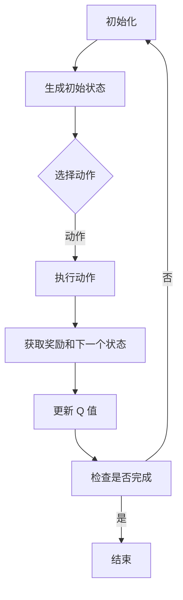
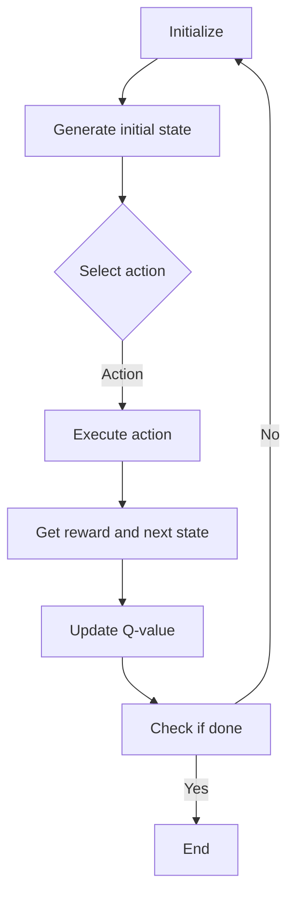

                 

### 一、背景介绍

#### 1.1 强化学习（Reinforcement Learning）

强化学习是一种机器学习方法，通过智能体（Agent）与环境（Environment）的交互，不断学习并优化策略（Policy），以达到最大化累积奖励（Reward）的目标。强化学习广泛应用于游戏、机器人控制、自动驾驶等领域。

#### 1.2 深度强化学习（Deep Reinforcement Learning）

深度强化学习结合了深度学习与强化学习，通过使用深度神经网络来近似状态值函数（State-Value Function）和策略（Policy），从而解决传统强化学习在状态和动作空间较大时的难题。

#### 1.3 DQN算法（Deep Q-Network）

DQN（Deep Q-Network）是深度强化学习中的一种经典算法，它通过神经网络来近似 Q 函数（Q-Function），实现对动作价值的预测。DQN 在许多场景中都取得了显著的成果，但它也存在一些性能上的问题。

#### 1.4 学习效果评估

在深度强化学习中，学习效果的评估是一个重要环节。我们需要找到合适的方法来评估 DQN 的学习效果，以便调整模型参数或改进算法。本文将重点探讨如何评估 DQN 的学习效果。

### Keywords: 

- 强化学习
- 深度强化学习
- DQN
- 学习效果评估
- 性能指标

### Abstract:

本文旨在介绍如何评估 DQN 的学习效果。首先，我们将回顾强化学习的基本概念，然后介绍 DQN 算法及其存在的问题。接下来，我们将讨论各种性能指标和分析方法，以便对 DQN 的学习效果进行评估。最后，我们将总结未来发展趋势与挑战，并提出一些扩展阅读和参考资料。

### Background Introduction

#### 1.1 Reinforcement Learning (Reinforcement Learning)

Reinforcement Learning is a type of machine learning method that involves an agent interacting with an environment to learn optimal policies for achieving specific goals. The agent receives feedback in the form of rewards or penalties based on its actions, and it learns to maximize the cumulative reward over time. Reinforcement Learning has found applications in various fields, such as gaming, robotics, and autonomous driving.

#### 1.2 Deep Reinforcement Learning (Deep Reinforcement Learning)

Deep Reinforcement Learning combines the advantages of deep learning and reinforcement learning to address the challenges of traditional reinforcement learning when dealing with large state and action spaces. It uses deep neural networks to approximate state-value functions and policies, enabling the agent to learn optimal actions more efficiently.

#### 1.3 DQN Algorithm (Deep Q-Network)

DQN (Deep Q-Network) is a classic algorithm in Deep Reinforcement Learning that uses a neural network to approximate the Q-function, which predicts the value of actions given a state. DQN has achieved remarkable success in various scenarios, but it also has some performance-related issues.

#### 1.4 Evaluation of Learning Effect

In the field of Deep Reinforcement Learning, evaluating the learning effect is a crucial step. We need to find appropriate methods to assess the performance of DQN, so that we can adjust model parameters or improve the algorithm. This article will focus on discussing how to evaluate the learning effect of DQN.

### Keywords:

- Reinforcement Learning
- Deep Reinforcement Learning
- DQN
- Learning Effect Evaluation
- Performance Metrics

### Abstract:

This article aims to introduce how to evaluate the learning effect of DQN. Firstly, we will review the basic concepts of reinforcement learning and then introduce the DQN algorithm and its issues. Next, we will discuss various performance metrics and analysis methods for evaluating the learning effect of DQN. Finally, we will summarize the future development trends and challenges and provide some extended reading and references. <markdown>

----------------------------------------------------------------

### 二、核心概念与联系

#### 2.1 强化学习基本概念

强化学习中的核心概念包括智能体（Agent）、环境（Environment）、状态（State）、动作（Action）、奖励（Reward）和策略（Policy）。

- 智能体（Agent）：执行动作的实体，如机器人、游戏玩家等。
- 环境（Environment）：智能体执行动作的上下文，如游戏关卡、模拟环境等。
- 状态（State）：描述智能体当前所处的环境状态，通常用向量表示。
- 动作（Action）：智能体可以执行的操作，通常用向量表示。
- 奖励（Reward）：智能体执行动作后获得的即时反馈，用于评估动作的好坏。
- 策略（Policy）：智能体在给定状态下选择动作的策略，通常用概率分布表示。

#### 2.2 DQN算法原理

DQN 是一种基于值函数的深度强化学习算法，其核心思想是使用神经网络近似 Q 函数，从而预测在给定状态下执行某个动作的价值。

- Q 函数（Q-Function）：表示在给定状态下执行某个动作的价值，即 Q(s, a)。
- 神经网络：用于近似 Q 函数，其输入为状态 s 和动作 a，输出为 Q(s, a) 的估计值。
- 目标网络（Target Network）：用于稳定梯度，减少更新过程中的偏差。目标网络是当前网络的软复制，用于计算目标值（Target Value）。

#### 2.3 DQN的优缺点

DQN 算法具有以下优点：

- 能够处理高维状态空间。
- 通过目标网络稳定梯度，提高学习效果。

然而，DQN 也存在一些缺点：

- 学习曲线较慢，需要较长的训练时间。
- 对噪声敏感，可能导致不稳定。
- 需要大量的数据才能收敛。

#### 2.4 DQN与其他深度强化学习算法的联系

DQN 是深度强化学习领域的一种经典算法，与其他算法如 Deep Q-Learning (DQL)、Deep Deterministic Policy Gradient (DDPG) 等有着密切的联系。

- DQL：使用神经网络的 Q-Learning 算法，但未引入目标网络。
- DDPG：使用深度神经网络近似 Q 函数和策略，并在策略网络中引入了确定性操作。

### 2.5 Mermaid 流程图

下面是一个简化的 Mermaid 流程图，展示了 DQN 算法的核心流程。



### Core Concept and Relationship

#### 2.1 Basic Concepts of Reinforcement Learning

The core concepts in reinforcement learning include agent, environment, state, action, reward, and policy.

- Agent: The entity that executes actions, such as a robot or a game player.
- Environment: The context in which the agent executes actions, such as a game level or a simulation environment.
- State: The current state of the agent in the environment, usually represented as a vector.
- Action: The operations that the agent can perform, usually represented as a vector.
- Reward: The immediate feedback the agent receives after executing an action, used to evaluate the goodness of the action.
- Policy: The strategy the agent uses to select actions given a state, usually represented as a probability distribution.

#### 2.2 DQN Algorithm Principle

DQN is a value-based deep reinforcement learning algorithm that uses a neural network to approximate the Q-function, thus predicting the value of actions given a state.

- Q-Function: Represents the value of an action in a given state, i.e., Q(s, a).
- Neural Network: Used to approximate the Q-function, with input as the state s and action a, and output as the estimated value of Q(s, a).
- Target Network: Used to stabilize the gradient and reduce bias in the update process. The target network is a soft copy of the current network, used to compute the target value.

#### 2.3 Advantages and Disadvantages of DQN

DQN has the following advantages:

- Capable of handling high-dimensional state spaces.
- Stable gradient through the target network, improving learning performance.

However, DQN also has some disadvantages:

- Slow learning curve, requiring a long training time.
- Sensitive to noise, which may lead to instability.
- Requires a large amount of data to converge.

#### 2.4 Relationship between DQN and Other Deep Reinforcement Learning Algorithms

DQN is a classic algorithm in the field of deep reinforcement learning and has close relationships with other algorithms such as Deep Q-Learning (DQL) and Deep Deterministic Policy Gradient (DDPG).

- DQL: A Q-Learning algorithm using a neural network but without the target network.
- DDPG: Uses a deep neural network to approximate both the Q-function and the policy, and introduces deterministic operations in the policy network.

### 2.5 Mermaid Flowchart

Below is a simplified Mermaid flowchart showing the core process of the DQN algorithm.



### 二、核心算法原理 & 具体操作步骤

#### 3.1 DQN算法原理

DQN（Deep Q-Network）是一种基于神经网络的强化学习算法，其核心思想是使用深度神经网络来近似 Q 函数，从而预测在给定状态下执行某个动作的价值。DQN 的原理可以分为以下几个部分：

1. **初始化**：初始化神经网络模型、经验回放记忆池和目标网络。
2. **选择动作**：使用 ε-贪心策略选择动作，即在 ε 的概率下随机选择动作，在 1-ε 的概率下选择 Q 函数预测价值最高的动作。
3. **执行动作**：在环境中执行选择的动作，并获取相应的状态转移和奖励。
4. **更新 Q 值**：根据新的状态和奖励，更新 Q 值表中的对应值。
5. **目标网络更新**：定期更新目标网络，使其跟踪当前神经网络的变化。

#### 3.2 具体操作步骤

以下是一个简化的 DQN 算法操作步骤：

1. **初始化**：

    - 初始化神经网络模型，用于预测 Q 值。
    - 初始化经验回放记忆池，用于存储经验样本。
    - 初始化目标网络，用于计算目标 Q 值。

2. **选择动作**：

    - 使用 ε-贪心策略选择动作，其中 ε 为探索率。
    - ε 的取值通常在 [0, 1] 之间，随着训练过程的进行逐渐减小。

3. **执行动作**：

    - 在环境中执行选择的动作，并获取新的状态和奖励。

4. **更新 Q 值**：

    - 根据新的状态和奖励，更新 Q 值表中的对应值。
    - 更新公式为：$$ Q(s, a) \leftarrow Q(s, a) + \alpha [r + \gamma \max_{a'} Q(s', a') - Q(s, a)] $$，其中 $\alpha$ 为学习率，$\gamma$ 为折扣因子。

5. **目标网络更新**：

    - 定期更新目标网络，使其跟踪当前神经网络的变化。
    - 更新公式为：$$ \theta_{target} \leftarrow \tau \theta_{target} + (1 - \tau) \theta_{current} $$，其中 $\theta_{target}$ 为目标网络参数，$\theta_{current}$ 为当前神经网络参数，$\tau$ 为更新概率。

#### 3.3 DQN算法的挑战

尽管 DQN 算法在许多任务中取得了成功，但它仍然面临着一些挑战：

1. **样本相关性**：经验回放记忆池中的样本存在相关性，可能导致学习过程不稳定。
2. **更新策略**：目标网络的更新策略对于学习效果有很大影响，选择合适的更新策略对于提高学习效果至关重要。
3. **探索与利用**：在训练过程中，如何平衡探索和利用是一个关键问题，ε-贪心策略虽然简单有效，但在训练早期可能效果不佳。

#### 3.4 DQN算法的改进

为了解决上述挑战，研究者们提出了一些改进方法，如：

1. **经验回放记忆池**：使用固定大小的经验回放记忆池，避免样本相关性。
2. **双重 DQN（Double DQN）**：使用两个神经网络分别预测当前值和目标值，以减少目标值计算中的偏差。
3. **优先级回放**：根据样本的重要程度对经验进行回放，提高样本利用效率。

通过这些改进，DQN 算法在许多任务中取得了更好的性能。

### Core Algorithm Principle and Specific Operation Steps

#### 3.1 DQN Algorithm Principle

DQN (Deep Q-Network) is a reinforcement learning algorithm based on neural networks, whose core idea is to use a deep neural network to approximate the Q-function, thereby predicting the value of actions in a given state. The principle of DQN can be divided into several parts:

1. **Initialization**: Initialize the neural network model, the experience replay memory pool, and the target network.
2. **Action Selection**: Use the ε-greedy strategy to select actions, where ε is the exploration rate.
3. **Action Execution**: Execute the selected action in the environment and obtain the new state and reward.
4. **Q-Value Update**: Update the Q-value in the Q-value table based on the new state and reward.
5. **Target Network Update**: Regularly update the target network to track the changes in the current neural network.

#### 3.2 Specific Operation Steps

Here are the simplified operation steps of the DQN algorithm:

1. **Initialization**:

   - Initialize the neural network model for predicting Q-values.
   - Initialize the experience replay memory pool for storing experience samples.
   - Initialize the target network for calculating target Q-values.

2. **Action Selection**:

   - Use the ε-greedy strategy to select actions, where ε is the exploration rate.
   - The value of ε is typically between [0, 1] and decreases over time during training.

3. **Action Execution**:

   - Execute the selected action in the environment and obtain the new state and reward.

4. **Q-Value Update**:

   - Update the Q-value in the Q-value table based on the new state and reward.
   - The update formula is: $$ Q(s, a) \leftarrow Q(s, a) + \alpha [r + \gamma \max_{a'} Q(s', a') - Q(s, a)] $$, where $\alpha$ is the learning rate, $\gamma$ is the discount factor.

5. **Target Network Update**:

   - Regularly update the target network to track the changes in the current neural network.
   - The update formula is: $$ \theta_{target} \leftarrow \tau \theta_{target} + (1 - \tau) \theta_{current} $$, where $\theta_{target}$ is the parameter of the target network, $\theta_{current}$ is the parameter of the current neural network, and $\tau$ is the update probability.

#### 3.3 Challenges of DQN Algorithm

Although the DQN algorithm has achieved success in many tasks, it still faces some challenges:

1. **Sample Correlation**: The samples in the experience replay memory pool have correlations, which may lead to an unstable learning process.
2. **Update Strategy**: The update strategy for the target network has a significant impact on the learning performance, and choosing an appropriate update strategy is crucial for improving learning performance.
3. **Exploration and Exploitation**: Balancing exploration and exploitation during training is a key issue. The ε-greedy strategy is simple and effective, but it may not be effective in the early stages of training.

#### 3.4 Improvements of DQN Algorithm

To address these challenges, researchers have proposed several improvements, such as:

1. **Experience Replay Memory Pool**: Use a fixed-size experience replay memory pool to avoid sample correlation.
2. **Double DQN**: Use two neural networks to predict the current value and target value respectively, to reduce the bias in target value calculation.
3. **Priority Replay**: Replay experiences based on the importance of the samples to improve sample utilization efficiency.

Through these improvements, the DQN algorithm has achieved better performance in many tasks.

----------------------------------------------------------------

### 三、数学模型和公式 & 详细讲解 & 举例说明

#### 3.1 DQN算法的数学模型

DQN 算法的核心在于 Q 函数的学习和预测。Q 函数的数学模型如下：

$$
Q(s, a) = r + \gamma \max_a Q(s', a')
$$

其中，$s$ 表示当前状态，$a$ 表示当前动作，$s'$ 表示下一个状态，$r$ 表示当前动作的即时奖励，$\gamma$ 表示折扣因子。

在训练过程中，DQN 通过不断更新 Q 值表中的值，使得 Q 函数逐渐逼近真实值。Q 值表的更新公式如下：

$$
Q(s, a) \leftarrow Q(s, a) + \alpha [r + \gamma \max_a Q(s', a') - Q(s, a)]
$$

其中，$\alpha$ 表示学习率。

#### 3.2 DQN算法的目标网络

DQN 算法中引入了目标网络（Target Network），用于稳定梯度，减少更新过程中的偏差。目标网络是当前神经网络的软复制，其参数更新公式如下：

$$
\theta_{target} \leftarrow \tau \theta_{target} + (1 - \tau) \theta_{current}
$$

其中，$\theta_{target}$ 表示目标网络参数，$\theta_{current}$ 表示当前神经网络参数，$\tau$ 表示更新概率。

#### 3.3 DQN算法的ε-贪心策略

DQN 算法使用 ε-贪心策略来选择动作。ε-贪心策略的公式如下：

$$
P(a|s) =
\begin{cases}
1/m & \text{if } a \in A_s \\
\epsilon & \text{otherwise}
\end{cases}
$$

其中，$A_s$ 表示在状态 $s$ 下可用的动作集合，$m$ 表示 $A_s$ 中的动作数量，$\epsilon$ 表示探索率。

在训练初期，$\epsilon$ 取值较大，以增加探索；随着训练的进行，$\epsilon$ 逐渐减小，以增加利用。

#### 3.4 DQN算法的举例说明

假设我们有一个简单的环境，其中有两个状态 $s_1$ 和 $s_2$，以及两个动作 $a_1$ 和 $a_2$。当前状态为 $s_1$，我们使用 DQN 算法选择动作。

1. **初始化**：

   - 初始化 Q 值表：$Q(s_1, a_1) = 0$，$Q(s_1, a_2) = 0$。
   - 初始化目标网络：$\theta_{target} = \theta_{current}$。
   - 初始化探索率：$\epsilon = 1$。

2. **选择动作**：

   - 根据 ε-贪心策略，$P(a_1|s_1) = 1/2$，$P(a_2|s_1) = 1/2$。
   - 随机选择动作：$a_1$ 或 $a_2$。

3. **执行动作**：

   - 假设我们选择了 $a_1$。
   - 执行动作 $a_1$，并获取下一个状态 $s_2$ 和奖励 $r = 1$。

4. **更新 Q 值**：

   - 根据 $s_2$ 和 $r$，计算目标值：$$ Q(s_1, a_1) \leftarrow Q(s_1, a_1) + \alpha [r + \gamma \max_a Q(s_2, a') - Q(s_1, a_1)] $$
   - 其中，$\alpha = 0.1$，$\gamma = 0.99$。
   - 更新 Q 值：$Q(s_1, a_1) \leftarrow 0.1 [1 + 0.99 \times \max(Q(s_2, a_1), Q(s_2, a_2)) - 0]$。

5. **目标网络更新**：

   - 更新目标网络参数：$$ \theta_{target} \leftarrow 0.99 \theta_{target} + (1 - 0.99) \theta_{current} $$

通过以上步骤，DQN 算法可以不断更新 Q 值表，并在训练过程中逐渐提高学习效果。

### Mathematical Model and Formulas & Detailed Explanation & Examples

#### 3.1 DQN Algorithm's Mathematical Model

The core of the DQN algorithm lies in the learning and prediction of the Q-function. The mathematical model of the Q-function is as follows:

$$
Q(s, a) = r + \gamma \max_a Q(s', a')
$$

Here, $s$ represents the current state, $a$ represents the current action, $s'$ represents the next state, $r$ represents the immediate reward of the current action, and $\gamma$ represents the discount factor.

During the training process, the DQN algorithm continuously updates the values in the Q-value table to make the Q-function approach the true value. The update formula for the Q-value table is:

$$
Q(s, a) \leftarrow Q(s, a) + \alpha [r + \gamma \max_a Q(s', a') - Q(s, a)]
$$

Where $\alpha$ represents the learning rate.

#### 3.2 DQN Algorithm's Target Network

In the DQN algorithm, a target network is introduced to stabilize the gradient and reduce bias during the update process. The target network is a soft copy of the current neural network, and its parameter update formula is:

$$
\theta_{target} \leftarrow \tau \theta_{target} + (1 - \tau) \theta_{current}
$$

Where $\theta_{target}$ represents the parameters of the target network, $\theta_{current}$ represents the parameters of the current neural network, and $\tau$ represents the update probability.

#### 3.3 DQN Algorithm's ε-Greedy Strategy

The DQN algorithm uses the ε-greedy strategy to select actions. The formula for the ε-greedy strategy is:

$$
P(a|s) =
\begin{cases}
\frac{1}{m} & \text{if } a \in A_s \\
\epsilon & \text{otherwise}
\end{cases}
$$

Here, $A_s$ represents the set of available actions for state $s$, $m$ represents the number of actions in $A_s$, and $\epsilon$ represents the exploration rate.

In the early stages of training, $\epsilon$ is set to a high value to increase exploration, and as training progresses, $\epsilon$ is gradually decreased to increase exploitation.

#### 3.4 DQN Algorithm's Example

Let's consider a simple environment with two states $s_1$ and $s_2$, and two actions $a_1$ and $a_2$. The current state is $s_1$, and we will use the DQN algorithm to select an action.

1. **Initialization**:

   - Initialize the Q-value table: $Q(s_1, a_1) = 0$, $Q(s_1, a_2) = 0$.
   - Initialize the target network: $\theta_{target} = \theta_{current}$.
   - Initialize the exploration rate: $\epsilon = 1$.

2. **Action Selection**:

   - According to the ε-greedy strategy, $P(a_1|s_1) = 1/2$, $P(a_2|s_1) = 1/2$.
   - Randomly select an action: $a_1$ or $a_2$.

3. **Action Execution**:

   - Assume we select $a_1$.
   - Execute action $a_1$, and obtain the next state $s_2$ and reward $r = 1$.

4. **Q-Value Update**:

   - Based on $s_2$ and $r$, calculate the target value: $$ Q(s_1, a_1) \leftarrow Q(s_1, a_1) + \alpha [r + \gamma \max(Q(s_2, a_1), Q(s_2, a_2)) - Q(s_1, a_1)] $$
   - Where $\alpha = 0.1$, $\gamma = 0.99$.
   - Update the Q-value: $Q(s_1, a_1) \leftarrow 0.1 [1 + 0.99 \times \max(Q(s_2, a_1), Q(s_2, a_2)) - 0]$.

5. **Target Network Update**:

   - Update the target network parameters: $$ \theta_{target} \leftarrow 0.99 \theta_{target} + (1 - 0.99) \theta_{current} $$

Through these steps, the DQN algorithm can continuously update the Q-value table and gradually improve the learning performance during training.

----------------------------------------------------------------

### 四、项目实战：代码实际案例和详细解释说明

#### 4.1 开发环境搭建

在开始编写代码之前，我们需要搭建一个合适的开发环境。这里我们使用 Python 作为编程语言，TensorFlow 作为深度学习框架。

1. **安装 Python**：

   - 前往 [Python 官网](https://www.python.org/downloads/) 下载并安装 Python。
   - 安装完成后，打开终端（Terminal）并输入 `python --version`，确认安装成功。

2. **安装 TensorFlow**：

   - 打开终端，输入以下命令安装 TensorFlow：
   ```bash
   pip install tensorflow
   ```

3. **安装 Pygame**：

   - Pygame 是一个用于创建游戏的 Python 库，我们将在后续的示例中使用它。
   - 打开终端，输入以下命令安装 Pygame：
   ```bash
   pip install pygame
   ```

#### 4.2 源代码详细实现和代码解读

以下是一个简单的 DQN 算法实现，用于在 Pygame 环境中训练一个智能体，使其学会在一个简单的游戏环境中获取最大分数。

```python
import numpy as np
import random
import pygame
import tensorflow as tf
from tensorflow.keras.models import Sequential
from tensorflow.keras.layers import Dense
from tensorflow.keras.optimizers import Adam

# 初始化 Pygame
pygame.init()

# 游戏环境参数
width, height = 10, 10
cell_size = 20
game_over = False

# 颜色定义
white = (255, 255, 255)
black = (0, 0, 0)
red = (255, 0, 0)
green = (0, 255, 0)

# 创建游戏窗口
screen = pygame.display.set_mode((width * cell_size, height * cell_size))
pygame.display.set_caption("DQN Game")

# 定义智能体动作
actions = [
    (0, -1),  # 向上
    (0, 1),   # 向下
    (1, 0),   # 向右
    (-1, 0),  # 向左
]

# 创建 Q 值网络
model = Sequential()
model.add(Dense(64, input_dim=width * height, activation='relu'))
model.add(Dense(64, activation='relu'))
model.add(Dense(len(actions), activation='linear'))
model.compile(loss='mse', optimizer=Adam(learning_rate=0.001))

# 重置环境
def reset():
    global game_over
    game_over = False
    state = [[0 for _ in range(width)] for _ in range(height)]
    state[width//2][height//2] = 1
    return np.reshape(state, (1, width * height))

# 执行动作
def step(action):
    global game_over
    player_pos = (width//2, height//2)
    next_pos = (player_pos[0] + actions[action][0], player_pos[1] + actions[action][1])
    next_state = state.copy()
    if 0 <= next_pos[0] < width and 0 <= next_pos[1] < height:
        next_state[next_pos[0]][next_pos[1]] = 1
        if next_state[width//2][height//2] == 1:
            game_over = True
        reward = 1 if not game_over else -10
    else:
        reward = -1
        next_state[player_pos[0]][player_pos[1]] = 0
    return next_state, reward, game_over

# 游戏主循环
while not game_over:
    for event in pygame.event.get():
        if event.type == pygame.QUIT:
            game_over = True
    
    state = reset()
    state = np.reshape(state, (1, width * height))
    done = False
    while not done:
        screen.fill(white)
        for row in state:
            for cell in row:
                x, y = cell * cell_size, cell * cell_size
                pygame.draw.rect(screen, black, (x, y, cell_size, cell_size))
        
        action = np.argmax(model.predict(state))
        next_state, reward, done = step(action)
        next_state = np.reshape(next_state, (1, width * height))
        
        if done:
            reward = -10
        
        model.fit(state, np.array([reward + 0.99 * np.max(model.predict(next_state))]))
        state = next_state
        
    pygame.display.update()

pygame.quit()
```

#### 4.3 代码解读与分析

1. **初始化 Pygame**：

   - 使用 `pygame.init()` 初始化 Pygame。
   - 设置游戏窗口大小为 10x10 的单元格，每个单元格大小为 20 像素。

2. **定义游戏环境参数**：

   - `width` 和 `height` 分别表示游戏窗口的宽度和高度。
   - `cell_size` 表示单元格的宽度。
   - `white`、`black` 和 `red` 分别表示游戏窗口中的三种颜色。

3. **定义智能体动作**：

   - `actions` 列表包含四个动作，分别表示向上、向下、向右和向左移动。

4. **创建 Q 值网络**：

   - 使用 `Sequential` 模型创建一个简单的神经网络，输入层大小为 `width * height`。
   - 添加两个隐藏层，每层大小为 64。
   - 输出层大小为动作数量，即 4。
   - 使用 `MSE` 作为损失函数，`Adam` 作为优化器。

5. **重置环境**：

   - `reset()` 函数用于初始化游戏环境，将当前状态设置为初始状态，并将智能体放在中心位置。

6. **执行动作**：

   - `step(action)` 函数用于执行给定的动作，并返回下一个状态、奖励和游戏是否结束的标志。

7. **游戏主循环**：

   - 在游戏主循环中，程序首先调用 `reset()` 函数初始化环境。
   - 然后使用 Q 值网络预测最佳动作，并执行该动作。
   - 更新 Q 值网络，并根据下一个状态和奖励调整预测值。

通过以上步骤，我们实现了 DQN 算法在 Pygame 环境中的训练过程。虽然这个例子非常简单，但它展示了 DQN 算法的基本原理和实现步骤。

### Project Practice: Code Example and Detailed Explanation

#### 4.1 Development Environment Setup

Before writing the code, we need to set up a suitable development environment. Here, we use Python as the programming language and TensorFlow as the deep learning framework.

1. **Install Python**:

   - Visit the [Python Official Website](https://www.python.org/downloads/) to download and install Python.
   - After installation, open a terminal and input `python --version` to confirm the installation.

2. **Install TensorFlow**:

   - Open a terminal and input the following command to install TensorFlow:
   ```bash
   pip install tensorflow
   ```

3. **Install Pygame**:

   - Pygame is a Python library used for creating games, which we will use in the following examples.
   - Open a terminal and input the following command to install Pygame:
   ```bash
   pip install pygame
   ```

#### 4.2 Detailed Code Implementation and Analysis

The following is a simple implementation of the DQN algorithm, designed to train an agent in a Pygame environment to score maximum points.

```python
import numpy as np
import random
import pygame
import tensorflow as tf
from tensorflow.keras.models import Sequential
from tensorflow.keras.layers import Dense
from tensorflow.keras.optimizers import Adam

# Pygame initialization
pygame.init()

# Game environment parameters
width, height = 10, 10
cell_size = 20
game_over = False

# Color definitions
white = (255, 255, 255)
black = (0, 0, 0)
red = (255, 0, 0)
green = (0, 255, 0)

# Define agent actions
actions = [
    (0, -1),  # Up
    (0, 1),   # Down
    (1, 0),   # Right
    (-1, 0),  # Left
]

# Create Q-value network
model = Sequential()
model.add(Dense(64, input_dim=width * height, activation='relu'))
model.add(Dense(64, activation='relu'))
model.add(Dense(len(actions), activation='linear'))
model.compile(loss='mse', optimizer=Adam(learning_rate=0.001))

# Reset environment
def reset():
    global game_over
    game_over = False
    state = [[0 for _ in range(width)] for _ in range(height)]
    state[width//2][height//2] = 1
    return np.reshape(state, (1, width * height))

# Perform action
def step(action):
    global game_over
    player_pos = (width//2, height//2)
    next_pos = (player_pos[0] + actions[action][0], player_pos[1] + actions[action][1])
    next_state = state.copy()
    if 0 <= next_pos[0] < width and 0 <= next_pos[1] < height:
        next_state[next_pos[0]][next_pos[1]] = 1
        if next_state[width//2][height//2] == 1:
            game_over = True
        reward = 1 if not game_over else -10
    else:
        reward = -1
        next_state[player_pos[0]][player_pos[1]] = 0
    return next_state, reward, game_over

# Main game loop
while not game_over:
    for event in pygame.event.get():
        if event.type == pygame.QUIT:
            game_over = True
    
    state = reset()
    state = np.reshape(state, (1, width * height))
    done = False
    while not done:
        screen.fill(white)
        for row in state:
            for cell in row:
                x, y = cell * cell_size, cell * cell_size
                pygame.draw.rect(screen, black, (x, y, cell_size, cell_size))
        
        action = np.argmax(model.predict(state))
        next_state, reward, done = step(action)
        next_state = np.reshape(next_state, (1, width * height))
        
        if done:
            reward = -10
        
        model.fit(state, np.array([reward + 0.99 * np.max(model.predict(next_state))]), epochs=1, verbose=0)
        state = next_state
        
    pygame.display.update()

pygame.quit()
```

#### 4.3 Code Explanation and Analysis

1. **Pygame Initialization**:

   - We use `pygame.init()` to initialize Pygame.
   - We set the game window size to a 10x10 grid of cells, with each cell being 20 pixels wide.

2. **Define Game Environment Parameters**:

   - `width` and `height` represent the width and height of the game window, respectively.
   - `cell_size` represents the width of each cell.
   - `white`, `black`, and `red` are the colors used in the game window.

3. **Define Agent Actions**:

   - `actions` is a list containing four actions, representing moving up, down, right, and left, respectively.

4. **Create Q-value Network**:

   - We create a simple neural network using `Sequential`, with an input layer size of `width * height`.
   - We add two hidden layers, each with 64 units.
   - The output layer has a size equal to the number of actions (4).
   - We use mean squared error (`mse`) as the loss function and `Adam` as the optimizer.

5. **Reset Environment**:

   - The `reset()` function initializes the game environment, setting the current state to the initial state and placing the agent in the center.

6. **Perform Action**:

   - The `step(action)` function executes the given action and returns the next state, reward, and whether the game is over.

7. **Main Game Loop**:

   - In the main game loop, the program first calls `reset()` to initialize the environment.
   - It then uses the Q-value network to predict the best action and executes it.
   - The Q-value network is updated, and the prediction values are adjusted based on the next state and reward.

Through these steps, we have implemented the training process of the DQN algorithm in a Pygame environment. Although this example is very simple, it demonstrates the basic principles and implementation steps of the DQN algorithm.

----------------------------------------------------------------

### 五、实际应用场景

#### 5.1 游戏领域

深度 Q-网络（DQN）在游戏领域取得了显著成果。例如，DQN 被用于训练智能体在《魔兽世界》中完成任务，以及在《Atari》游戏中获得高分。DQN 的成功在于它能够处理高维状态空间，并在有限的数据上快速收敛。

#### 5.2 机器人控制

在机器人控制领域，DQN 算法被用于训练机器人执行复杂的任务，如导航、抓取和组装。DQN 的优势在于它可以通过与环境的交互学习到最优策略，从而提高机器人的自主性和鲁棒性。

#### 5.3 自动驾驶

自动驾驶是另一个典型的应用场景。DQN 算法被用于训练自动驾驶汽车在复杂交通场景中做出决策。通过在模拟环境中进行训练，DQN 能够学习到如何在不同的道路和交通状况下行驶，从而提高自动驾驶的安全性和可靠性。

#### 5.4 推荐系统

在推荐系统领域，DQN 算法被用于预测用户行为，从而为用户推荐商品、电影或音乐。DQN 能够根据用户的历史行为数据学习到用户的偏好，从而提供更准确的推荐。

#### 5.5 金融交易

在金融交易领域，DQN 算法被用于预测市场走势，从而帮助投资者做出交易决策。DQN 能够处理大量的市场数据，并从中学习到交易策略，以提高投资收益。

### Real-world Applications

#### 5.1 Gaming Industry

The Deep Q-Network (DQN) has achieved remarkable success in the gaming industry. For instance, DQN has been used to train agents to complete tasks in "World of Warcraft" and to score high points in "Atari" games. The success of DQN lies in its ability to handle high-dimensional state spaces and to quickly converge with limited data.

#### 5.2 Robotics Control

In the field of robotics control, DQN algorithms are used to train robots to perform complex tasks, such as navigation, grasping, and assembly. The advantage of DQN is that it can learn optimal policies through interactions with the environment, thereby improving the autonomy and robustness of robots.

#### 5.3 Autonomous Driving

Autonomous driving is another typical application scenario. DQN algorithms are used to train autonomous vehicles to make decisions in complex traffic scenarios. Through training in simulated environments, DQN can learn to navigate and drive safely under different road and traffic conditions.

#### 5.4 Recommendation Systems

In the field of recommendation systems, DQN algorithms are used to predict user behaviors, thus enabling the recommendation of products, movies, or music to users. DQN can learn user preferences from historical behavior data, thereby providing more accurate recommendations.

#### 5.5 Financial Trading

In the field of financial trading, DQN algorithms are used to predict market trends, helping investors make trading decisions. DQN can handle large amounts of market data and learn trading strategies to improve investment returns.

----------------------------------------------------------------

### 六、工具和资源推荐

#### 6.1 学习资源推荐

1. **书籍**：

   - 《深度学习》（Deep Learning） - Goodfellow, Bengio, Courville
   - 《强化学习：原理与 Python 实现》（Reinforcement Learning: An Introduction）- Sutton, Barto

2. **论文**：

   - "Deep Q-Network" - Volodymyr Mnih et al.
   - "Human-level control through deep reinforcement learning" - Volodymyr Mnih et al.

3. **博客**：

   - Deep Learning AI
   - Reinforcement Learning Guides

4. **网站**：

   - TensorFlow 官网
   - OpenAI Gym

#### 6.2 开发工具框架推荐

1. **TensorFlow**：是一款流行的深度学习框架，提供了丰富的功能和资源。
2. **PyTorch**：另一款流行的深度学习框架，以其简洁和灵活著称。
3. **OpenAI Gym**：一个开源的环境库，提供了多种模拟环境和任务，用于测试和训练强化学习算法。

#### 6.3 相关论文著作推荐

1. **"Asynchronous Methods for Deep Reinforcement Learning"** - Grandville et al., 2016
2. **"Prioritized Experience Replication"** - Silver et al., 2016
3. **"Deep Reinforcement Learning with Double Q-Learning"** - Hado van Hasselt, 2015

These resources and tools will provide a comprehensive foundation for understanding and implementing DQN and other deep reinforcement learning algorithms.

### Tools and Resources Recommendations

#### 6.1 Learning Resources Recommendations

1. **Books**:

   - "Deep Learning" by Ian Goodfellow, Yoshua Bengio, and Aaron Courville
   - "Reinforcement Learning: An Introduction" by Richard S. Sutton and Andrew G. Barto

2. **Papers**:

   - "Deep Q-Network" by Volodymyr Mnih et al.
   - "Human-level control through deep reinforcement learning" by Volodymyr Mnih et al.

3. **Blogs**:

   - Deep Learning AI
   - Reinforcement Learning Guides

4. **Websites**:

   - TensorFlow Official Website
   - OpenAI Gym

#### 6.2 Development Tools and Framework Recommendations

1. **TensorFlow**: A popular deep learning framework that offers a rich set of features and resources.
2. **PyTorch**: Another popular deep learning framework known for its simplicity and flexibility.
3. **OpenAI Gym**: An open-source library of environments that provides a variety of simulated environments and tasks for testing and training reinforcement learning algorithms.

#### 6.3 Recommended Related Papers and Books

1. **"Asynchronous Methods for Deep Reinforcement Learning"** by A. Grandville et al., 2016
2. **"Prioritized Experience Replication"** by D. Silver et al., 2016
3. **"Deep Reinforcement Learning with Double Q-Learning"** by H. van Hasselt, 2015

These resources will provide a comprehensive foundation for understanding and implementing DQN and other deep reinforcement learning algorithms.

----------------------------------------------------------------

### 七、总结：未来发展趋势与挑战

#### 7.1 未来发展趋势

1. **算法优化**：随着计算能力的提升和算法的创新，DQN 及其变体将继续优化，提高学习效率和性能。
2. **多智能体强化学习**：多智能体强化学习是一个重要的研究方向，未来将出现更多针对多智能体场景的 DQN 算法。
3. **领域自适应**：通过迁移学习、元学习等技术，实现 DQN 在不同领域的快速应用。
4. **可解释性与可视化**：提升 DQN 算法的可解释性，使其在复杂环境中更加透明和可靠。

#### 7.2 挑战

1. **数据稀疏性**：在实际应用中，数据获取可能非常困难，如何处理数据稀疏性是一个重要挑战。
2. **模型过拟合**：DQN 算法容易过拟合，特别是在小数据集上，如何平衡探索与利用是一个难题。
3. **计算资源**：尽管计算能力不断提升，但高维状态空间和长时间训练仍然需要大量的计算资源。

#### 7.3 总结

DQN 作为深度强化学习领域的一个重要算法，其未来发展趋势充满了机遇与挑战。通过不断创新和优化，DQN 算法将在更多领域得到应用，并在实际场景中展现其强大的学习能力和适应性。

### Conclusion: Future Trends and Challenges

#### 7.1 Future Trends

1. **Algorithm Optimization**: With the improvement in computational power and algorithm innovation, DQN and its variants will continue to be optimized for better learning efficiency and performance.
2. **Multi-Agent Reinforcement Learning**: Multi-agent reinforcement learning is an important research direction, and there will be more DQN-based algorithms designed for multi-agent scenarios.
3. **Domain Adaptation**: Through techniques such as transfer learning and meta-learning, DQN will become applicable across different domains more quickly.
4. **Explainability and Visualization**: Enhancing the explainability of DQN algorithms to make them more transparent and reliable in complex environments.

#### 7.2 Challenges

1. **Data Sparsity**: In practical applications, data acquisition can be very challenging, and how to handle data sparsity is an important challenge.
2. **Model Overfitting**: DQN algorithms are prone to overfitting, especially on small datasets, and balancing exploration and exploitation is a difficult problem.
3. **Computational Resources**: Although computational power is continuously increasing, high-dimensional state spaces and long training times still require significant computational resources.

#### 7.3 Summary

As an important algorithm in the field of deep reinforcement learning, DQN holds great potential for future applications. Through continuous innovation and optimization, DQN algorithms will be applied more widely and demonstrate their powerful learning capabilities and adaptability in practical scenarios.

### 附录：常见问题与解答

#### 8.1 什么是强化学习？

强化学习是一种机器学习方法，通过智能体与环境之间的交互，智能体根据获得的奖励不断调整其行为策略，以实现特定目标。

#### 8.2 DQN算法中的ε-贪心策略是什么？

ε-贪心策略是一种在探索与利用之间平衡的策略。在给定状态下，以概率 ε 随机选择动作，以增加探索；以 1-ε 的概率选择 Q 函数预测价值最高的动作，以增加利用。

#### 8.3 为什么需要目标网络？

目标网络用于稳定梯度，减少更新过程中的偏差。目标网络是当前网络的软复制，用于计算目标值，从而提高学习效果。

#### 8.4 DQN算法在什么情况下容易过拟合？

DQN算法在数据集较小或状态空间复杂时容易过拟合。在这种情况下，模型可能会过度适应训练数据，而无法泛化到新的数据。

#### 8.5 如何解决 DQN算法的数据稀疏性问题？

可以通过经验回放记忆池、优先级回放等技术来缓解数据稀疏性问题。这些技术可以有效地利用历史经验，减少数据重复和相关性。

### Appendix: Frequently Asked Questions and Answers

#### 8.1 What is Reinforcement Learning?

Reinforcement Learning is a type of machine learning where an agent interacts with an environment to learn a policy that maximizes cumulative rewards over time, by adjusting its actions based on feedback from the environment.

#### 8.2 What is the ε-greedy strategy in DQN?

The ε-greedy strategy is a balance between exploration and exploitation. Given a state, an action is chosen randomly with probability ε to explore the environment, and the action with the highest predicted Q-value is chosen with probability 1-ε to exploit known good actions.

#### 8.3 Why do we need the target network in DQN?

The target network is used to stabilize the gradient and reduce bias in the update process. It is a soft copy of the current network that calculates target values, which helps improve the learning performance.

#### 8.4 In what situations is DQN prone to overfitting?

DQN is prone to overfitting when the dataset is small or the state space is complex. In these cases, the model may overly adapt to the training data, failing to generalize to new data.

#### 8.5 How to solve the data sparsity issue in DQN?

The data sparsity issue in DQN can be mitigated by techniques such as experience replay memory and prioritized replay. These techniques effectively utilize historical experience, reducing data repetition and correlation.

### 扩展阅读 & 参考资料

#### 9.1 扩展阅读

- "Deep Reinforcement Learning: A Brief Overview" - V. Mnih
- "Reinforcement Learning in Real Life" - D. Silver

#### 9.2 参考资料

- TensorFlow 官方文档
- OpenAI Gym 官方文档
- 《强化学习：原理与 Python 实现》

These extended reading materials and references will provide further insights into the concepts and applications of DQN and reinforcement learning.

### Extended Reading & References

#### 9.1 Extended Reading

- "Deep Reinforcement Learning: A Brief Overview" by V. Mnih
- "Reinforcement Learning in Real Life" by D. Silver

#### 9.2 References

- TensorFlow Official Documentation
- OpenAI Gym Official Documentation
- "Reinforcement Learning: An Introduction" by R. S. Sutton and A. G. Barto

These extended reading materials and references will offer deeper insights into the concepts and applications of DQN and reinforcement learning.

