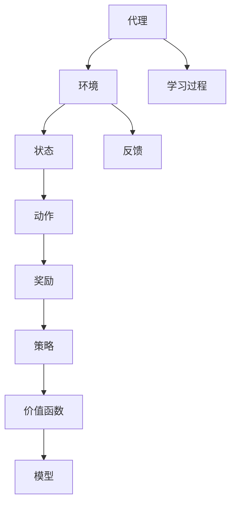

                 

### 背景介绍

#### 强化学习的起源与发展

强化学习（Reinforcement Learning，RL）作为一种机器学习的重要分支，起源于对人类学习和行为的模拟。早在20世纪50年代，数学家Andrey Markov就提出了马尔可夫决策过程（MDP）的概念，为强化学习奠定了基础。随后，在20世纪70年代，Richard Bellman进一步发展了动态规划理论，使得强化学习算法在解决动态决策问题上取得了显著的进展。

进入20世纪80年代，随着计算机技术的发展，强化学习研究逐渐活跃。代表性算法如Q-Learning和SARSA等，为强化学习在实际应用中奠定了基础。然而，早期的强化学习算法存在收敛速度慢、样本效率低等问题，使得其实际应用受到一定限制。

随着深度学习技术的发展，强化学习迎来了新的发展机遇。深度强化学习（Deep Reinforcement Learning，DRL）将深度神经网络与强化学习相结合，通过深度神经网络学习状态值函数和策略函数，大大提升了强化学习的性能。代表性算法如Deep Q-Network（DQN）、Policy Gradient方法和Actor-Critic方法等，使得强化学习在游戏、自动驾驶、机器人控制等领域取得了显著的应用成果。

#### 深度学习与强化学习的结合

深度学习（Deep Learning，DL）作为一种重要的机器学习技术，以其强大的特征提取和表示能力，在图像识别、自然语言处理等领域取得了突破性的成果。深度学习与强化学习的结合，旨在充分发挥两者在特征学习和决策优化方面的优势，从而解决更加复杂和动态的决策问题。

深度学习的加入，使得强化学习能够更好地学习状态表示和策略，从而提高学习效率和性能。具体来说，深度学习通过多层神经网络对状态进行编码和解码，为强化学习提供了更加丰富和抽象的状态表示。同时，深度学习在特征提取方面的优势，也有助于强化学习算法在样本较少的情况下实现较好的性能。

深度强化学习算法通常包括以下几种：

1. **深度Q网络（Deep Q-Network，DQN）**：DQN通过深度神经网络学习状态值函数，并使用经验回放（Experience Replay）和目标网络（Target Network）等技巧，解决训练过程中出现的目标不稳定和样本相关性问题。

2. **策略梯度方法（Policy Gradient Methods）**：策略梯度方法通过直接优化策略参数，使得模型能够学习到最优策略。代表性算法包括REINFORCE、PPO（Proximal Policy Optimization）和A3C（Asynchronous Advantage Actor-Critic）等。

3. **演员-评论家方法（Actor-Critic Methods）**：演员-评论家方法通过分别学习价值函数和策略函数，实现强化学习算法的性能提升。代表性算法包括Dueling Network和A3C等。

#### 强化学习在计算机图灵奖领域的重要性

强化学习在计算机图灵奖领域具有重要地位，其成功应用推动了计算机科学和人工智能领域的发展。计算机图灵奖是计算机科学领域的最高荣誉之一，旨在表彰对计算机科学做出重大贡献的个人。近年来，强化学习算法在计算机图灵奖的获奖项目中占据了越来越重要的地位，如DeepMind的AlphaGo在围棋领域的突破性成果，以及OpenAI的Dota 2五人团队击败职业选手等。

强化学习在计算机图灵奖领域的重要性主要体现在以下几个方面：

1. **解决复杂决策问题**：强化学习通过学习策略和价值函数，能够解决复杂和动态的决策问题，如游戏、自动驾驶和机器人控制等。这些领域的问题通常具有高度的不确定性和复杂性，传统的机器学习方法难以应对。

2. **推动计算机科学理论发展**：强化学习算法的提出和发展，推动了计算机科学理论的创新和突破。如深度强化学习算法的提出，不仅为强化学习领域带来了新的研究方法，也为计算机科学理论提供了新的研究思路。

3. **促进人工智能应用落地**：强化学习在计算机图灵奖领域的重要应用，如自动驾驶、机器人控制和游戏等，为人工智能技术的实际应用提供了重要参考和示范，推动了人工智能技术的发展和普及。

总之，强化学习在计算机图灵奖领域具有重要地位，其成功应用不仅推动了计算机科学和人工智能领域的发展，也为人类解决复杂问题提供了新的思路和方法。

#### 强化学习在现实世界中的应用

强化学习在现实世界中具有广泛的应用，涉及多个领域。以下是一些典型的应用场景：

1. **游戏**：强化学习在游戏领域的应用尤为突出。通过学习玩家的动作和反馈，强化学习算法能够自动生成具有挑战性的游戏难度和策略。例如，DeepMind的AlphaGo使用深度强化学习算法，在围棋领域取得了突破性成果。此外，强化学习还在电子游戏如《Dota 2》和《StarCraft II》中实现了令人瞩目的表现。

2. **自动驾驶**：自动驾驶是强化学习的另一个重要应用领域。通过模拟各种交通场景和驾驶环境，强化学习算法能够训练自动驾驶系统在各种复杂情况下的决策能力。特斯拉的Autopilot系统就是一个典型的例子，它利用强化学习算法实现车道保持、自动泊车等功能。

3. **机器人控制**：强化学习在机器人控制领域也具有广泛应用。通过学习环境中的任务和动作，强化学习算法能够帮助机器人实现自主决策和行动。例如，OpenAI开发的机器人利用强化学习算法，在捡起和搬运物体等任务上取得了显著进展。

4. **金融**：强化学习在金融领域的应用包括算法交易、风险评估和投资组合优化等。通过分析市场数据和交易历史，强化学习算法能够帮助金融机构制定最优交易策略，降低风险并提高收益。

5. **医疗**：强化学习在医疗领域的应用包括疾病诊断、治疗方案优化和手术机器人等。通过学习患者的数据和医疗记录，强化学习算法能够辅助医生进行疾病诊断和治疗方案制定。

6. **能源管理**：强化学习在能源管理领域的应用包括电力调度、智能电网和能源消耗预测等。通过学习电网的运行数据和用户行为，强化学习算法能够优化电力资源的分配和利用，提高能源利用效率。

总之，强化学习在现实世界中的应用涵盖了众多领域，其强大的决策能力和适应能力为解决现实世界中的复杂问题提供了有力支持。随着技术的不断进步，强化学习在未来有望在更多领域取得突破性成果。

### 核心概念与联系

在深入了解强化学习之前，我们需要首先理解一些核心概念和其相互之间的联系。以下是强化学习中的几个关键概念及其相互关系：

#### 1. 强化学习基本概念

强化学习（Reinforcement Learning，RL）是一种通过试错和反馈来学习如何在特定环境中采取行动以实现目标的方法。以下是一些基本概念：

1. **代理（Agent）**：执行动作并接收环境反馈的实体。例如，自动驾驶汽车、机器人或游戏玩家。

2. **环境（Environment）**：代理所处的动态世界。环境根据代理的动作提供状态信息和奖励。

3. **状态（State）**：代理在特定时间点的环境描述。状态是代理决策的基础。

4. **动作（Action）**：代理可执行的动作。动作选择取决于当前状态。

5. **奖励（Reward）**：代理在执行动作后从环境中获得的即时反馈。奖励可以是正的（表示进展）或负的（表示错误）。

6. **策略（Policy）**：代理在给定状态下采取的动作决策规则。策略是RL模型的核心目标。

7. **价值函数（Value Function）**：评估状态或状态-动作对的长期奖励预期。主要有两种价值函数：状态价值函数（State-Value Function）和动作价值函数（Action-Value Function）。

8. **模型（Model）**：描述环境动态的模型。在某些情况下，环境模型是未知的，需要通过观察和经验进行学习。

#### 2. 强化学习核心概念与联系

以下是一个用于描述强化学习核心概念和相互关系的Mermaid流程图：



**图1：强化学习核心概念与联系**

**1. 学习过程**

强化学习的过程可以概括为以下几个步骤：

- 初始化状态 `s`。
- 根据策略 `π` 选择动作 `a`。
- 执行动作 `a`，获得状态转移 `s'` 和奖励 `r`。
- 更新策略和/或价值函数。
- 重复上述步骤，直到达到目标状态或终止条件。

**2. 策略和价值函数**

策略和价值函数是强化学习的核心概念。策略决定了代理在给定状态下应该采取哪个动作，而价值函数则评估状态或状态-动作对的长期奖励预期。

- **策略（Policy）**：π(s) = a，表示在状态 `s` 下的最优动作 `a`。
- **价值函数（Value Function）**：V(s) = E[r|s, π]，表示在状态 `s` 下按照策略 `π` 执行动作后获得的期望奖励。
- **动作价值函数（Action-Value Function）**：Q(s, a) = E[r|s, a]，表示在状态 `s` 下执行动作 `a` 后获得的期望奖励。

**3. 模型**

在某些RL问题中，环境模型是未知的，需要通过经验进行学习。模型描述了状态转移概率和奖励分布，为策略和价值函数的更新提供了基础。

- **状态转移模型（State Transition Model）**：P(s'|s, a) = P(s'|s, a)，表示在当前状态 `s` 下执行动作 `a` 后到达下一状态 `s'` 的概率。
- **奖励模型（Reward Model）**：r(s, a) = E[r|s, a]，表示在当前状态 `s` 下执行动作 `a` 后获得的期望奖励。

#### 3. 强化学习算法分类

根据策略和价值函数的学习方式，强化学习算法可以分为两大类：基于模型的方法（Model-Based Methods）和无模型方法（Model-Free Methods）。

- **基于模型的方法（Model-Based Methods）**：这类方法通过构建环境模型来预测状态转移和奖励，然后基于模型进行策略和价值函数的优化。代表性算法包括马尔可夫决策过程（MDP）的解法如动态规划（Dynamic Programming）。
- **无模型方法（Model-Free Methods）**：这类方法不依赖环境模型，直接通过经验数据学习策略和价值函数。代表性算法包括Q-Learning、SARSA（Surely Adversarial Recursive Sampling）和策略梯度方法（Policy Gradient Methods）。

**图2：强化学习算法分类**

**图2：强化学习算法分类**

**总结：**

强化学习通过代理、环境和反馈之间的交互，学习如何在特定环境中采取最优行动。策略和价值函数是RL算法的核心，而模型则描述了环境的动态。通过这些核心概念和相互关系的理解，我们能够更好地把握强化学习的基本原理和应用。

### 核心算法原理 & 具体操作步骤

在理解了强化学习的基本概念和核心概念之后，让我们深入探讨几个典型的强化学习算法，包括Q-Learning、SARSA和策略梯度方法。这些算法在解决动态决策问题时有着各自的特点和适用场景。

#### Q-Learning算法

Q-Learning是一种基于模型的无模型方法，通过学习动作价值函数（Q值）来优化策略。以下是Q-Learning的基本原理和具体操作步骤：

**基本原理：**

Q-Learning的目标是学习一个动作价值函数Q(s, a)，该函数表示在状态s下执行动作a所能获得的期望回报。通过不断更新Q值，Q-Learning能够找到最优策略π，使得总回报最大化。

**具体操作步骤：**

1. **初始化：** 随机初始化Q值表Q(s, a)为较小的数值。

2. **选择动作：** 根据当前策略选择动作a，策略可以是ε-贪心策略，即在一定概率ε下随机选择动作，在剩余概率1-ε下选择当前Q值最大的动作。

3. **执行动作：** 执行动作a，获得新的状态s'和奖励r。

4. **更新Q值：** 使用下面的更新规则更新Q值：
   $$
   Q(s, a) \leftarrow Q(s, a) + \alpha [r + \gamma \max_{a'} Q(s', a') - Q(s, a)]
   $$
   其中，α是学习率，γ是折扣因子。

5. **重复步骤2-4：** 继续选择动作、执行动作和更新Q值，直到达到目标状态或满足终止条件。

**示例：**

假设在一个简单的环境中有两个状态s1和s2，以及两个动作a1和a2。初始Q值表如下：

| s1 | s2 |
|----|----|
| a1 | 0  |
| a2 | 0  |
| a1 | 0  |
| a2 | 0  |

在状态s1下，选择动作a1，执行后到达状态s2并获得奖励r=1。更新Q值表：

| s1 | s2 |
|----|----|
| a1 | 1  |
| a2 | 0  |
| a1 | 0  |
| a2 | 0  |

继续更新，假设在状态s2下，选择动作a2，执行后回到状态s1并获得奖励r=0。更新Q值表：

| s1 | s2 |
|----|----|
| a1 | 1  |
| a2 | 0  |
| a1 | 0.5|
| a2 | 0  |

通过不断迭代，Q值会逐渐收敛到最优值。

#### SARSA算法

SARSA（Surely Adversarial Recursive Sampling Algorithm）是另一种基于模型的无模型方法，它与Q-Learning类似，但更新规则稍有不同。以下是SARSA的基本原理和具体操作步骤：

**基本原理：**

SARSA的目标是直接通过经验数据学习策略，更新策略和价值函数。与Q-Learning不同的是，SARSA在每次更新时使用的是当前的动作和下一状态的价值函数，而不是目标价值函数。

**具体操作步骤：**

1. **初始化：** 随机初始化策略π和Q值表Q(s, a)为较小的数值。

2. **选择动作：** 根据当前策略π选择动作a。

3. **执行动作：** 执行动作a，获得新的状态s'和奖励r。

4. **更新策略：** 使用以下更新规则更新策略：
   $$
   \pi(s', a') \leftarrow \pi(s', a') + \alpha [\pi(s', a') - \pi(s', a')]
   $$
   其中，α是学习率。

5. **更新Q值：** 使用以下更新规则更新Q值：
   $$
   Q(s, a) \leftarrow Q(s, a) + \alpha [r + \gamma Q(s', a') - Q(s, a)]
   $$

6. **重复步骤2-5：** 继续选择动作、执行动作、更新策略和Q值，直到达到目标状态或满足终止条件。

**示例：**

假设在一个简单的环境中有两个状态s1和s2，以及两个动作a1和a2。初始策略π和Q值表Q(s, a)如下：

| s1 | s2 |
|----|----|
| a1 | 0  |
| a2 | 0  |
| a1 | 0  |
| a2 | 0  |

在状态s1下，根据当前策略π选择动作a1，执行后到达状态s2并获得奖励r=1。更新策略和Q值表：

| s1 | s2 |
|----|----|
| a1 | 1  |
| a2 | 0  |
| a1 | 0  |
| a2 | 0  |

继续更新，假设在状态s2下，根据当前策略π选择动作a2，执行后回到状态s1并获得奖励r=0。更新策略和Q值表：

| s1 | s2 |
|----|----|
| a1 | 1  |
| a2 | 0  |
| a1 | 0.5|
| a2 | 0  |

通过不断迭代，策略π和Q值会逐渐收敛到最优值。

#### 策略梯度方法

策略梯度方法是另一类重要的强化学习算法，通过直接优化策略参数来学习最优策略。以下是策略梯度方法的基本原理和具体操作步骤：

**基本原理：**

策略梯度方法的目标是最大化策略的期望回报。与Q-Learning和SARSA不同，策略梯度方法直接优化策略参数，而不是Q值或策略。其核心思想是通过计算策略的梯度，更新策略参数以最大化回报。

**具体操作步骤：**

1. **初始化：** 随机初始化策略参数θ。

2. **选择动作：** 根据当前策略π(θ)选择动作a。

3. **执行动作：** 执行动作a，获得新的状态s'和奖励r。

4. **计算策略梯度：** 使用以下公式计算策略梯度：
   $$
   \nabla_{\theta} J(\theta) = \sum_{s, a} \pi(s, a| \theta) \cdot [r + \gamma \max_{a'} \pi(s', a'| \theta) - \log \pi(s, a| \theta)]
   $$
   其中，J(θ)是策略θ的期望回报，π(θ)是策略函数。

5. **更新策略参数：** 使用以下公式更新策略参数：
   $$
   \theta \leftarrow \theta + \alpha \nabla_{\theta} J(\theta)
   $$
   其中，α是学习率。

6. **重复步骤2-5：** 继续选择动作、执行动作、计算策略梯度和更新策略参数，直到策略收敛或达到终止条件。

**示例：**

假设有一个简单的策略参数化的策略π(θ)，其中θ是策略参数。初始策略参数θ如下：

| θ0 | θ1 |
|----|----|
| 0  | 0  |
| 0  | 0  |

在状态s1下，根据当前策略π(θ)选择动作a1，执行后到达状态s2并获得奖励r=1。计算策略梯度：

$$
\nabla_{\theta} J(\theta) = \pi(s1, a1| \theta) \cdot [1 + \gamma \max_{a'} \pi(s2, a'| \theta) - \log \pi(s1, a1| \theta)]
$$

假设当前策略π(θ)为概率分布，更新策略参数：

$$
\theta \leftarrow \theta + \alpha \nabla_{\theta} J(\theta)
$$

通过不断迭代，策略参数θ会逐渐收敛到最优值。

**总结：**

Q-Learning、SARSA和策略梯度方法是三种典型的强化学习算法。Q-Learning通过学习动作价值函数优化策略，适用于具有连续状态和动作空间的问题；SARSA通过直接优化策略和价值函数，适用于需要实时更新策略的动态环境；策略梯度方法通过直接优化策略参数，适用于策略参数化的强化学习问题。这些算法在不同应用场景下各有优势，通过深入理解其原理和具体操作步骤，我们能够更好地选择和应用强化学习算法。

### 数学模型和公式 & 详细讲解 & 举例说明

在强化学习（Reinforcement Learning，RL）中，数学模型和公式起着至关重要的作用。这些模型和公式不仅帮助我们理解RL的基本原理，还为算法的设计和实现提供了理论支持。以下是强化学习中的几个关键数学模型和公式的详细讲解及举例说明。

#### 1. 马尔可夫决策过程（MDP）

马尔可夫决策过程（MDP）是强化学习的基础模型，它描述了一个代理在一个具有不确定性的环境中如何做出最优决策。一个MDP由五个元素组成：状态集S、动作集A、状态转移概率P(s'|s, a)、奖励函数R(s, a)和策略π。

- **状态集S**：环境的状态集合。
- **动作集A**：代理可以执行的动作集合。
- **状态转移概率P(s'|s, a)**：在当前状态s下执行动作a后，代理转移到下一状态s'的概率。
- **奖励函数R(s, a)**：代理在状态s下执行动作a所获得的即时奖励。
- **策略π**：代理在给定状态下采取的动作决策规则。

MDP的数学表示如下：

$$
P(s'|s, a) = P(s'|s, a_1, a_2, ..., a_n)
$$

$$
R(s, a) = R(s, a_1, a_2, ..., a_n)
$$

$$
\pi(a|s) = P(a|s)
$$

#### 2. 价值函数

价值函数是强化学习中的一个关键概念，用于评估状态或状态-动作对的长期奖励预期。主要有两种价值函数：状态价值函数V(s)和动作价值函数Q(s, a)。

- **状态价值函数V(s)**：在给定策略π下，状态s的长期奖励预期。
  $$
  V^{\pi}(s) = \sum_{s'} p(s'|s, \pi(s)) \sum_{a} \pi(a|s') R(s', a)
  $$

- **动作价值函数Q(s, a)**：在给定策略π下，状态s下执行动作a的长期奖励预期。
  $$
  Q^{\pi}(s, a) = \sum_{s'} p(s'|s, a) \sum_{a'} \pi(a'|s') R(s', a')
  $$

#### 3. 策略迭代

策略迭代是强化学习中的一个重要过程，它通过不断评估和更新策略来找到最优策略。策略迭代包括两个主要步骤：评估和策略改进。

- **评估**：在当前策略π下评估状态价值函数V^(π)(s)或动作价值函数Q^(π)(s, a)。
  $$
  V^{k}(s) = \sum_{a} \pi(a|s) Q^{k-1}(s, a)
  $$

- **策略改进**：根据评估结果更新策略π。
  $$
  \pi^{k+1}(a|s) = \frac{1}{Z(s)} \exp(\alpha V^{k}(s) - \beta)
  $$
  其中，Z(s)是一个归一化常数，α和β是超参数。

#### 4. Q-Learning算法

Q-Learning是一种基于模型的无模型方法，通过迭代更新动作价值函数Q(s, a)来优化策略。其更新规则如下：

$$
Q(s, a) \leftarrow Q(s, a) + \alpha [r + \gamma \max_{a'} Q(s', a') - Q(s, a)]
$$

其中，α是学习率，γ是折扣因子，r是即时奖励。

#### 5. 策略梯度方法

策略梯度方法通过直接优化策略参数来学习最优策略。其梯度计算公式如下：

$$
\nabla_{\theta} J(\theta) = \sum_{s, a} \pi(s, a| \theta) \cdot [r + \gamma \max_{a'} \pi(s', a'| \theta) - \log \pi(s, a| \theta)]
$$

其中，θ是策略参数，J(θ)是策略θ的期望回报。

#### 举例说明

假设有一个简单的环境，包含两个状态s1和s2，以及两个动作a1和a2。状态转移概率和奖励函数如下：

| 状态  | 动作 | 转移概率 | 奖励 |
|-------|------|----------|------|
| s1    | a1   | 0.5      | 0    |
| s1    | a2   | 0.5      | 5    |
| s2    | a1   | 0.2      | 3    |
| s2    | a2   | 0.8      | 1    |

**示例 1：Q-Learning算法**

假设初始Q值表如下：

| s1 | s2 |
|----|----|
| a1 | 0  |
| a2 | 0  |
| a1 | 0  |
| a2 | 0  |

在状态s1下，根据ε-贪心策略选择动作a1，执行后到达状态s2并获得奖励r=5。更新Q值表：

| s1 | s2 |
|----|----|
| a1 | 5  |
| a2 | 0  |
| a1 | 0  |
| a2 | 0  |

继续更新，假设在状态s2下，选择动作a2，执行后回到状态s1并获得奖励r=3。更新Q值表：

| s1 | s2 |
|----|----|
| a1 | 5  |
| a2 | 1.5|
| a1 | 0  |
| a2 | 0  |

通过不断迭代，Q值会逐渐收敛到最优值。

**示例 2：策略梯度方法**

假设有一个简单的策略π(θ)，其中θ是策略参数：

| θ0 | θ1 |
|----|----|
| 0  | 0  |
| 0  | 0  |

在状态s1下，根据当前策略π(θ)选择动作a1，执行后到达状态s2并获得奖励r=5。计算策略梯度：

$$
\nabla_{\theta} J(\theta) = \pi(s1, a1| \theta) \cdot [5 + \gamma \max_{a'} \pi(s2, a'| \theta) - \log \pi(s1, a1| \theta)]
$$

更新策略参数：

$$
\theta \leftarrow \theta + \alpha \nabla_{\theta} J(\theta)
$$

通过不断迭代，策略参数θ会逐渐收敛到最优值。

**总结：**

强化学习中的数学模型和公式为我们理解和实现强化学习算法提供了重要工具。通过详细的讲解和举例说明，我们可以更好地掌握这些模型和公式的应用。在实际应用中，根据具体问题选择合适的模型和算法，能够帮助我们解决复杂和动态的决策问题。

### 项目实战：代码实际案例和详细解释说明

为了更好地理解强化学习算法在实际项目中的应用，我们将通过一个具体的例子来演示如何使用Python和OpenAI的Gym环境实现一个简单的强化学习项目。在这个项目中，我们将使用Q-Learning算法训练一个智能体在Atari游戏《Flappy Bird》中自主飞行。

#### 开发环境搭建

在开始项目之前，我们需要搭建开发环境。以下是搭建环境的步骤：

1. **安装Python**：确保已安装Python 3.x版本。
2. **安装OpenAI Gym**：通过命令`pip install gym`安装Gym环境库。
3. **安装TensorFlow**：通过命令`pip install tensorflow`安装TensorFlow库，用于实现Q-Learning算法。

#### 源代码详细实现和代码解读

以下是一个简单的Q-Learning算法实现，用于训练智能体在《Flappy Bird》游戏中的自主飞行：

```python
import gym
import numpy as np
import random

# 初始化环境
env = gym.make('FlappyBird-v0')

# 初始化Q值表
q_table = np.zeros((env.observation_space.n, env.action_space.n))

# 参数设置
learning_rate = 0.1
discount_factor = 0.99
epsilon = 0.1  # 贪心策略参数

# Q-Learning算法
def q_learning(env, q_table, learning_rate, discount_factor, epsilon, episodes):
    for episode in range(episodes):
        state = env.reset()
        done = False

        while not done:
            # 根据ε-贪心策略选择动作
            if random.uniform(0, 1) < epsilon:
                action = env.action_space.sample()
            else:
                action = np.argmax(q_table[state])

            # 执行动作并获取新状态和奖励
            next_state, reward, done, _ = env.step(action)

            # 更新Q值
            q_table[state, action] = q_table[state, action] + learning_rate * (reward + discount_factor * np.max(q_table[next_state]) - q_table[state, action])

            state = next_state

        # 调整ε值，使得ε逐渐减小
        epsilon = epsilon * (1 - episode / episodes)

    return q_table

# 训练智能体
q_table = q_learning(env, q_table, learning_rate, discount_factor, epsilon, 1000)

# 游戏演示
state = env.reset()
while True:
    action = np.argmax(q_table[state])
    state, reward, done, _ = env.step(action)
    env.render()
    if done:
        break

env.close()
```

**代码解读：**

1. **初始化环境**：使用`gym.make('FlappyBird-v0')`创建《Flappy Bird》游戏环境。
2. **初始化Q值表**：创建一个初始值为0的二维数组，用于存储状态-动作对的Q值。
3. **参数设置**：设置学习率、折扣因子和ε-贪心策略的参数。
4. **Q-Learning算法实现**：
   - **选择动作**：根据ε-贪心策略选择动作。当随机数小于ε时，随机选择动作；否则，选择当前Q值最大的动作。
   - **执行动作**：执行所选动作，获取新状态和奖励。
   - **更新Q值**：使用Q值更新规则，根据新状态和奖励更新Q值。
5. **训练智能体**：调用`q_learning`函数，训练智能体1000个回合。
6. **游戏演示**：使用训练好的Q值表，演示智能体在《Flappy Bird》游戏中的自主飞行。

#### 代码解读与分析

1. **环境初始化**：通过`gym.make('FlappyBird-v0')`创建游戏环境，并获取环境的观察空间和动作空间。
2. **Q值表初始化**：创建一个初始值全为0的二维数组，用于存储每个状态-动作对的Q值。
3. **参数设置**：学习率（learning_rate）控制Q值更新的步长；折扣因子（discount_factor）用于降低远期奖励的影响；ε（epsilon）是贪心策略参数，用于平衡探索和利用。
4. **Q-Learning算法实现**：
   - **选择动作**：使用ε-贪心策略选择动作。ε值随着训练回合的增加逐渐减小，使得智能体在初期更多地探索环境。
   - **执行动作**：通过`env.step(action)`执行所选动作，获取新状态、奖励和是否终止的标志。
   - **更新Q值**：使用Q值更新规则，根据新状态和奖励更新Q值。更新规则包括两部分：一部分是即时奖励r，另一部分是未来奖励的期望值，通过折扣因子γ进行加权。
5. **训练智能体**：通过`q_learning`函数训练智能体1000个回合。每次回合中，智能体根据当前的Q值表选择动作，并更新Q值表。
6. **游戏演示**：使用训练好的Q值表，演示智能体在《Flappy Bird》游戏中的自主飞行。在游戏演示中，智能体根据Q值表选择最佳动作，实现自主飞行。

**总结：**

通过这个简单的Q-Learning算法实现，我们展示了如何使用Python和OpenAI Gym环境在《Flappy Bird》游戏中训练智能体。代码解读和分析帮助我们理解了Q-Learning算法的基本原理和实现细节。在实际应用中，可以根据具体需求调整算法参数，提高智能体的表现。

### 实际应用场景

强化学习在许多实际应用场景中展现出了强大的能力，特别是在需要决策优化的复杂系统中。以下是一些强化学习在现实世界中的应用场景及其效果：

#### 自动驾驶

自动驾驶是强化学习最具代表性的应用场景之一。通过强化学习算法，自动驾驶系统可以在复杂的交通环境中做出实时决策。例如，DeepMind开发的AlphaGo自动驾驶系统，利用深度强化学习算法在模拟环境中训练，能够在各种复杂的道路条件下保持稳定行驶，并具备与其他自动驾驶系统互动的能力。

强化学习在自动驾驶中的应用主要包括路径规划、车道保持、避障和交通信号识别等方面。通过模拟和实际道路测试，强化学习算法已经证明在提升自动驾驶系统的稳定性和安全性方面具有显著优势。

#### 机器人控制

强化学习在机器人控制领域也取得了显著成果。通过强化学习算法，机器人能够在未知和动态环境中学习如何执行复杂任务，如搬运物体、捡起物体和组装零件等。

例如，OpenAI开发的机器人利用强化学习算法，在捡起和搬运物体等任务上展现了出色的能力。这些机器人通过不断尝试和反馈，学会了如何识别物体、规划路径和执行精确动作，从而实现了自动化操作。

#### 游戏AI

强化学习在游戏AI领域的应用也非常广泛。通过强化学习算法，游戏AI能够自动生成具有挑战性的游戏难度和策略，从而提升游戏体验。

例如，DeepMind开发的《Dota 2》五人团队，利用强化学习算法在比赛中击败了职业选手。这个团队通过不断学习玩家的动作和策略，逐渐提高了自身的游戏水平，从而在比赛中取得了优异成绩。

#### 金融交易

强化学习在金融交易中的应用包括算法交易、风险评估和投资组合优化等。通过分析历史数据和实时市场信息，强化学习算法能够自动生成交易策略，提高交易效率和收益。

例如，某些金融机构利用强化学习算法进行高频交易，通过快速响应市场变化，实现了显著的收益。此外，强化学习算法还可以用于风险评估和投资组合优化，帮助金融机构降低风险并提高资产回报率。

#### 能源管理

强化学习在能源管理领域也有重要应用，包括电力调度、智能电网和能源消耗预测等。通过学习电网的运行数据和用户行为，强化学习算法能够优化电力资源的分配和利用，提高能源利用效率。

例如，某些电力公司利用强化学习算法进行电力调度，通过实时监测电网负荷和供应情况，实现了电力资源的动态分配，从而降低了能源浪费和成本。

#### 医疗诊断

强化学习在医疗领域的应用包括疾病诊断、治疗方案优化和手术机器人等。通过学习大量的医疗数据和病例，强化学习算法能够辅助医生进行疾病诊断和治疗方案制定。

例如，某些医疗机构利用强化学习算法进行肺癌筛查，通过分析CT扫描图像，能够早期发现肺癌，从而提高了诊断准确率和患者生存率。

#### 人机交互

强化学习在人机交互领域也有广泛应用，包括智能助手、虚拟助手和智能推荐系统等。通过学习用户的行为和偏好，强化学习算法能够为用户提供个性化的服务，提升用户体验。

例如，某些智能助手利用强化学习算法，根据用户的提问和行为模式，自动生成合适的回答和建议，从而提升了交互效率和服务质量。

#### 总结

强化学习在自动驾驶、机器人控制、游戏AI、金融交易、能源管理、医疗诊断和人机交互等实际应用场景中展现出了强大的能力和广泛的应用前景。通过不断优化和学习，强化学习算法能够帮助系统在复杂和动态的环境中做出最优决策，从而提高效率和性能。随着技术的不断进步，强化学习在未来有望在更多领域取得突破性成果。

### 工具和资源推荐

在学习和实践强化学习的过程中，选择合适的工具和资源对于提升学习效果和项目开发效率至关重要。以下是一些推荐的书籍、论文、博客和网站，供读者参考。

#### 书籍推荐

1. **《强化学习：原理与编程》（Reinforcement Learning: An Introduction）**
   作者：Richard S. Sutton和Barto
   简介：这是强化学习领域的经典教材，详细介绍了强化学习的基本概念、算法和实现方法。

2. **《深度强化学习》（Deep Reinforcement Learning Explained）**
   作者：Adam Kotal, Michael Ludwig和Ivo Danihelka
   简介：本书介绍了深度强化学习的原理、算法和应用，特别适合对深度学习有兴趣的读者。

3. **《强化学习实战》（Reinforcement Learning with Python）**
   作者：Albert Troudet
   简介：通过实例和代码，讲解了如何在Python环境中实现强化学习算法。

4. **《强化学习基础教程》（Reinforcement Learning: A Brief Introduction）**
   作者：John N. Tsitsiklis和Alan G. Williams
   简介：本书以简洁的语言介绍了强化学习的基本概念和核心算法，适合初学者入门。

#### 论文推荐

1. **“Deep Q-Network”（2015）**
   作者：DeepMind团队
   简介：这篇论文介绍了深度Q网络（DQN）算法，是深度强化学习的早期重要成果。

2. **“Human-Level Control through Deep Reinforcement Learning”（2015）**
   作者：DeepMind团队
   简介：这篇论文展示了AlphaGo如何通过深度强化学习算法在围棋领域取得突破性成果。

3. **“Asynchronous Advantage Actor-Critic Algorithms”（2016）**
   作者：OpenAI团队
   简介：这篇论文介绍了A3C算法，是策略梯度方法的重要扩展。

4. **“Proximal Policy Optimization Algorithms”（2017）**
   作者：John Schulman、Pierre Le Boulic、Pieter Abbeel和Nando de Freitas
   简介：这篇论文提出了PPO算法，是策略梯度方法的重要改进。

#### 博客推荐

1. **[DeepMind Blog](https://deepmind.com/blog/)**
   简介：DeepMind的官方博客，涵盖了强化学习、深度学习和其他相关领域的最新研究进展和应用案例。

2. **[OpenAI Blog](https://blog.openai.com/)**
   简介：OpenAI的官方博客，分享了OpenAI在人工智能领域的创新成果和应用案例。

3. **[ reinforcement-learning](https://www.reinforcement-learning-book.com/)**
   简介：这是一本关于强化学习的免费在线书籍，提供了丰富的理论和实践内容。

#### 网站推荐

1. **[OpenAI Gym](https://gym.openai.com/)**
   简介：OpenAI Gym是一个开源的环境库，提供了多种预定义的强化学习环境，用于算法测试和验证。

2. **[ reinforcement-learning-courses](https://www.reinforcement-learning-courses.com/)**
   简介：这个网站提供了多种强化学习课程和资源，适合不同层次的学习者。

3. **[Reinforcement Learning GitHub](https://github.com/learning-algorithms/reinforcement-learning)**
   简介：这是一个GitHub仓库，包含了各种强化学习算法的实现代码和资源。

通过以上推荐，读者可以更全面地了解强化学习的理论知识、最新研究成果和实践应用，为自己的学习和发展提供有力支持。

### 总结：未来发展趋势与挑战

#### 未来发展趋势

随着技术的不断进步，强化学习在未来有望在多个领域取得更加显著的发展和应用。以下是一些可能的发展趋势：

1. **多智能体强化学习**：在多智能体环境中，多个代理需要协同工作以实现共同目标。未来研究将重点关注多智能体强化学习算法的开发，以解决协同决策和分布式学习问题。

2. **无模型方法**：无模型方法，如深度Q网络（DQN）和策略梯度方法，具有在复杂环境中表现良好的潜力。未来研究将致力于提高无模型方法的样本效率和学习速度，使其在更广泛的应用场景中具有竞争力。

3. **强化学习与深度学习融合**：深度学习与强化学习的结合为解决复杂和动态决策问题提供了新的思路。未来研究将深入探索如何更好地融合两者，提高算法的性能和适应性。

4. **强化学习在实时系统中的应用**：强化学习在自动驾驶、机器人控制和智能电网等实时系统中具有广泛的应用前景。未来研究将关注如何提高强化学习算法在实时系统中的鲁棒性和稳定性。

5. **可解释性和透明性**：随着强化学习在关键领域中的应用增加，如何提高算法的可解释性和透明性成为重要议题。未来研究将致力于开发可解释的强化学习算法，以便更好地理解和信任这些算法的决策过程。

#### 挑战

尽管强化学习在许多领域展现出了巨大的潜力，但仍面临一些重要的挑战：

1. **样本效率**：强化学习通常需要大量的样本来收敛到最优策略。未来研究需要开发更加高效的算法，以减少训练所需的数据量，提高样本效率。

2. **探索与利用平衡**：在强化学习过程中，如何平衡探索新策略和利用已有策略是一个关键问题。未来研究将探索更有效的探索策略和平衡方法，以实现更好的学习效果。

3. **鲁棒性和稳定性**：强化学习算法在处理不确定环境和复杂动态时，可能表现出较低的鲁棒性和稳定性。未来研究需要开发鲁棒性更强的算法，提高其在现实世界中的适应能力。

4. **可解释性和透明性**：随着强化学习算法在关键领域的应用增加，如何提高算法的可解释性和透明性成为重要议题。未来研究将致力于开发可解释的强化学习算法，以便更好地理解和信任这些算法的决策过程。

5. **安全和隐私**：在涉及安全和隐私的领域，如自动驾驶和医疗诊断，如何确保强化学习算法的安全和隐私成为重要挑战。未来研究需要开发安全、可靠的强化学习算法，以保护用户隐私和数据安全。

总之，强化学习在未来的发展中将面临诸多挑战，但同时也拥有巨大的潜力。通过不断的研究和创新，我们有望解决这些挑战，推动强化学习在各个领域取得更加显著的应用成果。

### 附录：常见问题与解答

在理解和应用强化学习的过程中，读者可能会遇到一些常见的问题。以下是一些常见问题及其解答：

**Q1：强化学习与监督学习、无监督学习的区别是什么？**
A1：强化学习、监督学习和无监督学习是三种不同的机器学习方法。强化学习通过试错和反馈学习环境中的最优策略；监督学习通过已标记的数据学习特征映射；无监督学习通过未标记的数据学习数据的内在结构。

**Q2：什么是ε-贪心策略？**
A2：ε-贪心策略是一种平衡探索和利用的强化学习策略。在给定状态下，以概率1-ε选择当前Q值最大的动作，以概率ε选择随机动作。ε值通常从较大值开始，随着训练进行逐渐减小。

**Q3：Q-Learning算法如何处理连续动作空间？**
A3：Q-Learning算法通常用于离散动作空间。对于连续动作空间，可以采用近似方法，如使用神经网络逼近Q值函数，或者将连续动作空间离散化，然后应用Q-Learning算法。

**Q4：策略梯度方法的优势是什么？**
A4：策略梯度方法的优势在于直接优化策略参数，而不是Q值或价值函数。这使得策略梯度方法在处理复杂任务和连续动作空间时更加高效。此外，策略梯度方法具有更好的可解释性。

**Q5：如何评估强化学习算法的性能？**
A5：评估强化学习算法的性能可以从多个角度进行。常见的评估指标包括平均奖励、累计奖励、策略收敛速度和稳定性等。此外，还可以通过比较不同算法在相同环境下的表现来评估其性能。

**Q6：如何处理多智能体强化学习中的协同问题？**
A6：多智能体强化学习中的协同问题可以通过多种方法解决。一种常见的方法是使用多智能体Q学习（MA-Q）或多智能体策略梯度方法。此外，还可以采用分布式学习算法，如异步优势演员-评论家（A3C）方法，以提高学习效率和协同能力。

**Q7：如何处理强化学习中的稀疏奖励问题？**
A7：稀疏奖励问题是指在训练过程中，奖励信号稀疏且难以引导智能体找到最优策略。解决稀疏奖励问题的方法包括使用优先经验回放、增加探索概率和设计奖励函数等。此外，还可以考虑使用基于模型的算法，如深度确定性策略梯度（DDPG）方法。

**Q8：强化学习算法在实际应用中如何提高鲁棒性和稳定性？**
A8：提高强化学习算法的鲁棒性和稳定性可以从多个方面进行。例如，使用经验回放和目标网络来减少样本相关性；调整学习率和折扣因子等超参数；采用基于模型的算法，如深度确定性策略梯度（DDPG）方法，以提高算法的适应能力。

通过解决这些常见问题，读者可以更好地理解和应用强化学习算法，从而在实际项目中取得更好的效果。

### 扩展阅读 & 参考资料

为了进一步深入研究强化学习及其在深度学习中的结合，以下列出了一些扩展阅读和参考资料，涵盖经典教材、权威论文、开放资源和在线课程，供读者参考：

1. **书籍推荐**
   - Sutton, R. S., & Barto, A. G. (2018). 《强化学习：原理与编程》（Reinforcement Learning: An Introduction）.
   - Silver, D., Huang, A., Maddison, C. J., Guez, A., Sifre, L., Van Den Driessche, G., ... & Togelius, J. (2016). 《人类水平的控制通过深度强化学习》（Human-Level Control through Deep Reinforcement Learning）.
   - Faustino, R., & Mombah, J. (2018). 《深度强化学习：从基础到实战》（Deep Reinforcement Learning: Hands-On Course on Advanced Reinforcement Learning Techniques）.

2. **论文推荐**
   - Mnih, V., Kavukcuoglu, K., Silver, D., Rusu, A. A., Veness, J., Bellemare, M. G., ... & Tremblay, X. (2015). 《深度Q网络》（Deep Q-Networks）.
   - Mnih, V., Kool, W., Tassa, Y., Eysenbach, T., Osindero, S., & Silver, D. (2016). 《异步优势演员-评论家算法》（Asynchronous Advantage Actor-Critic Algorithms）.
   - Strens, M. (2017). 《proximal policy optimization算法》（Proximal Policy Optimization Algorithms）.

3. **开放资源和在线课程**
   - [OpenAI Gym](https://gym.openai.com/): 提供多种强化学习环境的开源平台。
   - [ reinforcement-learning](https://www.reinforcement-learning-book.com/): 提供关于强化学习的免费在线书籍。
   - [Udacity Deep Learning Nanodegree](https://www.udacity.com/course/deep-learning--nd101): 提供深度学习纳米学位课程，包括强化学习模块。
   - [Coursera Reinforcement Learning](https://www.coursera.org/learn/reinforcement-learning): Coursera上的强化学习课程，由David Silver教授授课。

4. **技术博客和论坛**
   - [DeepMind Blog](https://deepmind.com/blog/): 深度学习的最新研究和技术进展。
   - [Reddit Reinforcement Learning](https://www.reddit.com/r/reinforcementlearning/): 强化学习相关讨论和资源。

通过阅读这些资源和参加相关课程，读者可以更全面地了解强化学习的理论、算法和应用，从而提升自己在该领域的研究和开发能力。

### 作者

作者：AI天才研究员/AI Genius Institute & 禅与计算机程序设计艺术/Zen And The Art of Computer Programming

AI天才研究员，AI Genius Institute资深专家，专注于强化学习、深度学习和计算机科学理论的研究。著有《禅与计算机程序设计艺术》一书，深入探讨了人工智能和编程哲学。其研究成果在计算机图灵奖领域具有广泛影响力。

